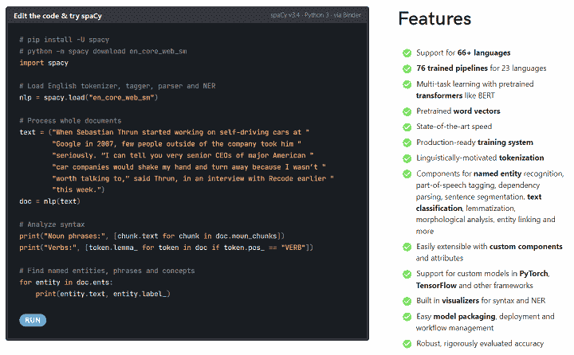
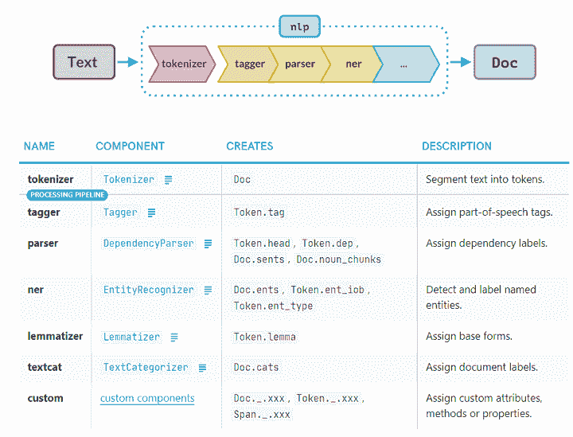

# 使用 spaCy 的 Python 自然语言处理

> 原文：<https://blog.quantinsti.com/spacy-python/>

由[乌迪莎·阿洛克](http://www.linkedin.com/in/udisha-alok)

人类的思维是一个神奇的地方。无数的想法在一瞬间产生，掺杂着各种情绪。许多这样的想法和情绪散布在越来越受欢迎的社交媒体平台的“墙”和“订阅”上。

为了寻找难以捉摸的阿尔法，数据科学家和量化分析师现在已经将注意力转移到处理互联网用户产生的大量“大数据”上。使用程序来理解和分析人类语言被称为自然语言处理。

在这篇文章中，我们将看看 Python 中自然语言处理的流行库之一- **spaCy** 。

我们将讨论的主题有:

*   什么是 spaCy？
*   [如何安装 spaCy？](#how-to-install-spacy)
*   [NLTK vs spaCy](#nltk-vs-spacy)
*   [空间训练管道](#spacy-trained-pipelines)
*   [使用空间的标记化](#tokenization-using-spacy)
*   [使用空间的词汇化](#lemmatization-using-spacy)
*   [使用空格将文本分割成句子](#split-text-into-sentences-using-spacy)
*   [使用空格删除标点符号](#removing-punctuation-using-spacy)
*   [使用空格删除停用词](#removing-punctuation-using-spacy)
*   [使用空间的位置标记](#pos-tagging-using-spacy)
*   [使用空间的命名实体识别](#named-entity-recognition-using-spacy)
*   [使用 displaCy 的依赖性可视化](#dependency-visualization-using-displacy)
*   [使用空间获取语言注释](#getting-linguistic-annotations-using-spacy)
*   [Github 上的空间示例](#spacy-examples-on-github)

* * *

## spaCy 是什么？

spaCy 是一个免费的开源 Python 自然语言处理库。它是 NLP 最受欢迎的两个库之一，另一个是 [NLTK](/nltk/) 。我们将在后面的章节中讨论这两者之间的重要区别。

spaCy [网站](https://spacy.io/)将其描述为“*工业实力自然语言处理*的首选工具。spaCy 提供的丰富特性使其成为 NLP、信息提取和自然语言理解的绝佳选择。

spaCy 的主要优势在于，它被设计为以一种最优且健壮的方式处理大量数据。

* * *

## 如何安装 spaCy？

安装 spaCy 的最简单方法是遵循以下步骤:

*   在您的浏览器上打开 spaCy 网站的这个页面。
*   为操作系统、平台、软件包管理器等选择适当的选项。
*   相应的命令将显示在选项下的黑色面板中。单击黑色面板右下角的“复制”图标，复制安装命令，并将其粘贴到您的终端/命令提示符下。

**注意:**如果您从 Jupyter 笔记本电脑上安装，不要忘记在命令前加上前缀“！”签名。

* * *

## NLTK vs spaCy

[自然语言工具包](https://www.nltk.org/) (NLTK)是最大的自然语言处理库，支持多种语言。让我们比较一下 NLTK 和 spaCy。

| **序列号** | **NLTK** | **空间** |
| 1. | NLTK 主要是为研究而设计的。 | spaCy 是为生产使用而设计的。 |
| 2. | NLTK 提供了对许多语言的支持。 | 目前，spaCy 为 23 种语言提供训练有素的管道，并支持 66 种以上的语言。 |
| 3. | NLTK 遵循一种字符串处理方法，并且具有模块化的体系结构。 | spaCy 遵循面向对象的方法。 |
| 4. | NLTK 提供了大量不同的 NLP 算法，因此是研究和构建创新解决方案的首选。用户可以从特定任务的可用选项中选择特定算法。 | spaCy 为特定任务使用最佳算法。用户不必选择算法。 |
| 5. | NLTK 可以慢一点。 | 空间针对速度进行了优化。 |
| 6. | 它是使用 Python 构建的。 | 它是使用 Cython 构建的。 |

<figure class="kg-card kg-image-card kg-width-full kg-card-hascaption">

<figcaption>[Source](https://spacy.io/)</figcaption>

</figure>

* * *

## 空间训练管道

spaCy 引入了管道的概念。当您通过管道传递文本时，它会经过不同的处理步骤(或管道)。一个步骤(或管道)的输出被送入下一个步骤(或管道)。

spaCy 为不同的[语言](https://spacy.io/usage/models#languages)提供了许多训练有素的管道。通常，经过训练的管道包括标记器、语法分析器、解析器和实体识别器。

我们也可以在 spaCy 中设计自己的定制管道。

<figure class="kg-card kg-image-card kg-width-full kg-card-hascaption">

<figcaption>[Source](https://spacy.io/usage/processing-pipelines)</figcaption>

</figure>

* * *

## spaCy 入门

现在让我们做一些自然语言处理，并在接下来的几节中看看这些组件是如何工作的。

我们需要安装空间和我们想要使用的训练模型。在这篇博客中，我们将使用英语语言的模型 en_core_web_sm。