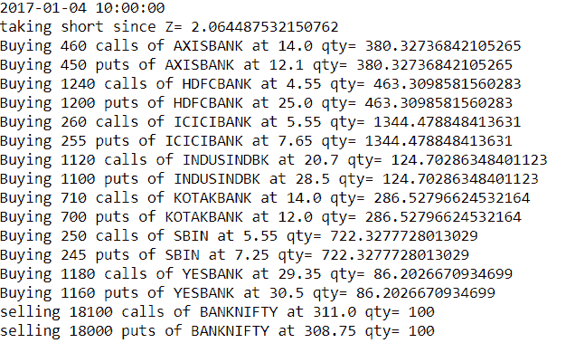
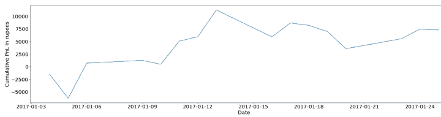

# 印度市场的分散交易策略

> 原文：<https://blog.quantinsti.com/dispersion-trading-strategy-indian-markets-project-karthik-kaushal/>

这个项目证明了统计套利交易中的机会。这种策略是建立在这样一种理念上的，即在指数及其成份股的波动性中存在一些可重复的模式。

我们对隐含波动率和一篮子股票的隐含波动率之间的价差进行建模，这些股票按其在指数中的实际权重进行加权。我们选择 BANKNIFTY 作为指数及其成份股来回测这种策略，也称为分散交易。

最后，我们证明了该策略的损益是正的。回溯测试基于一个月的日内数据，可以扩展到更长的时间。

本文是作者提交的最后一个项目，作为他在 QuantInsti 的算法交易管理课程( [EPAT](https://www.quantinsti.com/epat) )的一部分。请务必查看我们的[项目页面](/tag/epat-trading-projects/)，看看我们的学生正在构建什么。

* * *

## 关于作者

<figure class="kg-card kg-image-card"></figure>

Karthik Kaushal 是一名期权交易员，有 3 年的工作经验。他的职业生涯始于 EY 的一名数据工程师。后来，他追随自己的热情，从专业领域转向了金融市场。

这让他在孟买的一个自营交易部门获得了一份小工作，主要从事印度市场的期权交易。目前，他在 True beacon 的期权交易部门工作。他的职责包括在基于系统性波动的策略上部署大量机构资本。

除了传统市场，他还在自己的书中交易加密期权。他拥有迈索尔国家工程学院的电气和电子工程学士学位。

* * *

## 战略思想

我们以合适的日内频率计算指数及其成份股的波动率。

一旦我们有了每个股票成分和指数的波动性，我们将计算指数的波动性与成份股的加权(解释指数现货价格的权重)平均值之间的相关性。

现在，根据相关性，当相关性超过一个预定的阈值时，我们将采取立场。当它交叉时，我们进入一个买/卖第一 OTM 扼杀和跨在指数中，并采取指数成份股的反立场。只要我们在这个位置，我们就在选择的频率上对冲 delta。

在相关性回到退出阈值后，我们将退出所有头寸。当我们回测系统时，进入和退出阈值被确定/优化。

* * *

## 资料组

目前，作为 EPAT 项目的一部分，我们提供了指数和股票的期权和期货的 30 分钟内数据。我们必须进行预处理，并基于此计算 IV 和相关性。

* * *

## 动机

离差交易是基于高度量化的严格性和有前途的理论的策略。我确实浏览了一些学术论文，在这些论文中，该策略被应用于世界各地的多个市场，这表明了该策略在认真执行时的稳健性。

* * *

## 项目大纲

我对 BANKNIFTY 及其成份股的离差交易策略进行了回溯测试。

我在 2017 年 1 月以 15 分钟的频率进行了为期 1 个月的回溯测试。BANKNIFTY 指数主要有 AXISBANK、HDFCBANK、ICICIBANK、INDUSINDBANK、KOTAKBANK、SBIN 和 YESBANK，其他几只股票的权重可以忽略不计。

以下是股票在指数中的权重。

| 轴心银行 | 9.6% |
| hdfc 银行 | 30.1% |
| icici 银行 | 19% |
| 科塔银行 | 11.23% |
| SBIN | 9.82% |
| 工业银行 | 7.62% |
| YESBANK | 5.59% |

* * *

## 战略思想

我们使用第一个 OTM 执行价格合约计算股票和指数的平均隐含波动率，公式如下。

平均 IV = {(看跌期权的 IV *股价与第一次 OTM 看涨期权的执行价格的距离)+((看涨期权的 IV *股价与第一次 OTM 看跌期权的执行价格的距离)}/(两次执行之间的距离)。

然后我们通过股票在指数中的权重计算股票平均 IV 的加权平均值，并计算股票的 banknify/加权平均 IV 的比率- IV。

该比率也称为**脏关联**，每 15 分钟计算一次。在此基础上，我们计算出回望期为 30 的移动 Z 分数。

如果 Z 值大于 1，我们预计 BANKNIFTY IV 会下跌，或者股票的加权平均 IV 会上涨，因此，我们首先做空 banknify 的 OTM 扼杀，然后买入所有股票的 OTM 扼杀。相反，Z 值小于-1。

在我们按照上面的规则进场后，每隔 15 分钟我们对冲 delta——我们计算我们所有头寸的 delta 并使其接近零。

这可以通过计算我们投资组合中每只股票和指数的 delta 来完成，如果每只股票的单位数量 delta 大于 0.1 或小于-0.1，我们可以通过在期货中建仓来进行适当的对冲。

如果 Z 值达到小于 0.8 的数量级，我们对所有位置进行平方，并计算 PnL。

* * *

## 位置尺寸

后验测试考虑了 4 手 BANKNIFTY——4 手 PE 和 4 手 CE，关于这一点，成分股票的风险敞口是根据其在 bank nifty 上的各自权重计算的。

这种安排所需的保证金约为 150-200 万卢比(无杠杆)，包括对冲和 MTM 处理的保证金。

例如，如果 Z>1，BANKNIFTY 当前价格为 18050。以下是回溯测试代码记录的交易(忽略数量中的小数，因为它可以四舍五入为整数)。

<figure class="kg-card kg-image-card kg-width-full"></figure>

举例来说，对于 ce，AXISBANK 数量约为 380，因为 AXISBANK 的权重约为 9.6%。因此，合同价值为 380*460 = 174，800，是 100 数量 BANKNIFTY 18100 CE 价值的 9.6%(100 * 18100 = 1810000)。

* * *

## 回溯测试结果

Number of trades: 56
Total PnL: Rs. 7256

<figure class="kg-card kg-image-card kg-width-full"></figure>

以上结果只是一个月的时间，所以周期太小，无法下结论。目的只是为了展示这种策略的潜力。

* * *

## 改进和建议

1.  我们可以用不同的频率来测试这个策略。
2.  我们可以优化对冲阈值及其频率。
3.  对于我们测试策略的每个频率，我们可以优化/改变进入和退出的 z 分数阈值。
4.  当然，后验期应该大大延长。

* * *

下面的 Python 代码中提供了完整的 Python 代码和相关信息。可以下载参考一下。

如果你想学习算法交易的各个方面，那就去看看这个[算法交易课程](https://www.quantinsti.com/epat/)，它涵盖了统计学&计量经济学、金融计算&技术和算法&量化交易等培训模块。EPAT 教你在算法交易中建立一个有前途的职业所需的技能。立即注册！

* * *

****文件在下载****

*   项目的完整 Python 代码

* * *

免责声明:就我们学生所知，本项目中的信息是真实和完整的。学生或 QuantInsti 不保证提供所有推荐。学生和 QuantInsti 否认与这些信息的使用有关的任何责任。本项目中提供的所有内容仅供参考，我们不保证通过使用该指南您将获得一定的利润。