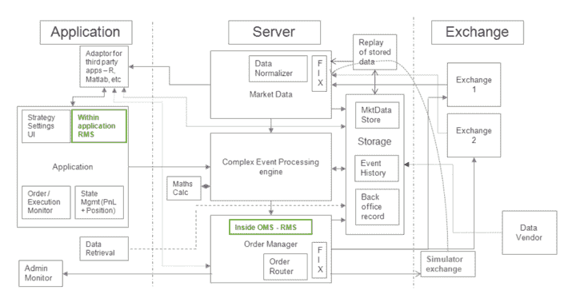

# 自动化交易中风险管理观念的改变

> 原文：<https://blog.quantinsti.com/changing-trends-in-trading-risk-management/>

由[查尼卡·塔卡](https://www.linkedin.com/in/chainika-bahl-thakar-b32971155/)

如何才能跟上交易风险管理的变化趋势？一个人如何更好地管理风险？

交易中的风险管理可能是一个被低估的概念，但它是算法交易中非常重要的一部分。在创建投资组合时，交易中的风险管理不仅仅是投资组合优化、对冲、策略规划等。

随着算法交易的当代实践，风险管理现在也意味着确保其他方面没有风险，如数据质量、技术等等！

本博客涵盖:

*   [围绕交易活动的风险管理](#risk-management-around-trading-activity)
*   哪里需要风险管理？
    *   [市场风险或系统风险](#market-risk-or-systematic-risk)
    *   [信用或交易对手风险](#credit-or-counterparty-risk)
    *   [流动性风险](#liquidity-risk)
    *   [监管风险](#regulatory-risk)
    *   [操作风险](#operational-risk)
    *   [可扩展性风险](#scalability-risk)
    *   [技术风险](#technological-risks)
    *   [人力资源风险](#human-resource-risk)
*   [与自动化交易相关的监管风险](#regulatory-risk-related-to-automated-trading)
*   如何确保良好的风险管理实践？

* * *

## 围绕交易活动的风险管理

在交易中，风险管理发生在[创建带有策略](/trading-risk-management/)的交易组合时，也围绕着交易活动。在这篇博客中，我们将讨论围绕交易活动的风险管理。

下面你可以看到算法交易架构的图解:

<figure class="kg-card kg-image-card kg-width-full kg-card-hascaption">

<figcaption>Architecture for Algorithmic Trading</figcaption>

</figure>

从上图中可以看出，订单是通过应用程序以 R、MATLAB、Python 等计算机语言下达的。

然后，订单通过应用程序执行，并通过服务器进行所有必要的事件，如数据检索、根据输入的策略进行计算等。然后根据策略将数据发送到交换机。

在算法交易的整个过程中，存在着与系统网络、技术、人力资源正常工作等相关的风险。我们会进一步讨论。

现在让我们来详细看看这些风险管理的必要要点，以确保顺利的交易实践。

* * *

## 哪里需要风险管理？

正如我们在上面的图片中看到的，生成的订单信号是通过一个 API 执行的，然后该 API 将订单执行信息发送给交易所。

这是通过您的编程语言(R、Python 等)检索交易订单信息来完成的。).作为一个算法交易者，你必须确保遵循适当的风险管理实践，以使 API 准确工作。

传统上，交易操作通常关注以下风险:

### 市场风险或系统风险

市场风险是由于一些因素导致整个市场而不是一个行业或公司的失败而产生的。这些因素可以大致分为社会、政治和经济问题。

例如，公司面临的利率风险、通货膨胀风险或任何此类市场风险。这种风险降临到整个行业。解决这一风险的方法是[通过 VIX 指标](/sentiment-trading-indicators-strategy-part-2/)衡量波动性，当波动性高时退出高风险资产。

### 信用或交易对手风险

信用风险与个人、公司或主权政府的信誉有关。为了保持其信誉，一家公司需要一个良好的信用评级，由标准普尔、穆迪或惠誉等机构进行评估。当你作为交易者或组织需要为你的交易筹集资金时，信用评级会有所帮助。

### 流动性风险

与流动性有关的风险是指在不在很大程度上影响市场上当前资产价格的情况下，将资产转换为现金的能力和难易程度。

市场流动性是指市场允许股票、债券或衍生产品等资产在无需支付巨大买卖差价的情况下进行买卖的程度。拥有这样的流动资产有助于交易者管理流动性风险。

### 监管风险

监管风险是指法律和法规发生变化的风险，这些变化会对交易者的交易策略产生不利影响。在算法交易实践出现后，监管法律法规已经被修订，我们将进一步讨论。

然而，随着自动化交易的出现，除了上述内容之外，这一重点已经转移到以下内容:

*   操作风险
*   可扩展性风险
*   技术风险
*   人力资源风险
*   与自动交易相关的监管风险

### 操作风险

运营风险(OR)是交易机构因内部流程失败或系统/网络缺陷而面临的风险。

运营风险涉及广泛的“非财务问题”，例如:

*   计算机系统或网络架构未更新或人员不称职的技术风险。
*   缺乏结构化风险政策。
*   与过程相关的风险，如信息处理、数据传输、数据检索中出错的可能性以及结果或输出的不准确性。
*   其他风险包括缺乏对风险的适当监控、员工或管理层的非自愿错误、员工或管理层欺诈或犯罪活动。
*   最后，它可能包括自然灾害、恐怖主义等造成的损失。

### 可扩展性风险

由于可伸缩性，交易者面临最大的风险。可扩展性风险表明，一个特定的企业，无论是对冲基金、共同基金还是任何其他机构交易公司，都有在充满挑战的情况下无法扩展的风险。

例如，对冲基金可能无法增加其在市场上的资本配置，因为市场上持有其股票的人数减少了。除非股东人数增加，否则买卖股票和创造利润的机会是最少的。

### 技术风险

这是由技术结构故障和/或处理或操作技术/机器的人为错误引起的事件。例如，闪电崩盘(2010 年)的原因之一被认为是美国交易所价格报告中的技术故障。

### 人力资源风险

这是算法交易时代不可或缺的风险之一，给对冲基金、自营交易公司等交易公司带来风险。

为了成功的算法交易，雇佣在金融、计算机科学等方面有良好教育背景的人力资源。扮演着重要的角色。

除了教育背景调查之外，还必须有一个可靠的员工管理系统，用于:

*   定期监控生产力，检查员工使用的某些参数，如止损单、特定交易量、动量策略、刷单等。
*   确保员工遵守关于算法交易监管结构的法律法规。

* * *

### 与自动交易相关的监管风险

监管风险意味着如果您不遵守法律法规，您在交易中可能会受到特定国家政府的处罚。

通常，政府当局要求你的所有策略都要得到交易所的批准。监管机构、交易所和独立审计机构也要求进行半年度和年度审计。

一旦你有了自动交易策略，你需要在模拟交易环境中执行它。

向交易所提交策略以供批准时，需要进行以下风险管理检查:

*   自动交易系统禁用手动订单
*   订单应该在上次价格的 x%以内
*   对于每种工具，设定了订单规模冻结限额
*   订单不应违反工具的巡回限制(每日价格范围)
*   外国投资者不能交易精选的股票(RBI 指导的)
*   不能通过交易衍生产品来增加超过阈值的未平仓头寸
*   每股可出售的隔夜多头头寸
*   仅对选定的工具列表启用自动交易
*   如果指数上涨超过一个点，就不能发出买入指令。对于销售订单也是如此
*   客户对特定股票可以持有的最大头寸
*   如果达到可用保证金的阈值，则应用程序不应发送进一步增加头寸的指令
*   每个工具的净头寸价值
*   最大订单价值

仅仅知道积木是不够的；一个人应该知道其他人或竞争对手在使用什么策略。

为了让你了解这一点，我们在算法交易的执行课程中有一个名为“[金融计算&技术](https://www.quantinsti.com/courses/epat/)的部分。这肯定会启发你设计你的交易策略；不同的概念可以用来设计你的策略。

* * *

### 如何确保良好的风险管理实践？

为确保良好的风险管理实践，以下帮助:

*   **知识** -有了正确的知识，一个算法交易者可以建立上面讨论的所有要求。如果你知道你的策略需要什么才能不间断地工作，你也可以做同样的安排。
*   **建立** -技术、硬件、软件等一应俱全的机构。到位会带来很大的不同。使用正确的设置将确保您对风险管理实践进行检查。
*   **可靠的团队** **对于那些在团队中工作的人来说**——团队依靠算法交易者可以将责任分配给不同的团队。这样，交易者可以确保每个团队都执行了风险管理实践。
*   ******使用人工智能(AI)** -**** 使用 AI，特别是机器学习(ML)，可以确保良好的风险管理实践。通过输入带有如下任务的机器学习模型-

1.  审查潜在员工的背景，确保良好的人力资源管理。该模型可用于管理人力资源管理领域的风险。

2.定期监控员工的生产力

3.确保员工遵守政府为算法交易实践制定的规章制度。

但是，最重要的是资本，以保持良好的风险管理实践遵循的所有必要条件。

* * *

## 结论

为了确保良好的风险管理实践，需要做出一些努力来找出防范风险所需要的东西。一旦弄清楚了，风险管理就变得更容易实施，你成功的交易策略可以不间断地给你带来你预见的回报。

为了获得如此成功的交易体验，交易者必须坚持遵循良好的风险管理实践，以获得愉快的交易之旅！

你也可以用你的算法交易策略来享受交易，在本课程中提供了正确的指导，指导你如何在交易中进行[仓位调整。你可以学习所有关于资金管理的知识，找出金融市场的内在风险，并将所有的知识融入到课程中，以创建一个保守的头寸规模框架。一定要去看看！](https://quantra.quantinsti.com/course/position-sizing-trading)

* * *

**注:原帖已于 2022 年 8 月 1 日*在*进行了更新，以确保准确性和及时性。**

* * *

*<small>免责声明:股票市场的所有投资和交易都涉及风险。在金融市场进行交易的任何决定，包括股票或期权或其他金融工具的交易，都是个人决定，只能在彻底研究后做出，包括个人风险和财务评估以及在您认为必要的范围内寻求专业帮助。本文提到的交易策略或相关信息仅供参考。</small>T3】*