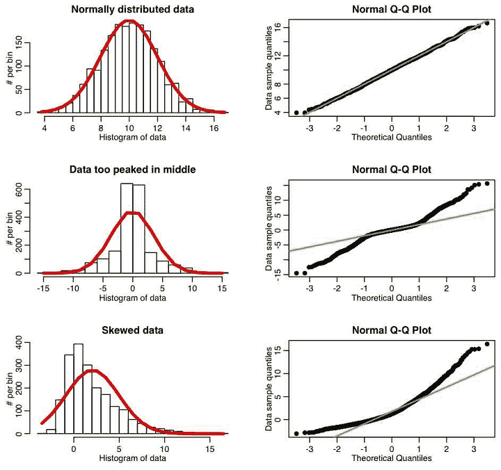
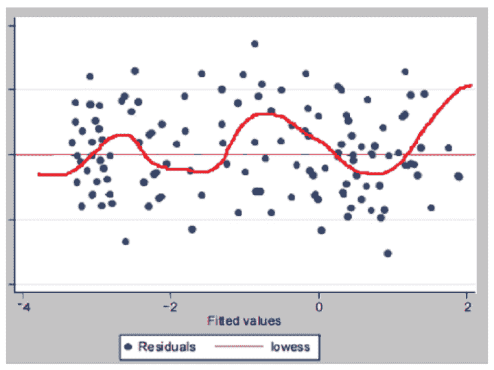

# 线性回归:假设和限制

> 原文：<https://blog.quantinsti.com/linear-regression-assumptions-limitations/>

由 Vivek Krishnamoorthy 和 [Udisha Alok](http://www.linkedin.com/in/udisha-alok)

在这篇博客中，我们对线性回归模型的假设进行了批判性的审视，如何检测和修正它们，以及它们在现实世界中有多少水分。我们将在 Python 中检查其中的一些假设和测试，这将为使用众所周知的库的其他情况提供蓝图。我们也将检查它的缺点和它的假设如何限制它的使用。

在本系列的[第一篇博客](/linear-regression/)中，我们解构了线性回归模型，它的各种别名和类型。在第二篇[文章](/linear-regression-market-data-python-r/)中，我们用 Python 和 r . net 查看了线性回归在市场数据上的应用

我们的报道沿着以下路线进行:

*   [什么是线性回归？](#what-is-linear-regression)
*   [线性回归的假设](#assumptions-of-linear-regression)
    ○[线性关系](#linear-relationship)○[无多重共线性](#no-multicollinearity)○[误差项的高斯分布](#gaussian-distribution-of-the-error-terms)
    ○[无误差项的自相关](#no-autocorrelation-of-the-error-terms)○[误差项的同态分布](#homoskedasticity-of-the-error-terms)
    ○[误差项的零条件均值](#zero-conditional-mean-of-the-error-terms)
*   [线性回归的局限性](#limitations-of-linear-regression)
    ○[在某些情况下过于简单](#simplistic-in-some-cases)
    ○[对异常值的敏感性](#sensitivity-to-outliers)
    ○[易于欠拟合](#prone-to-underfitting)
    ○[复杂模型的过拟合](#overfitting-of-complex-models)
*   [参考文献](#references)

* * *

## 什么是线性回归？

线性回归模拟响应(或因变量)变量(Y)和一个或多个解释(自变量)变量(X)之间的线性关系。

我们可以用下面的等式来表示它:

\(Y_{i} = \beta _{0}+ \beta_{1}X_{i}+\epsilon _{i}\)

在单个解释变量的情况下，称为简单线性回归，如果有多个解释变量，则称为多元线性回归。

在回归分析中，我们的目标是通过找到样本的因变量和自变量之间的关系，对总体做出推断。通常，OLS(普通最小二乘法)被用来估计回归系数。OLS 通过最小化误差的平方和找到最佳系数。

### 高斯-马尔可夫定理

高斯-马尔可夫定理说明*在一定条件下*，普通最小二乘(OLS)估计量是最佳线性无偏估计量(蓝色)。这意味着当数据集中满足这些条件时，OLS 模型的方差是所有线性无偏估计量中最小的。

让我们来看看“线性”和“无偏”这两个术语。

*   **线性** -线性估计量意味着它们与因变量有线性关系。这使得它们更容易理解和实现。
*   **无偏** -无偏估计量意味着当重复应用一个模型时，平均而言，估计量将达到它们的真实值。

我们现在来看看前面提到的形成高斯-马尔可夫定理核心的“在某些条件下”(即假设)。

* * *

## 线性回归的假设

根据假设是关于解释变量(即特征)还是残差，我们可以将线性回归的基本假设分为两类。

关于解释变量(特征)的假设:

*   线性
*   无多重共线性

关于误差项(残差)的假设:

*   正态分布
*   同方差
*   无自相关
*   零条件均值

* * *

## 线性

顾名思义，线性回归模型的基本假设是因变量和自变量之间存在线性关系。这里，线性仅与参数有关。奇怪的是，对解释变量本身的程度或形式没有这样的限制。

因此，以下两个等式代表线性回归:

\(Y_{i} = \beta _{0}+ \beta_{1}X_{i}+\epsilon _{i}\qquad\qquad - (1)\)

这里，模型的参数是线性的，解释变量也是线性的。

\(Y_{i} = \beta _{0}+ \beta_{1}X_{i}^{2}+\epsilon _{i}\qquad\qquad- (2)\)

该模型的参数是线性的，而解释变量是非线性的。

解释变量可以是指数、二次、三次等。它仍然可以被框定为一个线性回归问题。

以下等式不是线性回归:

\(Y_{i} = \beta _{0}+ \beta_{1}^{2}X_{i}+\epsilon _{i}\qquad\qquad- (3)\)

线性回归通过求解一组线性方程来最小化估计未知β的误差(均方误差)。

当贝塔采用非线性形式时，事情变得更难，我们不能使用我们提到的方法(但不是派生的！)早前。因此，我们不能在等式 3 的情况下使用线性回归。因此,(参数的)线性假设很重要。

### 如何检测线性度？

残差图有助于我们识别数据和回归模型之间较差或不正确的曲线拟合。这可能是检查线性或缺乏线性的最简单的方法。良好的均匀分布表示线性。

### 如何修正线性度？

现在棘手的部分是得到正确的方程的函数形式。

*   我们可以尝试通过对独立项和/或从属项应用非线性变换来重新构建它。我们可以通过规范化、记录原始值等方法来转换杂乱的数据。这将使数据呈线性。
*   我们也可以尝试在等式中加入另一个独立变量(比如\(X^{2}\)).

* * *

## 无多重共线性

另一个假设是自变量彼此不相关。如果一个或多个解释变量之间存在线性关系，就会增加模型的复杂性，而无法描述每个解释变量对响应变量的影响。

如果我们根据一群专业人士的年龄和经验来模拟他们的工资。

\(salary_{i} = \beta _{0}+ \beta_{1}(years\; of\; experience)_{i}+\beta_{2}(age\; in\; years)_{i}+ \epsilon _{i}\)

线性回归研究每个自变量(X)对因变量(Y)的影响。但是当自变量相关时，就像在这种情况下，很难隔离单个因素对因变量的影响。如果你增加了*年的经验*，那么*的年龄*也会增加。

那么，薪水的增加是因为经验还是年龄？
这将影响系数的准确性以及标准误差。

### 如何检测多重共线性？

*   检查独立变量之间的相关性。
*   [差异膨胀系数](https://www.statsmodels.org/v0.12.1/generated/statsmodels.stats.outliers_influence.variance_inflation_factor.html#:~:text=statsmodels.stats.outliers_influence.variance_inflation_factor%28exog%2C%20exog_idx%29%5Bsource%5D%20%C2%B6.%20variance%20inflation%20factor%2C%20VIF%2C%20for,by%20exog_idx%20is%20added%20to%20the%20linear%20regression.)

### 如何修复多重共线性？

处理独立变量之间多重共线性的一种方法是使用 PCA 等技术进行降维，以创建具有最大方差的不相关特征。

* * *

## 误差项的高斯分布

经典的线性回归模型假设误差项是正态分布的。让我们看看这意味着什么。

残差(\(\ε\))是因变量\(Y\)的值的变化，它不能用自变量来解释。因此，线性回归假设(X)无法解释的(Y)的可变性是正态分布的。

如果违背了这个假设，问题不大，尤其是我们有大量的观测数据的情况下。这是因为如果我们有大量的观察值，中心极限定理将适用，这意味着对于大样本量，不管母体分布如何，抽样分布将类似于正态分布。

但是，如果观察值很少，并且违反了正态假设，则模型输出中的标准误差将是不可靠的。

<figure class="kg-card kg-image-card kg-width-full kg-card-hascaption">

<figcaption>[Source](https://th.bing.com/th/id/R.0c838336ef5946e5c5996ac211d15bed?rik=JvkCFK%2fLT8kZ4w&riu=http%3a%2f%2fsherrytowers.com%2fwp-content%2fuploads%2f2013%2f08%2fqqplot_examples.jpg&ehk=mZvYiaWYbFh1afGaK99YqvXYan%2fu3Q7uKc7O0IURO9s%3d&risl=&pid=ImgRaw&r=0)</figcaption>

</figure>

### 如何检测正常？

*   在残差图中，大多数点应该以零为中心，并且应该随着我们远离最佳拟合线而变得稀疏。残差均值应该为零。
*   [Q-Q plot](https://data.library.virginia.edu/understanding-q-q-plots/#:~:text=The%20Q-Q%20plot%2C%20or%20quantile-quantile%20plot%2C%20is%20a,a%20Normal%20Q-Q%20plot%20to%20check%20that%20assumption.)
*   [安德森-达林试验](https://online.stat.psu.edu/stat501/lesson/7/7.5#paragraph--786)
*   [夏皮罗-维尔克检验](https://online.stat.psu.edu/stat501/lesson/7/7.5#paragraph--787)
*   [瑞安-乔伊纳试验](https://online.stat.psu.edu/stat501/lesson/7/7.5#paragraph--788)
*   [科尔莫戈罗夫-斯米尔诺夫试验](https://online.stat.psu.edu/stat501/lesson/7/7.5#paragraph--789)

### 如何修复常态？

*   首先要检查的是我们是否有异常值。如前所述，线性回归模型使用“最小二乘法”得出最佳拟合。因此任何异常值都会严重影响残差。
*   如果可能，添加更多观察。
*   如上所述，我们可以通过应用非线性变换来尝试修改回归方程的函数形式。

* * *

## 误差项没有自相关

假设线性回归模型中的残差是独立同分布的。这意味着每个误差项都是独立的，与其他误差项无关。

因此，知道一个误差项并不能告诉我们关于其他误差项的任何信息。此外，所有误差具有相同的分布，即正态分布(具有零均值和有限方差)。

特定时间点的误差项应该与任何过去的值没有关联。这使得误差项相当于无法预测的随机噪声。

在残差之间存在相关性的情况下，模型的精度会受到影响。自相关或序列相关是涉及时间序列数据的回归所特有的问题。你可以阅读更多关于[自相关和自协方差](/autocorrelation-autocovariance/)的内容。

处理时间序列数据时，如果特定时间 t 的值依赖于某个时间(\(t-1\))的值，则在模型拟合步骤之后，残差之间可能存在相关性。如果你知道一个给定时间的剩余值，你就能合理地知道下一个剩余值在哪里。

无自相关是 OLS 成为有效模型的关键要求(根据高斯马尔可夫定理)。当这个假设被违背时，尽管模型仍然是无偏的，但其效率会受到影响。

标准误差会增加，拟合优度可能会被夸大。显著回归系数可能看起来具有统计显著性，但实际上并非如此。

<figure class="kg-card kg-image-card kg-width-full kg-card-hascaption">

<figcaption>[Source](https://www.statisticshowto.com/wp-content/uploads/2016/06/serial-correlation.png)</figcaption>

</figure>

### 如何检测自相关？

*   显示残差图中残差的某种聚类的蛇形波状图案表示误差项的自相关。
*   [德宾-沃森试验](https://www.statisticshowto.com/durbin-watson-test-coefficient/)