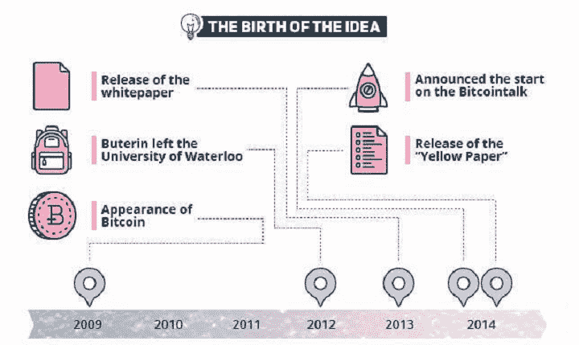
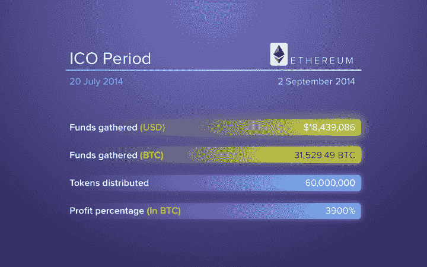
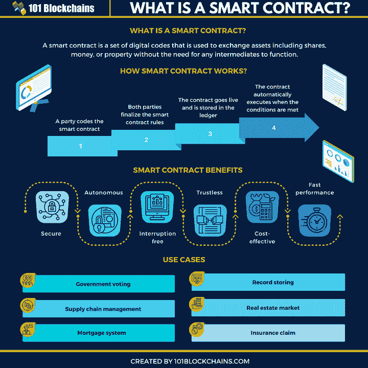
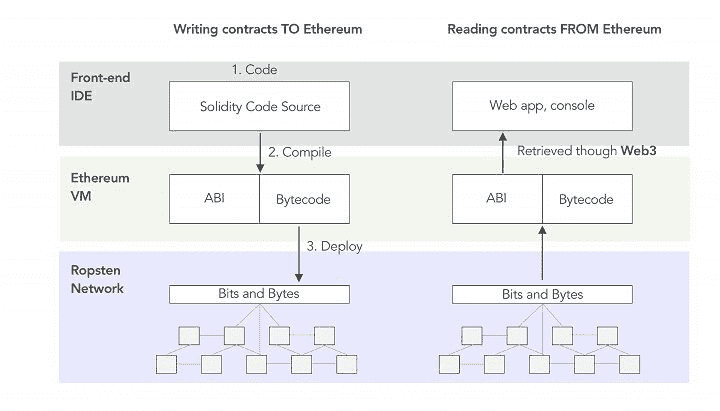
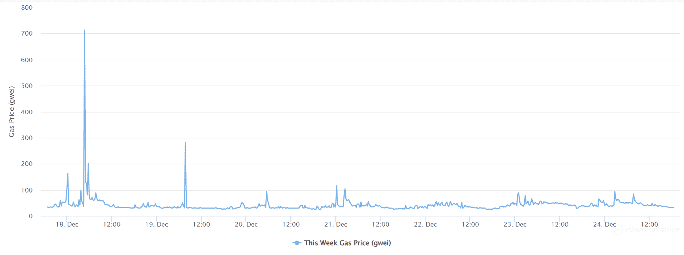
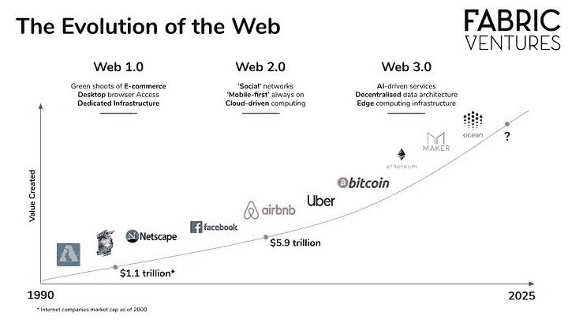
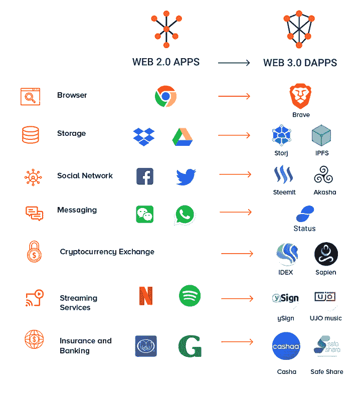

# 探索以太坊和以太交易

> 原文：<https://blog.quantinsti.com/ethereum-trading/>

由[乌迪莎·阿洛克](http://www.linkedin.com/in/udisha-alok)

以太坊和以太交易已经获得了广泛的吸引力，尽管时间跨度很短。你有没有想过它们是什么，以太坊交易是如何发生的？在哪里可以获得关于以太坊和以太的完整理解？

在这篇博客中，我们将一窥以太坊以及它给这个被比特币冲昏了头脑的世界带来的所有变化。

我们涵盖以下内容:

*   [以太坊是什么？](#what-is-ethereum)
*   [以太坊简史](#a-brief-history-of-ethereum)
*   [以太坊的特点](#features-of-ethereum)
    *   [什么是以太？](#what-is-ether)
    *   什么是智能合约？
    *   [以太坊虚拟机](#ethereum-virtual-machine)
    *   [坚固度](#solidity)
    *   [气体](#gas)
*   [以太坊用例](#ethereum-use-cases)
    *   [分散应用](#decentralized-applications)
    *   [分散的自治组织](#decentralized-autonomous-organizations)
    *   [分权财政](#decentralized-finance)
    *   [不可替换的令牌](#non-fungible-tokens)
*   [工作证明的缺点](#disadvantages-of-proof-of-work)
    *   [高能耗](#high-energy-consumption)
    *   [易受 51%攻击](susceptibility-to-51-%-attack)
*   [以太坊 2.0](#ethereum-2.0)
    *   [股权证明](#proof-of-stake)
    *   [以太坊 2.0 的主要变化](#major-changes-in-ethereum-2.0)
*   [比特币 vs 以太坊](#bitcoin-vs-ethereum)
*   [乙醚交易策略](#an-ether-trading-strategy)

让我们开始吧！

* * *

## 以太坊是什么？

在我们早期的博客中，我们探索了区块链技术和比特币——第一种使区块链技术诞生的加密货币。比特币是一种去中心化的金融交易方式。尽管这是一个巨大的突破，但这种分布式分类账仅限于存储交易。

但是，

*   如果我们也能在区块链上存储和执行代码，那会怎么样？
*   如果我们可以根据一些预先约定的条件进行交易，会怎么样？
*   或者使用区块链来运行我们的程序？
*   进入以太坊！

用 Solidity(它的原生编程语言)和 Ether(它的货币)编写的智能合约武装起来——随着以太坊的进入，我们所知道的世界永远改变了！

* * *

## 以太坊简史

<figure class="kg-card kg-image-card kg-width-full kg-card-hascaption">

<figcaption>[Source](https://3commas.io/blog/wp-content/uploads/2020/08/0_H8uF9FXzLg0u6xG6.png)</figcaption>

</figure>

2011 年，17 岁的俄裔加拿大少年维塔利克·布特林(Vitalik Buterin)发现自己对比特币非常感兴趣。他对比特币如此着迷，以至于创办了《比特币杂志》，并积极开始为其写作。

他认为比特币可以通过一种允许它运行代码的脚本语言变得更加强大。然而，由于未能获得比特币社区的同意，布特林在 2013 年 11 月 27 日的白皮书中提出了一个名为以太坊的新平台。

以太坊在其白皮书中被介绍为*‘下一代智能合约和分散应用平台*’。相比之下，[比特币](https://bitcoin.org/bitcoin.pdf)被简单地称为“*，一种点对点电子现金系统*。

2014 年 4 月 1 日，当时以太坊项目的 CTO Gavin Wood 发布了以太坊[黄皮书](https://web.archive.org/web/20140410013339/http://gavwood.com/Paper.pdf)。创始人在 2014 年 7 月 22 日至 9 月 2 日期间发起了一场众筹活动，他们出售以太(以太币)以换取比特币，并筹集了超过 1800 万美元。

<figure class="kg-card kg-image-card kg-width-full kg-card-hascaption">

<figcaption>[Source](https://3commas.io/blog/wp-content/uploads/2020/08/0_1sEfdHWifKE2XjHx.png)</figcaption>

</figure>

以太坊于 2015 年 7 月上线，这是其第一个名为 Frontier 的现场发布。

以太坊的联合创始人名单很长。你可以在这里阅读更多关于以太坊的历史[。](https://ethereum.org/en/history/)

* * *

## 以太坊的特点

### 以太是什么？

以太(ETH)是区块链以太坊的本地货币。给它提供动力的是燃料。像比特币一样，以太是一种点对点货币，你可以用它来交易或购买“汽油”。气体是以太坊宇宙中用于交易费用的术语。你需要天然气来支付以太坊区块链上任何智能合约或交易的计算费用。

### 什么是智能合约？

合同是双方之间的协议。智能合同只是以计算机程序的形式编写的合同。因此，智能合约用编程语言概述了转移任何资产(不一定是货币)的条款和条件。这里的资产可以是任何东西——股票、金钱、财产或任何数字资产。

以太坊区块链的任何人都可以创建智能合约。智能合约的一个重要特征是，一旦它们进入区块链，就不能以任何方式改变。它们是不可改变的。

但是，您可以在以后上传修改了条款和条件的另一个版本的合同。接下来，交易将根据修订后的条款和条件进行。

与由中央机构验证合同的传统合同相比，智能合同由区块链验证。契约以简单的 if-then-else 语句的格式编码，并在满足预定义的条件时自动执行。

在以太坊上，Solidity 通常用于智能合约的编码。支持智能合约编码的其他流行语言有 [Vyper](https://vyper.readthedocs.io/en/stable/index.html) 、 [Yul](https://docs.soliditylang.org/en/v0.8.10/yul.html) 和 [DAML](https://daml.com/) 。

<figure class="kg-card kg-image-card kg-card-hascaption">

<figcaption>[Source](https://101blockchains.com/wp-content/uploads/2020/08/what-is-a-smart-contract-1-2048x2048.png)</figcaption>

</figure>

### 以太坊虚拟机

虚拟机是一种模拟计算机的程序。它有一个中央处理器，内存等。，就像一台物理计算机。以太坊虚拟机(EVM)就像一个分散在区块链的计算机网络，只是每台计算机都是一个虚拟机。

区块链上的每个节点运行这个 EVM。智能合同被上传并部署在 EVM 上，节点使用 EVM 来维护整个区块链的共识。

EVM 是智能合约的沙盒隔离运行时环境。EVM 理解智能合约的语言。我们可以在这个独立的环境中编码和测试我们的代码，当我们准备好部署它时，我们可以在区块链上这样做。

### 固态

[Solidity](https://docs.soliditylang.org/en/v0.8.10/) 是一种面向对象的高级编程语言，类似于 C++、Python、Javascript。它被设计用来开发以太坊上的智能合约。如上所述，这些智能合约在 EVM 上运行。

Solidity 编译器将代码编译成 EVM 字节码和 ABI(应用二进制接口)。字节码是用低级编程语言编写的可执行代码，可以被 EVM 理解，而 ABI 是智能合约和字节码之间的接口。

除了以太坊，Solidity 在其他平台也有[以太坊经典](https://ethereumclassic.org/)、[币安](https://www.binance.com/)连锁、[雪崩](https://www.avax.network/)、 [Tron](https://tron.network/) 等。

<figure class="kg-card kg-image-card kg-width-full kg-card-hascaption">

<figcaption>[Source](https://hackernoon.com/hn-images/1*Sz1a7G2pQ62UnkHoieve4w.jpeg)</figcaption>

</figure>

### 气体

煤气是在以太坊区块链上处理交易所支付的费用。所需的汽油量取决于交易的复杂程度——简单的交易需要较少的汽油，复杂的交易需要较多的汽油。

还需要更多的汽油来确定交易的优先顺序。由于区块大小有限，更高的天然气量会激励矿商更快地进行交易。天然气价格也是动态的，并且根据网络中的流量而变化。

天然气价格以 gwei 表示。在这里，g 代表“气体”，而“微”指的是引入 b 货币概念的。1 ETH 等于 1，000，000，000 gwei。

<figure class="kg-card kg-image-card kg-width-full kg-card-hascaption">

<figcaption>[Source](https://ethereumprice.org/gas/)</figcaption>

</figure>

以太坊因其[高昂的燃气费](https://coinmarketcap.com/alexandria/article/ethereum-faces-fresh-attacks-for-high-gas-fees)而面临[批评](https://www.fool.com/investing/2021/12/15/gas-fees-are-ethereums-kryptonite/)。不符合矿工门槛的交易可能会被延迟或干脆拒绝。有时费用会涨到 100 美元！用户可能需要利用来自各个[站点](http://gasnow.org)的数据，在汽油费较低的时候为他们的交易计时。这对于寻找更便宜和更有效的选择的用户来说是令人沮丧的。

虽然以太坊 2.0 试图解决这一问题，但高昂的燃气费和低廉的缓慢交易时间将继续成为用户的祸根，直到以太坊完全转向 PoS。高额的燃气费使得以太坊无法用于微支付，而微支付是其必不可少的用例之一。

与此同时，区块链的许多竞争对手，如索拉纳、T2、卡尔达诺、T4 和雪崩，正在开发更高效、更实惠的系统，并越来越受欢迎。

* * *

## 以太坊用例

### 分散应用

分散式网络带来了分散式应用(dapps)！

让我们看看我们传统上使用的应用程序的结构。通常，有一个前端，一个用户界面，和一个后端，一个位于单台计算机或服务器上的数据库。

但是如果数据库现在位于一个区块链——一个分散的节点网络——上呢？

这些年来，web 的面貌从前端使用静态脚本的 Web 1.0 转变为前端使用动态脚本的 Web 2.0，从而带来了更好的用户交互。现在我们在区块链上有了后端的 **Web 3.0** ，真正革新了应用程序的结构。

<figure class="kg-card kg-image-card kg-width-full kg-card-hascaption">

<figcaption>[Source](https://miro.medium.com/max/2000/1*tsGHBQcFD6GzgprvV4a01A.jpeg)</figcaption>

</figure>

当您登录到一个常规应用程序时，数据是通过一个 API 从数据库中获取的。类似地，当您登录到 dapp 时，将通过智能合约接口从区块链获取数据。一些著名的 dapps 例子有:

*   Steemit(一个博客和社交媒体网站)
*   Uniswap(一个分散的加密货币交易所)
*   [占卜](https://www.augur.net/)(一个投注平台)
*   [Cryptokitties](https://www.cryptokitties.co/) (一款游戏)
*   Ethlance (首个完全在以太坊区块链运营的就业市场平台)

<figure class="kg-card kg-image-card kg-width-full kg-card-hascaption">

<figcaption>[Source](https://appinventiv.com/wp-content/uploads/sites/1/2019/10/Web-3.0-dapps-Real-Life-Examples-1.png)</figcaption>

</figure>

### 分散的自治组织

*什么是组织？它是一群有特定目的的有组织的人。*

目的是由组织的指导方针定义的，通常有一个适当的层次结构。

现在，以我们对区块链的了解为背景，想象一个分散的组织，由其成员控制，它是透明的，具有以计算机程序形式明确定义的指导方针。其账目和记录保存在区块链。这是一个分散的自治组织(DAO)。

智能合同可以被编码为包括组织的所有过程和功能，以便它变得自我可持续，并且可以在没有任何人类参与的情况下运行。这意味着它们不能被一个集中的权力机构关闭——它们将继续运行。如果规则有任何变更，区块链将达成共识，并在《守则》中实施变更。

一个简单的 DAO 例子可以是无人驾驶出租车服务，它可以接送客户，产生付款，在加油站加油，并将其账户上传到区块链-所有这些都基于智能合同。

### 分散金融

去中心化金融(DeFi)是一个基于区块链的去中心化金融生态系统，它使用智能合约而不是集中的权力机构或中介。所以没有交易所，银行，券商等。！

一个不眠的市场。

有了 DeFi，市场永远向所有人开放。使用它的服务不需要很长的应用程序进程。由于没有人工操作，这些 DeFi 市场全天候运行。

所有用户都使用假名，它提供了一个基础设施，以一种不可信的方式与陌生人交易。交易在几分钟而不是几天内完成，并且数据在区块链上透明地维护。

DeFi 提供了几乎所有金融交易的替代方案，如全球汇款、借款、购买保险、交易等。

MakerDAO 是 DeFi 应用的主要例子之一。

[DEFI](https://blog.spectrocoin.com/wp-content/uploads/2021/01/DeFi_blog-inner-defi-pros-and-cons-fix-1536x1362.png)的利弊如下:

| **DEFI** |
| **优点** | **缺点** |
| 访问所有 | 早期阶段 |
| 透明度 | 缺乏可扩展性 |
| 省时 | 诈骗风险 |
| 减少人为错误的可能性 | 缺乏用户友好性 |
| 无中介 | 高需求-高利率 |

### 不可替换的令牌

不可替换令牌(NFT)是代表唯一且不可互换的项目的令牌。这里的项目可以是一首歌曲，艺术，收藏品，甚至是房地产。这种独特的物品只能有一个认证的所有者，并且这种所有权证明由区块链保护。因此，NFT 代表了这些独特物品的所有权。

不可替代的物品有独特的属性，比如一件家具或一首歌。可替代的物品都是一样的，比如苹果、纸币等。他们可以很容易地交换，因为每个项目是相同的，与其他相同的价值。NFTs 也可以用来表示游戏中的[资产。](https://market.decentraland.org/)

NFT 可以在数字市场上交易或出售。但与可以自由兑换的加密货币不同，NFT 代表的是基础资产。因此，内容创作者可以转让 NFT 的所有权(例如，在艺术作品的情况下)，也可以保留所有权并使用 NFT 来赚取转售版税(例如，在音乐作品的情况下)。

在线艺术画廊古玩卡是以太坊 NFT 最早的实现之一。NFT 的一些例子是[艺术品](https://foundation.app/artworks)、[豪华运动鞋](https://www.metagrail.co/auctions/91cf83fb-3477-4155-aae8-6dcb9b853397)、[散文](https://zora.co/collections/zora/145)，以及其他[数字资产](https://www.larvalabs.com/)。

NFT 音乐产业正在迅速发展。2021 年 3 月，[莱昂国王乐队](https://kingsofleon.com/)成为第一个以 NFT 的身份发布新专辑的乐队，2021 年 12 月在[，NFT 音乐初创公司 sound.xyz 筹集了 500 万美元的种子资金。](https://www.coindesk.com/business/2021/12/15/nft-music-startup-soundxyz-raises-5m-seed-round-from-a16z-21-savage/)

* * *

## 工作证明的缺点

[比特币](/bitcoin-algorithmic-trading/)使用的工作证明算法，目前以太坊也在使用，非常有效和流行。在这里，一群矿工竞争解决一个重型密码难题。获胜的节点将该块添加到链中，从而从所挖掘的块中的所有交易中赢得奖励和交易费。

PoW 是高度安全的，激励采矿节点，并分散网络。

然而，它有两个主要缺点:

### 高能耗

随着比特币网络规模的扩大，加密难题的难度也在增加，这是由区块链自动调整的。随着难度的增加，人们设计了专门的硬件来开采这些区块。

目前，比特币只能使用 ASICs(专用集成电路)进行挖掘，挖掘过程消耗大量能量。

<figure class="kg-card kg-embed-card">

> 明确地说，我非常相信加密，但是它不能推动化石燃料使用的大规模增长，尤其是煤
> 
> — Elon Musk (@elonmusk) [May 13, 2021](https://twitter.com/elonmusk/status/1392950720979030019?ref_src=twsrc%5Etfw)

</figure>