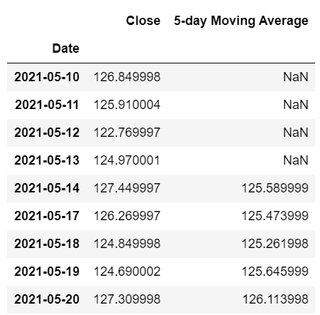

# 如何利用技术指标进行交易？

> 原文：<https://blog.quantinsti.com/technical-indicators-trading/>

由[维布·辛格](https://www.linkedin.com/in/vibhu-singh-1b76b6105/)

如果你是交易新手，你可能听说过技术指标。移动平均线、相对强弱指数等技术指标是交易员每天用来预测证券价格变动的最常见和最流行的技术指标。在本文中，我们将使用这些技术指标在 Blueshift 平台上创建并回测一个交易策略。

但在此之前，我们将涵盖以下主题，以更好地理解技术指标。

*   [什么是技术分析？](#what-is-technical-analysis)
*   [技术分析和基本面分析的区别](#difference-between-technical-analysis-and-fundamental-analysis)
*   [什么是技术指标？](#what-are-technical-indicators)
*   [为什么我们需要技术指标？](#why-do-we-need-technical-indicators)
*   [技术指标的最佳组合是什么？](#what-is-the-best-combination-of-technical-indicators)
*   [技术分析库(ta-lib)](#technical-analysis-library-talib)
*   [使用 Ichimoku 云和 RSI 的交易策略](#trading-strategy-using-ichimoku-cloud-and-rsi)
*   [技术指标的限制](#limitations-of-technical-indicators)
*   [关于技术指标的热门书籍](#popular-books-on-technical-indicators)

* * *

## 什么是技术分析？

技术分析是一种通过分析过去的交易活动和历史数据(如价格和交易量)来预测证券未来价格变动的方法。

它基于这样一个假设，即关于一种证券的所有相关信息都已经存在于其价格中。基于这些假设，技术分析师使用各种技术指标和图表模式来衡量证券运动背后的趋势、势头和总体情绪。

另一方面，基本面分析是一种通过分析各种微观和宏观经济因素来评估证券内在价值的方法。然后将证券的内在价值与证券的当前市场价格进行比较。这有助于确定证券是否被高估、低估或公平估价。

例如，为了分析一只股票的表现，基本面分析师关注各种因素，如公司的收益、市盈率、利润率和其他财务指标。为了分析一个经济体的整体健康状况，基本面分析师依赖于宏观经济因素，如 GDP、利率、通货膨胀。

## 技术分析和基本面分析的区别

| 技术分析 | 基本面分析 |
| 技术分析使用图表模式、历史价格、交易量和未平仓合约(仅限衍生品)来预测证券的未来价格变动。 | 基本面分析使用微观和宏观经济因素来发现证券的内在价值。 |
| 技术分析通常用于短期交易 | 用于长期投资 |
| 交易决策基于技术指标，如均线，振荡指标，和基于动量的指标。它也使用烛台模式:多奇，晨星。 | 收入、收益、市盈率、利润率等因素被用来做出投资决策。 |

你也可以看看这个视频，它彻底解释了技术分析和基本面分析的区别。T3】

* * *

## 什么是技术指标？

在本文的前面部分，我们已经多次使用了技术指标。

> 但是到底什么是技术指标呢？

技术指标是价格和交易量的数学表达式，用来检测证券的价格变动。技术指标的一个例子是用于识别证券趋势的[移动平均线](/moving-average-trading-strategies/)。

移动平均是指定数据字段的平均值，例如给定的一组连续期间的**价格**。当有新数据可用时，通过丢弃最早的值并添加最新的值来计算数据的平均值。

假设你有一个证券的每日价格数据，你需要计算周期为 5 的移动平均线。

<figure class="kg-card kg-image-card kg-card-hascaption">

<figcaption>5-Day Moving Average</figcaption>

</figure>

前四个值是 NaN，因为您正在计算 5 天移动周期的移动平均值。第一个移动平均线是为“2021-05-14”计算的，这是从“2021-05-10”到“2021-05-13”的最后五天价格的平均值。同样，“2021-05-17”的移动平均线是从“2021-05-11”到“2021-05-14”的平均价格。

演示移动平均线计算的目的是我们已经使用了一种证券的价格，并做了一些简单的数学计算。同样，所有的技术指标都是用简单到复杂的数学公式，利用证券的价格和成交量计算出来的。

* * *

## **为什么我们需要技术指标？**

技术指标有各种各样的好处，让交易者的生活更轻松。

### 价格的平稳

股票价格波动很快，很难跟踪。简单或指数移动平均线等技术分析指标使数据变得平滑。您可以绘制价格的移动平均线，这有助于更好地理解价格的变动。

### 价格的走向

技术指标提供了关于证券价格方向和强度的想法。它告诉价格的运动，上升或下降趋势，并确定趋势是强还是弱。这对交易者很重要，因为它有助于确定证券的未来价格。

### 支撑和阻力位

技术分析指标有助于确定支撑位和阻力位。支撑位和阻力位是价格图表中的特定水平，在这个水平上，价格会停止并反转。

### 预测波动性

平均真实波动幅度(ATR)等技术指标有助于识别市场的波动性。

你可以阅读更多关于五个[指标来建立趋势跟踪策略](/indicators-build-trend-following-strategy/)。

* * *

## 不同类型的技术指标

技术指标大致分为领先指标和滞后指标。

### 前导指数

领先指标试图通过在趋势即将开始时发出信号来预测证券的价格。这些指标在计算中使用较短的时间周期，因此引导价格运动。一些流行的领先指标是 RSI 和随机振荡指标。

### 后续指标

滞后指标跟随证券价格，在趋势反转开始后给出信号。均线是最常见的滞后指标。

进一步来说，技术指标可以根据趋势、[、动量](https://quantra.quantinsti.com/course/momentum-trading-strategies)、成交量、波动率来划分。这些可以分为领先或落后。

### 趋势指标

*   **[抛物线止跌反转(抛物线 SAR)](/parabolic-sar/) :** 抛物线 SAR 是一种滞后指标，用于确定趋势的方向和反转。
*   **[一片云](/ichimoku-cloud-trading-strategy/) :** 一片云指标同时作为动量和趋势指标，帮助确定方向、动量和支撑位-阻力位。

### 势头指标

动量指标用于确定价格运动的方向和速度。大多数动量指标使用某种基线或平均值来确定趋势的方向。

例如，低于平均线或基线的价格可以被认为是看跌或看涨，这取决于指标的类型和计算方法。

*   **[【MACD】](/moving-average-crossover-trade-nifty-options/):**【MACD】显示了证券价格的两条移动平均线之间的关系，主要用于识别趋势。
*   **[随机振荡器](/stochastic-oscillator/) :** 它是一个领先指标，用于识别超卖和超买的情况。
*   [**相对强弱指数(RSI):**](/rsi-indicator/) RSI 是用来衡量价格运动速度和变化的领先指标。它用于识别超卖和超买的情况。

### 波动指标

这些技术指标衡量价格运动的速度，不考虑方向。

*   **[布林线](/bollinger-bands/) :** 布林线是价格的简单移动平均线，绘制在移动平均线的某些标准偏差之上或之下。它用于识别一种证券的趋势和波动性。
*   **平均真实范围:**显示价格波动的程度。

### 音量指示器

这些技术指标根据交易量来衡量趋势的强度。

*   **柴金振荡器:**监控资金进出市场的情况，可以帮助确定顶部和底部。
*   **平衡交易量(OBV):** 试图通过比较交易量与价格来衡量积累或分配的水平。

* * *

## 技术指标的最佳组合是什么？

知道哪个指标属于哪个类别是不够的，你必须知道如何以有意义的方式组合指标，以做出更好的交易决策。以错误的方式组合各种指标会导致误导信号。

例如，组合属于同一类别的指标，如 MACD，RSI 导致冗余，不会增加任何价格预测的价值。本质上，这两个指标提供了相同的信号，因为它们考察的是价格行为的动力。

因此，谨慎地组合技术指标以产生良好的交易信号是很重要的。比如 RSI 指标和 Ichimoku 云的组合是更好的选择。

RSI 测量和识别动量交易，Ichimoku 云帮助识别趋势的方向。

* * *

我们将使用这些指标，通过 TA-Lib 库创建交易策略。

* * *

## 技术分析库

[Ta-Lib](https://mrjbq7.github.io/ta-lib/) 是 Mario Fortier 库开发的最著名的技术分析 Python 库之一。它包括 150+指标，如 MACD，RSI，布林线和[烛台模式](/candlestick-patterns-meaning/)识别。

在 Python 中安装 [TA-Lib](/install-ta-lib-python/) 有点棘手。但是在这篇[文章](https://mrjbq7.github.io/ta-lib/)中有一步一步的解释。

使用 talib 库计算技术指标非常简单。您只需要调用一个函数并传递所需的参数。让我们使用一行代码来计算 talib 中的相对强度指数。

股票代号“AAPL”的价格数据存储在 aapl_stock_data 数据帧中，如下所示。