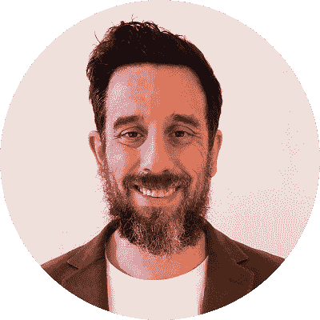

# 迭戈从生物化学、MBA 到投资的英勇历程

> 原文：<https://blog.quantinsti.com/biochemistry-mba-investing-algotrading-epat-success-story-diego-collaziol/>

19 年以上的职业经验 40 岁时，作为一名生物化学家，进入算法交易，成为一家投资公司的创始人，迭戈为他的成功铺平了道路。

今天，我们很高兴为您带来 EPATian 的旅程，以及算法交易(EPAT)高管课程优秀证书持有人 Diego Collaziol。他的职业生涯始于实验室工作，晋升到总经理职位，旅行，为非政府组织工作，现在成为这个快速增长的交易领域的一部分，这是一个激励和推动他的故事。

我们通过电话与他取得了联系，这就是讨论的情况。

* * *

## 嗨，迭戈，给我们介绍一下你自己吧？

<figure class="kg-card kg-image-card kg-width-wide"></figure>

我是迭戈·科拉齐奥尔，40 岁，来自巴西的 T2。我原本住在阿根廷的 T4，但最近才搬回来。我曾经是一名**生物化学家**，因为我的职业是(药学/生物化学家**)。在实验室工作了 15 年后，我决定休假一年，从事基因分析、食品分析或实验室质量管理等工作。**

我去过尼泊尔和东南亚。我在尼泊尔遇见了我的妻子，我们搬回了阿根廷，那时我决定改变我的职业，开始交易。我想放弃实验室和公司机构，只专注于交易。我在 2016 年转向了交易。

* * *

## 你是怎么从生物化学、MBA 到现在投资的？

早在 2002 年，我开始是一名实验室技术员，负责对农作物进行转基因分析。巴西的转基因技术刚刚起步，当时还没有实验室从事这项工作。它从美国的一个实验室获得了 **PCR 技术**的许可。我负责在实验室实施这项技术。后来，我进入了质量管理部门，并进入了公司财务部。

我在同一家公司呆了 15 年，这对每年都换工作的千禧一代来说可能很奇怪。实验室被一家欧洲跨国公司收购，我受邀成为业务部门经理。我在那个角色里呆了 3 年。

我在 2015 年辞去了工作，休息了一年，并在地震后跟随一个名为“All-hands”的非营利组织去了尼泊尔。我**在尼泊尔**生活了 7-8 个月，在一家非营利组织工作。当我完成那项工作后，我决定交易。

**我以前在巴西用对冲基金和共同基金投资**，但在 2016 年左右，我决定自己交易。大约一年半前，我决定成立自己的公司，**努纳穆鲁投资**。我不想回到企业界，所以我开始用自己的资本进行交易，并且一直持续到现在。

在我开始之前，我从未学习过交易，因为我专注于其他事情。刚决定开始，开始喜欢这个过程。最初，我开始高度自主交易，一些基本面和技术分析。

我开始喜欢交易了。所以，我决定投资我的交易教育，开始在网上学习，阅读我能找到的所有关于交易、投资组合管理和风险的书籍。交易从来不是我童年的计划。我只是开始，享受这个过程，并坚持做下去。

我是一个狂热的读者。以前一周看 2-3 本书。我过去常常阅读传记、技术资料以及任何我能找到的东西。我真的很喜欢读书。阅读书籍是很重要的，因为获得主题的基础知识和更广泛的反转真的有助于你建立重要的联系。

* * *

## 从 QuantInsti 的博客到 EPAT——这是怎么发生的？

我开始交易的时候一直对 algos 很好奇。我认为给机器人编程会很棒，它们会为你做任何事情。再也不用连续几个小时坐在屏幕前了。

> 我喜欢了很久的一件事是编程。我从来没有机会学习如何编码。编程是我潜在的愿望。

于是，我尝试通过书籍和视频在网上学习 algo 交易，但是很复杂。一个网站告诉我一件事，另一个网站告诉我完全不同的事情。

> 这些互联网指南缺少框架，缺少更广阔的视角。我永远不会深入到专业的算法交易。

我不是专门寻找 EPAT 或算法交易程序。

*   我在谷歌上随便找了些东西，在 QuantInsti 的博客上找到了一篇文章。
*   后来我看到 EPAT 的横幅上写着，我可以输入我的电话号码，有人会打电话给我解释这个项目。
*   我输入了自己的号码，有人打电话给我，向我解释了建立 algo 交易平台的流程、培训、编码教育和指导，如果我愿意的话。
*   这对我来说听起来很完美。
*   我只是想了 5 分钟，回电话说“我加入。”

从那以后，一切都变得像变魔术一样。

* * *

## 作为 CEO、全职父母和学习者的你，时间管理难道不是一个挑战吗？你是怎么处理的？

老实说，管理一个家庭和一个新的职业，学习 EPAT 的算法交易是非常困难的。疫情也没有让它变得更容易，每个人都全天候在家。EPAT 的节目本身就非常令人愉快。

教授们对教学和评估作业的方法非常清楚。如果你看了讲座，完成了作业，你很难不学。

> 我的主要问题是组织我的生活，找到时间参与。一旦我明白了这一点，这是伟大的！我从 0 编码技能到现在的中级技能。我现在正在编写过去认为不可能的东西。

我通过我的公司 Nuna Muru 进行全职交易。我仍然做**全权委托交易**，但我交易的很大一部分是在编码、构建策略和回溯测试方面。我整合了我所学的一切，最终编写了一个基础算法来自动化一切，并放弃全权交易。

这是一项正在进行的工作，我现在正在进行当中。这比我最初想的要花更多的时间，但我认为这是因为我不得不从头开始学习一切。

* * *

## 根据你的看法，EPAT 最大的特色是什么？

EPAT 教我的一个关键技能是如何编码。这非常重要，因为它是一切的基础。我现在专注于**机器学习**。在 EPAT 期间，我意识到，在讲座中，我了解到了科技相对于金融领域的真正优势。

我以前从来不知道 ML 可以用来交易。这让我大开眼界，我现在真的很投入。EPAT 的 ML 部分是一个惊喜。

算法训练的世界变化非常快。每天都有新的事情发生。最新的课程、技术和讲座是我所希望的最好的功能。

> 对我来说，EPAT 最重要的特点是终生接触课程和支持团队。

和 EPAT 在一起，我知道从长远来看我总是被覆盖的。如果我需要实施新的想法，或者我有任何问题，我可以打电话给某人或者在小组上留言，我可以找到帮助。我觉得这就是 EPAT 与其他球场的不同之处。

> *EPAT 社区以及与讲师、algo 交易员社区和 EPAT 支持人员的接触是整个课程的最大特色*。

* * *

## 你给有抱负的算法交易者的信息。

算法交易取决于你住在哪里。那里的算法交易者可能很少。我住在巴西，我猜这里 90%的市场都是自由交易者。

Algo 是未来，是未来做事的方式。我建议人们抓住机会，如果他们喜欢交易，选择一个算法路径。这是一个显而易见的事实，技术和基本面分析不会长期存在。所以，去争取吧！

* * *

与你交谈非常愉快，迭戈，我们非常感谢你选择与我们以及全球所有读者分享你的故事。我们祝你未来一切顺利，祝你和你的家人平安健康。

算法交易(EPAT) 的[高管课程是一门综合课程，涵盖从统计学&计量经济学到金融计算&技术，包括机器学习等等。开始你的探索，与 EPAT 一起提升你的算法交易知识。点击这里](https://www.quantinsti.com/)查看[。](https://www.quantinsti.com/)

* * *

*<small>免责声明:本文提供的所有数据和信息仅供参考。QuantInsti 对本文中任何信息的准确性、完整性、现时性、适用性或有效性不做任何陈述，也不对这些信息中的任何错误、遗漏或延迟或因其显示或使用而导致的任何损失、伤害或损害负责。所有信息均按原样提供。</small>*