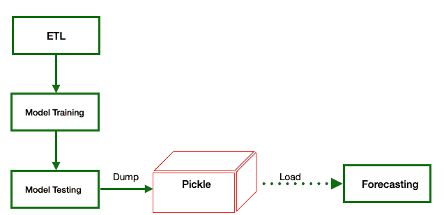

# Pickle Python -如何使用、需求和示例

> 原文：<https://blog.quantinsti.com/pickle-python/>

马里奥·比萨

作为分析师，我们花费大量时间处理、转换和推断数据，我们处理大量数据，并投入大量时间对其进行分析和处理。

有一种机制允许我们保存处理过的数据以备将来检索，而不必再次经历同样昂贵的过程，这是很方便的。Pickle 是一个允许我们将 Python 对象保存在二进制文件中的实用程序。换句话说:

> 泡菜能让我们节省时间。

在这里，我们涵盖:

*   [对泡菜蟒的需求](#the-need-for-pickle-python)
*   [什么是咸菜蟒？](#what-is-pickle-python)
*   [Pickle Python 的例子](#example-of-pickle-python)
*   [如何使用 Pickle Python 保存工作](#how-to-use-pickle-python-to-save-work)
*   [如何使用 Pickle Python 检索作品](#how-to-use-pickle-python-to-retrieve-work)

* * *

## 对 Pickle Python 的需求

当我们在分析和[回测](/backtesting/)中处理大量数据时，机器需要几个小时，如果不是几天的话，来处理所有的信息。

从消化数据所需的机器时间的角度来看，用几十年的历史数据对大量金融资产组合进行回溯测试或训练我们的 ML 算法是繁重的过程。

大多数时候，一遍又一遍地重复这个过程是没有意义的，是浪费时间和资源。因此，有一种机制允许我们保存处理过的数据以备将来检索，而不必重复同样昂贵的过程，这是很方便的。

在 Python 中有多种机制和格式，比如纯文本文件、二进制文件以及结构化和非结构化数据库。

最流行的纯文本文件是 csv(逗号分隔值)、json (JavaScript 对象符号)或 xml(扩展标记语言)。纯文本文件的主要特征是它们是人类可读的，并且可以在机器之间交换。

结构化和非结构化数据库能够存储大量信息，将数据相互关联，并为查询提供快速准确的答案。

最后，我们可以使用二进制文件来存储信息。这些文件不是人类可读的，因为它们存储了只有机器才能理解的字节信息。

与以前的相比，它们的主要特点是存储/检索速度快，体积小。Pickle 是一个允许我们将 Python 对象保存在二进制文件中的实用程序。

* * *

## 泡菜蟒蛇是什么？

从[官方文档](https://docs.python.org/3/library/pickle.html)来看，关于 Pickle Python 的技术解释如下:

*[*pickle*](https://docs.python.org/3/library/pickle.html#module-pickle)*模块实现了用于序列化和反序列化 Python 对象结构的二进制协议。**

**“pickle”是将 Python 对象层次转换成字节流的过程，“unpickling”是逆操作，将字节流(来自* [*二进制文件*](https://docs.python.org/3/glossary.html#term-binary-file) *或* [*类字节对象*](https://docs.python.org/3/glossary.html#term-bytes-like-object) *)转换回对象层次。**

**酸洗(和拆线)又可称为“串行化”、“编组”、“T1”[*1*](https://docs.python.org/3/library/pickle.html#id7)*或“展平”；然而，为了避免混淆，这里使用的术语是“酸洗”和“拆洗”。***

*为了简单起见，我们可以说 Pickle 在机器的 RAM 中存储和检索 Python 对象。*

*重要的是要记住，在 Python 中，即使变量也是对象，无论我们处理的数据来自哪里，信息都驻留在机器的易失性存储器中，也称为 RAM(随机存取存储器)。*

*除非我们将这些信息以任何文件格式或数据库保存在存储系统(如硬盘)中，否则这些信息会在 Python 会话结束时丢失。*

* * *

## *Pickle Python 示例*

*让我们假设以下场景。*

### *Pickle Python 场景 1*

<figure class="kg-card kg-image-card kg-width-full kg-card-hascaption">*

<figcaption>Pickle Python example - High level abstraction</figcaption>* </figure>

*该图显示了 ML 项目中常见的非常高层次的抽象。*

***ETL** (提取、转换和加载)是用于以下目的的工具:*

*   *从数据源中提取数据，*
*   *通过清理、消毒、检查、恢复、推断、关联等方式转换数据。最后*
*   ***L** 在数据库中加载，保存 csv/hdf5 文件或直接加载到模型中。*

*从 CPU 时间的角度来看，**模型训练**是最麻烦的过程，从分析师的角度来看也是非常麻烦的过程，因为模型需要调整，直到它被训练。*

*一旦模型被训练和调整，有必要**测试模型**的性能并验证它是否适合所提供的训练。*

*理想情况下，经过大量的工作和努力，我们应该获得一个模型，让我们能够对某事做出**预测**。*

*这里的问题是，如果我们关掉机器，我们必须重复整个过程。也许幸运的是，我们在 ETL 过程之后保存了数据，但是我们必须在任何情况下执行训练和测试。*

*在一个简单的原型中，这可能不是一个问题，但是当我们训练一个需要几个小时甚至几天工作的模型时，像 Pickle Python 这样的工具可以让我们节省大量的工作，从而节省时间。*

### *Pickle Python 场景 2*

*在下面的场景中，我们可以看到测试流程和预测流程之间的 Pickle 对象。*

<figure class="kg-card kg-image-card kg-width-full kg-card-hascaption">*

<figcaption>Pickle Python example - Pickle object between the testing process and the forecasting process</figcaption>* </figure>

*简而言之，Pickle 允许我们将内存中的 Python 对象转储到二进制文件中，以便稍后检索它们并继续工作。让我们看看如何将内存转储到文件中，然后再从文件中加载内存。*

* * *

## *如何使用 Pickle Python 节省工作*

*使用 Pickle Python 将对象从 RAM 转储到二进制文件的过程非常简单:*

*`import pickle`*

 *`pickle.dump(object, model_x.pkl, other_params)`

这一行简单的代码无疑为我们节省了大量的工作。另一方面，该函数接受许多其他参数，建议查阅[官方文档](https://docs.python.org/3/library/pickle.html#)。

* * *

## 如何使用 Pickle Python 检索工作

从二进制 Pickle 文件加载到 RAM 的过程非常简单:

`import pickle`

`model = pickle.load(model_x.pkl)`

通过这一行简单的代码，我们将模型放回到内存中，就好像我们刚刚完成了模型测试过程一样。

需要注意的是**将未知的 pickle 文件加载到 RAM 中会严重危害机器**的安全性，所以不建议使用来历不明的 Pickle 文件。

* * *

## 结论

Pickle 是一个很棒的工具，可以转储 Python 对象，只要 Python 会话持续，这些对象就必须在内存中。

当 Python 会话结束时，内存中的内容会丢失，通常所有信息都必须重新处理。使用 Pickle，我们可以将 RAM 转储到一个二进制文件中，以便在另一个 Python 会话中恢复内存内容，从而避免重新处理所有信息。

如果你认为机器学习是[金融市场](https://quantra.quantinsti.com/course/financial-time-series-analysis-trading)未来的重要组成部分，那么对于那些对[机器学习](https://quantra.quantinsti.com/course/introduction-to-machine-learning-for-trading)及其在 Quantra - [交易中的应用感兴趣的人来说，你不能错过这个强烈推荐的课程:金融市场中的机器学习&深度学习](https://quantra.quantinsti.com/learning-track/machine-learning-deep-learning-in-financial-markets)。立即注册！

* * *

*<small>免责声明:股票市场的所有投资和交易都涉及风险。在金融市场进行交易的任何决定，包括股票或期权或其他金融工具的交易，都是个人决定，只能在彻底研究后做出，包括个人风险和财务评估以及在您认为必要的范围内寻求专业帮助。本文提到的交易策略或相关信息仅供参考。【T2</small>**