# 股票市场数据:用 Python 获取数据、可视化和分析

> 原文：<https://blog.quantinsti.com/stock-market-data-analysis-python/>

由[伊山沙阿](https://www.linkedin.com/in/ishan-shah-18393828/)

您是否希望获得股票市场数据并使用 Python 分析历史数据？你来对地方了。

**读完这篇文章，你将能够:**

*   获取股票的历史数据
*   绘制股票市场数据并分析其表现
*   获取基本面、期货和期权数据

**为便于导航，本文分为如下:**

*   [如何用 Python 获取股市数据？](#how-to-get-stock-market-data-in-python)
*   如何获取不同地区的股市数据？
*   标准普尔 500 指数成份股公司
*   [日内或分钟频率股票数据](#intraday-or-minute-frequency-stock-data)
*   [重新采样股票数据](#resample-stock-data)
*   [基础数据](#fundamental-data)
*   [期货和期权数据](#futures-and-options)
*   [股市数据可视化与分析](#stock-market-data-visualization-and-analysis)

* * *

## **如何用 Python 获取股市数据？**

### **雅虎财经**

Yahoo finance 是获得历史日价量股票市场数据的第一个来源。您可以使用`pandas_datareader`或`yfinance`模块获取数据，然后可以使用 pandas.to_csv 方法下载或存储在 csv 文件中。

如果你的电脑上没有安装 yfinance，那么从你的 Jupyter 笔记本上运行下面一行代码来安装 yfinance。

<figure class="kg-card kg-image-card kg-width-full">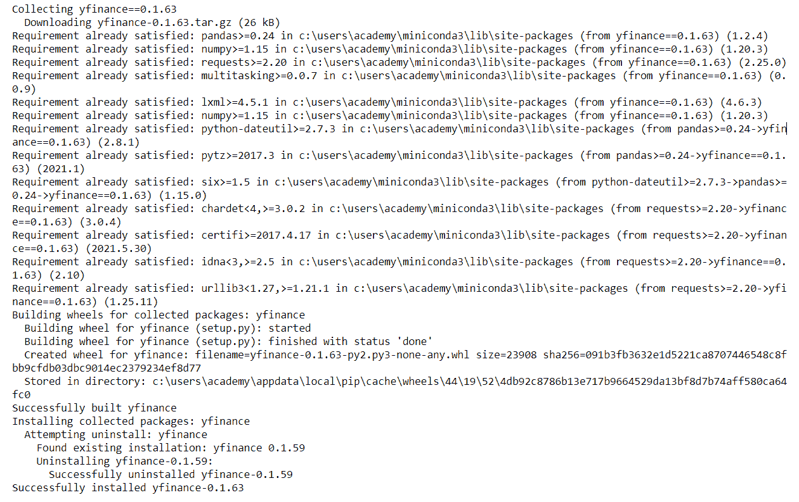</figure>

<figure class="kg-card kg-image-card kg-width-full"></figure>

要可视化调整后的收盘价数据，可以使用 matplotlib 库和 plot 方法，如下所示。

<figure class="kg-card kg-image-card kg-width-full">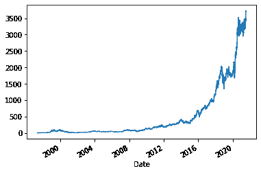</figure>

让我们通过调整大小、给出适当的标签和添加网格线来提高可读性。

<figure class="kg-card kg-image-card kg-width-full">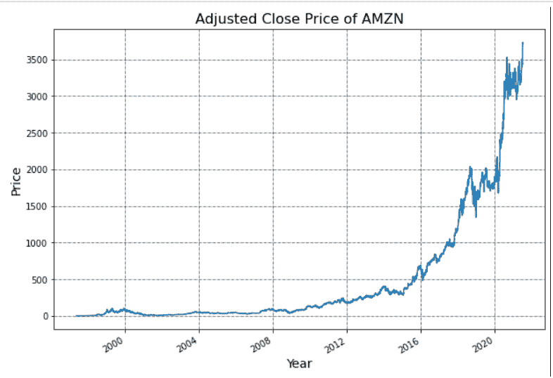</figure>

**优势**

1.  调整后的收盘价股票市场数据可用
2.  最近的[股票市场数据](https://quantra.quantinsti.com/course/getting-market-data)可用
3.  不需要 API 键来获取股票市场数据

* * *

这是 Nitesh Khandelwal(QuantInsti 联合创始人兼首席执行官)的一个有趣的视频，它回答了你所有关于获取 Algo 交易数据的问题。

[https://www.youtube.com/embed/f_noS2Tu7jI?rel=0](https://www.youtube.com/embed/f_noS2Tu7jI?rel=0)

* * *

## 如何获取不同地域的股市数据？

要获得不同地区的股市数据，请在雅虎财经上搜索股票代码，并将其用作股票代码。

**获取多个报价机的股票市场数据**

要获得多个股票报价机的股票市场数据，您可以创建一个报价机列表，并为每个股票报价机调用 **yfinance 下载方法**。

为了简单起见，我创建了一个数据框架`data`来存储股票调整后的收盘价。

<figure class="kg-card kg-image-card kg-width-full"></figure>

<figure class="kg-card kg-image-card kg-width-full">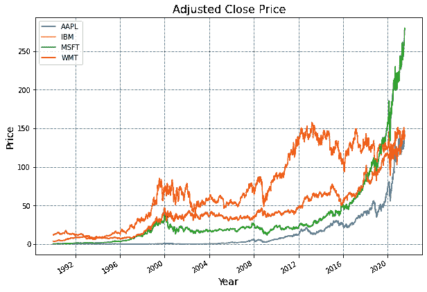</figure>

* * *

## 标准普尔 500 证券交易所

如果你想分析组成标准普尔 500 的所有股票的市场数据，下面的代码将会帮助你。它从维基百科页面获取股票列表，然后从 yahoo finance 获取股票市场数据。

<figure class="kg-card kg-image-card kg-width-full">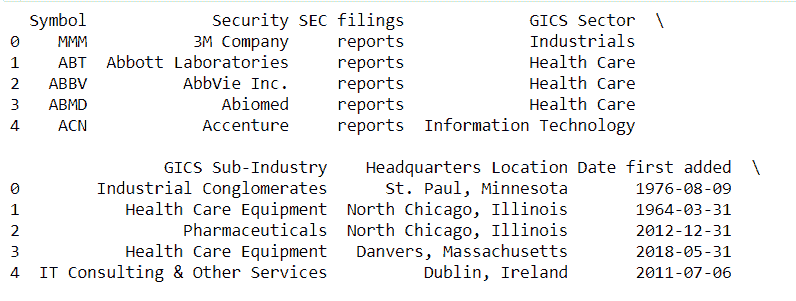</figure>

<figure class="kg-card kg-image-card kg-width-full">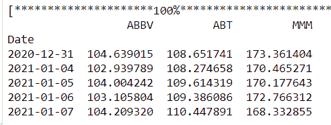</figure>

* * *

## **日内或分钟频率股票数据**

yfinance 模块可用于获取分钟级别的股票市场数据。它返回过去 7 天的股票市场数据。

如果你的电脑上没有安装 yfinance，那么从你的 Jupyter 笔记本上运行下面一行代码来安装 yfinance。

yfinance 模块有下载方法，可以用来下载股市数据。

它采用以下参数:

1.  `ticker`:您想要股票市场数据的报价机的名称。如果你想得到多个报价机的股票市场数据，那就用空格把它们分开
2.  `period`:需要多少天/月的股市数据。有效频率为 1d、5d、1mo、3mo、6mo、1y、2y、5y、10y、ytd、max
3.  `interval`:股市数据的频率。有效间隔为 1 米、2 米、5 米、15 米、30 米、60 米、90 米、1 小时、1 天、5 天、1 周、1 天、3 天

下面的代码以 1 分钟的频率获取 MSFT 过去 5 天的股票市场数据。

<figure class="kg-card kg-image-card kg-width-full">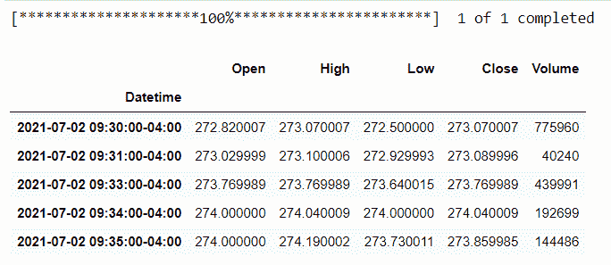</figure>

* * *

## 重新采样股票数据

### 将 1 分钟数据转换为 1 小时数据或对股票数据进行重新采样

在策略建模过程中，您可能需要使用自定义频率的股票市场数据，例如 15 分钟、1 小时甚至 1 个月。

如果您有分钟级别的数据，那么您可以通过重新采样轻松构建 15 分钟、1 小时或每日蜡烛线。因此，您不必单独购买它们。

在这种情况下，您可以使用熊猫[重采样](https://pandas.pydata.org/pandas-docs/version/0.23.3/generated/pandas.DataFrame.resample.html)方法将股市数据转换为您选择的频率。这些的实现如下所示，其中 1 分钟的频率数据被转换为 10 分钟的频率数据。

第一步是用转换逻辑定义字典。例如，要获得开放值，将使用第一个值，要获得高值，将使用最大值，依此类推。

开盘、盘高、盘低、收盘和成交量的名称应该与数据框架中的列名相匹配。

将索引转换为日期时间时间戳，因为默认情况下会返回字符串。然后调用重采样方法，频率如下:

*   10T 10 分钟，
*   d 持续 1 天，并且
*   m 为 1 个月

<figure class="kg-card kg-image-card kg-width-full">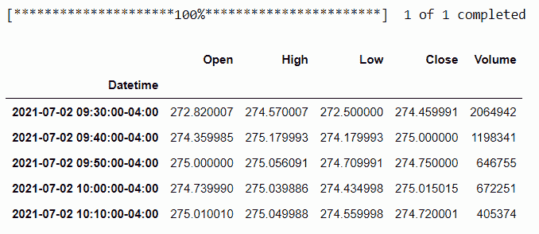</figure>

雅虎财经拥有有限的分钟级数据集。如果你需要更高范围的股票市场数据，那么你可以从 Quandl、AlgoSeek 或你的经纪人那里获得数据。

### 使用 Quandl 获取股票市场数据(可选)

Quandl 有很多数据源可以得到不同类型的股市数据。但是，有些是免费的，有些是付费的。 **Wiki** 是 Quandl 的免费数据源，用于获取 **3000+美股**的收盘价格数据。它是由 Quandl 社区策划的，也提供关于分红和分割的信息。

Quandl 还提供分钟和更低频率的付费数据源。

要获取股票市场数据，如果尚未安装 quandl 模块，您需要使用如下所示的 **pip 命令**首先安装该模块。

您需要从 quandl 获得自己的 API 密钥，以使用下面的代码获得股票市场数据。如果您在获取 API 密钥时遇到问题，那么您可以参考[此](https://help.quandl.com/article/320-where-can-i-find-my-api-key)链接。

获得密钥后，将变量 QUANDL_API_KEY 赋给该密钥。然后设置开始日期、结束日期和您想要获取其股票[市场数据](https://quantra.quantinsti.com/course/introduction-to-data-science)的资产的股票代号。

quandl`get`方法以这个股市数据作为输入，返回开盘价、最高价、最低价、收盘价、成交量、调整值等信息。

| 日期 | 打开 | 高的 | 低的 | 关闭 | 卷 | 除息 | 分流比 | 开放的 | Adj .高的 | 低的 | 接近的 | 可调音量 |
| --- | --- | --- | --- | --- | --- | --- | --- | --- | --- | --- | --- | --- |
| 1997-05-16 | Twenty-two point three eight | Twenty-three point seven five | Twenty point five | Twenty point seven five | One million two hundred and twenty-five thousand | Zero | One | 1.865000 | 1.979167 | 1.708333 | 1.729167 | Fourteen million seven hundred thousand |
| 1997-05-19 | Twenty point five | Twenty-one point two five | Nineteen point five | Twenty point five | Five hundred and eight thousand nine hundred | Zero | One | 1.708333 | 1.770833 | 1.625000 | 1.708333 | Six million one hundred and six thousand eight hundred |
| 1997-05-20 | Twenty point seven five | Twenty-one | Nineteen point six three | Nineteen point six three | Four hundred and fifty-five thousand six hundred | Zero | One | 1.729167 | 1.750000 | 1.635833 | 1.635833 | Five million four hundred and sixty-seven thousand two hundred |
| 1997-05-21 | Nineteen point two five | Nineteen point seven five | Sixteen point five | Seventeen point one three | One million five hundred and seventy-one thousand one hundred | Zero | One | 1.604167 | 1.645833 | 1.375000 | 1.427500 | Eighteen million eight hundred and fifty-three thousand two hundred |
| 1997-05-22 | Seventeen point two five | Seventeen point three eight | Fifteen point seven five | Sixteen point seven five | Nine hundred and eighty-one thousand four hundred | Zero | One | 1.437500 | 1.448333 | 1.312500 | 1.395833 | Eleven million seven hundred and seventy-six thousand eight hundred |

* * *

要了解更多关于如何使用 Quandl 的信息，请查看这篇文章:

*   [如何通过 Python API 获取历史市场数据](/historical-market-data-python-api/)

* * *

## 基本**数据**

我们已经使用了 **yfinance** 来获得基本数据。

第一步是设置股票代码，然后调用适当的属性来获取正确的股票市场数据。

如果你的电脑上没有安装 yfinance，那么从你的 Jupyter 笔记本上运行下面一行代码来安装 yfinance。

### **关键比率**

您可以获取最新的市净率和市盈率，如下所示。

### **收入**

<figure class="kg-card kg-image-card kg-width-full">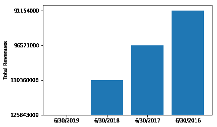</figure>

### **息税前收益(EBIT)**

<figure class="kg-card kg-image-card kg-width-full">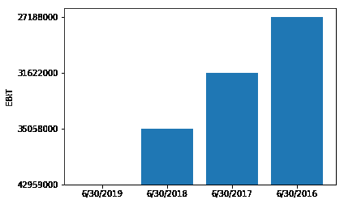</figure>

### **资产负债表、现金流等信息**

* * *

在本次网络研讨会录音中，Deepak Shenoy(capital mind 创始人兼首席执行官)解释了如何使用[金融市场](https://quantra.quantinsti.com/course/financial-time-series-analysis-trading)数据进行基本面分析。

[https://www.youtube.com/embed/yfAVYce7Xhk?rel=0](https://www.youtube.com/embed/yfAVYce7Xhk?rel=0)

* * *

**建议改为**

要了解更多关于 Jupyter notebook 的信息，这里有一个关于 Jupyter Notebook 的教程。它不需要任何先决知识，也不假定您熟悉该框架。

* * *

## **期货和期权数据**

如果你正在寻找期权链数据，那么你可以参考 Quantra 上关于获取市场数据的免费课程。

### **NSEpy**

**nsepy 包**用于获取[期货](https://quantra.quantinsti.com/course/futures-trading)和印度股票和指数期权的股市数据。

### **期货数据**

| 日期 | 标志 | 满期 | 打开 | 高的 | 低的 | 关闭 | 最后的 | 结算价格 | 合同数量 | 营业额 | 未平仓利息 | OI 的变化 | 底层 |
| --- | --- | --- | --- | --- | --- | --- | --- | --- | --- | --- | --- | --- | --- |
| 2019-01-15 | HDFC | 2019-02-28 | One thousand nine hundred and eighty-six point seven | Two thousand and eleven | One thousand nine hundred and eighty-two point nine five | Two thousand and eight point two five | Two thousand and six point two | Two thousand and eight point two five | Four thousand eight hundred and ten | 4.796817e+09 | Two million five hundred and thirty-seven thousand five hundred | Two million two hundred and ninety-nine thousand five hundred | One thousand nine hundred and ninety-two point one five |
| 2019-01-16 | HDFC | 2019-02-28 | Two thousand and two point one | Two thousand and ten point one five | One thousand nine hundred and eighty-five point two | One thousand nine hundred and ninety-two point one five | One thousand nine hundred and ninety-one point three | One thousand nine hundred and ninety-two point one five | Two thousand six hundred and fifty-six | 2.655748e+09 | Three million seven hundred and eighty-three thousand five hundred | One million two hundred and forty-six thousand | One thousand nine hundred and seventy-five |
| 2019-01-17 | HDFC | 2019-02-28 | Two thousand and three point six | Two thousand and nineteen point zero five | One thousand nine hundred and ninety-one point six | Two thousand and seventeen point one five | Two thousand and thirteen | Two thousand and seventeen point one five | Three thousand nine hundred and ninety-three | 4.008667e+09 | Five million five hundred and forty-five thousand | One million seven hundred and sixty-one thousand five hundred | 圆盘烤饼 |
| 2019-01-18 | HDFC | 2019-02-28 | Two thousand and eighteen point five five | Two thousand and twenty-five point seven five | Two thousand and five | Two thousand and eighteen point four | Two thousand and seventeen point two five | Two thousand and eighteen point four | Four hundred and eighty-one | 4.845300e+08 | Five million six hundred and thirty-seven thousand | Ninety-two thousand | Two thousand and six point eight five |
| 2019-01-21 | HDFC | 2019-02-28 | Two thousand and eleven point two five | Two thousand and thirty-one point one | One thousand nine hundred and ninety-eight | Two thousand and sixteen point five five | Two thousand and sixteen point six | Two thousand and sixteen point five five | One thousand four hundred and eighty-nine | 1.505249e+09 | Six million two hundred and fifty-eight thousand | Six hundred and twenty-one thousand | Two thousand and four point four five |

<figure class="kg-card kg-image-card kg-width-full">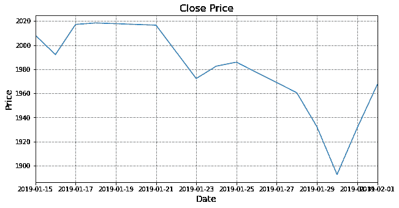</figure>

### **选项数据**

| 日期 | 标志 | 满期 | 选项类型 | 执行价格 | 打开 | 高的 | 低的 | 关闭 | 最后的 | 结算价格 | 合同数量 | 营业额 | 溢价周转率 | 未平仓利息 | OI 的变化 | 底层 |
| --- | --- | --- | --- | --- | --- | --- | --- | --- | --- | --- | --- | --- | --- | --- | --- | --- |
| 2019-01-15 | HDFC | 2019-02-28 | 这一个 | Two thousand | Fifty-two point seven | Fifty-six | Fifty-two point seven | Fifty-six | Fifty-six | Fifty-six | three | Three million and eighty-one thousand | Eighty-one thousand | ten thousand | One thousand | One thousand nine hundred and ninety-two point one five |
| 2019-01-16 | HDFC | 2019-02-28 | 这一个 | Two thousand | Fifty-five | Fifty-five | Forty-nine | Forty-nine | Forty-nine | Forty-nine | Fourteen | Fourteen million three hundred and fifty-eight thousand | Three hundred and fifty-eight thousand | Eleven thousand | One thousand | One thousand nine hundred and seventy-five |
| 2019-01-17 | HDFC | 2019-02-28 | 这一个 | Two thousand | Fifty-nine point one five | Sixty-four point six five | Fifty-one | Sixty-one point nine | Sixty-one point nine | Sixty-one point nine | Twenty-seven | Twenty-seven million seven hundred and fifty thousand | Seven hundred and fifty thousand | Eighteen thousand five hundred | Seven thousand five hundred | 圆盘烤饼 |
| 2019-01-18 | HDFC | 2019-02-28 | 这一个 | Two thousand | Sixty-three | Sixty-three | Sixty | Sixty | Sixty | Sixty | seven | Seven million two hundred and twelve thousand | Two hundred and twelve thousand | Eighteen thousand five hundred | Zero | Two thousand and six point eight five |
| 2019-01-21 | HDFC | 2019-02-28 | 这一个 | Two thousand | Sixty-two point zero five | Sixty-nine | Sixty-two point zero five | Sixty-two point nine | Sixty-two point nine | Sixty-two point nine | six | Six million one hundred and ninety-eight thousand | One hundred and ninety-eight thousand | Twenty thousand | One thousand five hundred | Two thousand and four point four five |

<figure class="kg-card kg-image-card kg-width-full">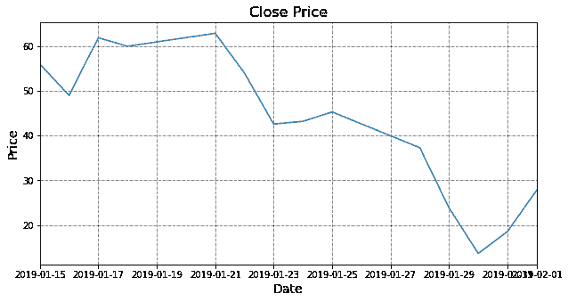</figure>

* * *

**建议读数**

*   [期货交易基础知识](/futures-trading/)
*   [期权交易基础知识](/basics-options-trading/)

* * *

## **股市数据可视化与分析**

有了[股市数据](https://quantra.quantinsti.com/course/stock-market-basics)之后，下一步就是制定交易策略并分析表现。分析性能的简易性是 Python 的主要优势。

我们将分析累积回报、提款图、不同比率，例如

*   [夏普比率](/sharpe-ratio-applications-algorithmic-trading/)，
*   Sortino 比率，以及
*   卡尔马尔比率。

这里有一篇描述上述比率的文章:[使用 Python 的投资组合分配和配对交易策略](/portfolio-allocation-pair-trading-strategy-python-project-ravindra-rawat/)

为了便于说明，我创建了一个简单的买入并持有策略，其中包括四只股票:

*   **苹果**
*   **亚马逊**
*   **微软**
*   **沃尔玛**

要分析性能，您可以使用如下所示的 **pyfolio 撕页**。

如果尚未安装 pyfolio，请安装，如下所示:

<figure class="kg-card kg-image-card kg-width-full">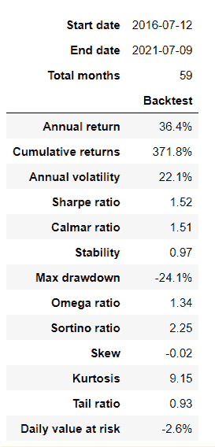</figure>

**建议使用 Python 进行数据可视化读取**

*   [面向 Python 数据可视化的 Seaborn】](/creating-heatmap-using-python-seaborn/)
*   [Plotly Python 用于交互式数据可视化](/plotly-python/)
*   [用于 Python 中数据可视化的散景](/python-data-visualization-using-bokeh/)

你会发现阅读这些精选的顶级博客很有用，也很有见识:

[Python 进行交易](/python-trading-top-blogs/)
[机器学习](/machine-learning-top-blogs/)
[情绪交易](/sentiment-trading-top-blogs/)
[算法交易](/algorithmic-trading-top-blogs/)
[期权交易](/options-trading-top-blogs/)
[技术分析](/technical-analysis-top-blogs/)

* * *

## 结论

我希望这篇文章将使你能够使用 Python 代码来获取你最喜欢的股票的[股市](https://quantra.quantinsti.com/course/stock-market-basics)数据，使用这些股市数据建立策略并分析这些数据。如果您能在下面分享您的想法和评论，我将不胜感激。

Python 对于理解数据结构、数据分析、[处理金融数据](https://quantra.quantinsti.com/course/data-and-feature-engineering-for-trading)，以及生成交易信号是相当必要的。

如果你也想学习如何获取各种数据，如股票的定价数据、基本面数据、按关键字发布的推文和最新的新闻标题数据，请查看 Quantra 的这个完全免费的课程[获取市场数据:股票、加密、新闻&基本面](https://quantra.quantinsti.com/course/getting-market-data)。

您也可以查看我们关于[加密交易策略](https://quantra.quantinsti.com/course/crypto-trading-strategies-advanced)的课程，这对于希望探索加密货币交易机会的程序员和定量分析师来说是完美的。

* * *

*<small>免责声明:股票市场的所有投资和交易都涉及风险。在金融市场进行交易的任何决定，包括股票或期权或其他金融工具的交易，都是个人决定，只能在彻底研究后做出，包括个人风险和财务评估以及在您认为必要的范围内寻求专业帮助。本文提到的交易策略或相关信息仅供参考。</small>T3】*