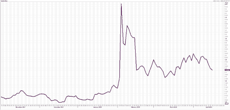
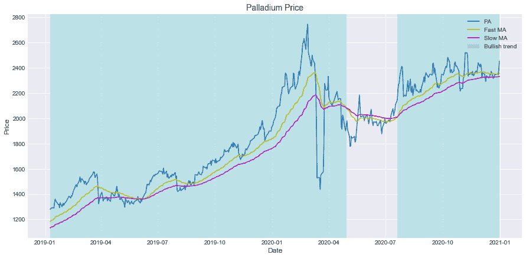
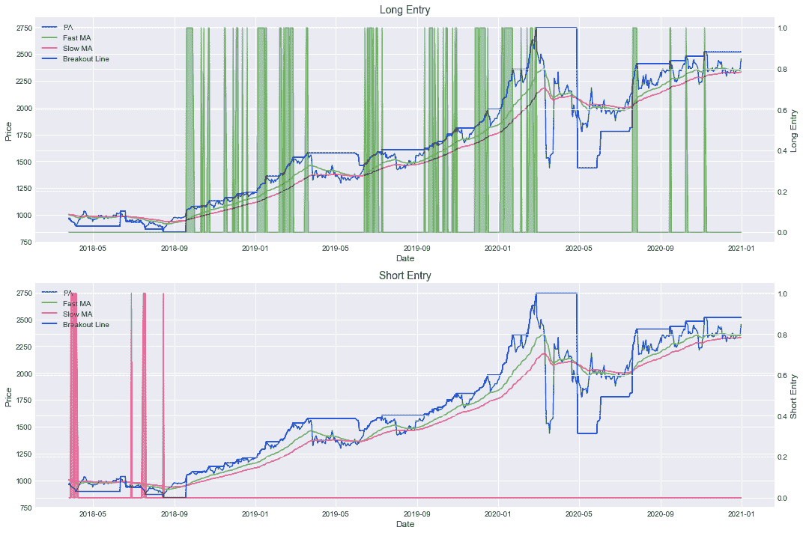
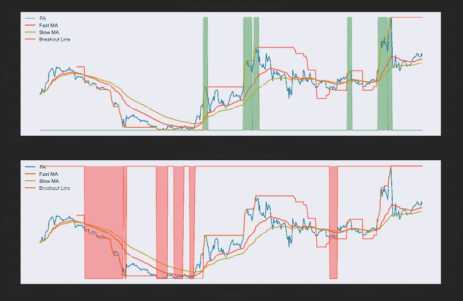
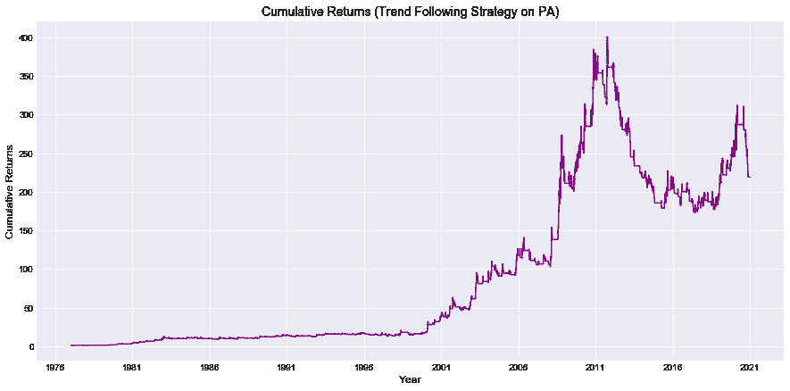

# 期货交易讲解

> 原文：<https://blog.quantinsti.com/futures-trading/>

由[萨特雅普里雅·乔德里](https://www.linkedin.com/in/satyapriya-chaudhari-73976b16a/)

你一定听说过金融市场中的衍生品，也许在某个时候，你可能也交易过/想过交易它们。在本文中，你将了解期货市场，它是衍生品市场的重要组成部分之一。你将学习期货合约的特征和参数。您还将了解期货数据和期货市场的趋势跟踪策略。

在这篇博客中，我们将讨论以下主题:

*   [远期&期货](#forward-futures)
*   [期货合约的特征](#characteristics-of-a-futures-contract)
*   [期货合约的参数](#parameters-of-a-futures-contract)
*   [期货合约的报价器](#ticker-of-a-futures-contract)
*   [盈利&期货交易亏损](#profit-loss-in-futures-trading)
*   [提取期货数据](#fetching-futures-data)
*   [期货延续](#futures-continuation)
*   [期货交易策略](#futures-trading-strategy)
*   [股指期货](#index-futures)
*   [期货市场交易的优势](#advantages-of-trading-in-futures-market)
*   [期货市场交易的限制](#limitations-of-trading-in-futures-market)

衍生品市场在维持市场平衡方面发挥着非常关键的作用。衍生品是从其他金融资产中获取价值的合约。这些资产被称为基础资产。基础资产可以是任何东西，如股票、货币、利率或农业和非农业商品。

期货市场是衍生品市场不可分割的一部分。在了解期货市场之前，了解远期市场的概念是非常重要的。

* * *

## 远期和期货

远期合同是衍生产品的最简单形式。在远期合同中，有双方(称为买方和卖方)同意在固定(未来)日期以固定价格购买和出售固定数量的特定资产。

他们根据 ISDA 主协议签订了一份合同，规定了双方的义务。价格由双方在协议之日决定。远期合同的主要目的是保护买卖双方免受未来风险。

让我们借助一个例子来理解远期和期货。

彼得有一个大农场，再过三个月就要收割小麦了。收获的成本是每公吨 150 美元。因为将来会收获，所以价格没有保证。它可以上升，也可以由于一些不可预见的事件而下跌。如果小麦价格跌破每公吨 150 美元，彼得将不得不承担损失。

同样，像 Mondelez 这样的食品制造巨头需要数吨小麦来生产产品。如果它以每公吨 300 多美元的价格购买小麦，它就会亏损。和彼得一样，蒙德勒兹也不确定三个月后小麦的价格会是多少。

因此，为了维护他们的利益，他们可以签订合同。根据这份合同，彼得将在三个月后向蒙德勒兹出售 100 公吨小麦，每公吨 200 美元。

这样，彼得(卖方)和蒙德勒兹(买方)都将保护自己免受任何未来风险。这是最简单的合同形式，被称为远期合同。

根据这份合同，卖方必须在固定的日期以预定的价格向买方出售固定数量的货物。远期合约涉及的最大风险是交易对手风险。只有双方同意，合同才能继续执行。

远期合约不能进一步交易，必须在买卖双方之间结算。然而，类似的合同可以与另一方交易。虽然远期合同的结构相当简单，但并不固定。这些合同的条款因情况而异。

期货合同类似于远期合同，但它们是标准化的。

现在让我们来看看期货合约的特点。

* * *

## 期货合约的特征

1.  **标准化:**期货合约的所有参数都是标准化的。例如，在上述情况下，在远期合同中，根据买方和卖方的决定，小麦的数量可以是 90 公吨或 110 公吨。但是期货合约中的数量不能改变，其他任何参数也不能改变。
2.  **期货合约的价格:**由于期货市场是衍生品市场不可分割的一部分，期货合约的价格是以标的资产的价格为基础的。相反，期货合约的价格是基于标的资产的未来价格。它考虑了现货价格、无风险收益率、到期时间等。来决定最终价格。
3.  **有时间限制:**每份期货合约都是有时间限制的。这个时间被称为期货合约的到期日。期货合约在当月的最后一个星期四到期。如果上周四是节假日，合同将在前一个工作日到期。期货合约有三种不同的时间期限。这意味着你可以交易在三个不同时间到期的期货合约。我们用一个例子来理解这个。让我们假设你在一月份做交易。
    *   **近月-** 即将在当月到期的合约为近月合约。一月份，一份近一个月的合同将于一月份到期。
    *   **下个月-** 即将在下个月到期的合约是下个月合约。1 月份，下个月的合同 2 月份到期。
    *   **远月-** 即将在次月到期的合约是远月合约。一月份，下个月的合同三月份到期。
4.  与期货市场不同，期货市场受到监管机构的高度监管。在美国，期货市场由商品期货交易委员会(CFTC)监管。这个机构的作用是监督所有的期货合同，并确保它们顺利运行。因此，期货合约违约的可能性被消除，每份合约都被集中清算。
5.  **可交易:**每个期货合约都是可交易的。这意味着你不需要等到合同到期才兑现。如果中途改变主意，可以在期货市场进一步买入/卖出合约(将合约转让给别人)。因此，你可以随时退出期货合约。
6.  **结算:**期货合约大多以现金结算。这意味着只需支付结算时的差额。这种解决受到管理机构的监督。您不一定要制造或接受交易的货物。

这些特征使得期货合约独一无二。这段视频解释了这一点:

[https://www.youtube.com/embed/7n3fSFZo_Ng?rel=0](https://www.youtube.com/embed/7n3fSFZo_Ng?rel=0)

* * *

## 期货合约的参数

1.  **批量大小:**期货合约的批量大小规定了您必须交易的资产的最小数量(或该数量的倍数)。这是一个预定的数字。例如，假设你想交易苹果股票的期货。苹果未来的批量是 100。这意味着你可以购买最少 125 股。或者可以 100 的倍数购买。如 2 手是 200 股，以此类推。每份合约的批量都不同。
2.  **合约价值:**我们继续上面的例子。你想买 1 手苹果股票，而苹果股票的交易价格是每股 125 美元。因此，苹果期货的合约价值将等于 12500 美元(125 * 100 美元)，即批量和价格的乘积。
3.  保证金:你不需要全部合约价值就可以进行交易。取而代之的是，你需要向经纪人交存一部分合同价值才能签订合同。这部分被称为保证金。当你进入期货合约时，保证金被冻结，当你退出期货合约时，保证金被解冻。
4.  **到期日:**众所周知，期货合约是有期限的，每份期货合约都有到期日。这是合同终止的日期。您需要在到期日当天或之前平仓，否则监管机构会为您平仓。在合同到期日，引入新的合同。你可能需要在这里注意，对于商品期货，你需要在第一个通知日期(通常在到期日之前一个月)之前出场。

* * *

## 期货合约的报价器

像你在金融市场交易的其他资产/商品一样，每份期货合约也有一个报价器。期货合约的代号是基础资产的根符号、到期月份和到期年份的组合。

*   **根符号-** 每种资产都有一个根符号，通常是两三个字母，代表市场。例如，GC 是 Comex 黄金市场的根符号，SI 是 Comex 白银市场的根符号。
*   **月-** 现在当你购买黄金合约时，你不是简单地购买黄金合约，而是购买特定月份的合约。比如，你到 2021 年 1 月的黄金合约。在合同中用一个字母来表示月份。这在不同的期货市场都很常见。例如，一月由字母 f 表示。下表显示了与不同月份相关的字母。

| 月 | 密码 | 月 | 密码 |
| --- | --- | --- | --- |
| 一月 | F | 七月 | 普通 |
| 二月 | G | 八月 | Q |
| 三月 | H | 九月 | U |
| 四月 | J | 十月 | V |
| 五月 | K | 十一月 | X |
| 六月 | M | 十二月 | Z |

*   **年份-** 这是用一位数或两位数来表示的。当使用单个数字时，它表示当前十年中的年份。

因此，2021 年 1 月 ***黄金*** 合约的股票代码将为 **GCF1** 。

* * *

## 期货交易的损益

正如你已经看到的，为了进入期货合约，你只需要在你的账户上有一定的保证金，这意味着期货市场使用高杠杆。杠杆越高，风险越高，潜在利润越高。

例如，让我们考虑你以 1000 美元的保证金购买一批苹果股票。请记住，对于苹果的未来，我们已经看到了这样的例子:

*   *批量:* 100
*   价格: $125
*   *合同价值:*$ 125 * 100 = $ 12500

现在可以有三种情况。

1.  价格上涨:苹果公司的股价超过 125 美元，达到 140 美元。在这种情况下，100 股股票在合同到期时的价值为 14，000 美元。因此，在合同结束时，支付给你的差额是 1500 美元(14000-12500 美元)。因此，通过冻结 1000 美元，你获利 1500 美元。
2.  价格下跌:苹果公司的股价跌至 110 美元，低于 125 美元。在这种情况下，100 股股票在合同到期时的价值为 11，000 美元。尽管如此，你仍有义务以 12，500 美元的价格购买 100 股苹果股票。因此，这将导致 1500 美元的损失。
3.  价格不变:在这种情况下，你既不会获利，也不会亏损。在这种情况下，买方或卖方的投资组合都不会受到影响。

因此，你可以说期货市场是一个**零和游戏。**这意味着未来市场的锅永远长不大。金钱只是从输家转移到赢家。买方的利润相当于卖方的损失，反之亦然。

这段视频解释了期货交易中如何计算盈亏:

[https://www.youtube.com/embed/BpznbF8lM_0?rel=0](https://www.youtube.com/embed/BpznbF8lM_0?rel=0)

* * *

## 获取期货数据

您可以从多个 web 源和 Python APIs 访问期货合约的历史数据。参考下面的文章，探索如何获取期货数据的 Python 代码。

*   [如何通过 Python API 获取历史市场数据](/historical-market-data-python-api/)
*   [Python 中的股市数据和分析](/stock-market-data-analysis-python/)

* * *

## 期货延续

正如你在本文前面看到的，一份期货合同在到期日之后将不再存在。因此，任何合约的可用数据都是很短时间内的(由于期货合约的寿命有限)，大多是一个月左右。这导致了处理期货数据时最棘手的问题之一。

问题是缺乏一个长期的时间序列来分析市场。像分析资产的一年移动平均线这样非常简单的任务不再那么简单了。你需要首先操纵数据，以实现更长时期的连续时间序列。这是通过延续实现的。

延续是通过将多个单独的序列拼接在一起而获得的时间序列。

期货延续是通过拼接多个单独的期货合约获得的时间序列。

您可能想到的一个非常简单的解决方案是，在前一个月的月底追加月度数据。然而，这可能导致灾难性的结果。如果你分析这些数据，你会发现一种资产/商品在本月的交易价格与上个月的交易价格大相径庭。

比如看下图。你可以看到这个系列中突然出现的峰值。这是因为连续两个月之间的价格差异。这并不意味着实际价格已经见顶。

<figure class="kg-card kg-image-card kg-width-full kg-card-hascaption">

<figcaption>Fig. 1: Appending monthly data</figcaption>

</figure>

因此，为了缝合单个合同，您需要小心避免这样的错误。你可以用不同的方法来装订合同。让我们来看看其中的几个。

1.  **附加调整-** 在这种方法下，您及时调整以前的合同，使以前合同的最后一个值与当前合同的第一个值相匹配。这是通过简单地增加或减少一个价值的整个系列的前一个合同。该值等于先前合约的最后一个值与当前合约的第一个值之间的差值。

$ $ \ text {调整系数=第二个合同的第一个价格-第一个合同的最后价格}$$

这种方法的主要缺点是，经过一定的调整后，它会给我们留下负值。

2.  **比例调整-** 在这种方法下，调整系数不是差额，而是百分比。这里整个系列按百分比移动。

$ $ \ text {调整系数=第二个合同的第一个价格/第一个合同的最后价格}$$

整个时间序列不是加上或减去该因子，而是乘以该因子。缺点是绝对价格水平不再反映调整后的真实市场价格。

通过应用上述调整获得期货延续序列后，您可以对时间序列进行分析，并创建您的交易策略。我们来看一个在期货市场已经使用了几十年的简单策略，趋势跟随策略。

* * *

## 期货交易策略

趋势跟踪期货策略的出现可以追溯到 20 世纪 80 年代，今天通过这种策略管理的资金估计有 50000 亿美元。趋势跟踪策略是基于这样一个原则，即价格在一段持续的时间内通常会继续向同一个方向移动。

趋势跟踪策略的目的不是在底部买入，在顶部卖出。但它试图捕捉趋势的变化。当趋势发生变化时，它就会进场。这并不意味着一有变化就产生进场信号，而是模型等待一段时间，让变化成为趋势。

只要趋势持续，模型就保持在这个位置。同样的逻辑也适用于退出交易。退出信号不是在改变后立即产生，而是在等待一段时间后产生。如果趋势是看涨的，你做多，如果趋势是看跌的，你做空。

这里要注意的重要一点是，大多数趋势跟踪交易都以亏损告终。即使是一个成功的趋势跟踪模型，成功的交易也只有 30%到 40%。然而，如果处理得当，失败的交易会有小的损失，很少有大的收益可以弥补，甚至远远超过损失。

为了保持高利润的机会，有必要确保参与所有的交易，不要错过任何一笔交易。既然赢的交易次数少了，大赢的就更少了，为了不错过这个会弥补其他损失的巨大的赢，参与所有的交易是非常重要的。

这个视频解释了趋势跟踪策略的原则。

[https://www.youtube.com/embed/cctiEodJZJw?rel=0](https://www.youtube.com/embed/cctiEodJZJw?rel=0)

期货市场有多种多样的资产可供你折价交易。期货合约的基础资产可以是任何东西，如股票、货币、利率或农业和非农业商品。

期货市场上一些最具流动性的资产是原油、天然气、玉米、大豆和小麦。下表显示了可以在期货市场交易的资产。

| **货币** | **农业** | **非农** | **股票** | **息** |
| 澳元 | 饲料小麦 | 原油 | 标准普尔 500 指数 | 欧洲美元 |
| 增益带宽乘积（Gain-Bandwidth Product 的缩写） | 玉米 | 金色的 | 纳斯达克 | 2y 国库 |
| 计算机辅助设计 | 棉花 | 铜 | 日经 225 指数 | 5y 国库 |
| 欧元 | 育肥用牛 | 民用燃料油 | 道琼斯 | 10y 国库 |
| 美元指数 | 阿拉比卡咖啡 | 柴油 | 维克斯 | 30y 债券 |
| 日元（JapaneseYen） | 罗布斯塔咖啡 | 钯 |   |   |
| 新西兰元 | #5 糖 | 铂 |   |   |
| 充血性心力衰竭(congestive heart failure) | #11 糖 | 汽油 |   |   |
|   | 燕麦 | 银 |   |   |
|   | 黄豆 | 比特币 |   |   |
|   | 大豆粉 |   |   |   |
|   | 木材 |   |   |   |
|   | 稻谷 |   |   |   |
|   | 可可粉 |   |   |   |

让我们看看这一策略在非农业大宗商品钯上的表现。该策略通过 Palladium 从 1977 年到 2020 年的历史数据进行回溯测试。

步骤是定义趋势过滤器。为此，我们考虑了 40 天和 80 天的指数移动平均线。

趋势定义如下:

1.  如果 40 天指数移动平均线越过 80 天平均线，趋势被认为是看涨的。
2.  如果 40 天指数移动平均线穿过 80 天平均线，趋势被认为是熊市。

下图显示了价格趋势。

<figure class="kg-card kg-image-card kg-width-full kg-card-hascaption">

<figcaption>Fig. 2: Price trend of Palladium</figcaption>

</figure>

趋势定义后，开仓规则定义如下:

1.  如果趋势过滤器显示看涨趋势，价格突破 50 天高点，则建立新的多头头寸。
2.  相反，如果趋势过滤器看跌，价格突破 50 天低点，则建立新的空头头寸。

<figure class="kg-card kg-image-card kg-width-full kg-card-hascaption">

<figcaption>Fig. 3: Long and shorty entry signal</figcaption>

</figure>

接下来，让我们定义退出头寸的规则。为了定义退出规则，我们需要计算回调值。拉回值计算如下:

1.  对于**多头头寸**，我们按照以下公式计算回调。
    $ $回调= \ frac { Close ~ price-Rolling ~最高~ price } { Volatility ~ of ~ the ~ asset } $ $
    如果回调小于-3，则生成多头退出信号。
2.  对于**空头头寸**，我们按照以下公式计算回调。
    $ $ pull back = \ frac { Close ~ price-Rolling ~最低价} { Volatility ~ of ~ asset } $ $
    如果回调幅度大于 3，则产生空头退出信号。

下图显示了多头和空头头寸。

<figure class="kg-card kg-image-card kg-width-full kg-card-hascaption">

<figcaption>Fig. 4: Long and short positions</figcaption>

</figure>

在上图中，绿色阴影区域是持有多头头寸的时期。类似地，红色阴影区域是持有空头头寸的时期。

观察到的策略回报如下:

<figure class="kg-card kg-image-card kg-width-full kg-card-hascaption">

<figcaption>Fig. 5: Cumulative returns</figcaption>

</figure>

* * *

## 指数期货

期货合约不仅可以用来交易上述的商品，而且你也可以用一种特殊的期货合约来交易股票指数。这就是所谓的指数期货。

根据指数期货合约，你有义务在未来的某个固定日期以预定的价格交易特定的股票指数。浏览关于指数期货的博客，深入了解概念。

* * *

## 期货市场交易的优势

现在让我们来看看在期货市场交易的一些好处。

1.  ******高杠杆:****T5】期货市场的交易是高杠杆的。正如你之前读到的，你不需要全部合约价值就可以进行期货交易。你所需要的只是保证金金额，这只是合同价值的一小部分。这意味着，与实际资产相比，在期货市场交易时，你会面临更大的潜在资产价值。反过来，这可以让你更快地赚钱。**
2.  ******高流动性:****** 市场上总是有大量的买方和卖方，确保你几乎可以在任何时候签订期货合约。期货市场流动性很高。
3.  ******佣金和执行成本低:****** 期货市场的佣金低至 0.5%，平仓时收取。
4.  ******没有内幕交易:****** 很难利用任何内幕信息在期货市场进行交易。因此，期货市场为所有人提供了平等的机会。
5.  ******风险管理工具:****** 签订期货合约可以保护你免受未来价格波动的影响。

* * *

## 期货市场交易的局限性

除了优点，在期货市场交易也有一些缺点。让我们看看其中的一些。

1.  ******高波动:****T5】高杠杆在期货交易中是一把双刃剑。在提供巨大风险的同时，它也导致了未来价格的大幅波动。如果你不能预测价格变化的正确方向，你可能会失去所有的利润。**
2.  ******到期日:****** 期货合约带有到期日。随着合同接近到期日，它变得不那么受欢迎了。这可能导致合同失效。
3.  ******对一个新交易者来说很复杂:****** 一份期货合约对不同的资产有不同的规格和参数。从而使新交易者难以理解。

* * *

### 其他参考文献

*   [分析资产](https://www.youtube.com/watch?v=b8OaM4JjUYk)
*   [期货交易:无历史定价的定量分析](https://www.youtube.com/watch?v=Rj66oSUgCuI)

* * *

## 结论

期货市场是衍生金融市场的一个组成部分。这是一个零和游戏，维持着市场的平衡。如果你能推测资产的未来价格，你可以进入期货合约。

期货合约由中央机构标准化、监管和清算，从而避免了远期市场的风险。期货市场允许你交易任何商品，而不用担心货物的收取或实际交付。

在这篇博客中，我们讨论了期货市场的特征和参数。我们也看到了趋势跟随策略。探索我们的[期货交易:概念&策略](https://quantra.quantinsti.com/course/futures-trading)课程，深入了解概念并获得如何在期货市场系统交易的知识。

*<small>免责声明:股票市场的所有投资和交易都涉及风险。在金融市场进行交易的任何决定，包括股票或期权或其他金融工具的交易，都是个人决定，只能在彻底研究后做出，包括个人风险和财务评估以及在您认为必要的范围内寻求专业帮助。本文提到的交易策略或相关信息仅供参考。</small>T3】*