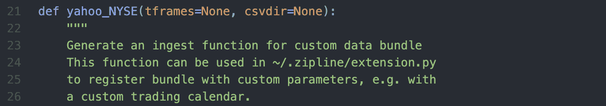
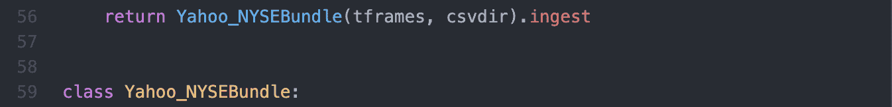
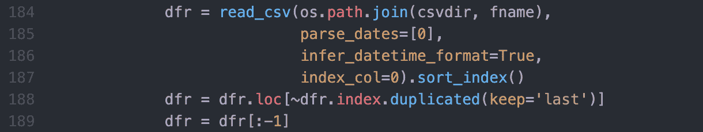
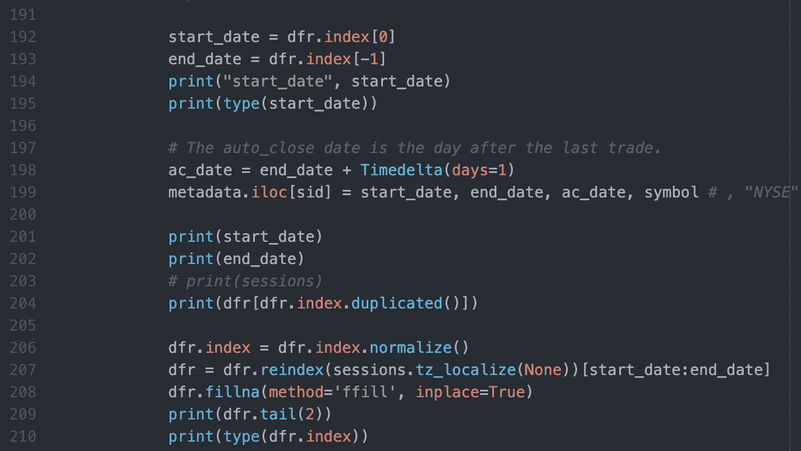
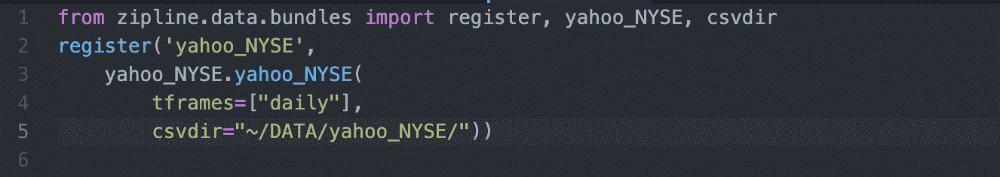
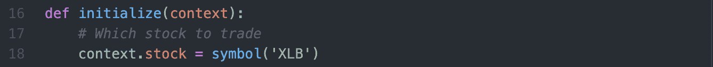
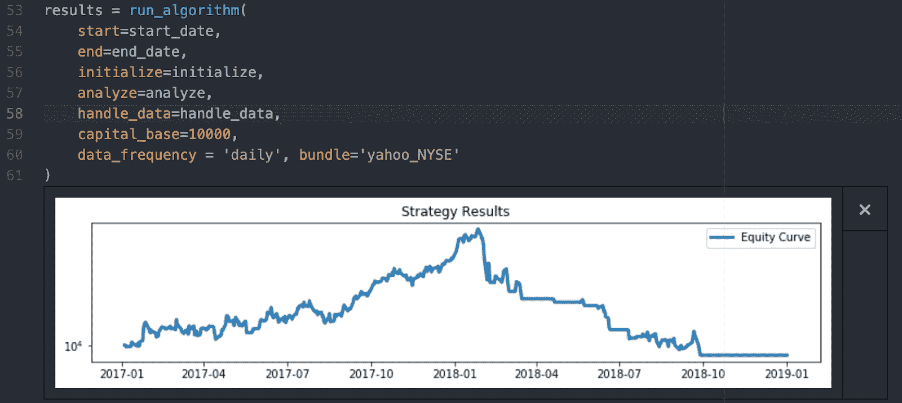

# 为 Yahoo CSV 文件构建 zip 包

> 原文：<https://blog.quantinsti.com/zipline-bundle-yahoo/>

马里奥·比萨

Zipline 是一个非常棒的回溯测试工具，数据是进行这种分析的主要原材料。在这篇文章中，我们将关注如何加载我们自己的数据文件。通过一个例子，我们将创建一个包来加载从 Yahoo finance 下载的 csv 文件中的数据。

我们涵盖:

*   [滑索概述](#zipline-recap)
*   [捆绑包概述](#a-bundle-overview)
*   [为雅虎 csv 每日数据创建捆绑包](#creating-a-bundle-for-yahoo-csv-daily-data)
*   [注册捆绑包](#registering-the-bundle)
*   [将数据导入 Zipline](#ingesting-data-into-zipline)
*   [使用新捆绑包运行回溯测试](#run-a-backtest-with-the-new-bundle)

* * *

## 滑索摘要

正如我们在[上一篇文章](/zipline-library-installation-windows/)中看到的，Zipline 库是一个强大的回溯测试工具，它让我们专注于策略，而不是首先尽一切努力让系统做好准备。

虽然 Quantopian 已经停止运营，但我们仍然可以享受他们对 Zipline 库所做的伟大工作。

在这篇博客中，我们将会看到如何在 Zipline 中加载来自雅虎等多个来源的数据。数据将来自未注明日期的工具的 csv 文件，例如:

*   股票，
*   交易所交易基金，
*   儿童发展基金会，
*   外汇等。

在继续阅读之前，必须记住，如果你想简化你的生活，你可以使用 [Blueshift](https://blueshift.quantinsti.com/) 提供回溯测试的历史数据和连接到几个经纪人的实时数据，毫不费力地将你的算法投入使用。否则，继续读。

Zipline 称之为 ***摄取*** 过程。让我们能够读取数据源并加载到 Zipline 的连接器是 ***bundle*** 脚本。

默认情况下，Zipline 库附带了几个包来连接 Quandl Wiki DB 和 csv 文件。然而，通常我们需要连接到具有不同格式、列名等的其他数据源。

因此，我们需要创建一个包，以便能够接收数据并对其进行回溯测试。这就是我们在这里讨论的话题。

* * *

*建议阅读:[Python 中的 Zipline 介绍](/introduction-zipline-python/)T3】*

* * *

## 捆绑包概述

bundle 是一个 ETL 工具。提取、转换和加载(ETL)是数据科学中众所周知的过程。这意味着捆绑 Python 脚本需要连接到数据源(web、文件或数据库)。

*   **提取**数据，并以数据帧的形式以方便的数据结构加载到内存中。
*   通过清理和**转换**NA、列名、日期和时间等来标准化数据。
*   最后，**将规范化的数据加载到 Zipline 数据存储库中。默认情况下是一个 SQLite，虽然可以是任何其他数据库。**

虽然这看起来是一项艰巨的任务，但是我们可以使用可用的 *csvdir* 包作为模板。所以捆绑包的开发会更容易一些。

* * *

## **为雅虎 csv 每日数据创建捆绑包**

假设我们有一个文件夹，里面有从 Yahoo 下载的每日数据。注意，默认情况下， *csvdir.py* 脚本在名为 *daily* 和 *minute* 的文件夹中查找数据，因此我们需要将雅虎的 csv 文件包含在 *daily* 文件夹中。

整个过程在一条线上:

我们需要读取数据，将它们转换成 Zipline 格式，并加载到 Zipline 存储库中。这就是 ETL 过程。

我们将使用库附带的 csvdir 包作为模板。 *csvdir.py* 脚本位于以下文件夹中:

```
~/opt/miniconda3/envs/zipline35/lib/python3.5/site-packages/zipline/data/bundles
```

路径的标记部分取决于您的机器和您使用的 Conda 环境名称。我们定制的包文件也必须在那个文件夹中。

首先，让我们创建一个 *csvdir.py* 的副本，为我们将要做的事情起一个可识别的名字。例如，在这里，我们将对在纽约证券交易所上市的雅虎数据进行捆绑。比如 *yahoo_NYSE.py*

在你最喜欢的编辑器中打开新的 *yahoo_NYSE.py* 包。我们将开始编辑它，使雅虎数据适应 Zipline 数据格式，并能够在摄取过程中使用它。

如果我们看看文件内部，我们有在 ETL 过程中需要承担的函数、类和方法。在这篇文章中，我们不会解释所有的代码，你有相关的 API 文档。在这里，我们将看看理解和改变所需的部分。

改变主函数的名字，我喜欢用和文件名一样的名字。所以名字将会是*雅虎纽约证券交易所。*

<figure class="kg-card kg-image-card kg-width-full"></figure>

该函数接受两个输入参数。第一个是数据频率的列表。分钟、每天或两者。第二个，是我们有雅虎每日数据的文件夹。我们在这一点上不使用这些参数，但是知道它们是有用的。

这个函数的输出是一个名为 CSVDIRBundle 的类，例如，将这个名称修改为 Yahoo_NYSEBundle。

<figure class="kg-card kg-image-card kg-width-full"></figure>

在第 92、97 和 98 行，需要更改包名，这是我们用*摄取* zipline 命令调用的函数名。第 97 行表示我们将在 Zipline 中注册为一个包的名称。

<figure class="kg-card kg-image-card kg-width-full"></figure>

在第 98 行声明的函数中，我们可以看到 Zipline 所期望的数据格式，有一些处理输入参数和元数据、分割等的代码。

我们需要修改市场日历 CSVDIR，以便在第 161 行使用 NYSE 的通用市场日历。

<figure class="kg-card kg-image-card kg-width-full"></figure>

为了使我们的数据适应 Zipline 格式，需要修改的函数在第 171 行被命名为 *_pricing_iter* 。这个函数读取 csv 文件并将它们加载到 Zipline DB 中。

<figure class="kg-card kg-image-card kg-width-full"></figure>

这里我们可以看到代码的关键部分:

<figure class="kg-card kg-image-card kg-width-full"></figure>

它读取 csv 文件，然后我们可以检查内容、修改列名、删除 NA 或数据中所需的任何其他更改。例如，在第 188 行，我们删除了可能的重复日期。

我们可以根据需要包含尽可能多的 *print* 句子来跟踪代码执行。

<figure class="kg-card kg-image-card kg-width-full"></figure>

这里的关键是使 csv 数据指数与纽约证券交易所市场日历保持一致。第 207 行需要 *sessions* 变量来完成。

我们从数据的第一个日期到最后一个日期创建会话日期。包括在第 154 行中。

<figure class="kg-card kg-image-card kg-width-full"></figure>

将变量名包含在调用函数的*的参数中，第 156 行。*

<figure class="kg-card kg-image-card kg-width-full"></figure>

并在 *_pricing_iter* 函数的输入参数中接受。

<figure class="kg-card kg-image-card kg-width-full"></figure>

最后，注释或删除最后一行代码，因为我们希望将 NYSE 日历用于这些数据文件。

<figure class="kg-card kg-image-card kg-width-full"></figure>

* * *

## 注册包

最后一步是注册我们的 *yahoo_nyse* 捆绑包。打开(如果存在)或创建(如果不存在)这个*扩展名. py* 文件并包含这个新的包。

```
~/.zipline/extension.py
```

<figure class="kg-card kg-image-card kg-width-full"></figure>

看输入的参数， *tframes* 是一个列表，可以是*分钟，每日*或者两者兼而有之， *csvdir* 是从雅虎下载的数据文件所在的文件夹。尽管在 *csvdir* 路径中没有指定这个端点，但是数据在每日文件夹中。

* * *

## 将数据接收到 Zipline 中

好了，我们到了，让我们测试一下新的包，从雅虎获取一些存储在

```
~/DATA/Yahoo_NYSE/daily
```

<figure class="kg-card kg-image-card kg-width-full"></figure>

如果一切正常，您将看到我们在代码中包含的所有打印句子。如果这个过程没有错误地结束，我们的数据就在 Zipline DB 中了。

* * *

## 使用新的包运行回溯测试

让我们用我们的数据来检验一下这个简单的算法。

用现有符号初始化算法:

<figure class="kg-card kg-image-card kg-width-full"></figure>

完整的算法代码可以在这篇文章的结尾和/或关于[安装滑索](/zipline-library-installation-windows/)的第一篇文章中下载。

在结果部分，确保您使用的是新的捆绑包 *yahoo_NYSE*

<figure class="kg-card kg-image-card kg-width-full"></figure>

希望事情进展顺利，你会得到一个好的图表。

* * *

*建议阅读:*

*   [*Zipline 库——安装在 Windows 10 上*](/zipline-library-installation-windows/)
*   *[在 Zipline 中导入 CSV 数据进行回溯测试](/importing-csv-data-zipline-backtesting/)*

* * *

## **结论**

在这里，我们可以修改 *csvdir.py* 文件，以获得针对 Yahoo NYSE 每日数据的优化包。我们不太关心代码。但是，为了获得干净的代码，可以删除许多行。

加载分钟数据或从其他提供者加载数据是非常相似的。只需在 *_pricing_iter* 函数中将 Pandas 数据帧调整为 Zipline 格式。

在未来的帖子中，我们将尝试摄取在线数据，以避免 csv 文件。

记住，为了用 Zipline 简化你的生活，把你的时间花在思考策略而不是架构上，你可以使用 [Blueshift](https://blueshift.quantinsti.com/) 来回溯测试策略并随时上线。

**文件在下载**

*   第一个 Zipline 回溯测试 python 代码
*   Yahoo_NSE python 代码
*   扩展 python 代码

 <small>*免责声明:股票市场的所有投资和交易都有风险。在金融市场进行交易的任何决定，包括股票或期权或其他金融工具的交易，都是个人决定，只能在彻底研究后做出，包括个人风险和财务评估以及在您认为必要的范围内寻求专业帮助。本文提到的交易策略或相关信息仅供参考。*</small>