# 在开源贸易项目中合作

> 原文：<https://blog.quantinsti.com/collaborating-open-source-trading-project/>

马里奥·比萨

任何个人程序员或开发团队的必备工具是版本控制软件。在这篇文章中，我们将向您介绍如何使用 **Git/Github** 来修改一个开源项目，比如 **Pyfolio** 库。

涵盖的主题:

*   [范围](#scope)
*   [投资组合简介](#an-introduction-to-pyfolio)
*   [Git 和 GitHub 简介](#an-introduction-to-git-and-github)
*   [获取 pyfolio 源代码](#getting-the-pyfolio-source-code)
*   [改进投资组合库](#improving-the-pyfolio-library)
*   [发布新功能](#publishing-the-new-functionality)

* * *

## 范围

软件工程的一个基本原则是不要重新发明轮子。开发良好的软件可以在多个项目中反复使用。

Python 和它的生态系统[开源库](/python-trading-library/)允许我们使用无数开发团队和个人程序员的工作来构建软件。

每个 Python 项目都以这样或那样的方式使用库。这些只不过是打包了具有特定功能的类和函数的软件，例如:

*   数学
*   [Numpy](/python-numpy-tutorial-installation-arrays-random-sampling/)
*   [轨道](https://www.scipy.org/)轨道
*   [Matplotlib](/python-matplotlib-tutorial/) 等。

这些库是通用的，足够灵活，可以适应我们正在构建的任何软件，并通过不必从头实现这些库提供的功能来节省我们的大量时间。

在我们的交易环境中，所有项目都需要对我们的策略进行绩效分析。一遍又一遍地对我们的统计数据进行编码是没有意义的，所以拥有一个性能分析库是必要的。

我们可以建立自己的库来计算:

*   返回
*   标准偏差
*   [夏普比率](/sharpe-ratio-applications-algorithmic-trading/)
*   Sortino 比率
*   斜交
*   性能图表

和无数的性能参数。或者我们可以使用现有的库，如果可能的话，用我们自己的性能指标来改进它。

在这篇文章中，我们将修改一个开源和自由软件库“pyfolio ”,以适应我们的需要，也许我们的改变会对社区有用。我们将发布我们的修改，以便其他开发者可以从中受益。在这个过程中，我们还将学习如何使用 Git/GitHub 工具来控制变更和软件版本。

“Pyfolio”是在 Apache 2.0 许可下发布的，该许可允许我们修改代码、发布代码甚至将其商业化。然而，值得一读的许可协议，至少在你的生活中有一次。

在这里，我们不会深入到开放和/或自由源码发布的许多许可证中，也不会深入到哲学中。

* * *

## Pyfolio 简介

Pyfolio 是 Quantopian Inc .开发的用于金融投资组合的性能和风险分析 python 库。

注意:这家公司已经[停止了在](https://www.bloomberg.com/news/articles/2020-12-16/quant-trading-platform-quantopian-closes-down)的运营，尽管他们的图书馆仍然在互联网上。

Pyfolio 是一个综合的库，可以生成性能报告，很好地满足了任何分析师的基本需求。

**投资组合的突出特点:**

*   简单撕页:

*   汇总性能统计表:

*   岁入
*   累积回报
*   年度波动性
*   夏普比率
*   最大水位下降
*   斜交
*   峭度
*   以及更多的关键性能指标。

*   情节:

*   累积回报
*   滚动贝塔
*   滚动锋利
*   在水下
*   更多

*   返回样张

*   汇总性能统计表
*   情节:

*   滚动退货
*   滚动贝塔
*   滚动锋利
*   滚动 Fama-法国风险因素
*   水位降低
*   水下地块
*   月度和年度回报图
*   每日相似性图和
*   返回分位数盒图

*   全撕裂片

*   汇总性能统计表
*   返回样张
*   交易撕页
*   往返撕页
*   有趣的时代撕页
*   容量撕页
*   绩效属性样张

所有这些特性使得 Pyfolio 库值得考虑。该库足够灵活，可以有效地涵盖策略或投资组合的性能分析。

* * *

## Git 和 GitHub 简介

Git 是由 Linus Torvalds 开发的分布式版本和变更控制软件，目前归微软所有。它是一个允许控制软件随时间的变化和版本的工具，可以轻松地将代码恢复到以前的任何状态。

它允许分布式开发，不同的程序员团队可以进行修改并生成他们自己的版本，或者将他们的工作贡献给主版本。

基本上，Git 是一个与我们通过提交更新的每个项目相关联的代码库。

**Git 的突出特点:**

*   分支用于在不影响主版本的情况下处理和修改代码。它们还允许我们启动替代的开发，在那里分支变成一个新的库，由于变更的范围和新的功能，需要一个新的独立版本。
*   提交在某个时间点保存代码，提交保存工作并添加一个带有消息的标识，以便能够在将来恢复这个开发状态。
*   合并以融合不同的分支
*   回滚到通过提交保存的任何时间点的更改。

这个功能本身就足以引起任何一个开发人员的注意，对于从事同一个项目的开发团队来说更是如此。

GitHub 工具只不过是云中的 Git 服务器，它允许我们在互联网上发布我们的 Git 库，以便任何其他开发人员都可以使用代码或贡献自己的开发。

它也有一个非常有趣的工具，如票证管理器，用于管理软件中的错误或改进，以及其他有助于协作开发的工具。

* * *

## 获取 pyfolio 源代码

此时，我们已经决定使用 pyfolio 库作为我们的性能分析库。这样我们可以避免花费大量的时间来开发我们自己的库。然而，我们希望修改这个库来适应我们的目的。

我们还假设您已经将您的机器配置为像专业人员一样进行开发，如果没有，请在继续之前[查看这篇文章。](/trading-machine-setup/)

然后第一步是在我们的开发机器上复制库的所有代码。为此，我们将从 GitHub 上的公共存储库中克隆这个库。

从您的项目所在的文件夹中，键入以下命令:

<figure class="kg-card kg-image-card kg-width-full">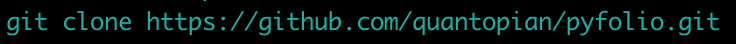</figure>

您将看到类似这样的内容:

<figure class="kg-card kg-image-card kg-width-full">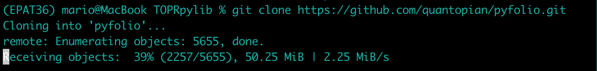</figure>

此时，您已经在您的机器中克隆了 pyfolio 存储库。下图显示了一个图形表示。

<figure class="kg-card kg-image-card kg-width-full">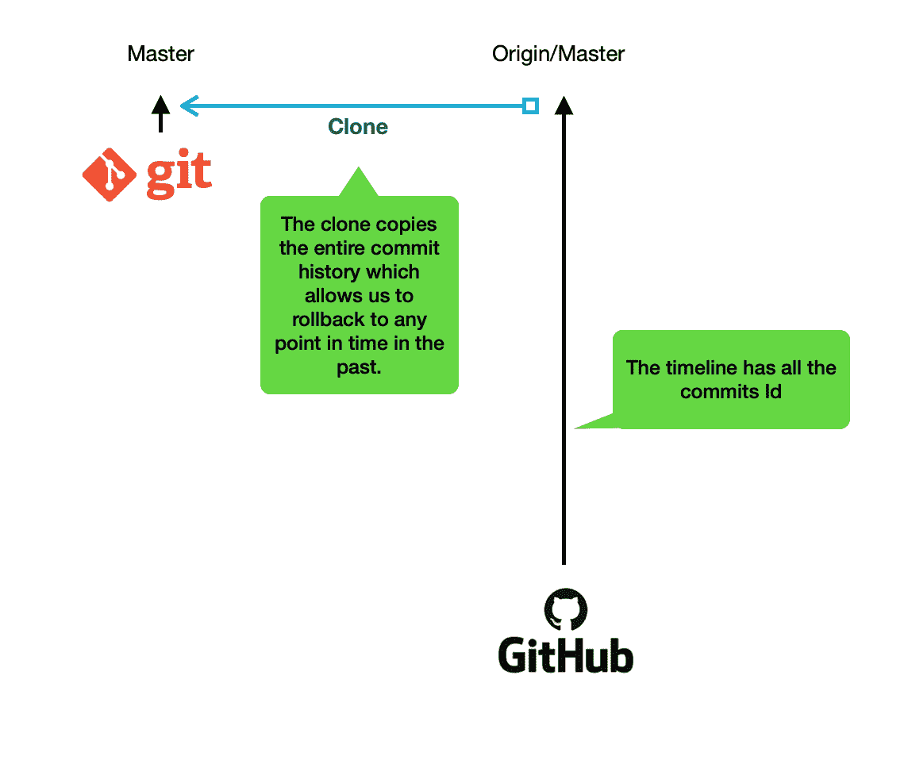</figure>

让我们转到 pyfolio 文件夹，列出其中的文件，以检查代码文件和文件夹。

<figure class="kg-card kg-image-card kg-width-full">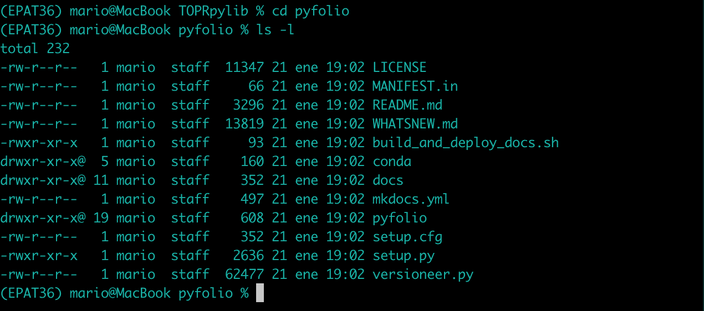</figure>

在根文件夹中，你可以看到这个包的文件，包括许可证，readme，whatsnew 等一些有趣的阅读文件。还有 setup.py 脚本来在我们的 python 环境中安装这个库。

如果我们键入命令 *git log —oneline* ，我们可以看到项目中所有开发人员执行的所有历史提交。更有趣的是，我们可以在历史开发时间线的任何点上移动，并检查开发人员留下的消息，以了解变更的原因。

<figure class="kg-card kg-image-card kg-width-full"></figure>

要检查任何提交的变更细节，您可以键入 *git show < commit Id >。*您可以看到作者、日期、消息或更改原因以及一些红色和绿色的行。红线是旧代码，绿线是新代码。

<figure class="kg-card kg-image-card kg-width-full">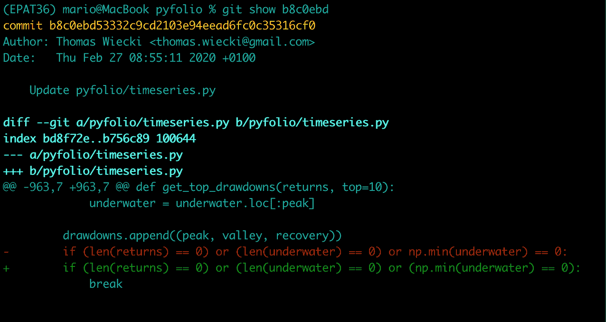</figure>

为了安装位于我们机器中的 pyfolio 库，并且为了能够修改代码而不必在每次修改代码时反复安装库，我们将使用 *develop* 参数，以便 python 读取正在开发的项目的文件，而不是进行普通的安装。

<figure class="kg-card kg-image-card kg-width-full"></figure>

让我们用命令 c *onda list* 检查一下我们确实已经在我们的机器上安装了库

<figure class="kg-card kg-image-card kg-width-full"></figure>

<figure class="kg-card kg-image-card kg-width-full"></figure>

因此，我们已经在我们的机器上安装了开发库，我们可以在我们最喜欢的 IDE 或编辑器中创建一个项目。

<figure class="kg-card kg-image-card kg-width-full">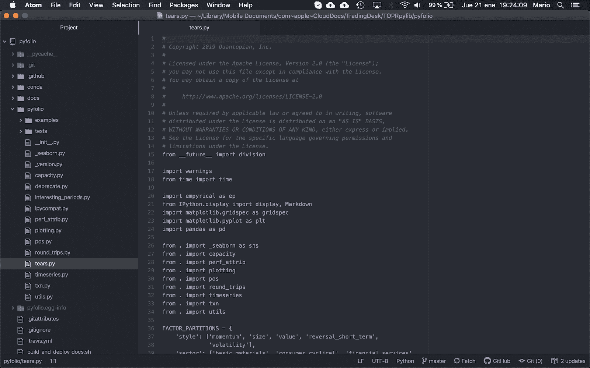</figure>

* * *

## 改进 pyfolio 图书馆

在修改代码之前，我们要做的第一件事是在 Git 中创建我们自己的分支，以避免在知道我们的更改是否会有预期的结果之前修改主分支。

让我们用 *git status* 命令检查 Git 中的当前情况。

<figure class="kg-card kg-image-card kg-width-full"></figure>

输出显示我们在分支主机上，并且分支是最新的。

origin 分支是 GitHub 上的原始 pyfolio 存储库，我们可以使用 *git remote -v* 命令看到:

<figure class="kg-card kg-image-card kg-width-full">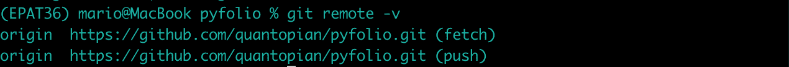</figure>

让我们用 git checkout -b mypyfolio 命令创建一个分支，以便在我们的 Git 存储库中有一个新的开发路径:

<figure class="kg-card kg-image-card kg-width-full">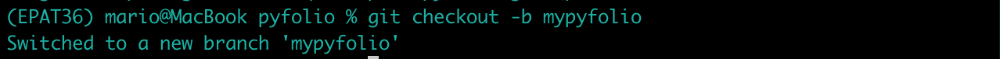</figure>

我们可以用 git status 命令检查它:

<figure class="kg-card kg-image-card kg-width-full">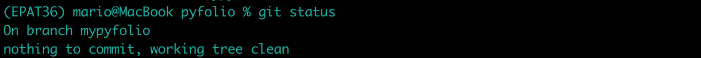</figure>

这告诉我们，我们正在分支 *mypyfolio* 上工作，还没有任何变化。

我们可以用图形表示如下:

### 删除滑索引用

为了使用 pyfolio 库，让我们创建一个新项目。

当我们导入 pyfolio 库时，我们会收到以下警告消息:

***py folio/py folio/pos . py:27:user warning:找不到模块“zip line . assets”；乘数将不适用于头寸概念。找不到模块“zipline.assets ”;乘数将不适用'***

该消息向我们表明 zipline.assets 库没有安装在我们的机器上，因为这是一个警告，所以不强制安装它。

zipline.assets 库附带了 zipline 库，这需要 python 3.5，我们使用的是 Python 3.6。

一种解决方法是忽略警告，如下所示:

```
warnings.filterwarnings('ignore')
```

但是，这会过滤任何警告消息，并可能隐藏其他重要消息。

因此，让我们修改源代码，删除任何对 zipline 的引用。警告消息说警告来自 pyfolio/pyfolio/pos.py 文件行 27。

<figure class="kg-card kg-image-card kg-width-full">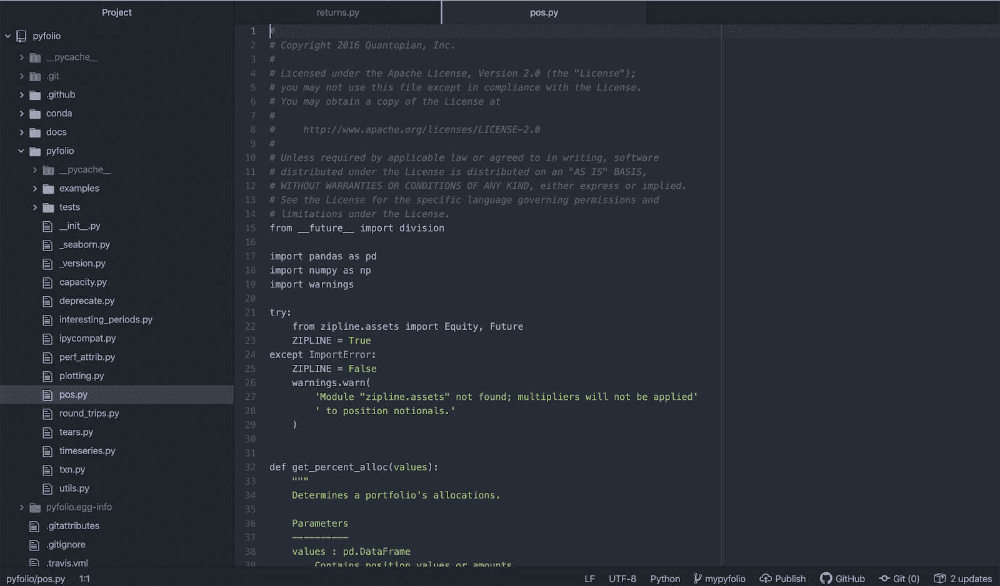</figure>

第 21-22 行试图导入库 zipline.assets，如果不可行，那么它会触发我们在导入 pyfolio 库时看到的警告消息。

另一个有趣的事情是名为 ZIPLINE 的变量。在 python 中，当开发人员将变量名大写时，这意味着分配的值在整个代码运行时将保持不变。

因此，让我们在所有 pyfolio 库文件中查找 [ZIPLINE](/introduction-zipline-python/) 常量，看看它在哪里被使用。

<figure class="kg-card kg-image-card kg-width-full">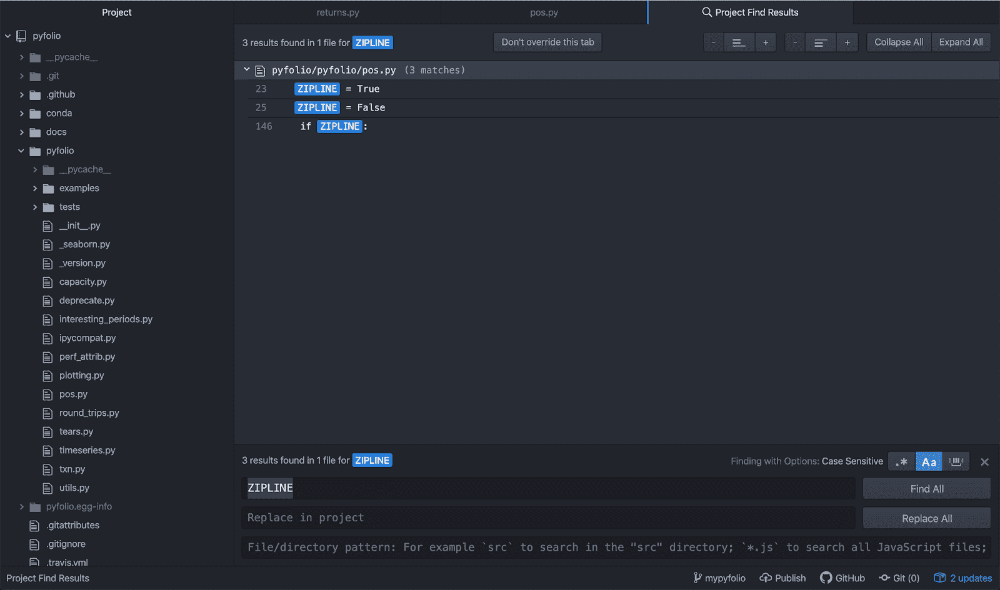</figure>

在第 23、25 行中，我们看到了尝试导入 zipline.assets 库的 try-except 构造。每当 zipline.assets 库被导入时，在第 146 行使用常量 ZIPLINE，包括期货的乘数，因为股票的乘数是 1。

<figure class="kg-card kg-image-card kg-width-full"></figure>

因此，对于这个简单的例子，我们假设我们没有一个乘数，并简单地避免导入 zipline.assets 库。为此，我们删除或注释掉整个 try-except，并将 ZIPLINE 变量初始化为 False。

<figure class="kg-card kg-image-card kg-width-full">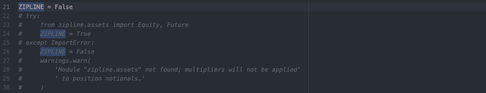</figure>

现在，我们可以再次导入库来检查我们是否避免了警告消息。由于我们在导入 pyfolio 库时不再看到警告，这一更改是完美的，所以让我们检查一下 Git 中的更改。

使用 *git status* 命令，我们可以检查代码中发生了什么变化。

<figure class="kg-card kg-image-card kg-width-full">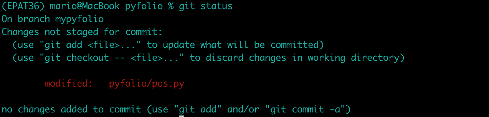</figure>

我们可以看到我们在分支 *mypyfolio* 中，修改后的文件是 *pyfolio/pos.py.* 它还告诉我们推荐的命令，以将文件添加到 Git tracker 和/或提交我们所做的更改。

在此之前，让我们检查一下在 Git 中注册的最后一个版本的文件和我们修改过的文件之间存在哪些差异。为此，我们使用命令 *git diff pyfolio/pos.py*

<figure class="kg-card kg-image-card kg-width-full">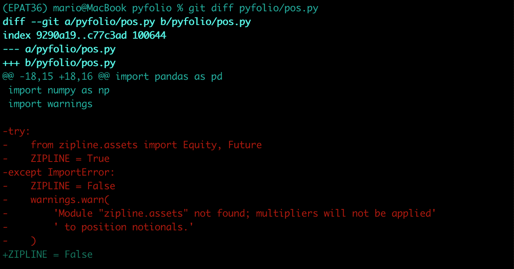</figure>

我们看到红色的行相对于 git 中注册的最新版本进行了修改，绿色的行相对于 Git 中注册的最新版本进行了添加。此外，这些正是我们刚刚做出的改变，因此我们对结果感到满意。

让我们用命令 *git add pyfolio/pos.py 和 commit -m <在 git 中注册我们的更改，用 commit >* 记录消息

<figure class="kg-card kg-image-card kg-width-full"></figure>

<figure class="kg-card kg-image-card kg-width-full">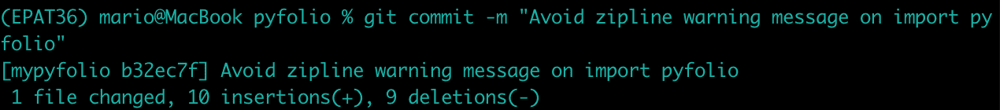</figure>

如果我们再次键入 git status 命令，我们可以看到

<figure class="kg-card kg-image-card kg-width-full">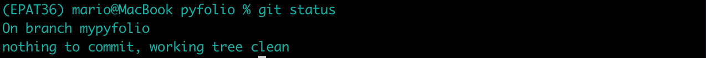</figure>

<figure class="kg-card kg-image-card kg-width-full">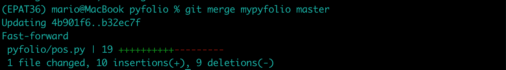</figure>

再次检查 git 状态，我们可以看到 out 分支 *mypyfolio* 比分支起点提前一次提交。

<figure class="kg-card kg-image-card kg-width-full">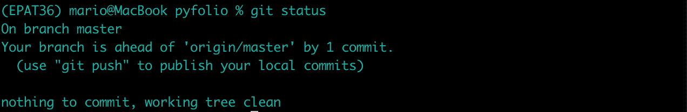</figure>

### 更改夏普比率函数

目前，pyfolio 库严重依赖于同样由 Quantopian 开发的 *empyrical* 库来计算许多性能指标。我们将修改计算夏普比率的函数，使用我们自己的代码，而不是依赖经验库。

为此，打开负责编排时间序列分析的 pyfolio/timeseries.py 文件，并查找 Sharpe ratio 函数。

<figure class="kg-card kg-image-card kg-width-full"></figure>

从第 651 行到第 665 行的代码块负责调用计算性能指标的函数，我们可以看到夏普比率是用*empyric*库计算的。

<figure class="kg-card kg-image-card kg-width-full">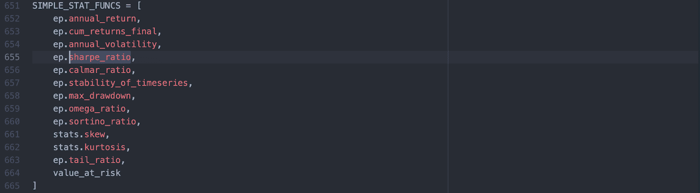</figure>

因此，我们将修改第 655 行来调用我们的函数来计算夏普比率。

<figure class="kg-card kg-image-card kg-width-full">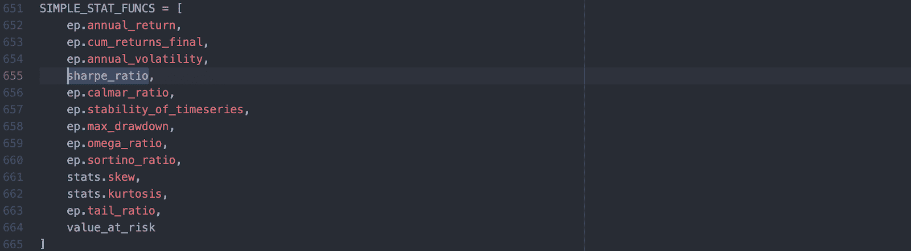</figure>

在 timeseries.py 文件本身中，第 262 行有一个计算夏普比率的函数，但是正如函数的装饰所表明的，它已被弃用，事实上，它调用了*empyric*库的函数。

所以我们要修改这个函数来计算夏普比率

<figure class="kg-card kg-image-card kg-width-full"></figure>

我们引入必要的更改来计算我们的夏普比率并保存文件。

<figure class="kg-card kg-image-card kg-width-full">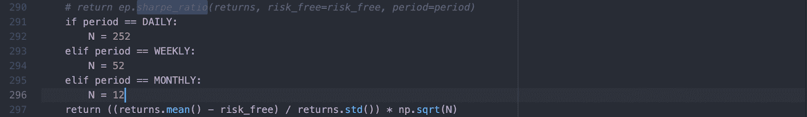</figure>

有了这些变化，剩下的就是测试我们是否真的用我们的函数正确地计算了夏普比率。

<figure class="kg-card kg-image-card kg-width-full">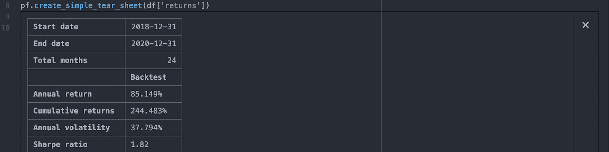</figure>

一切似乎都工作正常，所以让我们检查一下 git 中的变化。我们键入命令 *git status* 来检查它

<figure class="kg-card kg-image-card kg-width-full">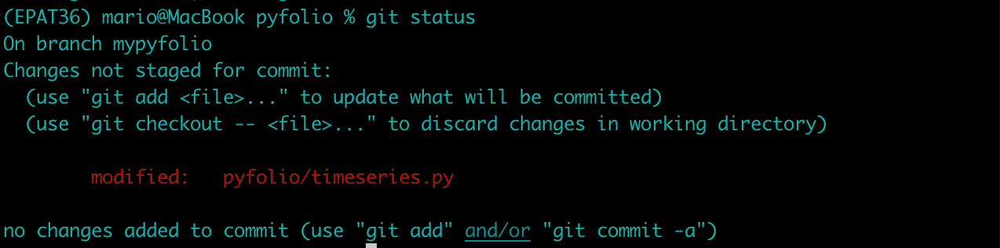</figure>

我们可以再次看到我们正在使用的是 *mypyfolio* 分支，并且我们已经修改了 pyfolio/timeseries.py 文件。

我们还可以使用*git diff py folio/time series . py*命令详细查看这些更改。

<figure class="kg-card kg-image-card kg-width-full">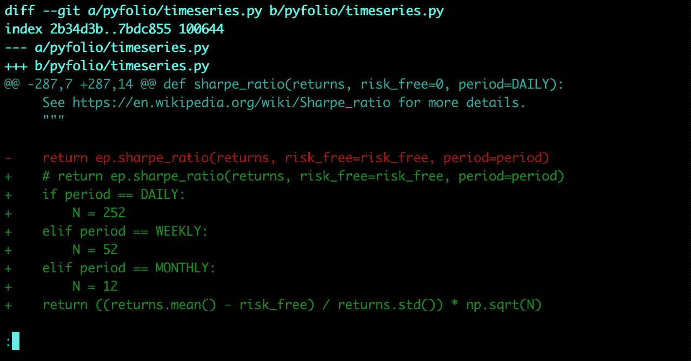</figure>

<figure class="kg-card kg-image-card kg-width-full">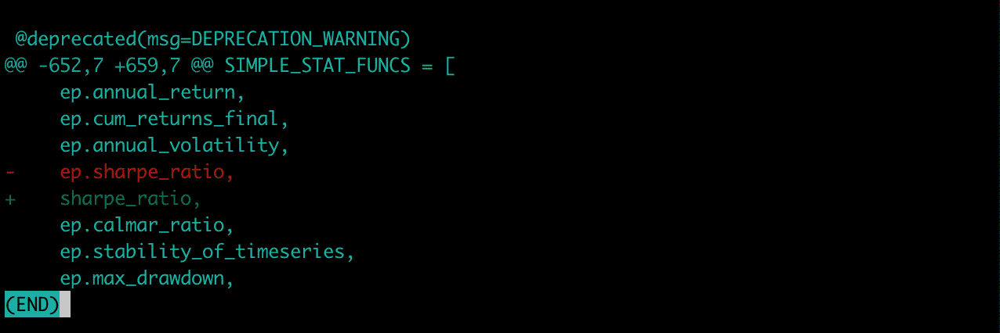</figure>

同样，我们可以看到红色表示更改前的情况，绿色表示更改后的当前情况。这与我们所做的修改完全一致。

让我们在 git 中注册变更，并使用命令*git add pyfolio/time series . py*和 *git commit -m <变更原因>* 将其与分支主机合并。

<figure class="kg-card kg-image-card kg-width-full">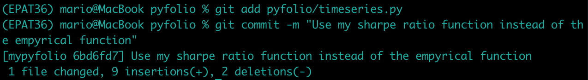</figure>

我们所做的改变是在 *mypyfolio* 分行，但是，我们将把我们的 *mypyfolio* 分行与 *master* 分行合并。

<figure class="kg-card kg-image-card kg-width-full">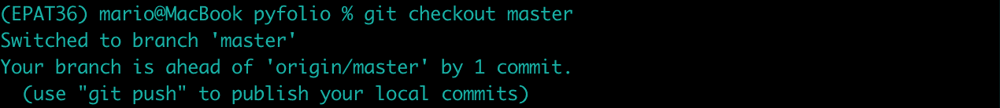</figure>

git merge mvypyfolio master 命令执行合并，并向我们总结了前面情况的变化。

<figure class="kg-card kg-image-card kg-width-full">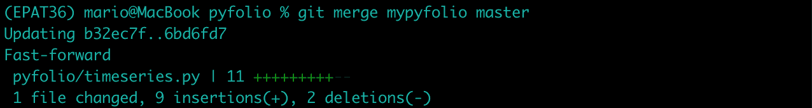</figure>

如果我们再次检查 git 状态，我们可以看到我们的主分支比托管在 GitHub 上的原始存储库提前了两次提交。

<figure class="kg-card kg-image-card kg-width-full">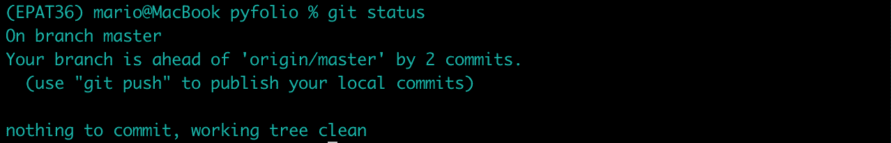</figure>

在这一点上，我们有两个选择向世界发布我们的变更。

**场景 1:** 我们在由 Quantopian 维护的 GitHub 上的原始 pyfolio 存储库中发布我们的更改(记住，这家公司已经停产)。

*   ***git push -u 原点主控***

启动上面的命令并不意味着它会自动发布，因为需要手动管理存储库来批准和接受变更(如果适用的话)。

**场景 2:** 我们创建自己的 GitHub 库并发布，这样任何人都可以安装这个库，甚至参与开发。

在下一节中，我们将看看场景二。

* * *

## 发布新功能

此时，我们想要做的是在我们自己的 GitHub 库中发布我们的更改。

我们可以从 GitHub web 界面本身创建一个公共存储库:

<figure class="kg-card kg-image-card kg-width-full">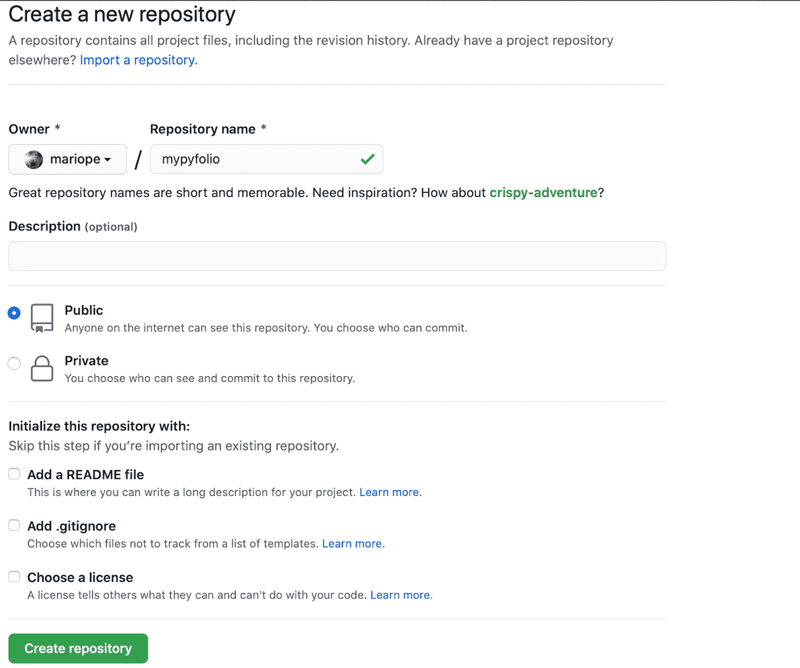</figure>

然后，我们必须使用以下命令配置 GitHub 的新存储库:

*git 远程添加分叉 https://github.com/mariope/mypyfolio.git*

<figure class="kg-card kg-image-card kg-width-full">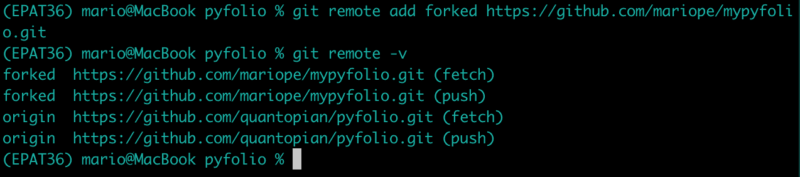</figure>

注意，forked 可以是任何名称。我们还可以看到，我们的 pyfolio 库现在有两个远程 GitHub。一个叫做 origin，是最初的 Quantopian 库，另一个是我们自己的 GitHub 库。

最后，为了发布我们对 GitHub 库的修改，我们输入命令 *git push -u forked master* 。

<figure class="kg-card kg-image-card kg-width-full">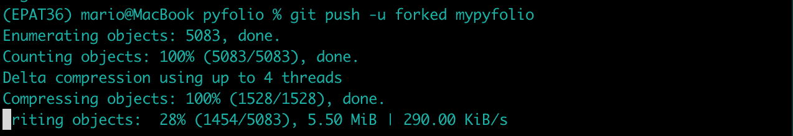</figure>

使用这个命令，我们将本地 git 存储库推送到 GitHub 存储库，它是公共的，任何想要使用、修改或修复它的人都可以使用。

不要忘记修改自述文件，以包括关于您的更改的注释，并提醒任何潜在的用户。

* * *

## 结论

在这篇文章中，我们已经看到了如何修改像 pyfolio 这样的开源库来引入我们自己的修改并在云中发布它们。

一路走来，我们已经了解了版本控制软件是如何工作的，以及如何处理基本的 git/github 命令。

*<small>免责声明:股票市场的所有投资和交易都涉及风险。在金融市场进行交易的任何决定，包括股票或期权或其他金融工具的交易，都是个人决定，只能在彻底研究后做出，包括个人风险和财务评估以及在您认为必要的范围内寻求专业帮助。本文提到的交易策略或相关信息仅供参考。</small>T3】*