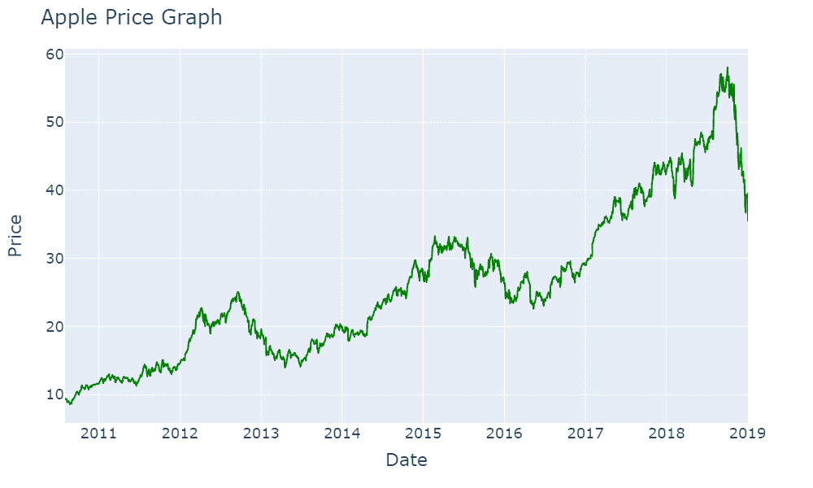

# 朴素贝叶斯模型:介绍，计算，策略，Python 代码

> 原文：<https://blog.quantinsti.com/naive-bayes/>

以[重香重香](https://www.linkedin.com/in/rekhit/)

你听说过奥卡姆剃刀吗？

简而言之，奥卡姆的威廉说，“最简单的解决方案几乎总是最好的解决方案。”

但是在一篇关于朴素贝叶斯的文章中，我们为什么要讨论剃刀呢？实际上，朴素贝叶斯隐含了这种信念，因为它确实是一个简单的模型。让我们看看如何在交易中使用像朴素贝叶斯模型这样的简单模型。

本文涵盖以下主题:

*   [什么是朴素贝叶斯？](#what-is-naive-bayes)
*   [贝叶斯定理方程](#equation-for-bayes-theorem)
*   [朴素贝叶斯模型的假设](#assumptions-of-naive-bayes-model)
*   [朴素贝叶斯模型的类型](#types-of-naive-bayes-models)
*   [建立朴素贝叶斯模型的步骤](#steps-to-build-naive-bayes-model)
*   [Python 中的朴素贝叶斯模型](#naive-bayes-model-in-python)
*   [朴素贝叶斯模型的优势](#advantages-of-the-naive-bayes-model)
*   [朴素贝叶斯模型的缺点](#disadvantages-of-the-naive-bayes-model)

* * *

## **什么是朴素贝叶斯？**

让我们绕一小段路，了解一下朴素贝叶斯中的“贝叶斯”是什么意思。谈到概率，基本上有两种思想流派。一派建议，通过计算所有可能事件的概率，然后计算你感兴趣的事件的概率，可以推导出一个事件的概率。

例如，在抛硬币实验中，你知道正面的概率是因为这里只有两种可能，正面或反面。

另一个学派认为，概率更多地依赖于先验信息以及其他因素。例如，如果一个人说红色是他们最喜欢的颜色的概率是 30%,但如果他们处于爱情婚姻中，那么你的结果将会因他们的婚姻状况而不同。

这就是所谓的[贝叶斯推断](/bayesian-inference/)，你试图根据某个条件来计算概率。

你如何计算这个条件概率？让我们在下一节看看。

* * *

## **贝叶斯定理方程**

$$P(A|B) = \frac{P(B|A)*P(A)}{P(B)}$$

假设 A 是一个人说红色是他们最喜欢的颜色的事件。现在，假设 B 是这个人结婚时的事件。

因此，P(A | B)是一个人结婚后说红色是他们最喜欢的颜色的可能性。

这是我们要找到的条件概率。

类似地，P(B | A)是当一个人说他们最喜欢的颜色是红色时，这个人结婚的可能性。

P(A)和 P(B)是各自的概率。

这对我们的交易有什么帮助？

假设我们知道一只股票的 RSI 值。

现在，如果你想找到 RSI 跌破 40 后第二天价格上涨的概率呢？想想吧。如果周二 RSI 低于 40，你会希望在周三买入，希望价格会上涨。

这可以通过使用贝叶斯定理找到。

假设 P(A)是价格上涨的概率，P(B)是前一天 RSI 低于 40 的概率。

现在，我们将通过相同的公式找到如果 RSI 低于 40，第二天价格上涨的概率。

这里，B 类似于我们在机器学习中定义的特征。它也可以被称为证据。

但是坚持住！如果我们想检查 RSI 何时低于 40，以及随机振荡指标的“慢 k”何时大于其“慢 d”时，该怎么办。

技术上，我们可以在贝叶斯定理中有多个条件来改进我们的概率模型。如果 P(C)是“慢 k”通过“慢 d”的概率，那么贝叶斯定理可以写成:

$$P(A|B,C) = \frac{P(B|A)*P(C|A)*P(A)}{P(B)*P(C)}$$

虽然这看起来很容易计算，但如果向模型中添加更多的特征，复杂性就会增加。这就是朴素贝叶斯模型的朴素之处。

* * *

## **假设的朴素贝叶斯模型**

朴素贝叶斯模型假设 B 和 C 都是独立的事件。此外，分母也下降了。

这在很大程度上简化了模型，我们可以简单地将方程写成:

**P(A|B，C)= P(B|A)*P(C|A)*P(A)**

你必须记住，这个假设在现实生活中可能是不正确的。从逻辑上讲，RSI 和随机指标都是使用同一个变量计算的，即价格数据。因此，它们并不是完全独立的。

然而，朴素贝叶斯模型的妙处在于，即使这种假设不成立，该模型在各种场景中仍然表现良好。

等等，只有一种朴素贝叶斯模型吗？实际上有三个。让我们在下一节中找出答案。

* * *

## **朴素贝叶斯模型的类型**

根据需求，您可以相应地选择型号。这些模型基于您正在处理的输入数据:

**多项式**:当我们拥有离散数据并对其进行分类时，会使用该模型。一个简单的例子是，我们可以将天气(多云、晴天、下雨)作为我们的输入，我们想知道网球比赛在什么天气进行。

**高斯**:顾名思义，在这个模型中，我们处理遵循高斯分布的连续数据。一个例子是进行比赛的体育场的温度。

**二项式**:如果我们的输入数据只是简单的是或否，即一个布尔值，会怎么样？在这种情况下，我们将使用二项式模型。

python 的伟大之处在于 sklearn 库包含了所有这些模型。我们可以试着用它来建立我们自己的朴素贝叶斯模型吗？为什么不试试呢。

* * *

## **建立朴素贝叶斯模型的步骤**

在开始编写代码之前，我们将首先尝试理解我们练习的逻辑。我们将使用从雅虎财经导入的苹果价格数据，我们的数据集是从 2010 年 8 月 1 日到 2019 年 1 月 1 日。

<figure class="kg-card kg-image-card kg-width-full"></figure>

此外，我们将使用两个特性。

1.  [RSI 信号](/rsi-indicator/) -当 RSI 小于 40 时，该变量设置为 1
2.  [Stoch 信号](/stochastic-oscillator/) -当 slow k 大于 slow d 时，该变量设置为 1

最后，我们的目标变量是第二天的收益。如果第二天的回报为正，则该值设为 1。

由于我们有二进制值，我们将在 python 中使用二项式朴素贝叶斯模型。此外，请记住，这是一个只做多的策略，但你也可以修改它来使用短信号。但是在这种情况下，您必须向策略中添加更多的规则。现在让我们来看看这一战略的实施情况。

* * *

## **Python 中的朴素贝叶斯模型**

我们将从首先导入库和数据集开始我们的策略。