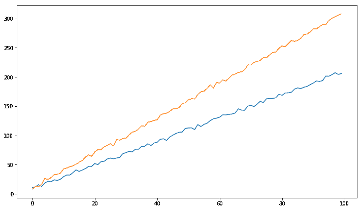
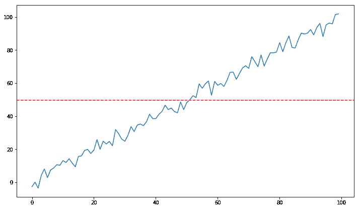
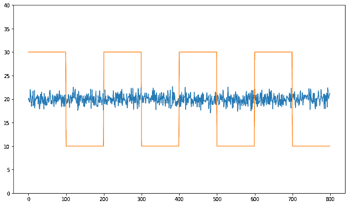
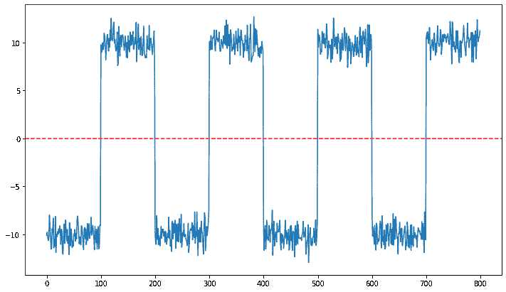
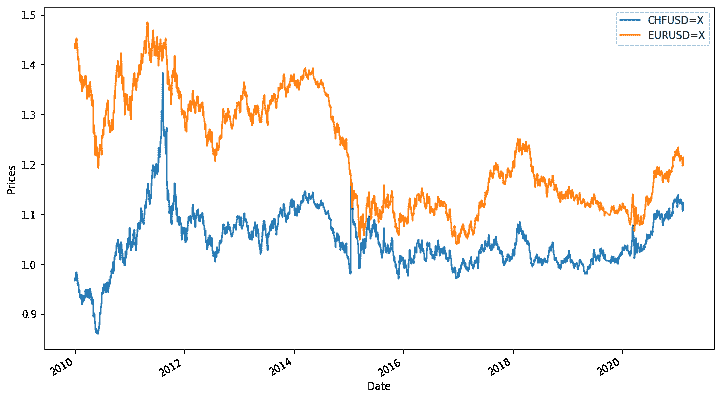
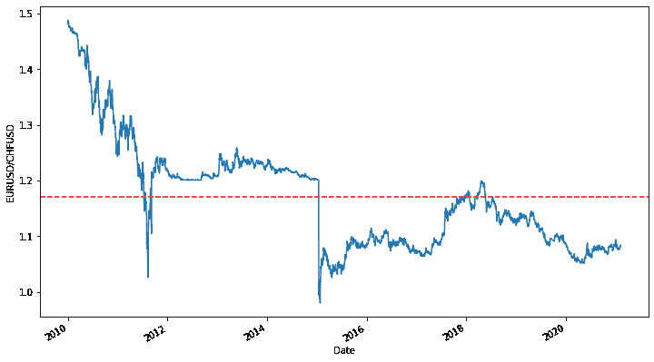
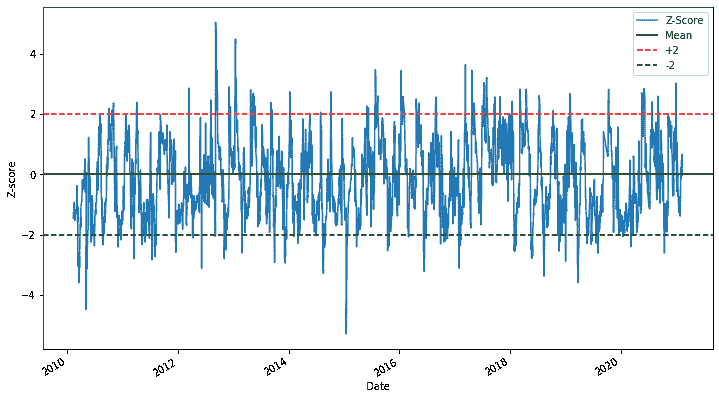
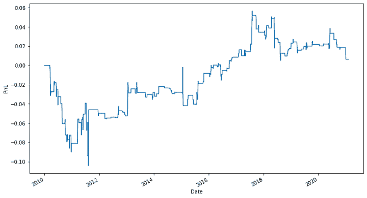

# 均值回归策略:介绍，交易，策略和更多

> 原文：<https://blog.quantinsti.com/mean-reversion-strategies-introduction-building-blocks/>

由[维布·辛格](https://www.linkedin.com/in/vibhu-singh-1b76b6105/)

市场上几乎所有的交易策略都试图利用两个普遍现象:[动量](https://quantra.quantinsti.com/course/momentum-trading-strategies)和均值回归。在本文中，我们将讨论均值回归和均值回归交易策略。

本文涵盖以下主题:

*   [什么是均值回归？](#What-is-mean-reversion)
*   [均值回归策略](#mean-reversion-strategies)
*   [配对交易原理](#principle-of-pairs-trading)
*   [相关性与协整性](#correlation-vs-cointegration)
*   [对的选择](#selection-of-pairs)
*   [Python 中的成对交易](#pairs-trading-in-python)
*   [进一步改进](#further-improvements)

* * *

## 什么是均值回归？

在金融学中，均值回归理论认为，证券价格和利率等经济指标将倾向于回归到历史平均价格。

例如，许多投资者在首席执行官 Vishal Sikka 先生辞职后股价暴跌时购买了 Infosys 的股票，因为他们预计当管理问题得到解决时，Infosys 的股票将来会上涨。

均值回归原则可以应用于基本面因素，如买入一只低 PE 的股票，期望 PE 上升到历史平均 PE 或行业 PE。

价值投资者通常采用这种方法购买股票进行长期投资。同样，这些原则可以应用于使用[技术指标](/tag/technical-indicators/)来创建短期均值回归交易策略。

* * *

## 均值回归策略

[统计套利策略](/statistical-arbitrage/)利用均值回归原理，利用一组证券之间的价格无效率。它是量化交易中[交易策略的流行类型之一。有各种类型的](https://quantra.quantinsti.com/course/quantitative-trading-strategies-models)[统计套利交易](https://quantra.quantinsti.com/course/statistical-arbitrage-trading)策略:

### 定向交易

在定向交易中，每个工具的信号都是独立于其他工具的。

例如，在过去的一个月里，原油价格上涨了 2 美元。有一天，在没有任何重大消息或因素的情况下，原油价格变化了 20 美元。根据均值回归原理，你可以预计原油价格将在未来几天下跌，这样原油价格的平均变化保持不变，你可以利用这个机会。

### 协整投资组合交易

在这种类型的交易策略中，交易信号取决于两个或更多的协整工具。[配对交易](/pairs-trading-basics/)是这种交易风格最著名的例子之一。

由于我们使用两个协整工具进行交易，因此名称为配对交易。但不总是一对，也可能是三胞胎或者更多。如果你发现了五只共同整合的股票，你可以做一个投资组合并进行交易。本文将重点介绍配对交易的概念以及基于此的交易策略。

* * *

## 配对交易原则

假设你有一对基本面相似的工具，属于相同的行业，经济联系也相似。例如，像谷歌和微软或脸书和推特这样的股票。

因为它们有相似的基本面，你会期望两只股票有相似的表现。你还期望这类股票的比率或价差随着时间保持不变。然而，由于需求和供给以及其他因素的暂时变化，各对之间的价差可能存在差异。

在这种情况下，一种安全性优于另一种。根据均值回归原理，你预期这种背离会随着时间恢复正常。在这种情况下，当出现时间差异时，你可以进行配对交易。那就是买入表现不佳的证券，卖出表现出色的证券。

* * *

## 相关性与协整性

大多数人对相关性和协整性感到困惑，他们经常有相同的想法。但事实并非如此。

当两个价格序列同向或反向变动时，这两个价格序列之间存在一定的相关性。如果一个价格序列向上或向下移动，而其他价格序列也向相同方向移动，则它们之间存在正相关关系。

当一个价格序列向上或向下移动时，另一个价格序列反向移动，那么两个价格序列是负相关的。

协整是两个或两个以上价格序列的统计性质，表明如果序列的线性组合是平稳的，那么两个序列相互之间是协整的。

例如，如果两只股票的线性组合是平稳的，那么两只股票相互之间是协整的。如果一个价格序列的均值和方差在一段时间内保持不变，则称该价格序列是平稳的。

**协整的统计检验:** Augmented dickey fuller 或 ADF 检验是协整的统计检验之一。在 Python 中，这可以通过 statsmodels 库轻松完成。

正如配对交易原理中所解释的，股票之间的比率或价差必须随着时间的推移收敛到平均值，配对交易才能进行。也就是说，两种股票必须互相协整。

只看股票之间的相关性可能会给你虚假的结果，因为两只股票的价格可能会持续上涨，而不会均值回归。有一个神话流传开来，即两个相关的工具必须协整，反之亦然。

让我们定义两个价格序列，使它们相关但不协整。

<figure class="kg-card kg-image-card kg-width-full kg-card-hascaption">

<figcaption>Correlated Series</figcaption>

</figure>

通过观察这两个价格序列，它们似乎相互关联，但是协整性如何呢？

对于要进行协整的两个价格序列，两个价格序列之间的价差/比率应该是固定的。我们就拿以上系列的区别来说吧。

<figure class="kg-card kg-image-card kg-width-full kg-card-hascaption">

<figcaption>Non-Stationary Series</figcaption>

</figure>

传播是趋势性的。结果表明，两个价格序列是相关的，但不是协整的。因此，我们可以得出结论，价格可以相关，但不能协整。

现在考虑另一种情况，价格是协整的，但不相关。

<figure class="kg-card kg-image-card kg-width-full kg-card-hascaption">

<figcaption>Uncorrelated Series</figcaption>

</figure>

显然，这两个价格序列是不相关的，因为它们之间似乎没有关系。

但是协整呢？

<figure class="kg-card kg-image-card kg-width-full kg-card-hascaption">

<figcaption>Stationary Series</figcaption>

</figure>

利差在-10 到+10 之间徘徊。因此，我们可以说，这两个价格序列可以不相关地进行协整。

在实现成对交易之前，我们需要检查价格序列是否是协整的，以便它们的价差/比率恢复到均值。

* * *

## 对的选择

### 如何选择股票对？

假设你有大量的股票。第一步是根据市场资本总额、部门、每日交易量等来分离股票。分离后，您可以检查每组证券之间的相关性。

这种相关性有助于将线对的数量过滤到更易于管理的集合中。一旦你得到了小组中的证券，你就可以检查组内的协整对，并选择协整对。

### 如何选择外汇对？

外汇交易中选择配对的基本思想与股票相似。我们需要找到经济基础相似的国家。

一些合适的候选人是

*   欧元/美元和瑞士法郎/美元，
*   澳元/美元和加元/美元或
*   美元/韩元(美元/韩元)和美元/HKD(美元/港币)。

这些货币对属于同一个经济区，正如欧元和瑞士法郎属于欧元区一样。在货币市场进行配对交易有其优势，如货币的流动性较高，从而降低交易成本。

### 期货市场如何选择对？

在期货市场上，好的对不多，即使经济敞口差不多。这可能是由于需求和供给的差异。因此，在期货中，你不能仅仅依靠经济风险来选择配对。

* * *

## Python 中的配对交易

用 Python 实现配对交易的步骤

1.  选择外汇对
2.  计算比率并检查协整
3.  创建生成交易信号的功能
4.  定义入口和出口点
5.  计算 pnl

### 步骤 1 -选择外汇对

如上所述，我们选择具有相似经济基础的配对。欧元和瑞士法郎都属于一个类似的经济区，所以我们从这一对开始，但我们不能只依赖基本面因素。

<figure class="kg-card kg-image-card kg-width-full kg-card-hascaption">

<figcaption>Price Series</figcaption>

</figure>

### 步骤 2 -计算比率并检查协整

我们计算货币对之间的比率。如果比率是稳定的，那么我们可以说货币对是协整的。我们使用 [ADF 测试](/augmented-dickey-fuller-adf-test-for-a-pairs-trading-strategy/)来检查比率是否稳定。使用 ADF 测试时需要记住的一点是，测试结果会随着比率顺序的改变而改变。

ADF 测试得出的欧元兑美元/瑞士法郎比值的 p 值小于 0.05 的显著性水平。因此，我们可以说这个比率是稳定的。但是瑞士法郎/欧元兑美元比率的 p 值大于 0.05 的显著性水平。所以，这个比例不是固定的。

我们将使用欧元兑美元/瑞士法郎的比率进行成对交易。让我们来看看协整比率，以确保这是有道理的。

<figure class="kg-card kg-image-card kg-width-full kg-card-hascaption">

<figcaption>EURUSD/CHFUSD</figcaption>

</figure>

### 步骤 3 -创建一个生成交易信号的特征

从统计学的角度来看，绝对比率不是很有用。通过上面的比率图可以观察到，它确实看起来像是在一个稳定的平均值附近移动。我们需要使比率正常化。这是使用 z 分数完成的。

z 得分定义为:

**Z 得分=(值—平均值)/标准值**

<figure class="kg-card kg-image-card kg-width-full kg-card-hascaption">

<figcaption>**Z Score**</figcaption>

</figure>

现在更容易观察到比率围绕均值移动，但有时它偏离均值，这是我们可以利用的。

### 步骤 4 -定义入口点和出口点

如果 z 值低于下限，当它达到平均值时，我们买入并平仓。如果 z 值超过了上限，那么当它达到平均值时，我们卖出并退出。

### 第五步-计算 PnL

<figure class="kg-card kg-image-card kg-width-full kg-card-hascaption">

<figcaption>PnL</figcaption>

</figure>

* * *

## 进一步的改进

使用[移动平均值](/moving-average-trading-strategies/)和标准偏差的回望周期的不同值，可以进一步优化该策略。

### 产生交易信号的特征

我们用来定义进入和退出位置的特征是 z 分数。您可以使用 z 得分的不同变体，例如:

z 得分:(15 日均线— 50 日均线)/ 50 日标准差

另一种方法是使用[布林线](/bollinger-bands/)来产生信号。

### 止损

你可以设置高于和低于你的阈值水平的止损。

例如，在上述策略中，设定的阈值是正负 2 个标准差。你可以把止损设置在正负 3 个标准差。当比率/价差超过阈值时，您可以退出该头寸。另一种方法是在达到预定的损失时退出头寸。

### 保持期

你可以持仓一天、一周或一个月，然后退出。你能保持这个位置多长时间可以用一个叫做半衰期的概念来计算。它告诉我们时间序列恢复到平均值需要多长时间。它给出了特定交易的预期持有期的概念。

当你基于时间退出头寸时，你将等待价格回复到均值以开始新的头寸。

* * *

查看本次网络研讨会，了解均值回归策略。

[https://www.youtube.com/embed/5G7YdjnRvVI](https://www.youtube.com/embed/5G7YdjnRvVI)

* * *

### 结论

均值回归策略只适用于区间波动或固定的股票价格序列。这种策略对长期上涨或下跌的股票价格序列不起作用。

为了检验一个价格序列是否平稳，最常用的一种统计技术是扩展的 Dickey-Fuller (ADF)检验。

不幸的是，大多数股票价格序列不是平稳的。但幸运的是，我们可以创建一个股票投资组合，使该投资组合的市值保持稳定，并对该投资组合实施有利可图的均值回归交易策略。这就形成了成对交易、**三联交易**的基础。

在 Quantra 课程中详细学习[均值回归策略](https://quantra.quantinsti.com/course/python-mean-reversion-strategies-ernest-chan)。

*<small>免责声明:本客座博文中提供的观点、意见和信息仅属作者个人观点，不代表 QuantInsti 的观点、意见和信息。本文中所做的任何陈述或共享的链接的准确性、完整性和有效性都不能得到保证。我们对任何错误、遗漏或陈述不承担任何责任。与侵犯知识产权相关的任何责任由他们承担。</small>*