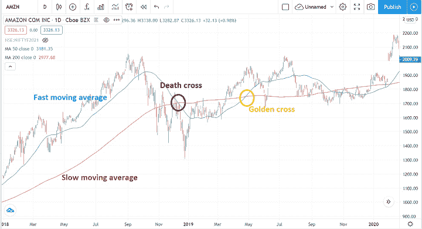
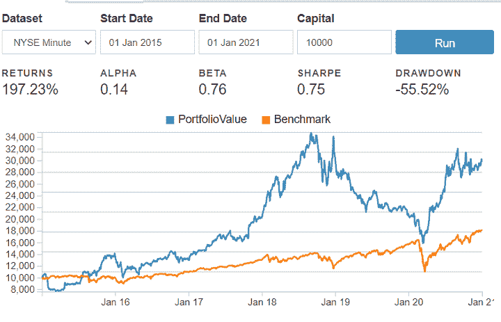
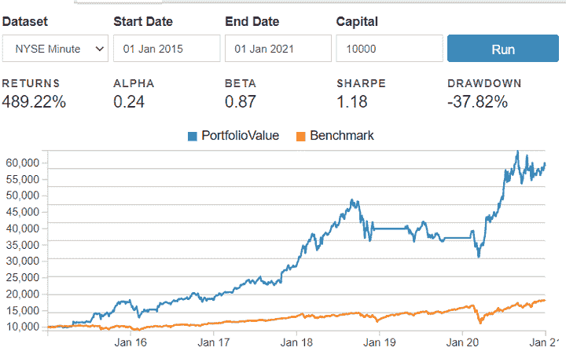

# 动量交易:类型，好处，策略，等等

> 原文：<https://blog.quantinsti.com/momentum-trading-strategies/>

作者[高拉夫·辛格](https://www.linkedin.com/in/singh-gamer-gaurav/)

**动量交易**是一种流行的短线交易范式。它包括识别资产价格的变化，然后在价格变化的方向建立头寸**，期望价格会继续朝那个方向移动。**

在这篇博客中，我们将了解更多关于动量交易的知识。

*   [什么是动量交易？](#what-is-momentum-trading)
*   动量交易是如何运作的？
*   [简单的动量交易策略](#a-simple-momentum-trading-strategy)
*   [涉及的风险](#risks-involved)
*   [如何开始动量交易？](#how-to-start-momentum-trading)

* * *

## 什么是动量交易？

在物理学中，动量这个术语用来定义一个物体的**量和运动方向**。同样在[金融市场](/financial-markets-introduction/)中，一项资产的**动量**是该资产在市场中的**方向**和价格变化速度。

动量交易是这样一种策略，你在**短期**分析资产，然后**买入价格正在上涨的资产**。然后**在**价格似乎已经见顶**时卖出这些资产**，从而获利。基本思想是，如果价格变动背后有足够的力量，价格将继续朝那个方向移动。

动量交易的基本原则是**“高买高卖”**，反之亦然。

[https://www.youtube.com/embed/e5KAV7NmWvk?rel=0](https://www.youtube.com/embed/e5KAV7NmWvk?rel=0)

著名投资家 Richard Driehaus 被认为是**动量投资之父**，他的投资技巧已经成为动量交易的基础。Driehaus 相信**出售输家**和**让赢家通吃**，同时将输家的钱再投资到其他开始显示势头的股票上。

* * *

### 利益

动量交易与通常的“低买高卖”的**价值投资**模式 **和**有点不同**。多年来，动量交易策略在金融市场上被证明是有利可图的。**

实际上，动量交易被认为比“低买高卖”更受欢迎。这是因为你**购买了一项已经在上涨的资产**。你**不必购买**一项被低估的资产**然后等待市场重新评估**那只特定的股票，这样你的投资最终会盈利。

使用动量交易的另一个好处是有可能在短期内获得高额利润。因为你利用了市场的波动性，动量交易最终可以归结为追逐市场表现来最大化你的投资。

* * *

## 动量交易是如何运作的？

动量交易策略在**短期资产价格运动**中寻找机会。假设是**如果一项资产的价格在上涨，在没有其他因素的情况下，它将继续上涨**。

把动量交易想象成一辆行驶的汽车。当你**开始向前移动**时，速度**变慢**。这是当你**发现**一只价格正在上涨的股票。

随着汽车**加速**，**速度增加**。如果你已经确定了股票并购买了它，你的 T4 投资现在开始增长。

看到**红色交通信号**，汽车**减速**，**减速**。这类似于当你**看到资产价格**动量损失**时，在盈利**时退出你的头寸。

* * *

### 动量的类型

动量交易有两种类型。时序动量和截面动量。

*   **时间序列动量**是资产的表现与其自身的**历史表现**相比较。时间序列动量由某个**百分比利润阈值**识别，超过阈值的资产买入。
*   **横截面动量**是一种资产**相对于投资组合中其他资产**的表现。这可以是被买入的十大表现最好的资产和被卖出的十大表现最差的资产。

动量策略不仅仅适用于股票。它们也可以在 **[期货](https://quantra.quantinsti.com/course/futures-trading)** 和**国债**市场实施！

* * *

### 影响势头的因素

资产的短期价格变化受许多因素的影响。其中一些因素如下。

1.  **基本面因素**:如果一家公司发布任何好的或坏的**基本面消息**，该公司的股价将在接下来的几天内朝着特定的方向移动。理想情况下，市场应该立即对这些信息进行贴现，但对于重大公告来说，**消息的渗透需要时间**。
2.  **新闻事件**:资产的动量也受到某些新闻事件的影响。在像**收益公告**这样的**预定新闻**事件的情况下，这种影响较小，因为新闻是预期的。在类似于**合并公告**的**计划外新闻**事件的情况下，动量变化更大。
3.  **市场波动**:市场波动是使用动量交易时要考虑的一个主要因素。由于头寸是在资产价格开始波动后建立的，**高波动性意味着价格有进一步上涨的潜在空间**，这样你就可以获利。
4.  **羊群效应**:在**熊市**中，交易者**追随多数**的倾向更加突出。羊群效应降低了动量交易者的利润空间。

* * *

### 如何发现趋势？

发现动量交易机会是非常重要的，这样你就可以确定资产的进场时间。要检测动量，你可以使用技术指标，也可以使用统计分析。

1.  **技术指标**:检测动量的各种技术指标有:
    *   **动量指标**:用于确认资产价格行为方向的振荡指标。
    *   [**RSI 指标**](/rsi-indicator/) :发现资产是否超买或超卖的振荡指标。
    *   **:这些是发现资产价格新兴趋势的指标。**
    ***   **突破指标**:这些指标可以用来明确识别价格或成交量的突破。**
***   **统计分析**:你可以使用统计分析，比如[赫斯特指数](/hurst-exponent/)测试。赫斯特指数与资产的自相关有关，可用于识别资产是否是趋势性的。在这里你将了解什么是[自协方差和自相关](/autocorrelation-autocovariance/)函数。**

 **Quantra 上的[动量交易策略](https://www.quantra.quantinsti.com/course/momentum-trading-strategies)课程中的**详细示例**涵盖了各种检测动量的方法。

对于复杂的[交易策略](https://quantra.quantinsti.com/course/quantitative-trading-strategies-models)，你甚至可以将这些指标的信号结合起来，得到更可靠的动量检测算法。

你可以阅读更多关于建立趋势跟踪策略的五个指标。

* * *

## 简单的动量交易策略

让我们研究一个简单的使用均线的[动量交易](https://quantra.quantinsti.com/course/day-trading-strategies)策略的例子。在这里你将看到著名的**黄金交叉和死亡交叉算法**的实现。这个算法使用**两条[移动平均线](/moving-average-trading-strategies/)线**。

两条均线分别是**慢线**，或者回看周期更长的慢移动均线，比如 200。以及**快线**，或者回看周期更短的快速移动平均线，比如 50。

<figure class="kg-card kg-image-card kg-width-full kg-card-hascaption">

<figcaption>Fig 1\. Golden cross and Death cross (Source: TradingView)</figcaption>

</figure>

金叉是一种图表模式，表明价格趋势看涨。当快线与慢线向上交叉时(即从下到上)，出现黄金交叉。

死亡交叉预示着**看跌**趋势。当**快线向下穿过慢速线**(即从上至下)时，就会出现这种情况。

可以建立一个简单的策略，在黄金交叉出现时做多资产，在死亡交叉出现时做空资产。

使用移动平均线寻找信号的 Python 逻辑如下。

你可以点击下面的按钮在 Blueshift 上试试这个策略！

<button onclick="createStrategy('MTS_blog_strategy', 'MTS_blog_strategy', 'code', 'create-strategy', 0)" style="background-color: #92c94a; padding: 12px 20px; border-radius: 5px; color: #fff;">启动蓝移上的预建策略</button>

2015 年以来的策略回报如下。

<figure class="kg-card kg-image-card kg-card-hascaption">

<figcaption>Fig 2\. Strategy Performance for long-short strategy</figcaption>

</figure>

动量策略**优于基准**。通过**实施适当的风险管理技术和微调参数**，可以进一步提高战略绩效。

有趣的是，实施**只做多策略**(仅在黄金交叉时进入头寸)远比在死亡交叉时做空的策略更有利可图**。仅做多策略的回报如下所示。**

<figure class="kg-card kg-image-card kg-width-full kg-card-hascaption">

<figcaption>Fig 3\. Strategy Performance for long-only strategy</figcaption>

</figure>

* * *

## 动量交易的风险

像所有的[交易策略](/tag/more-trading-strategies)一样，动量交易也不是没有风险。下面列出了一些需要小心的风险因素。

1.  **进出时机**:动量交易策略极其**时效性**。如果进场的时间太晚，投资可能会亏本。类似地，如果错误地识别了势头的减缓，过早地退出了头寸，即使在识别了机会之后，你也失去了潜在的收益。
2.  **高交易成本**:由于这种类型的策略识别短期机会，当**与长期价值投资**或买入并持有策略相比时，总交易的**数量可能**高**。这导致了更大的交易成本。**
3.  **耗时**:交易者必须**密切监控机会**，并需要更新交易资产的所有相关消息。
4.  **市场[情绪](https://quantra.quantinsti.com/course/trading-using-options-sentiment-indicators)** : **经验上**动量交易**在牛市**中效果最好。这是因为人类在不利条件下**群居**(熊市)的心理。对于相同的交易机会，羊群行为导致每个交易者的利润减少。这种效果在上面的两个策略结果中**也很明显。**
5.  **趋势反转**:动量策略假设趋势将继续朝同一方向发展。然而，有时趋势逆转，这种策略失败了。

当你在实时市场交易动量交易策略时，需要实施足够的 **[风险管理](/trading-risk-management/)技术**。适当的[仓位大小](https://quantra.quantinsti.com/course/position-sizing-trading)和追踪止损可以用来减少策略损失，限制你的市场敞口。

* * *

## 如何开始动量交易？

要开始使用动量交易，你需要首先详细了解动量交易的概念和如何发现动量的 T2，影响动量的 T4 因素和与这种投资模式相关的风险。

一个很好的起点是**免费的** [外汇交易课程](https://quantra.quantinsti.com/course/forex-trading-python-basics)，其中实施了横截面动量策略，并与 Blueshift 整合，这是一个**创建**、**回溯测试**和**实时交易**您的策略的平台。

[https://www.youtube.com/embed/KXt7mq_DCx8?rel=0](https://www.youtube.com/embed/KXt7mq_DCx8?rel=0)

为了研究动量交易的细节，你可以查看 T2 Quantra 动量交易策略课程，其中的概念由 T4 用例子解释并用 Python 代码解决。课程中教授了更多的交易策略，可以帮助你利用**指标**捕捉不同类型的动量，利用**资产期货**和**事件驱动机会**实施动量交易。动量交易策略**在 Blueshift** 上实现，也提供了 **[IBridgePy](https://quantra.quantinsti.com/course/Automated-Trading-IBridgePY-Interactive-Brokers-Platform)** 的模板！

对于**动量交易的高级概念**，你可以查看由 [Nitesh Khandelwal](#https://www.linkedin.com/in/niteshkh/) 主持的**网络研讨会**。

[https://www.youtube.com/embed/Pjtuw3y6W2A?rel=0](https://www.youtube.com/embed/Pjtuw3y6W2A?rel=0)

*<small>免责声明:股票市场的所有投资和交易都涉及风险。在金融市场进行交易的任何决定，包括股票或期权或其他金融工具的交易，都是个人决定，只能在彻底研究后做出，包括个人风险和财务评估以及在您认为必要的范围内寻求专业帮助。本文提到的交易策略或相关信息仅供参考。</small>T3】***