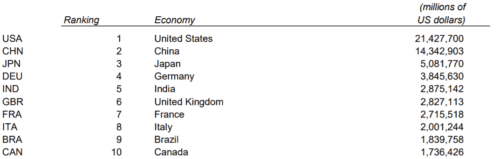

# 宏观经济学:介绍，因素，政策，对交易的影响

> 原文：<https://blog.quantinsti.com/macroeconomics/>

以[重香重香](https://www.linkedin.com/in/rekhit/)

宏观经济学是一个庞大的话题，但其核心类似于一个家庭的财务规划。每个家庭都知道他们必须平衡收入、支出和储蓄。我们这里用一个简单的等式，收入=支出+储蓄，希望储蓄部分每次都最大化。宏观经济学是类似的，除了它处理整个国家的钱！或者在某些情况下，甚至是一组国家。

让我们回顾一下本博客中讨论的主题:

*   [宏观经济学的定义](#definition-of-macroeconomics)
*   [宏观经济政策简史](#brief-history-of-macroeconomic-policies)
*   [宏观经济因素](#macroeconomic-factors)
*   [宏观经济政策](#macroeconomic-policies)
*   [宏观经济和金融市场](#macroeconomics-and-the-financial-markets)
*   [学习宏观经济学的资源](#resources-to-learn-about-macroeconomics)

## 宏观经济学的定义

宏观经济学是对影响整个国民经济的力量的研究。一个国家的政府试图关注国内生产总值、失业率、通货膨胀率等因素，并制定政策将它们保持在健康的水平。与关注个人消费者或公司的微观经济学相比，宏观经济学着眼于大局，检查国家的表现。此外，根据其目标，国家制定货币和财政政策，引导经济走向光明的未来。

等等！虽然宏观经济学可能很复杂，无法在一篇文章中涵盖，但我们将尝试专注于几个关键概念。只要记住一点，不管是家庭还是政府，大家都希望你有一个比今天更好的未来。

在我们深入研究这些因素之前，让我们回顾一下过去，了解一下宏观经济学在过去几十年是如何演变的。

## 宏观经济政策简史

虽然过去有很多理论，但据说数量理论可能是第一个着眼于大局的理论。埃尔文·费雪的版本很简单，

M * V = P * Q

在哪里，

M =货币供应量

V =货币流通速度(货币单位在某一时间用于购买商品/服务的次数)

P =价格水平

Q =生产的商品数量。

在正常情况下，我们通常将货币流通速度和生产的商品数量视为常数。因此，增加货币供应量(M)会导致价格水平的上升。

例如，假设经济中只有一种商品，即手机。现在，如果我们增加货币供应量，这意味着更多的人有更多的钱。现在他们都想买一部手机，但是手机的生产数量是不变的。按照正常的供求情况，厂商提高手机价格，让部分买家望而却步。因此，尽管我们的货币供应量增加了，但价格水平的上升抵消了它。

有趣的事实:这正是通货膨胀的运作方式，本质上，大多数国家的中央银行或美国联邦储备委员会在某些情况下都会这样做，以确保经济不会在路上颠簸。

虽然这个等式在大多数情况下成立，但有时它可能会动摇。怎么会？

人们认为，通常降低商品价格会有助于清仓。然而，在大萧条时期，经济学家无法解释为什么商品卖不出去，工人失业。

在这一点上，凯恩斯经济学站稳了脚跟，并发展成为现在被认为是宏观经济学的领域。虽然这不是实际情况，但随着衰退的开始，公司开始减少商品支出。甚至普通人也开始把钱攥在手里，而不是花在某个地方。这产生了乘数效应，因为没有人愿意花不必要的钱。因此，经济急剧下滑，导致了大萧条。

虽然有几种理论和思想流派，但人们普遍认为，经济应该是自由市场和政府的结合，以确保它不会变得不稳定。

现在让我们开始研究基础知识，理解我们称之为宏观经济学的大图景的各个部分。

## 宏观经济因素

正如我们之前说过的，宏观经济学着眼于大局，即经济表现如何？为了帮助我们回答这个问题，宏观经济学家提出了如下一些因素:

### 国内生产总值

简单地说，GDP 给我们一个国家一年生产多少的货币价值。想象一个由两个儿子和两个女儿组成的家庭。姐妹俩生产电动自行车，花了她们 100 万美元。而兄弟俩花了 100 万美元定制自行车引擎。因此，你会说这个家庭一年的 GDP 是 200 万美元。

以类似的方式，你将计算一个国家生产的所有产品的货币价值。

为了让你有一个想法，下面是 2019 年的一些国内生产总值数据:

<figure class="kg-card kg-image-card kg-width-full"></figure>

(来源:【2019 年国内生产总值)

是的，考虑到一个国家有如此多的不同部门、私营企业和公共企业，你想知道如何得到这些数据是对的。通常，该国有一个专门的政府机构来收集和计算该国的 GDP 数据。

其实也可以看到历年的世界 GP，如下图:

[https://data.worldbank.org/share/widget?indicators=NY.GDP.MKTP.CD&view=chart](https://data.worldbank.org/share/widget?indicators=NY.GDP.MKTP.CD&view=chart)

你是如何计算 GDP 的？

概括地说，有三种方法来计算 GDP，它们应该给出相同的数字。让我们看看这些是什么:

A.**产出(或生产)法**——在这种方法中，你计算出所有生产出来的商品的最终价值，但减去过程中消耗掉的任何中间商品的价值。以家庭为例，如果一辆电动自行车价值 1000 美元，但所用的钢材和材料价值 700 美元。那么最终价值将是 300 美元。

B.**支出法**——这种方法和早先的方法有点相反，我们计算的是在国内的支出。支出法的一个简单公式如下:

GDP = C + G + I + NX

这里，C 指的是大多数个人或私营公司的消费。

g 指政府支出，

I 代表资本货物投资

NX =出口-进口

简单地说，假设任何支出都将发生在这四项中的任何一项，因此，如果将它们加起来，我们将得到总支出或支出的值，这被称为国内生产总值。

C.**收益法**——顾名思义，收益法就是告诉我们把所有挣得的工资、租金、利息或利润加起来。这会告诉我们这个国家赚了多少，是 GDP。

这是对 GDP 计算方法的过度简化。在现实世界中，我们还必须考虑包括(或在某些情况下排除)税收、补贴和回扣，这可能会扭曲真实数字。

计算国内生产总值的另一个重要因素是通货膨胀的影响。

### 但是为什么通货膨胀如此重要呢？

不考虑通货膨胀的 GDP 数字被称为名义 GDP。现在假设一个国家的国内生产总值在 2018 年达到 1 亿美元。由于某些因素，该国实际上在所有部门生产了相同数量的单位。但由于 5%的通货膨胀，名义国内生产总值为 1 . 05 亿美元。

因此，对于一个局外人来说，这个国家的经济看起来增长了 5%,而事实是什么都没有改变。因此，我们使用经通胀调整的 GDP 来清楚地了解该国的表现。这叫做**真实 GDP** 。

实际国内生产总值总是以某一年为基准来计算的。例如，美国的基准年是 2012 年，而印度是 2011-12 年。

但是现在你想知道不同的国家如何相互比较。例如，虽然印度和英国的 GDP 数据很接近，但人口数据却完全不同。

这就是为什么你用实际人均 GDP 来理解一个国家的表现。因此，尽管印度的 GDP 数字可能比英国大，但它的情况更糟，因为它不得不将这个数字分配给更多的人口。

人均国内生产总值如下:

[https://data.worldbank.org/share/widget?indicators=NY.GDP.PCAP.CD](https://data.worldbank.org/share/widget?indicators=NY.GDP.PCAP.CD)

一些宏观经济学家更进一步，使用**购买力平价(PPP)** 来比较不同的经济体。购买力平价试图比较不同国家之间的类似支出。

例如，在下表中，我们看到同样的租金支出，你在 A 国要比 b 国多支付 10 倍。因此，A 国的购买力平价是 b 国的 10 倍。

| 费用类型 | 国家 | 国家 |
| 两室公寓的租金 | One thousand | One hundred |
| 食品和杂货 | Five hundred | Fifty |
| 总数 | One thousand five hundred | One hundred and fifty |

让我们进一步探讨下一个宏观经济变量。

### 失业率

失业率就是失业人口占工作人口的百分比。有两种类型的失业:

1.  摩擦性失业:在这种类型中，失业是由于处于两个工作之间的人或两个工作之间的过渡时期。
2.  周期性失业:随着经济收缩或增长，某些工作可能变得多余，公司被迫解雇员工。

低失业率表明，随着新人进入劳动力市场，经济足以创造新的就业机会。想想看，如果有高失业率，它会导致人们接受他们得到的第一份工作。例如，一个高度合格的专家会从事一份比萨饼送货员的工作，因为没有适合他们专业的工作。这导致就业劳动力的不满以及失业者的不安。

但是如果低失业率对经济有好处，那么 0%的失业率是最好的吗？

答案并不像看起来那么简单。研究表明，如果没有失业人员，劳动力之间就没有竞争，公司可能会倾向于雇用非技术工人或第一个申请工作的人。这可能导致效率降低，并最终减缓经济的发展。

因此，虽然低失业率有助于稳定经济，但 0%以及高失业率都是不可取的。

让我们转向下一个重要的宏观经济变量

### 通货膨胀率

通货膨胀率告诉我们一件商品的价格增加了多少。例如，如果一条面包在 2019 年定价为 1 美元，但增加到 1.05 美元，那么我们会说价格上涨了 5%。

同样，一个经济体的通货膨胀率是通过确定某一篮子商品的价格水平来计算的。这些将包括食品、服装、住房、电子产品、教育费用等。一旦确定了这些项目，你就可以计算每年的价格水平，从而估算出通货膨胀的程度。

世界通货膨胀率如下:

[https://data.worldbank.org/share/widget?indicators=FP.CPI.TOTL.ZG](https://data.worldbank.org/share/widget?indicators=FP.CPI.TOTL.ZG)

高通胀对经济来说意味着坏消息吗？

这个问题的答案很复杂，因为乍一看你会想说是。但如果先说基本的，我们来回答一下为什么会发生通货膨胀？

这是一个简单的供求问题。如果一种产品供不应求，价格必然会上涨。在正常情况下，通胀可能是经济实际繁荣的一个指标。

以较早使用的手机为例，如果提高价格，人们仍然购买，这将是现有环境不能够满足需求的迹象。因此，新进入者将进入市场，带来更多的就业机会，生产更多的商品，进而增加支出，从而增加 GDP。

事实上，在 2000 年代，印度和中国的通胀率和 GDP 都很高。当然，在某些情况下，经济可能会因为不受控制的通货膨胀而严重崩溃，这被称为恶性通货膨胀。因此，政府和中央银行总是密切关注通货膨胀率，以确保它不会失控。

这就把我们带到了下一个宏观经济变量。

### 利率

利率是另一个告诉我们经济状况的宏观经济变量。利率是根据通货膨胀率和经济的流动性要求决定的。

美国联邦储备委员会不断调整利率以控制通货膨胀。我们将在稍后的博客中讨论美联储的角色。

低利率通常会鼓励公司借钱用于扩张，从而帮助经济增长。然而，如果通货膨胀率持续上升，利率就会上升，这就阻碍了个人和公司的借贷，从而减少了市场的流动性。因此，需求通常会降低，通货膨胀也会减少。

这些是一些有助于我们理解经济状况的宏观经济变量。但是我们能控制这些因素吗？

从某种意义上说，是的。让我们在下一节中了解如何做到这一点。

## 宏观经济政策

也就是说，有两种政策可以用来给出最佳的宏观经济数据。

### 货币政策

货币政策是由中央政府决定的，比如美国的美联储。中央银行通常为银行设定利率水平，银行反过来控制经济中的货币流动性。

对印度来说，印度央行制定政策并实施各种措施，如设定回购和反向回购利率，以确保印度经济平稳运行。想了解更多，可以访问官网[这里](https://www.rbi.org.in/scripts/FS_Overview.aspx?fn=2752)。

同样，新加坡[金融管理局](https://www.mas.gov.sg/monetary-policy)执行新加坡的货币政策。

### 财政政策

政府为经济制定财政政策，宣布针对某些地区或行业的特别计划，甚至在困难时期为某些部门提供一揽子刺激计划。税收结构也可以修改，要么刺激经济，要么防止经济过热。政府可以通过投资对私营企业来说太大的关键项目来影响国家的 GDP。

宏观经济因素和政策会影响金融市场吗？让我们在下一节中找出答案。

## 宏观经济学和金融市场

想想看，你是一个投资者，希望做多一家制药公司。在政府最近的一次预算会议上，宣布药品税将减少 20%。

你知道这会增加制药公司的收入。你将立即购买该公司的股票。其他交易员也有同感，在很短的时间内，该公司的股价就上涨了。在这个时候，公司的运作没有任何变化。

让我们再举一个例子，一家公司正处于成长阶段，正在寻求在其他市场扩张。由于贷款利率的降低，该公司获得了贷款，并用这笔钱在另一个地区建立了一家工厂。由于该公司的产品已经很受欢迎，贸易商知道新工厂将为公司增加收入。因此，该公司的股价上涨。

在特朗普政府期间，制定了一些政策来促进美国本土的制造业。这为采购当地制造的产品而不是从国外采购产品提供了激励。这影响了严重依赖其他国家的公司，这些公司在当地社区找不到高质量的替代品。然而，一个公司可以利用这些政策，迎合这个市场以前并不存在。

相比之下，某些经济体制定吸引外国投资的政策。印度早先是一个封闭的经济体，从 1991 年开始，通过一系列改革向外国投资敞开了大门。这导致了经济的进步，并使得获得外国资本对投资者和印度公司都有利。由于这些政策，信息技术部门蓬勃发展。

这些是宏观经济因素如何影响股票价格的一些例子。众所周知，每当美联储降低利率时，美国股票市场都会经历一次短期的上涨。因此，一些交易者实际上把他们的交易安排在美联储开会的日子。你可以在我们关于[事件驱动策略](https://quantra.quantinsti.com/course/event-driven-trading-strategies)的课程中了解更多关于这些基于事件的交易方法。

如何进一步了解宏观经济因素？让我们在下一节看看。

## 学习宏观经济学的资源

下面是几本书，也是研究生或研究生水平的经济学学生使用的

*   N·格里高利·曼昆的《宏观经济学原理》
*   《宏观经济学:原则、问题和政策》,作者:Campbell McConnell，Stanley Brue，肖恩·弗林
*   宏观经济学，作者保罗·克鲁格曼；罗宾·威尔斯
*   布拉德利·席勒和卡伦·格布哈特的《今日宏观经济》
*   圣路易斯的美联储银行。数据库来获取宏观经济时间序列数据。
*   [世界银行公开数据|数据](https://data.worldbank.org/)

随着数字学习的出现，你也可以在各种网络平台上注册电子学习课程，学习宏观经济学。

## 结论

宏观经济学是定量评估一个经济体表现的研究。你已经经历了不同的宏观经济因素，如国内生产总值，失业率和利率。你也了解了财政和货币政策如何影响这些宏观经济变量。此外，你已经看到了宏观经济因素如何影响股票市场。

*免责声明:本文中提供的所有数据和信息仅供参考。QuantInsti 对本文中任何信息的准确性、完整性、现时性、适用性或有效性不做任何陈述，也不对这些信息中的任何错误、遗漏或延迟或因其显示或使用而导致的任何损失、伤害或损害承担任何责任。所有信息均按原样提供。*