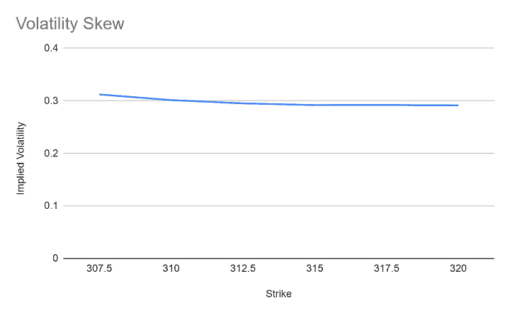

# 赫斯顿模型:公式，假设，限制，等等

> 原文：<https://blog.quantinsti.com/heston-model/>

以[重香重香](https://www.linkedin.com/in/rekhit/)

赫斯顿期权定价模型，或赫斯顿模型，被认为是对布莱克-斯科尔斯模型的改进，布莱克-斯科尔斯模型采用了一些不反映现实世界的假设。主要假设是波动率在期权有效期内保持不变。

当然，我们知道基础资产的波动率往往会波动，很少会保持不变。史蒂文·赫斯顿提出了一个数学模型，该模型将波动率保持为一个不可预测的值，并遵循随机过程。此外，Heston 的模型为我们提供了一个封闭的解决方案，极大地简化了流程，并在社区中得到更广泛的采用。让我们继续前进，看看这个博客将涵盖的主题。

*   [布莱克-斯科尔斯模型的局限性](#limitation-of-the-black-scholes-model)
*   [赫斯顿模型公式举例](#heston-model-formula-with-example)
*   [使用 quantlib 包的 Python 中的 Heston 模型](#heston-model-in-python-using-quantlib-package)
*   [赫斯顿模型的局限性](#limitations-of-the-heston-model)

如果你想重温期权术语，可以去我们的[期权交易基础](/basics-options-trading/)博客重温一下。好吧！让我们现在开始。

* * *

## 布莱克-斯科尔斯模型的局限性

布莱克-斯科尔斯模型对交易者来说是一个启示，它使得期权定价相对简单。然而，为了实现这种简单性，Black Scholes 模型假设波动率保持不变。此外，无风险收益率也保持不变，以获得一个保持变量最小的模型。Black Scholes 模型还假设股票不支付股息，并且在到期日之前不能行使相应的期权。如果你想在 Excel 中看到布莱克·斯科尔斯，请访问我们的[Excel 期权交易](/options-trading-excel-model/)博客。令人惊讶的是，布莱克·斯科尔斯模型仍然有效，并在世界范围内被采用。

但这并没有阻止研究人员试图修改模型，使其尽可能接近市场动态。因此，在模型给我们一个价格之后，有一些方法可以将红利计算在内，等等。但是史蒂文·赫斯顿采取了不同的方法。他设法推导出一个数学模型，表明波动是一个随机过程，因此，是一个随机过程。这种假设符合市场的普遍情绪。现在来详细看看。

* * *

## 赫斯顿模型公式及实例

让我们首先理解为什么我们必须小心翼翼地将波动性视为一个常数。假设你保持波动率不变。现在你画一个图，x 轴代表不同的执行价格，y 轴代表一组期权的隐含波动率。结果你会发现一条曲线。我们称之为波动微笑。可以参考这篇博客了解隐含波动率以及如何绘制[波动率微笑](/implied-volatility/#Interpreting)。这是因为深度价外期权的隐含波动率较高，而当我们转向价内或价内期权时，隐含波动率通常会降低。

令人惊讶的是，据说波动微笑在 1987 年崩盘前很少见。崩盘后，交易员们意识到，无论 OTM 期权多么罕见，都有可能发生。

该图看起来像这样:

<figure class="kg-card kg-image-card kg-width-full"></figure>

根据布莱克·斯科尔斯模型，这应该是一条平坦的线。为了确保期权价格尽可能接近真实世界，赫斯顿模型提出了一个随机波动率模型，该模型将绕过这一限制，并保持其为封闭形式的解决方案，从而保持模型的相对简单性。

现在，我们知道波动性是一种证券在一段时间内的上下波动。从技术上来说，它是以一段时间内年化回报率的标准差来衡量的。或者简单地说就是收益方差的平方根。

事实上，赫斯顿模型有两个函数，布朗运动，基础资产价格，和方差的方差。

瞬时方差基于用于市场利率建模的考克斯-英格索尔-罗斯模型(CIR 模型)。它的假设是，利率是均值回归的，永远不会是负数。方差的“平方根”用于仅保留正值。

现在，让我们来看看模型方程并了解其组成部分:

### 赫斯顿模型方程及其分量

$$ dS_t = rS_t + {\sqrt v_t}S_t*dW_t^S $$

这里，r 是无风险利率，v t 是瞬时方差

And, $$ dv_t = k(θ-v_t)dt +ξ{\sqrt v_t}* dW_t^v $$ Here,

ξ是波动率的波动率
k 是 vt 回到 0 的速率
θ是长期价格方差

注意:

$$ W_t^S \text{ is the Brownian motion corresponding to the underlying asset’s price} $$ $$ W_t^v \text{ is the Brownian motion corresponding to the variance} $$

此外，两个布朗运动是负相关的。一种解释是，股价的大幅下跌增加了波动性。

$$ W_t^S*W_t^v= ρ dt $$

其中，ρ为相关性。

赫斯顿实际上提供了他在论文中使用的以下默认参数。它们如下，

*   ξ是波动率的波动率
*   k = 2
*   θ = 0.01
*   Vt = 0.01
*   ξ = 0.1
*   期权到期= 0.5 年
*   r = 0
*   执行价格= 100。
*   ρ = 0

利用这个等式，赫斯顿得出了一个欧式看涨期权的价格如下

$$ C_T=e^{-r(T-t)}\int_0^∞dx(e^x-K)+ρ(x) $$

这里 x = log(S ), p(x)是标的资产价格的概率密度函数。

当然，时间 T 是看涨期权的到期时间，时间 T 可以是你想计算期权价格的时间。

为了在实践中使用该方程，我们使用快速傅立叶变换函数，该函数将概率密度函数从 x 空间转换到 u 空间。

方程式如下:

$$ \phi_T(u)=E|e^{iux_T}|x_T=x| $$

当然，我们会用蒙特卡罗产生各种可能性或路径。现在让我们进入问题的核心。现在我们来看看构建 Heston 模型的 python 代码。为了温习 Python 的基础知识，你可以在 Quantra 上注册 [Python for Trading](https://quantra.quantinsti.com/course/python-for-trading) 课程。

* * *

## 使用 quantlib 包的 Python 中的 Heston 模型

(感谢 [Chamundeswari Koppisetti](https://www.linkedin.com/in/chamundeswari-koppisetti/) 提供代码。)

我们将考虑定价没有离散红利和障碍的普通期权。

我们在这里考虑了默认的五个赫斯顿参数(注意，这些参数可以使用各种优化技术校准到市场参数)。

我们现在将构建随机波动赫斯顿过程。

期权的当前价格是使用基于傅立叶变换的解析赫斯顿模型引擎计算的

输出如下所示:

选项 _ 价格 7.03

因此，通过这种方式，我们可以使用 quantlib python 包来构建 Heston 模型。如果您想在不使用软件包的情况下构建 Heston 模型，请继续阅读下面的内容。

我们用欧拉法对同样的期权进行定价，将 SDE 积分，生成蒙特卡洛路径，然后取平均值。

输出类似于我们使用 quantlib 包时收到的输出

输出:

Seven point zero two

因此，通过这种方式，我们可以使用 python 构建 Heston 模型。在[高级期权交易](https://quantra.quantinsti.com/course/options-trading-strategies-python-advanced)课程中，你可以探索更高级的概念，如离差交易、奇异期权、伽玛刷单。虽然赫斯顿模型可以说优于布莱克-斯科尔斯模型，但它也有自己的局限性。让我们在下一节看到它。

* * *

## 赫斯顿模型的局限性

赫斯顿模型的主要限制之一是模型中参数的存在，这些参数必须仔细校准以提供对期权价格的合理估计。此外，我们发现赫斯顿模型在预测短期期权的期权价格时会受到影响，因为该模型未能捕捉到高的隐含波动率。它也比阻止交易者使用期权的布莱克-斯科尔斯模型更复杂。

## 结论

我们已经看到了赫斯顿模型如何通过假设波动率是随机过程来改进布莱克-斯科尔斯期权定价模型。我们还研究了该模型的组成部分，并了解了其相对于 Black Scholes 模型的局限性。您可以通过启动 Quantra 上的[期权交易学习轨道](https://quantra.quantinsti.com/learning-track/quantitative-approach-in-options-trading)开始交易，尝试自己的期权交易策略。

*免责声明:本文中提供的所有数据和信息仅供参考。QuantInsti 对本文中任何信息的准确性、完整性、现时性、适用性或有效性不做任何陈述，也不对这些信息中的任何错误、遗漏或延迟或因其显示或使用而导致的任何损失、伤害或损害承担任何责任。所有信息均按原样提供。*