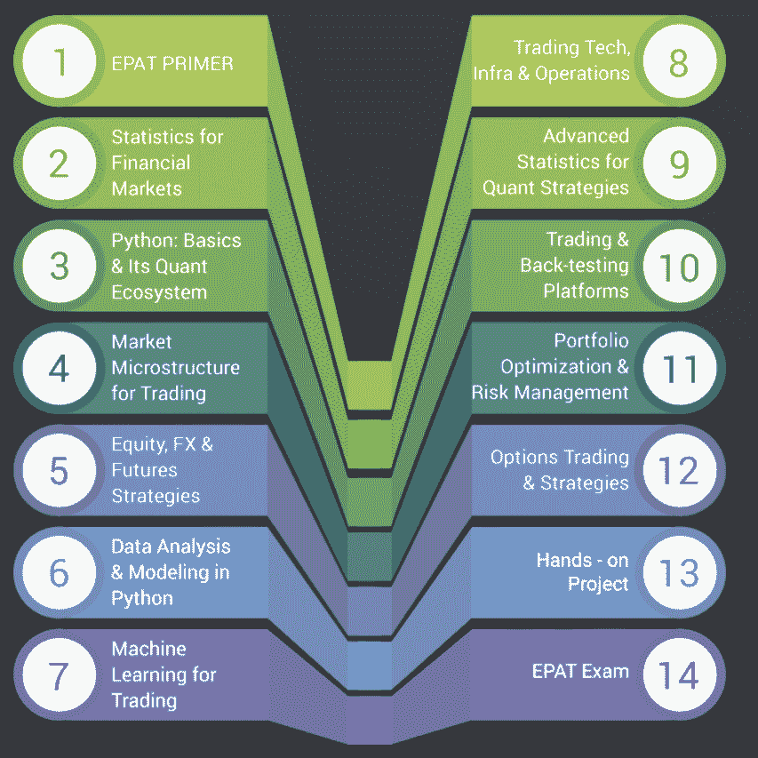
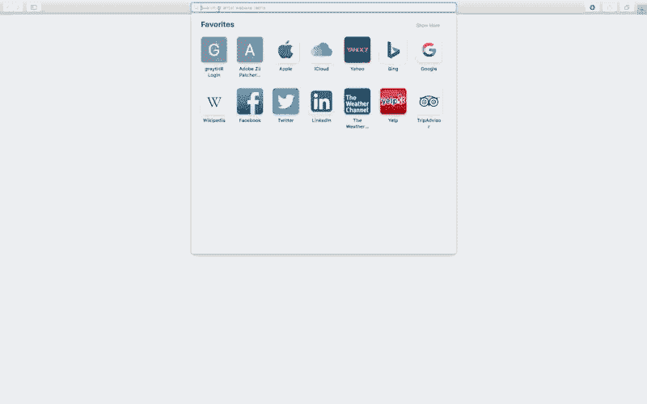
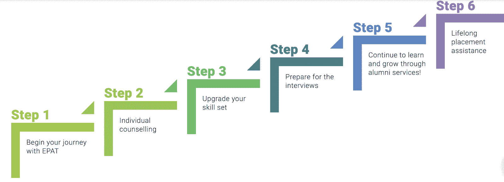
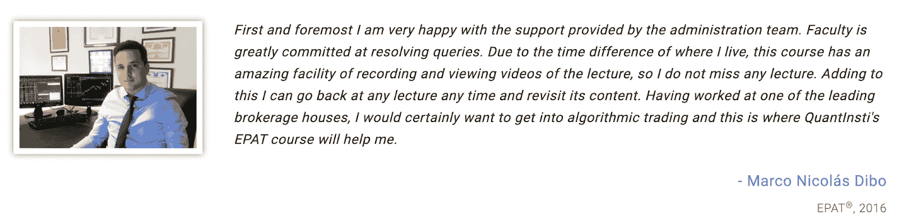
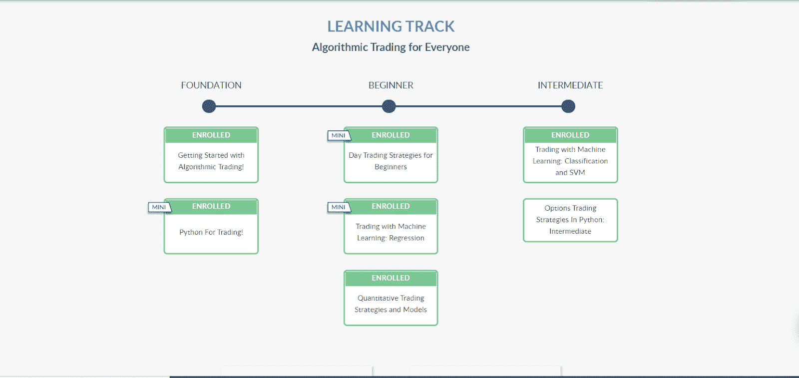

# EPAT，匡特拉或两者兼而有之！你应该学什么，为什么？

> 原文：<https://blog.quantinsti.com/epat-quantra/>

由[查尼卡·塔卡](https://www.linkedin.com/in/chainika-bahl-thakar-b32971155/)

QuantInsti 提供广泛的课程，它明白你需要知道 EPAT 和 Quantra 课程到底提供什么，以及它们之间的区别。

在为自己寻找最佳课程时，可能会有几个问题，如参加特定课程的好处、与位置相关的查询、学习平台的类型等等。

在这篇文章中，我们旨在消除所有的困惑，并提供几乎所有必要的答案，使您的决定更容易。

本文涵盖:

*   什么是 EPAT？
*   [什么是 Quantra？](#what-is-quantra)
*   [课程表](#curriculum)
*   [什么是独特？](#what-is-unique)
*   什么最适合你？
*   [对比表——EPAT 和 Quantra](#comparative-table-epat-and-quantra)

## 什么是 EPAT？

[EPAT](https://www.quantinsti.com/) 是一个为期 6 个月的综合虚拟课堂项目，涵盖算法交易的基本模块，例如:

*   市场微观结构
*   金融工具
*   统计数字
*   数据分析
*   证券管理
*   Python/Matlab/Excel 编码基础
*   机器学习的使用
*   交易、技术、基础设施和运营
*   实时交易策略构建

**市场微观结构**

它是对金融市场的研究，主要是关于它们是如何运作和发挥作用的。在本模块中，你将学习所有关于金融市场的知识。

**金融工具**

金融工具，如期权、期货、远期等。都包括在 EPAT 方案中。你可以学习所有关于这些金融工具的交易。

**统计数据**

通过这个模块，你将能够学习在算法交易中使用统计信息建立量化策略。

**Python 中的数据分析和建模**

这个模块将有助于在实时交易环境中使用 Python 实现面向对象编程等概念。

**投资组合管理和风险优化**

本模块研究风险管理和投资组合优化。因此，它有助于识别和管理不同策略中涉及的风险。

**Python/Matlab/Excel 编码基础**

算法交易的关键之一是回溯测试你的策略，你需要一定的编程技能。本模块将帮助你理解编写和回溯测试交易策略所需的 Python 概念的应用。

**使用机器学习**

本模块帮助您在实时交易环境中实施交易策略。机器学习模型，如逻辑回归、支持向量机等。包含在本模块中。

**交易技术、基础设施和运营**

这个模块帮助你了解算法交易的需求、要求、优势和应用。此外，您还需要了解基础设施的要求，如硬件、网络等。以及在启动 algo 交易台时的业务环境。

**实时交易策略构建**

本模块旨在帮助您了解在实时交易环境中如何实施您的策略，并将向您介绍使用 Python 编程语言的互动经纪人等平台。

在 EPAT 项目工作中，你在指定导师的指导下从零开始建立自己的战略。您总共将获得 300 多个小时的学习材料、100 多个小时的现场讲座、41 场讲座、来自 7 个国家的 19 名教师和来自 70 多个国家的参与者，最后还将获得 Prometric 的认证。你可以和老师互动，并获得所有疑问所需的帮助。此外，EPAT 还提供实习、职位安排和开设交易平台方面的支持。

QuantInsti 算法交易的高管课程是为希望在该领域发展或计划在算法和量化交易领域开始职业生涯的专业人士设计的。本课程以监考考试结束，完成本课程后，您将获得终身访问和支持，在整个过程中随时为您提供帮助。

它通过专注于衍生品、量化交易、电子做市或交易相关技术和风险管理，激励传统交易者走向成功的算法交易生涯。

接下来，我们将了解什么是 Quantra。

## 什么是 Quantra？

Quantra 是 QuantInsti 的一个电子学习门户网站，专门提供算法&量化交易的短期课程。Quantra 提供小型自定进度和自学课程，包括视频、音频、文档、演示、python 笔记本、多项选择[问题](https://quantra.quantinsti.com/course/quant-interview-questions-preparation)和高度互动的练习。Quantra 平台上有 30 多门课程，10 位作者，200 小时的培训材料，包括 30 小时的视频和 pdf 形式的免费培训材料。每一项都可以在一两天内完成。此外，Quantra 有专业知识，即 NLP(自然语言处理)和强化学习。此外，还教授了不同主题的 Python 语言编码，并提供了一些提示和解决方案来帮助您练习这些代码。学习交易策略有一些特别之处，从一行代码开始，一步一步来！

你可以通过实时交易帮助来体验教学技巧，让你掌握重要的概念。

[https://www.youtube.com/embed/0dcrrB6Ivmc](https://www.youtube.com/embed/0dcrrB6Ivmc)

此外，它为您提供了无与伦比的实际动手学习体验，使您能够轻松地学习和实施复杂的概念。

Quantra 上最好的学习途径是:

*   面向所有人的算法交易
*   金融市场中的机器学习和深度学习
*   使用 Python 进行自动交易
*   高级算法交易策略
*   股票市场:自动化交易
*   期权交易:定量方法
*   交易中的情绪分析

[**人人算法交易**](https://quantra.quantinsti.com/learning-track/algorithmic-trading-for-everyone)

本学习课程有助于学习不同的交易策略，包括日交易、机器学习、ARIMA、GARCH，以及在交易中使用期权定价模型。这些课程对于想要学习和使用 Python 进行交易的交易者和量化分析师来说是完美的。

[**金融市场中的机器学习和深度学习**](https://quantra.quantinsti.com/learning-track/machine-learning-deep-learning-in-financial-markets)

对于那些对机器学习及其在交易中的应用感兴趣的人来说，这是一个强烈推荐的途径。从简单的逻辑回归模型到复杂的 LSTM 模型，这些课程非常适合初学者和专家。通过这些课程，您将学习调整超参数、梯度推进、集成方法和高级技术，从而构建稳健的预测模型。

[**利用 Python 自动交易**](https://quantra.quantinsti.com/learning-track/automated-trading-using-python-interactive-brokers)

该学习课程是一个完整的端到端学习计划，旨在在实时市场中实施流行的算法交易技术，用于日交易和低频交易。如果你想增加你的投资组合，并在你的交易中包括历史数据回溯测试和纪律，这个学习路线是强烈推荐给你的。

[**高级算法交易策略**](https://quantra.quantinsti.com/learning-track/algorithmic-trading-for-quants)

对于想通过统计分析改善交易结果的交易者来说，这条路线是最好的。它包括一系列课程，在这些课程中，你将学习 30 多种新策略，如动量、均值回归、指数套利、多空、突破、季节性交易策略和投资组合管理。此外，您还可以通过本专题的课程获得 Python 和实时交易可部署模型的实践培训。

[**股票市场:自动交易**](https://quantra.quantinsti.com/learning-track/automated-trading-in-equity-market)

如果你是一名交易者，希望运用量化技术来改善和自动化你在股票市场的交易，那么这是一条适合你的学习路线。学习使用 25 种以上的交易策略，包括日交易策略、机器学习、量化技术、卖空、[投资组合管理](https://quantra.quantinsti.com/course/portfolio-management-machine-learning)以及本课程中的更多内容。

[**期权交易:量化进场**](https://quantra.quantinsti.com/learning-track/quantitative-approach-in-options-trading)

通过本学习路线中的课程，您将学会创建期权定价模型、期权希腊模型和各种策略，如离差交易、情绪交易、箱式策略和日历价差。使用 ARIMA 和 GARCH 模型，机器学习技术和[动量交易策略](https://quantra.quantinsti.com/course/momentum-trading-strategies)。

[**交易中的情绪分析**](https://quantra.quantinsti.com/learning-track/sentiment-analysis-trading)

通过本学习课程，学习使用机器学习技术量化新闻和推文中表达的人类情感。完成本学习课程后，您将能够使用[情绪指标](https://quantra.quantinsti.com/course/trading-using-options-sentiment-indicators)和情绪得分来制定交易策略。此外，您将学习在现场交易中实现同样的功能。这是强烈推荐给想利用其他数据来源的交易者的。

让我们向前看，找出每个方案的课程。

## 课程

每个项目的结构都因其向学生提供的学习类型而异。虽然你可以选择两者中的任何一个，即 EPAT 或任何 Quantra 的课程(或学习课程)，如果你是算法交易领域的新手，你可以先从 Quantra 选择初学者课程，然后再转移到 EPAT。

好吧！让我们看看这个结构，它将帮助你更好地理解这些概念。

**EPAT**

算法交易执行程序(EPAT)以循序渐进的方式帮助学生，如下所示:

*   学问
*   （使）自动化
*   贸易

此外，这是一个为期六个月的在线部分时间制课程，在课程中，您可以接触到以下概念:

<figure class="kg-card kg-image-card"></figure>

上述模块提供了对统计、Python、市场微观结构等概念的全面了解。此外，最后，你将利用动手项目，在指定导师的帮助下，你将能够从零开始建立自己的交易策略。之后，举行一次考试，这是为了帮助你确定你对这些概念的理解程度。

**Quantra**

Quantra 提供学习课程，每个课程下都有各种课程。一旦你进入这个页面，你就可以选择你的学习目标，根据这个目标，你将会被推荐相关的课程。

下面你可以看到如何根据你的学习目标找到最适合你的学习路线:

<figure class="kg-card kg-image-card"></figure>

现在让我们来看看是什么让我们与其他在线课程区分开来。

## 什么是独特？

EPAT 和 Quantra 课程都是互补的课程，为您提供显著的好处。作为一名初学者，你可以选择 Quantra 上 learning tracks 下的初学者课程，如面向所有人的算法交易，然后搬到 EPAT。

有了 Quantra，你可能以前从未编写过代码，或者从未创建过任何交易策略，你可以从基础课程开始，然后继续学习高级课程。由于存在学习曲线，我们建议您致力于学习，并定期练习本课程中提供的实践学习练习。Quantra 与 Ernest P. Chan 博士、Laurent Bernut、NSE Academy、FXCM、Thomas Starke 博士和其他作者合作，确保从专家那里获得知识。

由于 EPAT 和 Quantra 都有自己独特的方式，我们在这里提出了这些要点，帮助您了解这两个项目提供的内容。接下来，这里列出了每种方式的独特之处:

### EPAT

在 QuantInsti，我们意识到需要为个人提供动力，以利用这种大规模的算法交易。这催生了算法交易的高管课程(EPAT)。

行业专家、中坚分子、学者、交易员和市场从业者都加入了我们的教师队伍。我们与 Ernest Chan 博士、Gautam Mitra 博士、Rajib R. Borah 博士、Yves Hilpisch 博士、Euan Sinclair 博士和其他知名人士的联系为所有与会者提供了一个全球性的机会，并要求他们参加专门的客座讲座和活动。

我们的 EPAT 课程是专门设计的，以确保在短短的 6 个月内，为学生们讲述成为算法交易员的最重要的话题。EPAT 课程的每一个主题都一步一步地为你提供必要的知识，帮助你实现交易策略的自动化。

现在，为了讨论 EPAT 的独特之处，我们为您准备了一份列表，内容如下:

*   专职支持经理和终身支持/学习
*   职业细胞
*   现场讲座
*   校友社区
*   独家客座演讲
*   行业认知概念
*   向从业者学习经验的平台

**专职支持经理和终身支持/学习**

有了 EPAT，你将得到一个专门的支持经理，他将指导你完成整个学习过程，并帮助你解决你对编程、策略、平台以及最终对量化和算法交易的理论和实践的所有疑问。

**职业单元格**

Career cell 为来自世界各地的 EPATians 人带来最好的 Algo 和 Quant 交易工作机会。他们还协助面试准备和简历建设。下面你可以看到 EPAT-伊恩的逐步旅程:

<figure class="kg-card kg-image-card kg-width-full"></figure>

我们为您提供校友支持，并帮助您快速安置，因为安置从批次开始就可用，而不仅仅是在完成您的 EPAT 课程之后。

**现场讲座和讲座录音**

有了我们的现场讲座，你会感到与在教室里由讲师面对面授课时类似的舒适。此外，对于您的所有疑问，我们有一个专门的积极支持团队，以便您的所有疑问都能在社区支持中得到解答。此外，我们还提供讲座录音设备，以便您可以录制讲座，并在有时间时观看。

如果您需要关于某个概念的进一步帮助，我们的主题专家也会与您通话，以确保您对答案感到满意，并尽快获得您的支持。

**校友社区**

EPAT 的校友社区将帮助您在任何与职业援助和培训相关的课程后获得联系，或获得最新 EPAT 内容的提示。作为校友网络特权的一部分，我们还为校友提供 Quantra 和 [Blueshift](https://blueshift.quantinsti.com/) 门户网站的特别折扣。

**嘉宾讲座独家**

通过遍布 155 个以上国家的 quants 和 algo 交易者全球网络，我们为您提供独家客座讲座。这些客座演讲由行业中坚分子主讲，为你未来的努力提供最好的知识。

**行业认可**

一旦你参加了 EPAT 课程，你在未来的日子里，你在这个行业的所有经历和进步都会得到行业的认可。因为你熟悉了算法交易的核心知识，这是一个巨大的进步。

**学习从业者经验的平台**

EPAT 是一个平台，在这里你将从许多从业者和他们的经验中获得知识。我们来自全球各地的从业者可以帮助你接触到算法交易方面的世界最佳实践。再者，学习算法交易策略和技术后，可以练习现场交易。

此外，我们很自豪能够满足具有不同要求和偏好的学生的不同需求，以下是对其中一个 EPATians 的引用:

<figure class="kg-card kg-image-card kg-width-full"></figure>

### Quantra

Quantra 课程是专为满足您的需求而设计的学习课程。每条学习路线都包含从基础到高级的课程。这样，你就可以在每个宽泛的概念下获得一套课程。

例如，大家都知道的算法交易的学习路线由以下课程组成，这些课程需要一步一步地完成，以结合概念方面的知识。建议的课程从基础水平开始，到初级水平，最后到中级水平。

以下是其中一个学习项目的简介:

<figure class="kg-card kg-image-card kg-width-full"></figure>

Quantra 课程的一些独特之处如下:

*   可用的专业
*   实时市场中的实施
*   按照您自己的进度完成

**可用专业**

提供专业的学习轨道和课程，如[高级算法交易策略](https://quantra.quantinsti.com/learning-track/algorithmic-trading-for-quants)、[自然语言处理](https://quantra.quantinsti.com/learning-track/algorithmic-trading-for-quants)和[机器学习和金融市场深度学习](https://quantra.quantinsti.com/learning-track/machine-learning-deep-learning-in-financial-markets)。

有了这些特殊的平台，你可以利用统计分析和机器学习在交易中的重要性。

**在实时市场中实施**

完成选定的 Quantra 课程后，您可以开始实时交易实施。当你学习实施实时交易的策略时，你可以应用你喜欢的实时交易方法。

**按照自己的节奏完成**

有了 Quantra 课程，您将不再受讲座或培训的束缚，并且可以随时重新开始学习。此外，没有时间限制，因此，它允许您按照自己的进度完成课程。

在此视频中了解更多关于 Quantra 课程的信息和学习体验:

<figure class="kg-card kg-embed-card">

[https://www.youtube.com/embed/E6waVks18s0?feature=oembed](https://www.youtube.com/embed/E6waVks18s0?feature=oembed)

</figure>

此外，让我们找出什么是最适合你的，取决于各种因素。

## 什么对你最好？

由于 EPAT 和 Quantra 都为您提供涵盖所有重要概念的“全面知识传授”课程，我们愿意帮助您决定最适合您的课程。根据各种因素，我们列出了以下几点:

**选择 EPAT 如果:**

*   你需要 6 个月的全面培训
*   你想获得最大的接触和知识
*   您需要在完成课程后获得支持，以便在自己的实践中实施
*   您希望与我们的专家保持联系，以获得讲座后任何问题的答案，以及在课程期间您是否需要通过专门的支持经理获得持续支持
*   你觉得与教员交流有助于你更好地获取知识
*   您想要探索广泛的安置合作伙伴，因为我们有 150 多个安置合作伙伴为您提供最佳安置
*   你是一个坚定的学习者，想要从学习中获得最大的收获

**选择 Quantra，如果:**

*   您正在寻找一个贸易领域的专业化，如金融市场中的机器学习实现和自然语言处理及其实现
*   你不想受时间的限制，希望按照自己的进度完成课程
*   你希望练习 Python 及其在交易中的应用
*   你希望你的交易策略在交易平台上实现自动化
*   你至少对金融市场有基本的了解
*   你更喜欢自学

观看这个来自纽约的 EPATian 人和 Quantra 课程的热心学生 Kevin Gaughan 先生的锁定故事，了解他的经历:

<figure class="kg-card kg-embed-card">

[https://www.youtube.com/embed/aTqXuvjP5A0?feature=oembed](https://www.youtube.com/embed/aTqXuvjP5A0?feature=oembed)

</figure>

此外，你可以浏览 EPAT 和 Quantra 课程的快速对比分析。

## 对比表- EPAT 和 Quantra

| **课程特色** | **EPAT** | **Quantra** |
| 课程设置 | 40 多场现场讲座 | 30 多门课程 |
| 课程持续时间 | 6 个月 | 每个课程都有自己的持续时间 |
| 按照自己的进度学习 | 不 | 是 |
| 学习类型 | 混合或混合学习实践 | 自学习 |
| 综合性 | 为期 6 个月的结构化课程 | 选修课程的学习路线 |
| 选择特定的主题 | 不 | 是 |
| 能力 | 15 名以上的教员 | 10 位作者 |
| 兼职 | 是 | 取决于你自己的步伐 |
| 现场讲座 | 是 | 不 |
| 演讲录音 | 是 | 不 |
| 验证认证 | 是 | 是 |
| 教员互动 | 是 | 不 |
| 职业援助 | 是 | 不 |
| 终身社区支持 | 是 | 是 |
| 指导项目工作 | 是 | 不 |

## 结论

在 QuantInsti 提供的所有课程中，我们旨在为您提供 EPAT 和 Quantra 课程的简要概述，以及它们如何为您带来益处。根据他们自己的背景和专业，这两个项目都是专门为帮助学生学习自动交易而设计的。

由于我们的学生从初学者到专业交易者都有，我们把课程分开了，也就是说，EPAT 是为寻找定量观点和自动交易策略的经验丰富的交易者准备的。

另一方面，Quantra 的课程设计有最适合所有人的学习路线，这取决于您想要选择的速度。对于初学者来说，有一些课程会给出这个主题的详细知识，如果你是专业人士，你可以跳过初学者的课程，甚至在相同的学习轨道上学习高级课程。Quantra 的课程将通过互动功能让您按照自己的节奏学习。

<small>免责声明:本文中提供的所有数据和信息仅供参考。QuantInsti 对本文中任何信息的准确性、完整性、现时性、适用性或有效性不做任何陈述，也不对这些信息中的任何错误、遗漏或延迟或因其显示或使用而导致的任何损失、伤害或损害承担任何责任。所有信息均按原样提供。</small>