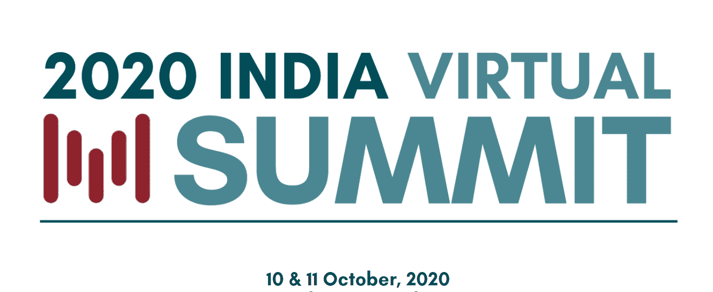
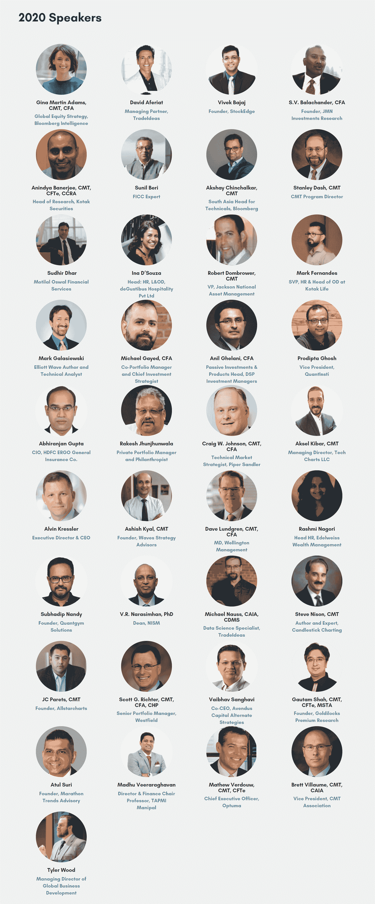

# 2020 年印度地区峰会| CMT 协会

> 原文：<https://blog.quantinsti.com/2020-india-regional-summit-cmtassociation-oct/>

* * *

<figure class="kg-card kg-image-card"></figure>

* * *

### ****10&2020 年 10 月 11 日**T3】**

****虚拟会议记录截止到 2020 年 11 月 16 日****
****通过 CMT 会议数字活动指南****

* * *

[**查看会话录音**](https://cmtassociation.org/events/2020-india-regional-summit/?source=QuantInsti)

* * *

## 回放:不可思议的航行

没能参加 2020 年印度虚拟峰会？您仍然可以观看本次研讨会的录像，包括我们所有的演讲者，包括 CMT CFA 的阿图尔·苏里和大卫·伦德格伦；Rakesh Jhunjhunwala 和 CMT 的史蒂夫·尼森。

这些录音将在 11 月 16 日日之前提供，并将在我们的数字活动指南平台上发布，让您可以与其他与会者交流。一旦您购买了重播包，我们将向您发送电子邮件，说明如何访问该平台。

我们认为 2008 年的危机是有史以来最严重的事件——直到我们来到地球静止不动的时候。

在这种新环境下，技术分析给了我们市场风险管理工具，保护我们自己不被掉刀。无论你是初学者还是老手；无论你是古典技术人员，还是现代交易系统架构师；无论你是从短期还是长期来看，每个人都应该学习如何管理未知的未知事物。加入我们的 CMT 印度虚拟峰会寻找答案。

* * *

## **扬声器**

<figure class="kg-card kg-image-card kg-width-full"></figure>

* * *

## 登记

****印度峰会重播报名信息****

非会员重播注册查看会议录像:****40 美元****

**成员: ****免费******

**CMT 考生: ****免费**** 凭优惠码考试**

**请注意，这些录像将在 2020 年 11 月 16 日之前通过 CMT 会议数字活动指南平台提供。11 月 16 日之后，这些录像将转移到我们在 CMT 协会网站上的视频档案中，在那里它们将只对会员开放。要在 11 月 16 日之前观看录像，会员必须注册使用数字活动指南。**

**[**查看会话录音**](https://cmtassociation.org/events/2020-india-regional-summit/?source=QuantInsti)**

* * *

**QuantInsti 算法交易(EPAT)的执行课程是印度最好的算法交易课程之一。要了解更多关于 EPAT 的信息，请立即联系课程顾问。**