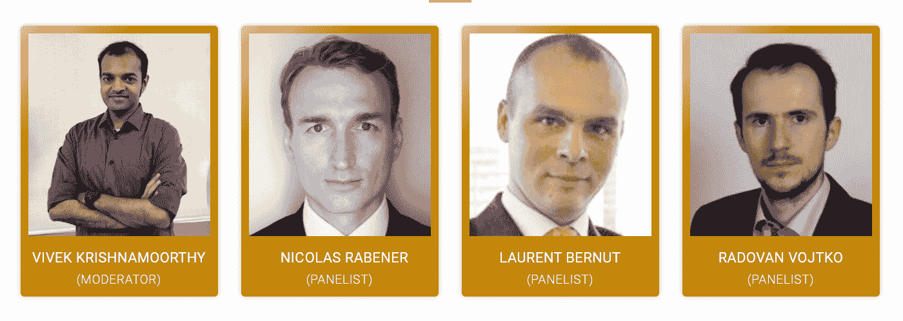

# 什么会影响量化策略？[小组讨论]

> 原文：<https://blog.quantinsti.com/quant-strategy-panel-discussion-24-september-2020/>

* * *

[https://www.youtube.com/embed/Ne_S7iDuLi0?rel=0](https://www.youtube.com/embed/Ne_S7iDuLi0?rel=0)

* * *

*本次网络研讨会已经结束。*

**2020 年 9 月 24 日星期四**

东部时间上午 8:30 | IST 时间下午 6:00 |新加坡时间晚上 8:30

* * *

## **10 岁生日**

正如人们所说，知识是人生最大的礼物。在庆祝我们成立 10 周年之际，我们策划了这个系列来感谢我们的社区。我们从心底里感谢你，感谢你多年来在我们的旅途中给予我们的爱和支持！

* * *

## **关于会议**

与老派交易者/投资者的自由选择相比，量化交易表面上是基于更客观的标准。它们在系统上比传统的更好吗？我们如何评估何时部署一个策略，何时该放弃它？本次活动中，我们的小组成员将详细讨论其中的一些问题，并为评估量化策略的有效性提供有价值的见解。

* * *

## **面板**

<figure class="kg-card kg-image-card kg-width-full"></figure>

### Vivek Krishnamoorthy

**(内容负责人&QuantInsti 研究)**

Vivek 领导 QuantInsti 的内容和研究部门。他曾在新加坡和印度的 ICICI 银行担任企业和机构银行信贷分析师。Vivek 还在加拿大麦克马斯特大学为本科生和研究生教授经济学和金融学课程。

他曾在瑞士瑞信银行 Larsen & Toubro 公司和其他机构为中高层管理人员举办过多次公司金融、金融建模和投资组合理论方面的培训。Vivek 在金融和学术界的丰富专业经验使他成为市场微观结构、量化金融编程和量化交易中使用的统计技术的熟练讲师。

### 尼古拉斯·拉伯纳

**(创始人& CEO FactorResearch)**

尼古拉斯·拉伯纳是 FactorResearch 的创始人兼首席执行官。此前，他创建了屡获殊荣的量化对冲基金 Jackdaw Capital，并在伦敦和纽约的 GIC(新加坡政府投资公司)和花旗集团工作。

Nicolas 拥有 HHL 莱比锡管理研究生院的金融硕士学位，是 CAIA 特许持有人，喜欢耐力运动(100 公里超级马拉松)。

### **Laurent Bernut**

**(创始人& CEO ASC)**

Laurent Bernut 曾在 Fidelity Investments、Rockhampton 和 Ward Ferry 的另类投资领域工作。在富达，他作为专职卖空者的使命是跑输现代史上持续时间最长的熊市:日本股市。

劳伦特在另类空间创造阿尔法的研究是建立在他对普遍测试的系统交易过程的专业知识之上的。

### **Radovan 的贴身男仆**

**(量子百科首席执行官)**

拉多万·沃伊特科是 Quantpedia 的首席执行官兼研究主管。他是前量化投资组合经理，在五年多的时间里管理了数只量化基金的 3 亿多欧元。这些基金专注于多资产管理期货和趋势跟踪策略、市场时机和波动性交易。

* * *