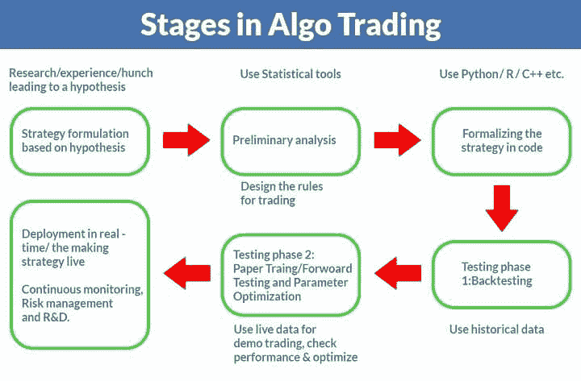

# 零售算法交易:介绍和零售交易完全指南

> 原文：<https://blog.quantinsti.com/algorithmic-trading-retail-traders/>

由[查尼卡·塔卡](https://www.linkedin.com/in/chainika-bahl-thakar-b32971155/) & [苏姗娜·拉帕尔基](https://twitter.com/ssushh_79?lang=en)

作为一个散户交易者，要深入了解算法交易，这本全面的指南一定能很好地服务于你的目的。你将能够找到算法交易的基本概念和高级概念。

接下来，本文将介绍:

*   [什么是算法交易？](#what-is-algorithmic-trading)
*   [散户为什么要做算法交易？](#why-should retail-traders-do-algorithmic-trading)
*   [散户如何开始算法交易？](#how-can-retail-traders-start-algorithmic-trading)
*   [零售算法交易规则](#regulations-for-retail-algorithmic-trading)
*   [设置零售算法交易台的要求](#requirements-for-setting-up-a-retail-algorithmic-trading-desk)
*   [零售算法交易的经纪人](#brokers-for-retail-algorithmic-trading)
*   [学习零售算法交易的课程](#courses-to-learn-retail-algorithmic-trading)

* * *

## 什么是算法交易？

简而言之，算法交易意味着使用算法形式的一组定义好的指令来产生交易信号和下单。

每个[算法](https://quantra.quantinsti.com/glossary/Algorithm)可以被假设为可以访问工具的实时和历史价格，在基于价格执行计算之后，可以买卖这些工具。该算法甚至可以将订单分成小块，在不同的时间执行，以获得尽可能好的价格。

*据[经济时报](https://economictimes.indiatimes.com/markets/stocks/news/will-the-rapid-rise-in-algo-trading-leave-traditional-traders-behind/articleshow/70616353.cms?from=mdr)报道，报告显示，全球算法交易市场规模预计将从 2019 年的 111 亿美元增长到 2024 年的 188 亿美元，复合年增长率(CAGR)为 11.1%。*

还有人提到，算法交易为[市场](https://quantra.quantinsti.com/course/getting-market-data)开创了一个新时代，其好处尚未完全实现。适应这种新的交易手段，才能保证更好的效果。Algo 交易现在是在未来金融市场生存的“先决条件”,因为交易的未来在于自动化。

与人工交易相比，算法交易有几个优势。快速的交易执行，准确性，交易时抛弃“情绪”的能力，以及 100%遵守已决定的算法交易策略是一些优势。

*那么，散户应该进入算法交易吗？*

绝对的！让我们来看看算法交易对散户来说是什么情况。

* * *

## 散户为什么要做算法交易？

长期以来，散户交易者一直没有算法交易。但是，现在，散户交易者对算法交易表现出兴趣，因为像 TD Ameritrade T1 这样的公司或经纪人正在支持散户算法交易者。

最重要的是，散户交易者必须明白，要进入算法交易世界，他们需要对投资和算法交易有很好的了解。

虽然，不参与算法交易可能会导致对散户的冲击，因为，在市场上，算法交易员可能会比人工交易员占上风。

算法交易也给金融市场的散户交易者带来了一些好处。众所周知:

*   提高执行速度
*   训练你的交易决策
*   扩大你的市场覆盖面
*   帮助交易系统化
*   帮助消除持续的市场监控
*   做实时定量分析

### 提高执行速度

主要原因是，如果你的交易策略对你有利可图，你需要提高执行速度，让有利可图的交易快速发生。

在交易中，只有当你的盈利弥补了你的亏损，你才能盈利。这也足以说明你的努力和成本。算法交易也是一种方法。

### 训练你的交易决策

另一个原因是，传统的散户交易者一直根据市场的“感觉”凭直觉交易。这没什么不好，尤其是如果你是一个经验丰富的玩家，有很多市场洞察力可以派上用场。

然而，直觉往往被证明是错误的，大多是在涉及贪婪和恐惧的时候。当市场下跌时，许多业余交易者会迅速卖出，因为他们害怕进一步崩盘。算法交易遵循预先决定的进出规则，防止这种情绪交易，从而避免可避免的损失。

### 扩大你的市场覆盖面

量化交易越来越受欢迎的一个主要原因是它允许交易者建立量化策略。此外，它使用建模技术来管理风险。

这进一步使他们能够交易期权和衍生品等工具，否则这些工具对散户投资者来说波动太大。

### 帮助交易系统化

利用算法交易满足预设条件，如时间、价格、数量和一些其他市场条件，已知使交易系统化。系统交易对股票价格做出更准确的预测，从而使交易更有利。

### 帮助消除持续的市场监控

算法可以根据市场走势进行监控、决策和执行交易。因此，不需要在交易时间持续手动监控市场。

### 做实时定量分析

算法可以在过去的数据上运行，以帮助交易者分析策略在利润和损失方面的表现，以及一些流行的表现统计数据，如夏普比率，阿尔法，贝塔等。

回测和量化策略的风险回报的能力有助于交易者在真实市场中运行策略之前，在模拟环境中从自己的错误中学习。

在我们继续之前，不要忘记阅读[为什么你应该学习算法交易](/why-you-should-be-doing-algorithmic-trading/)。

* * *

## 散户如何开始算法交易？

对于开始算法交易，你必须对某些事情有详细的了解。为此，您必须在以下方面投入时间和精力:

*   知识
*   战略
*   工作流程

### 知识

在你迈出这个特定领域的第一步之前，获取这个世界上任何事物的知识都是必须的。一旦你知道了算法交易的要点，你将能够采取最好的下一步。要获得您需要的知识:

*   培训，你可以作为实习生或实习生加入一个组织，以便熟悉工作流程和道德规范。
*   你可以选择在线课程。Quantra 为所有级别(初级、中级和专家)提供许多这样的课程。
*   书籍起着重要的作用，因为它们是你开始算法交易的最佳指南。

从[算法交易](https://quantra.quantinsti.com/course/getting-started-with-algorithmic-trading)开始，你必须了解:

*   交易工具的类型(股票、期权、货币等。),
*   策略类型(趋势跟踪、均值反转等。),
*   [套利](https://quantra.quantinsti.com/course/statistical-arbitrage-trading)机会，
*   [期权](/basics-options-trading/)定价模型，以及
*   [风险管理](/trading-risk-management/)

### 战略

算法交易策略是进行最有利可图的算法交易的几种方法。最受欢迎的策略是:

*   [做市策略](/market-making/)
*   [套利策略](/statistical-arbitrage/)
*   统计策略
*   [动量策略](/momentum-trading-strategies/)
*   [基于情绪的交易策略](/sentiment-trading-indicators-1/)
*   [机器学习交易策略](/tag/machine-learning/)

### 工作流程

这张图片展示了算法交易的各个阶段或工作流程。你要联系的经纪人可以指导你这些步骤。每个经纪人都有不同的步骤，因此，您可能会发现略有不同，但目标是相同的。

<figure class="kg-card kg-image-card kg-width-full"></figure>

* * *

建议阅读:

*   [以算法交易为职业](/making-career-algorithmic-trading/)
*   [开始算法交易前要知道的 5 件事](/5-things-know-starting-algorithmic-trading/)
*   [学习算法交易](/learn-algorithmic-trading/)

* * *

## 零售算法交易规则

从交易所的角度来看，如果经纪人为其客户提供一种算法，创建用于自动化交易的 API，那么它就被称为算法交易。这些算法需要批准，通常由提供它们的经纪人管理。

### [印度的算法交易法规](/algorithmic-trading-india/)

最近印度很多经纪人或者第三方提供一个 API。该 API 与基于网络的经纪人交易平台交互，例如用于交互经纪人的[TWS](http://interactivebrokers.github.io/tws-api/index.html)和用于 Zerodha 的[风筝。这些网络平台得到了交易所的批准，并针对基于互联网的交易制定了所有风险规则。](https://kite.trade/)

据 2017 年 11 月 29 日[经济时报](https://economictimes.indiatimes.com/markets/stocks/news/sebi-framing-algo-trading-rules-for-retail-investors/articleshow/61841163.cms)报道，2016 年 8 月，Sebi 是首批发布讨论文件，提议加强 algo 交易规则的监管机构之一。它提出了一套 7 项建议，旨在为机构投资者和散户投资者创造一个公平的竞争环境。

但由于不清楚这些规定对市场的影响，监管机构没有最终敲定这些规定。此外，监管方面正在加快步伐，在印度，监管者正在根据 Finapolis 建立一个制定指导方针的框架。

### [美国的算法交易法规](/algo-trading-regulations-us/)

据 [mondaq](https://www.mondaq.com/unitedstates/commoditiesderivativesstock-exchanges/825280/potential-regulation-of-algorithmic-trading) 报道，2016 年，SEC 批准了金融行业监管局(FINRA)提出的一项规定，要求算法交易开发者注册成为证券交易员。

2016 年，商品[期货交易](https://quantra.quantinsti.com/course/futures-trading)委员会(CFTC)提出了一项对 AT 法规的补充，该法规要求，除其他外，交易算法背后的专有源代码应向 CFTC 和司法部(DoJ)提供。

算法交易受到了各种监管机构的关注，这表明在不久的将来，新的监管规定是切实可行的。很难预测这种监管将采取的确切形式，但研究其他司法管辖区采用的提案和监管可以为我们提供有用的见解。

### [欧洲算法交易法规](/algo-trading-regulations-eu/)

在欧洲，[欧洲证券和市场管理局(ESMA)](https://en.wikipedia.org/wiki/European_Securities_and_Markets_Authority) 是一个独立的欧盟机构，通过加强对投资者的保护和促进稳定有序的金融市场来维护欧盟金融体系的稳定。

散户投资者接受监管的步骤很简单。您只需:

*   在经纪人处开立交易账户
*   注册一个开发者账户(这对于一些经纪人来说是可选的)
*   开始使用经纪人的 API 来建立一个自动交易系统

一旦你选择了一个代理的 API，你会发现这些步骤是可以遵循的。一旦你开始使用经纪人的 API，你将受到经纪人的监管措施的保护。

让我们向前看，找出建立交易台所需的东西。

* * *

## 设置零售算法交易台的要求

我们会用一些提示来涵盖“要求”部分，这些提示会帮助你理解算法交易中非常重要的东西。没有这些技能和设施，你的算法交易可能仍然不完整。

我们将分点讨论这些参数，然后详细讨论，以帮助您利用资源来涵盖以下每个要点。

开始零售算法交易的要求如下:

*   零售算法交易的交易策略
*   零售算法交易的风险管理
*   零售算法交易的编程技巧(可选)
*   零售算法交易的交易软件(可选)
*   零售算法交易的数据
*   零售算法交易的资本要求

现在，让我们详细考虑一下这些参数。

### 零售算法交易的交易策略

这是算法交易最重要的部分。确保您的战略具备以下要素:

*   明确定义的交易进场、出场、止损和获利的规则
*   投资组合管理意味着决定交易哪些资产的策略
*   风险管理是战略中最重要的方面，因为有人曾经说过“赚钱有两种方式，一是不要失去它&，二是不要失去它”。
*   应对[意外事件](/market-events-performance-algorithms/)的准备——有时你的算法不知道如何应对市场条件，这种情况很少见，但它们可能会毁掉你的整个投资组合，所以确保你知道如何将这一点纳入你的算法。

除了这个标准清单，为了成为一个成功的算法交易者，你还需要确定很多小事情。这些东西有些和编程、交换、计时等等有关。直到你真正开始交易，你才会注意到它们。

爬上这个陡峭的学习阶梯最简单、最快的方法就是注册在线课程。

### 零售算法交易的编程技巧(可选)

你不必成为一个编程专家来编写你的算法交易策略，但是，基本的理解和预先的接触是必须的。有许多语言可以用来编码你的交易策略。

R & Python 在 algo 交易者中最受欢迎，因为它们有庞大的库，并支持各种交易软件。虽然，你接触的经纪人可能有这样的功能来提供交易的便利，因为他们可能不需要你编写太多的程序或代码。

许多人已经克服了对编程的恐惧，并在今天的领域中相当成功。

### 零售算法交易的交易软件(可选)

对于好的算法交易，需要有交易软件，但这不是强制性的，因为你的经纪人可能会给你提供一个。

作为一个散户，你可以购买现成的交易软件，以防你想在执行交易策略之前用它来完成一些任务，比如回溯测试。

以下是可供您选择的交易软件:

*   [贸易站](https://www.tradestation.com/)
*   [MetaStock](https://www.metastock.com/)
*   [量子连接](https://www.quantconnect.com/)
*   [蓝移](https://blueshift.quantinsti.com/)

这些平台提供的功能包括实时扫描、技术指标数量、专家顾问、回溯测试、公司基本面、新闻服务、自动下单、预测、二级数据等。

重要的是，交易者应该根据自己的交易风格、特点和价格来选择平台。

### 零售算法交易的风险管理

当谈到算法交易时，风险的数量就会爆炸，因为涉及的东西太多了。以下是按类别划分的一些风险:

*   接近
*   一致性
*   质量
*   算法
*   技术
*   可量测性

你必须确保所有这些风险都由你选择的经纪人积极管理。现在，我不会详细讨论每一个，因为我们已经详细介绍了这些风险和减轻风险的方法[这里](https://www1.nseindia.com/membership/content/user_id_ctcl_id.htm)。

### 零售算法交易的数据

你将需要历史数据来测试你的策略。你可以在谷歌或雅虎财经上免费获得几乎所有交易资产的历史数据。

请注意，这些数据可以在更大的时间尺度(日、月、年等)上获得。).虽然这对[低频交易策略](/momentum-based-strategies-for-low-and-high-frequency-trading-excel-model/)来说没问题。

但是对于 HFT 或[高频交易](/high-frequency-trading/)策略，你需要更小时间尺度(微秒、毫秒等)的数据。)，这些数据可以从全球数据馈送、托马斯路透等网站获取。然而，这些数据是额外收费的，所以你必须根据[历史数据](https://quantpedia.com/Links/HistoricalData)的来源付费。

二、直播数据对于直播交易，你可以直接从交易所获取，也可以从券商处获取。对于 HFT 算法交易，建议尽早从交易所获得分笔成交点数据，对于低频交易，你应该可以接受经纪人提供的数据，平均延迟约一秒钟。

### 零售算法交易的资本要求

作为零售商，你需要资金来建立交易平台。某些东西，如计算机硬件、交易软件、从网站收集的数据等。肯定会计入你的开支。

展望未来，让我们来发现算法交易的经纪人的广阔世界。

* * *

## 零售算法交易经纪人

在选择算法交易经纪人时，你可以考虑最可靠的经纪人。我们为你准备了一份相同背景的清单。

首先，我们覆盖了印度算法交易的经纪人，然后我们也为你提供了来自美国、英国、欧盟、新加坡和加拿大的零售算法交易的经纪人名单。

### 印度的算法交易经纪人

*   [互动经纪人](https://www.interactivebrokers.co.in/en/index.php?f=40022)
*   [Zerodha 风筝](https://kite.trade/)
*   [Upstox](https://upstox.github.io/upstox-python/)
*   [5 派萨](https://www.5paisa.com/developerapi)

### 美国的算法交易经纪人

*   [互动经纪人](https://www.interactivebrokers.com/en/index.php?f=5041)
*   [TD 美国贸易公司](https://pypi.org/project/td-ameritrade-python-api/)

### 英国的算法交易经纪人

*   [IG 组](https://ig-markets-api-python-library.readthedocs.io/en/latest/#:~:text=IG%20Markets%20API%20%2D%20Python%20Library,Commodities%2C%20Indices%20and%20much%20more.)
*   [福汇](https://github.com/fxcm/RestAPI)
*   [外汇](https://www.forex.com/en-uk/trading-platforms/api-trading/)
*   [萨克斯](https://pypi.org/project/saxo-openapi/)
*   [Oanda](https://developer.oanda.com/rest-live-v20/introduction/)
*   [互动经纪人](https://www.interactivebrokers.co.in/en/index.php?f=40022)

### 欧盟的算法交易经纪人

*   德吉罗
*   [eToro](https://api-portal.etoro.com/docs/services/578611076361c80d884cfcf1/operations/578624c06361c80d884cfcf5)
*   [XTB](https://pypi.org/project/XTBApi/)
*   [盛宝集团](https://developer.saxobank.com/sim/login/?requestId=ODUxZWJiMWQ5ODg0NDQxNjlkYTIyMDg0NzlkYjkwODAxMTQzMjc%3d&mode=oauth)
*   [Oanda](https://developer.oanda.com/rest-live-v20/introduction/)
*   [福汇](https://www.fxcm.com/markets/)
*   [互动经纪人](https://www.interactivebrokers.co.in/en/index.php?f=40022)

### 加拿大的算法交易经纪人

*   [加拿大皇家银行直接投资](https://github.com/cree-py)
*   [q 贸易投资者](https://pypi.org/project/qtrade/)
*   斯科舍伊特拉德

希望上面的列表能帮助你找到最适合你开始算法交易的算法交易经纪人。

接下来，让我们讨论一下[量化交易课程](https://quantra.quantinsti.com/course/quantitative-trading-strategies-models)，它将帮助你获得关于成功交易的知识。

* * *

## 学习算法交易的课程

这是真的，在你开始自己的 algo 交易台之前需要做很多工作，但仅仅因为它的优点和执行过程中的安心，这是值得的。

此 [algo 交易课程](https://www.quantinsti.com/epat)是一个全面的认证课程，由领先的行业专家以在线教室的形式教授，并配有专门的支持经理，以加快查询解决。

另一方面， [Quantra](https://quantra.quantinsti.com/course) 的在线自定进度互动课程提供算法交易各个方面的培训。

为了学习如何使用[互动经纪人](https://www.interactivebrokers.com/en/home.php)平台来自动化和执行你的交易，你可以去 [Ibridgepy](https://quantra.quantinsti.com/course/Automated-Trading-IBridgePY-Interactive-Brokers-Platform) 课程。另外，你可以在[人人算法交易](https://quantra.quantinsti.com/learning-track/algorithmic-trading-for-everyone)课程中学习算法交易策略。

* * *

## 结论

本文涵盖了零售算法交易的重要方面，并讨论了算法交易的内容、原因和方式。如果你想建立算法交易的技能，在这个领域的全面知识是必须的。

如果你想从事算法交易，那么我们在 EPAT 开设的综合算法交易课程正是你想要的，该课程由行业专家、交易从业者和中坚分子教授，如欧内斯特·陈博士、尤安·辛克莱博士等。立即注册！

* * *

 <small>*更新:我们注意到一些用户在从雅虎和谷歌金融平台下载市场数据时面临挑战。如果您正在寻找市场数据的替代来源，您可以使用 Quandl。

免责声明:本文中提供的所有数据和信息仅供参考。QuantInsti 对本文中任何信息的准确性、完整性、现时性、适用性或有效性不做任何陈述，也不对这些信息中的任何错误、遗漏或延迟或因其显示或使用而导致的任何损失、伤害或损害负责。所有信息均按原样提供。*</small>