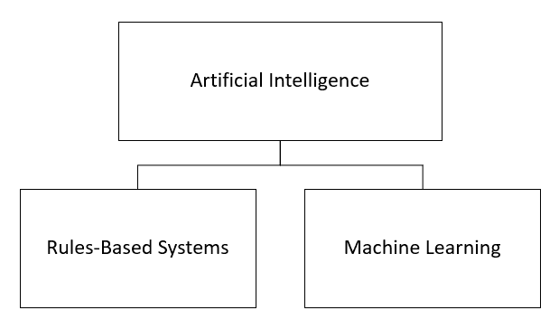
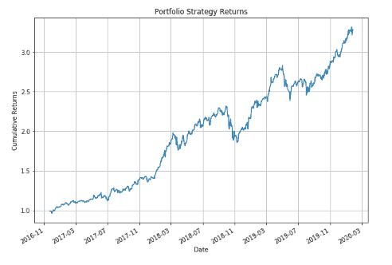

# 交易中的人工智能和机器学习

> 原文：<https://blog.quantinsti.com/artificial-intelligence-machine-learning-trading/>

由[查尼卡·塔卡](https://www.linkedin.com/in/chainika-bahl-thakar-b32971155/)

人工智能是一个当代概念，我们都听说过，甚至可能知道它。因为这是你选择通读的文章，你肯定会从我们前面提到的人工智能和人工智能的交易方面受益。在今天，我们必须知道他们是如何推动有利可图的交易的。在 AI & ML 的帮助下找到所有关于交易的信息。因此，本文的内容涵盖:

*   [人工智能是什么，在交易中是如何使用的？](#Artificial-Intelligence-Trading)
*   [人工智能的种类](#Artificial-Intelligence-Types)
*   [人工智能和机器学习对交易的影响](#Impact-Trading)
*   [AI 和 ML 在交易中的实现和应用](#Application-Deep-Learning)

## 人工智能是什么，在交易中是如何使用的？

基本上，人工智能(AI)是制造智能机器的科学和工程。具体来说，它考虑到智能计算机程序来计算、推理、从经验中学习、适应新情况和解决复杂问题。人工智能(AI)主要基于计算机科学、心理学、语言学、数学、生物学和工程学等学科。

由于人工智能正在极大地塑造股票交易的未来，它将在未来的时间里继续使交易有利可图。例如，机器人顾问可以在尽可能短的时间内自动分析数百万个数据点，并在此基础上预测价格。此外，它在最有利可图的时候执行交易，因为它有能力在[股票市场](https://quantra.quantinsti.com/course/getting-market-data)每秒进行几笔交易。因此，为了准确分析、预测、及时执行交易以及降低风险，人工智能发挥着重要的作用。

现在，让我们看看人工智能在交易中的具体应用:

*   图案形成
*   预测交易(基于情绪)
*   提高交易速度

**图案形成**

人工智能是一项强大的技术，有助于在几秒钟内分析大量数据点。通过这种方式，它可以快速识别那些历史交易模式，并为智能交易进行复制。然而，人类无法以这样的速度识别和构建模式。

**预测交易(基于情绪)**

基于对新闻标题、社交媒体评论和其他平台的分析，人工智能能够在[情绪分析的帮助下预测其他交易者的举动以及股票的走向。](https://quantra.quantinsti.com/glossary/Sentiment-Analysis)

**提高交易速度**

由于这是一个以技术为导向的快节奏运作时代，人工智能有助于促进每一毫秒的交易。此外，人工智能导致了这种不需要人工干预的快节奏自动化交易。

太好了！现在让我们转到人工智能的类型，看看人工智能涵盖的主要类别。

## 人工智能的种类

<figure class="kg-card kg-image-card"></figure>

现在，你必须知道基于规则的系统和机器学习都有助于推断输入数据。这两种类型对特定情况都很重要。现在让我们看看这些类型之间有什么不同。

### 基于规则的系统

基于规则的系统被认为是简单的人工智能。他们只需要输入符合这个或那个的语句，就可以使系统得出结论。因此，它由一些 IF-THEN 规则和一组事实组成。它的作用基于两个主要原则，即:

*   一组事实
*   一套规则

一组事实

这些是数据所依赖的一组一般事实。例如，一本书的价格是 100 印度卢比或超过 100 印度卢比。

**一套规则**

这些是事实的引擎，因为它们决定了两种事实的结果。例如，如果这本书的价格是 10 美元，那么你买它。

既然你对这两个概念都很清楚，那么让我们来看另一个例子。人工智能被输入基于规则的信息，以推荐每天穿哪种颜色的鞋。在这种情况下，会有事实支持同样的观点。事实可能会因为几个原因而有所不同，例如:

*   下雨了
*   这是一个运动日
*   这是一个庆祝的日子

基于以上事实，系统将相应地结束每一天。

这里，同样重要的是要注意，在特定领域的一组人类专家的帮助下，决策被输入到系统中。

此外，规则很容易编写，因为您只需要在决策过程中出现您之前没有考虑到的任何其他事实时，向系统添加一条规则。这里要注意的另一个要点是，规则是确定性的，因此，没有将规则适当地放置会导致错误的结果。此外，现实生活场景中的变化可能会比系统中的更新更快。这也会使结果出错。

想了解更多，可以参考研究论文[这里](https://link.springer.com/chapter/10.1007/978-3-642-21004-4_7)。

### 机器学习

机器学习是另一种方法，但它是一种改进的方法，有助于消除基于规则的系统中的问题。在这种情况下，机器得到的是关于每个数据点结果的信息，而不是决策过程。

**例如**，如果 1000 名申请者中有一部分人的奖学金申请被拒绝，那么系统将只提供结果，而不是整个过程。

这样，与基于规则的系统相比，自动化系统学会做出更准确的决策。

因此，它在历史结果的基础上运作，并预测未来的结果。此外，除了历史结果，它还考虑了影响决策的其他参数或因素。

根据**的另一个例子**，这里的输出可以简单到‘我今天是否应该带伞？’或者像‘预测股票价格’这样复杂的事情。因此，需要多少输入变量或特征就有多少。尽管输入变量和输出在很大程度上是真实世界的情况，但仍然很难解释在这两者之间起作用的几个因素。

现在让我们来看看机器学习过程可能不起作用的地方。

在这里，**一个例子**可以帮助决定一个场合的服装。在这种情况下，影响决策的因素非常多，其中之一就是“特定日期的温度”。该系统将检查一年前同一天的温度，以此作为其结果的基础。

但是，这里的因素可能不一致。这是因为在今年的某一天，气温可能或多或少。因此，根据当前的温度来决定，系统将不得不依赖于那天的事实。

值得一提的是，机器学习也有一种类似于基于规则的系统的[‘决策树’](https://en.wikipedia.org/wiki/Decision_tree)方法。在这种情况下，您需要在开始时向系统提供一条语句，然后继续执行随后做出的决策。但是，决策树和基于规则的系统是有区别的，基于规则的系统是有信息反馈的。基于规则的系统来自人类专家的输入，而[决策树](https://quantra.quantinsti.com/course/decision-trees-analysis-trading-ernest-chan)中的决策是由机器学习过程做出的。

现在，既然你清楚人工智能的类型，让我们继续前进，找出人工智能和[机器学习对交易](https://quantra.quantinsti.com/course/introduction-to-machine-learning-for-trading)的影响。

## 人工智能和机器学习对交易的影响

事实上，人工智能和机器学习有能力解决交易领域的大规模问题。这些情况或问题通常与优化、分析和预测有关。凭借这种力量，人工智能和人工智能在以下方面影响了交易:

**股票价格预测因子(因素)的识别与分析**

人工智能和人工智能使用神经网络和几种学习方法来识别和分析导致特定股票价格的因素。这些因素也被称为预测因素或特征。基于这些因素，AI 和 ML 预测未来的股票价格。还有，AI 的这个应用是机器学习的一个例子。

**基于事实的决策**

人工智能是一个自动化系统，它做出基于事实的决定，而不像人类那样，人类的决定是由恐惧、贪婪、希望和议程等情绪驱动的。有了这些基于事实的决策，交易对市场参与者来说变得更加有利可图。

**交易领域招聘模式的变化**

随着基于事实的交易的出现，人工智能也带来了人类帮助管理交易的需求。由于基于人工智能和人工智能的交易需要精通数学、计算机编程等的个人，现在交易领域正在招募各种相关领域的员工。

**聊天机器人的使用**

人工智能和人工智能通过一些有利的内含物，例如聊天机器人，为交易者的日常生活带来了显著的附加值。聊天机器人改善了交易的方式，因为交易者不仅可以更容易地与聊天机器人交流，还可以访问报表的历史记录。此外，聊天机器人可以自我学习，不需要任何人工干预。

这里，我们举个例子。假设你，作为一个交易者，向机器人发送一条消息来了解交易报价。在这种情况下，机器人会更新你的当前价格，还会确认你正在看的交易规模。现在，机器人会为你提供潜在的报价，也会考虑其他交易者的反应。一旦收集了所有报价，它将为您提供最好的报价。

**模拟风险场景**

由于人工智能有助于预测交易领域的股票价格，它是迄今为止股票市场的最佳工具。有了准确的风险预测，交易者可以做出明智的决定。人工智能有能力收集大量数据，并以非凡的速度和准确性进行分析。有了这种能力，it 就有可能最大化潜在收益并模拟风险情景。因此，AI 和 ML 已经将交易业务转向对交易者更有利可图的方向。

正如你所看到的，人工智能和人工智能以前所未有的盈利能力冲击了市场文化。

现在，让我们向前看，看看人工智能和人工智能在交易中的实现和应用。

## 人工智能和人工智能在交易中的实现和应用

人工智能和机器学习在交易领域发挥着重要作用，因为新技术使交易变得更快更简单。

机器学习是人工智能的一个子领域，它为交易领域提供了一项非凡的创新。

机器学习在交易领域有几种实现方式。我们列出了以下几个候选名单:

*   基于历史数据的股票价格预测
*   加速寻找有效的算法交易策略
*   要监控的市场数量

### 基于历史数据的股票价格预测

机器学习意味着向系统提供历史数据，以便系统在未来根据这些数据做出决策。因此，为了预测被称为目标变量的股票价格，机器学习使用被称为预测变量的历史数据。为此，ML 中的算法学习应用预测变量来预测目标变量。

### 加速寻找有效的算法交易策略

机器学习也被用来加速寻找有效的算法交易策略。因为它提供了一种自动化的方法，所以比手工过程好得多。这些算法交易策略通过优化利润和模拟风险来帮助交易者。无论如何，如果你有自动化来支持你完成任何任务，这是一个竞争优势。例如，有几种策略利用机器学习来优化算法，如线性[回归](https://quantra.quantinsti.com/course/trading-with-machine-learning-regression)，深度学习，[神经网络](https://quantra.quantinsti.com/course/neural-networks-deep-learning-trading-ernest-chan)等等。

### 要监控的市场数量

机器学习也有助于增加个人监控和响应的市场数量。市场数量越多，交易者选择利润最高的市场的机会就越大。因此，您可以通过实现机器学习来增加机会。

有几家知名公司，如 Renaissance Technologies 和 Citadel，正在使用机器学习进行投资决策。

作为机器学习的一个应用，XGBoost 就是最好的例子。XGBoost 模型实际上是[梯度模型](https://en.wikipedia.org/wiki/Gradient_boosting)的助推器。因此，它在机器学习的帮助下增强了相同的性能。

让我们举个例子，建立一个由五家公司组成的投资组合。现在，在这个投资组合中，我们将应用 XGBoost 模型来创建一个交易策略。这五家公司是苹果、亚马逊、网飞、英伟达和微软。这是我们得到的。

<figure class="kg-card kg-image-card kg-width-full"></figure>

太好了！我们已经到了这篇文章的结尾，并且已经涵盖了人工智能和人工智能在交易中的很多重要方面。

## 结论

得出结论，这篇文章包括从交易角度对人工智能和机器学习的详尽理解。首先，我们了解了人工智能的概念、类型以及人工智能和人工智能对交易的影响。我们还讨论了它的实现和应用方面。因此，在这篇文章结束时，我们对这个话题及其在交易中的应用有了一个相当好的理解。

<small>免责声明:本文中提供的所有数据和信息仅供参考。QuantInsti 对本文中任何信息的准确性、完整性、现时性、适用性或有效性不做任何陈述，也不对这些信息中的任何错误、遗漏或延迟或因其显示或使用而导致的任何损失、伤害或损害承担任何责任。所有信息均按原样提供。</small>