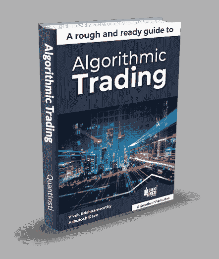
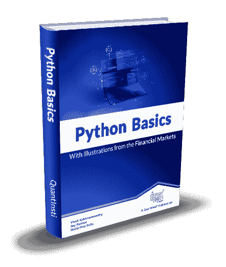
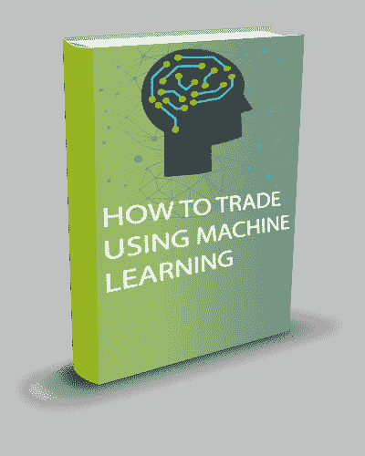

# 学习算法交易的免费资源

> 原文：<https://blog.quantinsti.com/free-resources-list-compilation-learn-algorithmic-trading/>

由[维拉伊·巴加](https://www.linkedin.com/in/virajbhagat/)

这是一个非常全面和强大的资源汇编列表，在算法交易和量化交易领域，人们可能需要或需要这些资源。

**我们在此讨论以下主题:**

*   [算法交易](#algorithmic-trading)*   [用于交易的 Python](#python-trading)*   [机器学习](#ml-trading)*   [期权交易](#options-trading)*   [数据科学](#data--science-trading)*   [Quants](#quants-trading)*   [外汇](#forex-trading)*   [自动交易](#automated-trading)*   [附加资源](#additional-resources)

* * *

在过去的几十年里，交易行业和几乎所有其他行业一样，经历了巨大的技术变革。现在进入市场的人比以往任何时候都多。然而，在金融领域持续取得成功是另一回事。

随着量化交易的出现，无论是新手还是经验丰富的交易者，无论是机构还是散户，都必须对现代金融市场有一个广泛的了解。为了做到这一点，使用现代工具并在我们的交易风格中加入量化因素是必不可少的。

这里提到的所有资源都是完全免费的！

*   免费电子书
*   免费教程
*   网络研讨会记录
*   免费 Python 教程

还有更多...

我们把知识和工具带给任何想了解算法和量化交易行业并成为其中一员的人。这次是以这篇文章的形式。

* * *

## **算法交易**

* * *

### **算法交易书-一个粗略的现成指南|免费书籍**

<figure class="kg-card kg-image-card"></figure>

这本书介绍了算法交易的原理、实践和组成部分。它还讨论了成为这个行业的一部分的职业道路

我们希望这本书将作为这类好奇的读者的入门指南，并激励他们向它迈出第一步。

[拿过来！](https://www.quantinsti.com/algo-trading-ebook)

* * *

### **金融市场介绍|免费博客**

*   什么是市场？
*   我如何进入市场？
*   什么在交易所交易？
*   一个人如何跟踪市场？
*   有哪些不同类型的市场？
*   参与者是谁？
*   谁监管市场？
*   市场参与者进行哪些类型的分析？
*   什么是策略回溯测试？
*   有哪些不同的企业行为及其对价格的影响？
*   常用术语

[阅读此处](/financial-markets-introduction/)

* * *

### **交易介绍|免费博客**

*   介绍
*   新量化交易者的基本能力
*   宏观经济学
*   交易理论
*   观察
*   编码的最优化
*   机器学习
*   Python/R/C++

[阅读此处](/introduction-trading/)

* * *

### **算法交易|免费博客**

*   算法交易是什么，为什么？
*   从人工交易到算法交易的转变
*   算法交易是什么时候开始的？
*   交易频率:HFT，MFT，LFT
*   算法交易策略
*   算法交易工资
*   印度有什么规章制度？
*   如何学习算法交易
*   算法交易的工作流程
*   如何建立自己的算法交易业务？

[阅读此处](/algorithmic-trading/)

* * *

### 印度的算法交易|免费博客

*   印度的算法交易:过去、现在和未来
*   印度股票市场的监管
*   算法交易平台
*   如何开始你的算法交易之旅
*   关于算法交易未来的常见问题

[阅读此处](/algorithmic-trading-india/)

* * *

### **问我任何关于算法交易的问题**

75%的全球交易是通过算法执行的。有没有想过，如何从算法中获益？我们为您带来我们的最高老板在 AMA 的独家采访。

[https://www.youtube.com/embed/ZjZ_qWTGFB4?rel=0](https://www.youtube.com/embed/ZjZ_qWTGFB4?rel=0)

[看这里！](https://youtu.be/ZjZ_qWTGFB4)

* * *

### **算法交易的增长和未来|免费博客**

*   为什么要选择算法交易？
*   谁在赶时髦？
*   算法交易的法规
*   机器学习和算法交易
*   人工智能和算法交易
*   未来的交易系统
*   额外内容
*   下一步是什么？

[阅读此处](/growth-future-algorithmic-trading/)

* * *

### **学习算法交易:一步一步指南|免费教程**

*   以下是你应该知道的
*   算法交易、量化交易、自动交易和高频交易的区别
*   成为算法交易专家的步骤
*   关于如何学习算法交易的常见问题

[阅读此处](/learn-algorithmic-trading/)

* * *

### **以算法交易为职业|免费博客**

*   算法交易中的工作
*   Quants 的类型
*   谁雇佣定量分析师？
*   招聘人员在简历中寻找什么？
*   定量分析师的工资
*   算法交易所需的技能和成为量化分析师的资格
*   机器学习、人工智能和你的职业
*   不断学习。不断升级。
*   重要链接
*   额外内容

[阅读此处](/making-career-algorithmic-trading/)

* * *

### **散户交易者的算法交易指南|免费博客**

*   什么是算法交易？
*   散户为什么要做算法交易？
*   散户如何开始算法交易？
*   Algo 交易规则
*   建立算法交易平台的要求
*   算法交易经纪人
*   学习算法交易的课程

[阅读此处](/algorithmic-trading-retail-traders/)

* * *

### 算法交易——为什么要这么做？免费录制

如果你是金融市场的交易者或投资者，你可能会意识到在过去的 10-15 年里，投资领域发生了翻天覆地的变化。在这个网上研讨会的录像中，我们讨论了交易的演变、它的含义以及如何为交易的未来做好准备。

[https://www.youtube.com/embed/73gr7qkQedo?rel=0](https://www.youtube.com/embed/73gr7qkQedo?rel=0)

[看这里！](https://youtu.be/73gr7qkQedo)

* * *

### **开始算法交易前要知道的 5 件事|免费博客**

这篇文章特别针对那些想学习算法交易并希望建立自己的交易系统的人。作为算法交易者，你的成功不仅取决于你的量化技能，还很大程度上取决于你选择的分析、设计和执行策略的过程和工具。

[阅读此处](/5-things-know-starting-algorithmic-trading/)

* * *

### **基本算法交易书籍|免费资源**

*   市场微观结构
*   统计学和计量经济学
*   技术分析
*   股票预购买卖
*   高级统计学
*   机器学习
*   计算机编程语言

[阅读此处](/books-algorithmic-trading/)

* * *

### **交易爱好者的阅读清单|免费资源**

*   关于 Python 的最佳书籍
*   日内交易的最佳书籍
*   量化交易中的机器学习
*   新手最佳日交易书籍
*   算法交易书籍
*   算法交易的最佳非 Python 书籍

[阅读此处](/reading-list-trading-enthusiasts/)

* * *

### **深入挖掘:什么是算法交易，你如何进入算法交易？|播客**

本播客基于 Shishir Asthana (Moneycontrol)和 Nitesh Khan delwal(QuantInsti 首席执行官)之间关于算法交易的互动。它深入探讨了如何进入算法交易，你需要具备什么资格，以及你需要注意哪些熊市陷阱。

<figure class="kg-card kg-embed-card">

[https://embeds.audioboom.com/posts/7139212/embed/v4](https://embeds.audioboom.com/posts/7139212/embed/v4)

</figure>

* * *

### **EPAT |免费博客**提供的 Algo 交易职业机会

*   在交易中拥抱和融入技术
*   工作和机会来了——我不骗你！
*   如果有工作，合适的人选在哪里？
*   工作、职业和缺失因素“X”
*   让学习成为一种体验
*   赋予思想力量
*   优秀是关键
*   珍惜利益

[阅读此处](/algorithmic-trading-epat/)

* * *

### **关于算法交易你不知道的 7 件事|免费博客**

有一些信仰，不信仰和谣言阻止人们充分利用算法交易，现在是每个人都意识到它的真正潜力的时候了。因此，我们带给你 7 件事，我们相信每个人都应该知道算法交易。

[阅读此处](/7-things-you-didnt-know-about-algorithmic-trading/)

* * *

## **巨蟒进行交易**

* * *

### **Python for Trading:基础|免费课程**

时长:9 小时

你将学到什么:导入股票数据，操作和可视化

总结:学习 Python 并使用其分析金融数据集的入门课程。它包括数据结构、表达式、函数的核心主题，并解释了金融市场中使用的各种库。这是一门详细而全面的课程，旨在为 Python 打下坚实的基础。

[在这里访问它！](http://bit.ly/PythonBasicsCourse)

* * *

### **Python 基础手册|免费书籍**

<figure class="kg-card kg-image-card"></figure>

这本书对任何想要简要介绍 Python 及其数据科学堆栈的关键组件的人，以及想要快速复习使用 Python 进行数据分析的 Python 程序员都很有用。最好对编程有所了解。这里的概念和想法包括几个例子，以帮助理论联系实际。

[拿过来！](https://www.quantinsti.com/python-basics-handbook)

* * *

### **Python For Trading |免费博客**

*   为什么是 Python？
*   Python 在算法交易中的利与弊
*   Python vs. C++ vs. R
*   Python 在金融中的应用
*   Python 入门和设置
*   Python 中流行的库/包
*   在 Python 中使用数据
*   创建样本交易策略和回溯测试
*   评估样本交易策略

[阅读此处](/python-trading/)

* * *

### **Python 数据结构|免费教程**

*   索引和切片
*   排列
*   元组
*   列表
*   堆栈和队列
*   字典
*   设置

[阅读此处](/python-data-structures/)

* * *

### **Python 数据类型和变量|免费教程**

*   Python 变量
*   Python 数据类型
*   Python 数据类型转换

[阅读此处](/python-data-types-variables-tutorial/)

* * *

### **Python 函数|免费教程**

*   内置 python 函数
*   用户定义的 python 函数
*   变量命名空间和范围
*   Lambda python 函数

[阅读此处](/python-function-tutorial/)

* * *

### **Scikit |免费教程**

*   装置
*   使用数据的要求
*   虹膜数据集
*   拆分数据
*   构建分类模型

[阅读此处](/scikit-learn-tutorial/)

* * *

### **Jupyter 笔记本|免费教程**

*   介绍
*   装置
*   奔跑
*   成分
*   细胞
*   如何用 markdown 语言写作
*   魔法命令
*   如何下载和分享

[阅读此处](/jupyter-notebook-tutorial-installation-components-magic-commands/)

* * *

### **Matplotlib |免费教程**

*   如何导入
*   基本术语和概念
*   绘图数据
*   情节定制
*   多重情节

[阅读此处](/python-matplotlib-tutorial/)

* * *

### **Numpy |免费教程**

*   装置
*   NumPy 数组
*   使用内置函数创建数组
*   随意采样
*   数组属性和方法
*   数组操作
*   数组索引和迭代

[阅读此处](/python-numpy-tutorial-installation-arrays-random-sampling/)

* * *

### **熊猫|免费教程**

*   装置
*   它解决什么问题？
*   系列
*   数据帧-过滤、迭代、合并、追加、连接
*   导入数据
*   索引和子集
*   操作数据帧
*   统计探索性数据分析

[阅读此处](/python-pandas-tutorial/)

* * *

### **Plotly Python |免费教程**

*   介绍
*   如何在 Python 中安装 Plotly
*   在线与离线使用
*   呈现为 HTML 文件或在笔记本中呈现
*   OHLC 海图
*   散点图
*   使用 Plotly Express 的折线图
*   柱状图
*   等高线图
*   三维散点图

[阅读此处](/plotly-python/)

* * *

## **机器学习**

* * *

### **交易机器学习介绍|免费课程**

时长:2 小时

你将学到什么:基本术语，研究论文，工作模型

总结:一个免费的课程，让你开始使用机器学习进行交易。了解不同的机器学习算法是如何在金融市场数据上实现的。浏览并理解该领域的不同研究。获得这个利基领域的全面概述。

[在这里访问它！](https://quantra.quantinsti.com/course/introduction-to-machine-learning-for-trading)

* * *

### **如何使用机器学习进行交易|免费书籍**

<figure class="kg-card kg-image-card"></figure>

机器学习技术已经提升了金融、医学等主要领域的工作方式。一种广泛的机器学习技术涉及人工神经网络。

它们是什么，如何在金融市场中实施？这本电子书包含了关于它的所有信息，从解释人工神经网络的基础和工作到演示用 Python 实现股票价格预测的代码。

[拿过来！](https://quantra.quantinsti.com/machine-learning-for-trading-ebook)

* * *

### **机器学习基础|免费教程**

*   什么是机器学习
*   机器学习、深度学习、人工智能的区别
*   机器学习的组件
*   用于机器学习基础的 Python 库
*   流行的机器学习算法分类
*   机器学习基础知识中需要了解的常见术语
*   机器学习和深度学习的区别
*   深度神经网络的工作原理
*   机器学习的应用
*   机器学习的发展和未来

[阅读此处](/machine-learning-basics/)

* * *

### **交易中的机器学习 Q & A 陈博士|免费录音**

与欧内斯特·陈博士(QTS 资本管理有限公司的管理成员)的问答环节获得了观众的巨大反响。

陈博士是“算法期权交易”的行业专家，并在许多国际论坛上举办过研讨会和讲座。除了在 QuantInsti 任教，他的学术论文也可以在 Quantra 和主要门户网站上看到。

他将自己在统计模式识别方面的专业知识应用于多个项目，从 IBM Research 的文本检索、Morgan Stanley 的客户关系数据挖掘，到瑞士瑞信银行、Mapleridge Capital Management 和其他对冲基金的统计套利交易策略研究。

他因写了这些书而出名:量化交易；算法交易:获胜策略及其原理；机器交易:运用计算机算法征服市场。

[看这里！](https://youtu.be/m4BFOSaos7M)

[https://www.youtube.com/embed/m4BFOSaos7M?rel=0](https://www.youtube.com/embed/m4BFOSaos7M?rel=0)

在此阅读所有问答[。](/machine-learning-webinar-11-june-2019/)

* * *

### **使用 Python 中的机器学习进行交易|免费博客**

*   Python 中的机器学习如何流行起来
*   [Python 机器学习算法的先决条件](https://quantra.quantinsti.com/course/python-machine-learning)
*   获取数据并使其可用
*   创建超参数
*   将数据分为测试集和训练集
*   获取最佳参数以创建新函数
*   进行预测并检查性能
*   额外收获:与 Python 机器学习算法相关的常见问题

[阅读此处](/trading-using-machine-learning-python/)

* * *

### **免费资源学习机器学习交易|免费资源**

*   课程
*   资源
*   推荐书籍
*   机器学习的应用

[阅读此处](/free-resources-learn-machine-learning-trading/)

* * *

### **现场交易中的机器学习|免费视频播放列表**

一个简短的视频播放列表，为你提供交易中机器学习的各种主题的摘要

[https://www.youtube.com/embed/playlist?list=PLvoal9WEcFgLtHyyEHP4B0yLLHvTKYd6T](https://www.youtube.com/embed/playlist?list=PLvoal9WEcFgLtHyyEHP4B0yLLHvTKYd6T)

[看这里！](https://www.youtube.com/playlist?list=PLvoal9WEcFgLtHyyEHP4B0yLLHvTKYd6T)

* * *

### **交易中的自然语言处理(NLP)分步指南|免费教程**

*   使用 NLP 进行交易
*   新闻和 NLP
*   交易中使用 NLP 的步骤

[阅读此处](/natural-language-processing-trading/)

* * *

### **交易中的大师级自然语言处理** |特里·本茨沙维尔 **|免费录音**

特里·本茨沙维尔(本茨沙维尔科学有限责任公司的创始人和负责人)和伊山·沙阿(AVP，QuantInsti 的内容和研究)主持了这个关于交易中的自然语言处理的大师班。

在本节课中，Terry 和 Ishan 讨论了:

*   自然语言处理在金融市场中是如何应用的？
*   在 Quantra 学习门户网站上计算每日情绪得分
*   比较不同的单词嵌入方法及其优缺点
*   Quantra 学习门户如何提供独特的学习体验？

[https://www.youtube.com/embed/LBGr1lm3Jqs?rel=0](https://www.youtube.com/embed/LBGr1lm3Jqs?rel=0)

[看这里！](https://youtu.be/LBGr1lm3Jqs)

* * *

### **金融深度学习|免费教程**

*   深度学习概述
*   深度学习在金融中的应用
*   深度学习的模型
*   深度学习在金融中的应用
*   深度学习在金融领域的前景如何？

[阅读此处](/deep-learning-finance/)

* * *

### **深度学习和神经网络介绍|免费教程**

*   什么是深度学习？
*   深度学习的历史
*   深度学习和机器学习的区别
*   深度神经网络的工作原理
*   深度学习的应用

[阅读此处](/introduction-deep-learning-neural-network/)

* * *

### **人工智能和股市，这里有你没想到的！免费博客**

人工智能(或 AI)已经在发挥作用，它正在许多方面改变市场。在这篇博文中，作者分享了他对这种转变的影响的看法。

[阅读此处](/artificial-intelligence-trading-future/)

* * *

## **期权交易**

* * *

### **Python 中的期权交易策略:基础|免费课程**

时长:3 小时

你将学到什么:看涨期权、保护性看跌期权、铁鹰期权、看涨期权、看跌期权

总结:期权交易[初学者的必备课程](https://quantra.quantinsti.com/course/options-trading-strategies-python-basic)。它从你必须知道的能够交易期权的基本术语和概念开始。它涵盖了货币的概念，看跌期权平价，波动性及其类型，期权对冲，以及各种[期权交易策略](https://quantra.quantinsti.com/course/options-trading-strategies-python-intermediate)。

[在这里访问它！](https://quantra.quantinsti.com/course/options-trading-strategies-python-basic)

* * *

### **期权交易基础讲解|免费教程**

*   什么是期权交易？
*   期权交易与股票交易
*   选项术语
*   选项的类型
*   期权交易示例
*   Python 中什么是看跌期权奇偶性？
*   希腊期权
*   布莱克-斯科尔斯期权定价模型
*   开立期权交易账户
*   期权交易策略

[阅读此处](/basics-options-trading/)

* * *

### **期权交易|免费博客**

一系列关于[期权交易](https://quantra.quantinsti.com/course/options-trading-strategies-python-advanced)的教程，包括定义、期权定价模型、期权希腊人、不同的[交易策略](https://quantra.quantinsti.com/course/quantitative-trading-strategies-models)以及免费下载的代码和数据，如离差交易、指数套利等。

[阅读此处](/tag/options-trading/)

* * *

### **期权交易策略|免费博客**

1.  [对角价差](/diagonal-spreads-options-trading-strategy-python/)
2.  [日历跨页](/calendar-spread-options-trading-strategy/)
3.  [合成长放](/synthetic-long-put-strategy-python/)
4.  [长连击](/trading-options-long-combo-trading-strategy/)
5.  [熊叫梯](/bear-call-ladder-options-trading-strategy-python/)
6.  [衣领选项](/collar-options-trading-strategy-python/)
7.  [跨期权](/straddle-options-trading-strategy-python/)
8.  [翡翠蜥蜴](/jade-lizard-options-trading-strategy-python/)
9.  [铁蝴蝶](/iron-butterfly-options-trading-strategy/)
10.  [漫长的扼死](/long-strangle-option-strategy-in-python/)
11.  [铁秃鹰](/iron-condor-options-trading-strategy/)
12.  [断翅蝴蝶](/broken-wing-butterfly-options-trading-strategy-python/)

* * *

## **数据科学**

* * *

### **数据科学介绍|免费课程**

时长:3 小时

你要做的:做一个体育获胜团队预测的项目

总结:通过做一个有趣的项目来学习数据分析。预测英格兰超级联赛的获胜球队。强烈推荐给那些想要获得[数据科学](https://quantra.quantinsti.com/course/introduction-to-data-science)实用知识的人。了解所有重要步骤，如数据补救、探索性数据分析、数据建模和结果交流。

[在这里访问它！](http://bit.ly/DSCourse)

* * *

### **数据科学- 3 分钟视频|免费播放列表**

开始学习当今最受欢迎的领域和技能——数据科学——我们的 3 分钟视频将为您提供对它的概述。

[https://www.youtube.com/embed/playlist?list=PLvoal9WEcFgK_V7d0zyC4SazJ5hV2msK3](https://www.youtube.com/embed/playlist?list=PLvoal9WEcFgK_V7d0zyC4SazJ5hV2msK3)

[看这里！](https://www.youtube.com/playlist?list=PLvoal9WEcFgK_V7d0zyC4SazJ5hV2msK3)

* * *

### **数据科学入门:食品配送应用案例研究|免费博客**

这篇关于“数据科学的步骤”的博客将带领你通过一个有用的框架来理解数据科学的[过程](https://quantra.quantinsti.com/course/data-and-feature-engineering-for-trading)。通过对一个食品配送应用程序的案例研究，我们将尝试分解步骤，以帮助您了解任何数据科学项目的生命周期。

[阅读此处](/steps-data-science/)

* * *

## **Quants**

* * *

### **Quant 面试问题准备|免费课程**

时长:5 小时

你将学到什么:面试准备和简历制作

总结:本课程的主要目的是通过为您提供正确的[面试问题组合](https://quantra.quantinsti.com/course/quant-interview-questions-preparation)来练习和提高您的知识和技能，从而帮助您破解量化面试。涵盖的主题包括逻辑推理、谜题、统计学、概率、时间序列分析、投资组合管理、期权、机器学习和 Python，以及关于非技术轮次的讨论和撰写简历。

[在这里访问它！](http://bit.ly/QuantInterviewFreeCourse)

* * *

### **针对量化交易新手|免费播放列表**

免费开始你的量化和算法交易生涯！学会在现实市场中创造和实施你的策略！

[https://www.youtube.com/embed/playlist?list=PLvoal9WEcFgIJXRLQrszAnSXDdiC5Sh9W](https://www.youtube.com/embed/playlist?list=PLvoal9WEcFgIJXRLQrszAnSXDdiC5Sh9W)

[看这里！](https://www.youtube.com/playlist?list=PLvoal9WEcFgIJXRLQrszAnSXDdiC5Sh9W)

* * *

### **统计和概率分布初学者指南|免费教程**

*   历史数据分析-数据集、平均值、众数、中位数
*   概率分布-标准差、直方图、正态分布
*   相互关系

[阅读此处](/statistics-probability-distribution/)

* * *

### **量化金融入门|免费教程**

*   什么是量化金融？
*   量化金融有多重要？
*   成为量化分析师需要什么资格？
*   定量金融领域的工作

[阅读此处](/quantitative-finance/)

* * *

### **一个 Quant 挣多少工资？免费博客**

*   什么是 Quant？
*   定量工资
*   定量分析师的工作职责
*   量化基金
*   与算法交易员的坦诚对话

[阅读此处](/salary-quants-really-earn/)

* * *

### **量化时代的技能提升|免费博客**

像 Python 编程、金融计算、统计分析、定量能力等技能都需要成为其中的一部分。个人正在迅速学习这些技能。企业也没有落在后面。

[阅读此处](/upskilling-quant-era/)

* * *

### **成为更好的量化分析师的 5 种方法|免费博客**

总有一些品质、技巧、重要的事实和令人惊讶的故事会派上用场，但不是每个人都能一次获得所有这些。我们给你列出了成功交易者最常用的技巧和品质。

[阅读此处](/become-better-quant/)

* * *

### **Quants 最佳网站的非传统指南|免费资源**

*   博客和量化交易策略
*   研究论文
*   自定进度的学习门户
*   [市场数据](https://quantra.quantinsti.com/course/getting-market-data)来源
*   编程资源

[阅读此处](/unconventional-guide-best-websites-quants/)

* * *

## **外汇**

* * *

### **外汇动量交易|免费课程**

时长:1.5 小时

你将学到什么:动量交易，历史价格的表现

总结:本课程推荐给外汇交易新手和专家。使用 Python 中的真实外汇市场数据创建[动量交易策略](https://quantra.quantinsti.com/course/momentum-trading-strategies)。在内置平台上做回测，分析结果。了解日内交易的风险管理。

[在这里访问它！](https://quantra.quantinsti.com/course/momentum-trading-forex)

* * *

### **新手外汇交易基础|免费教程**

*   外汇史
*   为什么需要不同的货币？
*   什么是外汇市场？
*   什么是外汇交易或外汇买卖？
*   [外汇交易中使用的术语](https://quantra.quantinsti.com/course/forex-trading-python-basics)
*   外汇交易是如何运作的？
*   外汇交易中如何计算盈亏？
*   外汇交易示例

[阅读此处](/basics-forex-trading-beginners/)

* * *

### Alexis Stenfors 博士的外汇市场算法交易|免费录音

全球外汇市场的交易额几乎是所有股票市场总和的十倍。然而，令人惊讶的是，人们对这个领域的 HFT 和算法交易知之甚少。本次网络研讨会将深入探讨这一快速增长市场的一些独特方面。

[https://www.youtube.com/embed/WExt8o0s0hY](https://www.youtube.com/embed/WExt8o0s0hY)

[看这里](https://youtu.be/WExt8o0s0hY)

* * *

## **自动交易**

* * *

### **使用交互式经纪人平台的 IBridgePy 自动交易|免费课程**

时长:3.5 小时

你将学到什么: [IBridgePy](https://quantra.quantinsti.com/course/Automated-Trading-IBridgePY-Interactive-Brokers-Platform) API，安装，订单&投资组合管理

摘要:由交互式经纪人提供，用 Python 迈出自动化和执行交易策略的第一步。它涵盖了从获取数据到使用交互式经纪人交易平台上的免费模拟账户发送订单的所有基本步骤。立即开始自动交易！

[在这里访问它！](https://quantra.quantinsti.com/course/Automated-Trading-IBridgePY-Interactive-Brokers-Platform)

* * *

### **自动交易系统|免费教程**

*   传统建筑
*   传统建筑的局限性
*   自动交易系统的新体系结构
*   自动交易系统协议的出现
*   低延迟架构的出现
*   复杂程度
*   建立你自己的自动交易系统

[阅读此处](/automated-trading-system/)

* * *

### 什么是交易策略的回溯测试？|免费教程

*   自动回溯测试和手动回溯测试
*   回溯测试交易策略的关键决策
*   评估交易系统的典型回溯测试参数
*   回溯测试过程
*   用于回溯测试的平台
*   意识到偏见

[阅读此处](/backtesting/)

* * *

### **蓝移|免费回测平台**

蓝移帮助你把你的想法变成交易策略。你可以研究你的想法。对它们进行回溯测试，并和你选择的经纪人一起实践你的策略。

这是一个快速，灵活和可靠的平台，研究和交易系统的投资策略。它是资产级的。工具和风格不可知-我们支持多种资产类别和工具，如外汇、股票、期货。

[在这里访问它！](https://blueshift.quantinsti.com/)

[https://www.youtube.com/embed/DegANUaZwOE?rel=0](https://www.youtube.com/embed/DegANUaZwOE?rel=0)

* * *

### **Laurent Bernut 的卖空|免费录音**

如果市场失灵，你能从中获利吗？学习什么时候卖出你的股票，什么时候在市场下跌或调整时退出。向拥有数十年市场经验的交易者学习，使用卖空方法创建各种[交易策略。](https://quantra.quantinsti.com/course/short-selling-in-trading)

[https://www.youtube.com/embed/NKp8YsTn9UA?rel=0](https://www.youtube.com/embed/NKp8YsTn9UA?rel=0)

[看这里！](https://youtu.be/NKp8YsTn9UA)

* * *

## **附加资源**

* * *

### **所有关于算法和量化交易的免费课程**

获得我们提供的所有免费课程。

[在这里访问它们！](https://quantra.quantinsti.com/courses?is_paid=0)

* * *

### **网络研讨会录像和自学视频**

[https://www.youtube.com/embed/playlist?list=PLD7IrLyN7uvKmhJQFJ4I6Rg6PDyKI4_9q](https://www.youtube.com/embed/playlist?list=PLD7IrLyN7uvKmhJQFJ4I6Rg6PDyKI4_9q)

在这里观看它们！

* * *

### **幻灯片和演示文稿**

免费访问我们迄今为止举办的 50 多个网络研讨会、会议和研讨会的所有幻灯片和演示文稿

[在这里访问它们！](https://www.slideshare.net/QuantInsti/presentations)

* * *

### **成功案例**

获得灵感。阅读来自全球各地的企业家、交易者、开发者和分析师，他们来自不同的生活领域，有着不同的经历。了解他们如何通过获得必备的技能改变了他们的生活，今天[他们已经在算法交易](https://quantra.quantinsti.com/course/getting-started-with-algorithmic-trading)和量化交易领域站稳了脚跟。这是他们的一系列故事。

[在这里访问它们！](/tag/success-stories/)

* * *

### **所有与算法交易相关的博客**

以绝对零成本查看我们所有的普通博客和量化博客，开始你的学习目标。我们的博客深受全球读者的追捧和分享。

涵盖的类别:

******职业成长******

*   [行业](/tag/industry/)
*   [工作岗位&技能](/tag/jobs-skills/)
*   [交易台设置](/tag/trading-desk-setup/)
*   [成功案例](/tag/success-stories/)
*   [EPAT 交易项目](/tag/epat-trading-projects/)

******教程****T5】**

*   [自动交易](/tag/automated-trading/)
*   [Excel & R 进行交易](/tag/excel-r-for-trading/)
*   [外汇&加密交易](/tag/forex-crypto-trading/)
*   [机器学习](/tag/machine-learning/)
*   [数学和计量经济学](/tag/mathematics-econometrics/)
*   [均值回归&统计套利](/tag/mean-reversion-statistical-arbitrage/)
*   [动量交易](/tag/momentum-trading/)
*   [更多交易策略](/tag/more-trading-strategies/)
*   [期权交易](/tag/options-trading/)
*   [投资组合&风险管理](/tag/portfolio-risk-management/)
*   [用于交易的 Python](/tag/python-for-trading/)
*   [情绪交易](/tag/sentiment-trading/)
*   [技术指标](/tag/technical-indicators/)
*   [网络研讨会](/tag/webinars/)

您也可以在这里访问所有的 [**！**T3】](/)

* * *

我们希望你喜欢阅读这篇文章，就像我们制作它一样。我们非常感谢您的意见和建议。

如果你喜欢，别忘了在你的社交媒体手柄上分享这个博客。可能真的对某个人有帮助。

如果你真的想以结构化的方式学习量化交易，QuantInsti 还提供 EPAT，这是世界上第一个经过验证的[算法交易课程](https://www.quantinsti.com/epat)。联系课程顾问，了解更多通过 EPAT 学习算法交易的好处。

* * *

*<small>免责声明:本文提供的所有数据和信息仅供参考。QuantInsti 对本文中任何信息的准确性、完整性、现时性、适用性或有效性不做任何陈述，也不对这些信息中的任何错误、遗漏或延迟或因其显示或使用而导致的任何损失、伤害或损害负责。所有信息均按原样提供。</small>*