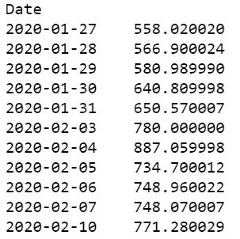

# Python 中的探索性数据分析

> 原文：<https://blog.quantinsti.com/exploratory-data-analysis-python/>

以[重香重香](https://www.linkedin.com/in/rekhit/)

探索性数据分析(EDA)是指使用可用的数据，并尝试以不同的形式将其可视化，并使用各种排列和组合来熟悉数据并得出有意义的观察结果。这是在我们清理和准备数据之后，开始数据建模之前的一步。但是为什么我们不能直接转移到数据建模部分呢？

好吧，当你想到它的时候，你实际上可以跳过探索性的数据分析部分。但是如果你不熟悉数据，你就不会知道哪个变量会产生最大的影响，从而使问题陈述变得容易解决。就这么简单。

> “对正确问题的近似回答(通常是模糊的)远胜于对错误问题的准确回答(通常是精确的)。”约翰·图基

是的，探索性数据分析确实有助于我们更快地得到答案。让我们更进一步，看看我们将在这个博客中涉及的主题。

*   [什么是探索性数据分析？](#What-Exploratory-Data-Analysis)
*   [EDA 方法有哪些类型？](#Types-EDA-Methods)

## 什么是探索性数据分析？

据说是 John Tukey 引入了探索性数据分析，并使其成为数据科学过程中的关键步骤。当被问及这意味着什么时，他只是说，“探索性数据分析”是一种态度，一种灵活的状态，一种寻找那些我们认为不存在的东西以及我们认为存在的东西的意愿。"

探索性数据分析的主要目的是:

*   深入了解可用数据
*   找出不同变量之间的任何关系
*   发现任何不寻常的东西
*   测试任何假设或直觉
*   找到任何有助于我们更快解决问题陈述的最佳参数或变量

是的，大概就是这样。您可以在下面的
中看到 EDA 流程在整个数据科学流程中的位置

<figure class="kg-card kg-image-card kg-width-full"></figure>

探索性数据分析的主要组成部分是数据的可视化。让我们在下一节看看如何执行探索性数据分析。

## EDA 方法有哪些类型？

现有文献告诉我们，探索性数据分析有四种类型。下面我们来看看:

### 单变量非图形方法

分解名称，单变量意味着只有一个变量，非图形的也很好，在这个方法中没有视觉元素。

这种方法有大量的例子，可以是一支球队中 NBA 球员的身高，也可以只是特斯拉公司 2019 年的开盘价。单变量非图形方法之一可以是变量的 5 个数字汇总。

以特斯拉 11 天的收盘价为例，我们将只取收盘价，并将其列表如下。因此，它看起来像这样:

<figure class="kg-card kg-image-card kg-width-full"></figure>

五位数汇总由最小值、第一个四分位数、中值、第三个四分位数和最大数组成。

让我们用 Python 来计算一下: