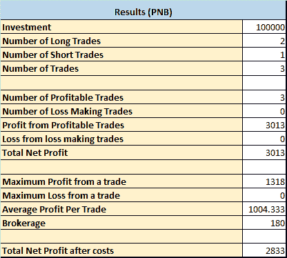
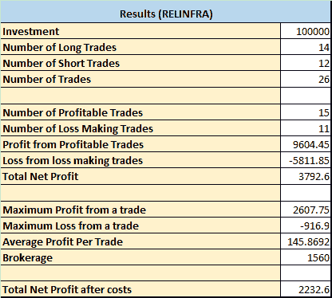
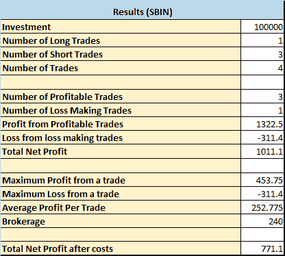

# 日内低频交易策略

> 原文：<https://blog.quantinsti.com/intraday-low-frequency-trading-strategy-project-rajtk/>

开盘价突破是专业和业余交易者使用的一种非常常用的交易策略，如果指标使用优化、模式识别、严格的进入和退出规则以及交易控制，有可能实现高精度交易。

在观察和手工交易市场一段时间后，我注意到这个系统非常适合印度市场。这是一套简单的策略，包括捕捉第一根蜡烛线(5 分钟 OHLC 数据)并分析它来产生交易。

本文是作者在 QuantInsti 提交的算法交易高管课程([【EPAT】](https://www.quantinsti.com/epat))的最后一个项目。请务必查看我们的[项目页面](/tag/epat-trading-projects/)，看看我们的学生正在构建什么。

## **关于作者**

Raj TK(tri varga Trading LLP 合伙人)来自非金融和非编程背景。他觉得需要一个结构化的学习过程来解释市场。EPAT 为拉吉提供了对市场、市场微观结构、算法、策略的基本理解，以及交易的基本编程技巧。在 EPAT 课程结束后的几个月里，他开发了一个算法交易系统和一个回溯测试模块。

在他详细描述回溯测试模块之前，他想感谢他的老师在这个项目中的指导和激励。

Nitesh Khandelwal 先生:感谢他关于 ATR、excel 编程的会议以及他对这个项目的支持。

Yves Hilpisch 博士:让 Python 变得简单。在他第二节课的最后 5 分钟，他简要介绍了如何将策略应用到市场中，极大地激励了我开发 Python 编程技能以及交易系统，并应用到市场中。

## **数据分析**

分析来自雅虎财经的 Nifty 50 股票的 5 / 15 / 30 分钟 OHLC 图表和经纪人提供的数据，以了解模式并得出区间突破策略。

## **主要发现**

基于数据分析、观察和以前的手工交易经验，出现了以下策略:

**1)绿色蜡烛线向上跳空**:开盘价应为绿色，且应至少比前一个高点高 2 点，当前蜡烛线的收盘和开盘价之差至少应为 0.5，才能向上跳空绿色蜡烛线。捕捉第一个烛台的 OHLC 价值将有助于在范围突破时产生交易条目。

**2)向上跳空红烛棒:**开盘红烛应该是红色的，应该比前一个高点至少高 2 点，当前红烛的开盘价和收盘价之差应该至少为 0.5，才能成为向上跳空红烛。捕捉第一个烛台的 OHLC 价值将有助于在范围突破时产生交易条目。

**3)绿色蜡烛线向下跳空:**开盘蜡烛线应为绿色，且应至少比前一个低点低 2 点，当前蜡烛线的收盘和开盘之间的差值至少应为 0.5，才能成为绿色蜡烛线向下跳空。捕捉第一个烛台的 OHLC 价值将有助于在范围突破时产生交易条目。

**4)跳空红烛棒:**开盘价应该是红色的，应该比之前的低点至少低 2 点，当前蜡烛的开盘价和收盘价之差应该至少为 0.5，才能成为跳空红烛。捕捉第一个烛台的 OHLC 价值将有助于在范围突破时产生交易条目。

**5)跳空红烛——趋势反转形态:**开盘红烛应为红色，且应比前一高点至少高 2 点，且位于布林线上轨上方。收盘和低点之间的差异应该小于上影线。价格下跌的可能性更大。捕捉第一个烛台的 OHLC 价值将有助于在范围突破时产生交易条目。

**6)缺口向下绿色蜡烛线——趋势反转形态:**开盘蜡烛线应为绿色，且应比前期低点低至少 2 个点，且低于布林线下轨。高点和收盘之间的差异应该小于下影线。价格上涨的可能性更大。捕捉第一个烛台的 OHLC 价值将有助于在范围突破时产生交易条目。

**7)吞没形态——红烛:**开烛应该是红色的，完全吞没前一根蜡烛。开盘价越大，向买方修正的可能性就越大。捕捉第一个烛台的 OHLC 价值将有助于在范围突破时产生交易条目。

**8)吞没形态——绿色蜡烛:**开场蜡烛应该是绿色的，完全吞没前面的蜡烛。开盘价越大，向卖方修正的可能性就越大。捕捉第一个烛台的 OHLC 价值将有助于在范围突破时产生交易条目。

**9)长阴影-绿色蜡烛:**开始的蜡烛应该是绿色的，关闭和打开之间的差异应该大于 0.5，下阴影应该至少是烛台主体的两倍。捕捉第一个烛台的 OHLC 价值将有助于在范围突破时产生交易条目。

**10)长阴影-红烛:**开口蜡烛应为红色，且开口和闭合之间的差值应大于 0.5，上部阴影应至少为烛台主体的两倍。捕捉第一个烛台的 OHLC 价值将有助于在范围突破时产生交易条目。

## **挑战/限制**

1)捕获第一个烛台对于上述策略至关重要。
2)每个剧本平均每月 4-5 笔交易。
3)股票应表现出上述模式以产生交易信号，因此需要进行彻底的回溯测试来选择股票。

## **实施方法**

### 1)[缺口向上/缺口向下] / [缺口向上/缺口向下反转形态]/[长上影]

**交易进场:**当当前蜡烛线的收盘完全在初始开盘蜡烛线之外时，进入交易(买方/卖方)。

**止损:**根据买方/卖方交易条目，将第一个 SL 置于第一个蜡烛线的低点/高点。这为价格变动提供了一些空间，并避免过早触发 SL。

**交易保险:**一旦价格从买入/卖出价格移动超过 1 个点，将 SL 修改为高于/低于买入/卖出价格 1 个点。这是为了减少损失，以防交易走向相反的方向。

**跟踪 SL:** 随着价格向交易方向移动，价格每上涨 1 个点就跟踪 SL。

**止盈:**当当前 SMA 与之前 SMA 的差值大于 0.2 时止盈。

**交易数量:**一天内不超过 2 笔交易，在区间突破时一天内反向交易。

### 2)吞没模式

**交易进场:**当当前蜡烛线的收盘完全在初始开盘蜡烛线之外时，进入交易(买方/卖方)。

**止损:**根据买方/卖方交易条目，第一个 SL 应位于第一个蜡烛线的低点/高点下方或上方至少 3 个点。这为价格变动提供了一些空间，并避免过早触发 SL。

**交易保险:**一旦价格从买入/卖出价格移动超过 2 个点，将 SL 修改为高于/低于买入/卖出价格 2 个点。这是为了减少损失，以防交易走向相反的方向。

**跟踪 SL:** 随着价格向交易方向移动，价格每上涨 1 个点就跟踪 SL。

**止盈:**止损触发时止盈

**交易数量:**一天不超过 1 笔交易

## **结论**

以下是不同剧本的交易统计。

<figure class="kg-card kg-image-card"></figure>

<figure class="kg-card kg-image-card"></figure>

<figure class="kg-card kg-image-card"></figure>

<figure class="kg-card kg-image-card"></figure>

* * *

如果你想学习算法交易的各个方面，那就去看看算法交易(EPAT) 的[高管课程。课程涵盖统计学&计量经济学、金融计算&技术和算法&定量交易等培训模块。EPAT 教你在算法交易中建立一个有前途的职业所需的技能。](https://www.quantinsti.com/epat/)

你可以看看我们的博客[烛台模式-如何阅读烛台图表](/candlestick-patterns-meaning/)如果你想了解更多关于烛台及其模式。

免责声明:就我们学生所知，本项目中的信息是真实和完整的。所有推荐均由学生或 QuantInsti**提供，不做任何保证。学生和 quantin STI***否认对这些信息的使用负有任何责任。本项目中提供的所有内容仅供参考，我们不保证通过使用该指南您将获得一定的利润。*T15】**