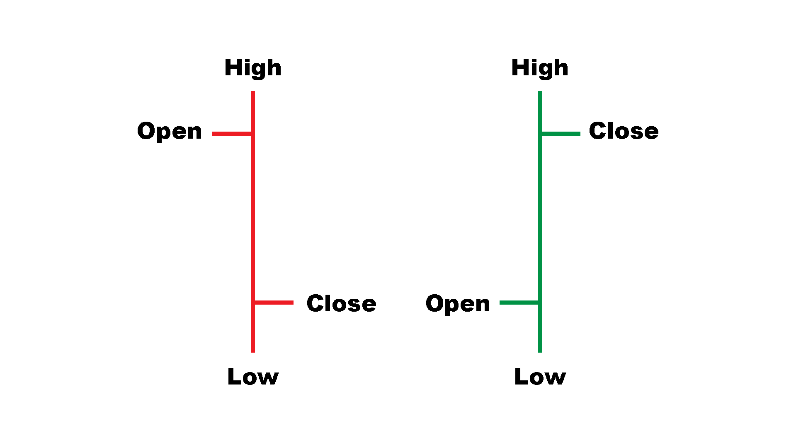
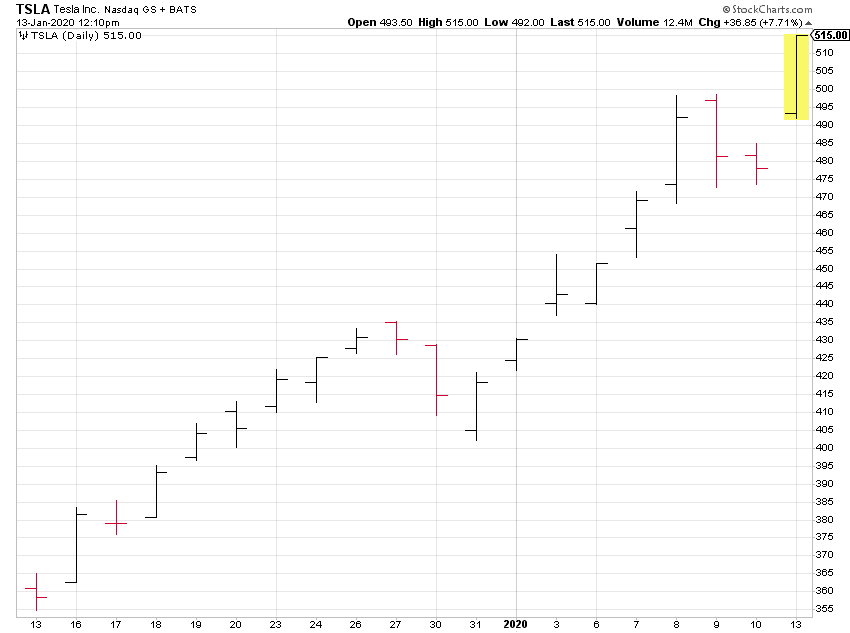

# 阅读交易条形图:时间，分笔成交点，成交量，美元，信息

> 原文：<https://blog.quantinsti.com/bar-types-trading/>

以[重香重香](https://www.linkedin.com/in/rekhit/)

自从烛台出现以来，每个新手都努力去理解它们，并研究蜡烛的图案。但 OHLC 的数据是以固定的时间间隔绘制的吗？这是分析一家公司股价的唯一方法吗？OHLC 的数据是衡量公司业绩的唯一标准吗？

事实证明，当涉及到基于固定时间间隔的 OHLC 数据时，会遗漏某些特征。在这个世界上，你越早发现突破越好，基于时间的方法来研究股票图表会妨碍你的表现。但是有什么解决方案，或者更好的替代方案呢？

今天我们将试着找到这些问题的答案。我们将讨论以下主题:

*   [交易中的金条是什么？](#What)
*   [时间和刻度条](#Time)
*   [音量条](#Volume)
*   [美元条](#Dollar)
*   [奖励内容:信息和不平衡条](#Bonus)

在我们开始进入酒吧的世界之前，让我们重温一下对它们的了解。

## 交易中的金条是什么？

以下是它们的样子:

为什么会有两种类型？很简单！如果开盘价高于收盘价(红色烛台)，那么它将是左边的图表。相反，如果收盘价高于开盘价(绿色烛台)，那么它将在第二个图表的形状。

在这里，由于我们知道开盘价总是在左边，所以阅读起来有些容易。虽然只有黑色，但现代制图软件也融合了红色和绿色。

好吧，让我们从第一小节开始！

## 时间和刻度条

好吧，时间线是你最常听说的，从远古时代开始，或者从你开始阅读股票图表开始。简单地说，在每个时间间隔后，比如说 5 分钟，我们得到所有的 OHLC，即开盘价、最高价、最低价和收盘价，并把它们绘制成条形。这些被称为时间条。

这是一个基于时间条的图表示例，显示了特斯拉在 12 月 13 日至 1 月 12 日期间的情况。

 <small>Image courtesy: [StockCharts](https://stockcharts.com/)</small>

但是事情是这样的，就像我们之前说的，时间条并不能给我们完整的画面。考虑一个典型的交易日，开始于上午 9:30，结束于下午 4:00。正如我们所知，每天的开始和结束都有大量的交易活动。此外，交易活动在午餐时间逐渐降低。

因此，如果我们有时间条，它将根本无法捕捉这些信息。只要有交易发生，就会按照指定的时间间隔创建时间条。这意味着，如果在 5 分钟的间隔有一个时间条，并且如果在一天的前 5 分钟有 1000 个交易发生，表示高市场活动，则只创建一个时间条。如果在 1:30 - 1:35 期间，只有 5 笔交易发生，这里也将创建一个时间栏。

但是为什么这很重要呢？

市场活动告诉我们市场参与者买卖股票的活跃程度。由于一些策略对价格变动起作用，如果我们在价格变动发生时就知道它，而不是在条形图指定的时间间隔之后，那就太好了。

这就是分笔成交图的用武之地。我们不是指定时间间隔，而是指定在多少次交易之后应该创建一个条。众所周知，特斯拉公司是近期波动最大的股票之一。你知道它在 1 月 13 日超过了 500 美元吗！现在，如果我们知道事务的数量正在以指数方式增长，这将有助于我们更快地采取行动。从这个意义上来说，滚动条会比时间条更快地填满我们的屏幕，从而给我们带来我们需要的优势。

分笔成交图比时间条有更好的统计特性。这有助于我们制定交易策略。

tick bar 是创建条形的最佳方式吗？不完全是。考虑这样一种情况，我们说一个分笔成交点代表 100 笔交易。现在，在第一个分笔成交点中，有 100 笔交易，但总交易量是 1000 笔。但是在第二个分笔成交点，出现了一些大的波动，在 100 笔交易中，成交量达到了 100000 笔。这是第一个刻度条的 100 倍。

| 刻度条 1 | 刻度条 2 |
| 卷 | 价格 | 卷 | 价格 |
| Fifty | $500 | Five thousand | $500 |
| Twenty-five | $501 | Two thousand five hundred | $502 |
| Twenty-five | $500 | Two thousand five hundred | $504 |

体积的巨大变化可能意味着什么。这是不会被捕获的，因为分笔成交点捕获固定数量的交易。

那么我们该怎么办呢？我们有其他类型的酒吧吗？

## 音量条

正如你之前看到的，分笔成交点的限制是它给交易相同的权重，无论是 1000 还是 10。从这个意义上说，虽然它确实比时间棒给了我们一个更好的市场活动的画面，但如果我们想知道订单的大小，它对我们没有帮助。

想想看，作为一个交易者，你会想知道股票换手有多快。因此，我们所做的是获取体积数据并创建一个体积条，该体积条是在一个固定的数字之后创建的。

不要担心，这里有一个例子显示了它相对于时间条的优势。

假设我们在交易了 1000 股后创建了一个交易量。现在，让我们以特斯拉为例。从 1 月 7 日起，特斯拉开始向中国客户交付其 Model 3 汽车。此外，由于中国政府宣布的补贴，特斯拉宣布下调 Model 3 的价格。这导致了积极的情绪，交易商在 1 月 14 日将特斯拉的股价推高至 500 美元以上。

但是这和音量条有什么关系呢？

考虑一下，如果你知道对某支股票有积极的情绪，并且知道价格可能会上涨，难道你不想顺应趋势吗？但是你能用什么来证明呢？简单，看股票交易量。但问题是，如果你在寻找基于 5 分钟时间间隔的时间棒，而你在第二分钟收到了积极的消息，这意味着你会等到第五分钟来确认你的想法。与此同时，如果你使用了成交量棒线，如果我们有 3000 股交易，它会在第五分钟产生 3 根棒线。这是交易者可以利用的优势。

听起来很简单，不是吗？

现在让我们来看看，时间棒是最简单的，但是它不能给我们与市场活动相关的信息。另一方面，分笔成交点帮助我们进行市场活动。但是，分笔成交点不能让我们了解交易量，交易量可以通过分笔成交点来显示。

音量条其实很牛逼，除了一件小事。再考虑一下特斯拉的股票。2017 年 1 月 2 日，特斯拉的股价为 320 美元。如果你买了 1000 股，那就是 320，000 美元。现在，在 2020 年 1 月 13 日，如果我们购买 1000 股股票，其金额将为 524 * 1000 美元= 524，000 美元。这是很大的区别。因此，如果你在考虑历史分析，让所有东西都保持同样的价值不是很有意义吗？

您可能已经猜到，表示交易的有效方法是使用交易的美元值。

## 美元金条

我们在固定价值的股票交易后创建一个数据条，而不是固定的交易量。因此，我们对市场有了更好的了解。

事实上，当谈到统计分析时，美元棒线是最好的，因为与其他棒线相比，它们的回报是最正态分布的。

正如你可能已经猜到的那样，在股票价格改变之前，美元柱和成交量柱将保持不变。

但是这些是显示价格信息的唯一方式吗？嗯，还有几个。

## 信息与不平衡

你一定在想，我如何在条形图上绘制信息？一种方法是利用市场的不平衡。最简单的方法是找出买卖订单之间的差异。如果这种差异超过某个预定义的阈值，我们将创建更多的条形来捕获该信息。在这里，棒线可以是美元、成交量或分笔成交点。

这样做的目的是为了在买卖订单有差异时获取更多信息。想想看，当我们发现更多的购买订单时，价格可能会上涨，反之亦然。从长远来看，这将有助于我们进行更明智的交易。

这里还有一个有趣的例子。有时候，机构投资者，实际上大多数时候，会把一个大订单，比如 10000 股，分成 10 个小订单，这样订单量就不会受到很大影响。但是我们可以创建一个条件，在这个条件下我们可以识别这些类型的订单，从而在这个条件出现时创建更多的柱线。

当然，也可以有其他的例子，你可以创建更多的酒吧来利用市场的不平衡。你能想到什么吗？

## 结论

太好了！我们不仅理解了棒线的工作原理，还理解了我们如何利用某些市场失衡来提高我们的预测能力。当然，如果你想深入了解它的本质，你可以看看关于[金融数据科学和特征工程](https://quantra.quantinsti.com/course/financial-data-science-feature-engineering)的课程。当涉及到数据清理和工程时，该课程有代码和更多内容。

*免责声明:本文中提供的所有数据和信息仅供参考。QuantInsti 对本文中任何信息的准确性、完整性、现时性、适用性或有效性不做任何陈述，也不对这些信息中的任何错误、遗漏或延迟或因其显示或使用而导致的任何损失、伤害或损害承担任何责任。所有信息均按原样提供。*