# 投资组合优化方法

> 原文：<https://blog.quantinsti.com/portfolio-optimization-methods/>

由[索娜姆·斯里瓦斯塔瓦](https://www.linkedin.com/in/sonam-srivastava-b0291a60)

当构建一个多资产投资组合时，提出为投资组合的各个组成部分分配权重的策略是这个过程中非常重要的一步。给定一个投资组合的组成部分，计算出它的权重可以通过多种方式来完成，这是一个即使是最熟练的经理也感到困惑的问题。那么做这件事的最佳方式是什么呢？在本文中，我们将尝试介绍最广泛使用的方法，并理解它们背后的直觉。

当我们天真地思考这个问题时，最直观的证券配置方式是基于我们对它们的信念。在金融市场历史的早期，交易者实际上就是这么做的，而且是盈利的。随着趋势跟踪策略在 1997 年初崩溃，市场波动性增加，交易者开始在策略中加入止损和获利，交错进场和出场。

2008 年全球金融危机后,“风险对等”成为了一种被广泛遵循的策略。这种策略将相同的风险预算分配给所有参与的资产，不考虑投资者的观点或预期回报预测。纳入观点的最流行的方法是基于[资本资产定价模型或 CAPM](https://blog.quantinsti.com/capital-asset-pricing-model/) 的 Markovitz 均值-方差最优投资组合。像市场指数这样的被动投资组合使用市值加权配置。其他简单的方法是等权重投资组合或最小方差投资组合。

关于投资组合优化的文献丰富而庞大。在基本方法的基础上有各种各样的变化和改进，围绕它有许多活跃的研究。在研究美国管理期货策略时，我研究了一种叫做“风险预算”的风险平价变体和一种新颖的“主动风险预算”。甚至有一个机器学习方法的用例，比如强化学习方法，可以很好地解决这个问题。

在这篇文章中，我们将介绍一些流行的项目组合构建方法的基本原理以及它们在 Python 中的实现。我们还将研究每种方法在一个投资组合中的表现，该投资组合包括在 NSE 上发布的行业指数，即银行、汽车、金融服务、快速消费品、IT、媒体、金属、制药、PSU 银行、私人银行、房地产。

我们每季度重新平衡我们的投资组合，并以只做多的方式交易。

## **等权**

该方法为所有组件分配相等的权重。当所有感兴趣的资产的回报是完全随机的，并且我们没有观点时，这将是最有用的。

```
def equal_weighted_portfolio(w, V):
''
The equal-weighted portfolio returns equal weights to each of the
portfolio components
'''
return [1.0/len(w)]*len(w)
```

我们将看到由以下行业指数组成的等权重投资组合的回报。

 

 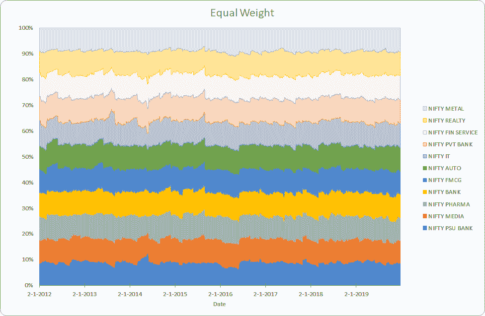

年化收益 13.3%，年化风险 21.7%

## **风险平价**

每个资产的风险贡献是相等的。这种方法在 2008 年危机后流行起来。在所有资产类别之间的夏普比率相同的情况下，风险平价最有效(因此，风险贡献相等，回报也相等)。

权重是最优化方程的解-

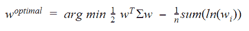

其中，w 是权重，∑是协方差矩阵，n 是资产数量

```
def risk_parity(w, V):
def calculate_portfolio_variance(w,V):
# function that calculates portfolio risk
w = np.matrix(w)
return (w*V*w.T)[0,0]
def calculate_risk_contribution(w,V):
# function that calculates asset contribution to total risk
w = np.matrix(w)
sigma = np.sqrt(calculate_portfolio_variance(w,V))
# Marginal Risk Contribution
MRC = V*w.T
# Risk Contribution
RC = np.multiply(MRC,w.T)/sigma
return RC

def risk_budget_objective(x,pars):
# calculate portfolio risk
V = pars[0]# covariance table
x_t = pars[1] # risk target in percent of portfolio risk
sig_p = np.sqrt(calculate_portfolio_variance(x,V))# portfolio sigma
risk_target = np.asmatrix(np.multiply(sig_p,x_t))
asset_RC = calculate_risk_contribution(x,V)
J = sum(np.square(asset_RC-risk_target.T))[0,0] # sum of squared error
return J

def total_weight_constraint(x):
return np.sum(x)-1.0
w0 = x_t = [1.0/len(w)]*len(w)
cons = ({'type': 'eq', 'fun': total_weight_constraint})
res= minimize(risk_budget_objective, w0, args=[V,x_t], method='SLSQP',constraints=cons, options={'disp': True})
return np.asmatrix(res.x)
```


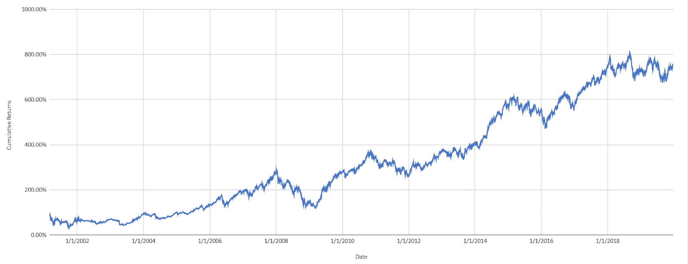

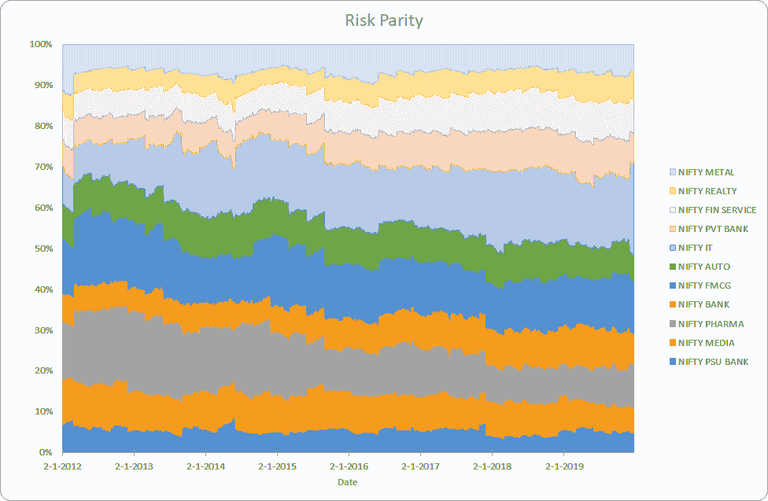

年化收益 13.40%，年化风险 24.7%。我们可以看到，快速消费品等低波动性行业权重较高，而 PSU 银行等高风险行业权重较低。

## **最小方差**

这种方法使投资组合的波动性最小化。当回报与风险不成正比，降低风险也不会导致更低的回报时，这种方法最有效。

权重是方程的解，

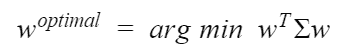

其中，w 是权重，∑是协方差矩阵

```
def minimum_variance(w0, V):
def calculate_portfolio_var(w, pars):
# function that calculates portfolio risk
V = pars # covariance table
w = np.matrix(w)
return (w * V * w.T)[0, 0]
def total_weight_constraint(x):
return np.sum(x) - 1.0
cons = ({'type': 'eq', 'fun': total_weight_constraint})
res = minimize
calculate_portfolio_var,
w0,
args=V,
method='SLSQP',
constraints=cons,
options={
'disp': False})
return np.asmatrix(res.x)
```

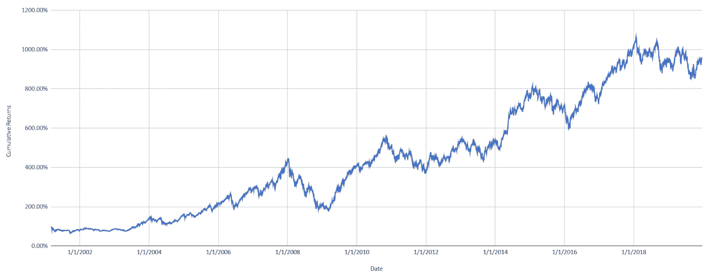

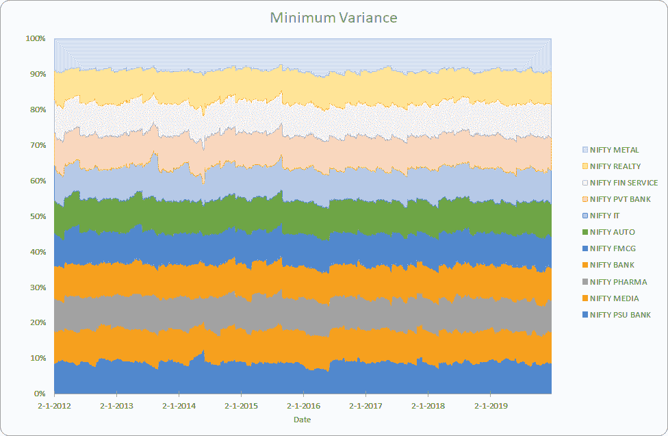

年化收益 13.6%，年化风险 20.8%。这看起来与等权重示例非常相似，可能是因为指数的风险相似，并且基于优化器的低风险投资组合解决方案在局部最小值停止。

## **均值-方差优化**

这就是著名的马科维茨投资组合。这是一个数学框架，用于组合资产组合，使得对于给定的风险水平，[预期回报](https://www.google.com/url?q=https://en.wikipedia.org/wiki/Expected_return&sa=D&ust=1578568332949000)最大化。

权重是对不同预期回报水平的优化问题的解决方案，

 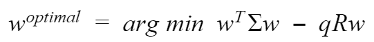

其中，w 是权重，∑是协方差矩阵，N 是资产数量，R 是预期收益，q 是“风险承受能力”因子，0 表示投资组合的风险最小,∞表示投资组合无限远离边界，预期收益和风险均无界。

```
def mean_variance_optimization(w, V):
def calculate_portfolio_risk(w, V):
# function that calculates portfolio risk
w = np.matrix(w)
return np.sqrt((w * V * w.T)[0, 0])
def calculate_portfolio_return(w, r):
# function that calculates portfolio return
return np.sum(w*r)
# optimizer
def optimize(w, V, target_return=0.1):
init_guess = np.ones(len(symbols)) * (1.0 / len(symbols))
weights = minimize(get_portfolio_risk, init_guess,
args=(normalized_prices,), method='SLSQP',
options={'disp': False},
constraints=({'type': 'eq', 'fun': lambda inputs: 1.0 - np.sum(inputs)},
{'type': 'eq', 'args': (normalized_prices,),
'fun': lambda inputs, normalized_prices:
target_return - get_portfolio_return(weights=inputs,
normalized_prices=normalized_prices)}))
return weights.x
optimal_risk_all = np.array([])
optimal_return_all = np.array([])
for target_return in np.arange(0.005, .0402, .0005):
opt_w = optimize(prices=prices, symbols=symbols, target_return=target_return)
optimal_risk_all = np.append(optimal_risk_all, get_portfolio_risk(opt_w, V))
optimal_return_all = np.append(optimal_return_all, get_portfolio_return(opt_w, w))
return optimal_return_all, optimal_risk_all
```

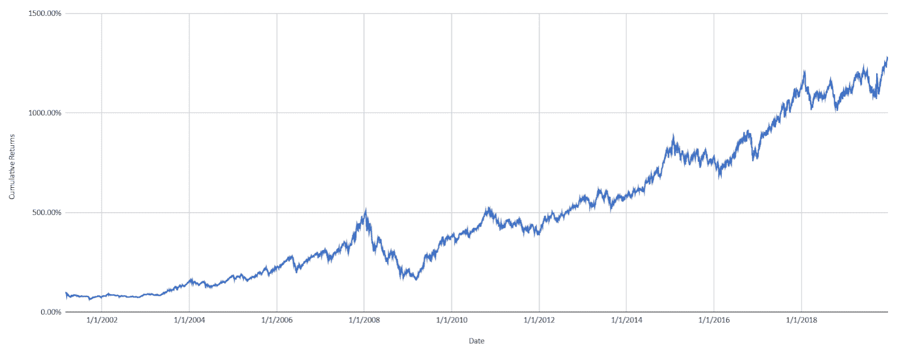

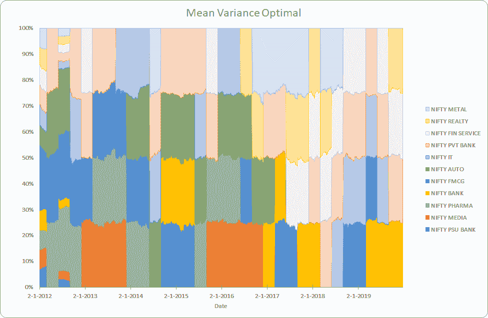

年化收益 15.2%，年化风险 21.9%。我们选择了风险最高的投资组合，人们可以根据自己的风险承受能力来选择风险。

总的来说，我们看到均值-方差优化可能是我们例子中最好的方法。

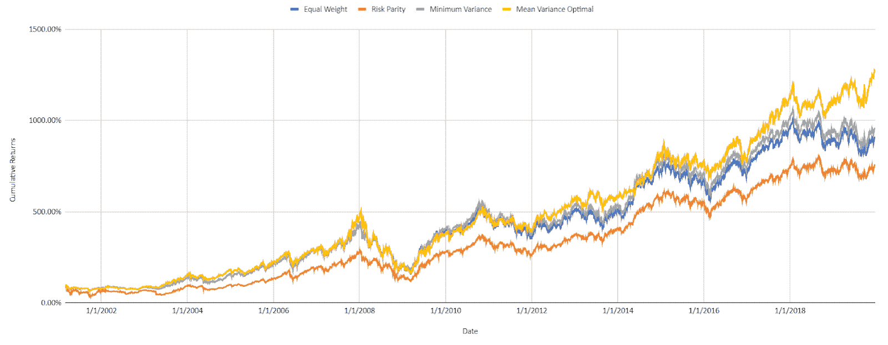

当然，在不同的条件下，根据不同的因素，这些方法中的每一种都是可以选择的。那么要看哪些因素呢？

## **影响投资组合优化的因素**

### **行为因素**

在决定投资组合构建方法时，投资者的风险观或风险厌恶显然是最重要的因素。工具的选择和投资范围决定了可用的多样化和方法，因此这是最重要的因素。

### **相关性**

相关性引导多样化。Resolve Asset Management 最近发布的[研究报告](https://www.google.com/url?q=https://investresolve.com/blog/portfolio-optimization-simple-optimal-methods/?utm_campaign%3DOktopost-RAM%2BBlog%26utm_content%3DOktopost-facebook%26utm_medium%3Dsocial%26utm_source%3Dfacebook&sa=D&ust=1578568332966000)表明，只有当存在分散投资的机会和大量风险因素时，基于优化的方法才优于简单的方法。对于不完全相关的资产，投资组合的收益和波动性不同于加权和。所以相关性在投资组合构建方法的选择中起着很大的作用。

### **市场机制**

我们证明了当所有回报假设相同时，最小方差是最优的，当所有风险调整后的回报相同时，风险平价是最优的。这种情况实际上会随着市场制度的改变而发生。在现实中，回报与风险呈负相关，而在其他制度中，高风险会得到高回报。这使得市场机制成为评估投资组合构建方法时需要考虑的一个很好的因素。

## **结论**

我希望这篇文章能给读者一个良好的开端，探索投资组合构建和优化这一奇妙的研究领域。这个有趣的研究领域可以增加任何系统交易策略的复杂性。

<small>*免责声明:本客座博文中提供的观点、意见和信息仅属作者个人观点，不代表 QuantInsti 的观点、意见和信息。本文中所做的任何陈述或共享的链接的准确性、完整性和有效性都不能得到保证。我们对任何错误、遗漏或陈述不承担任何责任。与侵犯知识产权相关的任何责任由他们承担。*</small>