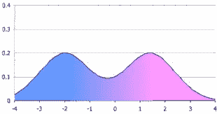
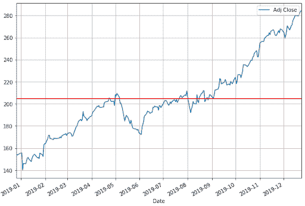
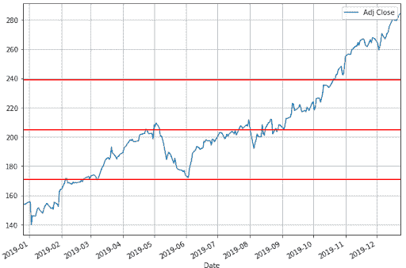
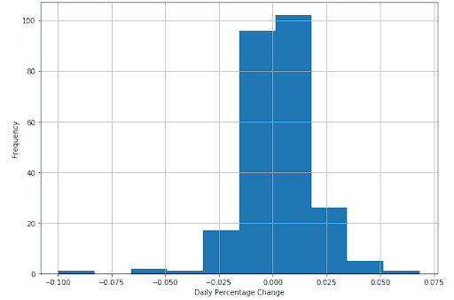
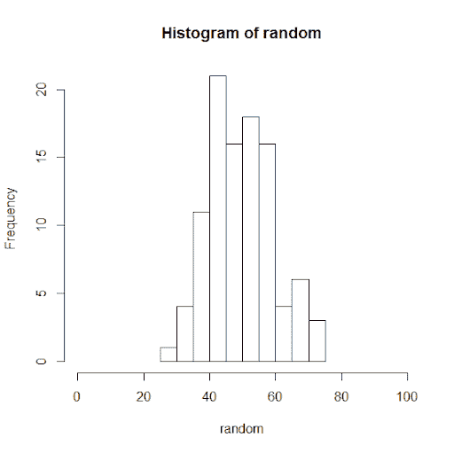
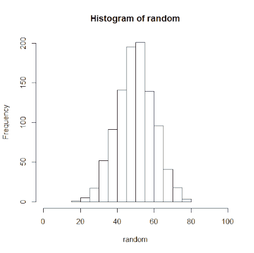
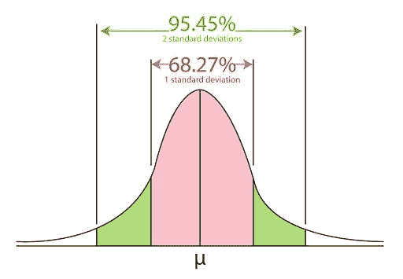
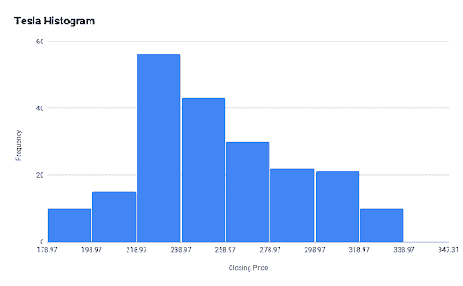
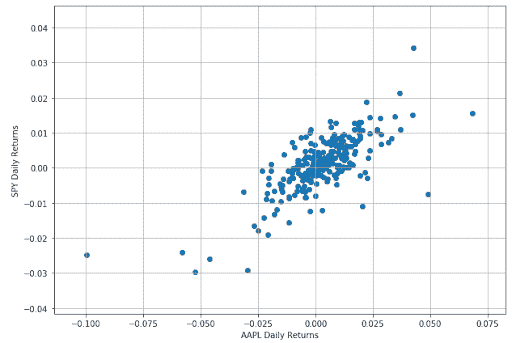
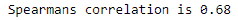

# 统计学和概率分布初学者指南

> 原文：<https://blog.quantinsti.com/statistics-probability-distribution/>

由[阿努普里亚·古普塔](https://goo.gl/5kA0yu)和[伊山·沙阿](https://www.linkedin.com/in/ishan-shah-18393828/)

我们都意识到，当谈到算法交易时，统计学的实用知识对于建立不同策略的模型是必不可少的。事实上，数据科学是这十年来最受欢迎的技能之一，它利用统计数据对数据进行建模，并得出有意义的结论。带着这个目的，我们将学习一些基本的术语以及在算法交易领域使用的概率分布的类型。

我们将讨论以下主题:

*   [历史数据分析](#Historical)
*   [概率分布](#Probability)
*   [相关性](#Correlation)

## 历史数据分析

在这一部分，我们将尝试回答一个基本问题，“你如何分析一只股票的历史数据，并将其用于策略构建？”当然，为了分析，我们首先需要一个数据集！

### 资料组

为了保持其通用性，我们采用了苹果公司从 2018 年 12 月 26 日到 2019 年 12 月 26 日的每日股价数据。可以从[雅虎财经](https://finance.yahoo.com/quote/AAPL/history?p=AAPL&.tsrc=fin-srch)下载历史数据。如果你有兴趣用 python 下载数据，可以访问下面的[链接](/stock-market-data-analysis-python/)。

暂且用下面的 python 代码从雅虎财经下载；

```
import yfinance as yf
aapl = yf.download('AAPL','2018-12-26', '2019-12-26')
```

这是一个[时间序列数据](https://quantra.quantinsti.com/course/financial-time-series-analysis-trading)集合，包含苹果的每日收盘价和交易量。我们将根据这只股票的收盘价进行分析。在这篇文章中，我们将仅仅触及每日股票价格的基本统计属性，然后是简单的相关性。

**意思是？Mode？中位数？有什么区别！！！**

我们就以 5 个数字为例:12，13，6，7，19，21，理解这三个术语。

### 平均

简单来说，mean 就是我们最习惯的一个，即平均值。因此，在上面的例子中，平均值= (12 + 13 + 6 + 7 + 19 + 21)/6 = 13。

在 AAPL 数据集中，收盘价的平均值是 204.84。滚动平均是技术交易策略中广泛使用的方法。交易者非常重视 50 天和 200 天滚动平均线的交叉。并以此为基础发起贸易。

对于 AAPL 数据集，我们将使用以下 python 代码:

```
mean = np.mean(aapl['Adj Close'])
mean
```

输出结果是:204。56864 . 68686868667

### 方式

在给定的数据集中，众数将是出现次数最多的数字。在上面的例子中，因为没有重复的值，所以没有模式。你可以说每个元素都是一种模式。但这对汇总数据集没有帮助。

在 AAPL 数据集中，收盘价模式不存在，因为没有重复值。

当我们尝试运行以下代码来查找 python 中的模式时，它会抛出以下错误

```
import statistics 
mode = statistics.mode(aapl['Adj Close'])
mode
```


另外，如果你的数据集如下，你会选择哪个模式值？



很难回答这个问题，应该使用一些其他方法。此外，该模式对收盘价或其他连续数据没有太大意义。当您想要绘制直方图并可视化频率分布时，模式特别有用。

### 中位数

有时，数据集值可能有一些处于极端的值，这可能会导致数据集的平均值描绘出不正确的画面。因此，我们使用中位数，它给出了排序数据集的中间值。

要求中位数，你得把数字按升序排列，然后求中间值。如果数据集包含偶数个值，则取中间两个值的平均值。在我们的例子中，中位数是(12 + 13)/2 = 12.5

在我们的数据集中，收盘价的中位数是 201.05

用于查找中值的 python 代码如下:

```
median = np.median(aapl['Adj Close']) 
```

太好了！当我们开始学习统计学时，我们现在转到一个非常重要的术语，即概率分布。

## 概率分布

我们都经历过寻找掷骰子概率的例子。现在，我们知道掷骰子只有六种结果，即{1，2，3，4，5，6}。掷出 1 的概率是 1/6。这种概率称为离散的，其中有固定数量的结果。

顾名思义，概率分布就是一个给定事件所有结果的列表。因此，掷骰子事件的概率如下:

| 骰子点数 | 概率分布 |
| one | 1/6 |
| Two | 1/6 |
| three | 1/6 |
| four | 1/6 |
| five | 1/6 |
| six | 1/6 |

在这里列出所有的值是可行的，因为我们有一组有限的结果，但是如果结果很大，我们就使用函数。

如果概率是离散的，我们称这个函数为概率质量函数。在掷骰子的情况下，P(x) = 1/6，其中 x = {1，2，3，4，5，6}。

对于离散概率，有一些案例被广泛研究，以至于它们的概率分布已经标准化。让我们以伯努利分布为例，它考虑了当我们掷硬币时得到正面或反面的概率。我们把它的概率函数写成 px(1–p)(1–x)。这里 x 是结果，可以写成正面= 0，反面= 1。

现在，有些情况下，结果并不明确。比如一个年级所有高中生的身高。虽然实际原因不同，但我们可以说，列出所有的身高数据和概率会太麻烦。在这种情况下，功能是必不可少的。

前面我们说过，对于离散值，概率函数就是概率质量函数。相比之下，对于连续值，概率函数称为概率密度函数。

让我们退一步，理解一些与概率分布有关的术语。

### 范围

范围只是给出了数据集的最小值和最大值之间的差值。

在所取的数据集中，收盘价的最小值是 140.08，而最大值是 284.26。因此，范围= 284.26 - 140.08 = 144.18。现在，我们将走向标准差。

在 python 中，我们可以通过一行简单的代码找到这些值:

```
aapl['Adj Close'].describe()
```

输出如下所示:


### 标准偏差

简单来说，标准差告诉我们这个值偏离均值有多远。让我们使用完整的数据集，试着理解标准差如何在交易中帮助我们。

我们在计算时考虑了收盘价。如前所述，我们数据集的平均值是 204.84。用收盘价和平均值绘制图表的 python 代码应该给出下图。

```
import matplotlib.pyplot as plt
aapl['Adj Close'].plot(figsize=(10,7))
plt.axhline(y=mean, color='r', linestyle='-')
plt.legend()
plt.grid()
plt.show()
```



**标准差计算如下:**

1.  计算这些数字的简单平均值
2.  从每个数字中减去平均值
3.  计算结果的平方
4.  计算结果的平均值
5.  取第 4 步答案的平方根


对于给定的数据集，代码如下:

```
std = np.std(aapl['Adj Close'])
```

收盘价的标准差是 34.05。

现在我们将绘制上图，在平均值的两边各有一个标准差。我们将它写成(+标准差)= 204.84 + 34.05 = 238.89，而(-标准差)= 204.84 - 34.05 = 170.79。

代码如下:

```
aapl['Adj Close'].plot(figsize=(10,7))
plt.axhline(y=mean, color='r', linestyle='-')
plt.axhline(y=mean+std, color='r', linestyle='-')
plt.axhline(y=mean-std, color='r', linestyle='-')
plt.legend()
plt.grid()
plt.show()
```



在图中，中间的红线表示平均值，而+标准差和-标准差是其他红线。

那么告诉我们，通过观察上面的图表，你能观察到什么？

嗯，快速浏览一下，我们会发现大多数收盘价值都在两个标准差之间。因此，这给了我们一个关于大多数价格行为的粗略概念。

但是你可能仍然想知道，知道一定范围的价格值有什么用呢？首先，标准差在布林线中扮演着重要的角色，这是一个非常受欢迎的指标。你可以用标准偏差上限作为突破的标志。当价格高于上限时开始买入交易。

股票的波动性可以用标准差来计算。股票波动性是许多机器学习算法中使用的一个重要特征。它也用于正态概率分布，我们一会儿会讲到。

**等等！正态分布？**

正态分布在统计世界中是一个非常简单却又非常深奥的概念，实际上在日常生活中也是如此。基本前提是，给定一系列观察值，发现大多数值都集中在平均值附近，并在平均值的一个标准偏差内。其实据说 68%的数值都在这个范围内。如果我们继续，那么我们看到 95%的值在平均值的两个标准偏差之内。

等等，我们现在要超越自我了。让我们首先借助直方图来理解这一点。

### 柱状图

我们以一批学生的身高为例。现在可能有些学生的身高是 60.1 英寸、60.2 英寸等等，直到 60.9 英寸。有时候，我们并不需要那么详细，我们只想知道有多少学生的身高在 60 - 61 英寸之间。那不是会让我们的工作变得更容易更简单吗？这正是直方图的作用。它给出了观察值的频率分布。

谈到交易，我们通常使用每日百分比变化，而不是收盘价。

对于我们的数据集，我们将使用以下代码:

```
aapl['daily_percent_change'] = aapl['Adj Close'].pct_change()
aapl.daily_percent_change.hist(figsize=(10,7))
plt.ylabel('Frequency')
plt.xlabel('Daily Percentage Change')
plt.show()
```

输出如下所示:



回想一下，我们说过大多数值都接近平均值。你可以在上面绘制的柱状图中清楚地看到这一点。

事实上，如果我们在这些值周围画一条曲线，它看起来就像一个钟。

我们称之为钟形曲线，这是正态概率分布的另一个名称，或简称为正态分布。您可以看到大多数值位于标准偏差之间，即(+S.D.) = 239.6 和(-S.D.) = 172.64。

您可能需要记住，在正态分布中，68%的值位于一个标准差之间，95%的值位于两个标准差之间。进一步说，我们会说 99.7%的值位于平均值的 3 个标准偏差之间。

### 正态分布

当你的数据的分布满足一定的要求，比如围绕均值和钟形曲线对称，我们就说你的数据是正态分布。

从统计学上讲，如果 x 是均值和标准差为σ的正态分布，我们写 x∞n(，σ^2)，其中和σ是分布的参数。

#### 为什么知道数据集的分布函数很有用？

如果你知道你的数据样本是正态分布的，你就可以很有把握地对你的人口进行预测。

例如，假设您的数据样本 X 表示在一个学生样本的入学测试中获得的满分 100 分。数据是正态分布的，比如 X∞N(50，102)。绘制时，该数据如下所示:



如果将样本数据集中的观察次数从 100 次增加到 1000 次，结果如下:



看起来更像钟形！

现在我们知道，X 具有均值为 50、标准差为 10 的正态分布数据，我们可以有把握地预测整个学生群体或未来学生(来自同一群体)的分数。在几乎 99.7%的信心下，我们可以说学生不会得到低于 20 或高于 80 的分数。在 95%的置信度下，我们可以说学生的分数在 30 到 70 分之间。



从统计学的角度来说，分布函数给出了两点之间给定观测值的期望值的概率。因此，使用分布函数，也称为概率密度函数，我们可以“预测”一定的“信心”。

### 收盘价正态分布吗？

在我们试图回答这个问题之前，让我们看另一个数据集，看看它的直方图是什么样的。

我们绘制了同一时期特斯拉公司的直方图，如下所示:



在这里，平均值(收盘价)是 270.9，+标准差和-标准差分别是 319.14 和 222.66。那么从上面的直方图可以得出什么结论呢？

综上所述，概率分布函数应用于技术分析的每一步，是定量分析的核心。这些分析构成了任何战略制定过程的核心部分。

到目前为止，我们已经了解了统计领域的一些基本概念。现在，我们将试着在这个迷人的世界里走得更远一点，看看它在交易中的应用。我们将首先从相关性开始。

## 相关性

我和你到底有没有关系？

在某种程度上，相关性告诉我们两组值之间的关系。到目前为止，我们已经获取了苹果公司从 2018 年 12 月 26 日到 2019 年 12 月 26 日的数据集。现在，我们应该指出苹果是标准普尔 500 指数的一部分。因此，苹果股票的任何变化都会在某种程度上反映在 S&P 指数上。

让我们获取同一时间段的 S&P500 数据集，并找出相关性。

代码如下:

```
import yfinance as yf
spx = yf.download('^GSPC','2018-12-26', '2019-12-26')
spx['daily_percent_change'] = spx['Adj Close'].pct_change()
plt.figure(figsize=(10,7))
plt.scatter(aapl.daily_percent_change,spx.daily_percent_change)
plt.xlabel('AAPL Daily Returns')
plt.ylabel('SPY Daily Returns')
plt.grid()
plt.show()
```



```
from scipy.stats import spearmanr
correlation, _ = spearmanr(aapl.daily_percent_change.dropna(),spx.daily_percent_change.dropna())
print('Spearmans correlation is %.2f' % correlation)
```



### 理解相关性

相关性是一个介于-1 和 1 之间的单位自由数，它给出了变量之间关系的度量。介于 0.7 和 1.0 之间的高度正相关值意味着一个变量的变化与另一个变量的变化正相关。这意味着，如果一个变量增加，另一个变量也很可能增加。在其他值减少或不变的情况下，该行为也是一致的。

另一方面，位于-0.7 到-1.0 之间的高度负相关值告诉我们，一个变量的变化与另一个变量的变化负相关。这意味着，如果一个变量增加，另一个变量很可能会减少。

在-0.2 和 0.2 附近的低相关值告诉我们，这两个变量之间没有很强的关系。

需要注意的一点是，相关性并没有告诉我们任何关于因果关系的事情。我们都听说过这样一句话，“相关性并不意味着因果关系”。例如，在一个人群中，肺癌的*例数可能与*一生中吸烟的数量*相关，但这并不能确定吸烟与肺癌的因果关系。人们需要做一个控制组研究，保持所有其他影响因素不变，以建立这种因果关系。[基于机器学习的交易](https://quantra.quantinsti.com/course/introduction-to-machine-learning-for-trading)模型非常擅长提取不同指标之间的因果关系。*

相关性是线性关系的量度。例如，x 和 x2 之间的相关性可能接近于 0。即使这两个变量之间有很强的关系，它也不会在相关值中被捕获。

太好了！我们已经学习了很多与统计相关的概念。你可以进一步回归；事实上，关于[线性回归](/machine-learning-trading-predict-stock-prices-regression/)的博客是你探索掌握算法交易艺术的完美下一步。

## 结论

我们已经学习了均值、中值和众数的基本概念，然后理解了离散变量和连续变量的概率分布。我们详细研究了正态分布，并触及了相关性主题，以确定两个数据集是否相关。

如果你想学习算法交易和自动交易系统的各个方面，那就去看看算法交易(EPAT ) 的[高管课程。课程涵盖统计学&计量经济学、金融计算&技术和算法&定量交易等培训模块。EPAT 教你在算法交易中建立一个有前途的职业所需的技能。](https://www.quantinsti.com/epat/)[现在报名](https://www.quantinsti.com/epat/)！

*免责声明:本文中提供的所有数据和信息仅供参考。QuantInsti 对本文中任何信息的准确性、完整性、现时性、适用性或有效性不做任何陈述，也不对这些信息中的任何错误、遗漏或延迟或因其显示或使用而导致的任何损失、伤害或损害承担任何责任。所有信息均按原样提供。*