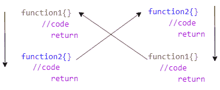

# Python 中的递归函数

> 原文：<https://blog.quantinsti.com/recursive-functions-python/>

作者:普拉奇·乔希

肯·汤普森曾经说过- *“我最有效率的一天是扔掉 1000 行代码。”*。

我相信，借助于**函数，这是可以部分实现的！**

你有没有遇到过一个不可理解的，琐碎的程序长度，可能有许多重复的代码行，只是增加了这个谜？冗余从来不受欢迎，因为它违背了编码的基本原则。能够写出清晰、易于理解、可读性高的代码，表明你是一个多么优秀的程序员。在这篇博客中，我们将介绍如何创建、定义和调用递归函数，以及在哪里可以使用这样的函数。

这篇关于“递归函数”的博客将带领你通过一个有用的框架来理解函数的各种属性，尤其是递归函数。通过各种例子，我们将帮助你学习如何创建、定义和调用递归函数。

在这篇博客中，我们将讨论以下主题:

*   [什么是函数？](#What)
*   [为什么有用？可以用在哪里？](#Why)
*   [不同类型的功能？](#Different)
*   [如何定义函数？涉及到哪些参数和自变量？](#define)
*   [如何调用函数？](#call)
*   [递归函数](#Recursive)
*   [递归函数的类型](#Types)
*   [迭代 Vs 递归](#Iteration)
*   [递归函数的优缺点](#Advantages)

## 什么是函数？

函数是编程的组成部分之一。征服难以理解的庞大代码的最简单的方法之一就是理解函数的重要性和可用性。函数在数学中已经使用了很长时间。`F(x)=x^2`是一个函数，其输出将根据 x 的值而变化。

功能是建立在一组特定的指令上，以产生期望的结果。使用函数背后的主要思想是通过将重复的代码放在一起并从中创建一个函数来避免冗余。现在，不用再写代码了，你可以直接[调用](https://blog.quantinsti.com/python-function-tutorial/)函数。

## 为什么有用？可以用在哪里？

毫无疑问，函数在编程中起着至关重要的作用。让我列出几个要点，以便更容易理解用例。不言而喻，在程序*中加入函数可以提高程序的可读性*。函数给程序一个*逻辑结构*。*可重用性*是另一个优势，其中一旦被定义，它可以在同一个程序和其他程序中被多次调用。它还*改进了代码的长度*，*使得测试和调试变得更加容易*，并且函数也是*可移植的*，这意味着它们可以存储在库或。py 文件也可以在不同的程序中使用。这些是函数众多优点中的一部分。

## 不同类型的功能？

Python 中主要有三种类型的函数:

1.  内置函数是 Python 提供的一些现成函数，内置于任何 Python 环境中。这些通常是 Python 包和库所共有的。例如，Python 允许您使用`max()`和`min()`来查找任意数据集各自的最大值和最小值。

2.  用户定义的函数是可重用的代码块，是我们到目前为止一直在谈论的定制函数。这些功能帮助我们完成特定的任务。您将在这篇博客中详细了解如何创建这些用户自定义函数。

3.  匿名函数，也称为 lambda 函数。与用户定义的函数不同，lambda 函数是一个内嵌函数，允许分块构造。我们不会进一步详细讨论这些函数，但是这些函数不像其他两个函数那样有任何命名标识符。你可以在这个[博客](https://blog.quantinsti.com/using-Python-lambda-function-in-trading/)里读到这个功能。

## 如何定义函数？

可以说，到目前为止，您一定已经理解了用户定义函数的重要性。现在，让我们学习如何定义和创建一个函数。下面我们提到了几种方式。

1.  **第一步**——使用关键字`def`后跟函数名来*定义*一个函数。

2.  **第二步**——设置一个容易理解的函数名。这个函数名对于任何浏览过你的代码的人来说都是不言自明的。假设您必须创建一个函数来计算斐波那契数列。你可以把名字设为`fibonnaci_series`，而不是说`fib`或者`fib_ser`。左括号后面是传递所需参数的函数名。例如，`def fibonnaci_series():`

3.  **第三步**有四种不同类型的论点:

    1.  *Default:* 如果在调用一个函数时没有分配其他值，但在定义一个函数时已经分配了该值，则该参数采用默认值。默认值是通过使用“=”运算符分配的。比如`def class( student_name='John'):`。现在，如果你调用函数`class()`，它将打印`'John'`。

    2.  *必需:*参数应该按照正确的位置顺序传递，否则，输出显示错误。例如，你定义了一个函数`def class( student_name):`，但是你调用了`class()`。那么，这肯定会显示一个错误，因为函数希望你传递一个参数，而你没有传递任何参数。

    3.  *关键字:*这些是您在函数中传递的关键字，以便于识别。即使你在定义函数的时候用和你传递的不一样顺序的关键字调用函数，也不会有太大的区别。例如:假设你定义了一个函数类，有两个参数 teacher_name 和 student_name，这两个是关键字。如果每次调用函数时都指定关键字，那么顺序就无关紧要了。比如`class(student_name= ‘John’, teacher_name= ‘Ms. Jasmine’)`它不会以任何方式影响输出或程序。

    4.  *变量个数:*当你不确定传递给函数的参数个数时。语法如下:`def variable_length(*varargs):`

结束参数的最后一个括号后面是参数。最后，使用冒号`:`结束声明。在这个函数中，你编写程序，最后，你可以用 return，print 或者至少有 pass 语句来结束它。

好吧，就像已经存在的内置函数“max”一样，你决定创建自己的 max 函数来找出三个数字中最大的数字。

In [0]:

```
def maximum(a, b, c):
 if (a >= b) and (a >= c):
 largest = a
 elif (b >= a) and (b >= c):
 largest = b
 else:
 largest = c
 return largest

```

## 如何调用函数？

Once defined, it doesn’t have to be defined again. All you have to do is to call the function. When you call a function you don't need to know what is happening inside but only what it is capable of doing. If we see the function defined in the above cell, the 'maximum' function is capable of finding the maximum of three numbers. You can manipulate the function to find maximum of more numbers as well but this is just for your reference.

假设您希望找到这三个数字中的最大值:100023、1000248、1000362。您所要做的就是将这些数字作为参数传递给函数。

如下所示:

In [0]:

```
maximum(100023, 1000248, 10012)

```

Out[0]:

```
1000248
```

TADAA！！1000362 是三者中最高的。你将在几秒钟内得到结果。事实上，您可以创建自己的最大值函数，Python 有一个由类似的现成函数组成的扩展库。也可以为复杂的程序建立用户定义的函数。

现在您已经对定义、创建和调用函数的整个过程有了一点概念。对吗？让我们来理解递归函数。

## 递归函数

递归函数是那些在函数内部调用自身的函数。但是首先，让我问一下，什么是递归？递归是这样一种过程，其中当过程的一个步骤涉及到调用过程本身时，该过程就要经历。在这里，这个过程在过程本身中被重复。经历递归的过程称为“递归”。

简单说，递归函数就是调用自身的函数。递归函数总是要说什么时候停止重复自己。

递归函数分为两种情况:

1.  **基础案例**或**终止案例**
2.  和，**递归情况**

对于任何递归函数，区分和识别基本情况和递归情况变得至关重要。基本情况在递归函数中起着至关重要的作用。你会问为什么？基本情况定义了终止。像任何其他在到达并获得输出后停止的函数一样，递归函数不会终止。它变成了一个需要终结的无尽循环。记住基础案例是重要的；否则，您将得不到想要的输出。缺少基本案例会导致意外行为。基本情况是函数停止调用自己，但在递归情况下，函数会再次调用自己。

好的，这是递归函数的基本结构:

In [0]:

```
def factorial(n):
 # Base case
 if n < 0 or n == 1:
 # The function terminates here
 return 1
 else:
 # Recursive case
 value = n*factorial(n-1)
 return value

```

阶乘是所有小于或等于 n 的整数的乘积，n 的阶乘表示为 n！。

注意:你可以看到的基本情况是一个条件语句，它是 0 或 1 的阶乘。一旦确定了基本情况，您的函数将不会显示任何错误。阶乘 1 或 0 终止递归，避免无限循环。

## 递归函数的类型

主要有两种类型的递归函数。调用自身的函数或两个相互调用的函数。调用自身的函数是直接递归的，当两个函数相互调用时，这些函数称为间接递归函数。

### 直接递归函数

这些函数就是你一直学到现在的递归函数。当一个函数再次调用同一个函数时，你称之为直接函数。阶乘是直接递归的一个例子，如下所示:

In [0]:

```
def factorial(n):
 if n < 0 or n == 1:
 # The function terminates here
 return 1
 else:
 value = n*factorial(n-1)
 return value

```

In [0]:

```
# Returns the factorial of 5
factorial(5)

```

Out[0]:

```
120
```

### 间接递归函数

在间接递归函数中，两个函数相互调用对方，其中两个函数都必须有一个基格。让我们用流程图来理解。



这里，函数 1 调用函数 2，函数 2 又调用函数 2，函数 2 调用第一个函数。这可以用一个例子来解释。假设，你有一个 10 个数字的列表。对于列表中的每个奇数，将数字加 1，对于列表中的每个偶数，将数字减 1。如果数字是 1，输出应该是 2，同样，如果数字是 2，输出必须是 1。您可以使用间接递归函数来解决此类问题，如下所示:

In [0]:

```
def odd(n):
 if n <= 10:
 return n+1
 n = n+1
 even(n)
 return
def even(n):
 if n <= 10:
 return n-1
 n = n+1
 odd(n)
 return

```

In [0]:

```
# Call the function 'odd'
odd(1)

```

Out[0]:

```
2
```

In [0]:

```
# Call the function 'odd'
even(2)

```

Out[0]:

```
1
```

这只是为了说明的目的。这些功能通常被认为是最不实用的。间接递归的用例并不多种多样，这样的问题甚至可以用单行代码来解决。

## 迭代与递归

递归和迭代的概念非常相似。两者都重复执行一组指令来获得期望的输出，但只是方法不同。简单地说，递归函数在执行过程中调用自身，使函数能够多次重复自身。迭代函数遵循一组指令，这些指令按顺序重复指定的次数或直到满足某个条件。递归函数通常用于计算机科学，因为它们允许程序员使用最少的代码编写高效的程序。缺点是，如果编写不当，它们会导致无限循环和其他意外结果。这是迭代函数和递归函数的核心区别之一。当时间复杂性是一个问题时，迭代函数是最好的选择，因为迭代的次数是确定的或者可以很容易地确定，而递归函数不是这样。递归函数的代码比迭代函数相对更小更短。

为了更好地理解，请浏览这两个代码块:

In [0]:

```
# ----- Recursion -----
# Method to find factorial of given number using a recursion function
def recursive_factorial(n):
 if (n == 0):
 return 1
 return n * recursive_factorial(n - 1)

```

In [0]:

```
# Call the function 'recursive_factorial'
recursive_factorial(3)

```

Out[0]:

```
6
```

In [0]:

```
# ----- Iteration -----
# Method to find the factorial of a given number using an iteration function
def iterative_factorial(n):
 product = 1
 for i in range(1, n + 1):
 product = product * i
 return product

```

In [0]:

```
# Call the function 'iterative_factorial'
iterative_factorial(3)

```

Out[0]:

```
6
```

## 递归函数的优缺点:

递归函数的优点是它提高了代码的可读性，增加了清晰度，使它看起来有组织，并降低了时间复杂度。汉诺塔问题使用递归函数比其他任何函数都更好解决。

说到缺点，递归函数比迭代函数慢。当递归深入时，它会导致堆栈溢出。递归中的每一步都有点难以调试。

## 结论

因此，你已经学习了函数的重要性和可用性，不同类型的函数，如何定义和调用函数，什么是递归函数，递归函数的类型，递归函数和迭代函数的区别。我想建议你应该在你的编码之旅中探索更多并实现这一点。祝你好运！

如果你想学习算法交易的各个方面，那就去看看算法交易的高管课程( [EPAT](https://www.quantinsti.com/) )。课程涵盖统计学&计量经济学、金融计算&技术和算法&定量交易等培训模块。EPAT 教你在算法交易中建立一个有前途的职业所需的技能。[立即报名！](https://www.quantinsti.com/epat/)

*免责声明:本文中提供的所有数据和信息仅供参考。QuantInsti 对本文中任何信息的准确性、完整性、现时性、适用性或有效性不做任何陈述，也不对这些信息中的任何错误、遗漏或延迟或因其显示或使用而导致的任何损失、伤害或损害承担任何责任。所有信息均按原样提供。*

[](https://quantra.quantinsti.com/course/getting-started-with-algorithmic-trading)

##### 分享文章:

[](whatsapp://send?text=https://blog.quantinsti.com/recursive-functions-python/)*[](https://www.facebook.com/sharer/sharer.php?u=https://blog.quantinsti.com/recursive-functions-python/)*[](http://twitter.com/share?text=Recursive%20Functions%20in%20Python&url=https://blog.quantinsti.com/recursive-functions-python/)*[](http://www.linkedin.com/shareArticle?mini=true&url=https://blog.quantinsti.com/recursive-functions-python/)*[](mailto:?subject=Recursive%20Functions%20in%20Python&body=https://blog.quantinsti.com/recursive-functions-python/)*<input type="text" name="shortlink" value="https://blog.quantinsti.com/recursive-functions-python/" id="copy-link" aria-label="url" readonly="readonly"> 

<section class="related section bordered">

<article class="prev grid-50 tablet-grid-50 grid-parent"><time datetime="2019-12-05">Dec 05, 2019</time>

#### Python 函数教程:定义、类型、命名空间和范围

</article>

<article class="next grid-50 tablet-grid-50 grid-parent"><time datetime="2020-03-17">Mar 17, 2020</time>

#### Python 中的探索性数据分析

</article>

</section>*****