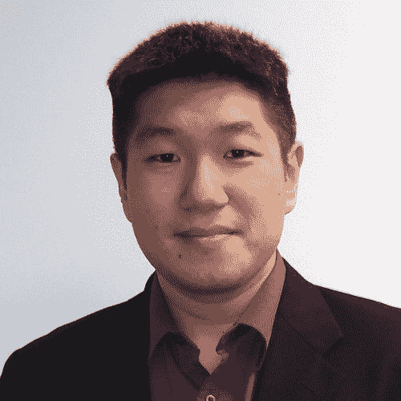

# 将愿望转化为成就——莱斯特的算法交易之旅

> 原文：<https://blog.quantinsti.com/aspirations-achievements-lester-journey-algorithmic-trading/>

交易就是在准确的时刻抓住正确的机会。保持对机遇的开放态度，你会在其中找到你真正的使命。但是随着交易方式的改变，交易者不得不适应和提高他们的技能。

有些人从书本中寻求知识，有些人也从别人的经验中汲取知识。你到处发现一些宝石，在你的生活中使用它们。迟早你会得到生活中想要的东西。

如果你相信这一点，你可能会在个人层面上与莱斯特产生共鸣，并见证他辉煌的学习冒险。我们采访了 Lester Leong，下面是讨论的过程。

### 以下是我们与莱斯特的对话:

#### 你好，莱斯特！给我们介绍一下你自己。

我是 [**Lester Leong**](https://www.linkedin.com/in/lester-leong-mba-mafm-lssbb-09000165/) ，我是一名数据科学家，也是 EPAT 大学的校友。就职业而言，我从事金融领域的数据科学。教育方面，我很好奇，喜欢学习很多东西。我就像任何普通人一样，只是试图利用我们所拥有的所有资源来解决问题。

#### 你在世界上最大的银行之一工作。你能分享一下你现在的角色吗？

是的，我是富国银行(Wells Fargo)数据科学和战略规划副总裁，是的，按市值计算，它也是美国第四大银行。我在上市公司和私营公司的财务部门工作，大部分是中型银行，所以他们的收入必须在 1 亿美元以上。

我以我的身份处理的大多数公司都涉及信用违约或优化公司内部的效率。我使用的另一个模型是时间序列分析，这在 QuantInsti 中有所介绍，因此很明显，用金融数据预测未来肯定有助于金融数据分析。

#### 你一直渴望进入算法交易领域吗？

嗯，有点意思。我是通过读书和跟随迈克尔·科维尔发现交易的——他让我进入了交易，但我只是手动交易，我知道大型 CTA 公司是以自动化的方式进行交易的，这也是帮助我学习定量交易的关键驱动因素之一。显然，量化交易很酷，所以我想成为其中一员。

本科最后一年，我是哲学专业的。但我读了《富爸爸穷爸爸》这本书，它让我了解了金融世界，让我从不同的角度思考金融。我一直以为金融只是帮你报税，但其实远不止如此。由于这些新发现的知识，我获得了金融硕士学位。这教会了我如何理解金融市场是如何运作的。

当我第一次了解宽客时——他们就像是物理学和计算机科学的前博士——基本上是“去华尔街的火箭科学家”。起初，我认为由于我的背景，算法交易不是我可以从事的事情。但是在我的职业生涯中，我遇到了一些人，改变了这一切。我遇到了 QuantInsti，它在某种程度上弥补了我的不足，让我能够稳定而缓慢地理解 Quant 是什么，因此，我现在基本上在做 Quant 的工作。

如果你认为数据科学是数据科学和金融的结合，对于一个定量分析师来说，那么是的，我实际上已经实现了一个目标，我认为如果没有 QuantInsti 的帮助，这个目标是不可能实现的。

#### 在你职业生涯的某个阶段，你曾是一些财富 500 强公司的顾问——这是怎么发生的？

进入商界，从文学学士到金融硕士再到工商管理硕士，这真的是我试图进入金融业的一个功能。由于进入金融行业对我来说很难，所以从事咨询工作比较容易。

首先，我最初报名获得金融 MBA 学位，但我的第一位老师是一名会计师，她教我的东西有点有趣，我意识到，获得金融 MBA 学位通常需要 6 个多月才能获得会计硕士学位。所以，我说，“你知道吗？我们把它装上吧。”

沃伦·巴菲特说过，要理解财务报表，你必须非常了解会计。所以当时感觉这是一个显而易见的事情，然后有了这样的背景，就可以接触到更多的招聘人员和其他咨询工作的合同。

对我来说，这很有趣，因为我认为通过合同，你可以得到一份短期工作，然后为不同的公司工作，然后基本上可以尝试你想去的不同地方。但最终，我进入了富国银行，然后爬到了我现在的位置。

#### 你有无数的证书，硕士和博士学位。根据你的说法，知识在交易中的重要性是什么？

目前我正在哈佛攻读硕士学位。当我是顾问的时候，我想在事业上往上爬。是我的商业教练引导我追求我对分析的兴趣，并激励我做我喜欢做的事情。她帮助我认识到自己的潜力，帮助我实现升职的目标，而不仅仅是做一名分析师或顾问。我应该做一些可能会增加我机会的事情，比如获得一个证书或者去一所名校。因为我已经有了 MBA 学位，我需要做一些不是 MBA 的事情。因此，我去了哈佛。

我个人不认为这些算法交易的学位是必要的，但对我来说，这是我努力改善职业生涯的一个功能。这也取决于我的同龄人，我周围都是对阅读和书籍有悟性的人。所以我有点被联想迷住了。

**最重要的是启动**

有些课程太粗糙，价格很高，而且不像你们那样解释编码。正如我所说，我喜欢学习很多东西，这也是我选择 QuantInsti 的原因。QuantInsti 的美妙之处在于，在我们所有的选择中，没有太多的选择是专门为算法交易定制的。性价比高。突出的是价格点，你得到的教育和你实际能做的实际应用。是最好的选择！

#### 在学习算法交易的过程中，你遇到了哪些挑战？

我认为真正关键的一点，或者我可以说我职业生涯中最大的风险是当我从哲学学士转向金融时。我实际上可以在商业和金融领域工作，这是为了表明我是一名商科学生。

但是抽象地拿出来，这样它可以帮助其他人，这实际上归结到你真正试图隔离的任何问题，试图简化它，把它带到它的核心问题。

所以这实际上可以归结为:

#1 你弄清楚你真正成功的条件是什么。

#2 尽你所能，排队并执行。

一旦你执行了，你当然会失败，但那次失败是你迭代和建立更大成功的机会。

在加入 EPAT 之前，我对如何编写自己的战略和系统代码并不太了解。QuantInsti 实际上展示给以前做过的人看。显然，还有像厄尼·陈博士这样的人，这也使事情变得更有趣了。绝对的。但是，是的，最大的事情是课程项目。它不仅把所有的事情都联系在一起，而且绝对是一个很好的动力，让我有所发展。

总而言之，长话短说，在量化交易中，最重要的是从 QuantInsti 的实际案例开始。投入课程项目实际上是我开发自己的盈利系统的跳板，我实际上想为自己所用。

大多数时候你都是对的，当你错了的时候，你会从中吸取教训，然后你会重新调整并再次执行，这就是让这个角色令人满意的原因。

#### 关于交易，你对以下几点有什么看法？

**数据科学:**一切都在随着数据科学而改变。据我所知，大多数公司现在都开始涉足这一领域。很少有真正站在前沿的大型科技公司。

**分析** **:** 显然，更多的自动化正在相对快速地改进数据分析。所以，我想有更大的事情正在进行中。

自动化 **:** 我想对于这个行业本身来说，它无疑为任何人提供了一个发现它的好机会。我认为就像一个顾问一样，你接近人们的需求，然后你利用机器学习和自动化如何帮助他们。

**创新** **:** 创新肯定会带来创造性的优势，但我还没有一个神奇的公式来持续产生创新。

#### 你希望继续学习更多吗？

哦耶！绝对的。在金融市场上，你知道的大多数盈利策略都不会持续很久，所以你必须发明一种策略来保持领先。基本上，每个人都在向有利可图的交易策略靠拢，这迫使迭代过程。所以永远不会有正面的结局。

我认为交易是一种有趣且有益的经历，不像学术那样，你可以做点什么，写篇论文，然后继续下一件事。在金融市场上，你得到利润回报，你可以用它做更多的事情。

#### **你既学 Python 又学 R？你对此有什么看法？**

我开始学习 Python 和 R 的时候，它们显然是新的，显然是为了统治世界而互相争斗。在开始的时候，当我开始的时候，R 在学术和其他方面更受欢迎，然后 Python 慢慢地稳步发展。Python 有更清晰的语法，所以它赢得了一段时间。最终，今天有很多 Python 在流传。

#### 你认为今天的成功归功于谁？

除了标准的朋友和家人之外，我也钦佩那些人，我从他们身上学到了一些好的品质，并把它们融入到我自己身上。我喜欢沃伦·巴菲特的交易方式——他是一个非常谦逊、非常直率的人，我喜欢他管理财务的方式。我也喜欢复兴科技公司的创始人吉姆·西蒙斯，令我钦佩的是在他职业生涯的后期，大约 60 多岁的时候，他创立了自己的量化对冲基金，成为了亿万富翁。所以，这些是我从不同的人身上挑选的小元素，我只是试着把它们融入我的生活。

谢谢你抽出时间，莱斯特。和你谈论各种话题真是太棒了。我们祝愿你在职业生涯中不断取得成功，学到更多东西。万事如意！

学习是你前进的基础。它以你的技能为基础，帮助你实现你渴望并努力实现的目标。提升自己才是最重要的。算法交易(EPAT)的执行程序确保你具备必要的知识，并提高你的算法交易技能。EPAT 是一门综合课程，涵盖的主题从统计学和计量经济学到金融计算和技术，包括机器学习等等。开始你的探索，与 EPAT 一起提升你的算法交易知识。查看 [**这里**](https://www.quantinsti.com/) 。

<small>免责声明:为了帮助那些正在考虑从事算法和量化交易的人，这个案例研究是根据 QuantInsti 学习者的个人经历整理的。案例研究仅用于说明目的，并不意味着用于投资目的。完成任何 QuantInsti 课程后获得的结果对所有人来说都不尽相同。</small>