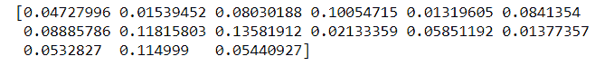
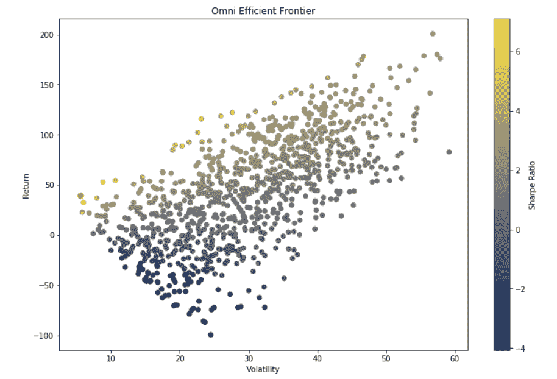
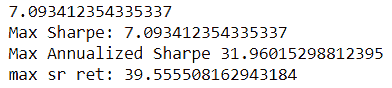
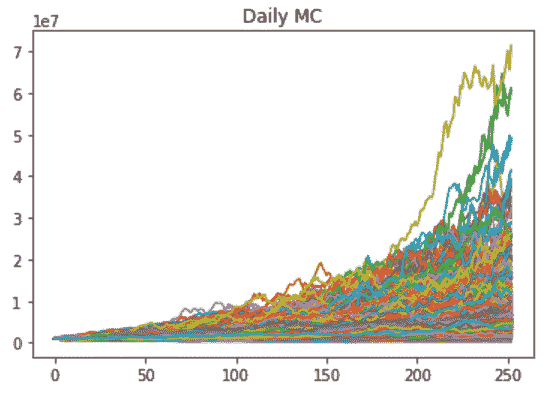
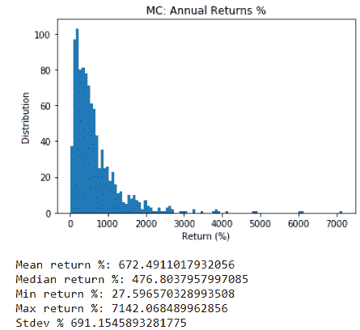
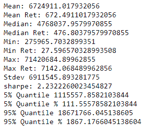

# 蒙特卡洛模拟:定义、示例、代码

> 原文：<https://blog.quantinsti.com/monte-carlo-simulation/>

扎克·奥克斯

几年前，我参加了 HFT 一家期货公司的高级 Delta One/Quantitative Futures 职位的最后一轮面试(出于隐私，未透露姓名)。事情进展得很顺利，我已经回答了三分之二的可笑问题，这些问题只适用于撒哈拉以南非洲或金融面试(比如如何从一个 6 加仑和 4 加仑的罐子里取出 5 加仑)；我感觉很好。他们问我关于我的优化过程——与大多数相比是上篮——我经历了我的过程，并以蒙特卡洛模拟结束，其中他们的 [Quant](https://quantra.quantinsti.com/course/quant-interview-questions-preparation) 负责人*问我如何*运行蒙特卡洛模拟，以及我使用什么参数。

简单的回答是“我在多图表中运行它”，我点击蒙特卡洛——但是我决定尝试解释我的 Python 代码。我太沉迷于它了，到最后我失去了我的位置，忘记了蒙特卡洛真正在做什么。本应是一个全垒打的答案却成了一个马虎的、拖拖拉拉的、乱七八糟的答案，同时错过了关键点。我本质上解释了世界上最令人困惑的回溯测试/参数优化，并且在我解释的时候对什么是*独特的*一片空白。我想强调的一点是，蒙特卡洛的不仅仅是五彩缤纷的线条图。

幸运的是，我后来意识到我在抓什么——我用了我最喜欢的比喻；如果回溯测试是一个阶梯，蒙特卡洛随机地重新排列阶梯上的梯级，并确定可能结果的可能性。*那个*是一个答案——要是我的*第一个*答案就好了。不用说，我没有得到这份工作，但它给了我重要的一课——知道*你的模型和代码在做什么和能够编写它们一样重要。*

读完这篇文章后，我将确保你不会成为用蒙特卡罗这样的模型将自己编码到一个角落的受害者。首先，让我澄清一下，蒙特卡洛优化有几种不同的*类型*——它们并不都是同等创建的。首先，有完全随机的蒙特卡罗，在一个正态分布蒙特卡罗的随机，和简单的随机交易订单。随机可以进一步分为有或没有替换，但我将把它分为这三种类型

—随着我们的继续，这应该对你更有意义。我将主要关注完全(伪)随机蒙特卡罗，因为我发现它们是最有用的/最不容易出错的(关于正态分布局限性的更多信息，我鼓励你阅读纳西姆·尼古拉斯·塔勒布的 Incerto 系列)。

你们中的许多人听说过或广泛使用过蒙特卡罗优化或模拟方法——它是测量不可预测性的无价工具。它们不仅在优化问题中有用，而且对于预测诸如最大 DD 之类的事情，或者诸如你的储蓄足够支付退休费用的概率之类的复杂场景也非常有用。我主要将它们用于开发的两个关键部分；投资组合选择/优化，以及系统/投资组合压力测试。在我们深入应用之前，让我解释一下什么是蒙特卡罗模拟。

蒙特卡罗(MC)模拟是用于模拟复杂事件概率的模型，通过用预先确定的“随机”(变化)变量汇编成千上万种不同的结果。本质上，您使用特定变量的随机值运行 10k 次迭代，希望找到最佳值或确定一系列可能的结果，即使用随机性来解决复杂的问题。一个简单的例子是，根据“随机”证券权重，对投资组合的最大夏普比率进行建模——因此，您有一个由 AAPL、AMZN、AMD 和 ADBE 组成的投资组合，您希望确定这些证券的理想权重，以最大化夏普比率。

另一个更常见的场景是使用蒙特卡罗模拟来确定结果的概率——例如，给定投资组合的回报特征(均值、标准差)和初始余额，投资组合的破产风险%。从金融和工程到物流或社会科学，蒙特卡罗模拟在几乎每个领域都有应用。许多常见的指标，如 VaR 和 CVaR(风险条件价值)，其核心都是从蒙特卡洛模拟中得出的，并已被证明是量化工具中的一个有价值的工具。

从中得出的最重要的一点是蒙特卡洛模拟人是无限灵活的

—如果你需要解决一个你 ***无法*** 解决的问题，蒙特卡洛模拟有可能让你非常接近正确答案。最近，我试图找到一种方法来优化利用期货市场利差的复杂策略，这种优化算法简直要了我的命。我决定我可以将传播率设置为一个随机变量，并将其作为蒙特卡罗模拟来运行，至少可以得到正确的方向——在 5 分钟& 100k 次迭代中，我有了一个简单的 15 行解决方案，解决了一个问题，当我最初试图使用最小化函数时，我可能需要 350 行 Python 代码。这是你工具箱里的活动扳手。

让我们开始吧，我将对这段代码进行注释，这样就不会太清楚什么在做什么。首先，我们需要你的安全报告。这可以从系统性能(比如我的例子)中提取，也可以通过 quantrautil 使用简单的价格数据提取。DF 应该是以证券报价机为列，有日期行和每日回报值。从技术上来说，它应该是对数回归，所以我已经包括了那个计算——但是差别通常是无关紧要的。

首先初始化数组以保存蒙特卡洛运行的性能值，并设置蒙特卡洛模拟循环，在您的 PC 允许的范围内尽可能多地定义运行次数(从 1k 左右开始，按比例增加)。重要的是要记住权重，这是蒙特卡洛模拟的魔力，因为它每次都会选择一个新值，并为优化提供动力，使每次运行都独一无二。还要注意你保存的每个值(ret，vol，Sharpe)实际上是一个数组，每次运行时都进行索引保存——所以 run 0 开始，随机化权重，并计算回报，将其保存到 ret arr 中的 index 0，然后 vol 保存到 index 0，最后是 SR。一旦你循环完成，你在 SR arr 中运行 argmax()函数(*或你最大化的任何值*)，这将为你提供一个权重，在我的示例中为 477。这个均值跑 477 给了你最高的 SR 值，那就是你的理想体重！您可以找到所有重量的最佳值，用您的最大跑步次数进行索引

(我还包含了一个助手函数，用于将权重和报价器保存到 DF 中，并将其 Pkl 以供参考)。

```
#Normalize returns--Nat Log -- Technically, it uses log returns, but the difference is immaterial.
#log_ret = np.log(ret/ret.shift(1)) #Calc for log returns, if official is important (This is instead of pct_change())
log_ret = pct
ret = log_ret
#Create Temporary (Random) weights
weights = np.array(np.random.random(15)) #USE NUM SECURITIESS 

#Rebalance w/ constraints (CANNOT BE > 1)
weights = weights/np.sum(weights)
print(weights)

#DEFINE ARRAYS FOR STORING METRICS 
num_runs = 1000    #Kick this number up 10k-100k for better results
all_weights = np.zeros((num_runs,len(ret.columns)))
ret_arr = np.zeros(num_runs)
vol_arr = np.zeros(num_runs)
sharpe_arr = np.zeros(num_runs)

#Begin MC Loop
for run in range(num_runs):

    #Weights
    weights = np.array(np.random.random(15))  #CHG to number securities *** THIS is the key to MC, this random value creation for weights
    #If you're looking for a challenge, try using a poisson, gamma or Student T dist!
    weights = weights/np.sum(weights)

    #Save weights (For reference Later)
    all_weights[run,:] = weights

    #Expected Ret (Record each runs return in ret_arr)
    exp_ret = np.sum((log_ret.mean() * weights) * 252)
    ret_arr[run] = np.sum( (log_ret.mean() * weights) * 252) #Time =  year

    #Exp Vol: (Lets attempt some linear algebra w/out runtime error!)
    exp_vol = np.sum((log_ret.std() * weights) * 252)
    # Sqrt of dot product of Transposed weights X Cov of Log returns & weights--whew.
    vol_arr[run] = np.sqrt(np.dot(weights.T,np.dot(log_ret.cov()*252,weights)))

    #Sharpe
    SR = exp_ret/exp_vol
sharpe_arr[run] = ret_arr[run]/vol_arr[run]
```



如果你像我一样是一个视觉型的人，你可以用一个快速的 pyplot 来绘制它，使用 retarr 和 volarr max 值，并且可以选择最大锐化来高亮显示，如图所示。那还不算太糟！

```
import matplotlib.pyplot as plt
'''Plot the Markowitz efficient frontier'''
plt.figure(figsize=(12,8))
plt.scatter(vol_arr, ret_arr, c=sharpe_arr, cmap='cividis')
plt.colorbar(label='Sharpe Ratio')
plt.xlabel('Volatility')
plt.ylabel('Return')
plt.title('Omni Efficient Frontier')
plt.scatter(max_sr_vol, max_sr_ret,c='red', s=50) # red dot
plt.show()

```



记住，你可以让这些回报和波动列最大化你想要的任何东西——相关性，贝塔，任何东西。你还可以在合理的范围内随机化任何你想优化的东西——你只需要确保逻辑工作，并且它被正确地结合(提示:我已经采取了整个策略，并且在计算回报时简单地在最后放了一个蒙特卡罗模拟循环，并添加了要随机化的权重或阈值，然后乘以回报来优化它们——理论上它甚至可以在条目之前随机化，只需要在那里放一个循环并随机化你的条目特征。).我的希望是为你打开一个蒙特卡洛模拟的可能性世界，来解决你从未想过可能的方程。

```
#sharpe_arr.argmax()
#MC_SR = sharpe_arr[7145] #Plug in to sharpe_arr10.094382

#find max SR per vol arr and SR array (for plotting)
max_sr_vol = vol_arr[sharpe_arr.argmax()]
max_sr_ret = ret_arr[sharpe_arr.argmax()] #85563 is max idx

#Save optimal weights, calc SR_annualized, 
idx = sharpe_arr.argmax()
#all_weights[idx]
MC_SR = sharpe_arr[idx]
print(MC_SR)
SR_ann = np.sqrt((MC_SR))*12
SR_ann

print('Max Sharpe:',MC_SR)
print('Max Annualized Sharpe',SR_ann)
print('max sr ret:',max_sr_ret)
#print('Max sr vol:',max_sr_vol)

```



我的下一个例子是一个更常见的蒙特卡罗模拟方法，使用投资组合特征来预测预期收益、方差和最坏情况。我将在我的示例中使用相同的数据，并将它们绘制出来以便可视化。别担心，这个简单多了。

这个例子只需要你得出你的系统/投资组合的日平均(对数)回报和日标准差。一旦你插入这些值，你就拥有了你所需要的一切，只需在 range()中插入一些迭代，并确保你的图在循环的内，用。*秀()*外。

```
import numpy as np
import numpy.random as nrand
import matplotlib.pyplot as plt
import math

#Define vars
S = 1000000
T = 252
mu = 1.92246
vol = .86123  #Between .76 and .86

result = []
for i in range(1000):
    daily_returns = np.random.normal(mu/T,vol/math.sqrt(T),T)+1

    price_list = [S]

    for x in daily_returns:
        price_list.append(price_list[-1]*x)
    result.append(price_list[-1]) #appending each runs end value --to calculate the mean return

    plt.plot(price_list)#This is key, KEEP THIS IN LOOP,votherwise it will plot one iteration/return path.
plt.title('Daily MC')
plt.show()

```



这张图表虽然有点漂亮，但不是很有用；我更喜欢的利用方法是把它绘制成一个分布图，并采用投资组合运行的各种度量。请记住，这只是使用您的日均值和标准差来运行 1000 年的 1 年(T 值)性能轨迹。我在这里使用了一个正态分布的随机因子来使直方图更清晰，但是你可以在这里使用任何随机分布或者完全随机的值/样本！尝试各种模型，看看它们是如何变化的。

```
res = [i/S*100 for i in result]
plt.title('MC: Annual Returns %')
plt.xlabel('Return (%)')
plt.ylabel('Distribution')
plt.hist(res,bins=100)
plt.show()

print('Mean return %:',np.mean(res))
print('Median return %:',np.median(res))
print('Min return %:',np.min(res))
print('Max return %:',np.max(res))
#print('Mode:',stats.mode(result))
print('Stdev %', stdev(res))

```



我喜欢计算各种百分位数，跟踪各种常见指标的最小值。直方图提供了一个更清晰的画面——就绝对值而言，它可能看起来很大，所以我喜欢用它除以初始帐户值，以使它成为百分比值。这应该很简单，除了可能的列表补偿，它只是将每次运行的结果作为初始帐户值的百分比。

```
from scipy import stats
from statistics import stdev

print('Mean:',np.mean(result))
print('Mean Ret:',np.mean(result)/S*100)
print('Median:',np.median(result))
print('Median Ret:',np.median(result)/S*100)
print('Min:',np.min(result))
print('Min Ret:',np.min(result)/S*100)
print('Max:',np.max(result))
print('Max Ret:',np.max(result)/S*100)
#print('Mode:',stats.mode(result))
print('Stdev', stdev(result))
mc_mu = np.mean(result)
med = np.median(result)
mc_min = np.min(result)
mx = np.max(result)
std = stdev(result)

metrics = [mc_mu,med,mc_min,mx]
print('sharpe:',mu/vol)

print('5% Quantile',np.percentile(result,5))
print('5% Quantile %',np.percentile(result,5)/S*100)
print('95% Quantile',np.percentile(result,95))
print('95% Quantile %',np.percentile(result,95)/S*100)

```



这就是我们所拥有的——蒙特卡罗模拟是我们所拥有的最灵活的模型之一，熟悉这些模型的内部工作方式可以在优化复杂问题时产生很大的影响。我希望你也已经学会了不要用一个复杂的回答来回答蒙特卡洛面试问题，这种回答没有抓住要点，要深入挖掘基本的运动部分，因为这才是这些模型真正的魅力所在。掌握蒙特卡罗方法将为你提供解决不可逾越的方程和站不住脚的问题的工具——当然，也可以制作非常丰富多彩的线图。

交易愉快！扎克·奥克斯

*<small>免责声明:本客座博文中提供的观点、意见和信息仅属于作者个人，不代表 QuantInsti 的观点、意见和信息。本文中所做的任何陈述或共享的链接的准确性、完整性和有效性都不能得到保证。我们对任何错误、遗漏或陈述不承担任何责任。与侵犯知识产权相关的任何责任由他们承担。</small>T3】*

**Files in the download:**

*   蒙特卡洛的 Python 笔记本
*   返回八月份的文件，了解优化模型的快速使用案例