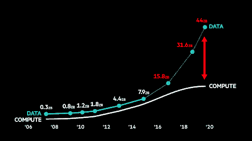
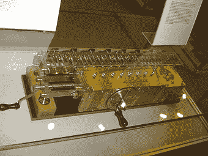
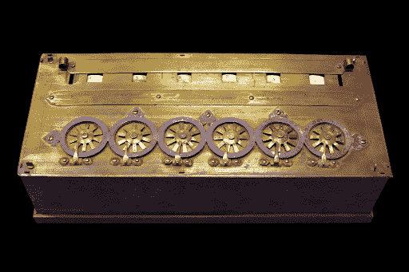
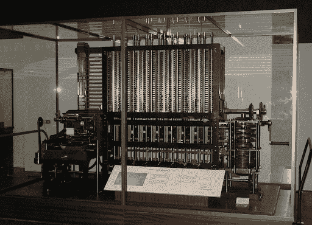
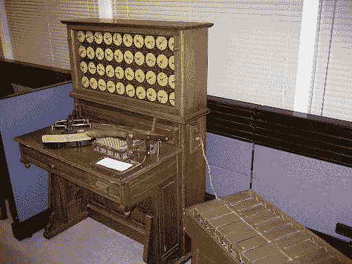
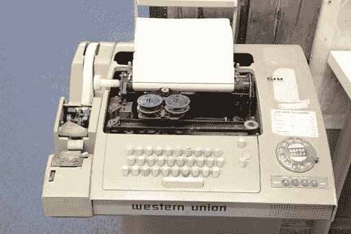
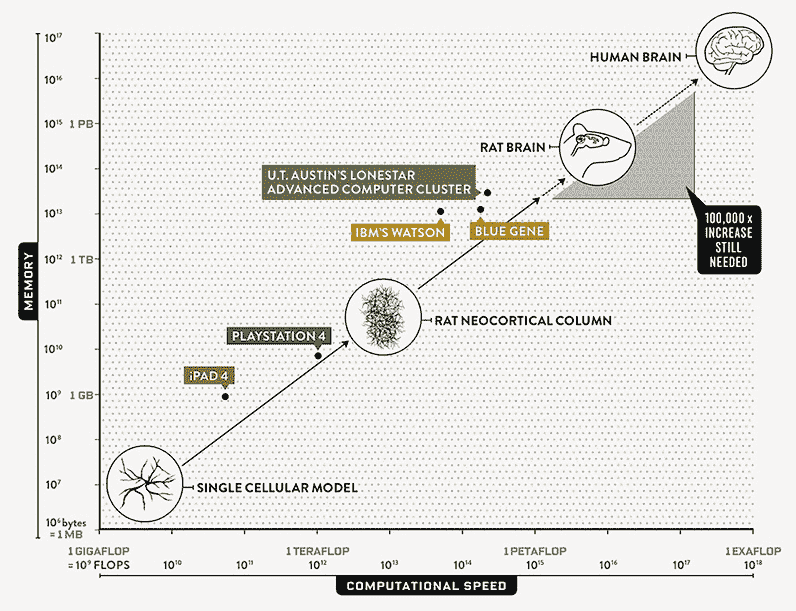

# 计算之旅:从帕斯卡的计算器到机器学习

> 原文：<https://blog.quantinsti.com/journey-computing/>

由[普尼特·南迪](https://www.linkedin.com/in/punit-nandi-bb46a5120/)

正如我们今天所知道的，计算机或计算设备被用于大量的活动，从计算数据、与数千英里之外的人通信、娱乐、记录和保管文件等等。

然而，当计算机或计算机器的概念首次概念化时，它是一个严肃的行业，主要用于处理大量的数字。即使现在回想起来也很有趣，考虑到当前的技术场景，那些相同的计算可以通过智能手机等小型计算设备以快数百倍的速度完成。然而，它看起来很迷人，从来没有这么容易，人类花了超过四百年(400 年)来完成这一转变，围绕这一转变的事实确实令人惊讶。

围绕计算发展的另一个有趣因素是数据生成。仅仅在过去两年内，我们就创造了当今世界大约 90%的数据，这简直令人难以置信。



**IDC/EMC 数字世界报告 2008-2017 年数据曲线<small>鸣谢:Weforum.org</small>T3】**

在这篇博客中，我们将踏上一趟计算世界的旅程，了解计算最初是如何开始的，以及自那以后我们所取得的成就。我们还将在博客中专门用一小部分来介绍数据生成的发展。

本博客分为以下几类:

*   [早期计算时代](#The)
*   [数据存储的里程碑](#A)
*   [电信和计算机的开始](#Beginning)
*   [现代计算机和编程](#Modern)
*   [个人电脑革命](#Personal)
*   [人工智能、机器学习和数据科学](#Artificial)
*   [互联网、数据爆炸和金融市场](#Internet)

## 早期计算时代

这可以追溯到 17 世纪中期，当时哲学家“Ramon Llull”进行了思想实验，以创建能够以非常系统和简单的方式产生新知识的逻辑机器。鉴于技术资源匮乏，当时不可能制造出这样的机器。然而，它让位于一种新的思维方式，即计算逻辑运算符和创建有意义的结论，从而增加价值。Ramon Llull 的工作对德国数学家 Gottfried Leibniz 的工作产生了重大影响，他在 1671 年设计了一台机器，可以通过连续加法进行乘法，并通过连续减法(带小数)进行除法，这就是所谓的“步计算器”。莱布尼茨一直是使用计算机的信徒，并表示聪明人不应该在计算上浪费时间。



**<small>【步行者 Wikipedia.com】</small>**

有趣的是，大约在莱布尼茨的发明之前三十年，在德国附近的一片土地上，法国数学家布莱士·帕斯卡发明了帕斯卡林。帕斯卡林，发明于 1642-1644 年，是一个主要的计算器或累加器，用于在输入数字的同时通过操纵表盘来单独做加法和减法。下面是同样的一张图片:



**<small>【Pascal ine(Wikipedia . com)</small>**

帕斯卡灵问世近 10 年后，受帕斯卡工作的影响，塞缪尔·莫兰发明了两种计算器，这两种计算器有八个表盘，可以用触笔移动。幸存下来的一个模型，可以添加多达一百万个小数。

虽然 17 世纪对计算机行业来说是不可思议的，但相对而言，18 世纪几乎没有开创性的发明。到 1800 年初，确切地说，是 1804-05 年，约瑟夫·贾卡发明了提花系统。他的系统使用可互换的穿孔卡片来控制布料的编织，并且可以设计任何图案。这些穿孔卡片后来被伟大的发明家如查尔斯·巴贝奇和赫尔曼·何乐礼用于开创性的计算机器。真实地说，即使 Jacquard 系统没有直接连接到计算数字，它的计算架构对后来设计的计算引擎是一个很大的补充。

大约 20 年后，第一台计算设备由查尔斯·巴贝奇制造，名为“差异引擎”。他在 1822 年宣布了它的发明，并在 1822-1830 年间建造了它。与简单的计算器相比，它是一种高级升级产品。它有能力对多个变量进行一系列计算，以计算复杂的数字。它的工作原理是“n + 1 ”,一旦任务完成，它还可以被重置。差异引擎也有一个临时数据存储系统，用于额外的高级过程，并有金属指针来标记其输出，这些输出后来被打印在印刷版上。它是一台逻辑结构化的计算机器，对现代计算产生了巨大影响。



**<small>【差异引擎(演职员表:Wikipedia.com)</small>**

有趣的是，在同一时期，年轻而聪明的数学家阿达·洛芙莱斯在一次聚会上遇到了查尔斯·巴贝奇，两人开始研究“分析引擎”。她还被誉为“世界上第一个程序员”，这个词至今仍在圈内引起激烈争论。她的第一个程序围绕着“伯努利数”的计算，这本身被认为是数学中最古老和有趣的问题之一。分析引擎的一个关键属性是将数字和指令存放在临时存储器中，并在需要时计算这些数字。这是通过在其阅读器中订购适当的指令和数据来实现的。存储数字以供临时使用的想法在今天仍然非常流行，并且被用于现代商业计算器甚至是最简单的计算设备中。鉴于所有这些事件，很明显，探索计算领域或计算领域的想法正在学术界和研究界兴起。

## 数据存储的里程碑

19 世纪 80 年代，年轻的美国发明家赫尔曼·何乐礼发明了制表机，专门用于计算美国人口普查。这是一种机电计算设备，用于在穿孔卡片上存储和汇总信息。它有一个简单的机制，机器一次读取一张穿孔卡片，并按时间顺序打印出来，然后将算术值存储在累加器中。由此，我们可以说数据存储的重要性是显而易见的，这一领域的进步也是后来才有的。制表机的改良版本甚至在最近的 20 世纪 80 年代中期就开始使用，直到今天，在全球各地的投票中都能看到。



**<small>【制表机(演职员表:Wikipedia.com)</small>**

## 电信和计算机的开始

1903 年，尼古拉·特斯拉(有史以来最伟大的发明家之一)因其发明“信令系统”获得美国专利号 725605，该发明提到通过无线传输传输信息，后来还被用于跳频扩频系统(FHSS)的发明。FHSS 使用一种方法将修改后的无线电波信号快速传播到不同的频道，这种方法只有信号的发送方和接收方知道。这种技术现在被用在一些通信系统中，如蓝牙、局域网等。

演员兼发明家海迪·拉马尔在她的专利发明“秘密通信系统”中也提到了我们目前在 FHSS 技术中使用的机制。它是为美国海军在第二次世界大战期间用于干扰网络而开发的，然而，它从未被美国海军用于任何目的。简而言之，FHSS 利用频率和时间的函数来增加带宽。这目前用于创建安全连接，增加通信信道的范围，并减少噪音和无线电干扰。

通过跳频扩频系统(FHSS)的发明可以正确地推断出电信的开始。

### 快速发展阶段

电信是现代计算发展的主要驱动力之一。在 20 世纪 30 年代早期，发明了电传消息系统或网络，其中双向文本消息可以通过使用电话级连接电路将电传打字机连接到同一电话网络来执行。这是第一次如此精确地进行双向交流。电传信息的主要进步之一是“你是谁”代码。通过这个代码，一旦消息被发送，对消息的回复也可以被发送以完成通信会话。电传信息系统的这种交互功能给这种设备带来了巨大的普及。



**<small>【Wikipedia.com】</small>**

### 图灵和人工智能

1937 年 1 月，一位年轻的计算机科学家艾伦·图灵发表了一篇关于“可计算数字及其在决策问题中的应用”的研究论文，这篇论文中的某些理论为今天的现代计算机科学奠定了基础。他提到了一个假设的计算机器的理论模型，如果给定变量的输入，它可以确定结果。这就是后来被称为**“图灵机”。**现在，可能有不同类型的图灵机和一个**“通用机器”**可以被创造出来模拟所有的图灵机。所有这些都是图灵本人提出的。难怪他被认为是**【计算机科学之父】**。

图灵也被广泛认为是人工智能领域最早的先驱。他提出了**“图灵测试”，**这是一个理论概念，如果计算机能够提供与人类相似的结果，那么计算机就能通过测试。测试的设置是这样的，第一个人在一个房间里充当提问者，第二个人和计算机在另一个房间里充当回答者。第一个人和第二个人会问一系列问题，计算机会回答这些问题。如果第一个人有 30%的时间被欺骗，认为响应来自人类而不是计算机，那么这台计算机就被认为通过了“图灵测试”。尽管这被广泛认为是一个艰难的基准，但在图灵测试存在 65 年后的 2014 年，聊天工具“尤金·古斯曼”在伦敦有 33%的时间通过了提问者杜平的测试。在这里阅读更多。

这项测试被认为是导致人工智能发展的重要理论之一，并使“思维机器”的概念概念化，这是大多数现代计算机科学家一直在努力的事情！

## 现代计算机和编程

尽管取得了所有这些进步，但直到 1954 年末，随着 IBM 650 的推出，商用计算机的真正市场才开始出现，IBM 650 具有两种状态和五种状态组成的十进制数的数据和地址。例如“01-00100”。它能把穿孔卡片上的字母和特殊字符转换成两位小数。这台机器的这一特点尤其吸引了学生以及来自商界和科学界的人士。它售出了大约 2000 台，与当时其他可用的计算机相比，这是一个巨大的数字。甚至 IBM 曾经提到，“没有其他电子计算机生产出如此大的数量。”。

1957 年，IBM 的研究人员推出了一个数值计算程序“FORTRAN”。它也被称为“编程系统之父”。FORTRAN 的逻辑后来被编译成流行的编程语言，如 C、C++等。最初启动时，它有 32 个语句，包括 DO、IF 等。有趣的是，它使用了“IF”语句，该语句的概率用著名的“蒙特卡罗模拟”原理进行加权，该原理用于优化内存中的基本块。即使按照目前的计算标准，这也是一种非常先进的优化技术。下面是一个 FORTRAN 90 语言的例子:

```
*PROGRAM Triangle*
 *IMPLICIT NONE*
 *REAL :: a, b, c, Area*
 *PRINT *, 'Welcome, please enter the&*
 *&lengths of the 3 sides.'*
 *READ *, a, b, c*
 *PRINT *, 'Triangle''s area: ', Area(a,b,c)*
 *END PROGRAM Triangle*
 *FUNCTION Area(x,y,z)*
 *IMPLICIT NONE*
 *REAL :: Area ! function type*
 *REAL, INTENT( IN ) :: x, y, z*
 *REAL :: theta, height*
 *theta = ACOS((x**2+y**2-z**2)/(2.0*x*y))*
 *height = x*SIN(theta); Area = 0.5*y*height*
 *END FUNCTION Area*
```

<small>来源:[一个 Fortran 90 程序的例子](http://www.mrao.cam.ac.uk/~pa/f90Notes/HTMLNotesnode40.html)T3】</small>

由于其数学风格，输入也应用相同的逻辑。

鉴于代码的简单性，一个非程序员第一次可以知道一个程序到底能做什么，并同时理解它。这是向更广泛的受众开放计算设备的有力一步。此外，在 1958 年:杰克·基尔比和罗伯特·诺伊斯推出了集成电路。尽管他们分别从事这项工作，但他们的发明彼此非常相似。Kilby 发明了一种混合集成电路(互连微芯片)，Noyce 发明了一种完整的单片集成电路(一个小半导体芯片上的一组电子电路)。这是计算机行业的一个巨大转折点，因为集成电路首先尺寸非常小，同时成本很低。这意味着计算设备可以以比以前更大的规模生产，并以有利于生产商的最优价格生产。

### 第一个调制解调器

1958 年，贝尔实验室(现称美国电话电报公司)推出了贝尔 101 数据电话。数据电话类似于现代的调制解调器，借助电话线，数据可以以每秒 110 位的速度从一台计算机传送到另一台计算机。然而，贝尔 103 调制解调器比它的前身更成功，能以每秒 300 位的速度传输更多的数据。事实上，Bell 103 调制解调器今天仍在用于非商业目的。

### 基本语言

随着所有的发明都发生在计算领域，编程界也呈指数增长，到 1964 年，Thomas E. Kurtz 和 John G. Kemeny 推出了最初的 BASIC 语言。BASIC 最初在每一行的开头使用的数字，用来表示程序中命令的顺序。线被编号为 30、40、50 等。这也可以在需要时在命令之间放置额外的方向。另一个元素“GOTO”语句循环回到先前指示的方向。

例如，BASIC 程序的第 350 行将具有“if”子句，该子句指示计算设备在变量大于 40 时跳回到第 200 行。该指令可按如下方式编程:

```
350 IF (N >40) THEN GOTO 200
```

BASIC 语言受到 ALGOL58 之类的算法的影响，ALGOL 58 的概念是基于块结构的概念，通过执行“begin”和“end”或类似的关键字来创建边界。1969 年，贝尔实验室的开发人员创造了 UNIX 操作系统，解决了兼容性问题，延续了令人兴奋的新编程语言趋势。该操作系统是可移植的，可以跨多个平台转移，这使得它在政府机构和商业实体中很受欢迎。

### 70 年代

到 20 世纪 70 年代初，计算机行业的发展已经开始有了明确的方向。新发明开始彻底改变计算机行业。例如，1970 年，英特尔公司推出了英特尔 1103(一种主要的商用动态存取存储器(DRAM)芯片)。这使得微小的电容器和晶体管在存储单元中存储每一位数据，从而实现更好的数据传输。

1971 年，阿兰·舒加特和他在 IBM 的团队设计了“软盘”，允许计算机之间的知识共享。这一吸引人的商业策略使拥有技术的消费者能够在他们之间分享知识，这一策略非常受欢迎，并且已经开始作为一个整体塑造计算机行业的未来商业决策。

1973 年，施乐公司的研究人员推出了“以太网”。它创造了一种可以远程连接多台计算机的技术。这是一个转折时期，也是互联网革命的巨大财富，这场革命将在十年内冲击大众。与最初的版本相比，现在的以太网更大、更快、更先进。以太网网络目前分为 4 种速度，可以在每种速度下平稳运行。速度范围从 10 Mbps 开始，限制到更高的 10，000 Mbps。无论何时发明了更快的版本，它都不会淘汰旧版本，而是以太网控制器转换其速度以匹配最慢的连接设备，这在混合两种技术时非常有用。

在程序设计方面，C 语言，可以说是一种主要的程序设计语言，是由丹尼斯·里奇于 1972 年开发的。c 与以前的编程语言完全不同，可以被称为过渡性的计算语言，它提供了一种更新更好的编程语言编写方式。C 充分利用了指针，被创造得快速而强大。然而，由于它是高级语言，C 很难读懂。但它修正了早期发明的“帕斯卡”中普遍存在的大多数错误。这种语言的语法非常简单，并且只需要很少的内存。这就是为什么它至今仍在使用，并且这种语言的组成部分已被用于其他主要语言，如 C++，Java 等。

## 个人电脑革命

随着 HP 3000、HP 2640 系列、Apple I/II/III、Apple Lisa、IBM S 34/36/38 的推出，70 年代末和 80 年代推出了一批小型机，消费者在购买小型机时有了很多选择。有趣的是，英特尔成为了 IBM 的微芯片供应商，并创造了像英特尔 80386 这样的成功产品，这是一种 32 位微处理器芯片，比当时生产的任何英特尔芯片都快几倍。事实上，它已经成为一种标准处理器，并被“康柏”公司用于其个人计算设备。多进程快速计算设备的想法是科技公司的一个关键动力，最终，消费者对这种设备的需求增加了。此外，在同一时期，SQL、Mathematica、Octave、Matlab 和 Python 等语言相继发布，改善了计算行业的硬件和软件。这些语言在计算行业中仍然非常流行，并且在高度计算的计算中大量使用。

### 信息时代还是互联网时代

互联网在 20 世纪 90 年代开始流行，是人类有史以来最引人入胜的技术发明。为了评估互联网的可能性，美国高级研究计划局(ARPA)设立了一项基金，用于研究和开发学术界和政府实体之间的通信网络。1969 年，阿帕网启动，成为第一个也是同类网络系统之一。直到 1990 年，当蒂姆·伯纳斯·李(人们普遍认为他是互联网的创造者)和欧洲核研究组织的其他人提出了一个协议，其核心是基于超文本的协议，以使信息传播更容易时，ARPA 创建一个可以将知识链接在一起的网络的愿望才得以实现。

这也是第一次使用 TCP/IP 技术，这种技术如今在互联网网络中广泛使用。这导致了私营组织跟随政府的步伐为互联网提供资金，到 20 世纪 90 年代，商业组织开始将其系统互联。1991 年，这导致了万维网(WWW)的诞生，它仍然是计算机行业最大的革命之一。其系统网络使用户创建网页成为可能。美国国家超级计算应用中心的一组程序员发明了使使用互联网更容易的“浏览器”，1994 年成立的网景通信公司推出了“马赛克网景 0.9”以使这项新发明的技术商业化。

互联网革命的另一个推动力是 HTML 的引入，HTML 不仅仅是超文本(包含网站链接的一个或多个单词)。它的工作方式是在屏幕上显示文本和图像，决定计算设备如何对按键或鼠标点击做出反应。HTML 之所以流行，是因为它可以用任何类型的计算设备阅读，同时又非常经济。网页设计者可以在小尺寸的网页上创建丰富的图形。小文件在像互联网这样的网络上很重要，因为它们在相距很远的计算设备上交换信息更快更容易。

随着 HTML 的发明，网络诞生了。HTML 使得创建包含图像、视频和声音的网站变得简单而容易。这个小文件允许通过互联网快速交流。在很短的时间内，每个人都意识到了网络作为全球交流工具的潜力，并希望尽快掌握它。网络发展迅速，正如我们今天所知，每天有数百万人出于各种目的访问互联网，如新闻、娱乐、购物等。后来，HTML 的各种版本相继推出，提高了效率，并在某种程度上控制了网页的行为。

## 人工智能、机器学习和数据科学

“数据科学”这个术语第一次被听到是在 1974 年初，当时彼得·诺尔发表了他的论文“计算机方法简明概览”。后来，威廉·克利夫兰在 2001 年发表了他的论文《数据科学:扩展统计领域技术领域的行动计划》，强调它是一门独立于计算机科学的思想学科。

应用著名的帕金森定律，数据应该扩展，直到填满磁盘空间。“数据-磁盘”交互是一个指数级的积极事件，一连串的事件导致人们购买越来越多的磁盘，同时产生越来越多的数据。有趣的是，这违背了经济学的供求原则。这一系列磁盘数据事件是产生“大数据”的原因。大数据是众所周知的数据集，它非常大，因此在常规数据库管理工具的帮助下执行时变得复杂和难以分析。它被用来总结模式、人类行为，也用来在分析过去之后预测未来。大数据已经成为一种非常流行的技术，几乎应用于每个行业。

云计算的发明满足了以更高效的方式计算大数据的需求。它是在亚马逊、谷歌和微软等科技巨头的参与下创建的。云计算中最重要的分析工具之一是 Hadoop。Hadoop 用于计算云平台上的大数据。

标准的计算规范是将数据传递给算法。Hadoop 计算风格遵循与标准计算风格相反的原则。数据太大了，无法放入算法中。相反，它将算法的许多副本推送到数据中。

事实证明 Hadoop 也很难执行。它需要先进的计算能力。由此，也创造了一个创建分析工具的市场，这需要可以在 Hadoop 上运行的更简单的界面。

除了全球的技术进步，计算行业开始转向机器学习的应用，该应用专注于让算法从可用数据中进行自我学习，以便根据之前收集的信息对未分析的数据进行判断和预测。一般来说，**机器学习**分为三个关键部分:

*   监督机器学习算法
*   无监督机器学习算法
*   强化机器学习算法

## 互联网、数据爆炸和金融市场

随着互联网的广泛使用，金融市场也变得高效起来。现在，任何人都可以在任何交易所交易美国存托凭证(ADR ),但须遵守特定的条款和条件。甚至围绕美国存托凭证与交易所内等价股票价格交易之间的差异原理，建立了套利策略。互联网带来了数据爆炸，到 2000 年代中期，它通过提供为所有人创造公平竞争技术的工具和技术，使金融市场民主化。然而，鉴于信息传播的增加，这也导致波动性增加。互联网使企业、金融市场和交易交易所按照均衡状态进行供应和分配，在互联网渗透之前，这种均衡状态存在地理边界和复杂的国与国之间的法规等障碍。

互联网将所有公司聚集在一起，在消除不平等的同时，加强了金融市场的公平竞争。

算法交易是结合了统计学、计算机科学和金融领域的最新产品，它提高了市场的效率。算法交易开始于 20 世纪 80 年代末和 90 年代。人们经常批评它让 1987 年的美国市场崩盘变得比预期更糟糕。算法交易在 2001 年开始流行，当时 IBM 和 HP 分别推出了他们的算法策略 MGD 和 ZIP，它们成功地击败了人类交易者，并在市场上产生了更好的 alpha。算法交易基于算法或小指令的原理，因此让位于高频交易，这种交易在很短的时间内进行数百万次交易。这也增加了市场的流动性和更好的资产定价。

## 结论

1965 年，当戈登·摩尔向全世界宣布摩尔定律时，他就已经预测到了计算或计算能力的增长。该定律指出，自第一个集成电路问世以来，集成电路上每平方英寸的晶体管数量每年都会翻一番。

摩尔当时预测，这种模式在未来仍会看到。然而，近年来，这种趋势已经失去了它的步伐，然而，它仍然是一个引人注目的增长故事。包括摩尔本人在内的大多数专家预计，摩尔定律将在 2020-2025 年之前有效，然后开始对增长失去意义。

与人类 10000 多年的历史相比，过去 4 到 5 个世纪中计算和计算设备的发展是非常惊人的。这一切都始于以更好的方式执行计算的冲动，几个世纪后的今天，大型高速计算设备在几秒钟内完成了数百万次计算。未来会有更多这样的模范发明和先进技术被发现，这将使我们的生活变得更加轻松和无忧无虑。总而言之，现代计算让人们的生活变得更加轻松和舒适。技术进步提供了与数十亿人保持联系的机会，这些人可能在世界的不同地方，但仍然可以非常轻松地相互交流。

最后，我想给你们留下一个精彩的数据表示，它比较了人脑可以容纳的数据和目前计算设备可以容纳的数据。



**<small>【记忆量表(演员表:Visualcapitalist.com)</small>**

如果你想学习算法交易的各个方面，那就去看看算法交易的高管课程( [EPAT](https://www.quantinsti.com/) )。课程涵盖统计学&计量经济学、金融计算&技术和算法&定量交易等培训模块。EPAT 教你在算法交易中建立一个有前途的职业所需的技能。[立即报名！](https://www.quantinsti.com/epat/)

*<small>免责声明:本文提供的所有数据和信息仅供参考。QuantInsti 对本文中任何信息的准确性、完整性、现时性、适用性或有效性不做任何陈述，也不对这些信息中的任何错误、遗漏或延迟或因其显示或使用而导致的任何损失、伤害或损害承担任何责任。所有信息均按原样提供。</small>T3】*