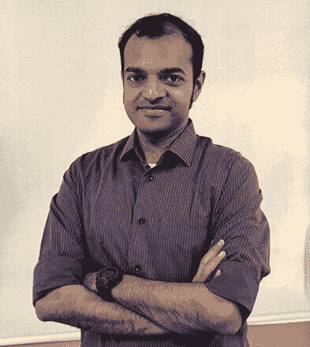

# 算法交易——为什么要采取行动？

> 原文：<https://blog.quantinsti.com/why-algo-trading-webinar-12-december-2019/>

[https://www.youtube.com/embed/73gr7qkQedo?rel=0](https://www.youtube.com/embed/73gr7qkQedo?rel=0)

### 【2019 年 12 月 12 日星期四

### **美国东部时间上午 9:00 | IST 时间下午 7:30 |新加坡时间晚上 10:00**

## **会议大纲**

如果你是金融市场的交易者或投资者，你可能会意识到在过去的 10-15 年里，投资领域发生了翻天覆地的变化。

它的核心是在市场中使用定量技术来做买卖决策。我们经常从我们的社区听到，他们希望了解更多关于这些新时代工具的知识，并利用它们来提高投资回报。

*   当前的交易和投资格局:过去二十年交易者的处境如何
*   手动/全权交易者面临的问题
*   传统分析方法(技术分析和基本面分析)的局限性
*   给你现有的交易风格增加一个定量分析的维度
*   问与答

## 谁应该参加？

*   全权委托/手工交易者(例如专业交易者，兼职交易者)，他们希望提高技能并获得更好的回报
*   技术专业人士，他们希望利用自己的技术技能明智地投资于金融市场
*   希望从事定量金融的学生和其他爱好者

## **演讲者简介**

### Vivek Krishnamoorthy

**内容负责人&QuantInsti**
的研究 Vivek 教授 Python 数据分析，为我们在世界各地的学生构建量化策略和时间序列分析。他在印度、新加坡和加拿大的工业、学术和研究领域拥有十多年的经验。他拥有 VESIT(孟买大学)的电子&电信工程学士学位、NTU 的 MBA 学位和 Takshashila Institution 的公共政策研究生证书。

### Ashutosh Dave

**QuantInsti 内容研究高级助理&**
除了参与我们的旗舰项目 EPAT 的整体内容开发，Ashutosh 还负责 quantin STI 的推广活动。在加入 QuantInsti 之前，他曾在伦敦的一家 prop 公司担任衍生品交易员，专门从事利率和大宗商品交易。他以优异的成绩获得了伦敦经济学院(LSE)的统计学硕士学位，并获得了 FRM (GARP)的认证。

## ****简报****

您可以点击此处查看本次网络研讨会的 powerpoint 演示文稿:

<figure class="kg-card kg-embed-card">

[https://www.slideshare.net/slideshow/embed_code/key/Itc3zZFSAPh8YA](https://www.slideshare.net/slideshow/embed_code/key/Itc3zZFSAPh8YA)

**[Webinar on Algorithmic Trading - Why make the move? with Vivek Krishnamoorthy and Ashutosh Dave](https://www.slideshare.net/QuantInsti/webinar-on-algorithmic-trading-why-make-the-move-with-vivek-krishnamoorthy-and-ashutosh-dave-204982347 "Webinar on Algorithmic Trading - Why make the move? with Vivek Krishnamoorthy and Ashutosh Dave")** from **[QuantInsti](https://www.slideshare.net/QuantInsti)**</figure>

在 Slideshare 上查看我们所有的 [40 多个之前的网络研讨会 powerpoint 演示文稿。](https://www.slideshare.net/QuantInsti/presentations)