# 自动交易系统:架构、协议、延迟类型

> 原文：<https://blog.quantinsti.com/automated-trading-system/>

由 [Rekhit Pachanekar](https://www.linkedin.com/in/rekhit/) 编译

十多年来，自动交易系统或算法交易一直处于交易世界的中心。一个“交易系统”，更通常的说法是“[交易策略](https://blog.quantinsti.com/algorithmic-trading-strategies/)，不过是一套规则，应用于给定的输入数据，生成进场和出场信号(买入/卖出)。

虽然制定交易策略看起来是一件容易的事情，但实际上并不是！创建一个成功的交易策略需要详尽的量化研究，量化交易策略背后的大脑在算法交易界被称为“Quants”。我们可以将量化分析师定义为受雇于量化交易公司的专业人士，他们应用先进的数学和统计模型，唯一的目标是创建一个[阿尔法寻找策略](https://blog.quantinsti.com/a-simple-trading-strategy-to-generate-execution-alpha/)，即一个可以持续产生回报的盈利交易策略，独立于整体市场的方向。

过去 10 年，算法交易的交易量比例大幅上升。在美国和其他发达市场，高频交易和算法交易约占股票市场份额的 70%。在印度，占总营业额的百分比已经上升到 49.8%。

在过去的十年中，自动化交易的发展已经导致自动化交易系统的基本架构发生了显著的变化，并且这种变化将继续下去。对于公司来说，特别是那些使用高频交易系统的公司，为了在算法交易的世界中竞争，技术创新已经成为必要，因此，算法交易领域成为计算机和网络技术进步的温床。

在本帖中，我们将为读者揭开自动交易系统背后的架构。我们将自动交易系统的新架构与传统的交易架构进行比较，并了解这些系统背后的一些主要组件。

我们将在这篇博客中讨论以下几点:

*   [传统建筑](#Traditional)
*   [传统架构的局限性](#Limitations)
*   [自动交易系统的新系统架构](#New)
*   [自动交易系统协议的出现](#protocols)
*   [低延迟架构的出现](#latency)
*   [复杂程度](#Levels)
*   [建立自己的自动交易系统](#Build)

## 传统建筑

从概念上讲，任何交易系统都只不过是一个计算模块，在两个不同的数据流上与交易所进行交互。

1.  接收市场数据
2.  发送订单请求并从交易所接收回复。

在其基本形式中，我们可以将来自交易所和自动交易系统的数据交换描述如下:

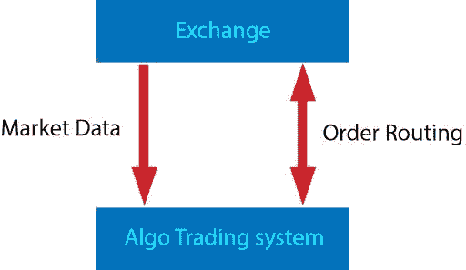

接收到的市场数据通常通知自动交易系统最新的订单簿。它可能包含一些额外的信息，比如到目前为止的交易量，最后一次交易的价格和数量。然而，为了对数据做出决定，交易者可能需要查看旧值或从历史中获得某些参数。为了迎合这一点，传统的系统会有一个历史数据库来存储市场数据和使用该数据库的工具。该分析还包括对交易员过去交易的研究。因此，另一个数据库也用于存储交易决策。最后，但同样重要的是，交易者可以通过 GUI 界面在屏幕上查看所有这些信息。

考虑到以上各点，整个自动交易系统的传统架构现在可以分解为

*   交换–外部世界
*   服务器

*   市场数据接收器
*   存储市场数据
*   存储用户生成的订单

*   应用

*   听取用户的意见，包括交易决策
*   查看包括数据和订单在内的信息的界面
*   订单管理器向交易所发送订单

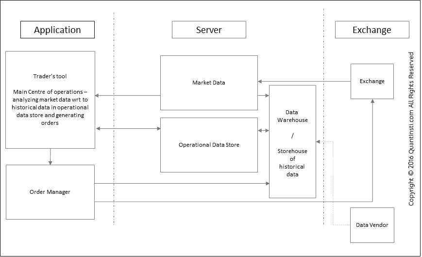

## 传统建筑的局限性

然而，人们发现传统的体系结构无法满足 DMA 自动交易的需求。从事件发生到订单生成之间的延迟超出了人类控制的范围，进入了毫秒和微秒的领域。订单管理也需要更加强大，能够每秒处理更多的订单。由于时间框架与人类的反应时间相比微不足道，风险管理还需要以完全自动化的方式实时处理订单。

例如，即使订单的反应时间是 1 毫秒(与我们今天看到的延迟相比，这是一个很大的延迟)，系统仍然能够在一秒钟内做出 1000 个交易决定。因此，这 1000 个交易决定中的每一个都需要在同一秒内通过风险管理才能到达交易所。你可以说，谈到自动交易系统，这只是一个复杂性的问题。

出现的另一点是，由于架构现在涉及自动化逻辑，100 名交易员现在可以被一个单一的自动化交易系统取代。这增加了问题的规模。因此，每个逻辑单元生成 1000 个订单，100 个这样的单元意味着每秒 100，000 个订单。这意味着决策和订单发送部分需要比市场数据接收器快得多，以便与数据速率相匹配。

## 自动交易系统的新体系结构

为了克服传统系统架构的限制，运行决策逻辑的引擎，也称为“复杂事件处理”引擎，或 CEP，从应用程序内部转移到服务器。应用层现在不仅仅是一个用于查看和向 CEP 提供参数的用户界面。

自动交易系统中的缩放问题也导致了一个有趣的情况。假设在一个市场数据事件上运行着 100 种不同的逻辑(如前面的例子中所讨论的)。然而，对于 100 个逻辑单元中的大多数来说，可能需要运行复杂计算的公共部分，比如说，希腊期权的计算。如果每个逻辑独立运行，每个单元将进行相同的希腊计算，这将不必要地耗尽处理器资源。为了优化计算的冗余性，复杂的冗余计算通常被分离到单独的计算引擎中，该引擎将 greeks 作为输入提供给自动交易系统中的 CEP。

虽然应用层主要是一个视图，但是一些风险检查(由于规模问题，现在已经成为资源密集型操作)可以卸载到应用层，特别是那些与用户输入的健全性有关的检查，如[粗手指错误](https://quantra.quantinsti.com/glossary/Fat-Finger-Error)。

自动交易系统中的其余风险检查现在由订单管理器(OM)内的单独的[风险管理系统](https://blog.quantinsti.com/changing-trends-in-trading-risk-management/) (RMS)在发布订单之前执行。规模问题还意味着，以前有 100 个不同的交易员管理他们的风险，现在只有一个 RMS 系统来管理所有逻辑单元/策略的风险。但是，有些风险检查可能是特定于某些策略的，有些可能需要在所有策略中进行。因此，RMS 本身涉及战略级 RMS(slrm)和全球 RMS (GRMS)。它还可能涉及到查看 SLRMS 和 GRMS 的 UI。

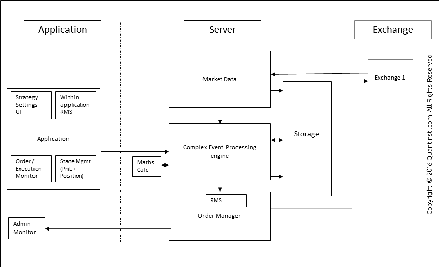

现在让我们更详细地了解服务器组件。

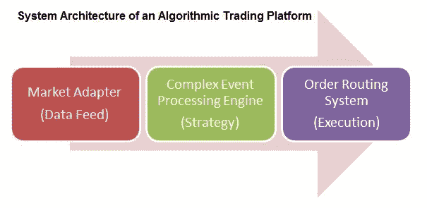

### 市场适配器

交易所或任何市场数据供应商以他们自己的格式发送数据。你的算法交易系统可能理解也可能不理解这种语言。Exchange 为您提供了一个 API 或[应用程序接口](https://en.wikipedia.org/wiki/Application_programming_interface)，允许您编程并创建自己的适配器，将数据格式转换为您的系统可以理解的格式。

### 复杂事件处理引擎

这部分是你策略的大脑。一旦你有了数据，你就需要按照你的战略来处理它，这包括做各种统计计算，与[历史数据](https://blog.quantinsti.com/basic-statistics-for-trading-strategies-i/)进行比较，以及为订单生成做出决策。订单的类型、订单数量在此块中准备。

#### 你所说的交易系统实际上是 CEP 系统

复杂事件只不过是一组到来的事件。这些包括股票趋势、市场动向、新闻等。复杂事件处理是在短时间内对复杂事件执行计算操作。在自动交易系统中，操作可以包括检测复杂的模式，建立相关性和关系，例如任何到来的事件之间的因果关系和时间安排。

CEP 系统实时处理事件，因此事件处理越快，CEP 系统就越好。例如，如果一个自动交易系统被设计为检测下一个 1 秒的盈利机会，但 CEP 系统所用的时间超过了这个阈值，那么该交易系统将无法盈利。

文化教育系统由四部分组成:

*   CEP 引擎
*   文化教育规则
*   CEP WS
*   CEP 结果界面

任何 CEP 系统的两个主要组件是 CEP 引擎和 CEP 规则集。CEP 引擎根据 CEP 规则处理传入事件。这些规则和作为 CEP 引擎输入的事件是由应用的交易系统(交易策略)决定的。

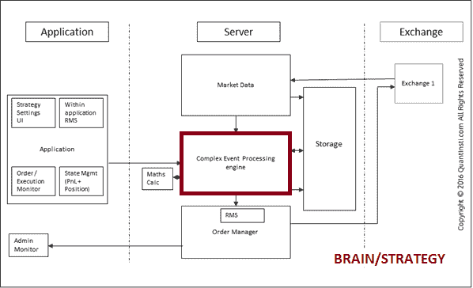

对于一个定量分析师来说，他的大部分工作都集中在这个 CEP 系统模块。一个量化分析师会把大部分时间花在制定交易策略上；执行严格的回溯测试、优化和定位等工作。这样做是为了确保交易策略在真实市场中的可行性。没有一种策略能保证永远的利润。因此，定量分析师需要定期想出新的策略来保持市场优势。

目前市场上广泛使用的自动交易系统有很多。这些策略包括动量策略、统计套利、做市等。查看我们关于[算法交易策略、范例和建模思想](https://blog.quantinsti.com/algorithmic-trading-strategies/)的非常有见地的博客，以了解更多关于这些交易系统的信息。

### 订单路由系统

使用交易所提供的 API，以交易所能够理解的语言对订单进行加密。exchange 提供了两种 API:本地 API 和修复 API。本地 API 是那些特定于特定交换的 API。FIX(金融信息交换)协议是一套用于不同交易所的规则，旨在使证券市场中的数据流动更容易、更有效。我们将在下一节进一步讨论 FIX。

在开放经济的情况下，人们可以通过自动交易系统向交易所或非交易所发送订单，ORP 应该能够处理发往不同目的地的订单。

这里，我们要指出的是，订单信号既可以由个人手动执行，也可以自动执行。后一部分就是我们所说的“自动化交易系统”。订单管理器模块由不同的执行策略组成，这些执行策略根据预定义的逻辑执行买入/卖出订单。一些流行的执行策略包括 VWAP，TWAP 等。有不同的流程，如订单路由、订单编码、传输等。构成这个模块的一部分。查看我们关于[订单管理系统](https://blog.quantinsti.com/automated-trading-order-management-system/) (OMS)的博客，了解更多关于这些流程的信息。

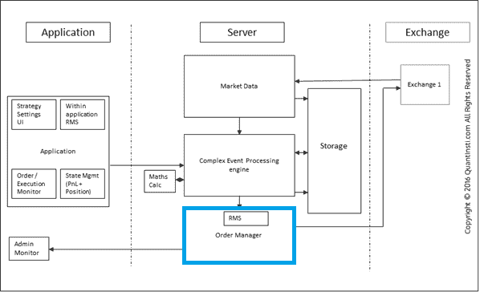

#### 自动交易系统中的风险管理

由于自动交易系统在没有任何人工干预的情况下工作，因此有必要进行彻底的风险检查，以确保交易系统按照设计运行。缺乏风险检查或错误的风险管理会给量化公司带来无法挽回的巨大损失。因此，风险管理系统(RMS)是任何自动化交易系统的一个非常重要的组成部分。

在自动交易系统中有两个处理风险管理的地方:

在应用程序中，我们需要确保这些错误的参数不是由交易者设置的。它不应该允许交易者设定非常不正确的价值，也不应该允许任何重大错误。

在 OMS 生成订单之前——在订单流出系统之前，我们需要确保它通过一些风险管理系统。这是最关键的风险管理检查发生的地方。查看我们的博客[“交易风险管理的变化趋势”](https://blog.quantinsti.com/changing-trends-in-trading-risk-management/)以了解自动化交易系统中风险管理方面和风险处理的更多信息。

要了解更多关于订单管理器的信息，你可以查看我们在[“自动化交易系统中的订单管理系统”](https://blog.quantinsti.com/automated-trading-order-management-system/)上的帖子

要了解更多关于风险管理的信息，你可以看我们的帖子[“自动化交易系统中交易风险管理的变化趋势”](https://blog.quantinsti.com/changing-trends-in-trading-risk-management/)

## 自动交易系统协议的出现

正如我们在前面的自动交易系统教程中所看到的，由于新的架构能够扩展到每台服务器上的多种策略，因此需要从一台服务器连接到多个目的地。因此，订单管理器托管了几个适配器，将订单发送到多个目的地，并从多个交易所接收数据。

每个适配器充当交换所理解的协议和系统内通信协议之间的解释器。因此，多个交换将需要多个适配器。

然而，为了向自动交易系统添加新的交易所，必须设计新的适配器并将其插入到架构中，因为每个交易所遵循其针对交易所提供的特征而优化的协议。为了避免添加适配器的麻烦，已经设计了标准协议。其中最突出的是[修复协议](https://blog.quantinsti.com/fix-trading-protocol/)。这不仅使连接到不同目的地变得易于管理，而且在连接到新目的地时，还大大缩短了上市时间。

标准协议的存在使得自动交易系统可以很容易地与第三方供应商集成，以获得分析或市场数据。因此，市场变得非常高效，因为与新的目的地/供应商整合不再是一个限制。

此外，模拟变得非常容易，因为从真实市场接收数据并向模拟器发送订单只是使用 FIX 协议连接到模拟器的问题。模拟器本身可以内部构建，也可以从第三方供应商处购买。类似地，记录的数据可以被重放，其中适配器不知道数据是从实时市场还是从记录的数据集接收的。

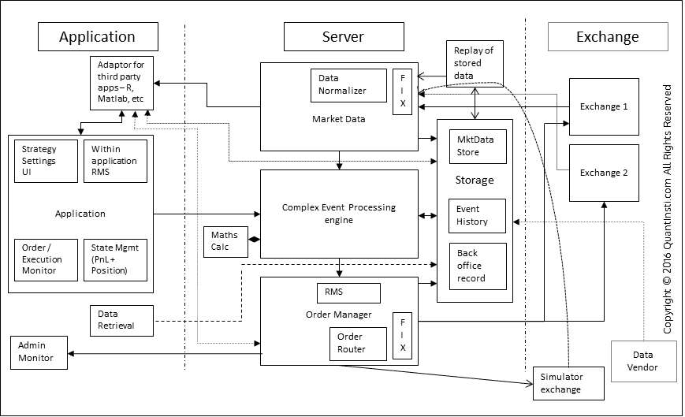

## 低延迟架构的出现

随着自动化交易系统的构建，这些策略现在有能力实时处理大量数据，并快速做出交易决策。今天，随着像 FIX 这样的标准通信协议的出现，建立算法交易台或自动交易系统的技术进入壁垒已经变得更低，因此，算法交易的世界变得更加竞争激烈。随着服务器获得更多的内存和更高的时钟频率，重点转向减少决策的延迟。随着时间的推移，减少延迟已经成为一种必要，原因有很多，例如:

*   该策略只有在低延迟环境中才有意义
*   适者生存——如果你不够快，竞争对手就会把你干掉

然而，问题是延迟实际上是一个总括性的术语，包含了几种不同的延迟。虽然非常容易理解，但量化起来相当困难。因此，如何解决减少等待时间的问题变得越来越重要。

如果我们看看自动交易系统的基本生命周期，

1.  交易所发布市场数据包
2.  数据包通过网络传输
3.  数据包到达服务器端的路由器。
4.  路由器在服务器端通过网络转发数据包。
5.  数据包到达服务器的以太网端口。
6.  根据这是否是 UDP/TCP，进行处理，并且去除了报头和报尾的分组到达适配器的存储器。
7.  然后，适配器解析数据包，并将其转换为算法交易平台内部的格式
8.  这个数据包现在通过系统的几个模块——CEP、tick store 等。
9.  CEP 分析并发送订单请求
10.  订单请求再次经历与市场数据包相反的循环。

在自动交易系统中，任何一个步骤的高延迟都会导致整个周期的高延迟。因此，延迟优化通常从我们控制的这个周期的第一步开始，即“数据包在线路上传输”。这里最简单的做法是尽可能缩短到目的地的距离。

主机托管是交易所提供的在交易所附近托管交易服务器的设施。下图说明了通过缩短距离可以获得的收益。

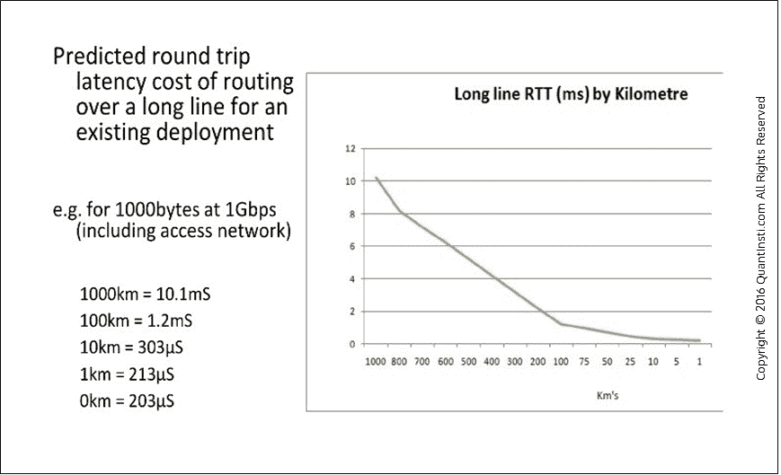

在自动化交易系统中，对于任何一种涉及单一目的地的高频策略来说，托管已经成为事实上的必须。然而，涉及多个目的地的战略需要一些仔细的规划。在做出这样的决定之前，必须考虑诸如目的地回复订单请求所花费的时间及其与两个目的地之间的 ping 时间的比较等因素。这个决定也可能取决于策略的性质。

网络延迟通常是减少自动交易系统整体延迟的第一步。然而，还有很多其他地方可以优化架构。

### 传播潜伏期

在自动交易系统中，传播延迟表示沿着线路传送位元所花的时间，当然会受到光速的限制。

除了减少物理距离之外，还引入了一些优化来减少传播延迟。例如，芝加哥和纽约之间普通电缆的往返时间估计为 13.1 毫秒。Spread Networks 在 2012 年 10 月宣布了延迟改进，将预计往返时间降至 12.98 毫秒。微波通信被 Tradeworx 等公司进一步采用，使往返时间估计达到 8.5 毫秒。注意，理论上的最小值约为 7.5 毫秒。持续的创新正在推动科学的边界，并迅速达到光速的理论极限。早先用于国防技术的激光通信的最新发展，进一步将短距离内已经变薄的延迟缩短了纳秒。

### 网络处理延迟

网络处理延迟表示由路由器、交换机等引入的延迟。

自动化交易系统架构的下一个优化级别是数据包从 A 点到 b 点的跳数。跳是指数据包不通过路由器或交换机等物理设备的源和目的地之间的一段路径。例如，数据包可以通过两条不同的路径传输相同的距离。但是它可能在第一条路径上有两跳，而在第二条路径上有三跳。假设传播延迟相同，路由器和交换机都会引入各自的延迟，通常根据经验，跳数越多，增加的延迟就越多。

网络处理延迟也可能受到我们所说的微突发的影响。微突发被定义为数据传输速率的突然增加，其不一定影响数据传输的平均速率。由于自动交易系统是基于规则的，所有这样的系统将以同样的方式对同一事件做出反应。因此，许多参与系统可能会发送命令，导致参与者和目的地之间突然发生一连串数据传输，从而导致微突发事件。下图说明了什么是微下击暴流。

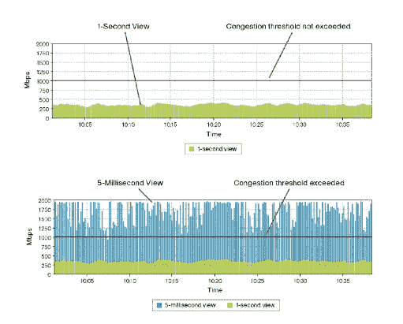

第一张图显示了数据传输速率的 1 秒视图。我们可以看到，平均速率远低于 1Gbps 的可用带宽。但是，如果我们更深入地观察第二张图片(5 毫秒视图)，我们会发现传输速率每秒钟几次超过可用带宽。因此，网络端点以及路由器和交换机中的网络堆栈上的数据包缓冲区可能会溢出。为了避免这种情况，通常为自动交易系统分配比观察到的平均速率高得多的带宽。

### 序列化延迟

自动化交易系统的序列化延迟表示将位从网络上取出所花费的时间。

在 T1 线路上传输的 1500 字节的数据包(1，544，000 bps)将产生大约 8 毫秒的串行化延迟。然而，使用 56K 调制解调器(57344bps)传输同样的 1500 字节数据包需要 200 毫秒。一条 1G 的以太网线路会将这一延迟降低到 11 微秒左右。

### 中断等待

自动交易系统中的中断等待时间表示在服务器上接收数据包时由中断引入的等待时间。

中断延迟定义为从产生中断到处理中断源之间所经过的时间。什么时候产生中断？中断是由硬件或软件向处理器发出的信号，表示某个事件需要立即处理。反过来，处理器通过暂停其当前活动、保存其状态和处理中断来做出响应。每当网卡收到数据包时，就会发送一个中断来处理已经加载到网卡接收缓冲区的位。响应此中断所花费的时间不仅会影响新到达的有效载荷的处理，还会影响处理器上现有进程的延迟。

Solarflare 在 2011 年推出了“OpenOnload”，它实现了一种称为内核旁路的技术，其中数据包的处理不是留给操作系统内核，而是留给用户空间本身。NIC 将整个数据包直接映射到用户空间，并在那里进行处理。因此，完全避免了中断。

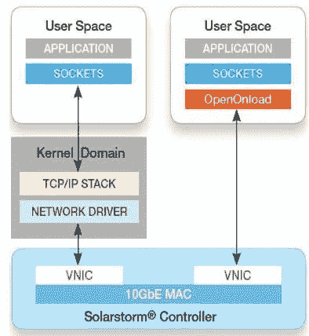

因此，加快了处理每个包的速度。下图清楚地展示了内核旁路的优势。

### 应用延迟

自动交易系统的应用程序延迟表示应用程序处理所需的时间。

这取决于几个分组、分配给应用逻辑的处理、所涉及的计算的复杂性、编程效率等。一般来说，增加系统中处理器的数量会减少应用程序的延迟。时钟频率增加的情况也是如此。许多自动交易系统利用将处理器内核专用于应用程序的基本元素，例如策略逻辑。这避免了内核之间的进程切换带来的延迟。

类似地，如果在自动交易系统中的策略编程已经记住了高速缓存大小和存储器访问的局部性，那么将会有大量的存储器高速缓存命中，从而导致等待时间的进一步减少。为了促进这一点，许多系统使用非常低级的编程语言来针对处理器的特定架构优化代码。一些公司甚至使用完全可编程门阵列(FPGA)将复杂的计算烧到硬件上。随着复杂性的增加，成本也在增加，下图很好地说明了这一点。

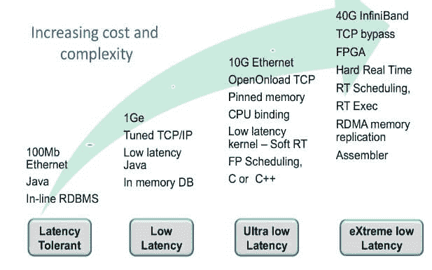

## 复杂程度

高频算法交易的世界已经进入了一个激烈竞争的时代。随着每个参与者采用新的方法来淘汰竞争对手，技术已经突飞猛进。与早期的算法交易架构相比，现代的算法交易架构非常复杂。因此，高级自动化交易系统在时间和金钱方面的构建更加昂贵。

|  | 标准 10GE 网卡 | 低延迟 10GE 网卡 | 现场可编程门阵列 （Field Programmable Gata Array 的缩写） | 专用集成电路 |
| 潜伏 | 20 微秒+应用时间 | 5 微秒+应用时间 | 3-5 微秒 | 亚微秒延迟 |
| 易于部署 | 不重要的 | 内核驱动程序安装 | 程序员的再培训 | 专科医生 |
| 人工年努力发展 | 周；星期 | 月份 | 2-3 个人年 | 2-3 个人年 |

建立一个完整的自动交易系统可能超出了个人散户的能力范围。对于想探索算法交易方式的交易者来说，可以选择市场上基于订阅的自动交易系统。交易者可以订阅这些自动化系统，并使用这些系统上的用户可用的算法交易策略。我们在博客[“印度顶级算法交易平台”中重点介绍了一些流行的自动交易系统。](https://blog.quantinsti.com/top-algo-trading-platforms-india/)懂编程的交易者可以在 Python 和 r 这样的编程平台中制定和回测自己的策略。

## 建立你自己的自动交易系统

初级交易者可以学习建立自己的算法交易策略，并在市场中获利。以下步骤可以作为建立算法交易策略的粗略指南:

1.  想法或策略假设——想出一个你认为在现实市场中会有利可图的交易想法。这个想法可以基于你的市场观察，也可以从交易书籍、研究论文、交易博客、交易论坛或任何其他来源借用。
2.  获取必要的数据——为了测试你的想法，你需要历史数据。你可以从谷歌财经、雅虎财经或付费数据供应商那里获得这些数据
3.  策略写作——一旦你有了数据，你就可以开始用 Excel、Python 或 R 编程等工具编写你的策略了。
4.  回溯测试你的策略——一旦编码，你需要测试你的交易想法是否能从历史数据中获得好的回报。回溯测试包括优化投入、设定利润目标和止损、头寸规模等。
5.  纸上交易你的策略——在回溯测试步骤之后，你需要先纸上交易你的策略。这意味着在模拟市场条件的模拟器上测试你的策略。有券商提供[算法交易平台](https://blog.quantinsti.com/top-algo-trading-platforms-india/)用于纸面交易你的策略。
6.  实施你的策略——如果纸上交易后策略是盈利的，你可以实施。你可以在一个提供算法交易工具的合适的经纪人那里开一个账户。

允许专业人士和散户交易者进行算法交易的交易所数量逐年增加，越来越多的交易者转向算法交易。

## 结论

这是一篇关于自动化交易系统架构的详细文章，我们确信这篇文章对相关组件以及架构开发人员为了构建一个健壮的自动化交易系统而需要处理/克服的各种挑战提供了非常深刻的知识。你还在等什么？加油 Algo！！

如果你想学习算法交易和自动交易系统的各个方面，那就去查查[算法交易(EPAT )](https://www.quantinsti.com/epat/) 的高管课程。课程涵盖统计学&计量经济学、金融计算&技术和算法&定量交易等培训模块。EPAT 教你在算法交易中建立一个有前途的职业所需的技能。[现在报名](https://www.quantinsti.com/epat/)！

*免责声明:本文中提供的所有数据和信息仅供参考。QuantInsti 对本文中任何信息的准确性、完整性、现时性、适用性或有效性不做任何陈述，也不对这些信息中的任何错误、遗漏或延迟或因其显示或使用而导致的任何损失、伤害或损害承担任何责任。所有信息均按原样提供。*