# 支持向量机简介

> 原文：<https://blog.quantinsti.com/support-vector-machines-introduction/>

由[瓦伦·迪瓦卡](https://www.linkedin.com/in/varun-divakar-b862a667/)

支持向量机十年前曾被广泛使用，但现在已经失宠了。以下来自谷歌趋势的数据可以更清楚地证明这一点。

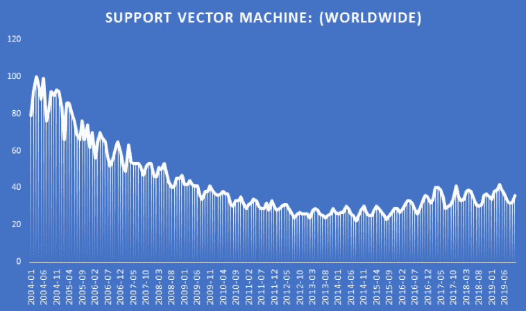

(来源:[谷歌趋势](https://trends.google.com/trends/explore?date=all&q=Support%20vector%20machine))

## 为什么会这样？

随着越来越多的高级模型被开发出来，支持向量机失宠了。训练支持向量机的非线性核，例如 RBF(径向基函数),需要花费大量时间。但是已经发现它们在文本分类问题中非常有效。支持向量机(SVM)也擅长解决小数据集的非线性问题。这正是我在交易中更喜欢支持向量机的原因。

## 交易中的支持向量机

说到交易，如果你用的是日频数据，那么很有可能你的数据集极其有限，大概只有几千个数据点。假设你已经创建了一个交易策略，使用决策树从过去的数据中提取一个大概率规则。现在您想了解这条规则在看不见的或测试数据上的表现。创建一个 SVC 来预测规则何时成功或失败，这将帮助你消除不好的交易。在您尝试 SVM 之前，首先让我们了解它们是如何工作的。

因此，在本文中，我们将讨论以下主题:

*   [支持向量机](#svm)
*   [用一个例子理解支持向量机](#example)
*   [支持向量机的数学](#math)
*   [软边缘分类器](#soft)
*   [非线性模型](#non)
*   [使用 Python 中的支持向量机进行交易](#tsvmp)

## 支持向量机

支持向量机是一种通常用于执行分类任务的方法，它使用多维空间中的分离超平面来执行给定的任务。从技术上讲，在 p 维空间中，超平面是 p-1 维的平坦子空间。例如，在二维中，超平面是平坦的一维子空间或直线。在三维中，超平面是平坦的二维子空间，即平面。

如果维度大于 3，可能很难将超平面可视化，但是 p-1 维空间的概念仍然适用。

## 用一个例子理解支持向量机

现在你对超平面有了基本的了解，让我们来了解一下支持向量机背后的直觉。考虑两个不同类的数据集，用蓝色和红色显示。

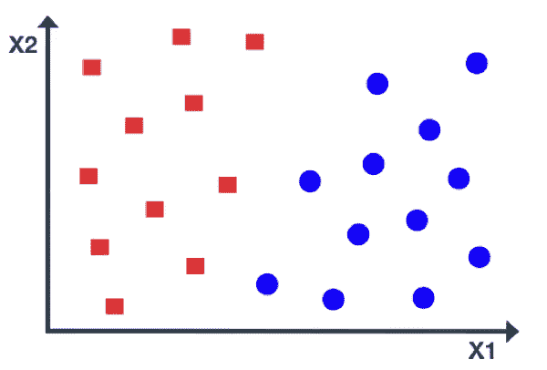

数据是线性可分的，存在多条分隔线，以黑色显示。所有这些行都提供了一个解决方案，但是只有一行是最佳的，并且可以准确地将类分开。

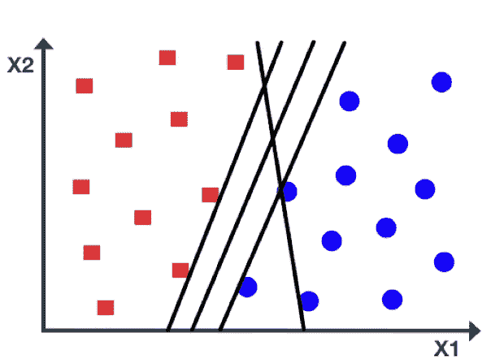

例如，如果线非常靠近数据点，即使很小的噪声也会导致错误分类。这是另一条分隔类的线，但看起来不太自然。所以，问题是哪条线最好？

支持向量机选择一条最优线，该线最大化到任一类中最近点的距离。这个距离叫做边缘。如图所示，边距是从实线到任一虚线的距离。

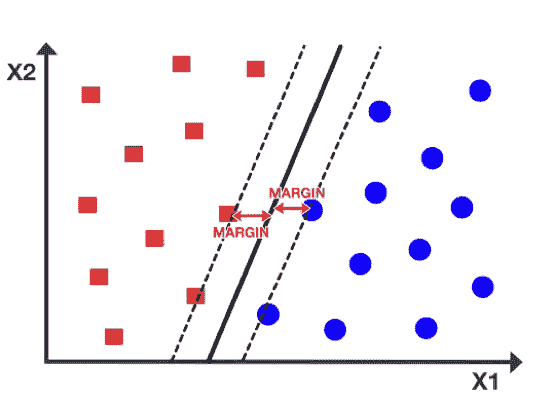

我们的目标是最大限度地提高利润，以获得最佳生产线。因此，支持向量机有时被称为最大间隔分类器。在图中，虚线上有一些蓝色和红色的数据点。这些点被称为支持向量。值得注意的是，最大边缘线或决策边界仅取决于支持向量，而不取决于其他数据点。

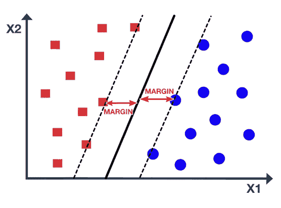

如图所示，移动支持向量也会移动最大边缘线，而移动其他点则没有影响。最大边距线仅在数据可线性分离时有用，换句话说，数据可以用直线分离。在该图中，数据点属于两个类别，并且不一定由最大边缘线分开。事实上，如果分隔线确实存在，它也不是最佳的，因为它会错误分类，而且误差很小。那么，当数据是非线性的时候，我们应该采用什么方法呢？

在这种情况下，我们考虑扩大特征空间，例如二次、三次甚至更高阶的多项式，以解决这种非线性。我们可以用一种特殊的方式扩大特征空间，使用一种叫做“核”的函数。让我们了解一下核函数和支持向量机背后的一些数学知识。

## 支持向量机的数学

关于支持向量机，您需要理解的要点是:

1.  支持向量机通过最大化平面和最近的输入数据点(称为支持向量)之间的距离来找到超平面(对数据进行分类)。
2.  这通过最小化用于定义超平面的权重向量“w”来完成。
3.  步骤 2 依赖于最优化理论和某些假设(下面将详细说明)。

### 最大化超平面和支持向量之间的距离

为简单起见，考虑属于 C 类 1 或 C 类 2 的线性可分数据点，没有任何数据点的错误分类。

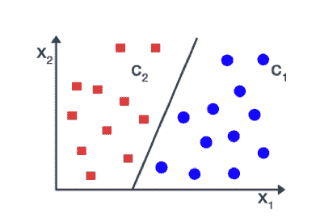

对于未知的输入数据 x，我们定义一个线性判别函数。

y = f(x) = w. x + b

其中 w 是垂直于超平面的权重向量。

b 是偏差项

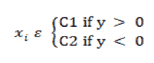...(1)

设所有输入点用 x 1 ，…，x p 表示，它们对应的类用 y 1 ，…，y p 表示。所以，如果 x i 属于 c 类 1 ，那么对应的 y i 等于+1，如果 x i i 属于 c 类 2 ，那么对应的 y i 等于-1。

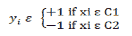...(2)

之前，我们假设属于两个类的数据点是线性可分的。那么有可能以在它们之间没有点的方式选择两个超平面，然后尝试最大化两个超平面之间的距离。这种类型的支持向量机被称为硬边界 SVM。

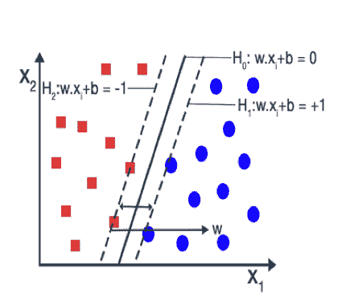

这两个超平面可以用下面的等式来最好地表示

H1 : w.x i + b = -1...(3)

H2 : w.x i + b = 1...(4)

假设 x 1 和 x 2 是超平面每一边最近的两个点。然后，超平面 H1 和 H2 的方程变成:

w.x 1 + b = -1...(5)

w.x 2 + b = +1...(6)

通过对等式(5)和等式(6)进行差分，我们得到，

w(x1x2)= 2...(7)

用等式(7)的两边除以我们得到的“w”的大小，

w(x1-x2)/| | w | | = 2/| | w | |...(8)

我们知道，当我们把一个矢量除以它的大小，我们得到一个单位矢量。单位向量的大小是 1。所以，我们的等式变成了:

(x 1 - x 2 ) = 2 / ||w||...(9)

(x 1 - x 2 )是两个超平面之间的距离。所以，我们要最大化的距离是 2 / ||w||。最大化 2 / ||w||就是最小化||w||为了防止数据点落入页边距，我们添加了以下约束。

最小化 2 / ||w||...(10)

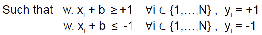

将两个方程乘以它们对应的 yI，它们就转化为一个方程

yI(w . xI+b)≤1&∞1、…，N}

上面的优化问题很难解决，但是可以在不改变解的情况下，将等式 2/ ||w||替换为||w||2。这个问题现在属于二次规划(QP)优化，更容易计算。

最小化||w|| 2 ...(11)

使得 y i (w. x i + b)≥1，& nbsp ∀i ∈ {1，…，N}

这是二次优化问题或原始形式。借助拉格朗日乘子，这个原问题可以转化为另一个优化问题，即对偶问题。

具有拉格朗日乘数的对偶优化方程如下所示:

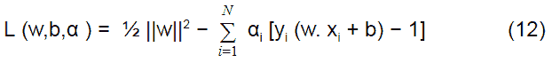

服从αIT2】= 0 ∀i∈{ 1，…，N}

其中αi 是拉格朗日乘数

通过将等式(12)的括号中的分量相乘:

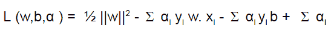

将 L w.r.t w 和 b 的导数分别设置为 0:

∂L/∂b = - Σ αi y i = 0

⇒ Σαi y i = 0 ... (13)

∂L/∂w = w - Σ αi y i x i = 0

⇒ w = Σ αi y i x i i ... (14)

将等式(13)和(14)的值代入 L，我们得到:

l =≤σδj y〖t0〗I〖t1〗y〖T2〗j〖T3〗(x〖T4〗I〖t5〗x〖T6〗j〖T7〗-φⅰδj y〖t8〗I〗

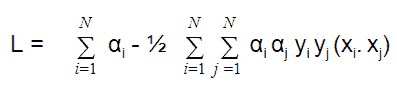

在这里，我们的目标是最大化不同拉格朗日乘子值(即α)的对偶优化问题。

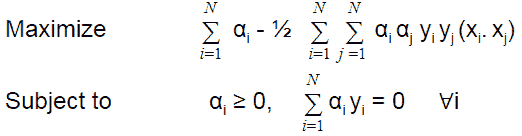

需要注意的一件重要事情是，如果拉格朗日乘数，即αi = 0，那么数据点不是支持向量。所以，只有对于αi > 0，x i 才是支持向量(SV)。

## 软边界分类器

上述优化问题仅在数据点被正确分类时有用，这意味着页边空白之间没有点。有时，数据中的高噪声会导致类别重叠，如图所示。

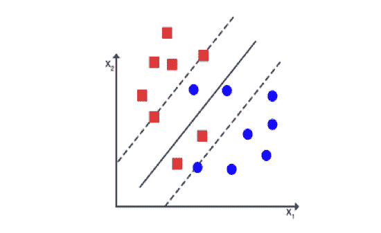

在这种情况下，我们可以通过使用软间隔 SVM 来完成分类任务。

软边界 SVM 通过最大限度地减少样本数量，为模型错误分类某些数据点提供了自由。软边际 SVM 允许违反约束的可能性

yI(w . xI+b)≤1≤1、…，N}

通过引入松弛变量ξi

yI(w . xI+b)≥1-ξIξI≥0 ∀i∈{ 1，…，N}

现在，我们的目标是通过保持ξi 尽可能小来最大化裕量。

引入松弛变量后，我们的原始或二次优化问题:

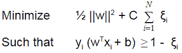

这里，C 是正则化参数(分类和误差之间的折衷)。转换到拉格朗日对偶问题，我们得到:

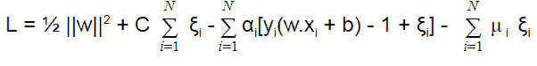

这里，μ i 是新的拉格朗日乘数。

分别对 L w.r.t w 和 b 取偏导数后为 0。我们的对偶优化问题变成了:

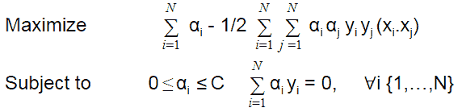

除了α i 的值位于 0 和 c 之间之外，这与硬边界情况非常相似。

## 非线性模型

到目前为止，我们所学的知识只适用于数据是线性可分的情况。当数据不可分时，这些优化问题是不可行的。这样的问题可以通过一个被称为核的函数来扩大特征空间来解决。

数学上，核是对应于某个扩展特征空间中的内积的某个函数。如果每个数据点通过某种变换φ:x→φ(x)被映射到高维空间，那么核函数被定义为:

K(x i ，xj )= φ(x i )。φ(xj)

我们可以通过引入如下核函数来修改我们的优化问题:

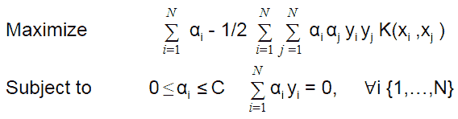

(来源:[维基百科](https://en.wikipedia.org/wiki/Support-vector_machine))

因此，我们已经看到了支持向量机的复杂性及其作为非线性模型的应用。我们还理解了软间隔分类器的含义，以及它如何克服支持向量机模型中的优化问题。

在下一节中，我将向你展示如何使用在早期的[博客](/trading-using-machine-learning-python-part-2/)中做出的制度预测来实现基于[机器学习的交易策略](https://quantra.quantinsti.com/course/introduction-to-machine-learning-for-trading)。

在你阅读这部分之前，有一件事你应该记住:这个算法只是为了演示，不应该在没有适当优化的情况下用于实际交易。

## 使用 Python 中的支持向量机进行交易

让我先解释一下这里的议程:

1.  创建一个无监督的 ML(机器学习)算法来预测制度。
2.  画出这些政权来形象化它们。
3.  训练一个支持向量分类器算法，将政权作为特征之一。
4.  使用此支持向量分类器算法来预测开市当天的趋势。
5.  在测试数据上可视化这个策略的性能。
6.  为您的利益可下载的代码

导入库和数据:

首先，我导入了必要的库。请注意，我已经导入了 fix *yahoo* finance 包，所以我可以从 yahoo 中提取数据。如果你没有这个包，我建议你[先安装](https://pypi.python.org/pypi/fix-yahoo-finance)或者把你的数据源换成谷歌。

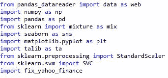

接下来，我提取了我们在上一篇博客中使用的相同引文“SPY”的数据，并将其保存为 dataframe df。我选择了 2000 年这个数据的时间段。

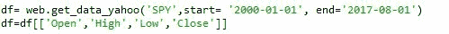

在这之后，我创建了可以用作训练算法的特征的指标。

但是，在此之前，我决定了这些指标的回望时间段。我选择了 10 天的回顾期。你可以试试其他适合你的号码。我选择 10 来检查过去 2 周的交易数据，以避免较小的回顾期所固有的噪音。

除了回望期之外，让我们也决定数据的测试序列分割。我更愿意给出 80%的数据用于训练，剩下的 20%用于测试。您可以根据自己的需要进行更改。

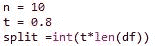

接下来，我将高、低和收盘列移动 1，以便只访问过去的数据。在此之后，我创建了各种技术指标，如 RSI，SMA，ADX，相关性，抛物线 SAR，以及过去 1 天的回报。

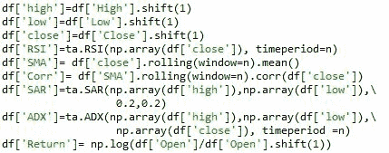

接下来，我打印了数据框。

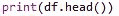

它看起来像这样:

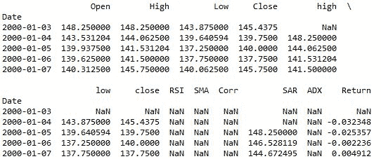

如你所见，有许多 NaN 值。我们需要估算它们或者放弃它们。如果你是机器学习的新手，想要了解估算器功能，请阅读[这个](http://scikit-learn.org/stable/modules/generated/sklearn.preprocessing.Imputer.html)。我在这个算法中去掉了 NaN 值。

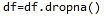

在代码的下一部分，我实例化了一个 StandardScaler 函数，并创建了一个无监督学习算法来进行状态预测。我在以前的博客中讨论过这个问题，所以我不会再赘述。

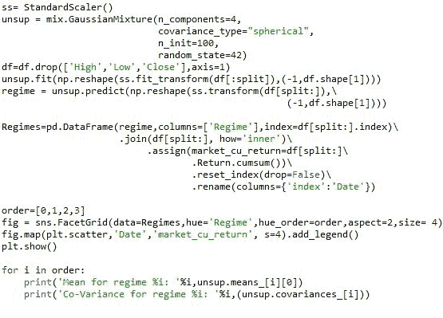

在最后一篇博客的结尾，我打印了所有区域的平均值和协方差值，并绘制了区域图。将指示器作为功能集的新输出如下所示:

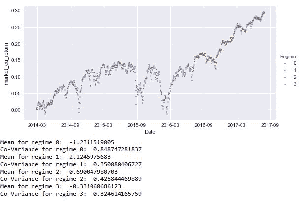

接下来，我缩放了 Regimes 数据框，不包括在前面的代码中创建的 Date 和 Regimes 列，并将其保存回相同的列中。通过这样做，我不会丢失任何特征，但数据将被缩放，并为训练支持向量分类器算法做好准备。接下来，我创建了一个信号列作为预测值。该算法将在特征集上训练以预测该信号。

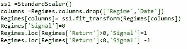

接下来，我实例化了一个支持向量分类器。为此，我使用了与 [sklearn](/scikit-learn-tutorial/) 在示例中使用的相同的 [SVC](http://scikit-learn.org/stable/modules/generated/sklearn.svm.SVC.html) 模型。我没有优化这个支持向量分类器的最佳超参数。在 Quantra 上的[机器学习课程](https://quantra.quantinsti.com/course/trading-with-machine-learning-regression)中，我们广泛讨论了如何使用超参数和优化算法来预测每日高点和低点，进而预测一天的波动性。

回到博客，支持向量分类器的代码如下:

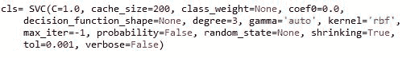

接下来，我将无监督制度算法的测试数据分为训练和测试数据。我们使用这个新的训练数据来训练我们的[支持向量](https://quantra.quantinsti.com/course/trading-machine-learning-classification-svm)分类器算法。为了创建训练数据，我删除了不属于特性集的列:

信号'，'返回'，'市场 *cu* 返回'，'日期'

然后，我将 X 和 y 数据集拟合到算法中，对其进行训练。

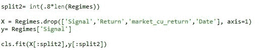

接下来，我计算了测试集的大小，并根据数据帧 df 对预测进行了索引。

这样做的原因是,“SPY”的原始返回值存储在 df 中，而 Regimes 中的那些值是按比例缩放的，因此对于获取累积和来检查性能是没有用的。

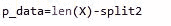

接下来，我将 SVC 做出的预测保存在一个名为 Pred 信号的专栏中。

然后，基于这些信号，我通过将当天开始时的信号乘以第二天开盘时的回报(因为我们的回报是从开盘到开盘)来计算策略的回报。

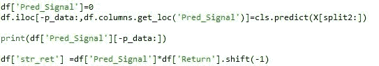

最后，我计算了累积策略回报和累积市场回报，并将其保存在 df 中。然后，我计算夏普比率来衡量性能。为了清楚地理解这个指标，我绘制了性能图来衡量它。

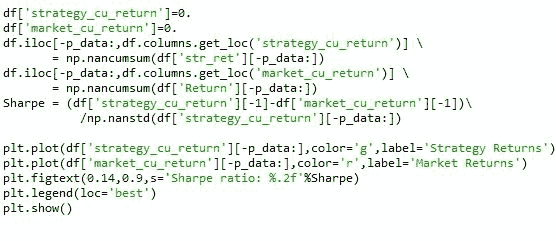

最后的结果看起来是这样的。

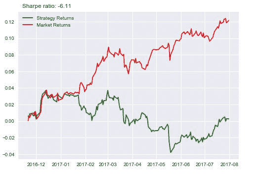

经过这么多代码和努力，如果最终结果看起来像这样，那么没有机器学习背景的人会说这不值得。我现在同意。但是，看看这行代码:

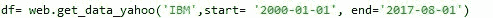

我只是把数据从 SPY 改成了 IBM。那么结果看起来是这样的:

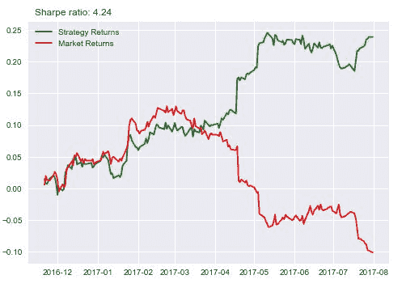

我知道你在想什么:我只是在拟合数据以得到结果。这并不是完全错误的。我会给你看另一个股票，然后你决定。

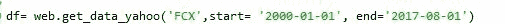

我把股票换成了 Freeport-McMoRan Inc，结果是这样的:

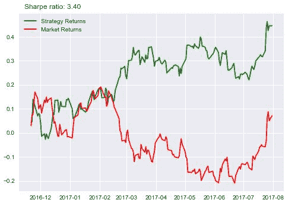

可以进一步改成 ge 或者别的，自己查。这种策略对一些股票有效，但对其他股票无效，大多数量化策略都是如此。有几个原因可以解释为什么这个算法能够稳定的工作，我将在这里列出其中的一些。

1.  没有回报的自相关
2.  无支持向量超参数优化
3.  无误差传播
4.  无特征选择

我们没有检查回报的自相关性，这将增加算法的可预测性。通过将 returns 列移动 1 并将其作为 feature set 传递，自己尝试一下。结果将如下所示:

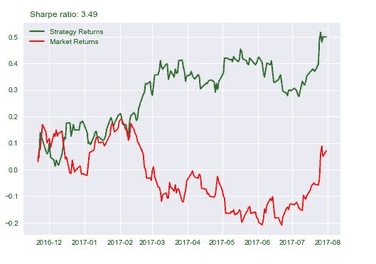

虽然从 3.4 到 3.49 的提升不多，但这仍然是一个很好的特性。

请注意，代码最好在 Python 2.7 中运行

**更新**

我们注意到一些用户在从雅虎和谷歌金融平台下载市场数据时面临挑战。如果你正在寻找市场数据的替代来源，你可以使用 [Quandl](https://www.quandl.com/) 来获得同样的信息。

## 结论

因此，我们不仅看到了支持向量机背后的数学，而且还理解了如何使用 Python 中的 SVM 构建交易策略。

如果您想学习如何在金融市场数据上使用支持向量机并创建自己的预测算法，您可以报名参加[机器学习交易:分类和 SVM 课程](https://quantra.quantinsti.com/course/trading-machine-learning-classification-svm)，该课程涵盖分类算法、机器学习中的性能测量、超参数和监督分类器的构建。

如果你想学习算法交易的各个方面，那么看看我们在算法交易 (EPAT)的[执行项目。课程涵盖统计学&计量经济学、金融计算&技术和算法&定量交易等培训模块。EPAT 旨在让你具备成为成功交易者的正确技能。立即注册！](https://www.quantinsti.com/)

*免责声明:本文中提供的所有数据和信息仅供参考。QuantInsti 对本文中任何信息的准确性、完整性、现时性、适用性或有效性不做任何陈述，也不对这些信息中的任何错误、遗漏或延迟或因其显示或使用而导致的任何损失、伤害或损害承担任何责任。所有信息均按原样提供。*

### **下载数据文件**

*   Python_3