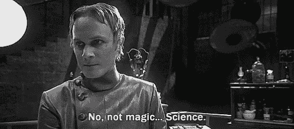
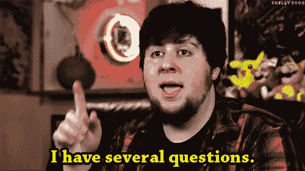
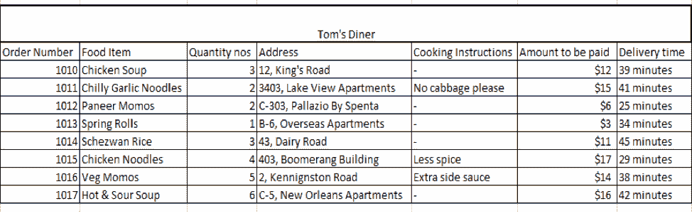
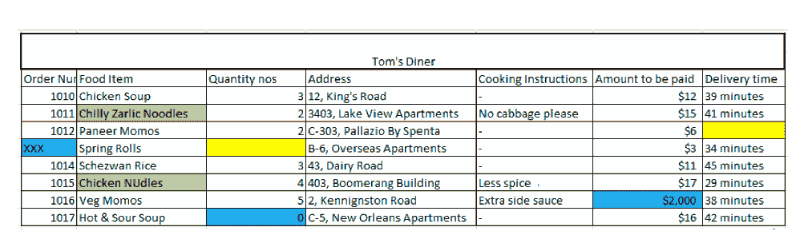
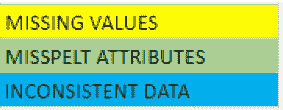
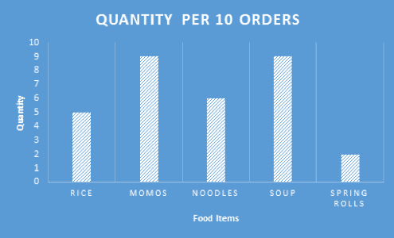
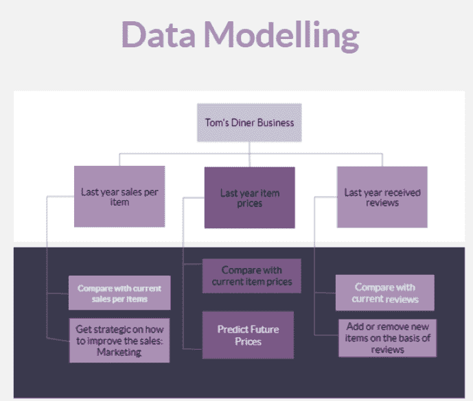

# 数据科学入门:食品配送应用案例研究

> 原文：<https://blog.quantinsti.com/steps-data-science/>

作者:普拉奇·乔希

"我们的目标是将数据转化为信息，将信息转化为洞察力."卡莉·菲奥莉娜。

你有没有想过 Spotify 是如何根据你的喜好连夜准备你的每日播放列表的？或者在你输入完整的句子之前，谷歌是如何完成你的搜索的？网飞或亚马逊 Prime 如何预测你偏好的所有节目？他们是怎么做到的？这背后的过程可能是什么？这些都是我们时常思考的问题。这不是魔术，这是数据科学！

给你一个关于数据科学的简单介绍，它只不过是对数据的研究。数据科学是一个探索的领域。它结合了领域知识、编程、统计、沟通和解决问题的技能，从数据中提取有价值的见解。数据科学正在改变我们周围的世界，它正在影响我们的日常决策，从您向购物车添加什么到您为谁投票。随着数据的疯狂爆炸，将数据科学与任何行业相结合的可能性确实对我们有利。在这个数据驱动的世界中，机会和应用正在增长，并将继续扩大。

“从文明诞生到 2003 年，总共有 5eb 的信息，但现在每两天就有这么多信息产生。”

谷歌首席执行官埃里克·施密特。

我们今天拥有的超过 90%的数据是在过去两年中生成的。数据呈指数级增长，每天都有大约 2.5 万亿字节的数据被创建出来。数据的急剧增长为数据科学创造了无尽的机会，为意想不到的事情铺平了道路。

这篇关于“数据科学的步骤”的博客将带领你通过一个有用的框架来理解数据科学的过程。通过对一个食品配送应用程序的案例研究，我们将尝试分解步骤，以帮助您了解任何数据科学项目的生命周期。

在这篇博客中，我们将讨论以下主题:

*   [了解数据科学](#understand)
*   [食品配送市场的崛起](#food)
*   [数据科学的步骤](#steps)

## 了解数据科学

在我们进入案例研究之前，让我们先看一下“数据科学的步骤”视频，以便更好地理解数据科学。

## 食品配送市场的兴起

今天，食品配送市场的格局正在改变世界各地人们的饮食习惯。只需在你的 Iphone 或 Android 上下载一次，你就可以轻松地从各种美食、折扣优惠、订单大小中进行选择，并节省时间，所有这一切都可以在你家方便地完成。目前，食品配送行业处于最佳状态。这些服务不一定能在你当地的餐馆里找到。

据研究公司 Cohen and Company 称，未来 4 年，食品配送应用程序将增长 12%。在过去的 3 年里，这些应用的下载量已经增长了 380%。这种影响是如此之大，以至于一些新餐厅开始选择“云厨房”，一种没有厨房和服务员的餐厅，100%在线运营。

你会问，这个行业可能会面临什么问题？管理及时交付、保持食品质量、应对滔滔不绝的请求、回应客户询问和留住客户是一些挑战。

让我们以“Zomato”在线送餐应用程序为例，尝试理解数据科学的 6 个步骤。

## 定义问题陈述

数据科学的第一步是定义问题陈述。如果你有一个业务问题需要解决，那么问很多问题就变得很重要。识别有助于解决问题的适当问题。理解和定义需要解决的问题的目标是很重要的。当你提出相关问题时，你就建立了一个更强有力的问题陈述。好奇心是任何数据科学家的关键技能。他或她必须有认识相关问题的好奇心和从数据中发现真知灼见的好奇心。

所需技能:批判性思维、好奇心、领域知识和解决问题的技能。

一家被评为五星级的中国餐馆“汤姆的晚餐”希望继续成为其竞争对手中的佼佼者。在送餐应用 Zomato 上，Tom's Diner 被列为最佳餐厅之一。为 Tom's Diner 工作的数据科学分析师需要特定的信息来帮助理解餐厅的结构以及如何改进。

分析师提出相关问题来构建问题陈述。

像这样的问题:

1.  交货的平均时间是多少？
2.  哪个地区的订单率最高？
3.  买得最多和最少的食物是什么？
4.  顾客对食物的质量和数量满意吗？
5.  我们在解决应用程序上的负面评论吗？
6.  是否有必要更新食物菜单，如果有，我们添加什么？

可以问类似的问题，形成强有力的问题陈述。本案例研究的问题陈述可以是:“汤姆的晚餐”应该采取什么措施来增加和改善其客户服务和评级？

想象一下，你工作了一整天。你回到家却发现没有晚餐，因为你的厨师今天没来。你决定从 Zomato 点中餐。

有这么多选择，你选择从汤姆餐馆点辣椒大蒜面和软饮料。你选择 Tom's Diner 餐厅是因为它是五星级的，而且在你的预算之内。您选择数量，添加烹饪说明，并添加您的地址供餐厅参考。然后你付款，等待送货。

## 数据收集

数据科学的第二步是数据收集。在定义了问题陈述之后，获取正确的数据变得很重要。数据可以从各种开放的数据源平台上搜集和收集。开源网站上也有许多数据科学项目，如 **Github** 、 **Kaggle** 和 **Gapminder** 。

这可以通过主要方法和次要方法来收集。第一种方法是原始数据收集。初级方法非常适合于实证研究。当没有针对某个特定主题的预先研究时，就必须收集新的数据。第二种方法使用现成的数据进行任何类型的研究。此类数据已经被其他人使用或收集。你可以在互联网、杂志、文章和几乎任何地方找到这样的数据。这种方法被称为二次数据收集。

所需技能:网页抓取，注意细节，数据处理等。

与您类似，有许多人在同一家餐厅下了订单。这就产生了大量的订单。这就是所谓的数据收集。

以下是过去 5 分钟内收集的 10 个最新订单的数据快照:

## 数据质量和补救

数据科学的第三步是数据质量和补救。由于数据的爆炸，互联网上有大量的数据。但是这些数据集大多不完善。您可以找到丢失的值、不一致的数据类型和拼错的属性。因此，采集的数据需要清理，因为这将提高信息的准确性和质量。如果数据没有得到适当的清理，那么分析或得出的见解将是不准确的。

所需技能:关注细节等

餐馆接受你的订单。一名员工开始处理您的订单。他检查您的订单，并检查食品项目、食品数量、烹饪说明(如果有)和送货地址。如果他发现任何异常或任何缺失信息，他会联系相关人员并确认信息。这个人可以是客户或送货代理。然后，他在系统中更新这些信息。然后，清理后的数据可用于执行分析。这一步有助于您熟悉数据。这是**数据质量和补救**。

*T2】*

*T2】*

## 数据分析和解释

数据科学的第四步是数据分析和解释。清理完这个数据集后，我们执行数据分析。这是至关重要的一步，因为它有助于您熟悉数据并获得有用的见解。如果您跳过这一步，那么您可能会最终生成不准确的模型，并在您的模型中选择无关紧要的变量。您在此步骤中执行的所有分析都属于[探索性数据分析](https://blog.quantinsti.com/exploratory-data-analysis-python/)。选择有助于理解数据集结构的所有变量和参数。理解你可以用这些数据做什么是非常重要的。在这里，你可以玩数据，创建自己的图表，并学习推导推论。

所需技能:编程，统计，绘图技能等。

您的订单被分配了所需的准备和交付时间。送货人员会立即将您的订单送到。但是永远记住你的评论是有价值的。干净的数据集现在被分成不同的类别，以便更好地进行分析。被任命的分析师创建了一些他认为对提高餐厅生产率很重要的参数。

绘制分类数据是为了理解所选参数之间的关系。面条、馍馍和汤的“当年销售额”与“上年销售额”等参数。这将有助于我们了解销售是否有所改善。这是探索性的数据分析。这一步被称为数据分析和解释。

下面是一个非常小规模的分析，使用了过去 5 分钟内生成的 10 个订单数据。类似地，您可以对大型数据集进行自己的数据分析。你可以比较去年的销售额和今年的销售额。您还可以分析平均交货时间是否比前一年的交货时间有所改善。

最近 10 个订单的平均交货时间:38.1

## 数据建模

数据科学的第五步是数据建模。数据建模关注于如何组织数据。它使用流程图来表示数据流动的方式。建模改善了分析的结构，使任何人都容易理解。数据建模有助于识别计算流程。您可以根据需求使用统计或机器学习来获得期望的结果。数据模型有三种基本样式:

1.  概念数据模型:用于与项目涉众一起探索领域概念。这种类型的数据模型是其他两种数据模型的前身。
2.  逻辑数据模型:用于探索和理解领域概念和问题领域之间的关系。
3.  物理数据模型:用于设计和理解列和表之间的数据库内部模式。

必备技能:统计学、机器学习、领域知识、绘制流程图的能力、分析技能等。

在逻辑方法和分析技术的基础上，分析员创建并添加一些列和表。他比较了前一年的销售额，并提出了一个模型，以制定更好的策略来营销潜在客户。分析师检查销售额上升或下降的幅度。对于这种分析，我们将使用统计学，也可以使用机器学习。这就是**数据建模**，它有助于建立商业战略。

## 传达结果

数据科学的第六步是交流结果。所有这些见解和数字都需要好好沟通。您可以创建易于理解的报告和仪表盘，使用图形和图表来传达您的发现。这使得任何观众都能够轻松地交流商业发现，并为他们的决策提供意义。仪表板和报告提供了对重要指标的访问，并为进一步对话奠定了有效的基础。

所需技能:Matplotlib，Tableau，R，Shiny 等。

你成功地完成了你的分析。这是数据科学的最后一步。分析师使用图形来形象化他的发现。他使用图表来解释参数，如购买最多和购买最少的食品，食品交付时间，食品的质量和数量。最后，分析师提出并传达他的发现，让餐馆老板理解。根据这一解释，餐馆现在决定增加新的食品，提高食品质量，缩短食品配送时间，并修改一些食品的价格。这是**传达结果**。

## 结论

因此，我们已经涵盖了数据科学中的六个步骤，以及每个步骤所需的技能，以及如何为任何数据科学项目执行这些步骤。现在，使用这些步骤，你可以自愿地在你选择的领域中从事项目，并开始实践。你练习得越多，你在数据科学方面就会越好。提高你的技能。改进您的编程和统计。

要进一步了解这些步骤，您可以报名参加 Quantra 上的[数据科学简介](https://quantra.quantinsti.com/course/introduction-to-data-science)课程，学习者将了解如何对英格兰超级联赛进行探索性数据分析，这是一个由 20 家世界著名俱乐部组成的职业足球联赛。想象一下，学习数据科学并对最吸引人和最受欢迎的运动之一进行深入了解会有多有趣。你们不想知道 2019 年 EPL 奖的得主吗？

快乐学习！

*免责声明:本文中提供的所有数据和信息仅供参考。QuantInsti 对本文中任何信息的准确性、完整性、现时性、适用性或有效性不做任何陈述，也不对这些信息中的任何错误、遗漏或延迟或因其显示或使用而导致的任何损失、伤害或损害承担任何责任。所有信息均按原样提供。*