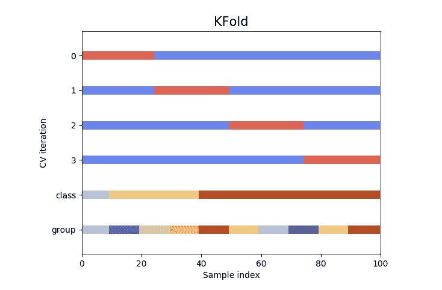

# Scikit 学习教程:安装、要求和构建分类模型

> 原文：<https://blog.quantinsti.com/scikit-learn-tutorial/>

由阿舒托什·戴夫

Scikit-learn 是最通用、最高效的机器学习库之一。scikit learn 建立在其他流行的库(如 NumPy、SciPy 和 Matplotlib)之上，包含许多用于机器学习和统计建模的强大工具。难怪 scikit learn 被数据科学家、研究人员和学生广泛使用。大型组织正在使用 scikit learn 从数据中获取洞察力以制定业务决策。

在这篇博客中，我们将了解如何利用 Scikit Learn 的强大功能和简单性来构建一个分类模型(也称为分类器)并逐步调整其参数。
T3[T5](https://quantra.quantinsti.com/machine-learning-for-trading-ebook)T7】

我们将在本 Scikit 学习教程中涵盖以下主题

*   [安装和导入 scikit 学习](#import)
*   [在 scikit learn 中处理数据的要求](#work)
*   [虹膜数据集](#iris)
*   [将数据分成训练集和测试集](#split)
*   [使用 scikit learn 构建分类模型的步骤](#steps)

让我们从基础开始，即安装和导入 scikit 学习库:

## 安装和导入 scikit learn

可以使用以下标准命令在 jupyter 笔记本环境中安装和导入 Scikit learn:

在[5]中:

```
!pip install scikit-learn
import sklearn

```

那很简单！在下一节中，我们将讨论 scikit learn 中的数据要求。

## 在 scikit learn 中处理数据的要求

在我们开始使用 scikit learn 训练我们的模型之前，让我们了解机器学习中的以下命名约定:

*   特征=预测变量=独立变量
*   目标变量=因变量=响应变量
*   样本=记录=实例

在使用 scikit 学习库训练模型之前，它对数据有以下要求:

接下来，我们将看到一个符合上述要求的数据集示例，用于 scikit learn。

## 虹膜数据集

Scikit learn 附带了一些标准数据集。其中之一就是著名的虹膜数据集，它是由统计学家 R. A. Fisher 爵士在 1936 年首次提出的。
该数据集用于解决一个简单的分类问题，其中我们必须预测鸢尾花的物种(Setosa、Versicolor 或 Virginica ),给定一组以厘米为单位的测量值(萼片长度、萼片宽度、花瓣长度和花瓣宽度)。

鸢尾数据集有 150 个鸢尾花的实例，对于每个实例，我们有上述四个测量值(特征)和物种代码(响应)。
响应以物种代码的形式出现(0、1 和 2 分别代表刚毛藻、云芝和海滨锦葵)。这便于我们在 scikit learn 中使用它，因为根据上述要求，特征和响应数据都应该是数字。

让我们从 scikit 学习库的“数据集”子模块中获取虹膜数据集，并使用以下命令将其保存在名为“Iris”的对象中:

在[6]中:

```
from sklearn import datasets
iris= datasets.load_iris()
```

“iris”对象属于类 Bunch，也就是说，它是以类似字典的格式捆绑在一起的各种对象的集合。这些对象包括特征矩阵“数据”和目标向量“目标”。我们将把它们分别保存在对象 X 和 y 中:

在[7]中:

```
#storing feature matrix in "X"
X=iris.data
#storing target vector in "y"
y=iris.target
```

现在让我们检查这两个物体的类型和形状:

在[8]中:

```
#Printing the type of X and y to check if they meet the NumPy array requirement
print(" type of X:",type(X),"\n","type of y:",type(y))
#Printing the shape of X and y to check if their sizes are compatible
print(" shape of X:",X.shape,"\n","shape of y:",y.shape)

```

```
 type of X: <class 'numpy.ndarray'>
 type of y: <class 'numpy.ndarray'>
 shape of X: (150, 4)
 shape of y: (150,)
```

我们看到 X 和 y 的类型是 numpy ndarray，其中 X 有 150 个实例，有四个特征，y 是一个一维数组，有 150 个值。

太好了！我们看到 scikit learn 中使用 X 和 y 作为特征矩阵和响应向量的所有三个要求都得到了满足。

## 将数据分为训练集和测试集

在我们开始建模过程之前，将数据分成训练集和测试集总是一个好主意，以避免**过度拟合**的问题。当模型对其训练的数据点具有高预测能力，但对样本外或新数据的概括能力较差时，就会发生过度拟合。

当我们只使用训练集来训练模型时，我们仍然有测试集来检查模型的性能。因此，拆分数据有助于我们评估数据的样本外准确性，因为测试数据集是新的或模型看不到的。

我们可以使用 scikit learn 的模型选择子模块中的 train_test_split()函数轻松实现这种分割:

在[9]中:

```
#importing the train_test_split function from the model selection submodule of scikit learn library
from sklearn.model_selection import train_test_split
#Splitting X into Xtrain and Xtest while splitting y into ytrain and ytest
X_train, X_test, y_train, y_test = train_test_split(X, y,test_size=0.25, random_state=123, stratify=y)
```

我们已经将该函数中 test_size 参数的值设置为 0.25。这意味着我们将 25%的数据保留在测试集中，并将剩余的 75%用作模型的训练集。我们还设置了一个任意的“随机状态”(或种子)，以便以后可以重现我们的结果。最后，我们根据目标变量对样本进行了分层。这确保我们的训练集看起来与测试集相似，使评估指标更加可靠。

接下来，我们将使用我们创建的数据集来说明 scikit learn 中的模型开发步骤。

## 使用 Scikit learn 构建分类模型的步骤

在 scikit learn 中创建学习模型的整个生命周期可以大致分为五个步骤。我们现在将详细介绍每个步骤，并使用虹膜数据上的 k 最近邻分类算法作为示例。k 近邻(kNN)是最简单的学习策略之一:它简单地存储所有训练数据，对于任何未知量，简单地返回最近训练点的标签。

## 步骤 1:从 scikit learn 中特定算法所属的“类”或“族”中导入该算法

有一些算法家族(或类)在方法论上共享一些方面。例如，线性回归和逻辑回归算法都属于 scikit learn 中称为线性模型的家族。对于本博客的范围，我们将只关注训练一个 kNN 分类器并调整其参数。kNN 算法属于 scikit learn 中的“neighbors”类，可以按如下方式导入:

在[2]中:

```
# importing the kNN classifier from the neighbors submodule of scikit learn
from sklearn.neighbors import KNeighborsClassifier
```

## 步骤 2:实例化算法，以创建具有特定超参数的“估计器”或“模型”

作为学习模型的一部分，我们处理两种参数:超参数和模型参数。**超参数**表示关于模型的结构信息，通常由模型开发者在数据适合模型之前选择。另一方面，模型参数可以直接从数据中学习和优化(例如回归系数)。

kNN 算法有一个超参数 **k(又名 n_neighbors)** ，作为模型开发人员，我们必须选择这个超参数来获得数据的最佳拟合。直观上，我们可以认为 k 控制着标签之间决策边界的形状。

举例来说，现在让我们在 scikit learn 中创建一个 kNN 分类器实例，超参数 k=6，并将其保存在名为 knn6 的对象中:

在[10]中:

```
# instatntiating the kNN classifier using scikit learn with k=6
knn6 = KNeighborsClassifier(n_neighbors=6)
```

关于 scikit learn 需要注意的另一点是，超参数的缺省值非常通用。对于 knn6 分类器，其他超参数(其值我们没有明确给出)如 leaf_size、metric、weights 等。被设置为默认值。

现在让我们来看看我们使用 scikit learn 创建的 knn6 对象:

在[11]中:

```
knn6

```

Out[11]:

```
KNeighborsClassifier(algorithm='auto', leaf_size=30, metric='minkowski',
 metric_params=None, n_jobs=1, n_neighbors=6, p=2,
 weights='uniform')
```

我们可以观察上面 scikit learn 提供的超参数默认值。在下一步中，我们将看到如何使 knn6 分类器适合 scikit learn 中的数据。

## 步骤 3:使模型符合训练数据(即在 scikit learn 中“训练”模型)

只有在我们将分类器与数据相匹配之后，我们才能得到一个实际的模型。先前创建的 knn6 估计器都被设置为从训练数据集“学习”。我们现在将使用简单的命令将特征矩阵 X_train 和响应向量 y_train 输入到 knn6 估计器中:

在[12]中:

```
# Fitting the knn6 classifier object to the training data
knn6.fit(X_train, y_train)

```

Out[12]:

```
KNeighborsClassifier(algorithm='auto', leaf_size=30, metric='minkowski',
 metric_params=None, n_jobs=1, n_neighbors=6, p=2,
 weights='uniform')
```

就是这样！我们现在已经使用一行简单的代码训练了我们的模型。这展示了 scikit 学习库的强大功能和易用性。在下一步中，我们将看到如何使用我们刚刚训练的模型在 scikit learn 中进行预测。

## 步骤 4:预测测试数据的响应

我们现在可以根据看不见的或新的数据做出预测。例如，如果我们随机选择一朵新的鸢尾花，并测量四个特征值，我们的模型现在可以根据它从训练数据集中学习的内容来预测花的种类。假设测得的特征值如下:

让我们将特征值保存在名为 X_new 的对象中，并使用 knn6 估计器来预测物种代码:

在[13]中:

```
#saving the feature values for this in an object called X_new
X_new = [[3, 2, 3.3, 2.9]]
#predicting the species code of the new flower using knn6 classifier
knn6.predict(X_new)
#printing the results
print(knn6.predict(X_new))
print(iris.target_names[knn6.predict(X_new)])

```

```
[1]
['versicolor']

```

我们的模型已经预测新的花属于鸢尾的 Verscicolor 类型，其响应值为 1。

类似地，我们现在将预测测试数据(X_test)中所有 38 个实例的响应值，并将预测保存在 y_pred 中:

在[15]中:

```
#predicting the specie codes for all instances in the test data
y_pred=knn6.predict(X_test)
# printing the results of pediction
print(y_pred)
print(iris.target_names[y_pred])

```

```
[2 0 1 2 0 0 1 2 1 0 1 0 2 2 1 2 0 0 0 0 0 0 1 2 0 2 2 1 2 1 1 2 1 1 2 1 2
 1]
['virginica' 'setosa' 'versicolor' 'virginica' 'setosa' 'setosa'
 'versicolor' 'virginica' 'versicolor' 'setosa' 'versicolor' 'setosa'
 'virginica' 'virginica' 'versicolor' 'virginica' 'setosa' 'setosa'
 'setosa' 'setosa' 'setosa' 'setosa' 'versicolor' 'virginica' 'setosa'
 'virginica' 'virginica' 'versicolor' 'virginica' 'versicolor'
 'versicolor' 'virginica' 'versicolor' 'versicolor' 'virginica'
 'versicolor' 'virginica' 'versicolor']

```

既然我们已经预测了测试数据中所有数据点的种类，我们现在可以继续确定和改进我们预测的质量。这将是我们的下一步，即 scikit learn 中的模型评估。

## 步骤 5:模型评估:微调 scikit learn 中的分类模型

在前四个步骤中，我们开发了一个模型，并对测试数据进行了预测。现在我们进入模型评估阶段，在此阶段，我们将通过 scikit learn 实现以下目标:

*   量化我们模型的性能
*   估计我们的模型在样本外数据上的性能
*   为模型选择最佳的调整参数集

让我们首先看看如何使用混淆矩阵和准确度分数来量化我们的模型在 scikit learn 中的性能:

### 混淆矩阵和准确度分数

为了衡量我们的模型的准确性，并能够将其与其他模型进行比较，我们需要可以将预测值(y_pred)与实际值(y_test)进行比较的度量。Scikit learn 以混淆矩阵的形式让我们轻松完成这项任务。

混淆矩阵通常用于总结分类模型的预测结果。正确和错误预测的数量以每个标签分解的计数值表示。现在让我们为我们的分类器做出的预测建立一个混淆矩阵:

在[16]中:

```
# importing confusion_matrix function from the metrics sub-module of scikit learn
from sklearn.metrics import confusion_matrix
print(confusion_matrix(y_test,y_pred))

```

```
[[12 0 0]
 [ 0 12 1]
 [ 0 1 12]]

```

混淆矩阵显示了模型在预测标签时的“混淆”。例如，在上面的矩阵中，我们可以看到 knn6 分类器在最后两个标签之间有些混淆，因为在非对角线位置存在非零值。然而，困惑只存在于测试数据的 38 个观察值中的两个。这意味着 38 次预测中有 36 次是准确的。这可以通过称为**准确度分数**的指标量化为百分比，也是 scikit learn 中指标子模块的一部分:

在[17]中:

```
# importing accuracy_score function from the metrics sub-module of scikit learn
from sklearn.metrics import accuracy_score
print("accuracy score=",accuracy_score(y_test,y_pred),"\n")

```

```
accuracy score= 0.9473684210526315

```

我们的模型具有 0.947 的准确度分数，即来自测试数据的几乎 95%的观察值被正确分类。

### 仅使用测试序列分割的问题

我们利用测试数据集(我们的模型仍然看不到)来验证模型。理论上，在测试数据集上计算的准确性度量应该给我们一个对我们的模型在看不见的/新的或不在样本数据上的性能的合理估计。

但是，有风险。如果我们将整个数据集的另一个子集作为训练数据集，模型性能可能会发生显著变化。这导致了我们的模型做出的预测的变化，并且我们的模型基于随机选择的训练-测试对可能看起来或多或少更熟练。

另一个问题是，当我们拆分数据并对训练过程隐藏测试数据时，我们可能会丢失对训练模型有价值的信息。这是一个更大的问题，特别是当我们希望在操作环境中部署模型，并且我们没有大量的数据时。

处理这些问题的一个流行的解决方案是使用 **K 倍交叉验证**。

### scikit 学习中的 k 倍交叉验证

K-交叉验证**(此 K 不同于 kNN 分类器的 K)**是一种统计技术，涉及将数据划分为大小相等的“K”个子集。该模型在(K-1)个子集的数据上训练，并且剩余的一个子集被用作验证该模型的测试数据集。我们执行多轮上述过程，直到所有 K 个子集都被用于验证一次。然后，我们将这些多轮验证的结果结合起来，得出对模型性能的估计。



[来源](https://scikit-learn.org)

上述过程减少了可变性，因此 K 重交叉验证为我们提供了对样本外数据的模型性能的更准确的估计。现在让我们在 scikit learn 中为我们的模型实施 10 重交叉验证:

在[20]中:

```
# importing cross_val_score function from the model_selection sub-module of scikit learn
from sklearn.model_selection import cross_val_score
# Saving the accuracy scores for a 10 fold cross validation in Accuracy_scores
Accuracy_scores = cross_val_score(knn6, X, y, cv=10, scoring='accuracy')
#Printing all 10 accuracy scores
print(Accuracy_scores)

```

```
[1\. 0.93333333 1\. 1\. 0.86666667 0.93333333
 0.93333333 1\. 1\. 1\. ]

```

在[21]中:

```
# Taking the average of all 10 accuracy scores
print(Accuracy_scores.mean())

```

```
0.9666666666666668

```

与之前获得的 0.9473 相比，平均值 0.9666 是对我们模型准确性的更好估计，即我们最初的训练测试分割低估了 knn6 模型对样本外数据的预测能力。

### 使用 scikit learn 中的 GridsearchCV 进行超参数调整

早些时候，我们已经随机选择了我们的 kNN 模型的超参数 k 的值为 6，并且方便地将我们的模型命名为 knn6。我们将所有其他超参数保留为默认值。然而，我们不知道这组超参数是否在三种鸢尾物种之间产生最佳决策边界。因此，一种更好的方法是使用一种算法来自动找到特定模型的最佳参数集，而不是通过试错来找到参数值。GridSearchCV 就是这样一种算法，它可以找到我们正在寻找的一组最佳超参数值。

GridSearchCV 利用交叉验证概念(前面讨论过)来寻找超参数值所有可能组合的精确度，并且**自动寻找并拟合最佳组合。**

让我们考虑到目前为止我们已经考虑过的 kNN 算法的例子。假设我们想要调整 kNN 模型的两个超参数，即:

*   n _ 邻居(又名 k)和
*   叶子大小

我们可以为这些参数定义一个包含潜在值的对象，如下所示:

在[18]中:

```
# importing GridSearchCV algorithm from the model_selection sub-module of scikit learn
from sklearn.model_selection import GridSearchCV
#Define an object containing hyperparameter name and potential values as key-value pairs
hyperparameter_values = {'n_neighbors':[1,3,5,7,9,11], 'leaf_size':[20,25,30,35,40]}

```

因此，对于超参数值总共有三十(6×5)种可能的组合，因此对于 kNN 估计量有三十种可能性。
让我们实现 GridSearchCV 算法，找出最佳算法，然后将数据拟合到该算法中:

在[24]中:

```
# Instantiating the GridSearchCV algorithm
gs=GridSearchCV(KNeighborsClassifier(),hyperparameter_values,cv=10)
# fitting the data
gs.results=gs.fit(X,y)

```

我们在这里所做的类似于对 30 个可能的估计值中的每一个进行 10 重交叉验证，并将最佳结果保存在名为“gs”的对象中。我们现在可以访问最佳估计值、参数值和准确度分数，如下所示:

在[37]中:

```
print('Best estimator/model: ',gs.results.best_estimator_)
print('Best parameter combination: ',gs.results.best_params_)
print('Best accuracy score: ',gs.results.best_score_)

```

```
Best estimator/model: KNeighborsClassifier(algorithm='auto', leaf_size=20, metric='minkowski',
 metric_params=None, n_jobs=None, n_neighbors=9, p=2,
 weights='uniform')
Best parameter combination: {'leaf_size': 20, 'n_neighbors': 9}
Best accuracy score: 0.9733333333333334

```

最佳估计值是 k(n_neighbor)值为 9 且 leaf_size=20 的 kNN 模型，其产生的准确度得分为 0.9733，比先前计算的 knn6 估计值的交叉验证得分 0.966 有显著提高。

### 保存最佳模型以备将来使用

既然我们已经努力构建了一个最佳模型，我们可以使用 joblib 库(joblib 包含一组在 Python 中提供轻量级管道的工具)将它保存为 pickle 文件以供将来使用，如下所示:

在[40]:

```
# !pip install joblib (if not installed already)
import joblib
#Save model for future use with a pickle file extension
joblib.dump(gs, 'kNN_optimized.pkl')
#To load it back use
joblib.load('kNN_optimized.pkl')

```

Out[40]:

```
GridSearchCV(cv=10, error_score='raise-deprecating',
 estimator=KNeighborsClassifier(algorithm='auto', leaf_size=30,
 metric='minkowski',
 metric_params=None, n_jobs=None,
 n_neighbors=5, p=2,
 weights='uniform'),
 iid='warn', n_jobs=None,
 param_grid={'leaf_size': [20, 25, 30, 35, 40],
 'n_neighbors': [1, 3, 5, 7, 9, 11]},
 pre_dispatch='2*n_jobs', refit=True, return_train_score=False,
 scoring=None, verbose=0)
```

## 结论

因此，我们已经了解了如何安装和导入 scikit 学习库。我们还使用 scikit learn 完成了训练和优化分类模型的所有步骤。在下一篇博客中，我们将探讨如何在 scikit learn 中训练和微调回归模型。

快乐学习到那时！

有许多人可能是 Python 或编程的新手，或者从未创建过任何交易策略。如果你是这两种技能的初学者，学习曲线可能会很陡。然而，你可以通过在这里注册来逐步建立所需的技能，并定期练习我们课程中给出的实践学习练习:[人人算法交易](https://quantra.quantinsti.com/learning-track/algorithmic-trading-for-everyone)。

如果你想学习算法交易的各个方面，那就去看看我们的[算法交易(EPAT )](https://www.quantinsti.com/epat/) 高管课程。课程涵盖统计学&计量经济学、金融计算&技术和算法&定量交易等培训模块。EPAT 旨在让你具备成为成功交易者的正确技能。[现在报名](https://www.quantinsti.com/epat/)！

*免责声明:股票市场的所有投资和交易都有风险。在金融市场进行交易的任何决定，包括股票或期权或其他金融工具的交易，都是个人决定，只能在彻底研究后做出，包括个人风险和财务评估以及在您认为必要的范围内寻求专业帮助。本文提到的交易策略或相关信息仅供参考。*