# Python Matplotlib 教程:绘制数据和定制

> 原文：<https://blog.quantinsti.com/python-matplotlib-tutorial/>

杰伊·帕尔马

Matplotlib 是一个流行的 Python 库，可用于非常容易地创建数据可视化。它可能是 2D 图形中使用最多的 Python 包，对 3D 图形的支持有限。它既提供了一种非常快速的方式来可视化来自 Python 的数据，又提供了多种格式的出版物质量的数字。此外，它从一开始就被设计用于两个目的:

1.  允许图形和情节的交互、跨平台控制
2.  无需任何图形用户界面，轻松生成静态矢量图形文件。

与 Python 本身非常相似，Matplotlib 让开发人员可以完全控制他们的绘图外观。它试图把简单的事情变得简单，把困难的事情变得可能。我们可以生成图表、直方图、功率谱、条形图、误差图、散点图等。只需要几行代码。对于简单的绘图，`matplotlib`包中的`pyplot`模块为底层面向对象绘图库提供了一个类似 MATLAB 的接口。它隐式地自动创建图形和轴，以实现所需的绘图。
T3[T5](https://www.quantinsti.com/python-basics-handbook)T7】

在 Python Matplotlib 教程中，我们将讨论以下主题:

*   [如何导入 Python Matplotlib](#import)
*   [Matplotlib 中的基本术语和概念](#terms)
*   [在 Python Matplotlib 中绘制数据](#plot)
*   [使用 Python Matplotlib 进行绘图定制](#customize)
*   [使用 Python Matplotlib 的多个图](#multiple)

## 如何导入 Python Matplotlib

为了开始使用 Python Matplotlib，我们首先*导入*包。使用别名作为`plt`来导入`matplotlib.pyplot`是一种常见的做法。`pyplot`是 Matplotlib 中的子包，提供了通用的图表功能。此外，如果我们在 Jupyter 笔记本中工作，行`%matplotlib inline`变得很重要，因为它确保图形嵌入到笔记本中。下面的示例演示了这一点:

```py
import matplotlib.pyplot as plt

%matplotlib inline

```

> 不属于 Python 标准库，因此，像任何其他第三方库一样，它需要安装后才能使用。可以使用命令`pip install matplotlib`进行安装。

你可以通过下面的博客了解如何安装和导入 [Python 包](https://blog.quantinsti.com/installing-python-packages/)。至此，您已经了解了如何导入 matplotlib。在我们开始绘制图表之前，让我们首先理解 Python matplotlib 教程下一节中的关键术语。

## Matplotlib 中的基本术语和概念

Python Matplotlib 允许创建各种各样的绘图和图形。Matplotlib 是一个大型项目，乍一看可能会令人望而生畏。然而，我们将开始学习组件，它应该感觉更小，更容易接近。

不同的来源用“情节”来表示不同的东西。因此，让我们从定义跨领域使用的特定术语开始。

*   `Figure`是层次结构中的顶级容器。它是绘制所有内容的整体窗口。我们可以有多个独立的图形，每个图形可以有多个`Axes`。可以使用`pyplot`模块的`figure`方法创建。

*   `Axes`是绘图发生的地方。轴实际上是我们绘制数据的区域。每个`Axes`都有一个`X-Axis`和一个`Y-Axis`。

下面提到的例子说明了上述术语的用法:

```py
fig = plt.figure()
<Figure size 432x288 with 0 Axes>

```

在运行上面的例子时，实际上什么也没有发生。它只创建了一个大小为 432 x 288 的 0 轴图形。另外，Python Matplotlib 不会显示任何东西，直到被告知这样做。Python 将等待对`show`方法的调用来显示绘图。这是因为我们可能想在显示之前向绘图添加一些额外的特性，比如标题和标签定制。因此，我们需要调用`plt.show()`方法来显示下图:

```py
plt.show()

```

由于没有什么可绘制的，所以不会有输出。当我们进入主题时，我们可以通过`figsize`参数控制图形的大小，它需要一个以英寸为单位的(width，height)元组。

```py
fig = plt.figure(figsize=(8, 4))
<Figure size 576x288 with 0 Axes>
plt.show()

```

### 轴线

所有绘图都是相对于一个`Axes`完成的。一个轴是由`Axis`物体和许多其他东西组成的。一个*轴*对象必须属于一个`Figure`。我们在 Python mathplotlib 中发布的大多数命令都与这个*轴*对象有关。通常，我们会设置一个`Figure`，然后在其上添加`Axes`。我们可以使用`fig.add_axes`，但在大多数情况下，我们发现添加一个支线剧情完全符合我们的需要。子图是网格系统中的一个轴。

*   方法将一个`Axes`添加到图形中，作为子情节排列的一部分。

```py
""" Example 1 """
# Creating figure
fig = plt.figure()

# Creating subplot
ax = fig.add_subplot(111) # Subplot with 1 row and 1 column at the index 1
plt.show()

```

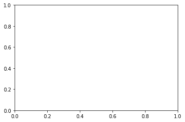

上面的代码在`add_subplot()`方法的帮助下给图`fig`添加了一个单独的情节。我们得到的输出是一个空白图，轴的范围从 0 到 1，如上所示。在 Python matplotlib 中，我们可以使用更多的内置方法自定义绘图。让我们添加标题、X 轴标签、Y 轴标签，并在两个轴上设置限制范围。下面的代码片段说明了这一点。

```py
""" Example 2 """
fig = plt.figure()

# Creating subplot/axes
ax = fig.add_subplot(111)

# Setting axes/plot title
ax.set_title('An Axes Title')

# Setting X-axis and Y-axis limits
ax.set_xlim([0.5, 4.5])
ax.set_ylim([-3, 7])

# Setting X-axis and Y-axis labels
ax.set_ylabel('Y-Axis Label')
ax.set_xlabel('X-Axis Label')

# Showing the plot
plt.show()

```

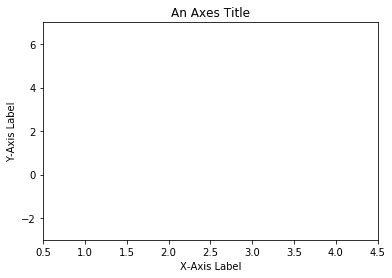

Python Matplotlib 的对象通常有许多*显式设置器*，即以`set_<something>`开头并控制特定选项的方法。使用显式设置器设置每个选项变得重复，因此我们可以使用如下所示的`set`方法直接在轴上设置所有需要的参数:

```py
""" Example 2 using the set method """
fig = plt.figure()

# Creating subplot/axes
ax = fig.add_subplot(111)

# Setting title and axes properties
ax.set(title='An Axes Title', xlim=[0.5, 4.5], ylim=[-3, 7], ylabel='Y-Axis Label', xlabel='X-Axis Label')

plt.show()

```

> `set`方法不适用于`Axes`；它或多或少适用于所有 Python matplotlib 对象。

上面的代码片段输出与上面的图 2 相同，使用`set`方法将所有需要的参数作为实参传递给它。

### 轴方法 v/s `pyplot`

有趣的是，Python Matplotlib 中 axes 对象的几乎所有方法都作为一个方法存在于`pyplot`模块中。例如，我们可以调用`plt.xlable('X-Axis Label')`来设置 X 轴的标签( *`plt`是`pyplot` )* 的别名)，进而调用*当前*轴上的`ax.set_xlabel('X-Axis Label')`。

```py
""" Example 3 """
# Creating subplots, setting title and axes labels using `pyplot`
plt.subplots()
plt.title('Plot using pyplot')
plt.xlabel('X-Axis Label')
plt.ylabel('Y-Axis Label')
plt.show()

```

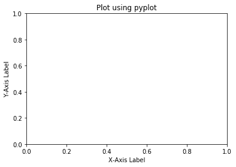

上面的代码更简单一些，用更少的变量来构建一个图。它使用隐式调用轴的方法进行绘图。然而，如果我们看一看*《蟒蛇的禅》*(试试`import this`)，它说:

```py
"Explicit is better than implicit."
```

虽然非常简单的绘图，加上简短的脚本，将受益于`pyplot`隐式方法的简洁性，但当绘制更复杂的绘图或在更大的脚本中工作时，我们将希望明确地传递轴和/或图形对象以进行操作。我们将在 Python matplotlib 教程中使用这两种方法，只要它认为合适。

每当我们看到如下内容时:

```py
fig = plt.figure()
ax = fig.add_subplot(111)

```

可以替换为以下内容:

```py
fig, ax = plt.subplots()

```

两个版本的代码产生相同的输出。但是，后一个版本更干净。

### 多轴

一个图形可以有多个`Axes`。在 Python matplotlib 中，最简单的方法是使用`plt.subplots()`调用创建一个图形，并自动为其添加轴。轴将位于规则的网格系统中。举个例子，

```py
""" Example 4 """
# Creating subplots with 2 rows and 2 columns
fig, axes = plt.subplots(nrows=2, ncols=2)
plt.show()

```

运行上述代码后，Python Matplotlib 将生成一个图形，其中添加了四个子图形，排列在两行两列中，如下所示:

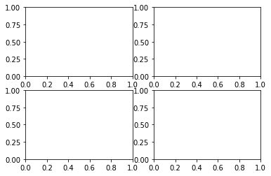

这里返回的`axes`对象将是一个 2D-NumPy 数组，数组中的每一项都是一个支线剧情。因此，当我们想要使用这些轴中的一个时，我们可以索引它并使用该项的方法。让我们使用 axes 方法为每个子情节添加标题。

```py
""" Example 5 """
# Create a figure with four subplots and shared axes
fig, axes = plt.subplots(nrows=2, ncols=2, sharex=True, sharey=True)
axes[0, 0].set(title='Upper Left')
axes[0, 1].set(title='Upper Right')
axes[1, 0].set(title='Lower Left')
axes[1, 1].set(title='Lower Right')
plt.show()

```

上面的代码创建了一个有四个子情节并共享 X 和 Y 轴的图形。轴以行和列的方式在子情节中共享。然后我们使用`set`方法为每个子情节设置一个标题。子情节以顺时针方式排列，每个子情节具有唯一的索引。输出如下所示:


## 在 Python Matplotlib 中绘制数据

到目前为止，在这个 Python matplotlib 教程中，我们已经讨论了很多关于布局的内容，但是我们还没有真正讨论任何关于绘制数据的内容。Python Matplotlib 有各种绘图功能。比我们将在这里讨论和涵盖的要多得多。然而，一开始，一份完整的名单或画廊 <sup>1</sup> 可能会让人有些不知所措。因此，我们将压缩它，并试图从简单的绘图开始，然后走向更复杂的绘图。`pyplot`的`plot`方法是 Python Matplotlib 中最广泛使用的绘制数据的方法之一。调用`plot`方法的语法如下所示:

```py
plot([x], y, [fmt], data=None, **kwargs)

```

点或线节点的坐标由 *x* 和 *y* 给出。可选参数 *fmt* 是定义颜色、市场和风格等基本格式的便捷方式。在 Python 中,`plot`方法用于绘制几乎任何类型的数据。它告诉 Python 要绘制什么以及如何绘制，还允许定制要生成的图，如颜色、类型等。

### 线形图

在 Python matplotlib 中，可以使用`plot`方法绘制线图。它以线条和/或标记绘制 Y 与 X 的关系。下面我们讨论几个画线的场景。为了绘制直线，我们提供了分别沿 X 和 Y 轴绘制的坐标，如下面的代码片段所示。

```py
""" Example 6 """
# Defining coordinates to be plotted on X and Y axes respectively
x = [1.3, 2.9, 3.1, 4.7, 5.6, 6.5, 7.4, 8.8, 9.2, 10]
y = [95, 42, 69, 11, 49, 32, 74, 62, 25, 32]

# Plot lists 'x' and 'y'
plt.plot(x, y)

# Plot axes labels and show the plot
plt.xlabel('X-axis Label')
plt.ylabel('Y-axis Label')
plt.show()

```

上面的代码沿着 X 轴绘制了列表`x`中的值，沿着 Y 轴绘制了列表`y`中的值。输出如下所示:

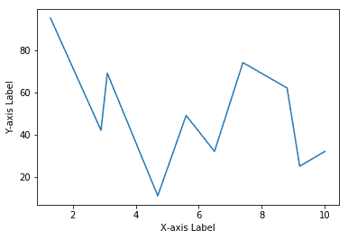

对`plot`的调用采用尽可能少的参数，即仅 Y 轴的值。在这种情况下，Python Matplotlib 会隐式地将列表`y`中元素的索引视为 X 轴的输入，如下例所示:

```py
""" Example 7 """
# Defining 'y' coordinates
y = [95, 42, 69, 11, 49, 32, 74, 62, 25, 32]

# Plot list 'y'
plt.plot(y)

# Plot axes labels and show the plot
plt.xlabel('Index Values')
plt.ylabel('Elements in List Y')
plt.show()

```

这里，我们定义了一个名为`y`的列表，其中包含了要绘制在 Y 轴上的值。输出如下所示:

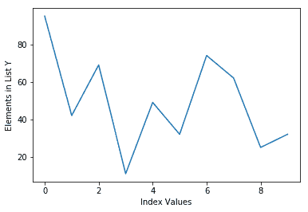

上面创建的图使用默认的线条样式和颜色。在`plot`方法中的可选参数 *fmt* 是一种定义基本格式的便捷方式，比如颜色、标记和线条样式。它是由颜色、标记和线条组成的快捷字符串符号:

```py
fmt = '[color][marker][line]'
```

每个都是可选的。如果未提供，则使用样式周期中的值。我们在下面的例子中使用这个符号来改变线条颜色:

```py
""" Example 8 """
# Plot line with green color
plt.plot(y, 'g')

# Plot axes labels and show the plot
plt.xlabel('Index Values')
plt.ylabel('Elements in List Y')
plt.show()

```

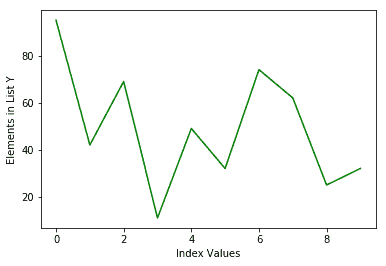

按照 *fmt* 字符串符号，我们使用字符`g`将线条的颜色改为绿色，这是指线条的颜色。同样，使用如下所示的相同符号添加标记:

```py
""" Example 9 """
# Plot continuous green line with circle markers
plt.plot(y, 'go-')

# Plot axes labels and show the plot
plt.xlabel('Index Values')
plt.ylabel('Elements in List Y')
plt.show()

```

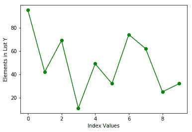

这里， *fmt* 参数`g`指绿色，`o`指圆形标记，`-`指要绘制的连续线。这种格式化技术允许我们以任何我们喜欢的方式格式化一个线图。可以通过调整 *fmt* 字符串中的标记参数来改变标记样式，如下所示:

```py
""" Example 10 """
# Plot continuous green line with circle markers
plt.plot(y, 'g*-')

# Plot axes labels and show the plot
plt.xlabel('Index Values')
plt.ylabel('Elements in List Y')
plt.show()

```

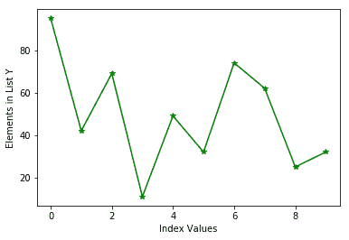

在上面的图中，线条和标记共享相同的颜色，即由 *fmt* 字符串指定的绿色。如果我们要用不同的颜色绘制线条和标记，我们可以使用多种`plot`方法来达到同样的效果。

```py
""" Example 11 """
# Plot list 'y'
plt.plot(y, 'g')

# Plot red circle markers
plt.plot(y, 'ro')

# Plot axes labels and show the plot
plt.xlabel('Index Values')
plt.ylabel('Elements in List Y')
plt.show()

```

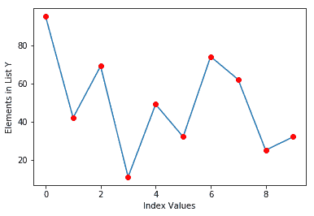

上面的代码沿着*红色圆圈标记*绘制线条。这里，我们首先使用默认样式绘制线条，然后尝试使用属性`r`表示红色和属性`o`表示圆形来绘制*标记*。在同样的线上，我们可以使用同样的技术绘制多组数据。下面给出的示例在同一个图上绘制了两个列表。

```py
""" Example 12 - Technique 1"""
# Define two lists
y = [95, 42, 69, 11, 49, 32, 74, 62, 25, 32]
y2 = [35, 52, 96, 77, 36, 66, 50, 12, 35, 63]

# Plot lists and show them
plt.plot(y, 'go-')
plt.plot(y2, 'b*--')

# Plot axes labels and show the plot
plt.xlabel('Index Values')
plt.ylabel('Elements in Lists')
plt.show()

```

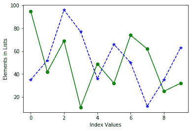

我们可以使用如下所示的不同技术获得如上所示的相同结果:

```py
""" Example 12 - Technique 2"""
# Plot lists and show them
plt.plot(y, 'go-', y2, 'b*--')

# Plot axes labels and show the plot
plt.xlabel('Index Values')
plt.ylabel('Elements in Lists')
plt.show()

```

从本质上讲，`plot`方法使得绘制顺序数据结构变得非常容易，比如 list、NumPy 数组、pandas 系列等。类似于绘制列表，我们可以通过`plot`方法直接绘制 NumPy 数组。让我们画出 NumPy 一维数组。因为我们直接在 IPython 控制台中执行代码，所以不需要调用`plt.show()`,因此，在后面的例子中我们也不会调用它。但是，记住，在编写 Python 代码展示剧情的同时，调用它是绝对必要的。

```py
""" Example 13 """
# Importing NumPy library
import numpy as np

# Drawing 30 samples from a standard normal distribution into an array 'arr'
arr = np.random.normal(size=30)

# Plotting 'arr' with dashed line-style and * markers
plt.plot(arr, color='teal', marker='*', linestyle='dashed')

```

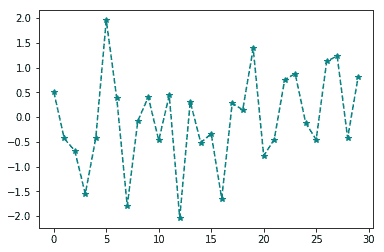

在上面的例子中，我们从正态分布中抽取 30 个样本到数组`arr`中，数组`arr`又被绘制成*虚线*和星号标记。绘制二维数组遵循相同的模式。我们为一个`plot`方法提供一个二维数组来绘制它。

```py
""" Example 14 """
# Creating a two dimensional array 'arr_2d' with 40 samples and shape of (20, 2)
arr_2d = np.random.normal(size=40).reshape(20, 2)

# Plotting the array
plt.plot(arr_2d)

```

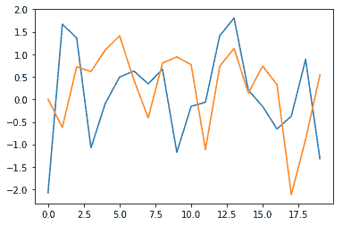

现在让我们把注意力转移到绘制 pandas 数据结构上。pandas 库使用 Python matplotlib 标准惯例直接从其数据结构进行绘图。pandas 还提供了一个`plot`方法，它相当于 Python matplotlib 提供的方法。因此，可以从 pandas 系列和 DataFrame 对象中直接调用`plot`方法。Series 和 DataFrame 上的`plot`方法只是对`plt.plot()`的简单包装。以下示例说明了如何绘制熊猫系列对象:

```py
""" Figure 15 """
# Importing necessary libraries
import pandas as pd
import numpy as np

# Creating pandas Series with 50 samples drawn from normal distribution
ts = pd.Series(np.random.normal(size=50),
               index=pd.date_range(start='1/1/2019', periods=50))

# Plotting pandas Series
ts.plot()

```


在上面的例子中，我们直接在熊猫系列对象`ts`上调用`plot`方法。或者，我们可以打电话给`plt.plot(ts)`。调用`ts.plot()`相当于调用`plt.plot(ts)`，两次调用都会产生几乎相同的输出，如上图所示。此外，pandas 对象上的`plot()`方法支持`plt.plot()`支持的几乎所有格式化属性。例如，在具有`color`属性的熊猫对象上调用`plot`方法会产生一个带有其值所提到的颜色的绘图。如下所示:

```py
""" Figure 16 """
# Plotting pandas Series in green color
ts.plot(color='green')

```

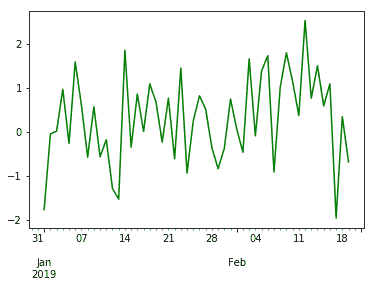

接下来，pandas DataFrame 对象也遵循同样的符号，在 DataFrame 中可视化数据变得更加直观，不再那么奇怪。在我们尝试直接从数据帧绘制数据之前，让我们创建一个新的数据帧并填充它。我们获取 AAPL 股票交易所的股票数据，在 Python matplotlib 教程的剩余部分中，我们将使用这些数据进行说明。

```py
""" Script to fetch AAPL data from a web resource """
# Import libraries
import pandas as pd

# Fetch data 
data = pd.read_csv('https://bit.ly/2WcsJE7', index_col=0, parse_dates=True)

```

dataframe `data`将包含以日期为索引的股票数据。下载数据的摘录如下所示:

| 日期 | 打开 | 高的 | 低的 | 关闭 | 卷 | 除息 | ... |
| --- | --- | --- | --- | --- | --- | --- | --- |
| 2018-03-27 | One hundred and seventy-three point six eight | One hundred and seventy-five point one five | One hundred and sixty-six point nine two | One hundred and sixty-eight point three four | Thirty-eight million nine hundred and sixty-two thousand eight hundred and ninety-three | Zero | ... |
| 2018-03-26 | One hundred and sixty-eight point zero seven | One hundred and seventy-three point one | One hundred and sixty-six point four four | One hundred and seventy-two point seven seven | Thirty-six million two hundred and seventy-two thousand six hundred and seventeen | Zero | ... |
| 2018-03-23 | One hundred and sixty-eight point three nine | One hundred and sixty-nine point nine two | One hundred and sixty-four point nine four | One hundred and sixty-four point nine four | Forty million two hundred and forty-eight thousand nine hundred and fifty-four | Zero | ... |

现在我们可以通过调用`plot`方法来绘制`data`数据帧的任何列。在下面给出的例子中，我们从数据帧的`Volume`列绘制了最近的 100 个数据点:

```py
""" Figure 17 """
# Plot volume column
data.Volume.iloc[:100].plot()

```

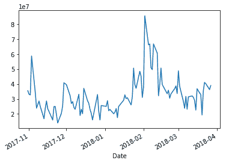

使用 dataframe，`plot`方法可以方便地绘制所有带标签的列。换句话说，如果我们绘制多列，它也会绘制每列的标签。

```py
""" Figure 18 """
data[['AdjOpen', 'AdjClose']][:50].plot()

```


在 pandas 数据结构上调用`plot`方法时，默认情况下会生成一个线图。然而，它也可以生成各种其他图表，我们将在本 Python matplotlib 教程的后面看到。说到这里，让我们继续绘制散点图。

### 散点图

在 Python matplotlib 中，散点图用于可视化两个不同数据集之间的关系。Python Matplotlib 在`pyplot`子模块中提供了`scatter`方法，使用该方法可以生成散点图。

*   `plt.scatter`用不同的标记尺寸和/或颜色生成 *y* 对 *x* 的散点图。

*x* 和 *y* 参数是数据位置，可以是类似数组的顺序数据结构。有些情况下，我们的数据格式允许我们用字符串访问特定的变量。比如 Python 字典或者熊猫 dataframe。Python Matplotlib 允许我们向`scatter`方法提供这样一个带有`data`关键字参数的对象，以便直接从中绘图。下面的例子用一个字典说明了这一点。

```py
""" Figure 19 """
# Creating a dictionary with three key-value pairs
dictionary = {'a': np.linspace(1, 100, 50),
              'c': np.random.randint(0, 50, 50),
              'd': np.abs(np.random.randn(50)) * 100}

# Creating a new dictionary key-value pair
dictionary['b'] = dictionary['a'] * np.random.rand(50)

# Plotting a scatter plot using argument 'data'
plt.scatter('a', 'b', c='c', s='d', data=dictionary)

# Labeling the plot and showing it
plt.xlabel('A Data Points')
plt.ylabel('B Data Points')
plt.show()

```

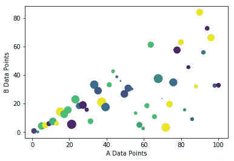

在上面的代码中，我们创建了一个包含四个键值对的字典`dictionary`。键`a`和`b`中的值包含要绘制在散点图上的 50 个随机值。关键字`c`包含五十个随机整数，关键字`d`包含五十个正浮点数，分别代表每个散点图数据点的颜色和大小。然后，调用`plt.scatter`连同所有键和`dictionary`作为`data`的值。调用中的参数`c`表示要使用的颜色，参数`s`表示数据点的大小。这些参数`c`和`s`是可选的。当我们省略这些可选参数时，将绘制一个具有相同颜色和大小的简单散点图，如下例所示:

```py
""" Figure 20 """
# Creating a scatter plot without color and same
plt.scatter(dictionary['a'], dictionary['b'])

# Labeling the plot and showing it
plt.xlabel('A Data Points')
plt.ylabel('B Data Points')
plt.show()

```

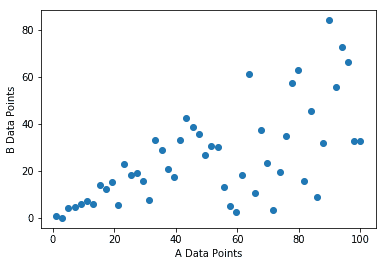

为了更好地理解散点图的工作原理，让我们求助于我们的老朋友:列表`x`和`y`，它们是我们之前在学习线图时定义的，并在其上构建散点图。为了提醒我们，我们在下面重新定义了相同的列表:

```py
# Data points for scatter plot
x = [1.3, 2.9, 3.1, 4.7, 5.6, 6.5, 7.4, 8.8, 9.2, 10]
y = [95, 42, 69, 11, 49, 32, 74, 62, 25, 32]

```

除了这些列表之外，我们将定义另外两个 NumPy 数组`color`和`size`，它们在绘制散点图时分别确定每个数据点的颜色和大小。

```py
# Arrays which defines color and size of each data point
color = np.random.rand(10)
size = np.random.randint(50, 100, 10)

```

现在我们已经准备好数据点，我们可以绘制一个散点图，如下所示:

```py
""" Figure 21 """
# Creating a scatter plot
plt.scatter(x, y, c=color, s=size)

# Labeling the plot and showing it
plt.xlabel('Values from list x')
plt.ylabel('Values from list y')
plt.show()

```

散点图将包含每个具有不同颜色和大小的数据点(因为它们是随机生成的)。输出如下所示:

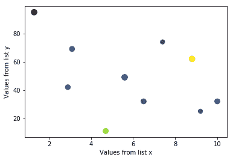

在金融领域，散点图广泛用于直观地确定两个数据集之间的关系。也就是说，在具备散点图的工作知识后，现在让我们继续学习 Python matplotlib 教程，绘制一个熊猫数据框架`data`中 AAPL 股票`AdjOpen`和`AdjClose`价格的散点图。当直接从 pandas dataframe 绘制数据时，我们几乎总是可以在 pandas 上使用`plot`方法来绘制各种图。也就是说，我们可以在数据框上直接使用`plot`方法来绘制散点图，甚至就像线图一样。但是，我们需要指定我们对使用参数`kind='scatter'`绘制散点图感兴趣，如下所示:

```py
""" Figure 22 """
# Plotting a scatter plot of 'AdjOpen' and 'AdjClose' of AAPL stock
data.plot(x='AdjOpen', y='AdjClose', kind='scatter')
plt.show()

```

有趣的是，我们只需要为`x`和`y`坐标以及参数`kind`指定数据帧`data`的列名，结果如下所示:

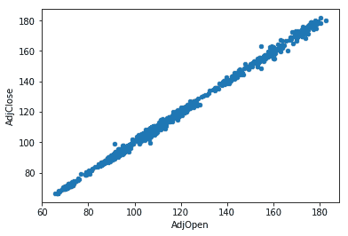

通过使用散点图可视化价格模式，可以推断开盘价和收盘价正相关。此外，我们可以使用`plt.scatter`方法生成相同的图。

```py
""" Method 1 """
plt.scatter(x='AdjOpen', y='AdjClose', data=data)
plt.show()

""" Method 2 """
plt.scatter(x=data['AdjOpen'], y=data['AdjClose'])
plt.show()

```

方法一使用指定数据源的参数`data`，而第二种方法直接使用数据帧切片，因此不需要指定参数`data`。

### 直方图

直方图是数据分布的图形表示。它是一种条形图，是一种可视化数据频率分布的强大工具，几乎任何受众都可以轻松理解。要构建直方图，第一步是*对数据值的范围进行分类*，将整个范围分成一系列区间，最后计算每个区间内有多少个值。这里，仓是连续的且不重叠的。换句话说，直方图以一些组的形式显示数据。所有箱/组在 X 轴上，Y 轴显示每个箱/组的频率。

Python matplotlib 库提供了一种非常方便的绘制直方图的方法。为了创建直方图，我们使用了`matplotlib`库的`pyplot`子模块的`hist`方法。让我们从创建一个简单的直方图开始。

```py
""" Figure 23 """
# Data values for creating a histogram
y = [95, 42, 69, 11, 49, 32, 74, 62, 25, 32]

# Creating a histogram
plt.hist(y)
plt.xlabel('Bins')
plt.ylabel('Frequency')
plt.show()

```

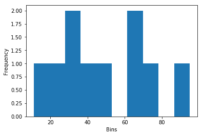

在 Python matplotlib 中，这是用最少的参数绘制直方图的最简单的代码。我们创建一个值的范围，并简单地将其提供给`hist`方法，让它执行剩下的事情(创建库，将每个值隔离到相应的库，绘图等。).`hist`方法也将`bins`作为可选参数。如果指定了此参数，将根据指定的值创建容器，否则，将自行创建容器。为了说明这一点，我们在上面的代码中明确指定了箱的数量并生成了绘图。修改后的代码和输出如下所示:

```py
""" Figure 24 """
# Data values for creating a histogram
y = [95, 42, 69, 11, 49, 32, 74, 62, 25, 32]

# Creating a histogram
plt.hist(y, bins= 20)
plt.xlabel('Bins')
plt.ylabel('Frequency')
plt.show()

```

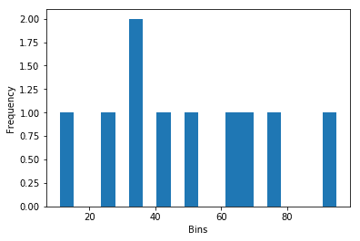

我们得到的输出非常直接。数字`32`在列表`y`中出现两次，直观反映。我们将仓的数量指定为`20`，因此，`hist`方法试图将整个范围的值分成 20 个仓，并将它们绘制在 X 轴上。与`plot`方法类似，`hist`方法也将任何顺序数据结构作为其输入，并绘制其直方图。让我们尝试在 Python matplotlib 中生成一个数组的直方图，它从标准正态分布中抽取样本。

```py
""" Figure 25 """
# Creating an array
array = np.random.normal(0, 1, 10000)

# Creating a histogram
plt.hist(array)
plt.xlabel('Bins')
plt.ylabel('Frequency')
plt.show()

```

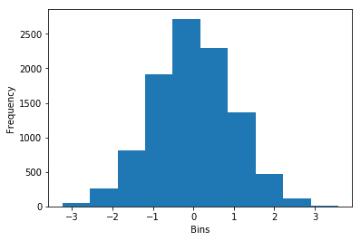

我们得到的输出表明，数据分布确实类似于正态分布。除了`bins`参数外，其他可以提供给`hist`的参数有`color`和`histtype`。有很多论点可以提供，但我们将保持我们的讨论仅限于这几个论点。使用`color`参数可以改变直方图的颜色。`histtype`参数采用一些预定义的值，如`bar`、`barstacked`、`step`和`stepfilled`。下面的示例说明了这些参数的用法。

```py
""" Figure 26 """
# Creating an array
array = np.random.normal(0, 1, 10000)

# Creating a histogram and plotting it
plt.hist(array, color='purple', histtype='step')
plt.xlabel('Bins')
plt.ylabel('Frequency')
plt.show()

```

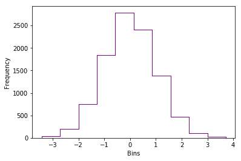

除了到目前为止讨论的可选参数，需要注意的一个参数是`orientation`。该参数采用两个值中的任意一个:`horizontal`或`vertical`。默认为`vertical`。

```py
""" Figure 27 """
# Creating an array
array = np.random.normal(0, 1, 10000)

# Creating a histogram and plotting it
plt.hist(array, color='teal', orientation='horizontal')
plt.xlabel('Frequency')
plt.ylabel('Bins')
plt.show()

```

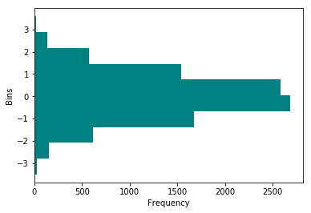

现在，我们将注意力转移到直接从 Python matplotlib 中的 pandas 数据帧绘制直方图上。同样，pandas 中的`plot`方法为 Python matplotlib 中的`hist`函数提供了一个包装器，就像散点图一样。为了绘制直方图，当直接从 dataframe 调用`plot`时，我们需要用值`hist`指定参数`kind`。我们将使用包含 AAPL 股票历史数据的相同数据框架`data`。

```py
""" Figure 28 """
# Method 1
# Creating a histogram using a dataframe method
data['Volume'].plot(kind='hist')
plt.show()

# Method 2
plt.hist(data['Volume'])
plt.ylabel('Frequency')
plt.show()

```

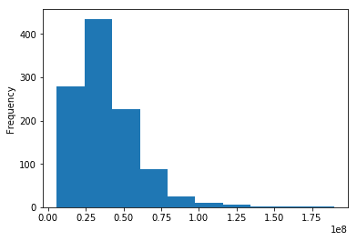

在第一种方法中，我们直接在用`Volume`列切片的数据帧`data`上调用`plot`方法。而在第二种方法中，我们使用由`matplotlib.pyplot`模块提供的`hist`方法来绘制直方图。如上所示，两种方法绘制的结果相同。在 Python matplotlib 教程的下一部分，我们将学习一些有趣的东西，如何定制你自己的情节。

## 使用 Python Matplotlib 进行地块定制

现在我们已经很好地理解了绘制各种类型的图表及其基本格式化技术，我们可以更深入地研究一些格式化技术。我们已经了解到 Python matplotlib 本身不添加任何样式组件。默认情况下，它会绘制一个简单的普通图表。作为用户，我们需要指定我们需要的任何定制。我们从一个简单的线图开始，并将继续改进。以下示例显示了我们在数据框架`data`中获得的 AAPL 股票收盘价。

```py
""" Figure 29 """
# Extracting close prices from the dataframe
close_prices = data['AdjClose']

# Plotting the close prices
plt.plot(close_prices)
plt.show()

```

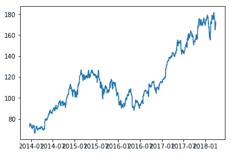

这里，`close_prices`是使用`plot`方法绘制的熊猫系列对象。然而，X 轴上的值是我们不想要的。它们都是相互重叠的。这是因为`plot`方法没有为每个日期找到足够的空间。解决这个问题的一个方法是旋转 X 轴上的值，使其看起来更好。

```py
""" Figure 30 """
plt.plot(close_prices)

# Rotating the values along x-axis to 45 degrees
plt.xticks(rotation=45)
plt.show()

```

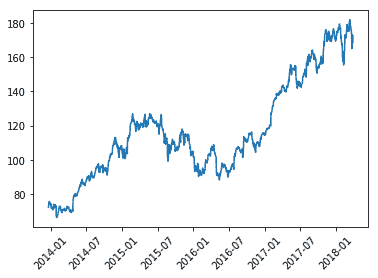

`xticks`方法和`rotation`参数用于沿 x 轴旋转数值/刻度名称。可用于解决重叠问题的另一种方法是增加绘图的图形大小，以便 Python matplotlib 可以轻松显示没有重叠的值。如下例所示:

```py
""" Figure 31 """
# Creating a figure with the size 10 inches by 5 inches
fig = plt.figure(figsize=(10, 5))
plt.plot(close_prices)
plt.show()

```

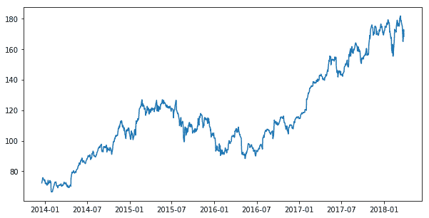

类似地，Python matplotlib 提供了`yticks`方法，可用于定制 Y 轴上的值。除了`rotation`参数，还有一堆其他参数可以提供给`xticks`和`yticks`来进一步定制它们。在下面的示例中，我们使用这些方法中的适当参数来更改沿轴刻度的字体大小、颜色和方向:

```py
""" Figure 32 """
# Creating a figure, setting its size and plotting close prices on it
fig = plt.figure(figsize=(10, 5))
plt.plot(close_prices, color='purple')

# Customizing the axes
plt.xticks(rotation=45, color='teal', size=12)
plt.yticks(rotation=45, color='teal', size=12)

# Setting axes labels
plt.xlabel('Dates', {'color': 'orange', 'fontsize':15})
plt.ylabel('Prices', {'color': 'orange', 'fontsize':15})
plt.show()

```

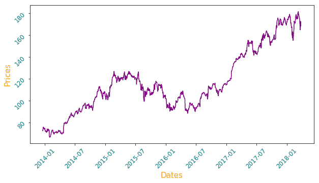

除了轴值，我们还改变了轴标签的颜色和字体大小。使用各种参数可以进行许多其他定制，Python matplotlib 提供了完全的灵活性，可以根据个人需要创建图表。上图中缺少的两个主要组件是标题和图例，可以分别使用方法`title`和`legends`来提供。同样，与其他方法一样，可以用各种方式定制它们，但是我们将只讨论几个重要的参数。在上面的代码中添加这两个方法会产生下面的图:

```py
""" Figure 33 """
# Showing the legend and setting the title of plot
plt.legend()
plt.title('AAPL Close Prices', color='purple', size=20)

```

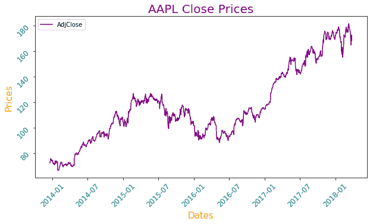

Python matplotlib 中另一个可以添加到图形中的重要特性是使用采用`True`或`False`的`grid`方法在图形中绘制网格。如果为真，则绘制网格，否则不绘制网格。

```py
""" Figure 34 """
# Adding the grid to the plot
plt.grid(True)

```

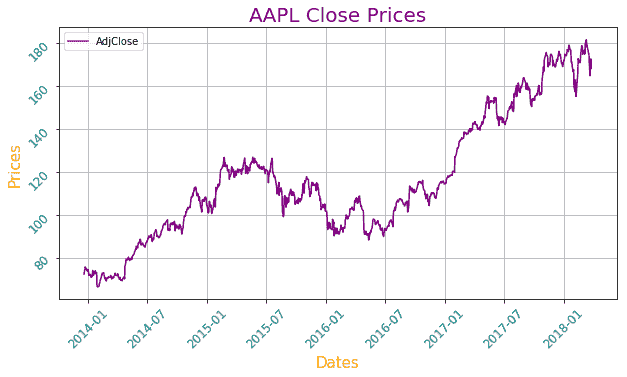

`axhline`方法允许我们在图中添加一条穿过轴的水平线。例如，我们可以考虑添加收盘价的平均值来显示股票在整个持续时间内的平均价格。可以使用 Python matplotlib 中的`axhline`方法添加。平均值的计算及其对原始图的添加如下所示:

```py
""" Figure 35 """
# Importing NumPy library
import numpy as np

# Calculating the mean value of close prices
mean_price = np.mean(close_prices)

# Plotting the horizontal line along with the close prices
plt.axhline(mean_price, color='r', linestyle='dashed')

```

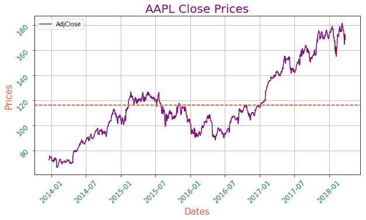

现在我们有了图中收盘价的平均值，第一次看图表的人可能会想这条红线传达了什么？因此，有必要明确提及这一点。为此，我们可以使用由`matplotlib.pyplot`模块提供的`text`方法在图上的任何地方绘制文本。

```py
""" Figure 36 """
# Importing DateTime from DateTime library
from datetime import datetime

# Plotting text on date 2014-1-7 and price 120
plt.text(datetime(2014,1,7), 120, 'Mean Price', size=15, color='r')

```

`text`方法有三个强制参数:`x`、`y`和`t`，分别指定 X 和 Y 轴上的坐标和文本。此外，我们使用来自`datetime`库中的`datetime`子模块来指定 X 轴上的日期，因为我们正在生成的图在 X 轴上有日期。下图是显示平均价格的文字图表:

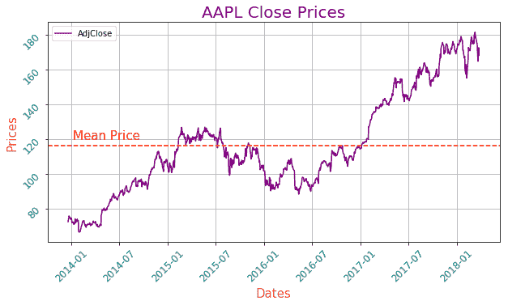

使用所有这些定制技术，我们已经能够将看起来沉闷的价格系列图演变成一个漂亮而有吸引力的图形，不仅易于理解，而且还可以看得见。然而，我们仅限于绘制一张图表。让我们振作起来，学习将这些新获得的定制技术应用于多个地块。

## 使用 Python Matplotlib 的多个图

在 Python matplotlib 教程的开始，我们已经了解到一个图形可以有多个图，这可以通过使用`subplots`方法来实现。下面的例子显示了 AAPL 股票的价格以及每天的交易量。

```py
""" Figure 37 """

# Extracting volume from the dataframe 'data'
volume = data['AdjVolume']

# Creating figure with two rows and one column
fig, (ax1, ax2) = plt.subplots(nrows=2, ncols=1, sharex=True, figsize=(10, 8))

# Plotting close prices on the first sub-plot
ax1.plot(close_prices, color='purple')
ax1.grid(True)

# Plotting trading volume on the second sub-plot
ax2.bar(volume.index, volume)
ax2.grid(True)

# Displaying the plot
plt.show()

```

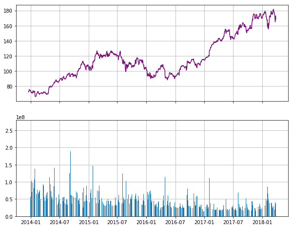

首先，我们将`data`数据帧中的`AdjVolume`列提取到一个`volume`中，它恰好是熊猫系列对象。然后，我们创建一个具有两行和一列子图的图形。这是分别使用`nrows`和`ncols`参数实现的。`sharex`参数指定两个子图将共享相同的 x 轴。同样，我们也使用`figsize`参数指定图形大小。这两个支线剧情分别解包成两个轴:`ax1`和`ax2`。一旦我们有了坐标轴，就可以在上面绘制出想要的图表。

接下来，我们使用`plot`方法绘制`close_prices`，并使用`color`参数将其颜色指定为`purple`。与`plot`方法类似，Python matplotlib 提供了`bar`方法来绘制条形图，该方法采用两个参数:第一个参数绘制在 X 轴上，第二个参数绘制在 y 轴上。对于我们的示例，X 轴上的值恰好是一个日期(由`volume.index`指定)，Y 轴上每个条形的值是使用最近创建的`volume`系列提供的。之后，我们在两个地块上绘制网格。最后，我们显示两个图。从上面可以看出，Python matplotlib 呈现了一个不错的图表。但是，它遗漏了一些关键部分，如标题、图例等。

```py
""" Figure 38 """
# Creating figure with multiple plots
fig, (ax1, ax2) = plt.subplots(nrows=2, ncols=1, sharex=True, figsize=(10, 8))
ax1.plot(close_prices, color='purple', label='Prices')
ax1.grid(True)

# Setting the title of a first plot
ax1.set_title('Daily Prices')

# Setting the legend for the first plot
ax1.legend()

ax2.bar(volume.index, volume, label='Volume')
ax2.grid(True)

# Setting the title of a second plot
ax2.set_title('Volume')

# Setting the legend for the second plot 
ax2.legend()

plt.show()

```

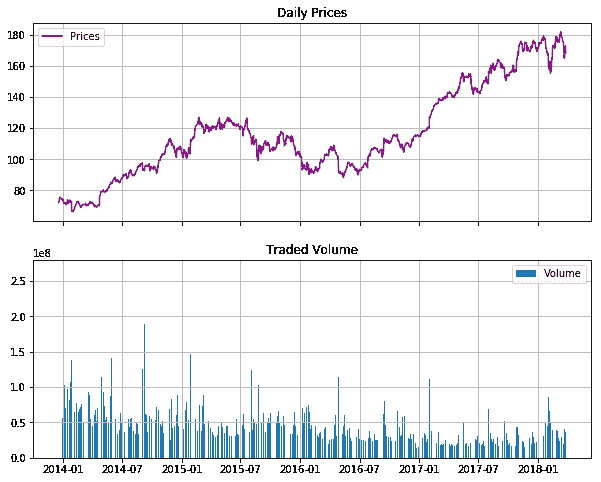

这里，我们使用`legend`方法在两个图中设置图例。绘制每个图时，图例将打印由`label`参数指定的值。`set_title`用于设定每个情节的标题。之前在处理单一剧情的时候，我们已经用了`title`的方法来设置标题。但是，对于多个情节，情况就不一样了。

Python matplotlib 提供的另一个方便的方法是`tight_layout`方法，它自动调整子情节之间的填充和其他类似参数，以便它们适合图形区域。

```py
""" Figure 39 """
# Setting layout
plt.tight_layout()

# Setting label on the x-axis
plt.xlabel('Dates')
plt.show()

```

上面的代码明确指定了 x 轴上的布局和标签，这导致了下面的图表。

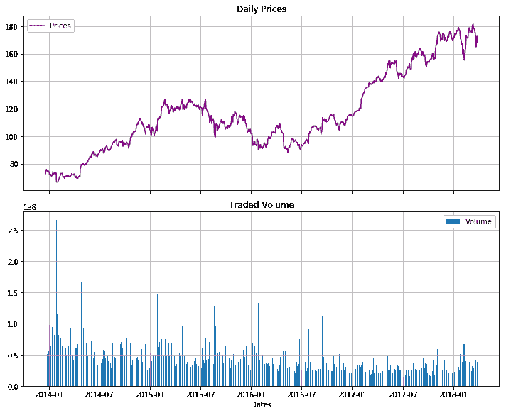

除了所有这些定制，Python matplotlib 还提供了许多易于使用的预定义样式。例如，有一个预定义的样式叫做“ggplot”，它模仿了 *ggplot* (一个流行的 R 语言绘图包)的美学。要更改正在渲染的绘图的样式，需要使用以下代码显式指定新样式:

```py
plt.style.use('ggplot')

```

将样式设置为“使用”时，此后渲染的所有地块将使用相同的新设置样式。要列出所有可用的样式，请执行以下代码:

```py
plt.style.available

```

让我们将样式设置为预定义的样式之一，称为*‘fivethirtyeight’*，并绘制图表。

```py
plt.style.use('fivethirtyeight')
fig, (ax1, ax2) = plt.subplots(nrows=2, ncols=1, sharex=True, figsize=(10, 8))

ax1.plot(close_prices, color='purple', label='Prices')
ax1.grid(True)
ax1.set_title('Daily Prices')
ax1.legend()

ax2.bar(volume.index, volume, label='Volume')
ax2.grid(True)
ax2.set_title('Traded Volume')
ax2.legend()

plt.tight_layout()

plt.xlabel('Dates')
plt.show()

```

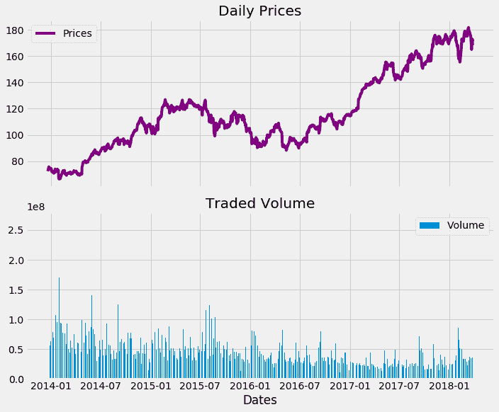

通过改变样式，我们可以清楚地了解到样式在绘制图表时是如何起到改变图表外观的重要作用的。

我们将学习的最后一个方法是用于在本地机器上保存图形的`savefig`方法。它采用将被保存的图形的名称。下图说明了这一点:

```py
plt.savefig('AAPL_chart.png')

```

执行上面的代码将会用名称`AAPL_chart.png`保存我们在上面绘制的图表。

### 结论

因此，在这个 Python matplotlib 教程中，我们从图形和绘图的基础开始，逐步学习各种类型的图表及其本质，最后，我们学习了定制，并先睹为快地在同一个图表中绘制多个绘图。

重申一下，Python matplotlib 教程是从 [Python 基础手册](https://www.quantinsti.com/python-basics-handbook)中摘录的，该手册是为这两者而创建的；刚开始使用 [Python](https://quantra.quantinsti.com/course/python-for-trading) 的新手，以及有成就的交易者，他们可以在编写策略时使用它作为方便的参考。

请在下面的评论中告诉我们你是否喜欢这篇文章和任何其他反馈。

*免责声明:股票市场的所有投资和交易都有风险。在金融市场进行交易的任何决定，包括股票或期权或其他金融工具的交易，都是个人决定，只能在彻底研究后做出，包括个人风险和财务评估以及在您认为必要的范围内寻求专业帮助。本文提到的交易策略或相关信息仅供参考。*