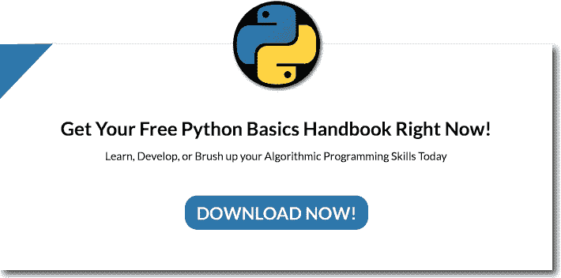
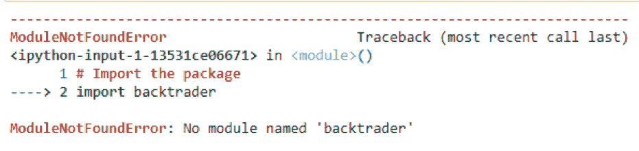
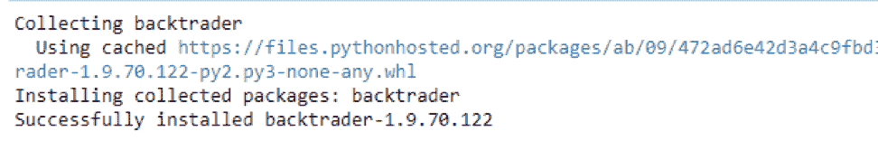
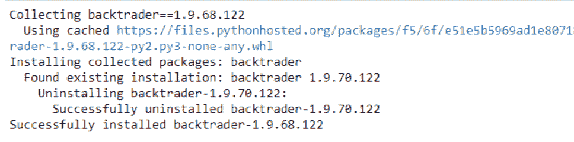
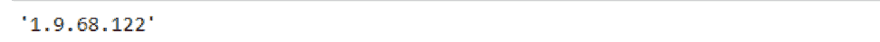
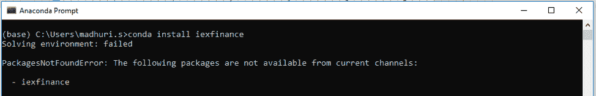
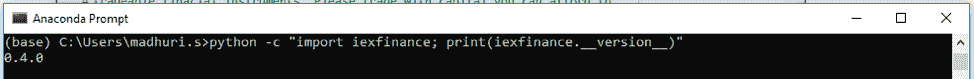
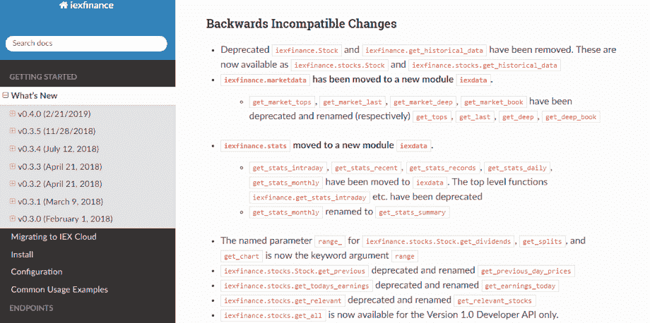
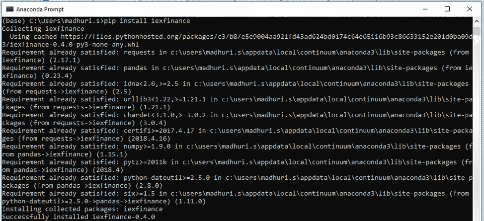
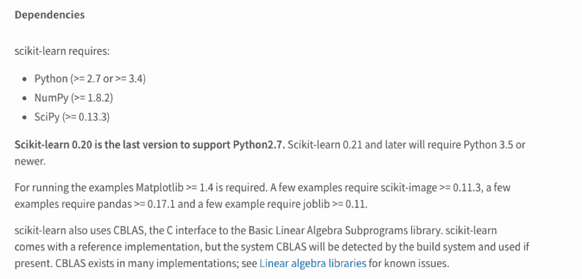

# 如何安装 Python 包

> 原文：<https://blog.quantinsti.com/installing-python-packages/>

由[玛多里·桑加拉朱](https://www.linkedin.com/in/madhuri-sangaraju-47293a84/)和[杰伊·帕尔马](https://www.linkedin.com/in/jay-parmar/)

在我们开始学习如何安装 Python 包的教程之前，让我们后退一步，理解包在 Python 生态系统中扮演的角色。Python 的美妙之处在于，我们有一个为特定目的而创建的模块和包的集合，并且它是开源的这一事实使得一个人在另一个人的工作基础上构建并创建一些有用的东西变得非常容易。因此，你可以得到一个执行简单算术运算的简单代码或一组代码，称为模块和包，它们可以帮助执行数据分析，所有这些都在互联网上。

[T4】](https://www.quantinsti.com/python-basics-handbook)

我们将在本教程中介绍以下概念

*   [什么是模块和包？](#what)
*   [导入 Python 包](#import)
*   [PyPI - Python 包索引](#pypi)
*   [安装包的语法](#install)
*   [奖金:dir()函数](#bonus)
*   [解决频繁的用户查询](#faq)
    *   [无法使用 conda install 安装 iexfinance】](#q1)
    *   [从 iexfinance 导入 get_data 不起作用](#q2)
    *   [依赖包- scikit-learn](#q3)

## 什么是模块和包？

考虑直接在 Python 或 IPython 控制台上编写代码。如果我们退出控制台并再次进入，我们创建的定义(函数和变量)将会丢失。因此，为了编写一个更长的程序，我们可以考虑切换到文本编辑器，为解释器准备一个输入，并以该文件作为输入来运行它。这就是所谓的写剧本。

随着程序变得越来越长，我们可能希望把它分成几个小文件，以便于维护。此外，我们可能希望使用我们在几个程序中编写的一个方便的函数，而不必将其定义复制到每个程序中。为了支持这一点，Python 有办法将代码定义放在一个文件中，并在另一个脚本中使用它们，或者直接在解释器的交互式实例中使用它们。这样的文件称为模块；来自一个模块的定义可以被导入到其他模块或者我们编写的程序中。

包可以被认为是模块的集合。它是一种通过使用“带点的模块名”来构造 Python 的模块名称空间的方法。例如，模块名 matplotlib.pyplot 在名为 matplotlib 的包中指定了一个名为 pyplot 的子模块。

以这种方式打包模块使不同模块的作者不必担心

关于彼此的全局变量名和点状模块名的使用使多模块包的作者不必担心彼此的模块名。

## 导入 Python 包

众所周知，Python 是一个开源项目。Python 开发者社区在开源许可下以包的形式向其他人提供他们的代码。

当你安装 Python 的时候，默认情况下你可以访问一些内置的包，比如[熊猫](https://blog.quantinsti.com/python-pandas-tutorial/)、 [NumPy](https://blog.quantinsti.com/python-numpy-tutorial-installation-arrays-random-sampling/) 。

您可以使用以下语法在代码中导入这些包。

```
# Import a Python package
Import pandas
```

假设我们想设计一个包(模块的集合)来统一处理各种交易策略及其数据。基于数据频率有许多不同的数据文件，因此我们可能需要创建和维护一个不断增长的模块集合，用于各种数据频率之间的转换。此外，我们可能需要执行许多不同的策略和操作。所有这些放在一起意味着我们将不得不编写一个永无止境的模块流来处理数据、策略和操作的组合学。这里有一个可能的包装结构，让我们的生活更轻松。

| 开始/__init__.py数据/__init__.pyequity.pycurrency.pyoptions.py...策略/__init__.pyrsi.pymacd.pysmalma.pyperatio.pyfundamentalindex.pystatisticalarbitrage.pyturtle.py...运营/__init__.pyperformanceanalytics.pydataconversion.py... | 顶层包初始化 strats 包数据的子包股权模块策略的子包RSI 模块操作的子包 |

导入包时，Python 会在 sys.path 中的目录中搜索包子目录。__init__。py 文件是 Python 将目录视为包含包所必需的。如果我们要使用这个包，我们可以按以下方式进行:

```
import strats.data.equity
import strats.strategies.statisticalarbitrage
```

上述语句分别从 strats 包下的数据和策略子包中加载 equity 和 statisticalarbitrage 模块。到目前为止，我们了解了如何导入包，但是如何安装 Python 包呢？有必要安装它们吗？让我们在下一节中找出答案。

### 如果软件包没有安装会怎么样？

正如我们之前提到的，Python 有一些内置的包，它们是和 Python 一起安装的。但是 Python 安装中没有附带的包怎么办呢？如果你试图在没有安装的情况下导入这些包，你会得到一个名为“ModuleNotFoundError”的错误。

例如，Backtrader 是一个 Python 包，用于实时交易和[回溯测试交易策略](https://quantra.quantinsti.com/course/backtesting-trading-strategies)。当我们试图导入它时，您可以看到错误。

```
# import the package
import backtrader
```



这是因为“backtrader”不是一个内置的 Python 包，我们试图在没有安装它的情况下导入它。但是在哪里可以找到这些包以及如何安装它们呢？在关于如何安装 Python 包的教程的下一节中，我们将了解如何安装。

## PyPI - Python 包索引

大多数开源 Python 包都可以通过 PyPI - Python 包索引获得。它是 Python 编程语言的软件仓库。你可以在这里找到 Python 社区[开发和共享的包。您也可以通过 PyPI 发布您的包。](https://pypi.org)

要从 PyPI 安装软件包，您需要一个软件包安装程序。PyPI 的推荐软件包安装程序是“pip”。当您在系统中安装 Python 时，Pip 也随之安装。您不必担心专门下载或安装 pip。然而，我们仍将在下一节“如何安装 Python 包教程”中讨论 pip 的安装。

### 安装 pip

我们可以通过命令行使用 curl 命令安装 pip，该命令下载 pip 安装 perl 脚本。

```
curl -O https://bootstrap.pypa.io/get-pip.py
```

下载完成后，我们需要在命令提示符下用 Python 解释器执行它。

```
python get-pip.py
```

如果上述命令由于权限问题在 Mac 和 Linux 发行版上失败(很可能是因为 Python 没有更新文件系统上某些目录的权限)。默认情况下，这些目录是只读的，以确保随机脚本不会弄乱重要文件并使系统感染病毒)，我们可能需要运行以下命令。

```
sudo python get-pip.py
```

## 安装 Python 包的语法

在“如何安装 Python 包”这一节中，我们将了解如何使用以下语法通过“pip”安装包。

```
`!pip install package_name`
```

例如，要安装 Backtrader 软件包，您必须将“package_name”替换为“backtrader”。

```
# Install a Python package
!pip install backtrader
```



安装后，您可以在最后一行看到成功消息。这意味着现在可以导入该包并在您的代码中使用。有许多机构和个人使用 Python 本身的不同版本，所以不用说也可能有包的版本。让我们在教程的下一节“如何安装 Python 包”中找到关于包版本的信息。

### 包的版本

PyPI 允许开发者提交任意数量的包版本。它为存储库中提交的每个包名和版本的组合保存一条记录。

“backtrader”软件包也有不同的版本。你可以在这里查看它们。

使用不同版本的 Python 包

如果您想使用该软件包的不同版本，您可以使用下面的命令安装它。

让我们安装 1.9.68.122 版的“反向交易者”软件包。

```
# Install a specific version of the package
!pip install backtrader==1.9.68.122
```



### 检查包的版本

您可以使用以下语法来检查软件包的版本。

```
`package_name.__version__`
```

但是首先，您需要导入包。您可以按如下方式检查“backtrader”软件包的版本。

```
# Import the package
Import backtrader
# Check the version of the package
backtrader._version_
```



注意事项

1.  默认情况下，Pip 安装软件包的最新版本。
2.  安装特定版本时，pip 会替换现有版本(如果有的话)。
3.  您可以使用上述语法通过 IPython notebook 安装软件包。
4.  如果您希望使用命令提示符安装，您可以通过删除感叹号来使用相同的语法。

举个例子，

*   IPython 笔记本:`！pip 安装包 _ 名称` 2
*   命令提示符:` pip 安装包名称'

我希望这能澄清你对安装 Python 包的任何疑问。遍历 Python 代码和包的一种流行方法是 dir()函数。让我们在教程的下一节“如何安装 Python 包”中进一步了解它的作用。

## 奖励:dir()函数

我们可以使用内置函数 dir()来查找模块定义了哪些名称。它返回一个字符串的排序列表。

```
In []: import arithmetic
In []: dir(arithmetic)
Out[]:
['__builtins__',
'__cached__',
'__doc__',
'__file__',
'__loader__',
'__name__',
'__package__',
'__spec__',
'addition',
'division',
'factorial',
'multiply']
dir()function | 61
```

在这里，我们可以看到模块算法中的名称的排序列表。所有其他以下划线开头的名称都是与模块相关联的默认 Python 属性(我们没有定义它们)。

如果没有参数，dir()会列出我们当前定义的名称:

```
In []: a = 1
In []: b = 'string'
In []: import arithmetic
In []: dir()

Out[]:
['__builtins__',
'a',
'arithmetic',
'b',
'exit',
'Quit']
```

请注意，它列出了所有类型的名称:变量、模块、函数等。dir()没有列出内置函数和变量的名称。它们是在标准模块内置中定义的。我们可以通过在 dir()中传递内置函数作为参数来列出它们。

```
In []: import builtins
In []: dir(builtins)
Out[]: ['ArithmeticError', 'AssertionError',
'AttributeError', 'BaseException',
'BlockingIOError', 'BrokenPipeError',
'BufferError', 'BytesWarning', 'ChildProcessError',
'ConnectionAbortedError', 'ConnectionError',
'ConnectionRefusedError', 'ConnectionResetError',
'DeprecationWarning', 'EOFError', 'Ellipsis',
'EnvironmentError', 'Exception', 'False',
'SyntaxError', ... ]
```

让我们在这里喘口气，了解一下到目前为止我们所了解的。我们已经了解了什么是模块和包，以及如何安装 Python 包。我们还学习了 dir()函数。我们本可以在这里结束教程，并在评论中回答你面临的任何问题，但我们认为为什么不先发制人，尝试自己解决一些常见的问题。

## 解决频繁的用户查询

当你开始学习 Python 的时候，你可能会遇到一些关于平台的问题，并且可能会觉得你是唯一的一个。嗯，这些年来，我们已经看到了来自用户的常见问题，他们中的大多数都在努力寻找这些问题的答案。因此，我们将在如何安装 Python 包教程的这一节中尝试解决其中的一些问题。

我们将回答的问题是:

*   无法使用 conda install 安装 iefinance
*   从 iexfinance 导入 get_data 不起作用
*   依赖包- [scikit-learn](https://blog.quantinsti.com/scikit-learn-tutorial/)

注意:iexfinance 错误在 Anaconda 的更新版本中不可用

### 查询#1:无法使用 conda install 安装 iexfinance

如果您已经使用 Anaconda 安装了 Python，那么您应该熟悉使用 conda installer 安装 Python 包。

要安装“iexfinance ”,你可以写“conda install iexfinance”

但是这将引发如下错误。



这是因为 Anaconda 存储库中没有这个包。

您可以在[存储库](https://anaconda.org/anaconda/repo)中检查相同的内容。它显示没有结果。


如前所述，您可以在 PyPI 中搜索“iexfinance”包，并查看如下所示的结果。


因此，您可以使用 PyPI '来使用' iexfinance '包。

您需要在 Anaconda 提示符下使用‘pip’而不是‘conda’来从 PyPI 安装软件包。

在 Anaconda 提示符下写“pip install iexfinance”来安装 iexfinance 包。


好吧！让我们转到教程中关于如何安装 Python 包的下一个查询。

### 查询#2:从 iexfinance 导入 get_data 不起作用

您可以在最后一行看到成功消息以及安装的软件包版本。目前已安装了“iexfinance”的 0.4.0 版。

此外，每当软件包更新时，都会发布一个新版本。

要随时检查' iexfinance '包的版本，可以在 Anaconda 提示符下运行以下命令。

```
`python -c "import iexfinance; print(iexfinance.__version__)"`
```



您可以通过再次运行 pip install 命令来更新到“iexfinance”软件包的最新版本。默认情况下，Pip 会安装最新版本的“iexfinance”。

如前所述，该命令是“pip install iexfinance”。

如果您正在更新系统中的软件包，那么您应该知道所做的更改，并且您可能希望相应地更改您的代码。

对于“iexfinance”包，从先前版本到最新版本的更改记录在“向后不兼容更改”部分的[这里](https://addisonlynch.github.io/iexfinance/stable/whatsnew.html#backwards-incompatible-changes)处。



太好了！只剩一个了。让我们转到教程中关于如何安装 Python 包的下一个查询

### 查询#3:检查依赖包- scikit-learn

让我们再次回到这张图片。



你可以看到，在安装“iexfinance”时，pip 检查了许多其他 Python 包，如 requests、pandas 等。,

这些是顺利运行“iexfinance”所需的依赖包。

对于“scikit-learn”包，您可以在 PyPI 项目描述中找到依赖包。



您还可以看到依赖包的版本。

每当您尝试安装或升级“scikit-learn”时，请确保 scipy 和 numpy 软件包也升级到最新版本。

您可以运行“pip install scipy”和“pip install numpy”来升级这些软件包。然后通过运行“pip install scikit-learn”安装或升级“scikit-learn”软件包。

**注意:重启内核**

在代码中开始使用“scikit-learn”包之前，不要忘记重启 Jupyter 或 Spyder 中的内核。否则，您在导入“scikit-learn”包时会遇到错误。

这是因为当您打开 Jupyter 或 Spyder 进行编码时，它们会根据当时存在的包版本创建一个 Python 环境。因此，每当你安装或升级一个新的软件包时，你也需要重启内核。

总之，我们已经了解了如何安装 Python 包，并且在本教程中解决了一些关于 Python 最常见的问题。希望这有助于在您探索 Python 时创建一个平稳的旅程！

有许多人可能是 Python 或编程的新手，或者从未创建过任何交易策略。如果你是这两种技能的初学者，学习曲线可能会很陡。然而，你可以通过在这里注册，逐步建立所需的技能，并定期练习我们课程中给出的实践学习练习:[每个人的算法交易](https://quantra.quantinsti.com/learning-track/algorithmic-trading-for-everyone)

*免责声明:股票市场的所有投资和交易都有风险。在金融市场进行交易的任何决定，包括股票或期权或其他金融工具的交易，都是个人决定，只能在彻底研究后做出，包括个人风险和财务评估以及在您认为必要的范围内寻求专业帮助。本文提到的交易策略或相关信息仅供参考。*