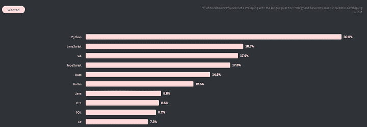
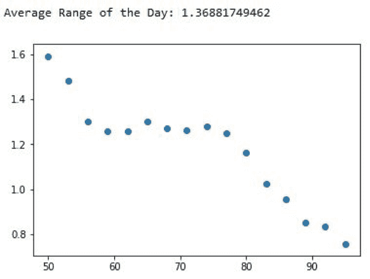
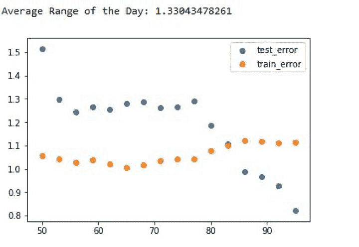
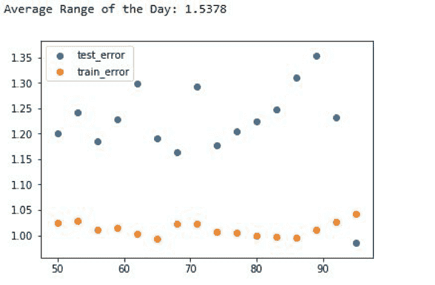
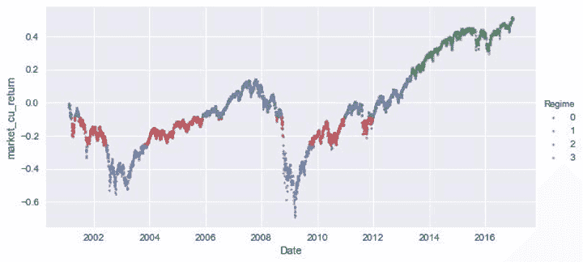
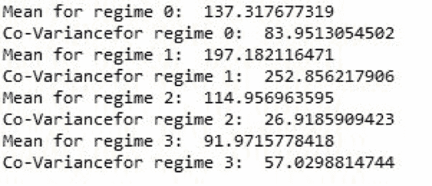

# Python 中用于算法交易的机器学习

> 原文：<https://blog.quantinsti.com/trading-using-machine-learning-python/>

由[瓦伦·迪瓦卡](https://www.linkedin.com/in/varun-divakar-b862a667/)

*你有没有好奇过如何利用 Python 中的机器学习进行算法交易？*

近年来，机器学习，更具体地说是 Python 中的机器学习，已经成为许多 quant 公司的热门词汇。为了寻找难以捉摸的阿尔法，许多基金和交易公司已经采用了机器学习算法进行 T2 算法交易。

虽然量化对冲基金部署的算法从未公开，但我们知道顶级基金在很大程度上使用机器学习算法进行交易。

举个例子，曼集团的 [AHL 维度计划](https://www.bloomberg.com/news/features/2017-09-27/the-massive-hedge-fund-betting-on-ai)是一个 51 亿美元的对冲基金，部分由 AI 管理。还有 [Taaffeite Capital](http://taaffeitecm.com/) 表示，它使用专有的机器学习系统以完全系统化和自动化的方式进行交易。

在这篇 Python 机器学习教程中，我们试图理解机器学习是如何改变交易世界的。然后，我们创建一个简单的 Python 机器学习算法来预测股票的第二天收盘价。

因此，在本 Python 机器学习教程中，我们将涵盖以下主题:

*   [Python 中的机器学习如何流行起来](#how-machine-learning-in-python-gained-popularity)
*   [为什么在 Python 中使用机器学习进行交易？](#why-use-machine-learning-for-trading-in-python)
*   [使用 Python 为交易创建机器学习算法的先决条件](#prerequisites-for-creating-machine-learning-algorithms-for-trading-using-python)
*   [获取数据并使其可用于机器学习算法](#getting-the-data-and-making-it-usable-for-machine-learning-algorithm)
*   [创建超参数](#creating-hyperparameters)
*   [将数据分成测试和训练集](#splitting-the-data-into-test-and-train-sets)
*   [获得最佳拟合参数以创建新函数](#getting-the-best-fit-parameters-to-create-a-new-function)
*   [进行预测并检查性能](#making-the-predictions-and-checking-the-performance)
*   [奖金内容](#bonus-content)

* * *

## ******如何****M****achine****L****在 Python 中赚得了人气******

机器学习包/库由公司内部开发，供其专有使用，或者由第三方免费提供给用户社区。

近年来，机器学习软件包的数量大幅增加，这有助于开发者社区获得各种机器学习技术，并将其应用于他们的交易需求。

有数百种最大似然算法，根据它们的工作原理可以分为不同的类型。

比如用[机器学习回归](https://quantra.quantinsti.com/course/trading-with-machine-learning-regression)算法对变量之间的关系进行建模；决策树算法构建决策模型，用于分类或回归问题。其中，一些[算法](/top-10-machine-learning-algorithms-beginners/)已经在 quants 中流行起来。

其中包括:

*   [线性回归](/linear-regression/)
*   逻辑回归
*   随机森林(RM)
*   [支持向量机](/support-vector-machines-introduction/) (SVM)
*   [k-最近邻](/machine-learning-k-nearest-neighbors-knn-algorithm-python/) (kNN)
*   分类和回归树
*   [深度学习](/deep-learning-finance/)

这些交易机器学习算法被交易公司用于各种目的，包括:

*   使用大型数据集分析历史市场行为
*   确定策略的最佳输入(预测)
*   确定最佳策略参数集
*   进行贸易预测等。

* * *

## Python 中为什么要用机器学习进行交易？

多年来，我们已经意识到 Python 正成为程序员的流行语言，这是一个普遍活跃和热情的社区，他们总是在那里相互支持。

根据 Stack Overflow 的 [2020 年开发者调查](https://insights.stackoverflow.com/survey/2020#technology-most-loved-dreaded-and-wanted-languages-wanted)，开发者报告说他们想学习 Python，这是连续第四年占据榜首。

<figure class="kg-card kg-image-card kg-width-full kg-card-hascaption">

<figcaption>Python ranking #1 on StackOverflow</figcaption>

</figure>

[Python trading](https://quantra.quantinsti.com/course/python-for-trading) 已经在 quant finance 社区获得了关注，因为它可以轻松地构建复杂的统计模型，因为有足够的科学库可用，如:

*   熊猫
*   NumPy
*   PyAlgoTrade
*   Pybacktest 等等。

对 [Python 交易库](/python-trading-library/)的首次更新在开发者社区中是经常发生的。事实上， [Scikit-learn](/scikit-learn-tutorial/) 是一个专门为机器学习开发的 Python 包，它具有各种分类、回归和聚类[算法](https://en.wikipedia.org/wiki/Scikit-learn)。因此，对于一个初学者(或者更确切地说，一个经验丰富的交易者)来说，开始学习 python 中的机器学习是有意义的。

近年来，技术和电子交易的兴起只是加快了自动化交易的速度。对于交易员或基金经理来说，相关的问题是“我如何应用这个新工具来产生更多的阿尔法值？”。我现在将探索一个回答这个问题的模型。

* * *

## ****创造**机器学习算法进行交易使用 ******Python********

您可以添加一行来安装软件包“pip install numpy pandas …”您可以在 Anaconda 提示符下使用以下代码来安装必要的[软件包](/installing-python-packages/)。想了解更多关于 Python numpy 的知识，点击[这里](/python-numpy-tutorial-installation-arrays-random-sampling/)。

*   pip 安装熊猫
*   pip 安装熊猫-datareader
*   pip 安装数量
*   pip 安装硬化
*   pip 安装 matplotlib

在我们继续之前，让我声明这段代码是用 Python 2.7 编写的。所以让我们开始吧。

### ******问题陈述******

让我们首先了解我们的目标是什么。在本 Python 机器学习教程的最后，我将向您展示如何创建一个算法，该算法可以根据以前的 OHLC(开盘、盘高、盘低、收盘)数据预测一天的收盘价。

我还想监控预测误差以及输入数据的大小。

让我们导入构建这个机器学习算法所需的所有库和包。

* * *

## ******获取数据并使其可用于机器学习算法******

要创建任何算法，我们都需要数据来训练算法，然后对新的未知数据进行预测。在这个 Python 机器学习教程中，我们将从 Yahoo 获取数据。

为此，我们将使用熊猫图书馆的数据阅读器功能。该函数被广泛使用，它使您能够从许多在线数据源获取数据。

我们正在获取与标准普尔 500 挂钩的 SPDR ETF 的数据。这只股票可以作为标准普尔 500 指数表现的代表。我们指定从哪一年开始提取数据。

数据输入后，我们将丢弃除 OHLC 之外的任何数据，如成交量和调整后收盘价，以创建我们的数据框架“df”。

现在我们需要从过去的数据中做出我们的预测，这些过去的特征将有助于[机器学习模型交易](https://quantra.quantinsti.com/course/introduction-to-machine-learning-for-trading)。因此，让我们在数据框中创建新列，其中包含有一天延迟的数据。

请注意，在新列的名称中，小写字母被去掉了。

* * *

## ******创建超参数******

虽然超参数的概念本身就值得写一篇博客，但现在我只想说几句。这些是机器学习算法无法学习但需要迭代的参数。我们使用它们来查看哪些预定义函数或参数产生最佳拟合函数。

在这个例子中，我使用了套索回归，它使用了 L1 类型的正则化。这是一种基于回归分析的机器学习模型，用于预测连续数据。

使用要素选择时，这种正则化非常有用。它能够将系数值减小到零。SimpleImputer 函数将任何可能影响我们预测的 NaN 值替换为平均值，如代码中所指定的。

“步骤”是作为管道功能的一部分并入的一组功能。管道是对数据集执行多重操作的非常有效的工具。这里，我们还传递了 Lasso 函数参数以及一个可以迭代的值列表。

虽然我不打算详细说明这些参数到底是做什么的，但它们是值得深入研究的。最后，我调用了随机搜索函数来执行交叉验证。

在本例中，我们使用了 5 重交叉验证。在 k 重交叉验证中，原始样本被随机分成 k 个大小相等的子样本。在 k 个子样本中，保留一个子样本作为测试模型的验证数据，其余 k-1 个子样本用作训练数据。

然后，交叉验证过程重复 k 次(折叠)，k 个子样本中的每一个正好用作验证数据一次。交叉验证合并(平均)拟合(预测误差)度量值，以获得更准确的模型预测性能估计值。

基于拟合参数，我们决定最佳特征。在 Python 机器学习教程的下一部分，我们将研究 int 测试和训练集。

* * *

## ******将数据拆分成测试和训练集******

首先，让我们将数据分为输入值和预测值。在这里，我们将滞后一天的 OHLC 数据作为数据帧 X 传递，当天的收盘值作为 y 传递。请注意下面小写的列名。

在本例中，为了保持 Python 机器学习教程的简短和相关性，我选择不创建任何多项式要素，而是仅使用原始数据。如果您对输入参数的各种组合和高次多项式特征感兴趣，您可以使用 scikit learn 预处理包中的 PolynomialFeature()函数随意变换数据。

现在，让我们也创建一个保存训练数据集的大小及其对应的平均预测误差的字典。

* * *

## ********拟合参数创建新函数********

我想测量回归函数相对于输入数据集大小的性能。换句话说，我想看看通过增加输入数据，我们是否能够减少误差。为此，我使用 For 循环来迭代相同的数据集，但长度不同。

在这一点上，我想补充的是，对于那些感兴趣的人，请探索“重置”功能，以及它将如何帮助我们做出更可靠的预测。

*(提示:它是 Python 魔术命令的一部分)*

我来分几步解释一下我是怎么做的。

首先，我创建了一组周期数“t ”,从 50 到 97，步长为 3。这些数字的目的是选择将用作训练数据集的数据集的百分比大小。

第二，对于给定的‘t’值，我将数据集的长度分割成与这个百分比相对应的最接近的整数。然后，我将全部数据分为训练数据和测试数据，前者包括从开始到分割的数据，后者包括从分割到结束的数据。采用这种方法而不使用随机分割的原因是为了保持时间序列的连续性。

在此之后，我们提取产生最低交叉验证误差的最佳参数，然后使用这些参数创建新的 reg1 函数，该函数将是具有最佳参数的简单套索回归拟合。

* * *

## ******进行预测并检查业绩******

现在让我们预测一下未来的收盘价。为此，我们使用 predict()函数将包含从 split 到 end 的数据的 test X 传递给回归函数。我们还想看看函数执行得如何，所以让我们将这些值保存在一个新列中。

您可能已经注意到，我创建了一个新的错误列来保存绝对错误值。然后，我取绝对误差值的平均值，保存在我们之前创建的字典中。

现在是时候策划一下，看看我们得到了什么。

我创建了一个新的范围值来保存数据的平均每日交易范围。这是一个我在做预测时想要比较的指标。这种比较背后的逻辑是，如果我的预测误差超过一天的范围，那么很可能就没有用了。

我还不如用前一天的高点或低点作为预测，结果会更准确。请注意，我在循环外使用了分割值。这意味着您在这里看到的一天的平均范围与最后一次迭代相关。

让我们执行代码，看看会得到什么。

<figure class="kg-card kg-image-card kg-width-full"></figure>

一些值得思考的问题。

这个散点图告诉你什么？让我问你几个问题。

*   方程是否过度拟合？
*   随着训练数据集大小的增加，数据的性能显著提高。这是否意味着如果我们给出更多的数据，误差会进一步减小？
*   市场中是否存在一种内在趋势，允许我们随着数据集大小的增加做出更好的预测？
*   最后，也是最重要的一个问题，我们如何利用这些预测来制定交易策略？

* * *

## ****奖金**内容**

### 关于使用 Python 进行交易的机器学习算法的常见问题

在交易的机器学习算法教程的最后一节，我问了几个问题。现在，我将同时回答它们。我还将讨论一种无需训练趋势算法就能检测市场状态/趋势的方法。

但是在我们继续之前，请使用一个补丁从 Google 获取数据来运行下面的代码。

#### ****如果您在从雅虎和谷歌金融平台下载[市场数据](https://quantra.quantinsti.com/course/getting-market-data)时遇到挑战，并且正在寻找市场数据的替代来源，您可以使用 [Quandl](https://www.quandl.com/) 来完成同样的任务。****

我们现在开始提问，好吗？

**问:方程是否过拟合？**
答:这是我问的第一个问题。要知道您的数据是否过度拟合，最好的测试方法是检查算法在训练和测试数据中产生的预测误差。

要做到这一点，我们必须向已经编写好的代码中添加一小段代码。

首先，让我开始我的解释，为打破常规道歉:超过 80 列标记。

第二，如果我们运行这段代码，那么输出看起来会像这样。

<figure class="kg-card kg-image-card kg-width-full"></figure>

与训练数据相比，我们的算法在测试数据中表现更好。这一观察本身就是一个危险信号。我们的测试数据误差可能优于列车数据误差的原因有几个:

1.  如果与测试集相比，训练数据具有更大的波动性(每日范围),那么预测也会表现出更大的波动性。
2.  如果市场中有一种内在的趋势可以帮助算法做出更好的预测。

现在，让我们检查一下这些情况中哪一个是真的。如果测试数据的范围小于训练数据，那么在将超过 80%的数据作为训练集传递之后，误差应该已经减小，但是它增加了。

接下来，为了检查是否有趋势，让我们传递不同时间段的更多数据。

如果我们运行代码，结果将如下所示:

<figure class="kg-card kg-image-card kg-width-full"></figure>

因此，给出更多的数据并没有让你的算法更好地工作，而是让它变得更糟。在时间序列数据中，内在趋势对算法在测试数据上的表现起着非常重要的作用。

正如我们在上面看到的，它有时会产生比预期更好的结果。我们的算法做得如此好的主要原因是测试数据坚持在训练数据中观察到的主要模式。

因此，如果我们的算法可以检测潜在的趋势，并针对该趋势使用策略，那么它应该会给出更好的结果。我将在下面更详细地解释这一点。

**问:机器学习算法能否检测出内在趋势或市场阶段(牛市/熊市/横盘/突破/恐慌)？**

**问:是否可以对数据库进行调整，以便针对不同的情况训练不同的算法**

答:两个问题的答案都是肯定的！

我们可以将市场划分为不同的区域，然后使用这些信号来整理数据，并为这些数据集训练不同的算法。为了实现这一点，我选择使用一种[无监督机器学习算法](https://quantra.quantinsti.com/course/unsupervised-learning-trading)。

从这里开始，这个 Python 机器学习教程将致力于创建一个可以检测市场内在趋势的算法，而无需对其进行显式训练。

首先，让我们导入必要的库。

然后，我们从谷歌获取 OHLC 数据，并将其移动一天，只根据过去的数据训练算法。

然后放下所有的 NaN。

接下来，我们将使用 sklearn 的“高斯混合”模型实例化一个无监督的机器学习算法。

在上面的代码中，我创建了一个无人监管的算法，它会根据自己选择的标准将市场分成 4 个区域。我们没有像 Python 机器学习教程的前一部分那样提供任何带有标签的训练数据集。

接下来，我们将拟合数据并预测政权。然后我们会把这些状态预测存储在一个新的变量里，叫做状态。

现在让我们来计算一天的收益。

然后，创建一个名为 Regimes 的数据框架，该数据框架将包含 OHLC 和返回值以及相应的 regime 分类。

在此之后，让我们创建一个名为“order”的列表，其中包含与制度分类相对应的值，然后绘制这些值，以查看算法的分类效果。

最终的政权区分如下所示:

<figure class="kg-card kg-image-card kg-width-full"></figure>

这张图表对我来说很不错。不用实际查看分类所基于的因素，我们只需查看图表就可以得出一些结论。

1.  红色区域是低波动或横向区域
2.  紫色区域是高波动区域或恐慌区域。
3.  绿色区域是突破区域。
4.  蓝区:不完全确定，但让我们找出答案。

使用下面的代码打印每个制度的相关数据。

输出如下所示:

<figure class="kg-card kg-image-card"></figure>

数据可以推断如下:

1.  体制 0:低均值和高协方差。
2.  制度 1:高均值和高协方差。
3.  制度 2:高平均值和低协方差。
4.  制度 3:低均值和低协方差。

到目前为止，我们已经看到了如何将市场分成不同的区域。

但是实施成功战略的问题仍然没有答案。如果你想学习如何编写机器学习交易策略，那么你的选择很简单:

套用《黑客帝国》电影三部曲中的墨菲斯，

> 这是你最后的机会。在这之后，就没有回头路了。你吃了蓝色药丸——故事结束，你在床上醒来，相信你可以手动交易。
> 你服用[红色药丸](https://quantra.quantinsti.com/courseDetails/43/Trading-with-Machine-Learning-Regression)——你待在阿尔果兰，我让你看看兔子洞有多深。记住:我提供的都是事实。仅此而已。

* * *

### 向交易的机器学习算法世界迈进了一步

在当今世界，保持自我更新是最重要的。拥有一个学习者的心态总是有助于提升你的职业生涯，并在为自己或自己的公司制定交易策略时获得技能和额外的工具。

这里有几本书可能会很有趣:

1.  Gareth James，Daniela Witten，Trevor Hastie 和 Robert Tibshirani [统计学习简介](https://www.amazon.com/Introduction-Statistical-Learning-Applications-Statistics/dp/1461471370)
2.  安德烈·布尔科夫的《百页机器学习书》
3.  Hastie、Tibshirani 和 Friedman 的[统计学习的要素](https://web.stanford.edu/~hastie/ElemStatLearn//)

* * *

### 机器学习竞赛

有许多举办职业棒球大赛的网站。这些竞赛虽然不是专门针对 [Python 机器学习在交易](https://quantra.quantinsti.com/course/python-machine-learning)中的应用。

他们可以通过参加竞赛和论坛，让定量分析师和交易者很好地接触不同的 ML 问题，并帮助扩展他们的 ML 知识。一些受欢迎的 ML 竞赛主办网站包括:

*   [卡格尔](https://www.kaggle.com/competitions)
*   [数字](https://numer.ai/)

你会发现阅读这些精选的顶级博客很有用，也很有见识:

[机器学习](/machine-learning-top-blogs/)
T3】Python 进行交易
[情绪交易](/sentiment-trading-top-blogs/)
[算法交易](/algorithmic-trading-top-blogs/)
[期权交易](/options-trading-top-blogs/)
[技术分析](/technical-analysis-top-blogs/)

* * *

### 结论

总的来说，我们已经通过各种例子，经历了你如何学习在 [python 中为算法交易](/python-trading/)创建和使用你自己的机器学习的整个旅程。整个过程借助 Python 代码进行了解释，这对你的练习也有帮助。

如果您对本文有任何意见或建议，请在下面的评论中与我们分享。

如果你也想创建交易策略，并了解你的模型的局限性，看看欧内斯特·p·陈博士撰写的关于“交易中的决策树”的课程，它揭示了分类树中的黑箱。

* * *

*<small>免责声明:本文提供的所有数据和信息仅供参考。QuantInsti 对本文中任何信息的准确性、完整性、现时性、适用性或有效性不做任何陈述，也不对这些信息中的任何错误、遗漏或延迟或因其显示或使用而导致的任何损失、伤害或损害负责。所有信息均按原样提供。</small>*