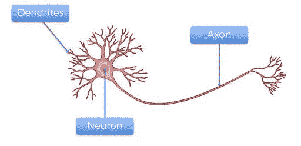
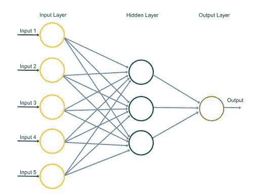
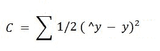
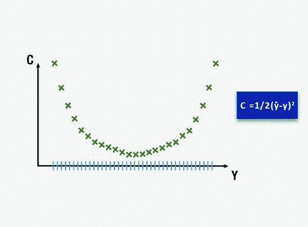
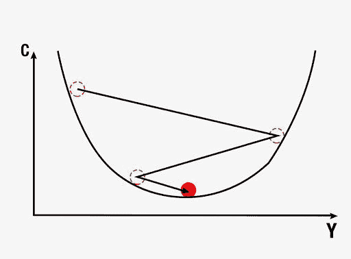
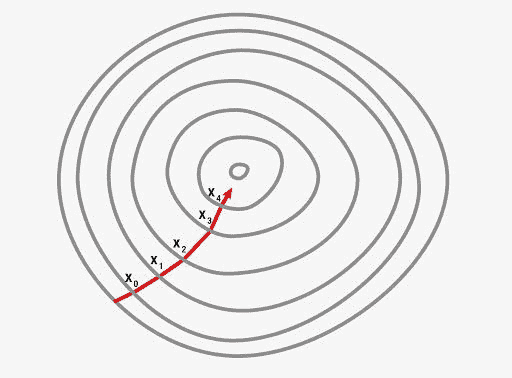
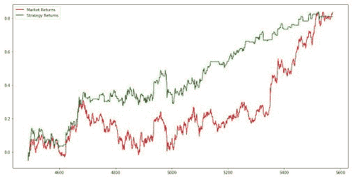

# Python 中的神经网络:介绍、结构和交易策略

> 原文：<https://blog.quantinsti.com/neural-network-python/>

由[德旺·辛格](https://www.linkedin.com/in/devang-singh-2402882b/)

你大概在想，像神经网络教程这样的技术话题是怎么托管在一个算法交易网站上的。神经网络研究的开始是为了绘制人脑地图，理解人类如何做决定，但算法试图从交易方面完全消除人类的情绪。我们有时未能意识到的是，人脑很可能是这个世界上最复杂的机器，而且众所周知，它能在创纪录的时间内非常有效地得出结论。

[T4】](https://quantra.quantinsti.com/machine-learning-for-trading-ebook)

想想看，如果我们能够利用我们大脑的工作方式，并将其应用于机器学习领域(神经网络毕竟是机器学习的子集)，我们可能会在处理能力和计算资源方面实现巨大的飞跃。

在我们深入研究神经网络交易的本质之前，我们应该了解主要部分，即神经元的工作原理。因此，在神经网络教程中，我们将涵盖以下主题

*   [神经元的结构](#str)
*   感知器:计算机神经元
*   [理解神经网络](#und)
*   [神经网络交易](#trad)
*   [训练神经网络](#trai)
*   [梯度下降](#gra)
*   [反向传播](#bac)
*   [编码神经网络策略](#cod)

请记住，神经网络教程的最终目标是理解神经网络中涉及的概念，以及如何应用它们来预测实时市场中的股票价格。让我们从理解什么是神经元开始。

## **一个神经元的结构**



神经元有三个组成部分，树突、轴突和神经元的主体。树突是信号的接收器，轴突是信号的发送器。单独来说，一个神经元没有多大用处，但当它与其他神经元相连时，它会进行几项复杂的计算，并帮助操作我们星球上最复杂的机器——人体。


## **感知器:计算机神经元**

感知器即计算机神经元也是以类似的方式构建的，如图所示。

用黄色圆圈标记的是神经元的输入，经过一些计算后，神经元发出输出信号。

输入层类似于神经元的树突，输出信号是轴突。每个输入信号被分配一个权重 wi。这个权重乘以输入值，神经元存储所有输入变量的加权和。这些权重是在[神经网络学习](https://quantra.quantinsti.com/course/neural-networks-deep-learning-trading-ernest-chan)的训练阶段通过称为梯度下降和反向传播的概念计算出来的，我们将在后面讨论这些主题。

然后将激活函数应用于加权和，这产生神经元的输出信号。

输入信号由其他神经元产生，即其他神经元的输出，并且网络被构建成以这种方式进行预测/计算。

这是神经网络的基本思想。在本神经网络教程中，我们将更详细地研究这些概念。

## **了解一个神经网络**

我们将通过一个例子来理解神经网络的工作原理。输入层由帮助我们得出输出值或进行预测的参数组成。我们的大脑本质上有五个基本的输入参数，即我们的触觉、听觉、视觉、嗅觉和味觉。

我们大脑中的神经元从这些基本输入参数中创建了更复杂的参数，如情绪和感觉。以及我们的情绪和感觉，让我们行动或做出决定，这基本上是我们大脑神经网络的输出。因此，在这种情况下，在做出决定之前有两层计算。

第一层将五种感觉作为输入，并产生情绪和感觉，这是下一层计算的输入，输出是一个决定或一个行动。

因此，在这个极其简单的人脑工作模型中，我们有一个输入层、两个隐藏层和一个输出层。当然，从我们的经验来看，我们都知道大脑比这要复杂得多，但本质上这就是计算在我们大脑中是如何进行的。

## **神经网络在交易中的应用实例**

为了理解神经网络在交易中的工作，让我们考虑一个简单的[股票价格预测](https://blog.quantinsti.com/machine-learning-trading-predict-stock-prices-regression/)示例，其中 OHLCV(开盘-盘高-盘低-收盘-成交量)值是输入参数，有一个隐藏层，输出由股票价格预测组成。



在神经网络教程中的示例中，有五个输入参数，如图所示。

隐藏层由 3 个神经元组成，输出层的结果是对股票价格的预测。

隐藏层中的 3 个神经元对于 5 个输入参数中的每一个将具有不同的权重，并且可能具有不同的激活函数，这将根据输入的各种组合来激活输入参数。

例如，第一个神经元可能会关注成交量以及收盘价和开盘价之间的差异，可能会忽略最高价和最低价。在这种情况下，高价格和低价格的权重将为零。

基于模型已经训练自身达到的权重，激活函数将被应用于神经元中的加权和，这将产生该特定神经元的输出值。

类似地，其他两个神经元将基于它们各自的激活函数和权重产生输出值。最后，股价的输出值或预测值将是每个神经元的三个输出值之和。这就是神经网络预测股票价格的方式。

现在，您已经了解了神经网络的工作原理，我们将进入本神经网络教程的核心问题，即学习人工神经网络如何训练自己来预测股票价格的运动。

## **训练神经网络**

为了简化神经网络教程中的内容，我们可以说有两种方法来编写执行特定任务的程序。

*   给定程序的一些输入，定义程序计算结果所需的所有规则。
*   开发一个框架，代码将在此框架上学习执行特定的任务，方法是通过调整它计算的结果，使其尽可能接近观察到的实际结果，在数据集上训练自己。

第二个过程叫做训练模型，这是我们将要关注的。让我们看看我们的神经网络将如何训练自己来预测股票价格。

神经网络将获得数据集，该数据集包括作为输入和输出的 OHLCV 数据，我们还将向模型提供第二天的收盘价，这是我们希望我们的模型学习预测的值。输出的实际值将由“y”表示，预测值将由 y^表示。

模型的训练包括为神经网络中存在的所有不同神经元调整变量的权重。这是通过最小化“成本函数”来实现的。顾名思义，成本函数是使用神经网络进行预测的成本。它衡量预测值 y^与实际值或观察值 y 之间的差距

实践中使用了许多成本函数，最常用的一种是将训练数据集的实际值和预测值之间的平方差之和的一半计算出来。



神经网络自我训练的方式是首先为给定的一组神经元权重计算训练数据集的成本函数。然后，它返回并调整权重，接着基于新的权重计算训练数据集的成本函数。将误差发送回网络以调整权重的过程称为反向传播。

这被重复几次，直到成本函数被最小化。接下来，我们将更详细地了解如何调整权重和最小化成本函数。

调整权重以最小化成本函数。一种方法是通过蛮力。假设我们取 1000 个权重值，并评估这些值的成本函数。当我们绘制成本函数的图表时，我们将得到如下所示的图表。

权重的最佳值将是对应于该图的最小值的成本函数。



这种方法对于涉及需要优化的单个权重的神经网络可能是成功的。然而，随着要调整的权重数量和隐藏层数量的增加，所需的计算数量将急剧增加。

即使在世界上最快的超级计算机上，训练这样一个模型所需的时间也将非常长。为此，开发一种更好、更快的方法来计算神经网络的权重是非常必要的。这个过程叫做梯度下降。我们将在神经网络教程的下一部分研究这个概念。

## **渐变下降**

梯度下降包括分析成本函数曲线的斜率。基于斜率，我们调整权重，以逐步最小化成本函数，而不是计算所有可能组合的值。

梯度下降的可视化如下图所示。第一个图是权重的单个值，因此是二维的。可以看出，红球以之字形移动，以达到成本函数的最小值。

在第二张图中，我们必须调整两个权重，以最小化成本函数。因此，我们可以把它想象成一个轮廓，如图所示，我们正朝着最陡斜率的方向移动，以便在最短的持续时间内达到最小值。使用这种方法，我们不必进行许多计算，因此，计算不会花费很长时间，这使得模型的训练成为一项可行的任务。





梯度下降可以以三种可能的方式完成，

*   批量梯度下降
*   随机梯度下降
*   小批量梯度下降

在批量梯度下降中，通过对训练数据集中的所有单个成本函数求和来计算成本函数，然后计算斜率并调整权重。

在[随机](https://blog.quantinsti.com/stochastic-oscillator/)梯度下降中，在训练数据集中的每个数据输入之后，进行成本函数的斜率和权重的调整。如果成本函数的曲线不是严格凸的，这对于避免陷入局部最小值是非常有用的。每次运行随机梯度下降时，达到全局最小值的过程都会不同。如果批量梯度下降停止在局部最小值，可能会导致陷入次优结果。

第三种是小批量梯度下降法，它是批量法和随机法的结合。这里，我们通过将多个数据条目放在一个批处理中来创建不同的批处理。这实质上导致在训练数据集中的更大批量的数据条目上实现随机梯度下降。

虽然我们可以深入研究梯度下降，但我们担心这将超出神经网络教程的范围。因此，让我们向前看，了解反向传播如何根据已经产生的误差来调整权重。

## **反向传播**

反向传播是一种高级算法，它使我们能够同时更新神经网络中的所有权重。这大大降低了调整权重过程的复杂性。如果我们不使用这种算法，我们将不得不通过计算特定权重对预测误差的影响来单独调整每个权重。让我们看看用随机梯度下降训练神经网络的步骤:

*   将权重初始化为非常接近 0(但不是 0)的小数字
*   [正向传播](https://blog.quantinsti.com/forward-propagation-neural-networks/) -通过使用我们训练数据集中的第一个数据条目，从左到右激活神经元，直到我们达到预测的结果 y
*   测量将产生的误差
*   反向传播-产生的误差将从右向左反向传播，权重将根据学习率进行调整
*   在整个训练数据集上重复前面的三个步骤，正向传播、误差计算和反向传播
*   这将标志着第一个时期的结束，后续时期将以先前时期的权重值开始，当成本函数收敛在某个可接受的限度内时，我们可以停止该过程

我们在这个神经网络教程中已经讲了很多，这将引导我们在实践中应用这些概念。因此，我们现在将学习如何开发我们自己的人工神经网络来预测股票价格的运动。

你将理解如何使用我们将从头构建的神经网络的预测来编码策略。您还将学习如何用 Python 编写人工神经网络，利用强大的库来构建一个健壮的[交易模型](https://blog.quantinsti.com/pair-trading-strategy-excel-model),使用神经网络的力量。

## **编码策略**

### **导入库**

我们将从导入几个库开始，其他的将在程序的不同阶段使用时导入。现在，我们将导入库，这些库将帮助我们导入和准备数据集，以便对模型进行训练和测试。

```
import numpy as np
import pandas as pd
import talib
```

Numpy 是科学计算的基础包，我们将使用这个库来计算我们的数据集。使用别名 np 导入该库。

Pandas 将帮助我们使用强大的 dataframe 对象，该对象将在 Python 中构建人工神经网络的整个代码中使用。

塔利布是一个技术分析库，将用于计算 RSI 和 Williams %R。这些将用作训练我们的人工神经网络的特征。我们可以使用这个库添加更多的特性。

### **将随机种子设置为固定数量**

```
import random
random.seed(42)
```

Random 将用于将种子初始化为一个固定的数字，这样我们每次运行代码时都以相同的种子开始。

### **导入数据集**

```
dataset = pd.read_csv('RELIANCE.NS.csv')
dataset = dataset.dropna()
dataset = dataset[['Open', 'High', 'Low', 'Close']]
```

然后，我们导入数据集，该数据集存储在。名为“RELIANCE”的 csv 文件。NS.csv。这是使用 pandas 库完成的，数据存储在名为 dataset 的数据帧中。然后，我们使用 dropna()函数删除数据集中缺失的值。csv 文件包含 1996 年 1 月 1 日至 2018 年 1 月 15 日期间在 NSE 上交易的 Reliance 股票的每日 OHLC 数据。

我们仅从该数据集中选择 OHLC 数据，该数据集中还包含日期、调整后收盘和成交量数据。我们将仅使用 OHLC 值构建输入要素。

### **准备数据集**

```
dataset['H-L'] = dataset['High'] - dataset['Low']
dataset['O-C'] = dataset['Close'] - dataset['Open']
dataset['3day MA'] = dataset['Close'].shift(1).rolling(window = 3).mean()
dataset['10day MA'] = dataset['Close'].shift(1).rolling(window = 10).mean()
dataset['30day MA'] = dataset['Close'].shift(1).rolling(window = 30).mean()
dataset['Std_dev']= dataset['Close'].rolling(5).std()
dataset['RSI'] = talib.RSI(dataset['Close'].values, timeperiod = 9)
dataset['Williams %R'] = talib.WILLR(dataset['High'].values, dataset['Low'].values, dataset['Close'].values, 7)
```

然后，我们准备各种输入特征，人工[神经网络学习](https://quantra.quantinsti.com/course/neural-networks-deep-learning-trading-ernest-chan)将使用这些特征进行预测。我们定义了以下输入特征:

*   高价减去低价
*   收盘减去开盘价
*   三天移动平均线
*   十天移动平均线
*   30 天移动平均线
*   5 天期间的标准偏差
*   相对强度指数
*   威廉姆斯%R

dataset[' Price _ Rise ']= NP . where(dataset[' Close ']。shift(-1)>数据集['Close']，1，0)

然后，我们将输出值定义为价格上涨，这是一个二进制变量，当明天的收盘价大于今天的收盘价时，存储 1。

dataset = dataset.dropna()

接下来，我们使用 dropna()函数删除所有存储 NaN 值的行。

```
X = dataset.iloc[:, 4:-1]
y = dataset.iloc[:, -1]
```

然后，我们创建两个数据帧来存储输入和输出变量。数据帧“X”存储输入要素，这些列从数据集的第五列(或索引 4)开始，一直到倒数第二列。最后一列将存储在 dataframe y 中，这是我们要预测的值，即价格上涨。

### **分割数据集**

```
split = int(len(dataset)*0.8)
X_train, X_test, y_train, y_test = X[:split], X[split:], y[:split], y[split:]
```

在这部分代码中，我们将分割输入和输出变量，以创建测试和训练数据集。这是通过创建一个名为 split 的变量来实现的，该变量被定义为数据集长度的 0.8 倍的整数值。

然后，我们将 X 和 y 变量分成四个独立的数据帧:Xtrain、Xtest、ytrain 和 ytest。这是任何[机器学习](https://blog.quantinsti.com/introduction-machine-learning-quantiacs/)算法的基本部分，模型使用训练数据来得出模型的权重。测试数据集用于查看模型如何处理将输入模型的新数据。测试数据集还有输出的实际值，这有助于我们理解模型的效率。我们将在代码的后面查看混淆矩阵，它本质上是模型所做预测的准确性的度量。

### **特征缩放**

```
from sklearn.preprocessing import StandardScaler
sc = StandardScaler()
X_train = sc.fit_transform(X_train)
X_test = sc.transform(X_test)
```

数据预处理的另一个重要步骤是标准化数据集。此过程会使所有输入要素的平均值等于零，并将它们的方差转换为 1。这确保了在训练模型时不会因为所有输入要素的不同比例而产生偏差。如果不这样做，神经网络可能会混淆，并对那些平均值比其他特征高的特征给予较高的权重。

我们通过从 sklearn.preprocessing 库中导入 StandardScaler 方法来实现这个步骤。我们用 StandardScaler()函数实例化变量 sc。之后，我们使用 fittransform 函数在 Xtrain 和 Xtest 数据集上实现这些更改。ytrain 和 y_test 集合包含二进制值，因此它们不需要标准化。既然数据集已经准备好了，我们可以继续使用 Keras 库构建人工神经网络。

### **构建人工神经网络**

```
from keras.models import Sequential
from keras.layers import Dense
from keras.layers import Dropout
```

现在，我们将导入用于构建人工神经网络的函数。我们从 keras.models 库中导入顺序方法。这将用于顺序构建学习的[神经网络的层。我们导入的下一个方法是 keras.layers 库中的 Dense 函数。](https://quantra.quantinsti.com/course/neural-networks-deep-learning-trading-ernest-chan)

这种方法将被用来建立我们的人工神经网络层。

```
classifier = Sequential()
```

我们将 Sequential()函数实例化到变量分类器中。然后，这个变量将用于构建 python 中人工[神经网络学习](https://quantra.quantinsti.com/course/neural-networks-deep-learning-trading-ernest-chan)的层。

```
classifier.add(Dense(units = 128, kernel_initializer = 'uniform', activation = 'relu', input_dim = X.shape[1]))
```

为了将层添加到我们的分类器中，我们使用 add()函数。add 函数的参数是 Dense()函数，它又有以下参数:

*   单位:这定义了特定层中节点或神经元的数量。我们已经将这个值设置为 128，这意味着在我们的隐藏层中将有 128 个神经元。
*   Kernel_initializer:这定义了隐藏层中不同神经元权重的初始值。我们将其定义为“均匀”，这意味着权重将使用均匀分布的值进行初始化。
*   激活:这是特定隐藏层中神经元的激活函数。这里我们将该函数定义为校正线性单位函数或“relu”。
*   Input_dim:它定义了隐藏层的输入数量，我们已经将这个值定义为等于输入特征数据帧的列数。在随后的层中将不需要该参数，因为模型将知道前一层产生了多少输出。

```
classifier.add(Dense(units = 128, kernel_initializer = 'uniform', activation = 'relu'))
```

然后我们添加第二层，有 128 个神经元，有一个统一的内核初始化器和“relu”作为它的激活函数。我们只是在这个神经网络中建立了两个隐藏层。

```
classifier.add(Dense(units = 1, kernel_initializer = 'uniform', activation = 'sigmoid'))
```

我们构建的下一层将是输出层，我们需要一个输出。因此，传递的单位是 1，激活函数被选择为 Sigmoid 函数，因为我们希望预测是市场向上移动的概率。

```
classifier.compile(optimizer = 'adam', loss = 'mean_squared_error', metrics = ['accuracy'])
```

最后，我们通过传递以下参数来编译分类器:

*   优化器:优化器被选择为“adam”，这是随机梯度下降的扩展。
*   损耗:这定义了在训练期间要优化的损耗。我们将这种损失定义为均方误差。
*   度量:这定义了在测试和训练阶段由模型评估的度量列表。我们选择准确性作为我们的评估标准。

```
classifier.fit(X_train, y_train, batch_size = 10, epochs = 100)
```

现在，我们需要使我们创建的神经网络适合我们的训练数据集。这是通过在 fit()函数中传递 Xtrain、ytrain、批处理大小和历元数来实现的。批次大小是指在反向传播误差并对权重进行修改之前，模型用来计算误差的数据点的数量。历元数表示将对训练数据集执行模型训练的次数。

这样，我们用 Python 编写的人工神经网络就编译好了，可以进行预测了。

### **预测股票的走势**

```
y_pred = classifier.predict(X_test)
y_pred = (y_pred > 0.5)
```

既然已经编译了神经网络，我们可以使用 predict()方法进行预测。我们将 Xtest 作为参数传递，并将结果存储在名为 ypred 的变量中。然后，我们通过存储条件 ypred > 5，将 ypred 转换为存储二进制值。现在，变量 y_pred 根据预测值是大于还是小于 0.5 来存储 True 或 False。

```
dataset['y_pred'] = np.NaN
dataset.iloc[(len(dataset) - len(y_pred)):,-1:] = y_pred
trade_dataset = dataset.dropna()
```

接下来，我们在 dataframe 数据集中创建一个列标题为“ypred”的新列，并将 NaN 值存储在该列中。然后，我们将 ypred 的值存储到这个新列中，从测试数据集的行开始。这是通过使用 iloc 方法对数据帧进行切片来实现的，如上面的代码所示。然后，我们从数据集中删除所有 NaN 值，并将它们存储在名为 trade_dataset 的新数据帧中。

### **计算策略返回**

```
trade_dataset['Tomorrows Returns'] = 0.
trade_dataset['Tomorrows Returns'] = np.log(trade_dataset['Close']/trade_dataset['Close'].shift(1))
trade_dataset['Tomorrows Returns'] = trade_dataset['Tomorrows Returns'].shift(-1)
```

现在我们有了股票运动的预测值。我们可以计算这个策略的收益。当 y 的预测值为真时，我们将持有多头头寸，当预测信号为假时，我们将持有空头头寸。

我们首先计算如果在今天结束时做多，并在第二天结束时平仓，该策略将获得的回报。我们首先在 trade_dataset 中创建一个名为“Tomorrows Returns”的新列，并在其中存储一个值 0。我们使用十进制符号来表示浮点值将存储在这个新列中。接下来，我们在其中存储今天的对数回报，即今天收盘价除以昨天收盘价的对数。接下来，我们将这些值向上移动一个元素，以便根据今天的价格存储明天的回报。

```
trade_dataset['Strategy Returns'] = 0.
trade_dataset['Strategy Returns'] = np.where(trade_dataset['y_pred'] == True, trade_dataset['Tomorrows Returns'], - trade_dataset['Tomorrows Returns'])
```

接下来，我们将计算策略回报。我们在标题“StrategyReturns”下创建一个新列，并用值 0 初始化它。以指示存储浮点值。通过使用 np.where()函数，如果“ypred”列中的值存储为 True(长位置)，则我们将存储“Tomorrows Returns”列中的值，否则我们将存储“Tomorrows Returns”列中的值的负值(短位置)；“策略回报”一栏。

```
trade_dataset['Cumulative Market Returns'] = np.cumsum(trade_dataset['Tomorrows Returns'])
trade_dataset['Cumulative Strategy Returns'] = np.cumsum(trade_dataset['Strategy Returns'])
```

我们现在计算市场和策略的累积回报。这些值是使用 cumsum()函数计算的。我们将在最后一步中使用累计和来绘制市场和策略回报的图表。

### **绘制收益图**

```
import matplotlib.pyplot as plt
plt.figure(figsize=(10,5))
plt.plot(trade_dataset['Cumulative Market Returns'], color='r', label='Market Returns')
plt.plot(trade_dataset['Cumulative Strategy Returns'], color='g', label='Strategy Returns')
plt.legend()
plt.show()
```

现在，我们将绘制市场回报和我们的策略回报，以直观显示我们的策略在市场中的表现。为此，我们将导入 matplotlib.pyplot。然后，我们使用 plot 函数，使用存储在 dataframe trade_dataset 中的累积值绘制市场回报和策略回报的图表。然后，我们分别使用 legend()和 show()函数创建图例并显示绘图。

下面显示的图是代码的输出。绿线代表使用该策略产生的回报，红线代表市场回报。



## **结论**

因此，当我们到达神经网络教程的末尾时，我们相信现在你可以用 Python 构建你自己的人工神经网络，并开始使用你的机器的能力和智能进行交易。除了神经网络，还有很多其他的[机器学习](https://quantra.quantinsti.com/course/introduction-to-machine-learning-for-trading)模型可以用于交易。当你有超过 100，000 个数据点来训练模型时，人工神经网络或任何其他深度学习模型将是最有效的。

这个模型是根据每日价格开发的，目的是让您了解如何构建模型。建议使用分钟或分笔成交点数据来训练模型，这将为您提供足够的数据来进行有效的训练。

你可以在 Quantra 上注册[神经网络课程](https://quantra.quantinsti.com/course/neural-networks-deep-learning-trading-ernest-chan)，在这里你可以使用先进的神经网络技术和最新的研究模型，如 LSTM & RNN，来预测市场和寻找交易机会。Keras，使用相关的 python 库。