# 期权交易基础讲解

> 原文：<https://blog.quantinsti.com/basics-options-trading/>

由 [Rekhit Pachanekar](https://www.linkedin.com/in/rekhit/)

编译在我们深入钻研学习期权交易的基础知识之前，我们先花点时间了解一下什么是期权交易，以及我们到底为什么需要期权。如果你认为这只是另一种赚钱的方式，是由华尔街一些西装革履的家伙创造的，那么，你错了。期权世界远远早于现代证券交易所。虽然有些人认为武士给了我们期权合约的基础，但有些人实际上承认希腊人给了我们如何投机一种商品的想法，在这种情况下，就是橄榄的收获。在这两种情况下，在现代世界制定各种规则和建立交易所之前，人类都试图猜测一种食物的价格并据此进行交易(对于 samurais 来说是大米)。

我们将确保在本文结束时，你已经精通期权交易，并尝试了一些期权交易策略。

我们将在本文中讨论以下几点。(如果你觉得你想跳过[期权交易基础](https://quantra.quantinsti.com/course/options-trading-strategies-python-basic)，那么直接进入期权交易策略。)

*   [什么是期权交易？](#what-is-options-trading)
*   [选项定义](#definition-of-options)
*   [期权交易与股票交易](#options-trading-vs-stock-trading)
*   [选项术语](#options-terminologies)
*   [选项类型](#type-of-options)
    *   [买入期权](#call-options)
    *   [看跌期权](#put-options)
    *   [从买方的角度看看跌期权](#put-call-options-from-the-buyers-point-of-view)
    *   [卖方眼中的看跌期权](#put-call-options-from-the-sellers-point-of-view)
    *   [可视化期权盈亏](#visualize-options-profit-and-loss)
    *   [期权收益图](#options-payoff-diagram)
*   期权交易报价包括什么？
*   [期权交易示例](#options-trading-example)
*   [Python 中什么是看跌期权奇偶性？](#what-is-put-call-parity-in-python)
*   为什么期权交易有吸引力？
*   [期权定价](#options-pricing)
    *   [期权的内在价值](#intrinsic-value-of-an-option)
    *   [期权的时间价值](#time-value-of-an-option)
*   [希腊期权](#options-greeks)
    *   [布莱克-斯科尔斯期权定价模型](#black-scholes-options-pricing-model)
    *   [期权交易的德曼·卡尼模型](#derman-kani-model-for-options-trading)
    *   [什么是赫斯顿模型？](#what-is-the-heston-model)
*   [如何开立期权交易账户？](#how-to-open-an-options-trading-account)
    *   [期权交易如何选择券商？](#how-to-choose-a-broker-for-options-trading)
    *   [寻找合适的经纪人](#searching-for-the-right-broker)
    *   [国际顶级期权交易经纪商名单](#list-of-top-international-brokers%C2%A0for-options-trading)
    *   [印度顶级期权交易经纪商名单](#list-of-top-indian-brokers-for-options-trading)
*   [期权交易策略](#options-trading-strategies)
*   [期权交易策略列表](#list-of-options-trading-strategies)
*   [期权交易的进一步解读](#further-reads-on-options-trading)

* * *

我们现在就开始，好吗？考虑到这一点，让我们试着回答你心中的第一个问题。

* * *

## ****什么是期权交易？**T3】**

让我们举一个非常简单的例子来理解期权交易。

假设你买的是 Rs 的股票。3000.但是经纪人告诉你一个令人兴奋的报价，你现在可以用卢比购买。3000 或者你可以给象征性的卢比。30，并保留以卢比购买的权利。一个月后 3000，就算当时股票增值了。但是代币金额是不可退还的！你意识到股票很有可能越过卢比。这样，你至少可以收支平衡。因为你只需支付卢比。现在 30，剩余的量可以在别处用一个月。你等一个月再看股价。

现在，根据股票价格，你可以选择是否从经纪人那里购买股票。当然，这是一种过度简化，但这是期权交易的要旨。

在交易领域，期权是属于衍生品家族的工具，这意味着它的价格来自其他东西，主要是股票。期权的价格与标的股票的价格有着内在的联系。

* * *

## 选项的定义

期权的正式定义是:

*T3】*

* * *

## *****期权交易与股票交易*****

*你心里一定会有疑问，如果只是另一种交易方式，为什么我们还要有期权交易。嗯，这里有几点使它不同于股票交易*

*   *与股票不同，期权合约有到期日。到期时间可能从几周、几个月到几年不等，这取决于规则和你正在操作的期权类型。另一方面，股票没有到期日。*
*   *与股票不同，期权的价值来自其他东西，这就是为什么它们属于衍生品类别*
*   *期权不像股票那样由数字确定*
*   *与股票所有者不同，期权所有者在公司中没有权利(投票权或股息)*

*有些人经常发现期权的概念难以理解，尽管他们已经在其他交易中遵循了这一概念，例如汽车保险或抵押贷款。在文章的这一部分，在我们进入期权交易的世界之前，我们将带你了解一些最重要的高级期权交易。*

* * *

## *****选项术语*****

### *****敲定价格*****

*执行价格是根据合同可以买卖标的股票的价格。在期权交易中，买入期权的执行价格表示可以购买股票的价格(在其到期日或之前),而对于卖出期权交易，它是指卖方可以行使其权利出售相关股票的价格(在其到期日或之前)*

### *****溢价*****

*因为期权本身没有潜在价值，期权费是你购买期权必须支付的价格。溢价由多种因素决定，包括基础股票价格、市场波动性和期权到期前的天数。在期权交易中，选择溢价是最重要的组成部分之一。*

### *****基础资产*****

*在期权交易中，标的资产可以是股票、期货、指数、商品或货币。期权的价格来源于其标的资产。出于本文的目的，我们将把基础资产视为股票。股票期权赋予持有者以特定的价格和日期买卖股票的权利。因此，当谈到期权交易中的股票时，一切都与标的资产或股票有关。*

### *****有效期*****

*在期权交易中，所有的股票期权都有到期日。到期日也是期权持有者可以行使权利购买或出售所持期权的最后日期。在期权交易中，期权的到期时间可能从几周到几个月到几年不等，这取决于市场和法规。*

### *****选项样式*****

*在大多数期权交易市场中，有两种主要的期权。*

*   *在到期日之前可以随时行使的美式期权*
*   *只能在到期日行使的欧洲期权*

### *****金钱(ITM，OTM & ATM)*****

*这是非常重要的，以了解期权钱之前，你开始在股票期权交易。很多期权交易策略都是围绕着期权的钱来玩的。

它基本上定义了一个期权的执行价格与标的股票当前价格之间的关系。我们将在下面详细检查每个术语。*

#### ***期权**何时是价内**？***

*   *看涨期权-当标的股票价格高于执行价格时*
*   *看跌期权-当标的股票价格低于执行价格时*

#### ***一个选项**什么时候是预算外的**？***

*   *看涨期权-当标的股票价格低于执行价格时*
*   *看跌期权-当标的股票价格高于执行价格时*

#### ***期权**何时兑现**？***

*   *当标的股票价格等于执行价格时。*

*在这里休息一下，思考一下不同的术语，因为我们会发现它非常有用，当我们稍后讨论期权的类型以及一些期权交易策略时。*

* * *

## *****型** s **型** O **型**型***

*在真正意义上，只有两种期权，即看涨期权和看跌期权。我们将更详细地理解它们。*

### *****调用**选项***

*看涨期权是一种在到期日当天或之前购买标的股票的期权。在购买看涨期权时，你向卖方支付一定金额的溢价，卖方授予你以特定价格(执行价格)购买标的股票的权利(而非义务)。

购买看涨期权意味着你看好市场，希望标的股票价格可能上涨。为了让你获利，股票的价格应该高于执行价格加上你在到期前或到期时购买的看涨期权的溢价。*

### *看跌期权*

*相比之下，**看跌期权**是在到期日当天或之前卖出标的股票的期权。购买看跌期权意味着你看跌市场，希望标的股票价格下跌。*

### *从买方的角度看看跌期权*

*为了让你获利，股票的价格应该从执行价加上你在到期前或到期时购买的看跌期权的溢价开始下跌。

以这种方式，无论是看跌期权还是看涨期权，买方的损失都仅限于所支付的溢价，但利润是无限的。上述解释是从买方的角度出发的。*

### *从卖方的角度看看跌期权*

*我们现在将从卖方即期权作者的角度来理解看跌期权。作为收取溢价的回报，看跌期权卖方有义务以执行价格购买标的资产。类似地，作为收取溢价的回报，看涨期权卖方有义务以执行价格出售标的资产。*

### *可视化期权盈亏*

**有没有一种方法可以看到期权买方或卖方的潜在利润/损失*？其实是有的。*

*期权支付图是期权买方和卖方的净利润/亏损的图形表示。在我们浏览图表之前，让我们先了解一下这四个术语的含义。正如我们所知，做空意味着卖出，做多意味着买入资产，同样的原则也适用于期权。记住这一点，我们将讨论四个术语。*

*   *空头看涨期权 -我们在这里打赌价格会下跌，因此，空头看涨期权意味着你要卖出看涨期权。*
*   *看跌期权(Short put)-这里的看跌期权是指我们正在出售看跌期权*
*   ***看涨期权** -这意味着我们正在买入看涨期权，因为我们对标的资产的股价持乐观态度*
*   *多头看跌期权(Long put)-这里我们买的是看跌期权。*

### *期权收益图*

<figure class="kg-card kg-image-card kg-width-wide">*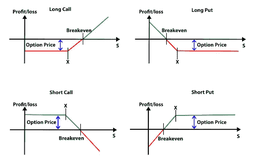*</figure>

*在哪里，*

*S =基础价格
X =执行价格*

*盈亏平衡点是指你不盈利或不亏损的点。

如果期权是赚钱的，长期看涨期权持有者的利润等于到期时的股价减去执行价再减去溢价。如果期权到期时没有钱，看涨期权持有者将损失相当于期权费的金额，而期权的卖方将获得相当于期权费的固定利润。

同样，对于看跌期权的买方来说，当期权存在时获利，等于执行价减去到期时的股价再减去溢价。并且，看跌期权的卖出者获得了与期权费相等的利润。

好吧，到现在为止我们已经经历了很多理论。让我们换个话题，回到现实世界。期权是什么样子的？好吧，让我们来看看。*

* * *

## *期权交易报价包括什么？*

*如果你要寻找苹果股票的期权报价，它会是这样的:*

<figure class="kg-card kg-image-card kg-width-wide">*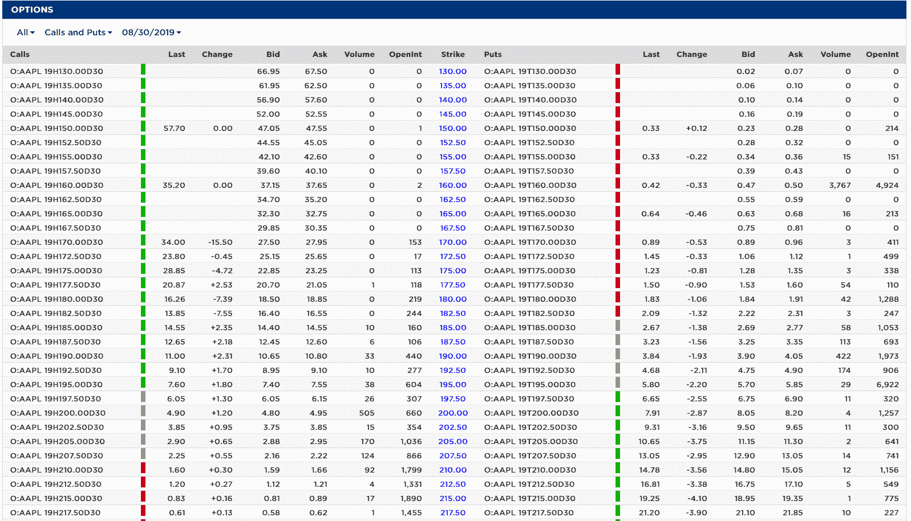*</figure>

*记录这段视频时，苹果公司的股价是 196 美元。现在让我们从列表中选取一行，并进一步细分。

**如是***

<figure class="kg-card kg-image-card kg-width-wide">*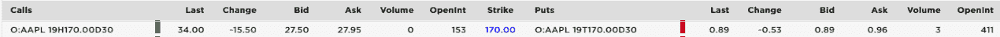*</figure>

 *在一个典型的期权链中，你会有一个看涨期权和看跌期权的清单，有不同的执行价格和相应的溢价。买入期权的细节在左边，卖出期权的细节在右边，执行价格在中间。*

*   *第一列是**符号**和**选项号**。*
*   ***“最后”栏**表示最后一次购买期权的金额。*
*   ***变化**表示该期权最近两次交易的差异*
*   *“**投标**栏表示对该期权提交的投标。*
*   ***要价**表示期权卖方寻求的要价。*
*   ***成交量**表示交易的期权数量。这里体积为 0。*
*   *"**未平仓权益**"表示以该执行价格可购买的期权数量。*

*看跌期权的列也是一样的。在某些情况下，数据提供者表明选择是有利可图、有利可图还是有利可图。当然，我们需要一个例子来真正帮助我们理解期权交易。因此，现在让我们来看一个。*

* * *

## *****期权交易示例*****

*我们将通过两个案例来更好地理解看涨和看跌期权。

为了简单起见，让我们假设如下:*

*   ***股票价格**期权卖出时:100 美元*
*   ***溢价**:5 美元*
*   ***到期日**:买入期权后 1 个月*

### *****案例一:*****

*股票的当前**价格:110 美元。**成交价格**:120 美元***

<figure class="kg-card kg-image-card kg-width-wide">*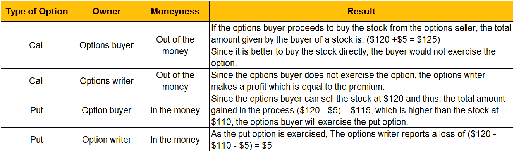*</figure>

### *****案例二:*****

*股票的当前**价格:120 美元。**成交价格**:110 美元***

<figure class="kg-card kg-image-card kg-width-wide">*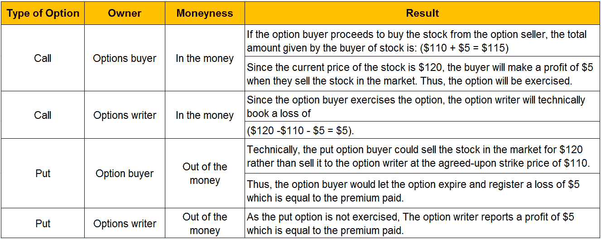*</figure>

*考虑到我们已经讨论了每个选项的详细场景，我们将几个选项组合在一起怎么样？让我们来理解许多专业人士在期权交易中使用的一个重要概念。*

* * *

## *****Python 中什么是看跌期权奇偶性？**T3】***

*任何对期权交易感兴趣的人都需要理解看跌期权平价的概念。通过理解看涨期权和看跌期权的平价，你可以理解看涨期权、看跌期权和股票的价值是如何相互关联的。这使您能够使用各种期权和股票组合创建其他综合头寸。*

### *****看跌期权平价的原理*****

*卖权-买权平价原则定义了欧式卖权和欧式买权价格之间的关系，两者具有相同的基础资产、执行价格和到期日。如果存在与看涨看跌期权平价的偏差，那么就会产生套利机会。交易者会利用这个机会赚取无风险利润，直到买权和卖权平价再次建立。

看跌期权平价原理可以用来验证期权定价模型。如果模型计算出的期权价格违反了卖权-买权平价规则，这种模型可以被认为是不正确的。*

### *****了解看跌期权的平价*****

*为了理解看涨-看跌平价，考虑由看涨期权和现金组成的投资组合“A”。持有的现金数量等于看涨期权价格。考虑由看跌期权和标的资产组成的另一个投资组合“B”。*

*S0 是基础资产的初始价格，ST 是到期时的价格。
设“r”为无风险利率，“T”为到期时间。
在时间“T ”,给定“r”的无风险利率，零息债券将值 K(执行价格)。*

***投资组合 A =看涨期权+零息债券***

***投资组合 B =看跌期权+标的资产***

<figure class="kg-card kg-image-card kg-width-wide">*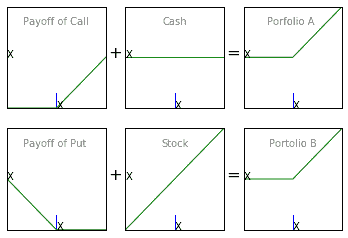*</figure>

<figure class="kg-card kg-image-card kg-width-wide">*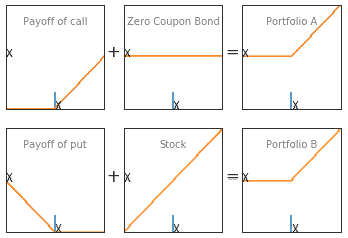*</figure>

*如果股价高于 X，看涨期权将被执行。否则，现金将被保留。因此，在“T”时，投资组合 A 的价值将由 max(ST，X)给出。

如果股价低于 X，将行使看跌期权。否则，基础资产将被保留。因此，在“T”时，投资组合 B 的价值将由 max (ST，X)给出。

如果两个投资组合在时刻“T”相等，那么它们在任意时刻都应该相等。这给了我们看跌期权平价等式。

**看跌期权平价方程式:***

***C + Xe-rT = P + S0***

*在这个等式中，*

*   *c 是欧式看涨期权的溢价*
*   *p 是欧式看跌期权的溢价*
*   *S0 是标的股票的现货价格*
*   *Xe-rT 是零息票债券(X)的现值(贴现值)*

*我们可以总结两个投资组合在不同条件下的收益，如下表所示。*

<figure class="kg-card kg-image-card kg-width-wide">*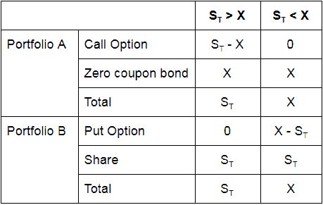*</figure>

*从上表中，我们可以看到，在两种情况下，两个投资组合的收益是相等的。*

### *****买入返售平价所需条件*****

*为了保持卖权-买权平价，应满足以下条件。然而，在现实世界中，它们几乎不成立，因此看涨-看跌平价方程可能需要相应的修改。出于这个博客的目的，我们假设这些条件都满足了。*

*   *在欧式期权的有效期内，标的股票不支付任何股息*
*   *没有交易成本*
*   *没有税*
*   *卖空是允许的，没有借款费用*

*因此，在基础股票不支付股息的无摩擦市场中，卖权-买权平价将成立。*

### *****套利机会*****

*在期权交易中，当看跌期权平价原则被违反时，交易者会试图利用套利机会。套利交易者会做多被低估的投资组合，做空被高估的投资组合，以获得无风险利润。*

#### *****如何利用套利机会*****

*现在让我们考虑一个有一些数字的例子，看看贸易如何利用套利机会。让我们假设一只股票的现货价格是 31 美元，无风险利率是每年 10%，三个月欧式看涨期权和看跌期权的溢价分别是 3 美元和 2.25 美元，行使价格是 30 美元。

在这种情况下，投资组合 A 的价值将为，*

***c+xe-rt = 3+30e-0.1 * 3/12 = $ 32.26***

*投资组合 B 的价值是，*

***P+S0 = 2.25+31 = 33.25 美元***

*投资组合 B 被高估，因此套利者可以通过做多投资组合 A 和做空投资组合 B 来获利。*

*   ***做空股票**。这将产生 31 美元的现金流入。*
*   *卖空看跌期权。这将产生 2.25 美元的现金流入。*
*   ***购买看涨期权**。这将产生 3 美元的现金流出。*
*   *总现金**流入**为-3+2.25+31 = 30.25 美元。*
*   ***投资**30.25 美元于**零息债券**，3 个月到期，年收益率 10%。*

***三个月后零息票债券的回报**将为 30.25 e 0.1 * 3/12 = 31.02 美元。

如果到期时股价高于 30 美元，将行使看涨期权，如果股价低于 30 美元，将行使看跌期权。在这两种情况下，套利者都会以 30 美元的价格买入一只股票。这支股票将被用来弥补亏空。

套利的总利润= $31.02 - $30 = $1.02

好了，我们现在不应该看一些代码吗？*

### *****用于绘制图表的 Python 代码*****

*下面的代码可以用来绘制投资组合的收益。*

<figure class="kg-card kg-image-card kg-width-wide">*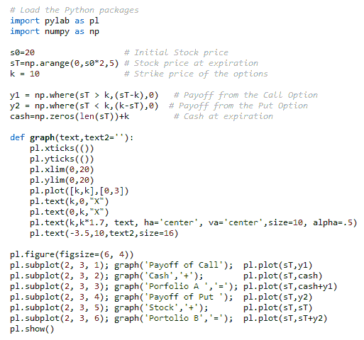*</figure>

<figure class="kg-card kg-image-card kg-width-wide">*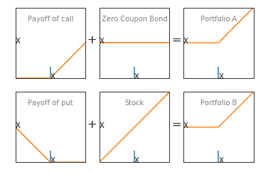*</figure>

*到目前为止，我们已经学习了期权交易的基础知识，也学习了期权交易策略。在这个节骨眼上，让我们看看期权交易的世界，试着回答一个简单的问题。*

* * *

## *期权交易为什么有吸引力？*

*期权是有吸引力的交易工具，因为回报更高。期权赋予持有者做某事的权利，并带有不行使该权利的“选择权”。这样，持有者可以限制他的损失，增加他的回报。

虽然一份期权合同确实是 100 股，但支付期权费的风险更小，而且如果我们购买了股票，就不用承担必须使用的总金额的风险。因此，你的风险暴露大大减少。然而，在现实中，期权交易是非常复杂的，这是因为期权定价模型是非常数学和复杂的。

那么，**你怎么评价期权是否真的值得买呢？**让我们来了解一下。

成功的期权[交易策略](https://quantra.quantinsti.com/course/quantitative-trading-strategies-models)的关键要求包括理解和实施期权定价模型。在本节中，我们将简要了解希腊人的期权，这将有助于创建和理解定价模型。*

* * *

## *期权定价*

*期权定价基于两种价值*

### *期权的内在价值*

*回想一下我们在几节之前讨论过的金钱概念。*

*当买入期权的股票价格高于执行价格或当卖出期权的股票价格低于执行价格时，期权被称为“价内(ITM)”，即它具有内在价值。*

*另一方面，“出资金(OTM)”期权没有内在价值。对于 OTM 看涨期权，股价低于执行价，对于 OTM 看跌期权；股票价格高于执行价格。*

*这些期权的价格完全由时间价值构成。*

### *期权的时间价值*

*如果你从期权价格中减去内在价值，就剩下时间价值了。它基于到期时间。你可以在 Quantra 上注册这个免费的期权交易策略课程，了解期权交易的基础知识，这将有助于你进行期权交易。*

*我们知道期权的内在价值和时间价值。我们甚至考虑了期权的收益。但是我们如何知道一个选项比另一个更好，以及如何衡量期权定价的变化。好吧，那我们就接受希腊人的帮助吧。*

* * *

## *****选项希腊人*****

*希腊是期权交易中与各种头寸相关的风险度量。常见的有 delta，gamma，theta，vega。随着标的股票价格或波动性的变化，你需要知道你的期权定价会受到怎样的影响。期权中的希腊人帮助我们理解各种因素如价格、到期时间、波动性如何影响期权定价。*

### *三角洲*

***Delta** 衡量期权价格对标的股票价格变化的敏感度。简而言之，delta 是期权的希腊语，它告诉你一个股票期权的价值会上升或下降多少钱，其基础股票会上升或下降 1 美元。Delta 取决于基础价格、到期时间和波动性。虽然计算 delta 的公式是基于 Black-Scholes 期权定价模型，但我们可以将其简单地写成:*

***Delta =【预期溢价变化】/【标的股票价格变化】***

*让我们以一个看涨期权为例来理解这一点:
我们将创建一个历史价格表，用作样本数据。让我们假设期权将于 3 月 5 日到期，约定的执行价格为 140 美元。*

<figure class="kg-card kg-image-card kg-width-wide">*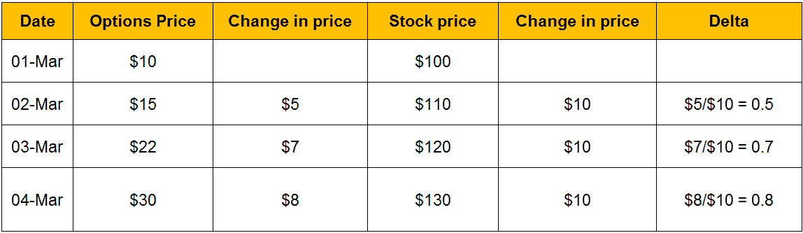*</figure>

*因此，如果我们必须在 3 月 2 日计算期权的 delta，它将是$5/$10 = 0.5。

在这里，我们要补充的是，由于一个期权的价值来源于标的股票，因此 delta 期权的价值将介于 0 和 1 之间。通常，当期权走向“价内”时，delta 期权逐渐趋向于 1。

看涨期权的 delta 随着价格的上涨而增加，看跌期权则相反。想想看，当股票价格接近执行价格时，期权的价值会减少。因此，delta 看跌期权的范围总是在-0 和 1 之间。*

### *微克*

***Gamma** 衡量期权 delta 对基础股票价格变动的风险敞口。就像 delta 是期权价格相对于标的股票价格的变化率；gamma 是 delta 相对于基础股票价格的变化率。因此，伽马被称为二阶[导数](/derivatives-market/)。*

***Gamma =[期权增量的变化]/[标的资产价格的单位变化]***

*让我们看一个 delta 如何相对于 Gamma 变化的例子。考虑一个行权价为 300 美元、溢价为 15 美元的看涨期权。*

*   *成交价格:300 美元*
*   *初始股价:150 美元*
*   *差值:0.2*
*   *伽玛:0.005*
*   *溢价:15 美元*
*   *新股价:180 美元*
*   *股票价格的变化:180 美元-150 美元= 30 美元*

*现在，*

<figure class="kg-card kg-image-card kg-width-wide">*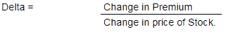*</figure>

*因此，溢价变化= Delta *股票价格变化= 0.2 * 30 = 6。
由此，新溢价= $ 15+$ 6 = $ 21

delta 的变化= Gamma *股价的变化= 0.005 * 30 = 0.15
由此，新 delta = 0.2 + 0.15 = 0.35。

让我们更进一步，假设股票价格再上涨 30 点，达到 210 美元。

现在，
新股价:$210
股价变动:$210 - $180 = $30

现在，*

<figure class="kg-card kg-image-card kg-width-wide">**</figure>

*溢价的变化= Delta * 0.35 * 30 的变化= 10.5 美元
由此，新溢价= 21 美元+10.5 美元= 31.5 美元

Delta 的变化= Gamma *股价的变化= 0.005 * 30 = 0.15
由此，新 delta = 0.35 + 0.15 = 0.5。

这样，期权的 delta 和 gamma 随着股票价格的变化而变化。我们应该注意到，当期权的 delta 等于钱的时候，股票看涨期权的 Gamma 是最高的。因为基础股票的微小变化会导致 delta 的急剧增加。类似地，当股票的 delta 随着股票期权的变化而轻微变化时，价外或价内期权的 gamma 较低。

**最高伽玛为 At-the-money (ATM)选项**
三种工具中，at-the-money (ATM)、out-of-the-money (OTM)和 in-the-money(ITM)；自动取款机的伽马值最高。可以看这个视频更详细的了解一下。*

### *希腊字母的第八字*

***Theta** 衡量期权价格对时间推移的暴露程度。它衡量期权价格，尤其是时间价值，随着到期时间的临近而变化或下降的速度。*

### *低湿平原*

***Vega** 衡量期权价格对标的波动率变化的敞口。一般来说，波动性越高，期权越贵。因此，如果波动率上升，期权的价格可能会上升，反之亦然。*

*****织女星相对于到期时间的增减？*****

*你怎么想呢?你可以通过看[这个视频](https://youtu.be/ShC2OLijuOE)来确认你的答案。

其中一个流行的期权定价模型是 Black Scholes，它有助于我们理解期权希腊人的一种期权。*

* * *

## *****布莱克-斯科尔斯期权定价模型*****

*布莱克-斯科尔斯期权定价模型的公式如下:*

<figure class="kg-card kg-image-card kg-width-wide">*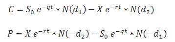*</figure>

*在哪里，*

*   *c 是看涨期权的价格*
*   *p 代表看跌期权的价格。*
*   *S0 是基础价格，*
*   *x 是执行价格，*
*   *σ代表波动性，*
*   *r 是连续复合的无风险利率，*
*   *t 是到期时间，而*
*   *q 是连续复合股息率。*
*   *N(x)是标准的正态累积分布函数。*

*d1 和 d2 的公式如下所示:*

<figure class="kg-card kg-image-card kg-width-wide">*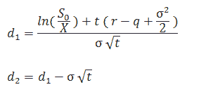*</figure>

*为了计算希腊人的期权，我们使用了布莱克-斯科尔斯期权定价模型。

δ和γ的计算方法为:*

<figure class="kg-card kg-image-card kg-width-wide">*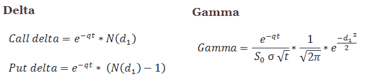*</figure>

*在下面的例子中，我们使用了 BS 模型的决定因素来计算希腊人的期权。*

<figure class="kg-card kg-image-card kg-width-wide">*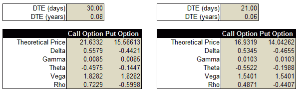*</figure>

*在基础价格为 **1615.45** 时，看涨期权的价格为 **21.6332** 。

如果我们将底层的价格提高了 Rs。1，希腊人在期权中的看涨、看跌价格和价值的变化如下所示。*

<figure class="kg-card kg-image-card kg-width-wide">*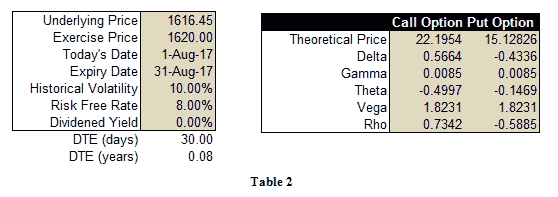*</figure>

*正如可以观察到的，第一个表中看涨期权的 Delta 为 **0.5579** 。因此，根据 delta 的定义，当基础价格上涨 1 卢比时，我们可以预计看涨期权的价格大约会上涨该值。看涨期权的新价格为 22.1954，即*

*21.6332+0.5579 ~ 22.1954
**22.1911 ~ 22.1954***

*让我们转到伽玛，另一个希腊选项。

如果您观察两个表格中的 Gamma 值，它对于看涨和看跌期权合约是相同的，因为它对于两种期权类型具有相同的公式。如果你做多期权，那么你会选择高 gamma，如果你做空，那么你会选择低 gamma。*

*因此，如果期权交易者有净多头期权头寸，那么他的目标是最大化 gamma，而在净空头头寸的情况下，他将试图最小化 gamma 值。

第三个希腊文，Theta 对看涨期权和看跌期权都有不同的公式。这些内容如下:*

<figure class="kg-card kg-image-card kg-width-wide">*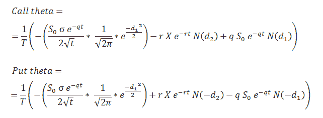*</figure>

<figure class="kg-card kg-image-card kg-width-wide">**</figure>

*在 LHS 的第一张表上，期权合约还有 30 天到期。我们有一个负的θ值-0.4975，这意味着期权交易者正在与时间赛跑。为了从交易中获利，他必须确定自己的分析，因为时间的流逝会影响他的头寸。这种时间衰减的影响在 RHS 的表格中很明显，其中剩余的到期时间现在是 21 天，其他因素保持不变。*

*结果，看涨期权的价值从 21.6332 跌至 16.9 行为 319。如果期权交易者想从时间衰减属性中获利，他可以卖出期权而不是做多，这将导致正的θ。我们刚刚讨论了期权中的一些希腊个体是如何影响期权定价的。然而，要想真正从你的期权头寸中获利，理解希腊人在期权头寸中的综合行为是非常重要的。如果你想在 Excel 中做期权希腊文，可以参考[这个博客](/options-trading-excel-model/)。

现在让我们来看一个用来实现 Black Scholes 模型的 Python 包。*

### *****Python 库-米编*****

#### *****什么是米变？**T3】***

*Mibian 是一个期权定价 Python 库，它实现了 Black-Scholes 以及其他一些货币和股票的欧式期权模型。在本文的上下文中，我们将研究这个库的 Black-Scholes 部分。Mibian 兼容 python 2.7 和 3.x，这个库需要 scipy 才能正常工作。*

#### *****B**lack scholer**车型如何使用米变？*****

*该库中构建 Black-Scholes 模型的函数是 BS()函数。该函数的语法如下:*

```
*BS([underlyingPrice, strikePrice, interestRate, daysToExpiration], volatility=x, callPrice=y, putPrice=z)*
```

*第一个输入是包含基础价格、执行价格、利率和到期日的列表。每次调用函数时都必须指定这个列表。接下来，我们输入波动率，如果我们对计算期权和希腊期权的价格感兴趣。BS 函数将只包含两个参数。

如果我们对计算[隐含波动率](/implied-volatility/)感兴趣，我们将不输入波动率，而是输入买入价格或卖出价格。如果我们对计算卖权-买权平价感兴趣，我们将在清单后输入卖权价格和买权价格。返回的值将是:*

***(买入价格+债券到期时的履约价格)-(卖出价格+标的资产价格)***

*下面提到了返回各种期望输出的语法以及 BS 函数的用法。BS 函数的语法，输入为波动率以及存储基础价格、执行价格、利率和到期日的列表:*

```
*c = mibian.BS([1.4565, 1.45, 1, 30], volatility=20)*
```

*上述 BS 函数返回值的属性:*

```
*c.callPrice       Returns the call price
c.putPrice    Returns the put price
c.callDelta         Returns the call delta
c.putDelta    Returns the put delta
c.callDelta2     Returns the call dual delta
c.putDelta2  Returns the put dual delta
c.callTheta      Returns the call theta
c.putTheta      Returns the put theta
c.callRho         Returns the call rho
c.putRho         Returns the put rho
c.vega             Returns the option vega
c.gamma         Returns the option gamma*
```

*BS 函数的语法，输入为看涨价格以及存储基础价格、执行价格、利率和到期日的列表:*

```
*c = mibian.BS([1.4565, 1.45, 1, 30], callPrice=0.0359)*
```

*上述 BS 函数返回值的属性:*

```
*c.impliedVolatility Returns the implied volatility from the call price*
```

*BS 函数的语法，输入为卖出价格以及存储基础价格、执行价格、利率和到期日的列表:*

```
*c = mibian.BS([1.4565, 1.45, 1, 30], putPrice=0.0306)*
```

*上述 BS 函数返回值的属性:*

```
*c.impliedVolatility Returns the implied volatility from the put price*
```

*BS 函数的语法，输入为买入价格和卖出价格，以及存储基础价格、执行价格、利率和到期日的列表:*

```
*c = mibian.BS([1.4565, 1.45, 1, 30], callPrice=0.0359, putPrice=0.0306)*
```

*上述 BS 函数返回值的属性:*

```
*c.putCallParity Returns the put-call parity*
```

*虽然 Black-Scholes 是一个相对稳健的模型，但它的缺点之一是无法预测波动率微笑。随着我们转向下一个定价模式，我们将了解更多这方面的内容。*

* * *

## *期权交易的德曼·卡尼模型*

*德曼·卡尼模型的开发是为了克服长期存在的布莱克·斯科尔斯模型的问题，即波动微笑。Black Scholes 模型的一个基本假设是，标的遵循具有恒定波动率的随机游走。*

*然而，在计算不同执行价格的隐含波动率时，可以看到波动率曲线并不是我们所预期的恒定直线，而是一个微笑的形状。这条隐含波动率相对于执行价格的曲线被称为波动率微笑。

如果布莱克·斯科尔斯模型是正确的，这将意味着标的遵循对数正态分布，隐含波动率曲线将是平坦的，但波动率微笑表明交易者隐含地将独特的非对数正态分布归因于标的。*

*这种非对数正态分布可归因于基础的修正随机游走，在某种意义上，波动率不是常数，并随股票价格和时间而变化。为了正确评估期权的价值，我们需要知道修正的随机游走的确切形式。德曼·卡尼模型展示了如何将隐含波动率作为输入来推断基础随机游走的形式。更具体地说，从对应于底层随机行走的微笑中提取唯一的二叉树，这种树被称为隐含树。*

*该树可用于评估市场上价格不确定的其他衍生产品的价值——例如，它可用于标准但缺乏流动性的欧式期权、美式期权和奇异期权。*

* * *

## *什么是赫斯顿模型？*

*Steven Heston 为具有随机波动性的资产的欧式看涨期权的价格提供了封闭形式的解决方案。该模型还考虑了波动率微笑，而波动率微笑无法用布莱克-斯科尔斯模型来解释。

赫斯顿模型的基本假设是波动率是一个随机变量。因此，有两个随机变量，一个是基础变量，一个是波动率变量。通常，当基础的方差变得随机时，封闭形式的解将不再存在。

但这是[赫斯顿模型](/heston-model/)的一个主要优势，即欧洲普通期权确实存在封闭形式的解决方案。该特征也使得模型的校准可行。如果您有兴趣更详细地了解这些模型，您可以浏览以下研究论文，*

*   ***德曼·卡尼模型**——伊曼纽尔·德曼和伊拉杰·卡尼的《波动的微笑及其隐含的树》。*
*   ***赫斯顿模型**——“具有随机波动性的期权的封闭形式解决方案，应用于债券和货币期权”*

*到目前为止，你已经了解了期权交易和如何分析期权以及所使用的定价模型。现在，要应用这些知识，你需要进入市场，这就是经纪人的作用。*

* * *

## *如何开立期权交易账户？*

*如何进行期权交易？首先创建一个帐户。你需要这样做:*

### *****期权交易如何选择券商？**T3】***

*在我们向经纪人开立期权交易账户之前，让我们先来看一下选择经纪人时需要考虑的几点。*

*   *当你涉足期权交易领域时，要明白你的目标，无论是作为一种对冲风险的方式，作为一种投机工具，还是为了创收等等。*
*   *经纪人是否提供自己的期权评估工具？当你选择正确的选项时，接触过多的工具总是有益的。*
*   *询问交易成本或经纪人收取的佣金，因为这将侵蚀你的投资收益。*
*   *一些经纪人提供股票市场各个领域的研究资料。你可以随时向经纪人咨询研究和订阅等事宜。*
*   *检查经纪人提供的支付选项，确保它与您的便利兼容。*

### *****寻找合适的经纪人*****

*一旦所需的背景调查完成，你可以根据自己的需要和方便选择合适的经纪人。在全球市场中，[排名靠前的经纪商](https://www.nerdwallet.com/best/investing/options-trading-brokers)列表如下:*

### *****国际顶级经纪商名单**进行**期权交易*****

*顶级国际期权经纪商名单如下:*

*   *电子贸易(每份期权合同 0.65 美元)*
*   *Ally Invest(每份交易合同 0.5 美元)*
*   *TD Ameritrade(每份合同收费 0.65 美元)*
*   *[互动经纪人](/ibpy-tutorial-implement-python-interactive-brokers-api/)(每份期权合约起价 0.25 美元)*
*   *嘉信证券经纪(每份期权合约 0.65 美元)*

### *****印度顶级经纪商名单**进行**期权交易*****

*[印度顶级期权经纪商](https://www.chittorgarh.com/report/top_20_share_brokers_in_india_by_clients_at_nse/1/)列表如下:*

*   *零达*
*   *ICICI Direct*
*   *hdfc 证券*
*   *沙雷汗*
*   *科塔克证券公司*
*   *天使经纪*
*   *轴直接*

*太好了！现在我们来看一些可以在现实世界中使用的期权交易策略。*

* * *

## *****期权交易策略*****

*有相当多的期权交易策略可以在今天的交易格局中使用。最受欢迎的期权交易策略之一是基于价差和蝴蝶。让我们详细地看看它们。*

### *****和蝴蝶*****

***差价或更确切地说差价交易是同时买卖相同的期权类别，但到期日和执行价格不同。差价期权交易用于限制风险，但另一方面，它也限制了沉迷于差价交易的人的回报。

因此，如果我们只对证券的买入期权和卖出期权感兴趣，我们就称之为买入价差，如果只是卖出，那么就称之为卖出价差。

根据变化因素，利差可分为:***

*   ***水平价差-不同的到期日，相同的执行价格***
*   ***垂直价差-相同的到期日，不同的执行价格***
*   ***对角价差-不同的到期日，不同的执行价格***

***请记住，期权的价值是基于基础证券(在这种情况下，股票价格)。因此，我们也可以根据我们希望价格上涨([牛市价差](/bull-call-spread-strategy/))还是下跌([熊市价差](/bear-spread-options-trading-strategy-in-python/))来区分期权价差。***

#### *******牛叫传*******

***在看涨期权价差中，如果交易不符合我们的意愿，我们会买入多个期权来抵消潜在的损失。

让我们借助一个例子来试着理解这个。
下表为同一标的股票和同一到期日的可用期权:***

<figure class="kg-card kg-image-card kg-width-wide">***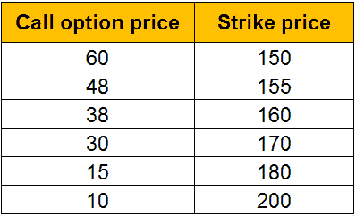***</figure>

***通常，如果我们做了分析，认为股票可以涨到 200 美元，一种方法是以 15 美元的溢价购买一个执行价格为 180 美元的看涨期权。因此，如果我们是正确的，股票在到期时达到 200 美元，我们以 180 美元的执行价买入，由于我们支付了 15 美元的溢价，因此获得了(20-15 美元)= 5 美元的利润。

但是，如果我们是错误的，股票价格达到 180 美元或更低，我们将不会行使期权，导致 15 美元的溢价损失。一个变通办法是以 180 美元买入看涨期权，以 10 美元卖出 200 美元的看涨期权。

因此，当股票价格在到期时达到 200 美元时，我们行使看涨期权获利 5 美元(如上所述),并获得 10 美元的溢价利润，因为所有者不会行使这一权利。因此，通过这种方式，总利润为($5 + $10) = $15。

如果股票价格超过 200 美元，并且所有者行使了看跌期权，那么从 180 美元买入的看涨期权中增加的利润将与从 200 美元卖出的看涨期权中累积的损失相同，因此，无论到期日股票价格增加到 200 美元以上，利润将总是 15 美元。

让我们构建一个表格来了解各种场景。***

<figure class="kg-card kg-image-card kg-width-wide">***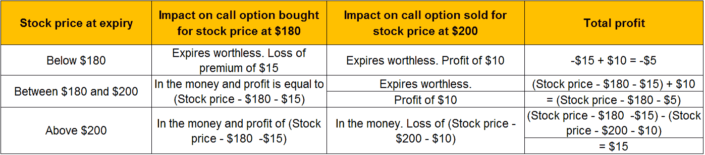***</figure>

***您也可以理解如何实现看涨期权价差，使用 Python 实现它，并查看[看涨期权价差收益图](/bull-call-spread-strategy/)。***

#### *******熊放散*******

***当我们认为股票将会上涨时，看涨期权价差被执行，但如果我们分析并发现股票价格将会下跌，该怎么办呢？在这种情况下，我们使用看跌期权差价。

假设我们看的是同一个到期日的同一只股票的不同行权价。***

<figure class="kg-card kg-image-card kg-width-wide">***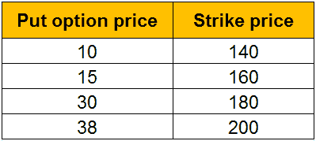***</figure>

***一种方法是以 15 美元的溢价买入执行价为 160 美元的看跌期权，同时以 10 美元的执行价卖出执行价为 140 美元的看跌期权。

这样，我们创建一个场景表如下:***

<figure class="kg-card kg-image-card kg-width-wide">***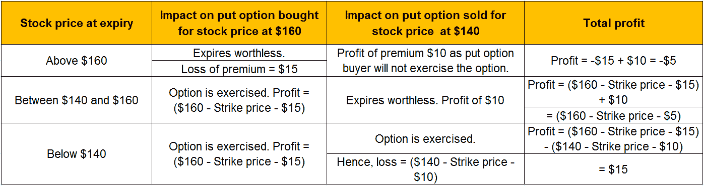***</figure>

***这样，我们可以通过同时买入和卖出期权来最大限度地减少损失。可以查看[熊点差](/bear-spread-options-trading-strategy-in-python)期权交易策略，了解如何用 Python 实现。***

#### *******蝴蝶扩散*******

***蝴蝶价差实际上是牛熊价差的组合。[蝶式期权策略](/butterfly-spread-options-trading-strategy-python/)的一个例子由身体(中间的双期权位置)和翅膀(两个相对的末端位置)组成。***

*   ***其属性如下所示:***
*   ***这是一个三足战略***
*   ***涉及买入或卖出看涨/看跌期权(不同于[备兑买入策略](/write-covered-call-strategy-in-python/)买入股票并卖出 OTM 看涨期权)***
*   ***可以使用看涨或看跌期权来构造***
*   ***在同一到期日的 4 份期权合约***
*   ***拥有相同的基础资产***
*   ***涉及 3 个不同的执行价格(2 个具有相同的执行价格)***
*   ***用这些电话创建 2 笔交易***

* * *

## ***期权交易策略列表***

***我们将在下面列出更多的期权交易策略:***

*   ***[对角价差](/diagonal-spreads-options-trading-strategy-python/)***
*   ***[日历跨页](/calendar-spread-options-trading-strategy/)***
*   ***[合成长放](/synthetic-long-put-strategy-python/)***
*   ***[长连击](/trading-options-long-combo-trading-strategy/)***
*   ***[已覆盖呼叫](/write-covered-call-strategy-in-python/)***
*   ***[熊叫梯](/bear-call-ladder-options-trading-strategy-python/)***
*   ***[衣领选项](/collar-options-trading-strategy-python/)***
*   ***[跨期权](/straddle-options-trading-strategy-python/)***
*   ***[翡翠蜥蜴](/jade-lizard-options-trading-strategy-python/)***
*   ***[铁蝴蝶](/iron-butterfly-options-trading-strategy/)***
*   ***[漫长的扼死](/long-strangle-option-strategy-in-python/)***
*   ***[铁秃鹰](/iron-condor-options-trading-strategy/)***
*   ***[破蝶](/broken-wing-butterfly-options-trading-strategy-python/)***

***还有很多你可以探索的地方。***

* * *

## ***期权交易的进一步解读***

***对于了解期权交易和实施[期权交易策略](https://quantra.quantinsti.com/course/options-trading-strategies-python-intermediate)的学习者来说，他们可以通过这份期权交易的阅读和项目清单来扩展他们的知识。***

*   ***[奇异期权](/exotic-options/)***
*   ***[交换选项](/swaption/)***
*   ***[分散交易](/dispersion-trading-using-options/)***
*   ***[什么是飞跃](/leap-options/) -飞跃期权和[飞跃期权策略](/leap-options/#strategy)***
*   ***[机器学习期权交易](/covered-call-strategy-machine-learning/)***
*   ***[指数期权项目](/trading-index-options-index-momentum/)***
*   ***[分散交易项目](/dispersion-trading-using-options/)***
*   ***[指数套利](/index-arbitrage-automated-options-trading-strategy/)***

***我们整理了一份由专家撰写的最受欢迎的期权交易博客列表。***

* * *

## *****结论*****

***我们已经涵盖了期权交易的所有基础知识，包括不同的期权术语和类型。我们还看了期权交易的例子和希腊期权。我们了解各种期权交易策略，以及在开立期权交易账户之前需要考虑的事情。***

***如果你对期权交易感兴趣，这个博客将是一个完美的起点。然而，如果你想继续自学，我们的免费期权交易课程正是你所需要的。它从你必须知道的能够交易期权的基本术语和概念开始。***

***期权交易的世界并不局限于此。要继续前进，你需要开始在[期货](https://quantra.quantinsti.com/course/futures-trading) &期权交易中使用量化技术，并学习创建期权定价模型、期权希腊人和各种策略。有了我们的学习轨迹，[就有可能开发出期货&期权交易](https://quantra.quantinsti.com/learning-track/quantitative-approach-in-options-trading)的量化方法。***

***立即开始您的选择之旅！***

* * *

****<small>免责声明:本文提供的所有数据和信息仅供参考。QuantInsti 对本文中任何信息的准确性、完整性、现时性、适用性或有效性不做任何陈述，也不对这些信息中的任何错误、遗漏或延迟或因其显示或使用而导致的任何损失、伤害或损害负责。所有信息均按原样提供。</small>****