# 使用 Python 的多策略投资组合管理

> 原文：<https://blog.quantinsti.com/portfolio-management-strategy-python/>

马里奥·比萨

在这篇文章中，我们将回顾什么是投资组合，它包含的元素，除了回顾一些绩效指标，稍后我们将创建一个简单的投资组合，包含两个策略和几个工具。我们将分析 Kelly 的方法，我们将看到有助于我们最大化回报的不同组合，并将它与简单的平均分配权重的投资组合进行比较。

最后，我们提出一个与经典的有效前沿投资组合管理方法的比较。

查看我之前关于[投资组合管理简介](/introduction-portfolio-management/)的文章，这篇文章解释了你需要了解的关于[投资组合管理](https://quantra.quantinsti.com/course/quantitative-portfolio-management)的所有知识，比如技术、类型、衍生品等等。

在这篇博客中，我们将涉及以下主题:

*   [简介](#introduction)
*   [有效投资组合](#efficient)
*   [投资组合的要素](#elements)
*   [投资组合绩效指标](#measure)
*   [建立简单的投资组合](#building)
*   [关于工具或资产](#instruments)
*   [导入库和数据](#import)
*   [多策略](#multiple-strategies)
*   [投资组合策略](#strategies)
*   [基本分析](#analysis)
*   [基本性能分析](#performance)
*   [等权重投资组合](#equal)
*   [用凯利标准优化的投资组合权重](#kelly)
*   [有效前沿:马克维茨投资组合优化](#markowitz)
*   [结论](#conclusion)

管理投资组合或多重策略的投资组合管理与如何管理资产组合没有太大区别，只是在这种情况下，资产是我们可操作的策略。当然，这些策略处理我们可以做多、做空或等待的工具。显然，管理策略组合的目标仍然是在最小化风险的同时最大化回报。

通过这个简单的投资组合，我们得出了一个基本问题:

> 我们如何在不同的策略和工具中分配资本，以实现回报最大化和风险最小化？

为了有一个基准来比较我们的优化，我们将从简单的投资组合开始，为其每个元素分配相同的权重。

对于资本分配中权重的优化，有众多的学术研究，每一个都试图优化不同的参数。

两种最广为人知且截然相反的方法是:

*   由**马科维茨**提出的**有效边界**，其中我们试图在一定风险下最大化收益，也就是说，它侧重于包含指定的风险。
*   另一方面，**约翰·凯利和埃德·索普**提出的**凯利方法**试图最大化财富的对数效用的期望，即最大化回报是焦点。

交易者有责任了解这些和其他方法，以确定哪种方法最适合他的投资风格和风险偏好。

有效的投资组合被定义为在给定回报下风险最小的投资组合，或者说，在给定风险水平下回报最高的投资组合

作为算法交易者，我们的投资组合由策略或规则组成，每个策略或规则管理一个或多个工具。

当我们只有一种策略管理一种工具时，投资组合管理仅限于最大化回报，同时最小化风险。这将是最简单的投资组合，但不是简单的解决方案。

这不是一个简单的解决方案，因为我们必须回答一些问题。

> 使用我们正在使用的工具，我们能达到预期的回报吗？
> 
> 有没有其他的工具可以让我们在同样的风险下获得更高的回报，或者在同样的回报下获得更低的风险？

另一方面，如果我们想使投资组合多样化，从而降低与策略或工具相关的风险，我们必须建立一个包含不同工具的投资组合，最好是包含不同市场机制的不同策略。

因此，除了上述问题之外，我们还需要回答我们为每个策略分配的权重，以及我们为投资组合中的每个工具分配的权重，以实现所需的目标(最大回报与最小风险)。

让我们定义我们可以控制的投资组合元素:

*   资本:我们可用于投资或投机的资金数量。
*   **工具:**这些是可纳入我们投资组合管理策略的资产。
*   **货币:**交易资产的货币。当我们投资于以外币计价的资产时，我们承担外汇风险。
*   **波动性:**也称为资产风险，表示分析期间资产的变动。
*   **成本:**购买/卖空一项资产所需的资金。
*   **流动性:**是资产吸收我们业务的能力。
*   规则:这些是试图利用某种市场机制的策略。
*   **头寸权重:**我们分配给每项资产和/或策略的资本量。
*   **回报:**绝对回报是我们投资组合的回报，相对回报是我们投资组合相对于基准的回报。当我们不与任何人比较我们的回报时，绝对回报是一个很好的衡量标准，但当我们需要比较业绩时，我们使用相对回报。
*   **风险或波动:**这是投资组合承担的(估计)金额。

算法交易员有大量的方法来分析策略和/或投资组合的表现。

一些最常用的投资组合业绩衡量标准有:

*   年回报率
*   年度波动率
*   [夏普比率](/sharpe-ratio-applications-algorithmic-trading/)
*   Sortino 比率
*   贝塔
*   特雷诺比率
*   信息比率
*   歪斜
*   峭度
*   最大水位下降
*   交易数量
*   利润比率
*   保持时间

你可以在这篇文章中找到这些措施[的完整描述。

除了这些单独的度量，](/performance-metrics-risk-metrics-optimization/) [pyfolio 库](https://github.com/quantopian/pyfolio)实现了一个非常棒的性能度量和图形目录，当然值得学习使用。我们将通过这篇文章看到他们的一些表现报告。

为了构建我们的示例投资组合，我们将使用随机生成的时间序列来模拟几种工具的两种策略的回报。

*   **策略 1** -第一个策略，我们称之为 **A** ，是一个趋势跟踪系统，因为它是这些策略中的典型，它有一个正偏差。
*   **策略 2** -第二个策略，我们称之为 **B** ，是一个均值回复系统，因为它是这些策略中的典型，它有一个负偏差。

### **偏置的作用**

偏差是描述策略行为的一个重要概念，因为它是收益分布的一个指标。

#### 正偏压

当我们有正偏差时，这意味着我们有小的频繁损失，但我们捕捉到了分布中不常见的异常值。这种行为是典型的趋势跟踪系统，因为我们有频繁的小亏损和不经常的大回报的错误信号，或者同样的，快速止损，让收益跑。

#### 负偏压

当我们有负偏差时，这意味着我们经常有小的收益，偶尔有大的损失。这种行为是均值回归、套利、卖出期权或类似系统的典型特征，也就是说，我们有一个系统，系统地收集小利润，并抛出不常见的大损失。

### 要使用的策略

在本帖中，我们将直接讨论退货策略。不用说，任何被视为投资组合一部分的策略都必须通过回溯测试，这为我们提供了足够的不确定性。

如果你需要回顾回溯测试的基础知识，查看这篇文章。[什么是交易策略的回溯测试？](/backtesting/)

资产是投资组合的主要元素，它们的特征对于获得确定的风险/收益比率具有决定性作用。一些最重要的特征是:

*   货币
*   波动性
*   资产流动性
*   费用
*   佣金
*   滑动
*   相关性(相对于其他资产)

#### 货币

如果我们的投资组合以美元计价，而我们在欧洲证券交易所购买了一种工具，我们就是在购买欧元。因此，我们投资的回报不仅取决于工具(或策略)的回报，还取决于货币的命运。

短期来看，可能无足轻重，但长期来看，可能会提升回报，降低回报或增加损失。

#### 波动性

该工具的波动性使我们能够估计我们是否能够达到期望的回报，或者我们是否能够控制所需的风险。也就是说，如果我们想提高回报，我们通常会寻找波动性更大的资产，如果我们想控制风险，我们会寻找波动性较小的资产。

用年化收益 3%的国债很难把我们策略的收益提高到 20%(也许可以通过加仓、加杠杆或者其他公式，但很难)。

另一方面，如果我们填充波动率超过 300%的疯狂细价股组合，很难将我们策略的风险控制在 10%。

#### **流动性**

工具的流动性表明其吸收我们进场或出场头寸的能力，从逻辑上讲，这对于处理大额头寸的策略更为重要，但单个合约的流动性在某些时候(到期日、恐慌时刻等)可能至关重要。).

#### **成本**

资产的成本让我们知道资产在我们投资组合中的位置和权重。让我们假设我们有一个利用黄金价格特征的策略。我们可以通过多种方式投资黄金，其中我们可以购买黄金期货合约，电子迷你黄金和微型黄金，我们有可用的期权，ETF 等。每个都有成本、波动性、佣金、滑点等。

#### 佣金和滑点

佣金和滑点破坏了我们投资组合的回报，应该深入研究。滑点与买卖价格密切相关。

#### 相互关系

最后，当我们分析不同的工具以纳入我们的策略组合时，有必要考虑与可能的候选者的相关性。

例如，如果我们的投资组合策略是利用 e-mini 黄金合约的趋势跟踪系统，那么从多样化的角度来看，包括通常与黄金高度相关的白银期货就没有多大意义。

理想情况下，我们会寻找低相关性资产来利用同样的策略。

```
import pandas as pd
import numpy as np
import datetime
import math
from tabulate import tabulate
import matplotlib.pyplot as plt
import seaborn as sns
import cvxopt as opt
from cvxopt import blas, solvers
import cvxpy as cp
import pyfolio as pf

```

### 策略 A -趋势跟踪系统-工具 1

这里我们模拟了趋势跟踪策略的回报，并强制其夏普比率为 0.5，偏斜度为 1。

【中】:

```
StrategyA1_SR05_SKW1_returns = pd.read_csv('StrategyA1_SR0.5_SKW1.csv', header=None, parse_dates=True, index_col=0)
StrategyA1_SR05_SKW1_returns.columns=['Return']

#print(Strategy_A_Instrument_1_returns.head())
StrategyA1_SR05_SKW1_returns.plot(title = 'Daily return - Strategy A Instrument 1', figsize=(12, 6))

cum_datalist=[1+x for x in StrategyA1_SR05_SKW1_returns['Return']] 
cum_datalist=pd.DataFrame(cum_datalist, index=StrategyA1_SR05_SKW1_returns.index)
cum_datalist.cumprod().plot(title = 'Cummulative Daily return - Strategy A Instrument 1', figsize=(12, 6))

```

Out [ ]

```
<matplotlib.axes._subplots.AxesSubplot at 0x12e83aa20>

```

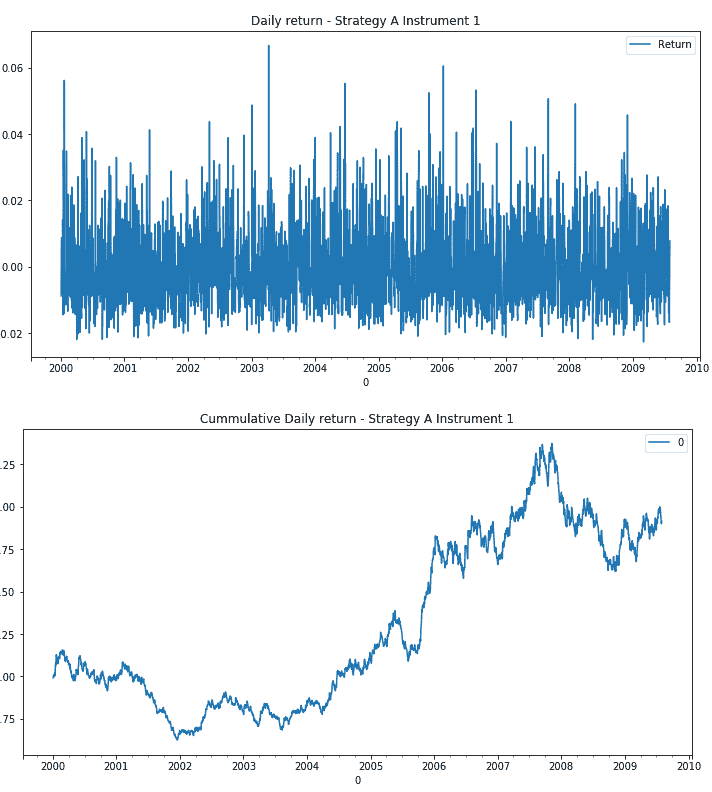

### **策略 A -趋势跟踪系统-仪器 2**

在这里，我们模拟了趋势跟踪策略的回报，并强制其夏普比率为 1，偏斜度为 1。

【中】:

```
StrategyA2_SR1_SKW1_returns = pd.read_csv('StrategyA2_SR1_SKW1.csv', header=None, parse_dates=True, index_col=0)
StrategyA2_SR1_SKW1_returns.columns=['Return']

#print(Strategy_A_Instrument_1_returns.head())
StrategyA2_SR1_SKW1_returns.plot(title = 'Daily return - Strategy A Instrument 2', figsize=(12, 6))

cum_datalist=[1+x for x in StrategyA2_SR1_SKW1_returns['Return']]
cum_datalist=pd.DataFrame(cum_datalist, index=StrategyA2_SR1_SKW1_returns.index)
cum_datalist.cumprod().plot(title = 'Cummulative Daily return - Strategy A Instrument 2', figsize=(12, 6))
```

Out[ ]:

```
<matplotlib.axes._subplots.AxesSubplot at 0x132139278>
```

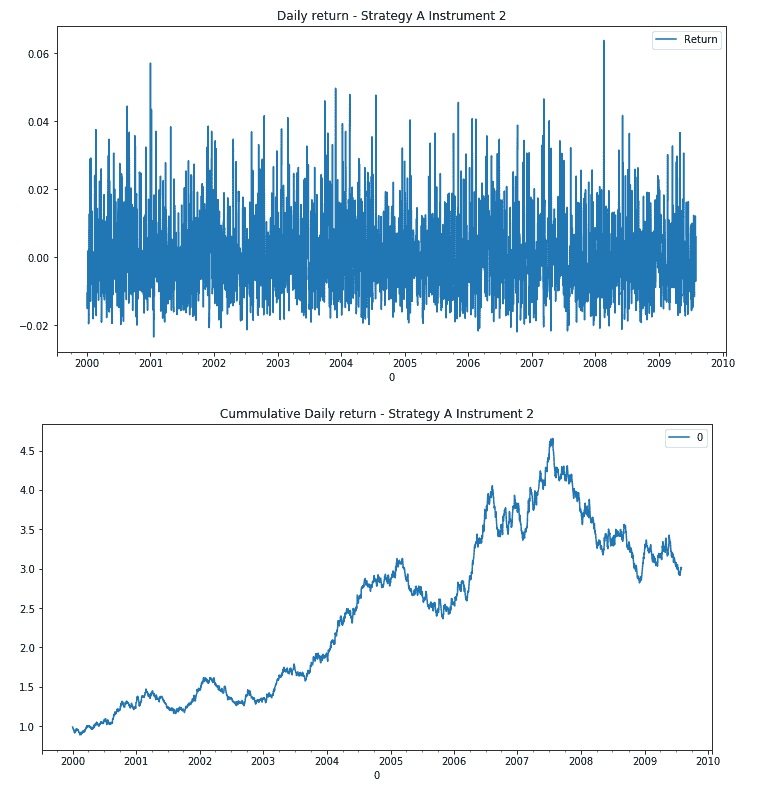

### **策略 A -趋势跟踪系统-仪器 3**

在这里，我们模拟了趋势跟踪策略的回报，并强制其夏普比率为 1，偏斜度为 1。

虽然它与前一个具有相同的特征，但波动性不同，并允许我们评估其在投资组合中的贡献。

在[ ]:

```
StrategyA3_SR1_SKW1_returns = pd.read_csv('StrategyA3_SR1_SKW1.csv', header=None, parse_dates=True, index_col=0)
StrategyA3_SR1_SKW1_returns.columns=['Return']

#print(Strategy_A_Instrument_1_returns.head())
StrategyA3_SR1_SKW1_returns.plot(title = 'Daily return - Strategy A Instrument 3', figsize=(12, 6))

cum_datalist=[1+x for x in StrategyA3_SR1_SKW1_returns['Return']]
cum_datalist=pd.DataFrame(cum_datalist, index=StrategyA3_SR1_SKW1_returns.index)
cum_datalist.cumprod().plot(title = 'Cummulative Daily return - Strategy A Instrument 3', figsize=(12, 6))

```

Out[ ]:

```
<matplotlib.axes._subplots.AxesSubplot at 0x1318d02b0>

```

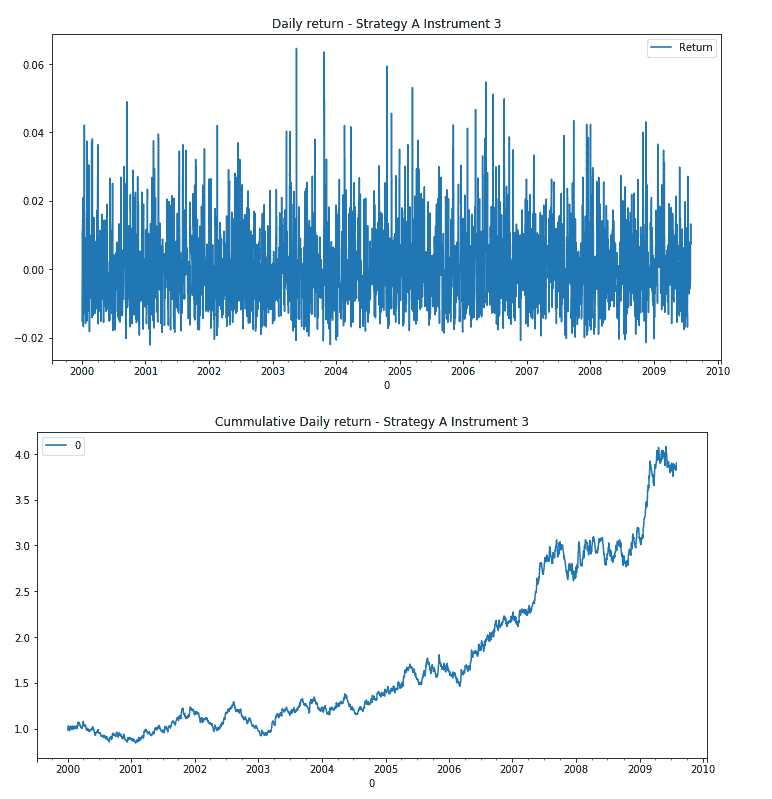

### **策略 B -均值回归系统-工具 1**

这里，我们模拟了均值回归策略的回报，并强制其夏普比率为 0.5，偏斜度为-1。

在[ ]:

```
StrategyB1_SR05_SKWn1_returns = pd.read_csv('StrategyB1_SR0.5_SKW-1.csv', header=None, parse_dates=True, index_col=0)
StrategyB1_SR05_SKWn1_returns.columns=['Return']

#print(Strategy_A_Instrument_1_returns.head())
StrategyB1_SR05_SKWn1_returns.plot(title = 'Daily return - Strategy B Instrument 1', figsize=(12, 6))

cum_datalist=[1+x for x in StrategyB1_SR05_SKWn1_returns['Return']]
cum_datalist=pd.DataFrame(cum_datalist, index=StrategyB1_SR05_SKWn1_returns.index)
cum_datalist.cumprod().plot(title = 'Cummulative Daily return - Strategy B Instrument 1', figsize=(12, 6))

```

Out[ ]:

```
<matplotlib.axes._subplots.AxesSubplot at 0x1325b1780>
```

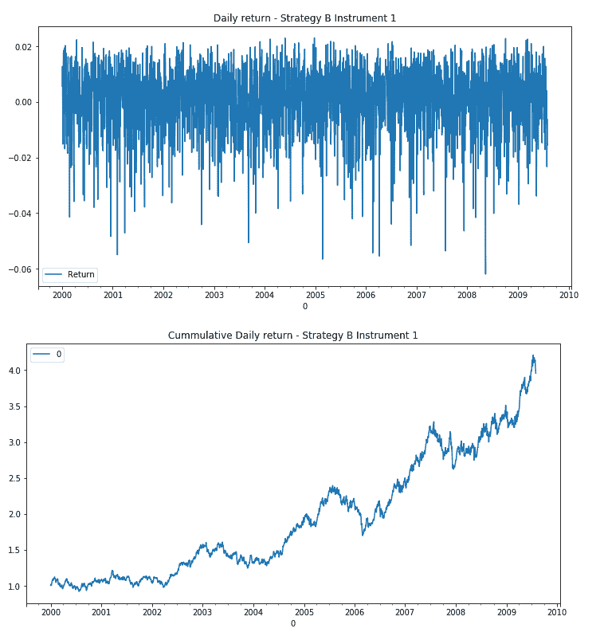

### **策略 B -均值回归系统-工具 2**

这里，我们模拟了均值回归策略的回报，并强制其夏普比率为 1，偏斜度为-1。

在[ ]:

```
StrategyB2_SR1_SKWn1_returns = pd.read_csv('StrategyB2_SR1_SKW-1.csv', header=None, parse_dates=True, index_col=0)
StrategyB2_SR1_SKWn1_returns.columns=['Return']

#print(Strategy_A_Instrument_1_returns.head())
StrategyB2_SR1_SKWn1_returns.plot(title = 'Daily return - Strategy B Instrument 2', figsize=(12, 6))

cum_datalist=[1+x for x in StrategyB2_SR1_SKWn1_returns['Return']]
cum_datalist=pd.DataFrame(cum_datalist, index=StrategyB2_SR1_SKWn1_returns.index)
cum_datalist.cumprod().plot(title = 'Cummulative Daily return - Strategy B Instrument 2', figsize=(12, 6))
```

Out[ ]:

```
<matplotlib.axes._subplots.AxesSubplot at 0x13219eeb8>
```

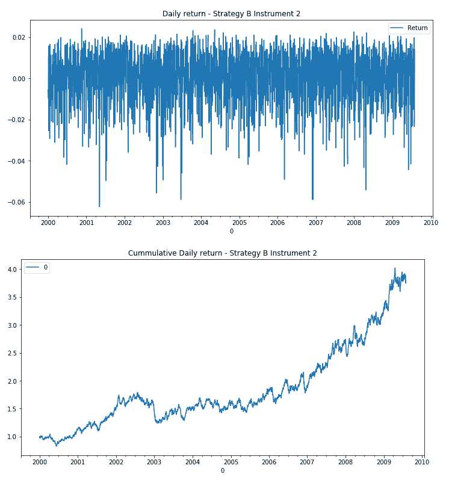

### **包含策略 A 和 B - 5 工具的投资组合**

为了便于分析，我们创建了一个包含所有回报的数据框架。

在[ ]:

```
Strategies_A_B = pd.concat([StrategyA1_SR05_SKW1_returns, StrategyA2_SR1_SKW1_returns, StrategyA3_SR1_SKW1_returns, StrategyB1_SR05_SKWn1_returns, StrategyB2_SR1_SKWn1_returns], axis=1, ignore_index=False)
Strategies_A_B.columns=['StratA1', 'StratA2', 'StratA3', 'StratB1', 'StratB2']
Strategies_A_B.cumsum().plot(title = 'Daily returns', figsize=(12, 6))
```

Out[ ]:

```
<matplotlib.axes._subplots.AxesSubplot at 0x12de894e0>

```

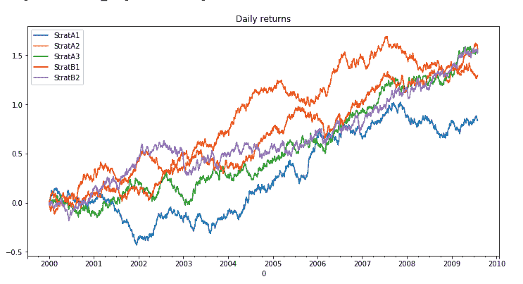

在[ ]

```
Strategies_A_B.plot(title="Strategies Returns", figsize=(12,10),subplots=True)
```

Out[ ]:

```
array([<matplotlib.axes._subplots.AxesSubplot object at 0x134f15860>,
       <matplotlib.axes._subplots.AxesSubplot object at 0x134f74d68>,
       <matplotlib.axes._subplots.AxesSubplot object at 0x137d51d30>,
       <matplotlib.axes._subplots.AxesSubplot object at 0x137d8dcc0>,
       <matplotlib.axes._subplots.AxesSubplot object at 0x137dc7ba8>],
      dtype=object)
```

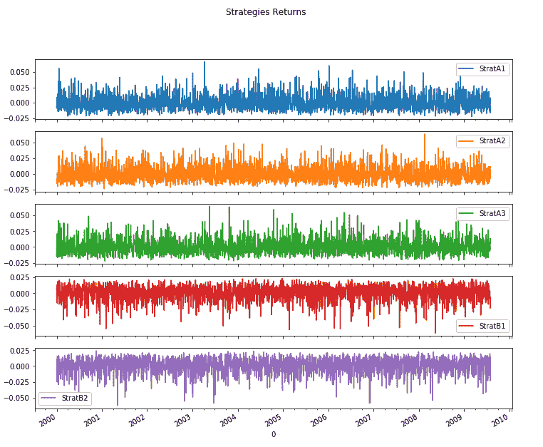

### **具有策略 A - 3 工具的投资组合**

为了便于分析，我们创建了一个包含所有策略 A 返回结果的数据框架。

在[ ]:

```
Strategy_A = pd.concat([StrategyA1_SR05_SKW1_returns, StrategyA2_SR1_SKW1_returns, StrategyA3_SR1_SKW1_returns], axis=1, ignore_index=False)
Strategy_A.columns=['StratA1', 'StratA2', 'StratA3']
Strategy_A.cumsum().plot(title = 'Strategy A Daily returns', figsize=(12, 6))
```

Out[ ]:

```
<matplotlib.axes._subplots.AxesSubplot at 0x131a4ea90>

```

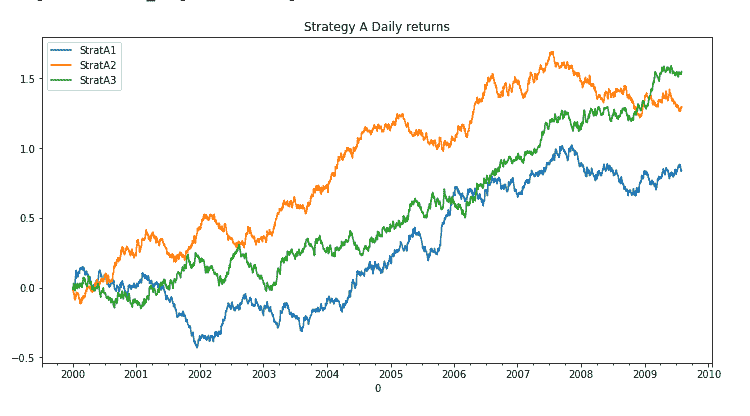

在[ ]

```
Strategy_A.plot(title="Strategy A Returns", figsize=(12,10),subplots=True)
```

Out[ ]:

```
array([<matplotlib.axes._subplots.AxesSubplot object at 0x13223be10>,
       <matplotlib.axes._subplots.AxesSubplot object at 0x131b00128>,
       <matplotlib.axes._subplots.AxesSubplot object at 0x12ee19588>],
      dtype=object)
```


### **策略 B - 2 工具组合**

为了便于分析，我们创建了一个包含所有策略 B 收益的数据框架。

在[ ]:

```
Strategy_B = pd.concat([StrategyB1_SR05_SKWn1_returns, StrategyB2_SR1_SKWn1_returns], axis=1, ignore_index=False)
Strategy_B.columns=['StratB1', 'StratB2']
Strategy_B.cumsum().plot(title = 'Strategy B Daily returns', figsize=(12, 6))
```

Out[ ]:

```
<matplotlib.axes._subplots.AxesSubplot at 0x1309550b8>
```


在[ ]:

```
Strategy_B.plot(title="Strategy B Returns", figsize=(12,10),subplots=True)
```

Out[ ]:

```
array([<matplotlib.axes._subplots.AxesSubplot object at 0x135338e80>,
       <matplotlib.axes._subplots.AxesSubplot object at 0x12dcb9ac8>],
      dtype=object)
```

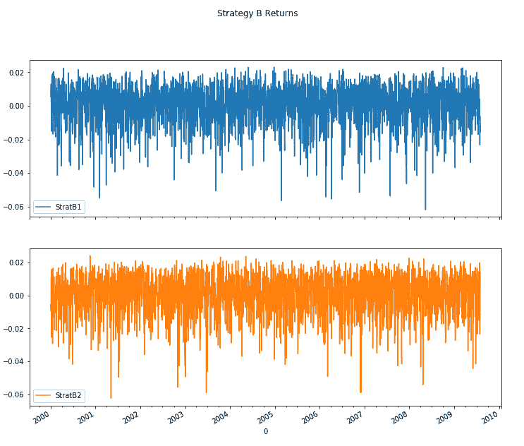

个别表征收益的一些基本函数。

在[ ]:

```
Strategies_A_B.describe()
```

Out[ ]:

|  | 

战略 1

 | 

StratA2

 | 

战略 3

 | 

战略 1

 | 

StratB2

 |
| --- | --- | --- | --- | --- | --- |
| 

数数

 | 2500.000000 | 2500.000000 | 2500.000000 | 2500.000000 | 2500.000000 |
| 

意思是

 | 0.000336 | 0.000518 | 0.000619 | 0.000625 | 0.000613 |
| 

标准

 | 0.012382 | 0.012449 | 0.012265 | 0.012167 | 0.012487 |
| 

部

 | -0.022628 | -0.023483 | -0.022159 | -0.061927 | -0.062419 |
| 

25%

 | -0.008736 | -0.008848 | -0.008323 | -0.006073 | -0.006649 |
| 

50%

 | -0.001367 | -0.001429 | -0.001100 | 0.002460 | 0.002505 |
| 

75%

 | 0.007027 | 0.007482 | 0.007427 | 0.009481 | 0.009931 |
| 

最大

 | 0.066684 | 0.063726 | 0.064527 | 0.023033 | 0.024209 |

### 回报分布

在[ ]:

```
Strategies_A_B.kurtosis()
```

Out[ ]:

```
StratA1    1.457507
StratA2    0.905275
StratA3    1.603533
StratB1    1.689942
StratB2    1.401474
dtype: float64
```

在[ ]:

```
Strategies_A_B.skew()
```

Out[ ]:

```
StratA1    0.975777
StratA2    0.871351
StratA3    1.008925
StratB1   -1.017681
StratB2   -0.960106
dtype: float64
```

在这里我们可以看到我们手中每一个策略的收益分布。

在[ ]:

```
Strategies_A_B.plot(kind="hist", bins=50, subplots=True, figsize=(16,10))
```

Out[ ]:

```
array([<matplotlib.axes._subplots.AxesSubplot object at 0x13119f9e8>,
       <matplotlib.axes._subplots.AxesSubplot object at 0x12de7d278>,
       <matplotlib.axes._subplots.AxesSubplot object at 0x133b6e748>,
       <matplotlib.axes._subplots.AxesSubplot object at 0x12e7c9dd8>,
       <matplotlib.axes._subplots.AxesSubplot object at 0x130478cf8>],
      dtype=object)

```

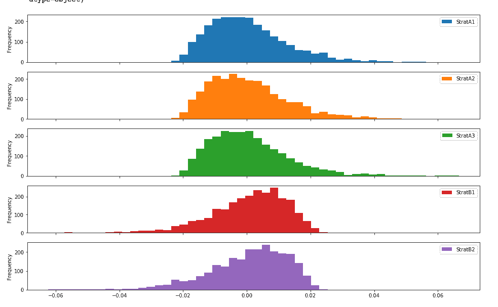

正如我们之前所评论的，相关性对于了解资产或策略回报何时与未来运气密切相关至关重要。要从多样化中获益，相关性必须是“低”的。

我们可以计算出策略收益与整个序列的相关性

在[ ]:

```
corr = Strategies_A_B.corr()
corr
```

Out[ ]:

|  | 

战略 1

 | 

StratA2

 | 

战略 3

 | 

战略 1

 | 

StratB2

 |
| --- | --- | --- | --- | --- | --- |
| 

战略 1

 | 1.000000 | 0.002856 | -0.025571 | 0.030596 | -0.002940 |
| 

StratA2

 | 0.002856 | 1.000000 | 0.035310 | -0.025093 | 0.020062 |
| 

战略 3

 | -0.025571 | 0.035310 | 1.000000 | 0.026725 | 0.020929 |
| 

战略 1

 | 0.030596 | -0.025093 | 0.026725 | 1.000000 | -0.011878 |
| 

StratB2

 | -0.002940 | 0.020062 | 0.020929 | -0.011878 | 1.000000 |

或者根据我们投资的时间范围来分析相关性

在[ ]:

```
corr = Strategies_A_B[-60:].corr()
corr
```

Out[ ]:

|  | 

战略 1

 | 

StratA2

 | 

战略 3

 | 

战略 1

 | 

StratB2

 |
| --- | --- | --- | --- | --- | --- |
| 

战略 1

 | 1.000000 | -0.251070 | -0.068042 | 0.199785 | 0.128537 |
| 

StratA2

 | -0.251070 | 1.000000 | -0.038942 | -0.086718 | -0.033532 |
| 

战略 3

 | -0.068042 | -0.038942 | 1.000000 | -0.091949 | 0.063135 |
| 

战略 1

 | 0.199785 | -0.086718 | -0.091949 | 1.000000 | -0.267339 |
| 

StratB2

 | 0.128537 | -0.033532 | 0.063135 | -0.267339 | 1.000000 |

上述分析为我们提供了在给定时间和给定范围内的快照，但事实是相关性会随着时间而变化，了解这一点可以让我们做出更好的估计。

例如，如果我们考虑一年，我们可以看到相关性是不同的:

在[ ]:

```
Strategies_A_B['StratA1'].rolling(252).corr(Strategies_A_B['StratA2']).plot()
```

Out[ ]:

```
<matplotlib.axes._subplots.AxesSubplot at 0x13238bbe0>
```

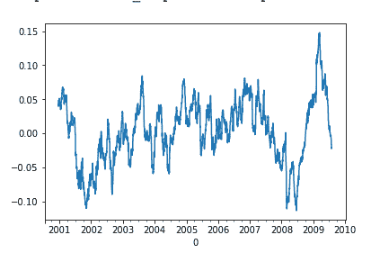

一个季度的相关性大于年度相关性。
在[ ]:

```
Strategies_A_B['StratA1'].rolling(60).corr(Strategies_A_B['StratA2']).plot()
```

Out[ ]:

```
<matplotlib.axes._subplots.AxesSubplot at 0x131861198>
```


如果我们将时间跨度缩短到两周，我们会发现相关性相当高。因此，我们看到相关性与分析视野密切相关。

在[ ]:

```
Strategies_A_B['StratA1'].rolling(10).corr(Strategies_A_B['StratA2']).plot()
```

Out[ ]:

```
<matplotlib.axes._subplots.AxesSubplot at 0x133fba3c8>
```

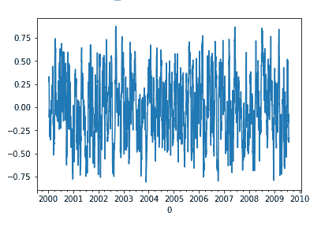

虽然从逻辑上来说，所有的性能指标都可以手工计算，但值得一提的是 **pyfolio 库**为我们提供了关于我们战略性能的大量信息。

在[ ]:

```
pf.tears.create_returns_tear_sheet(pd.Series(Strategies_A_B['StratA1']))
```

| 

开始日期

 | 2000-01-03 |
| --- | --- |
| 

结束日期

 | 2009-07-31 |
| --- | --- |
| 

总月数

 | One hundred and nineteen |
| --- | --- |
|  | 

回溯测试

 |
| --- | --- |
| 

岁入

 | 6.8% |
| 

累积回报

 | 91.5% |
| 

年度波动性

 | 19.7% |
| 

夏普比率

 | Zero point four three |
| 

卡尔马尔比率

 | Zero point one five |
| 

稳定性

 | Zero point six eight |
| 

最大压降

 | -46.0% |
| 

欧米伽比率

 | One point zero seven |
| 

Sortino 比率

 | Zero point seven two |
| 

斜交

 | Zero point nine eight |
| 

峭度

 | One point four five |
| 

尾部比率

 | One point four four |
| 

每日风险值

 | -2.4% |

| 

最差提款期

 | 

净提款百分比

 | 

高峰日期

 | 

谷日期

 | 

恢复日期

 | 

持续时间

 |
| --- | --- | --- | --- | --- | --- |
| 

Zero

 | Forty-five point nine nine | 2000-02-25 | 2001-12-17 | 2005-01-21 | One thousand two hundred and eighty-one |
| 

one

 | Thirty-one point eight five | 2007-11-08 | 2008-11-07 | 精灵 | 圆盘烤饼 |
| 

Two

 | Twenty-one point four eight | 2005-05-20 | 2005-08-04 | 2005-10-21 | One hundred and eleven |
| 

three

 | Fourteen point eight one | 2006-08-04 | 2007-01-02 | 2007-03-19 | One hundred and sixty-two |
| 

four

 | Thirteen point six seven | 2006-01-09 | 2006-06-19 | 2006-07-17 | One hundred and thirty-six |

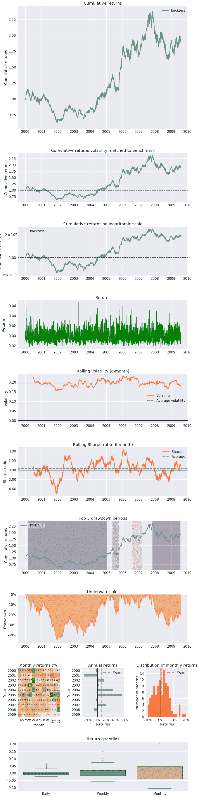

要了解报告中的信息，可以在本帖中阅读更多:[性能&风险度量优化](/performance-metrics-risk-metrics-optimization/)

如你所想，我们正在处理的问题是知道如何在通过强制性稳健回溯测试的每个投资组合策略之间分配可用资本。

要知道自己做得好不好，我们需要一个可以和自己比较的东西，基准，它必须有和我们要比较的东西相似的特征。

例如，趋势跟踪系统应该与购买和持有相同资产的投资组合的策略相比较。

在这里，我们将创建一个投资组合，其权重对于每种工具都是相同的，而不是区分策略类型。它作为比较我们将要测试的砝码平衡的基础。

在[ ]:

```
portfolio_total_return = np.sum([0.2, 0.2, 0.2, 0.2, 0.2] * Strategies_A_B, axis=1)
```

一旦计算出平均分布的投资组合的总回报，我们就生成业绩报告。

在[ ]:

```
pf.tears.create_returns_tear_sheet(pd.Series(portfolio_total_return))
```

| 

开始日期

 | 2000-01-03 |
| --- | --- |
| 

结束日期

 | 2009-07-31 |
| --- | --- |
| 

总月数

 | One hundred and nineteen |
| --- | --- |
|  | 

回溯测试

 |
| --- | --- |
| 

岁入

 | 14.2% |
| 

累积回报

 | 272.8% |
| 

年度波动性

 | 8.9% |
| 

夏普比率

 | One point five four |
| 

卡尔马尔比率

 | One point three four |
| 

稳定性

 | Zero point nine seven |
| 

最大压降

 | -10.6% |
| 

欧米伽比率

 | One point two eight |
| 

Sortino 比率

 | Two point three nine |
| 

斜交

 | Zero point one |
| 

峭度

 | Zero point zero six |
| 

尾部比率

 | One point one eight |
| 

每日风险值

 | -1.1% |

| 

最差提款期

 | 

净提款百分比

 | 

高峰日期

 | 

谷日期

 | 

恢复日期

 | 

持续时间

 |
| --- | --- | --- | --- | --- | --- |
| 

Zero

 | Ten point five six | 2002-09-23 | 2003-02-19 | 2003-04-17 | One hundred and forty-nine |
| 

one

 | Nine point three nine | 2006-01-18 | 2006-03-07 | 2006-04-05 | fifty-six |
| 

Two

 | Nine point one three | 2001-03-26 | 2001-08-21 | 2001-12-20 | One hundred and ninety-four |
| 

three

 | Eight point seven nine | 2007-07-25 | 2008-04-24 | 2008-12-25 | Three hundred and seventy-two |
| 

four

 | Seven point four one | 2002-01-23 | 2002-04-19 | 2002-06-06 | Ninety-seven |

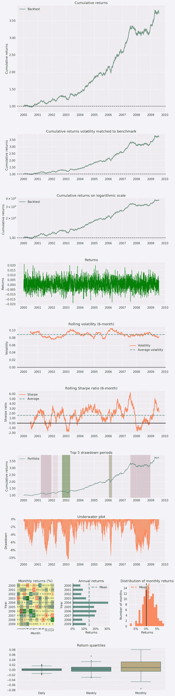

凯利的标准是一种可用的方法来估计我们的投资组合的权重，并以最小的风险最大化所分析的投资组合的利益。

首先，我们得到投资组合中的股票数量。

In [ ]:

```
no_of_stocks = Strategies_A_B.shape[1]
no_of_stocks

```

Out[ ]:

```
5

Compute the variable to get the weights

```

In [ ]:

```
weights = cp.Variable(no_of_stocks)
weights.shape

```

Out[ ]:

```
(5,)
```

投资组合回报基于每日回报乘以每项资产的权重。

In [ ]:

```
portfolio_returns = (np.array(Strategies_A_B)*weights)
portfolio_returns

```

Out[ ]:

```
Expression(AFFINE, UNKNOWN, (2500,))
```

### 凯利标准

最终的投资组合价值或投资组合的效用可以使用每日投资组合回报的对数总和来计算。

In [ ]:

```
final_portfolio_value = cp.sum(cp.log(1+portfolio_returns))
final_portfolio_value

```

Out[ ]:

```
Expression(CONCAVE, UNKNOWN, ())
```

输出告诉我们，final_portfolio_value 是一个表达式，本质上是凹的，其值是未知的

这个例子的目的是最大化凯利标准。为此，您可以创建一个名为“目标”的参数，并为其分配最大化条件。cvxpy 库的最大化函数用于此目的。

In [ ]:

```
objective = cp.Maximize(final_portfolio_value)
objective

```

Out[ ]:

```
Maximize(Expression(CONCAVE, UNKNOWN, ()))
```

输出告诉我们目标是表达式的最大化函数。表达式本质上是凹的，其值是未知的

在你解决目标之前，你需要记住投资组合的权重有一定的限制。

1.  权重应该是正数，因为你正在考虑是否使用一个策略。
2.  权重之和应小于或等于 1，因为您没有考虑杠杆作用。

In [ ]:

```
constraints = [0.0<=weights, cp.sum(weights)==1]
constraints

```

Out[ ]:

```
[Inequality(Constant(CONSTANT, ZERO, ())),
 Equality(Expression(AFFINE, UNKNOWN, ()), Constant(CONSTANT, NONNEGATIVE, ()))]
```

这里的约束指定第一个约束是一个不等式约束，其值是一个常数零。而第二个是值等于恒定非负值的仿射表达式之间的等式约束

现在，您可以结合目标和约束来创建问题陈述。您可以通过使用 cvxpy 库的问题类来实现这一点，如下所示。

In [ ]:

```
problem = cp.Problem(objective, constraints)
problem

```

Out[ ]:

```
Problem(Maximize(Expression(CONCAVE, UNKNOWN, ())), [Inequality(Constant(CONSTANT, ZERO, ())), Equality(Expression(AFFINE, UNKNOWN, ()), Constant(CONSTANT, NONNEGATIVE, ()))])
```

这里的输出描述了整个问题，包括前面描述的所有表达式，都包含在一条语句中

您可以使用问题类的 solve 方法来获得最佳权重组合，如下所示:

In [ ]:

```
# The optimal objective value is returned by `prob.solve()`.
problem.solve()

# The optimal value for w is stored in `w.value`.
print(weights.value)

```

Out[ ]

```
[2.86865963e-12 2.26342494e-11 3.30438909e-01 3.81809412e-01
 2.87751679e-01]

```

根据 Kelly 的标准，这些是最佳权重，因为我们可以看到前两个策略的权重很小，所以我们将其丢弃并简化，我们可以说其余三个策略的权重相似。

In [ ]:

```
portfolio_total_return_kelly = np.sum(weights.value * Strategies_A_B, axis=1)
pf.tears.create_returns_tear_sheet(portfolio_total_return_kelly)

```

| 

开始日期

 | 2000-01-03 |
| --- | --- |
| 

结束日期

 | 2009-07-31 |
| --- | --- |
| 

总月数

 | One hundred and nineteen |
| --- | --- |
|  | 

回溯测试

 |
| --- | --- |
| 

岁入

 | 16.1% |
| 

累积回报

 | 340.7% |
| 

年度波动性

 | 11.5% |
| 

夏普比率

 | One point three six |
| 

卡尔马尔比率

 | Zero point nine six |
| 

稳定性

 | Zero point nine six |
| 

最大压降

 | -16.8% |
| 

欧米伽比率

 | One point two four |
| 

Sortino 比率

 | Two |
| 

斜交

 | -0.20 |
| 

峭度

 | Zero point five three |
| 

尾部比率

 | One point zero five |
| 

每日风险值

 | -1.4% |

| 

最差提款期

 | 

净提款百分比

 | 

高峰日期

 | 

谷日期

 | 

恢复日期

 | 

持续时间

 |
| --- | --- | --- | --- | --- | --- |
| 

Zero

 | Sixteen point eight three | 2005-11-07 | 2006-03-07 | 2006-05-30 | One hundred and forty-seven |
| 

one

 | Thirteen point seven nine | 2002-08-13 | 2003-02-19 | 2003-05-23 | Two hundred and four |
| 

Two

 | Twelve point nine seven | 2000-01-28 | 2000-06-09 | 2001-03-05 | Two hundred and eighty-seven |
| 

three

 | Ten point zero five | 2002-01-23 | 2002-04-19 | 2002-06-17 | One hundred and four |
| 

four

 | Nine point five nine | 2003-09-02 | 2003-10-16 | 2004-05-06 | One hundred and seventy-eight |

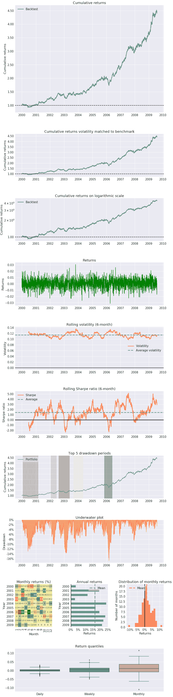

如果我们将其与初始的权重均匀分布的投资组合进行比较，我们看到凯利的优化提高了年化收益率和累计收益率，但相比之下，我们降低了 SR，增加了波动率。

### 凯利策略 A

我们将以个性化的方式对两种策略重复相同的练习，这样我们就想知道我们应该为策略的每一项资产分配什么权重。

在[ ]:

```
no_of_stocks = Strategy_A.shape[1]
no_of_stocks
weights = cp.Variable(no_of_stocks)
weights.shape
(np.array(Strategy_A)*weights)
# Save the portfolio returns in a variable
portfolio_returns = (np.array(Strategy_A)*weights)
portfolio_returns
final_portfolio_value = cp.sum(cp.log(1+portfolio_returns))
final_portfolio_value
objective = cp.Maximize(final_portfolio_value)
objective
constraints = [0.0<=weights, cp.sum(weights)==1]
constraints
problem = cp.Problem(objective, constraints)
problem
# The optimal objective value is returned by `prob.solve()`.
problem.solve()

# The optimal value for w is stored in `w.value`.
print(weights.value)

kelly_portfolio_returnsA = ((Strategy_A)*(weights.value)).sum(axis=1)
kelly_portfolio_returnsA.head()
kelly_portfolio_value = (1+(kelly_portfolio_returnsA)).cumprod()
kelly_portfolio_value.head()
kelly_annualized_returnsA = (
    (kelly_portfolio_value[-1])**(252/len(Strategy_A)))-1

# Print the annualized returns of the Kelly portfolio
kelly_annualized_returnsA

portfolio_total_return_kellyA = np.sum(weights.value * Strategy_A, axis=1)
pf.tears.create_returns_tear_sheet(portfolio_total_return_kellyA)

portfolio_total_return_equal = np.sum([0.2, 0.2, 0.2] * Strategy_A, axis=1)
pf.tears.create_returns_tear_sheet(portfolio_total_return_equal)
```

Out[ ]

```
[9.01444775e-12 1.44402270e-01 8.55597730e-01]
```

| 

开始日期

 | 2000-01-03 |
| --- | --- |
| 

结束日期

 | 2009-07-31 |
| --- | --- |
| 

总月数

 | One hundred and nineteen |
| --- | --- |
|  | 

回溯测试

 |
| --- | --- |
| 

岁入

 | 14.8% |
| 

累积回报

 | 293.1% |
| 

年度波动性

 | 17.0% |
| 

夏普比率

 | Zero point nine |
| 

卡尔马尔比率

 | Zero point five eight |
| 

稳定性

 | Zero point nine four |
| 

最大压降

 | -25.4% |
| 

欧米伽比率

 | One point one six |
| 

Sortino 比率

 | One point five five |
| 

斜交

 | Zero point nine eight |
| 

峭度

 | One point five four |
| 

尾部比率

 | One point five |
| 

每日风险值

 | -2.1% |

| 

最差提款期

 | 

净提款百分比

 | 

高峰日期

 | 

谷日期

 | 

恢复日期

 | 

持续时间

 |
| --- | --- | --- | --- | --- | --- |
| 

Zero

 | Twenty-five point three six | 2002-08-13 | 2003-01-17 | 2003-08-26 | Two hundred and seventy-one |
| 

one

 | Seventeen point one six | 2001-12-12 | 2002-04-22 | 2002-08-01 | One hundred and sixty-seven |
| 

Two

 | Sixteen point five six | 2000-03-31 | 2000-08-29 | 2001-06-07 | Three hundred and ten |
| 

three

 | Fifteen point four five | 2005-11-07 | 2006-03-06 | 2006-05-08 | One hundred and thirty-one |
| 

four

 | Thirteen point two | 2004-05-13 | 2004-07-16 | 2004-10-19 | One hundred and fourteen |

| 

开始日期

 | 2000-01-03 |
| --- | --- |
| 

结束日期

 | 2009-07-31 |
| --- | --- |
| 

总月数

 | One hundred and nineteen |
| --- | --- |
|  | 

回溯测试

 |
| --- | --- |
| 

岁入

 | 7.5% |
| 

累积回报

 | 104.1% |
| 

年度波动性

 | 6.8% |
| 

夏普比率

 | One point zero nine |
| 

卡尔马尔比率

 | Zero point five seven |
| 

稳定性

 | Zero point nine three |
| 

最大压降

 | -13.1% |
| 

欧米伽比率

 | One point one nine |
| 

Sortino 比率

 | One point seven eight |
| 

斜交

 | Zero point five eight |
| 

峭度

 | Zero point five one |
| 

尾部比率

 | One point three |
| 

每日风险值

 | -0.8% |

| 

最差提款期

 | 

净提款百分比

 | 

高峰日期

 | 

谷日期

 | 

恢复日期

 | 

持续时间

 |
| --- | --- | --- | --- | --- | --- |
| 

Zero

 | Thirteen point zero nine | 2007-09-13 | 2008-11-11 | 精灵 | 圆盘烤饼 |
| 

one

 | Seven point seven one | 2002-09-23 | 2003-02-19 | 2003-04-17 | One hundred and forty-nine |
| 

Two

 | Seven point four eight | 2001-03-28 | 2001-08-21 | 2002-08-13 | Three hundred and sixty |
| 

three

 | Seven point three six | 2005-05-23 | 2005-08-04 | 2005-11-04 | One hundred and twenty |
| 

four

 | Four point seven two | 2003-05-20 | 2003-08-05 | 2003-09-30 | Ninety-six |


我们再次观察到与完整投资组合相同的情况，通过凯利的优化，我们增加了回报，但相比之下，我们降低了 SR，增加了波动性。

### 凯利策略 B

策略 B 中的资产也是如此

在[ ]:

```
no_of_stocks = Strategy_B.shape[1]
no_of_stocks
weights = cp.Variable(no_of_stocks)
weights.shape
(np.array(Strategy_B)*weights)
# Save the portfolio returns in a variable
portfolio_returns = (np.array(Strategy_B)*weights)
portfolio_returns
final_portfolio_value = cp.sum(cp.log(1+portfolio_returns))
final_portfolio_value
objective = cp.Maximize(final_portfolio_value)
objective
constraints = [0.0<=weights, cp.sum(weights)==1]
constraints
problem = cp.Problem(objective, constraints)
problem
# The optimal objective value is returned by `prob.solve()`.
problem.solve()

# The optimal value for w is stored in `w.value`.
print(weights.value)

kelly_portfolio_returnsB = ((Strategy_B)*(weights.value)).sum(axis=1)
kelly_portfolio_returnsB.head()
kelly_portfolio_value = (1+(kelly_portfolio_returnsB)).cumprod()
kelly_portfolio_value.head()
kelly_annualized_returnsB = (
    (kelly_portfolio_value[-1])**(252/len(Strategy_B)))-1

# Print the annualized returns of the Kelly portfolio
kelly_annualized_returnsB

portfolio_total_return_kellyB = np.sum(weights.value * Strategy_B, axis=1)
pf.tears.create_returns_tear_sheet(portfolio_total_return_kellyB)

portfolio_total_return_equal = np.sum([0.2, 0.2] * Strategy_B, axis=1)
pf.tears.create_returns_tear_sheet(portfolio_total_return_equal)
```

Out[ ]:

```
[0.55188147 0.44811853]
```

| 

开始日期

 | 2000-01-03 |
| --- | --- |
| 

结束日期

 | 2009-07-31 |
| --- | --- |
| 

总月数

 | One hundred and nineteen |
| --- | --- |
|  | 

回溯测试

 |
| --- | --- |
| 

岁入

 | 15.8% |
| 

累积回报

 | 327.8% |
| 

年度波动性

 | 13.8% |
| 

夏普比率

 | One point one three |
| 

卡尔马尔比率

 | Zero point eight seven |
| 

稳定性

 | Zero point nine six |
| 

最大压降

 | -18.2% |
| 

欧米伽比率

 | One point two |
| 

Sortino 比率

 | One point five five |
| 

斜交

 | -0.68 |
| 

峭度

 | Zero point six eight |
| 

尾部比率

 | Zero point eight four |
| 

每日风险值

 | -1.7% |

| 

最差提款期

 | 

净提款百分比

 | 

高峰日期

 | 

谷日期

 | 

恢复日期

 | 

持续时间

 |
| --- | --- | --- | --- | --- | --- |
| 

Zero

 | Eighteen point one seven | 2005-12-27 | 2006-03-07 | 2006-06-09 | One hundred and nineteen |
| 

one

 | Sixteen point one three | 2002-12-18 | 2003-10-14 | 2004-08-03 | Four hundred and twenty-five |
| 

Two

 | Fourteen point seven six | 2000-01-28 | 2000-06-09 | 2000-11-16 | Two hundred and ten |
| 

three

 | Eleven point zero seven | 2002-01-29 | 2002-04-01 | 2002-05-15 | Seventy-seven |
| 

four

 | Ten point one five | 2006-11-08 | 2006-12-13 | 2007-01-25 | Fifty-seven |

| 

开始日期

 | 2000-01-03 |
| --- | --- |
| 

结束日期

 | 2009-07-31 |
| --- | --- |
| 

总月数

 | One hundred and nineteen |
| --- | --- |
|  | 

回溯测试

 |
| --- | --- |
| 

岁入

 | 6.3% |
| 

累积回报

 | 82.9% |
| 

年度波动性

 | 5.5% |
| 

夏普比率

 | One point one three |
| 

卡尔马尔比率

 | Zero point eight four |
| 

稳定性

 | Zero point nine six |
| 

最大压降

 | -7.5% |
| 

欧米伽比率

 | One point two |
| 

Sortino 比率

 | One point five five |
| 

斜交

 | -0.67 |
| 

峭度

 | Zero point six one |
| 

尾部比率

 | Zero point eight five |
| 

每日风险值

 | -0.7% |

| 

最差提款期

 | 

净提款百分比

 | 

高峰日期

 | 

谷日期

 | 

恢复日期

 | 

持续时间

 |
| --- | --- | --- | --- | --- | --- |
| 

Zero

 | Seven point four six | 2005-12-27 | 2006-03-07 | 2006-05-31 | One hundred and twelve |
| 

one

 | Six point seven four | 2002-12-18 | 2003-10-14 | 2004-05-27 | Three hundred and seventy-seven |
| 

Two

 | Six point two one | 2000-01-28 | 2000-06-09 | 2000-11-16 | Two hundred and ten |
| 

three

 | Four point five six | 2002-01-29 | 2002-04-01 | 2002-05-15 | Seventy-seven |
| 

four

 | Four point three nine | 2006-11-08 | 2006-12-13 | 2007-01-25 | Fifty-seven |

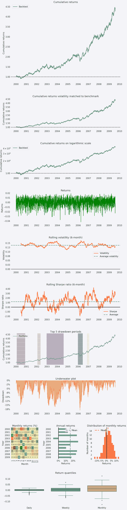

我们再次观察到与完整投资组合相同的情况，通过凯利的优化，我们增加了回报，但相比之下，我们降低了 SR，增加了波动性。

### 凯利策略 A & B

现在，我们已经分别为每个策略优化了权重，我们将优化分配给每个策略的权重。

在[ ]:

```
kelly_portfolio_returnsA_=kelly_portfolio_returnsA.to_frame()
kelly_portfolio_returnsB_=kelly_portfolio_returnsB.to_frame()
Kelly_Strat_A_B = pd.concat([kelly_portfolio_returnsA_, kelly_portfolio_returnsB_], axis=1, ignore_index=False)

no_of_stocks = Kelly_Strat_A_B.shape[1]
no_of_stocks
weights = cp.Variable(no_of_stocks)
weights.shape
(np.array(Kelly_Strat_A_B)*weights)
# Save the portfolio returns in a variable
portfolio_returns = (np.array(Kelly_Strat_A_B)*weights)
portfolio_returns
final_portfolio_value = cp.sum(cp.log(1+portfolio_returns))
final_portfolio_value
objective = cp.Maximize(final_portfolio_value)
objective
constraints = [0.0<=weights, cp.sum(weights)==1]
constraints
problem = cp.Problem(objective, constraints)
problem
# The optimal objective value is returned by `prob.solve()`.
problem.solve()

# The optimal value for w is stored in `w.value`.
print(weights.value)

kelly_portfolio_returnsAB = ((Kelly_Strat_A_B)*(weights.value)).sum(axis=1)
kelly_portfolio_returnsAB.head()
kelly_portfolio_value = (1+(kelly_portfolio_returnsAB)).cumprod()
kelly_portfolio_value.head()
kelly_annualized_returnsAB = (
    (kelly_portfolio_value[-1])**(252/len(Kelly_Strat_A_B)))-1

# Print the annualized returns of the Kelly portfolio
kelly_annualized_returnsB

portfolio_total_return_kellyAB = np.sum(weights.value * Kelly_Strat_A_B, axis=1)
pf.tears.create_returns_tear_sheet(portfolio_total_return_kellyAB)

portfolio_total_return_equal = np.sum([0.2, 0.2] * Kelly_Strat_A_B, axis=1)
pf.tears.create_returns_tear_sheet(portfolio_total_return_equal)
```

Out[ ]:

```
[0.31516003 0.68483997]
```

| 

开始日期

 | 2000-01-03 |
| --- | --- |
| 

结束日期

 | 2009-07-31 |
| --- | --- |
| 

总月数

 | One hundred and nineteen |
| --- | --- |
|  | 

回溯测试

 |
| --- | --- |
| 

岁入

 | 16.0% |
| 

累积回报

 | 337.7% |
| 

年度波动性

 | 11.0% |
| 

夏普比率

 | One point four one |
| 

卡尔马尔比率

 | One point zero three |
| 

稳定性

 | Zero point nine seven |
| 

最大压降

 | -15.6% |
| 

欧米伽比率

 | One point two five |
| 

Sortino 比率

 | Two point zero four |
| 

斜交

 | -0.32 |
| 

峭度

 | Zero point four nine |
| 

尾部比率

 | One |
| 

每日风险值

 | -1.3% |

| 

最差提款期

 | 

净提款百分比

 | 

高峰日期

 | 

谷日期

 | 

恢复日期

 | 

持续时间

 |
| --- | --- | --- | --- | --- | --- |
| 

Zero

 | Fifteen point six four | 2005-11-07 | 2006-03-07 | 2006-05-24 | One hundred and forty-three |
| 

one

 | Twelve point three six | 2000-01-28 | 2000-06-09 | 2000-12-25 | Two hundred and thirty-seven |
| 

Two

 | Twelve point three four | 2002-08-13 | 2003-02-19 | 2003-04-21 | one hundred and eighty  |
| 

three

 | Nine point seven six | 2002-01-23 | 2002-04-01 | 2002-06-18 | One hundred and five |
| 

four

 | Eight point seven six | 2003-09-02 | 2003-10-16 | 2004-03-05 | One hundred and thirty-four |

| 

开始日期

 | 2000-01-03 |
| --- | --- |
| 

结束日期

 | 2009-07-31 |
| --- | --- |
| 

总月数

 | One hundred and nineteen |
| --- | --- |
|  | 

回溯测试

 |
| --- | --- |
| 

岁入

 | 6.3% |
| 

累积回报

 | 82.6% |
| 

年度波动性

 | 4.4% |
| 

夏普比率

 | One point three nine |
| 

卡尔马尔比率

 | Zero point nine six |
| 

稳定性

 | Zero point nine seven |
| 

最大压降

 | -6.5% |
| 

欧米伽比率

 | One point two five |
| 

Sortino 比率

 | Two point one nine |
| 

斜交

 | Zero point two nine |
| 

峭度

 | Zero point six six |
| 

尾部比率

 | One point two |
| 

每日风险值

 | -0.5% |

| 

最差提款期

 | 

净提款百分比

 | 

高峰日期

 | 

谷日期

 | 

恢复日期

 | 

持续时间

 |
| --- | --- | --- | --- | --- | --- |
| 

Zero

 | Six point five five | 2002-08-13 | 2003-02-19 | 2003-05-19 | Two hundred |
| 

one

 | Six point four three | 2005-11-07 | 2006-03-07 | 2006-05-11 | One hundred and thirty-four |
| 

Two

 | Four point five seven | 2002-01-23 | 2002-04-19 | 2002-06-26 | One hundred and eleven |
| 

three

 | Four point four nine | 2000-01-28 | 2000-06-09 | 2001-03-01 | Two hundred and eighty-five |
| 

four

 | Three point five seven | 2007-09-07 | 2007-12-17 | 2008-02-28 | One hundred and twenty-five |

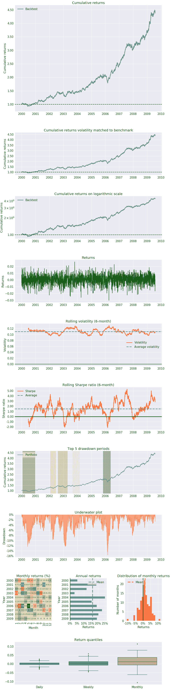

因此，我们现在有两个策略和几个工具，我们已经为每个策略单独优化了工具的权重。

我们对优化策略的每个投资组合的回报重新应用了优化方法，得出了投资组合的最终权重。

我们可以在表格中看得更清楚。

*   根据上次优化按策略类型划分的资本。
*   分配给每个策略的资本除以最优权重。​​​​​​​

我们可以用 Markowitz 提出的有效边界重复同样的练习。他的方法基于在给定均值、标准差和相关性的情况下，最大化投资组合的夏普比率。然而，由于该方法假设每种策略的波动性和回报相同，因此它提供的权重比凯利的更极端。

阅读下面的帖子和网络研讨会，获得完整的解释

在[ ]:

```
# from https://plotly.com/python/v3/ipython-notebooks/markowitz-portfolio-optimization/
def rand_weights(n):
    ''' Produces n random weights that sum to 1 '''
    k = np.random.rand(n)
    return k / sum(k)

def random_portfolio(returns):
    '''
    Returns the mean and standard deviation of returns for a random portfolio , annualized
    '''

    p = np.asmatrix(np.mean(returns, axis=1)) * 252
    w = np.asmatrix(rand_weights(returns.shape[0]))
    C = np.asmatrix(np.cov(returns)) * 252

    mu = w * p.T
    sigma = np.sqrt(w * C * w.T)

    # This recursion reduces outliers to keep plots pretty
    if sigma > 2*252:
        return random_portfolio(returns)
    return mu, sigma
```

在[ ]:

```
return_vec = Strategies_A_B.dropna().values.T
return_vec
```

在[ ]:

```
n_portfolios = 10000
means, stds = np.column_stack([
    random_portfolio(return_vec)
    for _ in range(n_portfolios)
])
```

在[ ]:

```
plt.figure(figsize=(16, 10))
plt.plot(stds, means, 'o', markersize=5)
plt.xlabel('std')
plt.ylabel('mean')
plt.title('Mean and standard deviation of returns of random Strategy generated portfolios')
```

在[ ]:

```
# Turn off progress printing
solvers.options['show_progress'] = False

def optimal_portfolio(returns):
    n = len(returns)
    returns = np.asmatrix(returns)

    N = 10000
    mus = [10**(5.0 * t/N - 1.0) for t in range(N)]

    # Convert to cvxopt matrices
    S = opt.matrix(np.asmatrix(np.cov(returns)*252))
    pbar = opt.matrix(np.asmatrix(np.mean(returns, axis=1)*252))

    # Create constraint matrices
    G = -opt.matrix(np.eye(n))   # negative n x n identity matrix
    h = opt.matrix(0.0, (n ,1))
    A = opt.matrix(1.0, (1, n))
    b = opt.matrix(1.0)

    # Calculate efficient frontier weights using quadratic programming
    portfolios = [solvers.qp(mu*S, -pbar, G, h, A, b)['x']
                  for mu in mus]
    ## CALCULATE RISKS AND RETURNS FOR FRONTIER
    returns = [blas.dot(pbar, x) for x in portfolios]
    risks = [np.sqrt(blas.dot(x, S*x)) for x in portfolios]
    ## CALCULATE THE 2ND DEGREE POLYNOMIAL OF THE FRONTIER CURVE
    m1 = np.polyfit(returns, risks, 2)
    x1 = np.sqrt(m1[2] / m1[0])
    # CALCULATE THE OPTIMAL PORTFOLIO
    wt = solvers.qp(opt.matrix(x1 * S), -pbar, G, h, A, b)['x']
    return np.asarray(wt), returns, risks

weights, returns, risks = optimal_portfolio(return_vec)

plt.figure(figsize=(16, 10))
plt.plot(stds, means, 'o')
plt.ylabel('mean')
plt.xlabel('std')
plt.plot(risks, returns, 'y-o')
```

在[ ]:

```
import scipy.interpolate as sci
import scipy.optimize as sciopt

def getListOfUniqueWithinPrecision(sortedArray):
    ind = 0
    currentVal = 0
    diffToIgnore = 0.00000001
    listOfIndices = [];
    for i in range(sortedArray.size):
        if(sortedArray[i] - diffToIgnore > currentVal):
            listOfIndices.append(i);
            currentVal = sortedArray[i];
    return listOfIndices;
```

在[ ]:

```
twoRowsArrayForSorting = np.vstack([returns, risks]).T;
rowsAfterSorting = twoRowsArrayForSorting[twoRowsArrayForSorting[:,0].argsort()].T
returnsSorted = rowsAfterSorting[0,:];
risksSorted = rowsAfterSorting[1,:];
listOfInd = getListOfUniqueWithinPrecision(risksSorted);
risksSorted  = risksSorted[listOfInd];
returnsSorted  = returnsSorted[listOfInd];
ind = np.argmin(risksSorted)
evols = risksSorted[ind:]
erets = returnsSorted[ind:]
tck = sci.splrep(evols, erets)
```

在[ ]:

```
def f(x):
    ''' Efficient frontier function (splines approximation). '''
    return sci.splev(x, tck, der=0)
def df(x):
    ''' First derivative of efficient frontier function. '''
    return sci.splev(x, tck, der=1)

def equations(p, rf=0.0091):
    eq1 = rf - p[0]
    eq2 = rf + p[1] * p[2] - f(p[2])
    eq3 = p[1] - df(p[2])
    return eq1, eq2, eq3

opt = sciopt.fsolve(equations, [0.0091, 0.5, 0.05])

opt
```

在[ ]:

```
np.round(equations(opt), 5)
```

在[ ]:

```
plt.figure(figsize=(16, 10))
plt.plot(stds, means, 'o')
            # random portfolio composition
plt.plot(evols, erets, 'y', lw=2.0)
            # efficient frontier
cx = np.linspace(0.0, 0.3)
plt.plot(cx, opt[0] + opt[1] * cx, lw=1.0)
            # capital market line
plt.plot(opt[2], f(opt[2]), 'r*', markersize=11.0)
plt.grid(True)
plt.axhline(0, color='k', ls='--', lw=2.0)
plt.axvline(0, color='k', ls='--', lw=2.0)
plt.xlabel('Expected Volatility')
plt.ylabel('Expected Return')
plt.title("Portfolio Efficent Frontier with Capital Market Line, RF= 0.91%")

```

在[ ]:

```
weights = pd.DataFrame(weights, index=Strategies_A_B.columns)*100
weights.columns=["Percent"]
round(weights, 2)
```

在[ ]:

```
Strategies_A_B.mean()/Strategies_A_B.std()
```

在[ ]:

```
Strategies_A_B=Strategies_A_B.dropna()
Strategies_A_B.head()
#Strategy_A = pf.utils.get_symbol_rets('FB')
```

在[ ]:

```
portfolio_total_return = (0.2 * Strategies_A_B['StratA1']) + (0.2 * Strategies_A_B['StratA2']) + (0.2 * Strategies_A_B['StratA3']) + (0.2 * Strategies_A_B['StratB1']) + (0.2 * Strategies_A_B['StratB2'])
```

在[ ]:

```
pf.tears.create_returns_tear_sheet(portfolio_total_return)
```

在[ ]:

```
portfolio_total_return2 = np.sum([0.2, 0.2, 0.2, 0.2, 0.2] * Strategies_A_B, axis=1)
```

在[ ]:

```
pf.tears.create_returns_tear_sheet(portfolio_total_return2)
```

在[ ]:

```
portfolio_total_return_kelly = np.sum([2.86865963e-12, 2.26342494e-11, 3.30438909e-01, 3.81809412e-01, 2.87751679e-01] * Strategies_A_B, axis=1)
```

在[ ]:

```
pf.tears.create_returns_tear_sheet(portfolio_total_return_kelly)
```

在[ ]:

```
portfolio_total_return_markowitz = np.sum([0, 0, 0.336, 0.616, 0.047] * Strategies_A_B, axis=1)
```

在[ ]:

```
pf.tears.create_returns_tear_sheet(portfolio_total_return_markowitz)
```

策略投资组合的优化与我们将对工具投资组合进行的[优化](/portfolio-optimization-methods/)相差不远，因为我们正在研究回报。

策略和工具必须被特征化，以便知道它们何时增加投资组合的价值(虽然策略提供有趣的回报，但它可能不会增加投资组合的整体价值，甚至增加风险)。

在这里，我们看到了两种方法，它们提供不同的结果，基本上是因为它们的假设不同，还有其他方法具有不同的结果，这一细节很重要，取决于我们试图优化的投资组合类型。如果你是一名交易者，每天都面临一些不可避免的问题，比如——我应该投资哪里？要冒多大的风险？如何降低投资组合波动性？-请务必查看我们之前关于[量化投资组合管理策略](/quantitative-portfolio-webinar-23-july-2019/)的网络研讨会。

我们希望这篇博客对你有所帮助。你也可以点击查看我们所有关于投资组合管理的博客。请在下面分享你的评论。

*<small>免责声明:股票市场的所有投资和交易都涉及风险。在金融市场进行交易的任何决定，包括股票或期权或其他金融工具的交易，都是个人决定，只能在彻底研究后做出，包括个人风险和财务评估以及在您认为必要的范围内寻求专业帮助。本文提到的交易策略或相关信息仅供参考。</small>*

**文件下载:**博客中的 Python 代码和 7 个数据文件