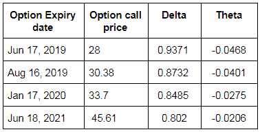
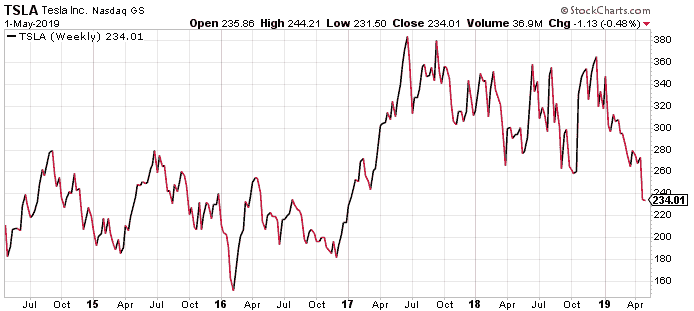
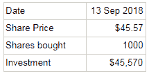
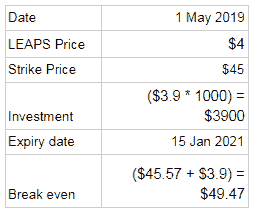
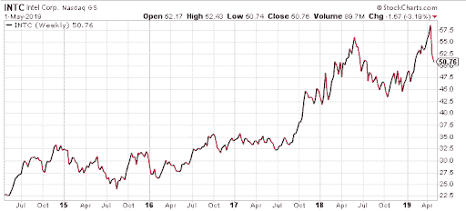

# LEAPS 选项:介绍、策略、限制和示例

> 原文：<https://blog.quantinsti.com/leap-options/>

以[重香重香](https://www.linkedin.com/in/rekhit/)

LEAPS(长期股权预期证券)是一种特殊类型的期权，它产生于寻求长期投资但不想在这段时间内锁定投资的投资者的需求。

在本文中，我们将讨论以下主题:

*   什么是飞跃？
*   [跳跃的例子](#example)
*   [飞跃战略](#strategy)
*   [限制](#limitation)
*   [结论](#conclusion)

在我们进入正题之前，您可以参考下面的课程来复习选项的[基础知识。](https://quantra.quantinsti.com/course/options-trading-strategies-python-basic)

### 什么是飞跃？

长期股权预期证券(或简称 LEAPS)是一种期权合约，其到期日通常超过一年，有些甚至长达三年。通常，期权本质上是短期的，提供 3 个月、6 个月和 9 个月的期限。最终，有些人着眼于某项资产的长期前景，但不想直接拥有它。记住这一点，LEAPS 被引入，个人可以在手头没有大量资金的情况下参与长期市场运动。

需要注意的一点是，LEAP 期权的定价通常高于其他短期合约，因此，你可能需要考虑更高的 delta，即深 ITM 期权(通常大于 80 或 0.8)，以确保当到期时，你在交易的盈利端结束。当然，就像期权一样，你可以用希腊人来评估 LEAPS 期权。

LEAPS 在经纪平台上没有被指定为 LEAPS，因此，你必须查看到期日才能知道它是 LEAP 期权。

> 记住，飞跃持续一年多。

### **跳跃的例子**

让我们考虑一下苹果期权的数据(截至 2019 年 5 月 2 日)

股价:210.52 行使价为 185 的期权在不同到期日的买入价格如下:

上表中，到期日为 2021 年 6 月 18 日的期权是 LEAPS 期权。我们可以这样解释它。

我们预计，到 2021 年 6 月，苹果的股价将保持在 185 美元以上。但为什么有人会以低于当前股价的执行价卖出看涨期权呢？这是因为不同的投资者可以以不同的方式解读股票，因此，LEAPS 看涨期权卖方会认为这是一个很好的执行价格，他们会以他们想要的期权溢价找到买家。还有一个事实是，期权买方在计算潜在利润时必须考虑期权溢价，期权溢价将被加到执行价格中。

因此，我们将以 45.61 美元的价格买入 LEAPS 期权，该期权将于 2021 年 6 月 18 日到期。在这种情况下，买方的盈亏平衡价格为 230 美元(执行价格为 185 美元，期权溢价为 45.61 美元)。

### **LEAPS 期权策略**

虽然跳跃期权和普通期权之间似乎没有太大区别，但投资者对此有不同的看法，并根据自己的风险状况发现了各种应用。我们可以看到，在这种情况下，期权费也比其他期权相对更贵。现在让我们看看购买 LEAPS 期权时的一些策略，这些策略比购买股票本身更有意义，

#### **期待一年后特定股票的牛市**

让我们假设你对一家公司进行了基本面分析，感觉到股价在短期内还不错，但从长期来看是不可持续的，以后还会下跌。由于做空会在相当长的时间内锁定你的投资，所以你可以在特定的价格购买一个 LEAP put 期权，这样你就可以行使卖出股票的期权，这应该高于(当时的)当前股价，从而获利。

LEAPS 看跌期权相对于做空股票的另一个优势是，如果价格收盘低于止损限额，并且您收到了追加保证金通知，您不会被迫平仓。

让我们借助一个例子来理解这一点。你翻阅了特斯拉的历史，感觉其主要产品即电动汽车在未来两年内不可能被大规模采用。

目前，特斯拉的股价是 234.1 美元。让我们假设我们预期股价会跌到 150 美元。在这里，投资者查看期权链，以 61.29 美元的溢价购买执行价为 230 美元的 LEAPS 看跌期权。

对于投资者来说，要达到盈亏平衡，股价应该是$230 - $61.29) = $168.71。

#### **在自有股票价格下跌的情况下，使用 LEAPS 来控制损失**

在这种情况下，长期投资者投资了一只股票，他们肯定会从中获利。然而，投资者觉得他们不应该被抓住，以防股价向相反的方向发展。因此，在这种情况下，投资者将购买 LEAPS 看跌期权，这样，即使由于购买期权溢价而导致利润减少，他们也为股票价格低于执行价格时必须承受的最大损失设定了上限。

假设你在 2018 年 9 月 13 日以 45.57 美元的价格购买了 1000 股英特尔股票。5 月 1 日的股票价格是 50.76 美元。因此，总投资为 45，570 美元。

现在，虽然你确实对长期很有信心，但你觉得如果你能减少一点点潜在利润，但对两年后退出市场时的潜在损失有一个明确的限制，你会查看 LEAPS 期权链，并试图找到一个合适的 LEAPS 看跌期权。

一份 LEAPS 看跌期权将于 2021 年 1 月 15 日到期，执行价为 45 美元，溢价 3.9 美元。因此，如果我们购买 1000 股 LEAPS 认沽期权，有效价格是$ 3.9 * 1000 = $ 3900。

现在，这意味着股价必须超过 45.57 美元+3.9 美元)= 49.47 美元才能实现盈利。但是，如果你看看另一端，我们可以看到，如果股价跌破$ 45-$ 3.9 = $ 41.1，我们可以控制我们的损失，如果我们只是购买股票，这是不可能的。要点如下，

如果没有 LEAPS 看跌期权，我们将不得不以市价出售股票，这将扩大我们的损失。

如果股票跌至 35 美元，我们可以行使 LEAPS 看跌期权，以 45 美元的执行价出售股票，即(45*1000 美元)-(3900 美元)= 41，100 美元。如果没有 LEAPS 期权，我们将不得不以 35 美元* 1000 美元的股价卖掉它。另一种方法是，我们可以在到期日之前卖出看跌期权，因为随着价格下跌，看跌期权的价值将会增加，因此，我们也可以通过这种方式减少损失。

英特尔过去 5 年的价格趋势仅供参考。

值得一提的是，我们可以将这一策略应用于整个投资组合，而不仅仅是一只股票。

### **看涨期权价差腾跃期权策略**

是的，相对著名的看涨期权价差也适用于跳跃。简而言之，它包括购买和出售具有相同到期日，但具有不同执行价格的相同基础证券的 LEAPS 期权。这个策略有助于我们提高风险回报比。要了解策略以及如何用 python 编码，可以参考下面的[文章](https://blog.quantinsti.com/bull-call-spread-strategy)。

上面提到的策略也可以应用在索引上。就像一只股票一样，人们也可以购买标准普尔 500 等指数的 LEAPS 期权。然而，这只是对老练的投资者的建议，因为我们必须了解整个市场结构，仔细评估一两年后的市场走向。

请记住，我们没有考虑交易成本、佣金等。这将对特定策略的盈利能力产生影响。

因此，到目前为止，我们了解了跳跃是如何工作的，以及一些我们更喜欢跳跃而不是标的股票以及其他短期期权的策略。

然而，硬币有两面，在下一节中，我们将了解拥有 LEAPS 期权的局限性。

### **跳跃的限制**

*   虽然就投资金额而言，LEAPS 期权可能比股票更有优势，但它的一个主要缺点是 LEAPS 有到期日。我们知道，库存可以在短期内大幅增加。如果 LEAPS 看涨期权持有者的股票在期权到期后没有被行使而上涨，那对他们来说就没有用了。
*   由于购买 LEAPS 期权支付的溢价很高，与拥有标的股票的人相比，LEAPS 期权持有者需要更长的时间才能实现收支平衡。
*   事实上，LEAPS 期权是在很远的将来做出的(有些甚至可以在 3 年后购买)，很难预测正确的价格，既能获得可观的投资回报，又能获得不太昂贵的期权溢价。
*   与股票不同，LEAPS 不提供任何股息，也不会从股票回购中受益。

### **结论**

LEAPS 是一种到期日超过一年的期权。LEAPS 期权的主要好处是，长期投资者可以涉足期权，而不用担心市场的短期波动。与拥有实际股票相比，这也有助于投资者投入更少的资本。我们也看到了跳跃式发展的局限性，这是由于跳跃式发展的长期性造成的。通过学习“[期权交易中的量化方法](https://quantra.quantinsti.com/learning-track/quantitative-approach-in-options-trading)”学习路线中的课程，您可以了解更多关于期权交易以及如何在 python 中创建自己的策略的信息。

#### **建议读数**

*   [Python 中的日历价差期权交易策略](https://blog.quantinsti.com/calendar-spread-options-trading-strategy)
*   [Python 中的熊叫阶梯期权交易策略](https://blog.quantinsti.com/bear-call-ladder-options-trading-strategy-python)
*   [期权定价模型——布莱克·斯科尔斯、德曼·卡尼&赫斯顿模型](https://blog.quantinsti.com/options-pricing-models-black-scholes-derman-kani-heston-model)

*免责声明:股票市场的所有投资和交易都有风险。在金融市场进行交易的任何决定，包括股票或期权或其他金融工具的交易，都是个人决定，只能在彻底研究后做出，包括个人风险和财务评估以及在您认为必要的范围内寻求专业帮助。本文提到的交易策略或相关信息仅供参考。*