# 聚焦 EPAT 算法交易

> 原文：<https://blog.quantinsti.com/spotlight-on-algorithmic-trading-with-epat/>

这篇文章分享了我们在全球举办的“聚焦 EPAT 算法交易”系列活动。

> 算法交易是更聪明的交易方式。

* * *

## 2019 年 5 月 18 日，印度班加卢鲁

EPAT 校友 Aman Saxena 也与与会者分享了他的学习经验。

<figure class="kg-card kg-gallery-card kg-width-wide">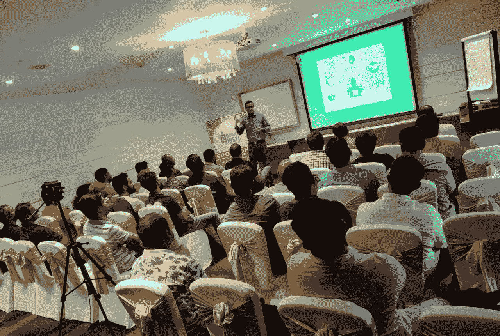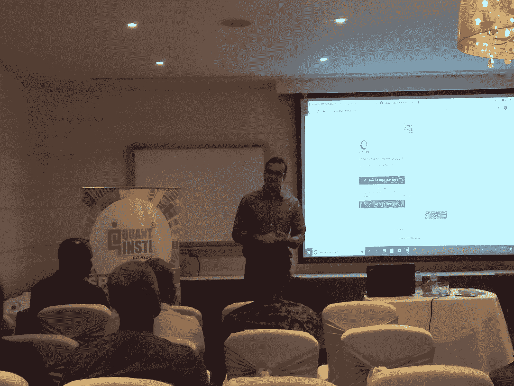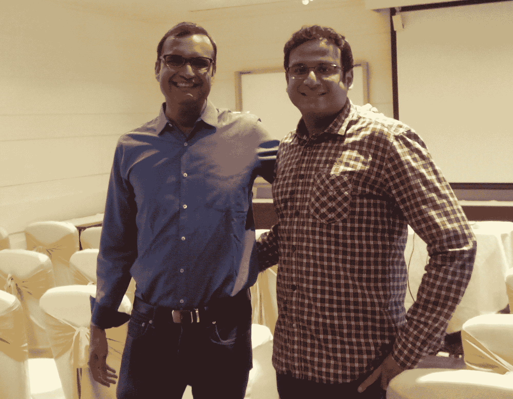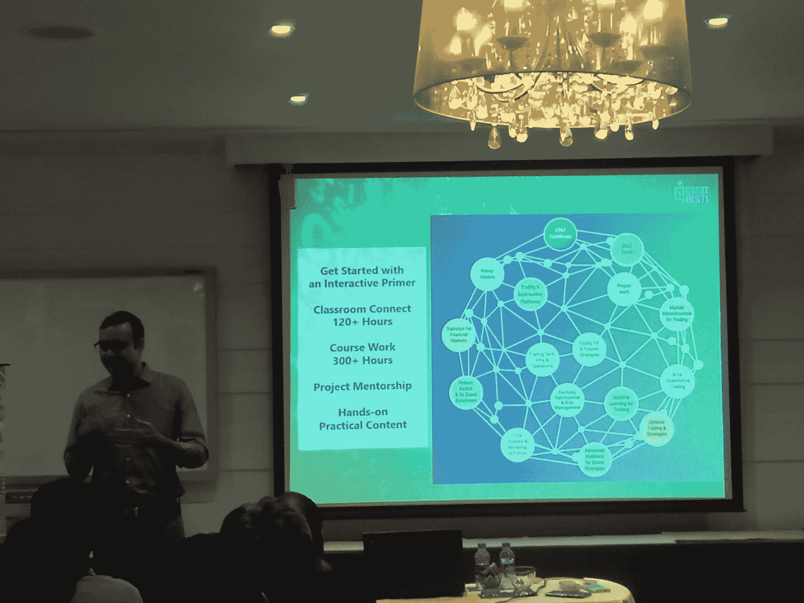</figure>

* * *

## 【2019 年 6 月 29 日，印度浦那

<figure class="kg-card kg-gallery-card kg-width-wide">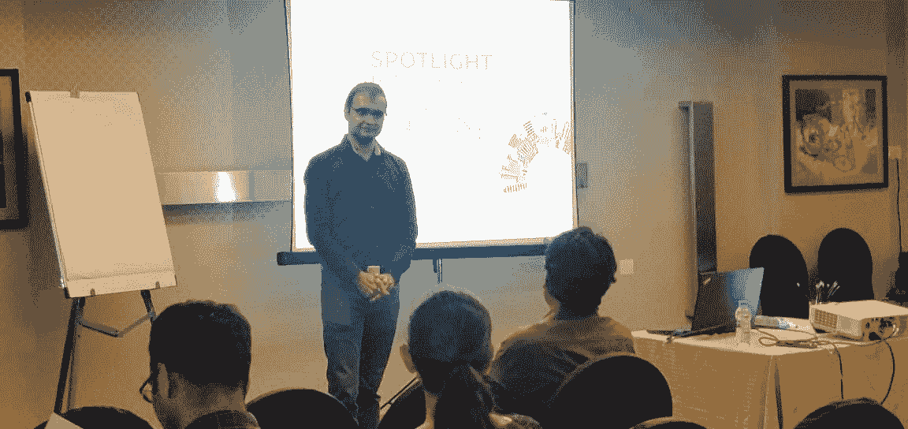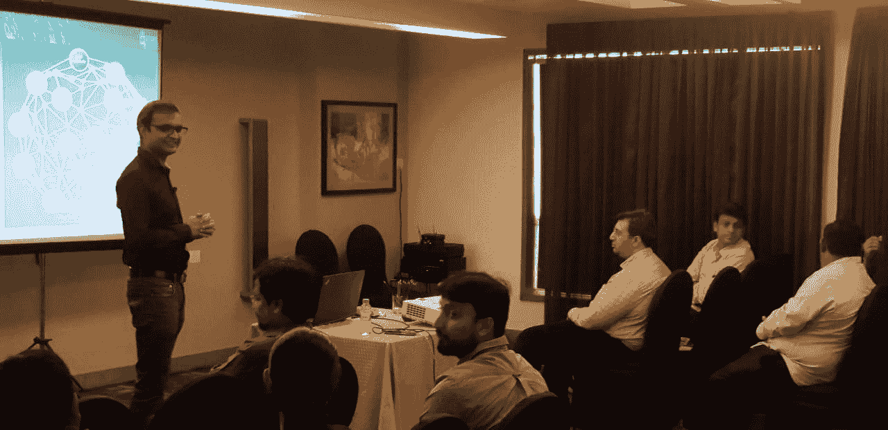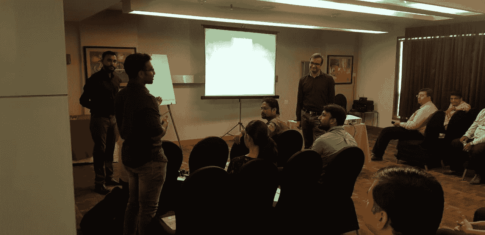</figure>

* * *

## **印度孟买，2019 年 7 月 27 日**

<figure class="kg-card kg-gallery-card kg-width-wide">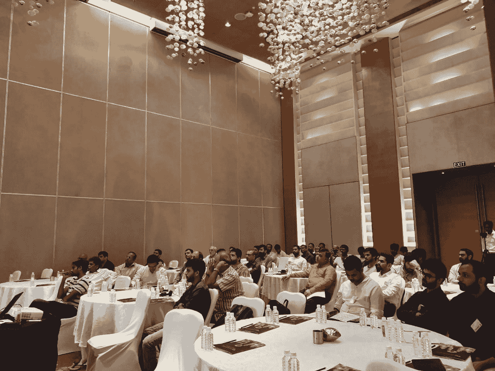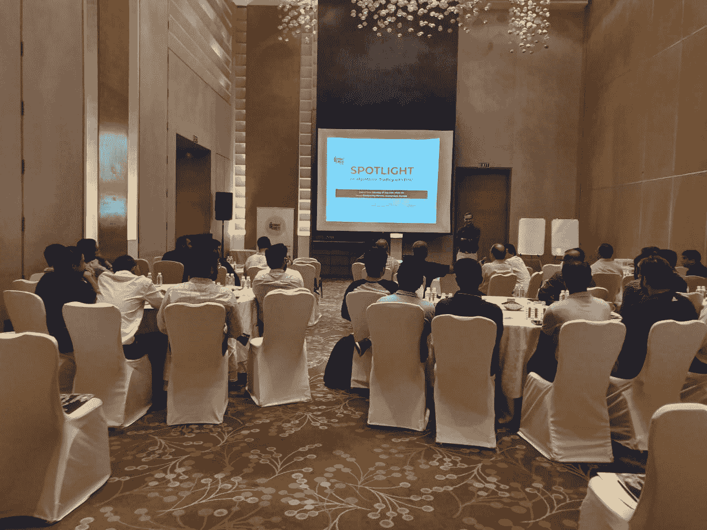</figure>

* * *

## 2019 年 9 月 26 日，澳大利亚悉尼

<figure class="kg-card kg-image-card kg-width-full"></figure>

* * *

## **西班牙马德里，2019 年 9 月 28 日**

<figure class="kg-card kg-image-card kg-width-full">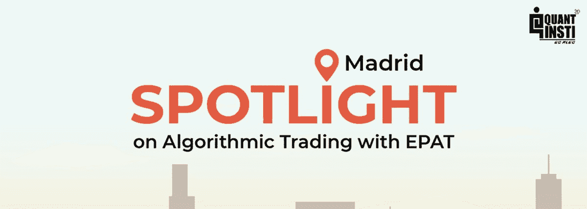</figure>

* * *

## **美国纽约 2019 年 11 月 5 日**

<figure class="kg-card kg-gallery-card kg-width-wide">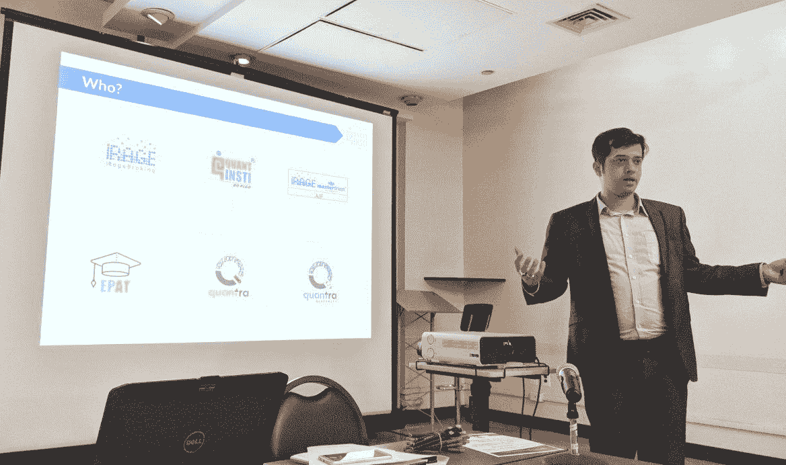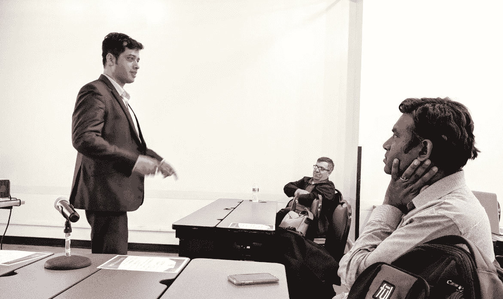</figure>

* * *

感谢所有与会者和参与者的参与，并使这些活动取得成功。我们希望您学习愉快！