# 隐马尔可夫链简介

> 原文：<https://blog.quantinsti.com/intro-hidden-markov-chains/>

*这篇文章最初发表在 [Quants 门户](http://www.quantsportal.com/)上。*

**[作者博诺洛](https://za.linkedin.com/pub/bonolo-molopyane/73/a5a/1)**

在你希望确定投资回报的情况下，你可能有所有的专业知识来做这件事，但如果没有某些信息(缺失的部分)，就不可能得出一个结论性的数字。实际上“假设你有你投资组合中所有资产的所有回报的价值；如果没有每项资产产生回报的比率，我们将无法真实反映特定时间点的投资组合回报，因此我们可能无法提供准确的回报估计。”一个称为隐马尔可夫模型的过程可以用来解释这个问题。

这个过程分为两个部分:一个可观察的部分和一个不可观察的或“隐藏的”部分(van Handel，2008)。然而，从可观察的过程中，我们可以提取关于“隐藏”过程的信息。因此，我们的任务是从观察到的过程中确定未观察到的过程。

隐马尔可夫模型(HMM)有两个定义性质。(I)它假设当时的观察是由某个过程产生的，该过程的状态对观察者是隐藏的，并且(ii)它假设该隐藏过程的状态满足马尔可夫性质。对某些人来说，HMM 可能看起来很复杂，但是一旦理解了什么是马尔可夫模型，它就很容易理解了。我们将研究这两个模型组件，然后考虑有助于构建这些 hmm 的高级技术。

### **构建隐马尔可夫模型**

#### **【隐藏过程】**

如果满足以下条件，则称一个过程具有**马尔可夫特性**:

对于任何一个*⊆s*，任何一个值 *n* 和任何一个时间值*t1t*t2<…<tnt17】tn+1t13】确实如此**

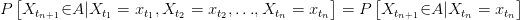

这意味着，要确定流程的下一个状态，可以只考虑流程当前所处的状态，而忽略之前发生的所有事情，因为该信息已经包含在当前状态中。

我们需要一些属性和定义来帮助我们最终理解 HMM 的概念

1.  **时间同质性**:这发生在从 a 到 b 的概率与时间无关的时候，也就是说，你在这个过程中走了多远并不重要；只要这些过程在一个步骤中从 a 移动到 b，整个过程的概率是相同的。当一个过程具有这种性质时，我们说这个过程是时间同质的，如果不是；*时间非同质*
2.  虽然可以处理无限个状态，但在我们的财务环境中，处理有限个不可约的状态就足够了。
3.  **不可约状态:**经过一定数量的步骤，从任何一个状态转移到另一个状态都是可能的。

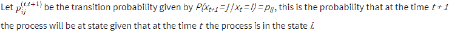

这个**概率矩阵**是这样的:

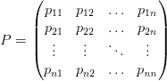

注意:这些排放概率是这个过程下一步走向的主要驱动力。根据我们的时间同质性假设，我们可以计算出该过程在 *t* 步后处于状态 *j* 的概率，假定它开始于 *i* 我们将矩阵 *P* 乘以自身 *t* 次，然后读出*PnT17】的*ijthT13】元素**

示例:

让我们考虑两个概率转移矩阵，每个矩阵有两个转移状态，一个是时间均匀的，另一个不是。

非时齐情况

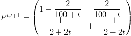

然后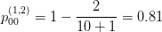和

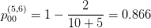

这里改变状态的概率取决于你在时间中的位置。与此过程相反，时间齐次矩阵给出了与时间无关的常数概率。

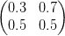在这种情况下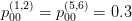

### **快速任务**

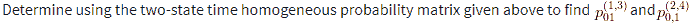

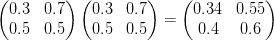

然后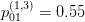

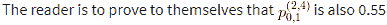

### **马尔可夫转移的可视化表示**

保持我们的分析简单，让我们研究一个三态过程 *S = {1，2，3}*

从任何一个状态移动到任何其他状态的概率由概率矩阵 P 给出，概率矩阵 P 由下式给出:

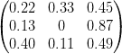

下图给出了这种现象的另一种观点:

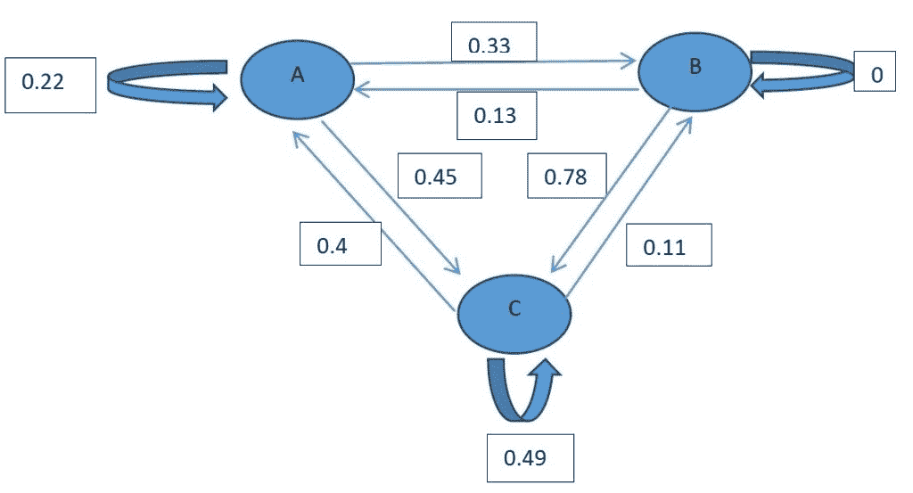

根据该图，我们可以在一个转变(时间步长)内移动到任何状态或保持在当前状态。这对于 A 和 C 来说都是正确的，但是一旦进程到达 B，它必须在下一个转换中移动，这是因为停留在 B 的概率是 0。

有了**马尔可夫链**，我们可以看到，它们会保留未观察到的信息，并最终产生一个更现实的模型，这就是我们首先关注 hmm 的原因。

### **可观察的过程**

隐藏状态是由一些性质决定的，我们可以通过推导这些性质来更好地理解这些隐藏状态的行为。

为了得到这个过程的密度估计值，我们需要解许多方程组。像 **Baum-Welch 算法**和 **Viterbi 算法**这样的算法给出了极其精确的估计，但是由于它们的复杂性，我们将暂时避开它们，但是稍后再回到它们。相反，我们将研究卡尔曼滤波器，因为它遵循的过程类似于 HMM 推导中使用的过程，因此它将使我们直观地理解 HMM 是如何产生的。**卡尔曼滤波器**是一种广泛应用于控制系统和航空电子设备的数学技术，用于从一系列不完整和有噪声的测量中提取信号。

从不同的角度来看，我将首先列出卡尔曼滤波器和 HMM 方法之间的区别。

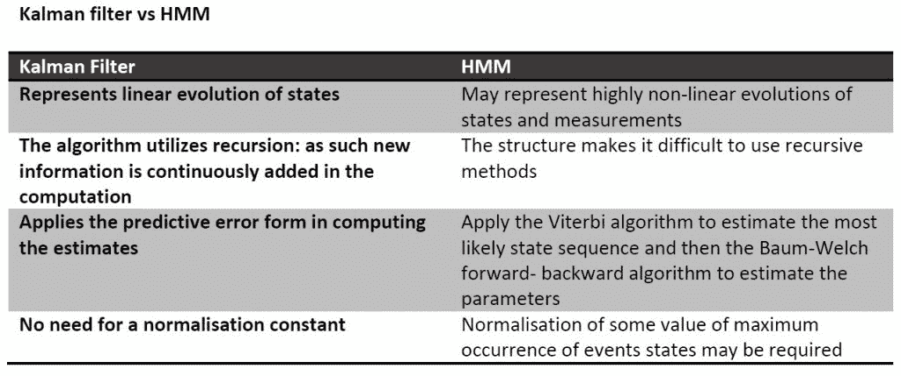

从上面，我们得到一种感觉，通过卡尔曼滤波器找到估计更简单，但同时，我们观察 HMM 如何将估计提高到一个全新的水平。我画了这个表来演示，如果不是暗示，在尝试寻找 HMM 的估计值之前，首先熟悉卡尔曼滤波器是多么的必要。

### **卡尔曼滤波**

卡尔曼滤波器的关键点

*   这是一种找到过程估计值的方法。过滤来自于减少或“过滤掉”不想要的变量的原始用法。在我们的例子中是估计误差

#### **滤波器估计值**

假设我们有两个过程，一个状态过程和一个观察过程，由下面的线性方程组给出:

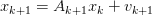

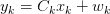

这里的${A} *{k}$和${C}* {k}$可以是矩阵或变量，甚至可以是简单的常量值。

通常假设${v} *{k+1}$和${w}* {k+1}$是独立且同分布的高斯或正态分布，具有均值 0 和一些协方差矩阵(理想情况下是对角线，以反映观测值之间的独立性)。

卡尔曼滤波方程的估计值是使用相当先进的方法得出的，这些方法需要对多变量分析有足够的了解。因此，我将在这里给出隐藏过程的期望值和方差的矩方程。

*时间更新方程式*为

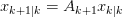

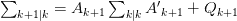

并且*测量值更新等式*:

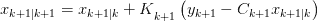

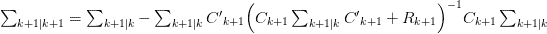

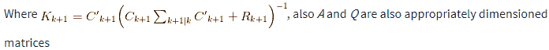

第二组方程(*测量值更新)*确定过程的均值和协方差将在哪里给出第一组方程(*时间更新)*的结果。

**卡尔曼滤波器增益** ( *K k+1 )* 用于反映我们合成的模型相对于一些观察到的(通常是历史的)模型之间的误差项的显著性。如果在 0 和 1 之间的概率的增益很小，这将意味着估计的模型是相对接近现实的，即现实的良好度量。如果这个概率非常大，那么它可能表明我们模型是无效的，需要用统计中可用的许多误差最小化方法进行重新评估。事实是，确定卡尔曼增益与获得期望过程的估计值一样重要。该滤波器增益的推导将在附录中提供。

### **随机动态规划**

埃里克·b·拉伯和他的同事周华以一种简单而令人满意的、有意识的方式剖析了动态编程(DP)是如何运作的。首先，他们将问题(过程)分成子区间。观察到这些“子问题”是相关的，他们建议单独解决子过程，并将答案存储在表中，然后使用记录的答案来回答初始问题。

在任何包含隐藏变量(如 HMMs)的模型中，确定变量序列的任务被称为解码(Read，2011)，其目标是从观察到的序列中确定最可能的隐藏状态序列(Blunsom，2004)。维特比算法已经被用来为一个被观察的序列寻找单个最佳状态序列，并且这样做的方式让人不得不佩服。

### **维特比算法**

该算法大致遵循一个四步过程，在该过程的最后，将导出最可能的转换过程。

1.  初始化

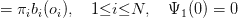

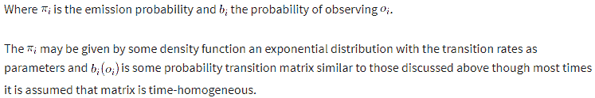

2.  递归

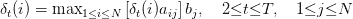

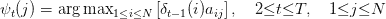

3.  结束

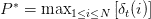

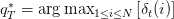

一旦训练集中的所有转换都被考虑，代码将提取给定所有先前事件的最可能(最大概率)事件。

4.  最优状态序列回溯

回溯允许从递归步骤的结果中找到最佳状态序列(Blunsom，2004)。

有趣的是:给定算法获得最可能序列的能力，没有简单的方法来获得第二好的序列。

### **工作示例**

Bhar 和 Hamori 使用 HMM 分析 G7 国家的股票市场回报，使用月度回报(2004，第 43 页)。当两人意识到美国对其他 G7 国家施加强大的影响，但有趣的是，其他国家对美国的影响并不小或没有时，这种情况就出现了。

假设整个 G7 月度回报的模型由以下形式的双态马尔可夫模型给出

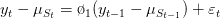

回报被分成波动性高和低的时段。一个国家保持当前状态的估计概率由低波动性时和高波动性时给出。

下表显示了 Bhar 和 Hamori 对七个国家的实证研究结果。给定来自 Baum-Welch 算法和 Viterbi 算法的平滑概率和参数估计，我们有:

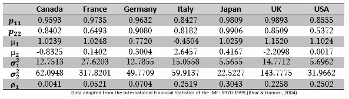

这些统计数据不仅仅是为了假设模型；他们的主要目的是提供更多的数据信息，从而帮助决策者有效地制定战略。从该表中获得的一些信息:

*   日本最有可能长时间处于不稳定状态，而美国可能会更快离开不稳定时期。
*   在一个更加不稳定的体制下，意大利可能会获得更多的平均回报
*   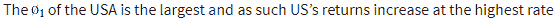

作为练习，读者可以更仔细地观察从数据中可以得出什么样的推论。

### **参考书目**

巴尔和哈莫里(2004 年)。*隐马尔可夫模型。*伦敦:Kluwer 学术出版社。

布伦松，P. (2004 年)。*隐马尔可夫模型。*

里德，J. (2011 年)。*隐马尔可夫模型和动态规划。*

范·汉德尔(2008 年)。隐马尔可夫模型:课堂讲稿。

*免责声明:本客座博文中提供的观点、意见和信息仅属于作者个人，不代表 QuantInsti 的观点、意见和信息。本文中所做的任何陈述或共享的链接的准确性、完整性和有效性都不能得到保证。我们对任何错误、遗漏或陈述不承担任何责任。与侵犯知识产权相关的任何责任由他们承担。T3】*