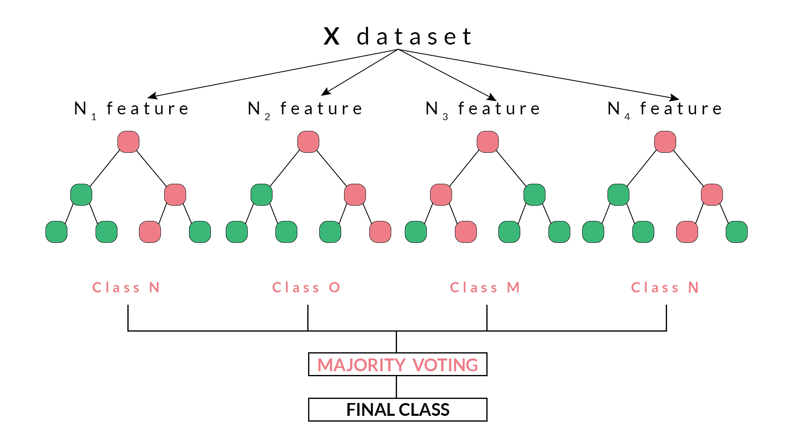
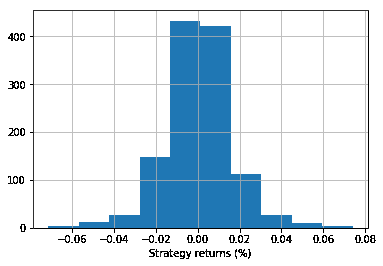
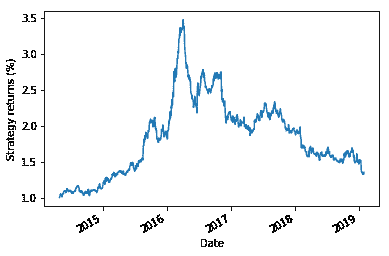

# 用 Python 实现交易中的随机森林算法

> 原文：<https://blog.quantinsti.com/random-forest-algorithm-in-python/>

作者:[沙古塔·塔西尔达](https://www.linkedin.com/in/shaguftatahsildar/)

在这个博客中，我们将讨论什么是随机森林，它们是如何工作的，它们如何帮助克服决策树的局限性。

随着[机器学习](https://blog.quantinsti.com/machine-learning-basics)及其技术在当前环境下的蓬勃发展，越来越多的算法在各个领域得到应用。机器学习算法的功能和工作彼此不同，其中一种算法对于某个问题可能比另一种算法更好。机器学习算法不断更新和升级，以扩大其应用范围，并尽量减少其缺点。

随机森林算法就是这样一种算法，旨在克服决策树的局限性。

在这篇博客中，我们将讨论:

*   什么是决策树？
*   [什么是随机森林？](#rf)
*   [随机森林的工作](#working)
*   [随机森林的 Python 代码](#code)
*   [随机森林的优缺点](#ad)

在直接跳到随机森林之前，让我们先简要了解一下决策树及其工作原理。

### **什么是决策树？**

[决策树](https://blog.quantinsti.com/use-decision-trees-machine-learning-predict-stock-movements)，顾名思义，具有以分支作为节点的层级或树状结构。我们可以通过遍历这些节点来做出某个决定，这些节点是基于对与节点相关的参数的响应而获得的。

然而，决策树存在过度拟合的问题。[过度拟合](https://quantra.quantinsti.com/glossary/Overfitting)基本上是通过在树中添加越来越多的节点来增加树内的特异性，从而达到某个结论，从而增加树的深度并使其更加复杂。

此外，在这篇博客中，我们将了解随机森林如何帮助克服决策树的这一缺点。

通过我们的 Quantra 课程，学习[如何制作决策树](https://quantra.quantinsti.com/course/decision-trees-analysis-trading-ernest-chan)利用人工智能技术预测市场和寻找交易机会。

### **什么是随机森林？**

随机森林是一种使用集成方法的监督分类机器学习算法。简而言之，随机森林由许多决策树组成，有助于解决决策树过度拟合的问题。这些决策树是通过从给定的数据集中选择随机特征而随机构建的。

随机森林根据从决策树收到的最大投票数做出决策或预测。通过大量决策树达到最大次数的结果被认为是随机森林的最终结果。

### **随机森林工作**

随机森林基于集成学习技术。系综，简单地意味着一个组或一个集合，在这种情况下，是决策树的集合，统称为随机森林。集合模型的准确性优于单个模型的准确性，因为它汇集了单个模型的结果并提供了最终结果。

如何从数据集中选择特征来为随机森林构建决策树？

使用一种称为 bootstrap 聚合或 bagging 的方法随机选择特征。从数据集中可用的特征集中，通过选择带有替换的随机特征来创建多个训练子集。这意味着一个特征可能同时在不同的训练子集中重复。

例如，如果数据集包含 20 个特征，并且要选择 5 个特征的子集来构建不同的决策树，则这 5 个特征将被随机选择，并且任何特征都可以是多个子集的一部分。这确保了随机性，使得树之间的相关性更小，从而克服了过度拟合的问题。

一旦选择了特征，就基于最佳分割来构建树。每个树给出一个输出，该输出被认为是从该树到给定输出的“投票”。输出

哪个获得最大“投票”由随机森林选择作为最终输出/结果，或者在连续变量的情况下，所有输出的平均值被认为是最终输出。



例如，在上图中，我们可以观察到每个决策树都投票或预测了一个特定的类。由随机森林选择的最终输出或类将是类 N，因为它具有多数票或者是四个决策树中的两个的预测输出。

### **随机森林的 Python 代码**

在这段代码中，我们将创建一个随机森林分类器，并训练它给出每日回报。

#### 导入库

In [ ]:

```py
import quantrautil as q
import numpy as np
from sklearn.ensemble import RandomForestClassifier
```

The libraries imported above will be used as follows:

1.  [quantrautil](https://github.com/QuantInsti/Quantra-Courses/blob/master/quantrautil.py) -这将用于从 yahoo finance 获取 BAC 股票的价格数据。
2.  numpy -对 BAC 股票价格执行数据操作，以计算输入特征和输出。如果你想了解更多关于 numpy 的信息，你可以在这里找到。
3.  sklearn - Sklearn 有很多[机器学习](https://blog.quantinsti.com/trading-using-machine-learning-python/)模型的工具和实现。RandomForestClassifier 将用于创建随机森林分类器模型。

#### 获取数据

The next step is to import the price data of BAC stock from quantrautil. The get_data function from [quantrautil](https://github.com/QuantInsti/Quantra-Courses/blob/master/quantrautil.py) is used to get the BAC data for 19 years from 1 Jan 2000 to 31 Jan 2019 as shown below. The data is stored in the dataframe data.In [2]:

```py
data = q.get_data('BAC','2000-1-1','2019-2-1')
print(data.tail())
```

```py
[*********************100%***********************]  1 of 1 downloaded
                 Open       High        Low      Close  Adj Close     Volume  \
Date                                                                           
2019-01-25  29.280001  29.719999  29.139999  29.580000  29.580000   72182100   
2019-01-28  29.320000  29.670000  29.290001  29.629999  29.629999   59963800   
2019-01-29  29.540001  29.700001  29.340000  29.389999  29.389999   51451900   
2019-01-30  29.420000  29.469999  28.950001  29.070000  29.070000   66475800   
2019-01-31  28.750000  28.840000  27.980000  28.469999  28.469999  100201200   

           Source  
Date               
2019-01-25  Yahoo  
2019-01-28  Yahoo  
2019-01-29  Yahoo  
2019-01-30  Yahoo  
2019-01-31  Yahoo
```

#### 创建输入和输出数据集

In this step, I will create the input and output variable.

1.  输入变量:我使用了'(开盘价-收盘价)/开盘价'，'(高-低)/低'，最近 5 天回报率的标准差(std_5)，以及最近 5 天回报率的平均值(ret_5)
2.  输出变量:如果明天的收盘价高于今天的收盘价，则输出变量设置为 1，否则设置为-1。1 表示买入股票，-1 表示卖出股票。

The choice of these features as input and output is completely random. If you are interested to learn more about feature selection then you can read [here](https://en.wikipedia.org/wiki/Feature_selection).In [3]:

```py
# Features construction 
data['Open-Close'] = (data.Open - data.Close)/data.Open
data['High-Low'] = (data.High - data.Low)/data.Low
data['percent_change'] = data['Adj Close'].pct_change()
data['std_5'] = data['percent_change'].rolling(5).std()
data['ret_5'] = data['percent_change'].rolling(5).mean()
data.dropna(inplace=True)

# X is the input variable
X = data[['Open-Close', 'High-Low', 'std_5', 'ret_5']]

# Y is the target or output variable
y = np.where(data['Adj Close'].shift(-1) > data['Adj Close'], 1, -1)
```

In [4]:

#### **列车试分裂**

We now split the dataset into 75% Training dataset and 25% for Testing dataset.

```py
# Total dataset length
dataset_length = data.shape[0]

# Training dataset length
split = int(dataset_length * 0.75)
split
```

Out[4]:

```py
3597
```

In [5]:

```py
# Splitiing the X and y into train and test datasets
X_train, X_test = X[:split], X[split:]
y_train, y_test = y[:split], y[split:]

# Print the size of the train and test dataset
print(X_train.shape, X_test.shape)
print(y_train.shape, y_test.shape)
```

```py
(3597, 4) (1199, 4)
(3597,) (1199,)
```

#### 训练机器学习模型

All set with the data! Let's train a decision tree classifier model. The RandomForestClassifier function from tree is stored in variable ‘clf’ and then a fit method is called on it with ‘X_train’ and ‘y_train’ dataset as the parameters so that the classifier model can learn the relationship between input and output.In [6]:

```py
clf = RandomForestClassifier(random_state=5)
```

In [7]:

```py
# Create the model on train dataset
model = clf.fit(X_train, y_train)
```

In [8]:

```py
from sklearn.metrics import accuracy_score
print('Correct Prediction (%): ', accuracy_score(y_test, model.predict(X_test), normalize=True)*100.0)
```

```py
Correct Prediction (%):  52.71059216013344

```

In [9]:

```py
# Run the code to view the classification report metrics
from sklearn.metrics import classification_report
report = classification_report(y_test, model.predict(X_test))
print(report)
```

```py
             precision    recall  f1-score   support

         -1       0.52      0.61      0.56       594
          1       0.54      0.44      0.49       605

avg / total       0.53      0.53      0.52      1199

```

#### 战略回报

In [10]:

```py
data['strategy_returns'] = data.percent_change.shift(-1) * model.predict(X)
```

#### 每日回报直方图

In [14]:

```py
%matplotlib inline
import matplotlib.pyplot as plt
data.strategy_returns[split:].hist()
plt.xlabel('Strategy returns (%)')
plt.show()
```



#### 战略回报

In [13]:

```py
(data.strategy_returns[split:]+1).cumprod().plot()
plt.ylabel('Strategy returns (%)')
plt.show()
```

The output displays the strategy returns and daily returns according to the code for the Random Forest Classifier.

### **优势**

*   避免过度拟合
*   可用于分类和回归
*   可以处理缺失值

### **缺点**

*   大量的树木会占用空间，减少时间。

In this blog, we learnt the functioning of the Random Forest Algorithm with the help of an example, along with the Python code to implement this strategy.

通过我们的 Quantra 课程，学习如何使用人工智能技术制作决策树来预测市场和寻找交易机会。

*免责声明:股票市场的所有投资和交易都涉及风险。在金融市场进行交易的任何决定，包括股票或期权或其他金融工具的交易，都是个人决定，只能在彻底研究后做出，包括个人风险和财务评估以及在您认为必要的范围内寻求专业帮助。本文提到的交易策略或相关信息仅供参考。T3】*

**建议阅读:**

*   [使用机器学习中的决策树来预测股票走势](https://blog.quantinsti.com/use-decision-trees-machine-learning-predict-stock-movements)
*   [使用 Python 进行交易的决策树](https://blog.quantinsti.com/decision-tree)