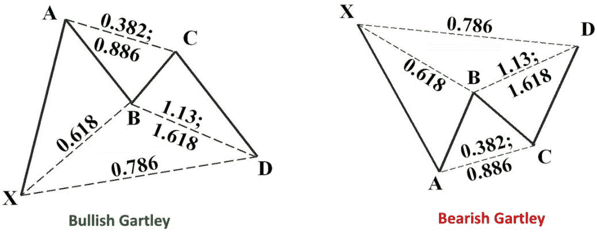
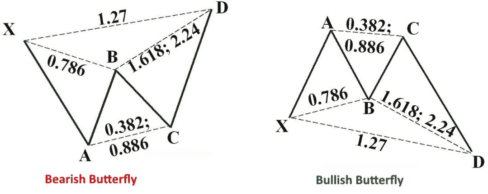
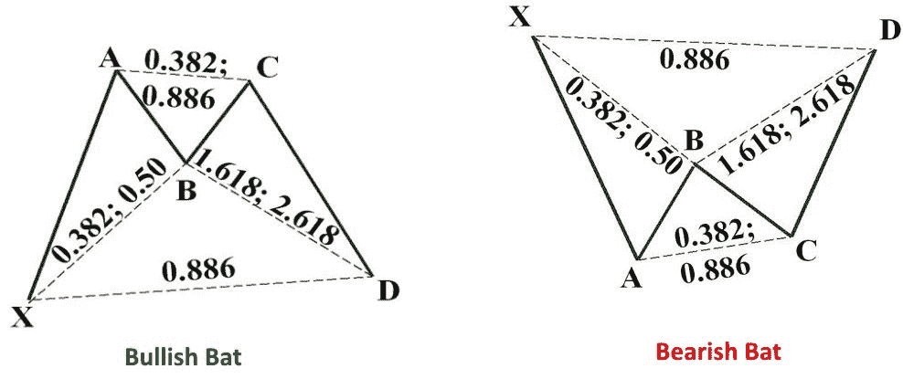
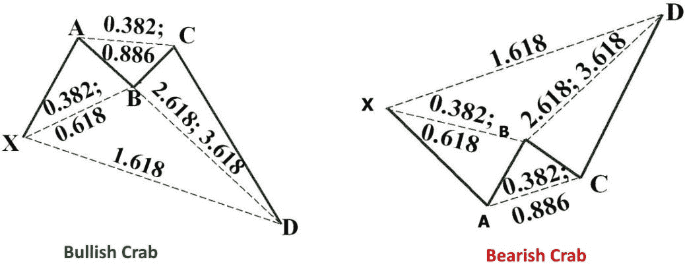

# 斐波那契数-调和模式

> 原文：<https://blog.quantinsti.com/fibonacci-numbers-harmonic-patterns/>

作者:桑吉·库马尔

在这篇博客中，我们学习了斐波那契数，调和模式，以及如何找到不同长度和大小的模式。然后，交易者可以将斐波纳契比率应用于这些模式，并尝试预测未来的走势。

本文是作者提交的最后一个项目，作为他在 QuantInsti[算法交易(EPAT)](https://www.quantinsti.com/epat)高管课程的一部分。请务必查看我们的项目页面，看看我们的学生正在构建什么。

#### **关于作者**

Sanjeet Kumar 是一名 EPATian 人，现居印度德里，拥有锡金马尼帕尔大学的金融 MBA 学位。

他是 ThoughtFocus 的高级分析师，拥有 EPAT 优秀证书。

### **项目摘要**

调和交易将模式和数学结合成一种精确的交易方法，它基于模式重复的前提。基本比率存在于几乎所有的自然和环境结构和事件中；它也存在于人造建筑中。由于这种模式在自然界和社会中重复出现，这种比率在金融市场中也能看到，金融市场受到交易环境和社会的影响。

通过发现不同长度和大小的模式，交易者可以应用斐波纳契比率来预测未来的走势。这种交易方法很大程度上归功于斯科特·卡尼，尽管其他人也做出了贡献或发现了提高业绩的模式和水平。

#### **什么是“斐波那契数/线”？**

斐波那契数列和线是使用意大利数学家列奥纳多·斐波那契开发的数学序列的技术指标。斐波那契数列是一个数字序列，从 0 和 1 开始，由前面两个数字相加而成。例如，序列的前一部分是 0、1、1、2、3、5、8、13、21、34、55、89 和 144。

#### **谐波模式**

调和价格模式通过使用斐波那契数来定义精确的转折点，将几何价格模式提升到一个新的水平。不同于其他常见的交易方法，谐波交易试图预测未来的运动。让我们来看一些例子，看看调和价格模式是如何在外汇市场交易货币的。

#### **结合几何和斐波那契数列**

调和交易将模式和数学结合成一种精确的交易方法，它基于模式重复的前提。这种方法的基础是基本比率，或它的一些衍生物(0.618 或 1.618)。互补比包括:0.382，0.50，1.41，2.0，2.24，2.618，3.14，3.618。

基本比率存在于几乎所有的自然和环境结构和事件中；它也存在于人造建筑中。由于这种模式在自然界和社会中重复出现，这种比率在金融市场中也能看到，金融市场受到交易环境和社会的影响。

通过发现不同长度和大小的模式，交易者可以应用斐波纳契比率来预测未来的走势。调和交易法主要归功于斯科特·卡尼，尽管其他人也贡献或发现了提高业绩的模式和水平。

#### **谐波问题**

调和价格模式是精确的，要求该模式显示特定幅度的变动，以便该模式的展开提供准确的反转点。交易者可能经常看到一个看起来像调和模式的模式，但是斐波纳契水平不会在模式中对齐，因此从调和方法的角度来看，该模式是不可靠的。这可能是一个优势，因为它要求交易者耐心等待理想的设置。

谐波模式可以衡量电流移动将持续多长时间，但它们也可以用来隔离反转点。当一个交易者在反转区域建仓，并且形态失败时，危险就发生了。当这种情况发生时，交易者可能会在趋势对他不利的情况下被抓住。因此，和所有的交易策略一样，必须控制风险。

值得注意的是，模式可能存在于其他模式中，非调和模式也可能存在于调和模式的上下文中。这些可以用来帮助谐波模式的有效性，并增强进入和退出性能。

几个价格波也可能存在于单个谐波中(例如，CD 波或 AB 波)。价格不断波动；因此，重要的是要着眼于交易时间框架的大局。市场的分形性质允许该理论从最小到最大的时间范围应用。

使用这种方法，交易者将受益于一个图表平台，这个平台允许他绘制多个斐波纳契回撤来衡量每一波。

### **视觉模式以及如何交易它们**

有相当多的谐波模式可以用于谐波交易，虽然有四种模式似乎是最受欢迎的。这些是 Gartley，蝴蝶，蝙蝠和螃蟹模式。

#### **The Gartley**

Gartley 最初是由 H.M. Gartley 在他的书《股票市场的利润》中发表的，后来 Scott Carney 在他的书《调和交易者》中加入了斐波那契水平。下面讨论的级别来自那本书。多年来，其他交易者提出了一些其他的常见比率。相关时，也会提及这些内容。

看涨形态通常出现在趋势的早期，这是一个信号，表明修正波正在结束，在 d 点之后将出现向上移动。所有形态都可能出现在更广泛的趋势或范围内，交易者必须意识到这一点。(相关见解见《艾略特波浪理论》)。

这需要吸收很多信息，但这就是如何阅读图表。我们将使用看涨的例子。

价格上升到 A，然后修正，B 是 A 波的 0.618 回撤。

价格通过 BC 向上移动，是 AB 的 0.382 到 0.886 的回撤。

下一步棋是通过 CD 向下，是 AB 的 1.13 到 1.618 的延伸。

D 点是 XA 的 0.786 回撤。很多交易者找 CD 把 AB 的 1.27 延伸到 1.618。

D 处的区域称为潜在反转区。这是多头可以进入的地方，尽管等待一些价格开始上涨的确认是被鼓励的。止损就放在进场下方不远的地方，尽管其他止损策略将在后面的章节中讨论。

对于看跌模式，在 D 附近做空，止损在上方不远。

#### **蝴蝶**

蝴蝶图案不同于 Gartley 图案，因为蝴蝶的 D 点延伸到 x 点之外。

这里我们将看看跌的例子来分解数字。

价格降到了 1 英镑。

AB 的上行波是 XA 的 0.786 回撤。

BC 是 AB 的 0.382 到 0.886 回撤。

CD 是 AB 的 1.618 到 2.24 的扩展。

d 在 XA 波的 1.27 延伸处。

d 是一个考虑短期交易的区域，尽管等待价格开始走低的一些确认是被鼓励的。在上方不远处设置止损。

有了所有这些模式，一些交易者寻找提到的数字之间的任何比率，而其他人寻找其中的一个。例如，上面提到 CD 是 AB 的 1.618 到 2.24 扩展。一些交易者只会寻找 1.618 或 2.24，忽略中间的数字，除非他们非常接近这些特定的数字。

#### **蝙蝠**

蝙蝠图案在外观上与 Gartley 相似，但在尺寸上不同。

让我们看看看涨的例子。

通过 XA 有一个上升。

b 回撤 XA 的 0.382 到 0.5。

BC 回撤 AB 的 0.382 到 0.886。

CD 是 AB 的 1.618 到 2.618 扩展。

d 位于 XA 的 0.886 回撤位。

d 是可以做多的区域，尽管要等价格开始上涨后再做。止损可以放在下方不远处。

对于看跌形态，在 D 附近做空，止损在上方不远处。

#### **螃蟹**

卡尼认为螃蟹是最精确的模式之一，它提供了非常接近斐波那契数列的反转。

这种模式类似于蝴蝶，但尺寸不同。

在看涨形态中，B 点将拉回 0.382 至 0.618 的 XA。

BC 会回撤 AB 的 0.382 到 0.886。

CD 延伸 AB 的 2.618 到 3.618。

D 点是 XA 的 1.618 扩展。

在 D 附近做多，止损在下方不远。

对于看跌形态，在 D 附近进场做空，止损在上方不远处。

#### **微调入口和止损**

每个形态都提供了一个潜在的反转区(PRZ)，但不一定是一个确切的价格。这是因为两个不同的投影形成了点 d。如果所有的投影水平都很接近，交易者可以在该区域建仓。如果预测区域是分散的，例如在长期图上，水平可能相差 50 点或更多，寻找价格朝着预期方向移动的其他确认。这可能来自一个指标，或者仅仅是观察价格的变化。

止损也可以放在最远投影的外面。这意味着止损不太可能达到，除非这个模式因为走得太远而失效。

### **底线**

调和交易是一种精确和数学的交易方式，但是它需要耐心，练习和大量的研究来掌握模式。基本的测量只是开始。与正确的模式测量不一致的波动会使模式无效，并使交易者误入歧途。

Gartley，Butterfly，Bat 和 Crab 是交易者比较关注的模式。当价格确认显示反转时，在潜在反转区进行交易，止损位于多头交易的下方或空头交易的上方，或者在形态的最远投影之外。

如果你想学习算法交易的各个方面，那就去看看我们的算法交易(EPAT)执行项目(T2)。该课程涵盖了统计学&计量经济学、金融计算&技术和算法&定量交易等培训模块。EPAT 旨在让你具备成为成功交易者的正确技能。[现在报名](https://www.quantinsti.com/epat/)！

**推荐阅读:**[Python 中的斐波那契回撤交易策略](https://blog.quantinsti.com/fibonacci-retracement-trading-strategy-python)

免责声明:就我们学生所知，本项目中的信息是真实和完整的。所有推荐都不代表学生或 QuantInsti 的保证。学生和 QuantInsti 否认与使用这些信息有关的任何责任。本项目中提供的所有内容仅供参考，我们不保证通过使用该指南您将获得一定的利润。

### **zip 存档中的文件列表:**

*   包含 OHLC 数据的 Excel 文件
*   提取新闻网址的 Python 代码