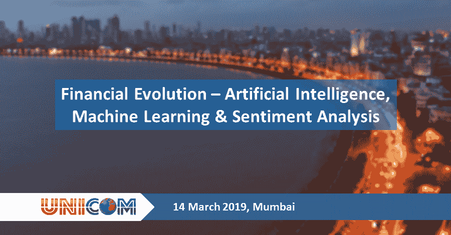

# 金融发展-人工智能、人工智能和情绪分析(孟买)

> 原文：<https://blog.quantinsti.com/conference-mumbai-ai-machine-learning-sentiment-analysis/>

[金融进化- AI，机器学习&情绪分析](http://conference.unicom.co.uk/sentiment-analysis/2019/mumbai/)-**2019 年 3 月 14 日，美国国家证券交易所，** **孟买**

人工智能被认为是第四次工业革命的主要驱动力。金融行业预计将引领人工智能的采用，预计未来三年的支出将大幅增加。为了处理和理解大量数据，机器学习和情感分析等方法已经成为打开数据分析大门的必要手段。

 <u><u>这个会议将帮助你揭开人工智能的神秘面纱，并区分现实和炒作。了解如何从人工智能技术的空前进步中受益。参与者将获得如何为自己和公司利用这些技术进步的真知灼见。T3T5T7】

### **概述**

人工智能和机器学习(AI & ML)以及情绪分析据说可以“通过分析过去来预测未来”——这是金融业的圣杯。它们可以复制人类做出的认知决策，同时避免人类固有的行为偏差。

处理新闻数据和社交媒体数据，并对(市场)情绪进行分类，以及它如何影响金融市场，是一个不断发展的研究领域。该领域最近取得了进一步进展，出现了许多新的“替代”数据源，如电子邮件收据、信用卡/借记卡交易、天气、地理位置、卫星数据、Twitter、微博和搜索引擎结果。人工智能和人工智能在金融服务行业，尤其是在合规性、投资决策和风险管理方面越来越受欢迎。

这是一个复杂的会议，不仅质疑和探索人工智能和人工智能在金融服务行业的影响，而且还继续确定在金融领域分享知识和利用知识产权的投资机会。

### **为什么参与**

*   演讲者——思想领袖、学科专家和初创企业家——分享他们对自己工作的知识和热情，以及他们在人工智能、机器学习、情感分析和深度学习领域的愿景。
*   了解如何从前所未有的技术进步中为自己和公司获益
*   了解量子计算和替代数据的影响
*   受益于来自英国、美国、欧洲和印度/香港的世界级主持人的经验
*   获得对人工智能、机器学习和金融情感分析领域开创性项目的独家见解
*   课程包括最新的最先进的研究，实际应用和案例研究
*   享受与所有参与者(包括演示者、投资者和参展商)交流的绝佳机会。

### **涵盖的主题**

*   用人工智能+影响者分析+大数据寻找阿尔法信号
*   吹泡泡:量化新闻、社交媒体和传染效应如何推动投机狂热
*   替代数据
*   印度的金融科技前景
*   人工智能对金融的影响</u></u>