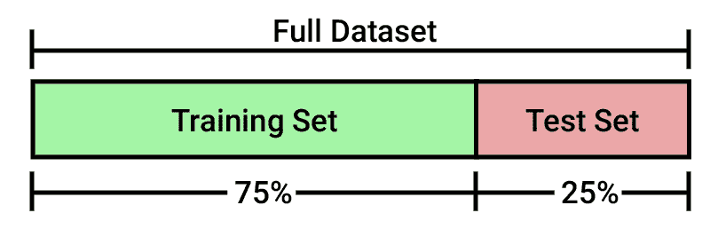
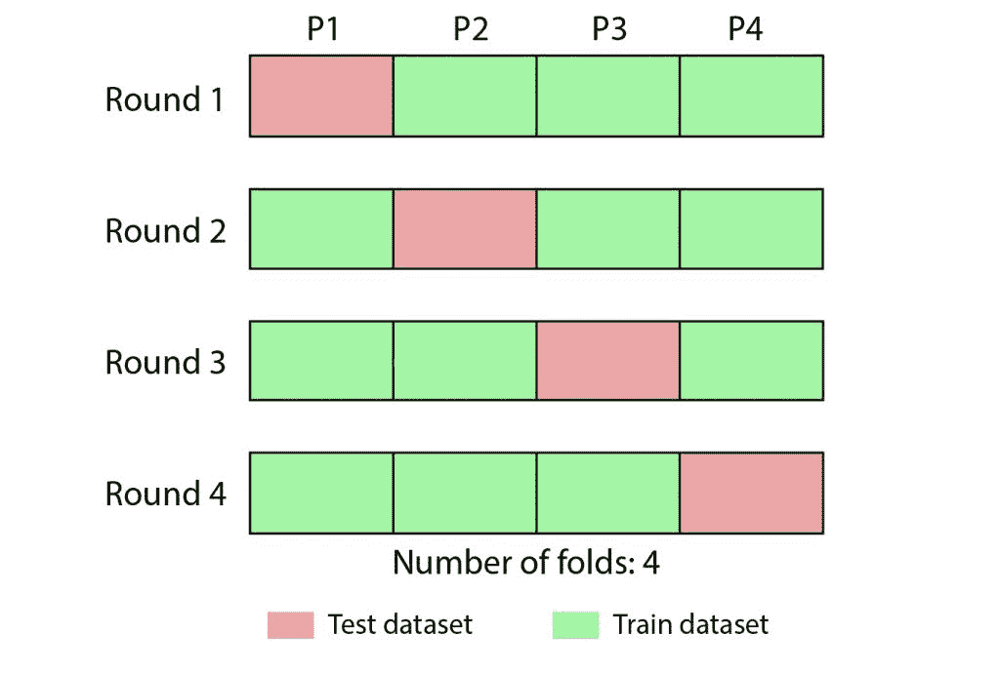
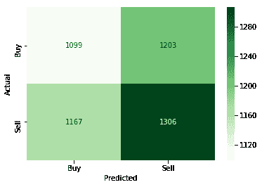

# 机器学习交易模型中的交叉验证

> 原文：<https://blog.quantinsti.com/cross-validation-machine-learning-trading-models/>

由[伊山沙阿](https://www.linkedin.com/in/ishan-shah-18393828/)

## **什么是机器学习中的交叉验证？**

机器学习中的交叉验证是一种提供机器学习模型性能的精确测量的技术。当模型用于未来未知的数据集时，这种性能将更接近您的预期。

The application of the machine learning models is to learn from the existing data and use that knowledge to predict future unseen events. The cross validation in machine learning model needs to be thoroughly done to profitably trade in live trading.After reading this, you will be able to:

1.  确定机器学习模型在预测买入信号和/或卖出信号方面是否良好
2.  展示你的机器学习交易模型在不同压力情景下的表现
3.  全面做机器学习交易模型的交叉验证

But before I explain how to do cross validation in machine learning model, I will first create a sample machine learning decision tree classifier model using price data of the Apple stock. Then, I'll implement various cross validation measures on this model. To implement this in Python, I'll follow the below steps

1.  [导入必要的库](#importlibrary)
2.  [获取数据](#fetchdata)
3.  [定义输入和输出数据集](#inputoutput)
4.  [训练机器学习模型](#trainmodel)

If you are already well versed with these steps and Python coding then you can skim through this part.

## **导入库**

In [1]:

```py
import quantrautil as q
import numpy as np
from sklearn import tree
```

 The libraries imported above will be used as follows:

1.  quantrautil -这将用于从雅虎财经获取 AAPL 股票的价格数据。
2.  [numpy](https://blog.quantinsti.com/python-numpy-tutorial-installation-arrays-random-sampling/) -对 AAPL 股票价格进行数据操作，计算输入特征和输出。如果你想了解更多关于 numpy 的信息，你可以在这里找到。
3.  sklearn 有很多工具和机器学习模型的实现。“树”将用于创建决策树分类器模型。


## **获取数据**

The next step is to import the price data of AAPL stock from quantrautil. The get_data function from [quantrautil](https://github.com/QuantInsti/Quantra-Courses/blob/master/quantrautil.py) is used to get the AAPL data for 19 years from 1 Jan 2000 to 31 Dec 2018 as shown below. The data is stored in the dataframe aapl.In [2]:

```py
aapl = q.get_data('aapl','2000-1-1','2019-1-1')
print(aapl.tail())
```

```py
[*********************100%***********************]  1 of 1 downloaded
                  Open        High         Low       Close   Adj Close  \
Date                                                                     
2018-12-24  148.149994  151.550003  146.589996  146.830002  146.830002   
2018-12-26  148.300003  157.229996  146.720001  157.169998  157.169998   
2018-12-27  155.839996  156.770004  150.070007  156.149994  156.149994   
2018-12-28  157.500000  158.520004  154.550003  156.229996  156.229996   
2018-12-31  158.529999  159.360001  156.479996  157.740005  157.740005   

Date         Volume         
2018-12-24  37169200  
2018-12-26  58582500  
2018-12-27  53117100  
2018-12-28  42291400  
2018-12-31  35003500  

```


## **创建输入和输出数据集**

In this step, I will create the input and output variable.

1.  输入变量:我使用了'(开盘价-收盘价)/开盘价'，'(高-低)/低'，最近 5 天回报率的标准差(std_5)，以及最近 5 天回报率的平均值(ret_5)
2.  输出变量:如果明天的收盘价高于今天的收盘价，则输出变量设置为 1，否则设置为-1。1 表示买入股票，-1 表示卖出股票。

The choice of these features as input and output is completely random. If you are interested to learn more about feature selection, then you can read [here](https://en.wikipedia.org/wiki/Feature_selection).In [3]:

```py
# Features construction 
aapl['Open-Close'] = (aapl.Open - aapl.Close)/aapl.Open
aapl['High-Low'] = (aapl.High - aapl.Low)/aapl.Low
aapl['percent_change'] = aapl['Adj Close'].pct_change()
aapl['std_5'] = aapl['percent_change'].rolling(5).std()
aapl['ret_5'] = aapl['percent_change'].rolling(5).mean()
aapl.dropna(inplace=True)

# X is the input variable
X = aapl[['Open-Close', 'High-Low', 'std_5', 'ret_5']]

# Y is the target or output variable
y = np.where(aapl['Adj Close'].shift(-1) > aapl['Adj Close'], 1, -1)
```


## **训练机器学习模型**

All set with the data! Let's train a decision tree classifier model. The DecisionTreeClassifier function from tree is stored in variable ‘clf’ and then a fit method is called on it with ‘X’ and ‘y’ dataset as the parameters so that the classifier model can learn the relationship between X and y.In [4]:

```py
clf = tree.DecisionTreeClassifier(random_state=5)
model = clf.fit(X, y)
```

The model is ready. But how do we do cross validation of this model? Here's how.

## **机器学习模型的交叉验证**

If the cross validation is done on the same data from which the model learned then it is a no brainer that the performance of the model is bound to be spectacular.In [5]:

```py
from sklearn.metrics import accuracy_score
print('Correct Prediction: ', accuracy_score(y, model.predict(X), normalize=False))
print('Total Prediction: ', X.shape[0])
```

```py
Correct Prediction:  4775
Total Prediction:  4775

```

As you can see above, all the predictions are correct. But there is a lot of Python code here. Yes! accuracy_score is a function from sklearn.metrics package which tells you how many predictions are correct. It takes as input the actual output (y) and predicted output (model.predict(X)), compares both the inputs and tells us how many of them were correct. If you want to see the output in percentage then set the normalized parameter to True as done below.In [6]:

```py
print(accuracy_score(y, model.predict(X), normalize=True)*100)
```

```py
100.0

```

### **您如何克服使用相同数据进行训练和测试的问题？**

One of the easiest and most widely used ways is to partition the data into two parts where one part of the data (training dataset) is used to train the model and the other part of the data (testing dataset) is used to test the model.   In [7]:

```py
# Total dataset length
dataset_length = aapl.shape[0]

# Training dataset length
split = int(dataset_length * 0.75)
split
```

Out[7]:

```py
3581
```

In [8]:

```py
# Splittiing the X and y into train and test datasets
X_train, X_test = X[:split], X[split:]
y_train, y_test = y[:split], y[split:]

# Print the size of the train and test dataset
print(X_train.shape, X_test.shape)
print(y_train.shape, y_test.shape)
```

```py
(3581, 4) (1194, 4)
(3581,) (1194,)

```

In the above code, the total dataset of 4775 points is divided into two parts; first 75% of dataset creates X_train and y_train which contains the dataset to train the model and the remaining 25% of dataset creates X_test and y_test which contains the dataset to test the model. The choice of 75% is random.In [9]:

```py
# Create the model on train dataset
model = clf.fit(X_train, y_train)
```

In [10]:

```py
# Calculate the accuracy
accuracy_score(y_test, model.predict(X_test), normalize=True)*100
```

Out[10]:

```py
49.413735343383586
```

If you test the model on test dataset then a significant drop in accuracy is seen from 100% to 49.41%. The model performance in test dataset is closer to what you can expect if you take this model for live trading. However, there is still a major problem. The cross validation in the model is done on a single test dataset. In this example, on last 1194 data points. It could be by sheer luck that this model was able to predict with 49.41% in the test dataset. If I change the length of the train-test split from 75% to 80% or use different data points say first 1194 data points, then the accuracy of the model can vary a lot. Therefore, there is a need to test on multiple unseen datasets. But how do you achieve this?

## **K 重交叉验证技术**

Don’t worry! K-fold cross validation technique, one of the most popular methods helps to overcome these problems. This method splits your dataset into K equal or close-to-equal parts. Each of these parts is called a "fold". For example, you can divide your dataset into 4 equal parts namely P1, P2, P3, P4\. The first model M1 is trained on P2, P3, and P4 and tested on P1\. The second model is trained on P1, P3, and P4 and tested on P2 and so on. In other words, the model i is trained on the union of all subsets except the ith. The performance of the model i is tested on the ith part. When this process is completed, you will end up with four accuracy values, one for each model. Then you can compute the mean and standard deviation of all the accuracy scores and use it to get an idea of how accurate you can expect the model to be.    Some questions that you might have.

### **你如何选择折叠的数量？**

The choice of the number of folds must allow the size of each validation partition to be large enough to provide a fair estimate of the model’s performance on it and shouldn’t be too small, say 2, such that we don’t have enough trained models to perform cross validation.

### **为什么这比原来的单次训练和试拆分的方法要好？**

Well, as discussed above that by choosing a different length for the train and the test data split, the model performance can vary quite a bit, depending on the specific data points that happen to end up in the training or testing dataset. This method gives a more stable estimate of how the model is likely to perform on average, instead of relying completely on a single model trained using a single training dataset.

### 如何在用于训练模型的数据集之前的数据集上执行模型的交叉验证？是不是历史不准确？

If you train the model on a data from January 2010 to December 2018 and test on data from January 2008 to December 2009\. Rightly so, the performance which we will obtain from the model will not be historically accurate. One of the limitations of this method. However, from the other side, this method can help to perform cross validation of how the model would have performed in the stress scenarios such as 2008\. For example, when investors ask how the model would perform if stress scenarios such as the dot com bubble, housing bubble, or qe tapering occur again. Then, you can show the out-of-sample results of the model when such scenarios occurred. That should be likely performance when such scenarios occur again.

### **用 Python 编写 K-fold 代码**

To code, KFold function from sklearn.model_selection package is used. You need to pass the number of splits required and whether to shuffle (True) the data points or not (False) to shuffle it and store it in a variable say kf. Then, call split function on kf and X as the input. The split function splits the index of the X and returns an iterator object. The iterator object is iterated using for loop and the integer index of train and test is printed.In [11]:

```py
from sklearn.model_selection import KFold
kf = KFold(n_splits=4,shuffle=False)
```

In [12]:

```py
kf.split(X)
```

Out[12]:

```py
<generator object _BaseKFold.split at 0x0000000009936F68>
```

In [13]:

```py
print("Train: ", "TEST:")
for train_index, test_index in kf.split(X):
     print(train_index, test_index)
```

```py
Train:  TEST:
[1194 1195 1196 ... 4772 4773 4774] [   0    1    2 ... 1191 1192 1193]
[   0    1    2 ... 4772 4773 4774] [1194 1195 1196 ... 2385 2386 2387]
[   0    1    2 ... 4772 4773 4774] [2388 2389 2390 ... 3579 3580 3581]
[   0    1    2 ... 3579 3580 3581] [3582 3583 3584 ... 4772 4773 4774]

```

The total dataset of 4775 points is divided into four different ways. For the first fold, points 0 to 1193 are used as test dataset and the points 1194 to 4774 are used as train dataset and so on. I'll create four different models for each of the fold shown above and determine the accuracy for each of the models. Again, this will be done through a for loop, by calling the fit method to train the model and by calling accuracy_score to determine the accuracy of the model.In [14]:

```py
# Initialize the accuracy of the models to blank list. The accuracy of each model will be appended to this list
accuracy_model = []

# Iterate over each train-test split
for train_index, test_index in kf.split(X):
    # Split train-test
    X_train, X_test = X.iloc[train_index], X.iloc[test_index]
    y_train, y_test = y[train_index], y[test_index] # Train the model
    model = clf.fit(X_train, y_train)
    # Append to accuracy_model the accuracy of the model
    accuracy_model.append(accuracy_score(y_test, model.predict(X_test), normalize=True)*100)# Print the accuracy 
print(accuracy_model)
```

```py
[50.502512562814076, 49.413735343383586, 51.75879396984925, 49.79044425817267]

```

### **模型的稳定性**

Let's determine the variation and average accuracy of the model by calling the standard deviation and mean function from the numpy package.In [15]:

```py
np.std(accuracy_model)
```

Out[15]:

```py
0.8939494614206329
```

In [16]:

```py
np.mean(accuracy_model)
```

Out[16]:

```py
50.3663715335549
```

The accuracy of the model is 50.36% +/- 0.89%. This is more likely to be the behaviour of the model in live trading.

## **混淆矩阵**

With the above accuracy, you got an idea about the accuracy of the model. But what is the model's accuracy in predicting each label such as Buy and Sell? This can be determined by using the confusion matrix. In the above example, the confusion matrix will tell you the number of times the actual value was 'buy' and predicted was also 'buy', actual value was 'buy' but predicted was 'sell' and so on.In [18]:

```py
# Import the pandas for creating a dataframe
import pandas as pd

# To calculate the confusion matrix
from sklearn.metrics import confusion_matrix

# To plot
%matplotlib inline
import matplotlib.pyplot as plt
import seaborn as sn

# Initialize the array to zero which will store the confusion matrix
array = [[0,0],[0,0]]

# For each train-test split: train, predict and compute the confusion matrix
for train_index, test_index in kf.split(X):
    # Train test split
    X_train, X_test = X.iloc[train_index], X.iloc[test_index]
    y_train, y_test = y[train_index], y[test_index]
    # Train the model
    model = clf.fit(X_train, y_train)
    # Calculate the confusion matrix
    c = confusion_matrix(y_test, model.predict(X_test)) # Add the score to the previous confusion matrix of previous model
    array = array + c
# Create a pandas dataframe that stores the output of confusion matrix 
df = pd.DataFrame(array, index = ['Buy', 'Sell'], columns = ['Buy', 'Sell'])

# Plot the heatmap
sn.heatmap(df, annot=True, cmap='Greens', fmt='g')
plt.xlabel('Predicted')
plt.ylabel('Actual')
plt.show()
```

 From the above confusion matrix, if you focus on the darker green zone (1306), that is when actual value was sell and model also predicted sell. Then, out of 2509 (1306+1203) times, the model was right 1306 times when it predicted the sell signal. That is an accuracy of 52%. From this, we can infer that the model is better in predicting the sell signal compared to the buy signal. Time to say goodbye! I hope you enjoyed reading this blog. Do share your feedback, comments, and request for the blogs. Cross validation in machine learning is an important tool in the trader's handbook as it helps the trader to know the effectiveness of their strategies. Now that you know the methodology of cross validation, you should check the course on Artificial Intelligence and test the effectiveness of the models.*Disclaimer: All data and information provided in this article are for informational purposes only. QuantInsti® makes no representations as to accuracy, completeness, currentness, suitability, or validity of any information in this article and will not be liable for any errors, omissions, or delays in this information or any losses, injuries, or damages arising from its display or use. All information is provided on an as-is basis.* **Suggested read: **[Working Of Neural Networks For Stock Price Prediction](https://blog.quantinsti.com/working-neural-networks-stock-price-prediction)